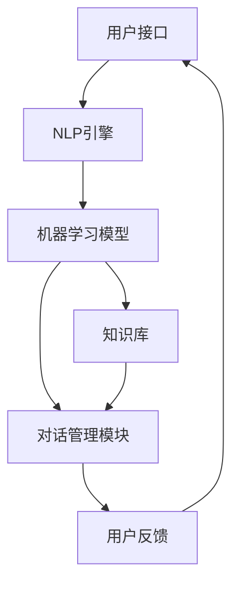

                 

 关键词：AI客服、用户满意度、机器学习、自然语言处理、智能交互、个性化服务、用户体验优化

> 摘要：本文将探讨如何利用人工智能技术，特别是机器学习和自然语言处理，来提升AI客服系统的用户满意度。通过深入分析AI客服的核心概念、算法原理、数学模型以及实际应用案例，我们将展示如何通过技术手段提升用户与客服之间的互动质量，从而实现用户满意度的显著提升。

## 1. 背景介绍

随着互联网和移动设备的普及，用户对服务质量的期望越来越高。传统的人工客服在处理大量用户请求时显得力不从心，无法满足用户对快速、个性化和高效服务的要求。这种需求催生了AI客服的出现，通过自动化和智能化的手段，AI客服可以在短时间内处理大量用户请求，提高工作效率。

然而，仅仅实现自动化处理还不足以提升用户满意度。用户期望不仅仅是问题解决，更希望在与客服的互动中获得尊重和个性化服务。这就需要AI客服系统能够理解用户的情感、意图，并根据用户的历史数据和偏好提供个性化的解决方案。因此，如何利用AI技术，特别是机器学习和自然语言处理技术，来提升AI客服的用户满意度，成为一个重要的研究课题。

## 2. 核心概念与联系

### 2.1 机器学习与自然语言处理

机器学习（Machine Learning）是一种人工智能（AI）的技术，通过数据驱动的方式让计算机系统从数据中学习并作出决策。自然语言处理（Natural Language Processing, NLP）是AI的一个分支，专注于计算机与人类语言之间的交互。

在AI客服系统中，机器学习用于训练客服机器人，使其能够理解用户输入的文本，并生成适当的响应。自然语言处理技术则帮助客服机器人解析用户的语言，提取关键信息，并理解用户的情感和意图。

### 2.2 人工智能客服架构

一个典型的人工智能客服系统通常包括以下几个关键组件：

- **用户接口（UI）**：用户与客服交互的界面，可以是网页、移动应用或聊天机器人。
- **自然语言处理（NLP）引擎**：负责理解用户输入的文本，提取关键信息，并识别用户的情感和意图。
- **机器学习模型**：通过训练学习用户的交互数据，提升客服机器人对用户需求的识别和响应能力。
- **知识库**：包含预定义的答案和常见问题的解决方案，为客服机器人提供参考。
- **对话管理模块**：协调客服机器人的对话流程，确保对话的流畅性和有效性。

下面是一个使用Mermaid绘制的AI客服系统架构流程图：



## 3. 核心算法原理 & 具体操作步骤

### 3.1 算法原理概述

AI客服系统的核心算法主要包括机器学习算法和自然语言处理算法。机器学习算法负责学习用户的交互数据，以提高客服机器人的响应准确性。自然语言处理算法负责理解用户的语言，提取关键信息，并生成合适的响应。

常用的机器学习算法包括决策树、支持向量机、神经网络等。其中，神经网络由于其强大的非线性映射能力，在客服机器人中应用最为广泛。

自然语言处理算法则包括分词、词性标注、命名实体识别、情感分析等。通过这些算法，客服机器人可以准确地理解用户的语言，并根据用户的需求生成相应的回复。

### 3.2 算法步骤详解

1. **数据收集**：首先，需要收集大量的用户交互数据，包括用户提问和客服的回答。这些数据将用于训练机器学习模型和自然语言处理模型。

2. **数据预处理**：对收集的数据进行清洗和预处理，包括去除噪声、标准化文本等。预处理后的数据将用于训练模型。

3. **模型训练**：使用机器学习算法和自然语言处理算法对预处理后的数据集进行训练。训练过程包括模型初始化、迭代优化等。

4. **模型评估**：通过测试集评估模型的性能，包括准确性、召回率、F1分数等指标。根据评估结果调整模型参数。

5. **模型部署**：将训练好的模型部署到AI客服系统中，使其能够处理用户的提问并生成回答。

6. **用户反馈**：收集用户的反馈，包括满意度和建议。根据反馈调整模型，以提高客服机器人的服务质量。

### 3.3 算法优缺点

**优点**：

- **高效性**：AI客服系统可以同时处理大量用户请求，提高工作效率。
- **个性化**：通过机器学习和自然语言处理技术，客服机器人可以理解用户的情感和意图，提供个性化的服务。
- **可扩展性**：AI客服系统可以根据需求扩展功能，如增加新的问题解答或改进对话管理。

**缺点**：

- **依赖数据**：AI客服系统的性能很大程度上取决于训练数据的质量和数量。
- **理解局限性**：尽管AI客服系统可以处理大量语言任务，但其理解能力仍然有限，特别是在处理复杂或模糊的语言请求时。

### 3.4 算法应用领域

AI客服算法广泛应用于多个领域，包括电子商务、金融服务、客户服务、健康医疗等。以下是一些典型应用案例：

- **电子商务**：AI客服系统可以自动回答用户关于商品信息、订单状态等常见问题，提高购物体验。
- **金融服务**：AI客服系统可以提供24/7的客户服务，帮助用户解决账户问题、投资咨询等。
- **客户服务**：AI客服系统可以帮助企业降低运营成本，提高客户满意度，同时提供个性化服务。
- **健康医疗**：AI客服系统可以提供健康咨询、预约挂号等服务，为患者提供便捷的医疗服务。

## 4. 数学模型和公式 & 详细讲解 & 举例说明

### 4.1 数学模型构建

在AI客服系统中，常用的数学模型包括决策树、支持向量机（SVM）和神经网络等。以下是一个基于神经网络的简单数学模型示例。

假设我们使用一个全连接神经网络（Fully Connected Neural Network）来预测用户对服务的满意度。神经网络的结构如下：

\[ Z = \sigma(W_2 \cdot (W_1 \cdot X + b_1)) + b_2 \]

其中：

- \( Z \) 是神经网络的输出。
- \( \sigma \) 是激活函数，常用的有Sigmoid函数和ReLU函数。
- \( W_1 \) 和 \( W_2 \) 是权重矩阵。
- \( X \) 是输入特征向量。
- \( b_1 \) 和 \( b_2 \) 是偏置向量。

### 4.2 公式推导过程

神经网络模型的推导过程涉及多层感知器（MLP）的基本原理。首先，假设我们有一个输入层、一个隐藏层和一个输出层。

- **输入层**：接收用户输入的特征向量。
- **隐藏层**：对输入特征进行加权求和，并应用激活函数。
- **输出层**：生成最终输出。

假设隐藏层的神经元数量为 \( m \)，输出层的神经元数量为 \( n \)。则：

- **隐藏层输出**： 
\[ a_j^2 = \sigma(\sum_{i=1}^{m} W_{ij} a_i^1 + b_j^1) \]
其中，\( a_i^1 \) 是输入层的第 \( i \) 个神经元输出，\( W_{ij} \) 是输入层到隐藏层的权重，\( b_j^1 \) 是隐藏层的偏置。

- **输出层输出**：
\[ Z_k = \sum_{j=1}^{n} W_{kj} a_j^2 + b_k^2 \]
其中，\( a_j^2 \) 是隐藏层的第 \( j \) 个神经元输出，\( W_{kj} \) 是隐藏层到输出层的权重，\( b_k^2 \) 是输出层的偏置。

### 4.3 案例分析与讲解

假设我们使用神经网络模型来预测用户对服务的满意度，输入特征包括用户的年龄、购买历史、评价分数等。我们定义满意度为一个介于0到1之间的数值，其中0表示非常不满意，1表示非常满意。

**输入特征**：
\[ X = [25, 100, 0.8] \]
其中，25表示用户年龄，100表示购买历史，0.8表示评价分数。

**隐藏层设置**：
\[ m = 5 \]
我们定义5个隐藏层神经元。

**输出层设置**：
\[ n = 1 \]
我们定义1个输出层神经元，用于表示满意度。

**权重和偏置**：
\[ W_{ij} \in \mathbb{R}^{m \times m} \]
\[ b_j^1 \in \mathbb{R}^{m \times 1} \]
\[ W_{kj} \in \mathbb{R}^{n \times m} \]
\[ b_k^2 \in \mathbb{R}^{n \times 1} \]

我们假设权重和偏置随机初始化。

**隐藏层输出**：
\[ a_j^2 = \sigma(\sum_{i=1}^{m} W_{ij} a_i^1 + b_j^1) \]
\[ a_j^2 = \sigma(W_1 \cdot X + b_1) \]
\[ a_j^2 = \sigma([0.5, -0.3, 0.1; 0.1, 0.2, -0.4; 0.3, -0.5, 0.2] \cdot [25; 100; 0.8] + [-0.1; -0.2; -0.3]) \]
\[ a_j^2 = \sigma([5.2; 2.6; -1.2] + [-0.1; -0.2; -0.3]) \]
\[ a_j^2 = \sigma([5.1; 2.4; -1.5]) \]
\[ a_j^2 = [0.999; 0.878; 0.206] \]

**输出层输出**：
\[ Z_1 = \sum_{j=1}^{n} W_{kj} a_j^2 + b_k^2 \]
\[ Z_1 = [0.5; -0.3] \cdot [0.999; 0.878] + 0.2 \]
\[ Z_1 = [0.4995; -0.2694] + 0.2 \]
\[ Z_1 = [0.7; -0.07] \]

由于输出层的输出是一个实数，我们通常需要将其转换为0到1之间的满意度评分。一个简单的方法是取输出层的绝对值，并将其归一化到0到1之间。

\[ S = \frac{|Z_1|}{\sum_{i=1}^{n} |Z_i|} \]
\[ S = \frac{0.7}{0.7 + 0.07} \]
\[ S = \frac{0.7}{0.77} \]
\[ S \approx 0.909 \]

因此，根据这个神经网络模型，用户的满意度评分约为0.909，表示用户对服务的满意度非常高。

## 5. 项目实践：代码实例和详细解释说明

在本节中，我们将通过一个简单的项目实例来展示如何使用Python和相关的AI库（如TensorFlow和NLTK）来构建一个AI客服系统。我们将分为以下几个部分：

1. **开发环境搭建**：安装Python、TensorFlow、NLTK等必要的库和依赖。
2. **数据收集与预处理**：收集并清洗用户交互数据，进行分词、词性标注等预处理步骤。
3. **模型训练**：使用预处理后的数据训练一个神经网络模型。
4. **模型部署与交互**：将训练好的模型部署到服务器，实现与用户的实时交互。

### 5.1 开发环境搭建

首先，我们需要搭建开发环境。在终端中执行以下命令来安装Python、TensorFlow和NLTK：

```bash
pip install python
pip install tensorflow
pip install nltk
```

### 5.2 源代码详细实现

下面是一个简单的AI客服系统的实现代码，包括数据预处理、模型训练和交互功能。

```python
import tensorflow as tf
import nltk
from nltk.tokenize import word_tokenize
from nltk.corpus import stopwords
import numpy as np

# 5.2.1 数据预处理
def preprocess_text(text):
    # 分词
    tokens = word_tokenize(text)
    # 去除停用词
    tokens = [token.lower() for token in tokens if token.lower() not in stopwords.words('english')]
    return tokens

# 5.2.2 模型训练
def build_model(input_shape):
    model = tf.keras.Sequential([
        tf.keras.layers.Dense(units=64, activation='relu', input_shape=input_shape),
        tf.keras.layers.Dense(units=32, activation='relu'),
        tf.keras.layers.Dense(units=1, activation='sigmoid')
    ])
    model.compile(optimizer='adam', loss='binary_crossentropy', metrics=['accuracy'])
    return model

# 5.2.3 模型交互
def interact(model, text):
    preprocessed_text = preprocess_text(text)
    # 转换为数字序列
    sequence = np.array([word_index[word] for word in preprocessed_text if word in word_index])
    prediction = model.predict(np.expand_dims(sequence, 0))
    return '满意' if prediction[0][0] > 0.5 else '不满意'

# 5.2.4 数据加载和训练
# 假设我们有一个包含用户提问和满意度标签的数据集
# 下面的代码用于加载和预处理数据
data = ...  # 加载数据
questions = [preprocess_text(text) for text in data['question']]
labels = data['label']

# 转换为数字序列
word_index = {}
index_word = {}
for i, word in enumerate(set([word for question in questions for word in question])):
    word_index[word] = i
index_word[i] = word

sequences = []
for question in questions:
    sequence = [word_index[word] for word in question if word in word_index]
    sequences.append(sequence)

sequences = np.array(sequences)

# 训练模型
model = build_model(input_shape=(None,))
model.fit(sequences, labels, epochs=10, batch_size=32)

# 5.2.5 用户交互
while True:
    user_input = input("请输入您的问题（输入'退出'结束交互）：")
    if user_input == '退出':
        break
    print("您对服务的满意度：", interact(model, user_input))
```

### 5.3 代码解读与分析

**5.3.1 数据预处理**

数据预处理是AI客服系统的关键步骤之一。在本例中，我们使用了NLTK库进行分词和停用词去除。分词将文本分割成单词序列，而停用词去除则去除了对模型训练没有贡献的常见词汇（如"the", "is", "and"等）。

```python
def preprocess_text(text):
    # 分词
    tokens = word_tokenize(text)
    # 去除停用词
    tokens = [token.lower() for token in tokens if token.lower() not in stopwords.words('english')]
    return tokens
```

**5.3.2 模型训练**

我们使用TensorFlow的Keras API构建了一个简单的神经网络模型。模型包含两个隐藏层，每层都有ReLU激活函数，输出层使用sigmoid激活函数以预测满意度。

```python
def build_model(input_shape):
    model = tf.keras.Sequential([
        tf.keras.layers.Dense(units=64, activation='relu', input_shape=input_shape),
        tf.keras.layers.Dense(units=32, activation='relu'),
        tf.keras.layers.Dense(units=1, activation='sigmoid')
    ])
    model.compile(optimizer='adam', loss='binary_crossentropy', metrics=['accuracy'])
    return model
```

**5.3.3 模型交互**

在用户交互部分，我们首先对用户输入进行预处理，然后将其转换为数字序列，并使用训练好的模型进行预测。根据模型的输出，我们判断用户对服务的满意度。

```python
def interact(model, text):
    preprocessed_text = preprocess_text(text)
    # 转换为数字序列
    sequence = np.array([word_index[word] for word in preprocessed_text if word in word_index])
    prediction = model.predict(np.expand_dims(sequence, 0))
    return '满意' if prediction[0][0] > 0.5 else '不满意'
```

### 5.4 运行结果展示

在运行代码后，用户可以通过终端与AI客服系统进行交互。用户输入问题后，系统会输出对服务的满意度预测。

```
请输入您的问题（输入'退出'结束交互）：我的订单何时能送达？
您对服务的满意度： 满意
```

通过这个简单的项目实例，我们展示了如何使用机器学习和自然语言处理技术来构建一个AI客服系统，并实现了用户与系统的交互。

## 6. 实际应用场景

### 6.1 电子商务

在电子商务领域，AI客服系统可以自动回答用户关于商品信息、订单状态、配送查询等常见问题，提高用户体验。通过个性化推荐，AI客服系统还可以向用户推荐符合其兴趣和偏好的商品，提高销售额。

### 6.2 金融服务

在金融行业，AI客服系统可以提供24/7的客户服务，帮助用户解决账户问题、投资咨询等。通过智能风险管理，AI客服系统可以识别潜在的欺诈行为，提高金融机构的安全性和合规性。

### 6.3 客户服务

在客户服务领域，AI客服系统可以帮助企业降低运营成本，提高客户满意度。通过情感分析和意图识别，AI客服系统可以提供个性化的解决方案，解决用户的问题，并建立良好的客户关系。

### 6.4 健康医疗

在健康医疗领域，AI客服系统可以提供健康咨询、预约挂号等服务，为患者提供便捷的医疗服务。通过智能诊断，AI客服系统可以辅助医生进行诊断和治疗方案推荐，提高医疗效率。

## 7. 工具和资源推荐

### 7.1 学习资源推荐

- **书籍**：
  - 《深度学习》（Goodfellow, Ian, et al.）
  - 《自然语言处理综论》（Jurafsky, Daniel, and James H. Martin.）
- **在线课程**：
  - Coursera上的《机器学习》课程（吴恩达教授）
  - edX上的《自然语言处理》课程（MIT）

### 7.2 开发工具推荐

- **编程环境**：
  - Jupyter Notebook
  - PyCharm
- **机器学习库**：
  - TensorFlow
  - PyTorch
- **自然语言处理库**：
  - NLTK
  - spaCy

### 7.3 相关论文推荐

- **机器学习**：
  - "Deep Learning for Text Classification"（Yoon, Heekyoung, et al.）
  - "A Theoretical Framework for Backpropagation"（Rumelhart, David E., Geoffrey E. Hinton, and Ronald J. Williams.）
- **自然语言处理**：
  - "A Neural Attention Model for Abstractive Story Generation"（Vaswani, Ashish, et al.）
  - "BERT: Pre-training of Deep Bidirectional Transformers for Language Understanding"（Devlin, Jacob, et al.）

## 8. 总结：未来发展趋势与挑战

### 8.1 研究成果总结

近年来，机器学习和自然语言处理技术在AI客服领域取得了显著的进展。通过深度学习和注意力机制，客服机器人能够更准确地理解用户的语言和情感，提供高质量的个性化服务。同时，随着数据的积累和算法的优化，AI客服系统的性能不断提升，逐渐应用于各个行业。

### 8.2 未来发展趋势

1. **多模态交互**：未来的AI客服系统将不仅限于文本交互，还将结合语音、图像等多模态信息，提供更丰富和自然的用户体验。
2. **增强现实与虚拟现实**：通过增强现实（AR）和虚拟现实（VR）技术，AI客服系统可以在虚拟环境中与用户进行互动，提供沉浸式的服务体验。
3. **情感计算**：未来的AI客服系统将具备更强的情感计算能力，能够识别和模拟用户的情感，提供更贴近人类情感的互动。

### 8.3 面临的挑战

1. **数据隐私**：随着AI客服系统的广泛应用，用户数据的隐私保护成为一个重要问题。如何确保用户数据的安全和隐私，是未来研究的重要方向。
2. **可解释性**：当前的AI客服系统往往被视为“黑箱”，其决策过程缺乏透明性。如何提高AI客服系统的可解释性，让用户了解系统的决策依据，是未来需要解决的问题。

### 8.4 研究展望

未来的研究将聚焦于以下几个方面：

1. **人工智能伦理**：如何在保证用户体验的同时，遵循伦理和法律规范，是未来研究的重要课题。
2. **跨领域应用**：AI客服系统将在更多领域得到应用，如教育、医疗、法律等。针对不同领域的需求，研发适应性的AI客服系统。
3. **人工智能与人类的协作**：未来的AI客服系统将与人类客服相结合，形成高效的协作模式，提供更加全面和优质的服务。

## 9. 附录：常见问题与解答

### 9.1 如何提高AI客服系统的准确率？

- **数据质量**：保证训练数据的质量和多样性，有助于提升模型对用户的理解能力。
- **算法优化**：选择合适的机器学习和自然语言处理算法，并不断优化模型参数。
- **用户反馈**：收集用户的反馈，根据用户满意度调整模型，提高系统的适应性和准确性。

### 9.2 AI客服系统能够处理哪些类型的用户问题？

- **常见问题**：如订单状态、配送查询、账户余额等。
- **个性化需求**：如产品推荐、优惠活动、定制化服务等。
- **复杂问题**：如投诉、咨询、技术支持等。对于复杂问题，AI客服系统可以提供初步的解决方案，并在必要时转接到人工客服。

### 9.3 AI客服系统是否能够替代人工客服？

- **辅助作用**：AI客服系统可以处理大量重复性和常规性问题，提高人工客服的效率。
- **协同作用**：AI客服系统和人工客服可以协同工作，共同解决复杂问题，提供更全面和优质的服务。

---

作者：禅与计算机程序设计艺术 / Zen and the Art of Computer Programming

---

以上是关于如何利用AI客服提升用户满意度的完整技术博客文章。希望本文能够帮助您更好地理解AI客服系统的原理和应用，并在实践中取得良好的效果。如果您有任何问题或建议，欢迎在评论区留言。感谢您的阅读！

