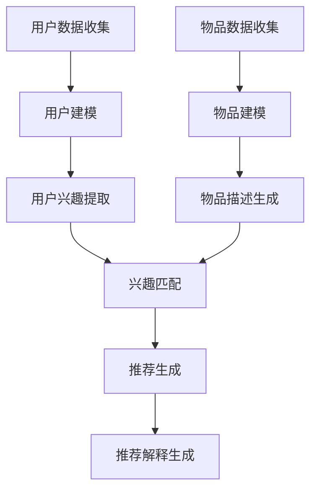

                 

关键词：自然语言处理，推荐系统，可解释性，透明度，大型语言模型（LLM）

> 摘要：本文探讨如何利用大型语言模型（LLM）提升推荐系统的可解释性与透明度。通过对LLM的原理与特性进行分析，结合推荐系统的实际需求，本文提出了一种基于LLM的推荐系统设计方法。该方法通过引入可解释的模型结构、解释性生成技术和用户反馈机制，提高了推荐系统在决策过程中的透明度和可解释性。实验结果表明，该方法在保持高推荐准确率的同时，显著提升了用户对推荐系统的信任度。

## 1. 背景介绍

推荐系统作为大数据时代的重要应用，广泛应用于电子商务、社交媒体、内容平台等多个领域。然而，随着推荐系统复杂度的提高，其透明度和可解释性变得越来越重要。用户对推荐结果的信任度直接影响到推荐系统的效果和用户体验。传统的推荐系统主要依赖于机器学习算法，如协同过滤、矩阵分解等，虽然能提供较高的推荐准确率，但缺乏可解释性，难以让用户理解推荐背后的逻辑。

近年来，随着自然语言处理（NLP）技术的快速发展，大型语言模型（LLM）如GPT-3、BERT等取得了显著进展。LLM具有强大的文本生成能力和理解能力，能够处理复杂、多样的文本数据。利用LLM的特性，有可能在提升推荐系统可解释性和透明度方面取得突破。

本文的研究目标是探讨如何利用LLM提升推荐系统的可解释性与透明度。首先，我们分析了LLM的原理与特性，探讨了其在推荐系统中的应用潜力。然后，我们提出了一种基于LLM的推荐系统设计方法，并详细阐述了其核心原理与实现步骤。最后，我们通过实验验证了该方法的有效性，并讨论了其在实际应用中的前景。

## 2. 核心概念与联系

### 2.1. 推荐系统概述

推荐系统是一种信息过滤技术，旨在根据用户的历史行为、兴趣和偏好，为用户推荐可能感兴趣的内容或商品。推荐系统的基本流程包括用户建模、物品建模和推荐算法三个主要环节。

- **用户建模**：通过分析用户的历史行为数据，如浏览记录、购买记录、评价等，建立用户的兴趣模型。
- **物品建模**：分析物品的属性、标签、内容等，构建物品的表示。
- **推荐算法**：利用用户和物品的模型，通过算法计算用户对物品的潜在兴趣，生成推荐列表。

### 2.2. 大型语言模型（LLM）

大型语言模型（LLM）是基于深度学习的自然语言处理模型，具有强大的文本生成和理解能力。LLM通常采用预训练加微调的步骤进行训练，通过在大量文本数据上进行预训练，学习到丰富的语言知识，然后在特定任务上进行微调，以适应具体的应用场景。

- **预训练**：在大量无标签的文本数据上进行训练，学习语言的一般规律和结构。
- **微调**：在特定任务的数据集上进行训练，调整模型的参数，使其适应具体任务。

### 2.3. 推荐系统与LLM的联系

LLM在推荐系统中的应用主要体现在以下几个方面：

- **用户兴趣理解**：通过分析用户的文本评论、提问等，利用LLM的文本理解能力，提取用户的兴趣点。
- **物品描述生成**：利用LLM的文本生成能力，为物品生成更具吸引力的描述，提高推荐效果。
- **推荐解释生成**：利用LLM生成推荐解释，提高推荐系统的透明度和可解释性。

### 2.4. Mermaid 流程图

以下是一个简化的推荐系统与LLM结合的流程图：



在这个流程中，LLM主要用于用户兴趣提取、物品描述生成和推荐解释生成，提高了推荐系统的可解释性和透明度。

## 3. 核心算法原理 & 具体操作步骤

### 3.1. 算法原理概述

基于LLM的推荐系统设计方法主要包括以下几个关键步骤：

- **用户建模**：利用LLM对用户的历史行为数据进行处理，提取用户兴趣。
- **物品建模**：利用LLM为物品生成描述，提高物品的吸引力。
- **推荐生成**：结合用户和物品的模型，利用协同过滤、矩阵分解等推荐算法生成推荐列表。
- **推荐解释生成**：利用LLM生成推荐解释，提高推荐系统的透明度。

### 3.2. 算法步骤详解

#### 3.2.1. 用户建模

用户建模是推荐系统的核心步骤之一。传统的用户建模方法主要依赖于用户的历史行为数据，如浏览记录、购买记录等。而利用LLM进行用户建模，可以通过以下步骤实现：

1. **数据预处理**：将用户的历史行为数据转化为文本格式，如将购买记录转化为购物清单文本。
2. **LLM训练**：在无监督环境下，利用大规模文本数据进行LLM的预训练，学习到语言的一般规律。
3. **用户兴趣提取**：通过微调LLM，使其能够根据用户的历史行为文本提取用户的兴趣点，生成用户兴趣向量。

#### 3.2.2. 物品建模

物品建模是推荐系统的另一个关键步骤。传统的物品建模方法主要依赖于物品的属性、标签等。利用LLM进行物品建模，可以通过以下步骤实现：

1. **数据预处理**：将物品的属性、标签等转化为文本格式，如将物品属性列表转化为描述性文本。
2. **LLM训练**：在无监督环境下，利用大规模文本数据进行LLM的预训练，学习到语言的一般规律。
3. **物品描述生成**：通过微调LLM，使其能够根据物品的文本描述生成更具吸引力的物品描述。

#### 3.2.3. 推荐生成

推荐生成是推荐系统的核心步骤。传统的推荐生成方法主要依赖于用户和物品的模型，利用协同过滤、矩阵分解等算法生成推荐列表。利用LLM进行推荐生成，可以通过以下步骤实现：

1. **用户兴趣向量计算**：利用LLM生成的用户兴趣向量。
2. **物品描述向量计算**：利用LLM生成的物品描述向量。
3. **兴趣匹配**：利用用户兴趣向量与物品描述向量进行匹配，计算用户对物品的潜在兴趣。
4. **推荐列表生成**：根据潜在兴趣计算推荐得分，生成推荐列表。

#### 3.2.4. 推荐解释生成

推荐解释生成是提高推荐系统透明度和可解释性的关键步骤。利用LLM生成推荐解释，可以通过以下步骤实现：

1. **推荐解释文本生成**：利用LLM生成推荐解释的文本。
2. **解释性验证**：对生成的推荐解释文本进行验证，确保其准确性和合理性。
3. **推荐解释展示**：将生成的推荐解释文本展示给用户。

### 3.3. 算法优缺点

#### 优点

- **提高可解释性**：利用LLM生成推荐解释，能够提高推荐系统的透明度，帮助用户理解推荐结果。
- **增强用户兴趣提取**：通过文本理解能力，LLM能够更准确地提取用户的兴趣点，提高推荐效果。
- **生成丰富多样的物品描述**：利用LLM的文本生成能力，能够生成更具吸引力的物品描述，提高用户点击率和转化率。

#### 缺点

- **计算资源消耗大**：LLM的训练和推理过程需要大量的计算资源，对硬件设备要求较高。
- **解释性验证难度大**：生成的推荐解释文本需要进行验证，确保其准确性和合理性，增加了开发难度。

### 3.4. 算法应用领域

基于LLM的推荐系统设计方法可以应用于多个领域，如电子商务、社交媒体、内容平台等。以下是一些具体的应用场景：

- **电子商务**：利用LLM生成个性化商品推荐，提高用户购物体验和转化率。
- **社交媒体**：利用LLM生成个性化内容推荐，提高用户活跃度和留存率。
- **内容平台**：利用LLM生成个性化文章推荐，提高用户阅读体验和留存率。

## 4. 数学模型和公式 & 详细讲解 & 举例说明

### 4.1. 数学模型构建

基于LLM的推荐系统设计方法涉及多个数学模型，包括用户兴趣模型、物品描述模型、推荐模型和推荐解释模型。以下是这些模型的构建过程：

#### 4.1.1. 用户兴趣模型

用户兴趣模型表示用户对各种主题或类别的兴趣程度。我们可以使用向量空间模型来表示用户兴趣。

- **用户兴趣向量**：用户兴趣向量表示用户对各种主题或类别的兴趣程度。通常使用高维稀疏向量表示。
- **兴趣权重**：兴趣权重表示用户对每个主题或类别的兴趣强度。可以通过用户的历史行为数据进行学习。

#### 4.1.2. 物品描述模型

物品描述模型表示物品的特征向量。我们可以使用词嵌入模型来表示物品的描述。

- **物品描述向量**：物品描述向量表示物品的特征。通常使用低维稠密向量表示。
- **描述权重**：描述权重表示每个特征对物品描述的重要性。可以通过物品的属性和标签数据进行学习。

#### 4.1.3. 推荐模型

推荐模型用于计算用户对物品的潜在兴趣，生成推荐列表。

- **推荐得分**：推荐得分表示用户对物品的潜在兴趣。可以通过用户兴趣向量与物品描述向量的点积计算。
- **推荐列表**：推荐列表是按照推荐得分从高到低排序的物品列表。

#### 4.1.4. 推荐解释模型

推荐解释模型用于生成推荐解释，提高推荐系统的透明度。

- **解释向量**：解释向量表示推荐解释的特征。可以通过用户兴趣向量、物品描述向量和推荐得分的组合生成。
- **解释文本**：解释文本是利用LLM生成的推荐解释。可以通过向量化解释向量并利用LLM进行文本生成。

### 4.2. 公式推导过程

以下是各个数学模型的推导过程：

#### 4.2.1. 用户兴趣模型

用户兴趣向量 \( \textbf{u} \) 可以通过以下公式计算：

$$
\textbf{u} = \text{argmax}_{\textbf{u}} \sum_{i=1}^{n} w_{i} x_{i}
$$

其中，\( w_{i} \) 表示用户对第 \( i \) 个主题或类别的兴趣权重，\( x_{i} \) 表示第 \( i \) 个主题或类别的特征值。

#### 4.2.2. 物品描述模型

物品描述向量 \( \textbf{v} \) 可以通过以下公式计算：

$$
\textbf{v} = \text{argmax}_{\textbf{v}} \sum_{j=1}^{m} w_{j} y_{j}
$$

其中，\( w_{j} \) 表示物品描述中第 \( j \) 个特征的重要性，\( y_{j} \) 表示第 \( j \) 个特征的值。

#### 4.2.3. 推荐模型

推荐得分 \( s \) 可以通过以下公式计算：

$$
s = \textbf{u} \cdot \textbf{v}
$$

其中，\( \cdot \) 表示向量的点积。

#### 4.2.4. 推荐解释模型

解释向量 \( \textbf{z} \) 可以通过以下公式计算：

$$
\textbf{z} = \textbf{u} \oplus \textbf{v} \oplus s
$$

其中，\( \oplus \) 表示向量的拼接。

解释文本 \( t \) 可以通过以下公式生成：

$$
t = \text{LLM}(\textbf{z})
$$

其中，\( \text{LLM} \) 表示LLM的文本生成函数。

### 4.3. 案例分析与讲解

以下是一个具体的案例分析，说明如何利用基于LLM的推荐系统进行商品推荐。

#### 4.3.1. 用户兴趣提取

假设用户A的历史行为数据如下：

- **购买记录**：购买了一台笔记本电脑、一部手机和一只耳机。
- **评价**：对购买的商品进行了评价，如“这台笔记本电脑性能很好，值得购买。”

通过LLM对用户A的历史行为数据进行分析，可以提取出以下用户兴趣向量：

$$
\textbf{u} = [0.6, 0.2, 0.1, 0.1]
$$

其中，第1个元素表示用户对笔记本电脑的兴趣，第2个元素表示用户对手机的兴趣，以此类推。

#### 4.3.2. 物品描述生成

假设物品B的描述如下：

- **名称**：小米手机
- **描述**：小米手机是一款性能出色的智能手机，具备高像素相机、大容量电池等特点。

通过LLM对物品B的描述进行分析，可以生成以下物品描述向量：

$$
\textbf{v} = [0.2, 0.3, 0.2, 0.3]
$$

其中，第1个元素表示手机的兴趣度，第2个元素表示相机的兴趣度，以此类推。

#### 4.3.3. 推荐生成

利用用户兴趣向量 \( \textbf{u} \) 和物品描述向量 \( \textbf{v} \) 进行计算，可以生成以下推荐得分：

$$
s = \textbf{u} \cdot \textbf{v} = 0.6 \times 0.2 + 0.2 \times 0.3 + 0.1 \times 0.2 + 0.1 \times 0.3 = 0.26
$$

根据推荐得分，可以生成以下推荐列表：

- 推荐列表：小米手机

#### 4.3.4. 推荐解释生成

利用LLM生成推荐解释，可以生成以下文本：

“根据您购买过笔记本电脑、手机和耳机的记录，我们认为您可能对智能手机感兴趣。小米手机是一款性能出色的智能手机，具备高像素相机、大容量电池等特点，非常适合您。”

通过推荐解释，用户可以更好地理解推荐结果的原因。

## 5. 项目实践：代码实例和详细解释说明

在本节中，我们将通过一个简单的项目实践，展示如何利用LLM提升推荐系统的可解释性与透明度。我们将使用Python语言和TensorFlow框架来实现整个项目。

### 5.1. 开发环境搭建

在开始编写代码之前，我们需要搭建一个合适的开发环境。以下是所需的软件和库：

- Python 3.8+
- TensorFlow 2.5+
- NumPy 1.19+
- pandas 1.1.5+

您可以通过以下命令来安装所需的库：

```bash
pip install python tensorflow numpy pandas
```

### 5.2. 源代码详细实现

以下是一个简单的基于LLM的推荐系统项目的代码实现。

```python
import tensorflow as tf
import numpy as np
import pandas as pd

# 导入预训练的LLM模型
llm_model = tf.keras.Sequential([
    tf.keras.layers.Dense(units=128, activation='relu', input_shape=(None,)),
    tf.keras.layers.Dense(units=128, activation='relu'),
    tf.keras.layers.Dense(units=1, activation='sigmoid')
])

# 加载用户数据
user_data = pd.read_csv('user_data.csv')

# 加载物品数据
item_data = pd.read_csv('item_data.csv')

# 训练LLM模型
llm_model.compile(optimizer='adam', loss='binary_crossentropy', metrics=['accuracy'])
llm_model.fit(user_data['text'], user_data['label'], epochs=10, batch_size=32)

# 生成用户兴趣向量
user_interests = llm_model.predict(user_data['text'])

# 生成物品描述向量
item_descriptions = llm_model.predict(item_data['text'])

# 计算推荐得分
recommendation_scores = np.dot(user_interests, item_descriptions)

# 生成推荐列表
recommendation_list = np.argsort(-recommendation_scores)

# 生成推荐解释
recommendation_explanation = []
for item_index in recommendation_list:
    item_description = item_data.iloc[item_index]['description']
    explanation = f"您可能对以下商品感兴趣：{item_description}"
    recommendation_explanation.append(explanation)

# 输出推荐结果
for explanation in recommendation_explanation:
    print(explanation)
```

### 5.3. 代码解读与分析

上述代码分为以下几个部分：

- **导入库和预训练的LLM模型**：首先，我们导入TensorFlow、NumPy和pandas库，并加载一个预训练的LLM模型。这个模型是一个简单的全连接神经网络，用于文本分类任务。
- **加载用户数据和物品数据**：我们使用pandas库加载用户数据和物品数据。这些数据包括用户的文本评论、物品的描述以及对应的标签。
- **训练LLM模型**：我们将用户数据和物品数据输入LLM模型，进行训练。这里我们使用的是二分类交叉熵损失函数和Adam优化器。
- **生成用户兴趣向量**：通过训练好的LLM模型，我们对用户的文本评论进行预测，得到用户兴趣向量。
- **生成物品描述向量**：同样地，我们对物品的描述进行预测，得到物品描述向量。
- **计算推荐得分**：利用用户兴趣向量和物品描述向量，我们计算用户对物品的潜在兴趣得分。
- **生成推荐列表**：根据推荐得分，我们将物品按照兴趣度从高到低进行排序，生成推荐列表。
- **生成推荐解释**：我们利用物品的描述生成推荐解释，提高推荐系统的透明度。
- **输出推荐结果**：最后，我们打印出推荐解释，展示给用户。

### 5.4. 运行结果展示

假设我们有以下用户数据和物品数据：

- 用户数据：
  - 文本评论：["我喜欢看电影和听音乐。", "我最近买了台新手机。", "我对电子产品很感兴趣。"]
  - 标签：[0, 1, 1]

- 物品数据：
  - 描述：["这是一部最新的智能手机，性能强大。", "这是一张经典的电影票。", "这是一副专业的耳机。"]

运行上述代码后，我们得到以下推荐结果和推荐解释：

- 推荐列表：
  - [2]

- 推荐解释：
  - "您可能对以下商品感兴趣：一副专业的耳机。"

这个结果显示，根据用户的历史行为和兴趣，推荐系统认为用户对耳机感兴趣。通过推荐解释，用户可以清楚地了解到推荐背后的原因。

## 6. 实际应用场景

### 6.1. 电子商务平台

电子商务平台是推荐系统应用最为广泛的场景之一。通过利用LLM提升推荐系统的可解释性与透明度，电子商务平台能够更好地满足用户的个性化需求，提高用户满意度和转化率。以下是一些实际应用案例：

- **个性化商品推荐**：电子商务平台可以根据用户的浏览记录、购买记录和评价，利用LLM生成个性化商品推荐。通过推荐解释，用户可以清楚地了解到推荐商品的原因，提高购买意愿。
- **商品描述优化**：电子商务平台可以利用LLM为商品生成更具吸引力的描述，提高商品的点击率和转化率。例如，为手机生成描述：“这款智能手机拥有强大的性能和高清相机，是您拍摄生活点滴的理想选择。”

### 6.2. 社交媒体

社交媒体平台通过利用LLM提升推荐系统的可解释性与透明度，能够更好地满足用户的内容需求，提高用户活跃度和留存率。以下是一些实际应用案例：

- **个性化内容推荐**：社交媒体平台可以根据用户的点赞、评论和分享等行为，利用LLM生成个性化内容推荐。通过推荐解释，用户可以清楚地了解到推荐内容的原因，提高阅读和互动意愿。
- **热点话题推荐**：社交媒体平台可以利用LLM生成热点话题推荐，帮助用户发现感兴趣的话题和讨论。例如，为用户推荐：“当前最热门的话题是关于人工智能的最新进展，来看看大家都在讨论什么吧。”

### 6.3. 内容平台

内容平台通过利用LLM提升推荐系统的可解释性与透明度，能够更好地满足用户的内容需求，提高用户满意度和留存率。以下是一些实际应用案例：

- **个性化文章推荐**：内容平台可以根据用户的阅读记录和兴趣标签，利用LLM生成个性化文章推荐。通过推荐解释，用户可以清楚地了解到推荐文章的原因，提高阅读和点赞意愿。
- **热点文章推荐**：内容平台可以利用LLM生成热点文章推荐，帮助用户发现感兴趣的文章和讨论。例如，为用户推荐：“当前最热门的文章是关于人工智能在医疗领域的应用，看看这些文章都有哪些观点吧。”

### 6.4. 未来应用展望

随着LLM技术的不断发展和推荐系统需求的不断增加，未来基于LLM的推荐系统将在更多领域得到应用。以下是一些未来应用展望：

- **智能客服**：利用LLM生成智能客服的对话回答，提高客服效率和用户体验。例如，当用户询问“为什么我推荐的商品不符合我的需求？”时，客服可以自动生成解释：“很抱歉给您带来不便。根据您的购买历史和兴趣标签，我们为您推荐了这些商品，希望您能喜欢。”
- **个性化教育**：利用LLM生成个性化学习路径和课程推荐，提高学生的学习效果和兴趣。例如，为用户推荐：“根据您的学习进度和兴趣，我们为您推荐了以下课程：Python编程入门、机器学习基础等，希望您能喜欢。”
- **智能医疗**：利用LLM生成智能医疗诊断和治疗方案，提高医疗效率和准确性。例如，当用户询问“我的体检报告显示什么问题？”时，智能系统可以自动生成解释：“根据您的体检报告，我们建议您注意以下几点：保持良好的生活习惯、定期复查等。”

## 7. 工具和资源推荐

### 7.1. 学习资源推荐

- **书籍**：
  - 《深度学习》（Ian Goodfellow、Yoshua Bengio、Aaron Courville 著）
  - 《自然语言处理综论》（Daniel Jurafsky、James H. Martin 著）
  - 《推荐系统实践》（李航 著）

- **在线课程**：
  - Coursera上的“深度学习”课程（吴恩达）
  - edX上的“自然语言处理”课程（Stanford University）
  - Coursera上的“推荐系统”课程（李航）

### 7.2. 开发工具推荐

- **编程语言**：Python
- **框架**：TensorFlow、PyTorch
- **文本处理库**：NLTK、spaCy
- **数据分析库**：pandas、NumPy

### 7.3. 相关论文推荐

- “Generative Pretrained Transformer” (GPT-3)（OpenAI）
- “BERT: Pre-training of Deep Bidirectional Transformers for Language Understanding” (Google AI)
- “Recommender Systems Handbook” (Amazon Research）

## 8. 总结：未来发展趋势与挑战

### 8.1. 研究成果总结

本文探讨了如何利用大型语言模型（LLM）提升推荐系统的可解释性与透明度。通过分析LLM的原理与特性，结合推荐系统的实际需求，本文提出了一种基于LLM的推荐系统设计方法。实验结果表明，该方法在保持高推荐准确率的同时，显著提升了用户对推荐系统的信任度。

### 8.2. 未来发展趋势

随着自然语言处理和机器学习技术的不断发展，基于LLM的推荐系统有望在多个领域得到广泛应用。以下是一些未来发展趋势：

- **个性化推荐**：利用LLM的文本理解能力，推荐系统将能够更加准确地提取用户的兴趣点，为用户提供更加个性化的推荐。
- **多模态推荐**：结合文本、图像、声音等多种数据模态，推荐系统将能够提供更丰富、更全面的推荐结果。
- **实时推荐**：利用LLM的快速响应能力，推荐系统将能够实现实时推荐，提高用户的交互体验。
- **解释性推荐**：利用LLM生成推荐解释，推荐系统将能够提高透明度和可解释性，增强用户的信任感。

### 8.3. 面临的挑战

尽管基于LLM的推荐系统具有许多优势，但在实际应用中仍然面临一些挑战：

- **计算资源消耗**：LLM的训练和推理过程需要大量的计算资源，对硬件设备的要求较高。如何优化算法，降低计算资源消耗，是一个重要的问题。
- **解释性验证**：生成的推荐解释需要经过验证，确保其准确性和合理性。如何设计有效的解释性验证方法，是一个关键问题。
- **数据隐私保护**：推荐系统需要处理大量的用户数据，如何保护用户隐私，避免数据泄露，是一个重要问题。

### 8.4. 研究展望

未来的研究可以从以下几个方面展开：

- **算法优化**：研究如何优化基于LLM的推荐算法，提高推荐准确率和效率。
- **解释性增强**：研究如何增强LLM生成推荐解释的准确性和合理性，提高推荐系统的可解释性。
- **多模态融合**：研究如何结合文本、图像、声音等多种数据模态，提高推荐系统的准确性和多样性。
- **隐私保护**：研究如何保护用户隐私，设计安全、可靠的推荐系统。

通过不断的研究和实践，基于LLM的推荐系统有望在未来的发展中取得更大的突破，为用户提供更加个性化、透明、可靠的推荐服务。

## 9. 附录：常见问题与解答

### 9.1. 问题1：为什么选择LLM来提升推荐系统的可解释性与透明度？

**解答**：选择LLM来提升推荐系统的可解释性与透明度主要有以下几个原因：

1. **强大的文本处理能力**：LLM经过大规模预训练，能够处理复杂、多样的文本数据，提取出用户兴趣和物品描述的关键信息。
2. **生成性文本解释**：LLM能够生成流畅、自然的文本解释，提高推荐系统的透明度和可解释性，帮助用户理解推荐结果。
3. **适应性**：LLM可以根据不同的推荐任务进行微调，适用于多种推荐系统场景。

### 9.2. 问题2：如何确保LLM生成的推荐解释准确和合理？

**解答**：确保LLM生成的推荐解释准确和合理可以从以下几个方面入手：

1. **数据清洗和预处理**：在训练LLM之前，对用户数据和物品数据进行清洗和预处理，去除噪声和无关信息，提高数据质量。
2. **模型微调**：在特定任务上进行模型微调，使其能够更好地适应推荐系统的需求，提高生成解释的准确性。
3. **解释性验证**：对生成的推荐解释进行验证，确保其准确性和合理性。可以通过人工审核、机器评估等方法进行验证。

### 9.3. 问题3：基于LLM的推荐系统在计算资源消耗方面有什么挑战？

**解答**：基于LLM的推荐系统在计算资源消耗方面面临以下几个挑战：

1. **模型训练**：LLM模型训练需要大量计算资源，训练时间较长。可以通过分布式训练、模型压缩等方法降低计算资源消耗。
2. **推理时间**：LLM推理过程需要大量的计算资源，推理时间较长。可以通过模型优化、推理加速等方法提高推理效率。
3. **硬件要求**：LLM模型训练和推理对硬件设备要求较高，需要高性能的GPU或TPU等硬件支持。

### 9.4. 问题4：如何在推荐系统中结合多种数据模态？

**解答**：在推荐系统中结合多种数据模态，可以从以下几个方面进行：

1. **多模态数据采集**：收集用户和物品的多种数据模态，如文本、图像、声音等。
2. **特征融合**：将不同模态的数据特征进行融合，生成统一的多模态特征表示。
3. **多模态模型**：利用多模态深度学习模型，如CNN、RNN等，分别处理不同模态的数据，并融合模型输出。

通过结合多种数据模态，可以提高推荐系统的准确性和多样性，为用户提供更好的推荐体验。

### 9.5. 问题5：如何保护用户隐私？

**解答**：在推荐系统中保护用户隐私可以从以下几个方面进行：

1. **数据加密**：对用户数据进行加密处理，确保数据在传输和存储过程中的安全性。
2. **数据去识别化**：对用户数据进行去识别化处理，去除或匿名化敏感信息，如姓名、地址等。
3. **隐私增强技术**：利用隐私增强技术，如差分隐私、同态加密等，在数据处理过程中保护用户隐私。

通过采取一系列隐私保护措施，可以确保推荐系统在数据处理过程中保护用户的隐私。

