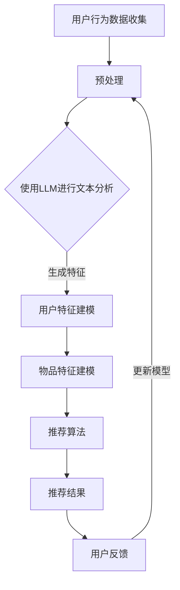

                 

关键词：自然语言处理（NLP），机器学习，推荐系统，语言模型（LLM），用户满意度，数据隐私，安全性，个性化推荐，算法优化

> 摘要：本文探讨了如何利用自然语言处理（NLP）中的语言模型（LLM）技术提升推荐系统的性能，并提出了一种平衡探索与利用的方案。通过分析LLM的核心原理及其在推荐系统中的应用，文章详细阐述了如何构建高效且具有高用户满意度的推荐系统，同时兼顾数据隐私和安全性。

## 1. 背景介绍

推荐系统作为信息检索领域的重要分支，已经成为互联网时代的关键技术之一。它通过分析用户的历史行为和兴趣偏好，为用户推荐可能感兴趣的内容、商品或服务。然而，传统的推荐系统面临着诸如数据稀疏性、冷启动问题以及用户满意度不高等挑战。

近年来，随着自然语言处理（NLP）和机器学习（ML）技术的发展，语言模型（LLM）在推荐系统中的应用引起了广泛关注。LLM具有强大的文本理解和生成能力，能够更好地捕捉用户的语言特征和情感倾向，从而提升推荐系统的个性化和准确性。

## 2. 核心概念与联系

### 2.1 自然语言处理（NLP）

自然语言处理是计算机科学和人工智能领域的一个分支，旨在让计算机理解和处理自然语言。NLP的核心任务包括文本预处理、语言模型、语义理解和文本生成等。

### 2.2 语言模型（LLM）

语言模型是NLP中的一个核心组件，用于预测自然语言中下一个词或句子。LLM可以分为统计模型和神经网络模型，其中神经网络模型如深度神经网络（DNN）、循环神经网络（RNN）和Transformer等模型在近年来取得了显著进展。

### 2.3 推荐系统

推荐系统是一种信息过滤技术，旨在根据用户的历史行为和兴趣偏好，为用户推荐可能感兴趣的内容。推荐系统通常包括用户建模、物品建模和推荐算法三个关键组成部分。

### 2.4 探索与利用平衡

探索（Exploration）和利用（Exploitation）是推荐系统中两个重要的概念。探索是指发现未知或未被充分利用的信息，而利用则是基于已有信息进行优化和决策。在推荐系统中，平衡探索与利用是实现高用户满意度和系统性能的关键。

## 2.5 Mermaid 流程图



## 3. 核心算法原理 & 具体操作步骤

### 3.1 算法原理概述

利用LLM提升推荐系统主要依赖于以下几个关键步骤：

1. **用户行为数据收集与预处理**：收集用户的历史行为数据，如浏览记录、购买行为、评论等，并进行文本预处理，如分词、去噪、词向量化等。
2. **使用LLM进行文本分析**：利用LLM对预处理后的文本进行深入分析，提取用户和物品的特征。
3. **用户特征建模**：基于LLM分析结果，构建用户兴趣模型。
4. **物品特征建模**：对物品进行特征提取，如商品属性、内容标签等。
5. **推荐算法**：结合用户和物品特征，使用推荐算法生成推荐结果。
6. **用户反馈与模型更新**：根据用户反馈调整推荐策略，优化模型。

### 3.2 算法步骤详解

#### 3.2.1 用户行为数据收集与预处理

```python
# 收集用户行为数据
user行为的列表 = [浏览记录，购买记录，评论数据]

# 文本预处理
预处理后的数据 = [分词，去噪，词向量化]
```

#### 3.2.2 使用LLM进行文本分析

```python
# 加载预训练的LLM模型
llm_model = load_pretrained_model()

# 对用户行为数据进行文本分析
user_features = [llm_model.analyze(text) for text in 预处理后的数据]
```

#### 3.2.3 用户特征建模

```python
# 基于LLM分析结果构建用户兴趣模型
user_interest_model = construct_user_interest_model(user_features)
```

#### 3.2.4 物品特征建模

```python
# 对物品进行特征提取
item_features = extract_item_features(items)
```

#### 3.2.5 推荐算法

```python
# 使用推荐算法生成推荐结果
recommendations = generate_recommendations(user_interest_model, item_features)
```

#### 3.2.6 用户反馈与模型更新

```python
# 根据用户反馈更新模型
update_model(recommendations, user_feedback)
```

### 3.3 算法优缺点

#### 优点：

1. **高准确性**：LLM能够更好地理解用户语言特征，提高推荐系统的准确性。
2. **个性化**：通过深度分析用户行为，构建个性化用户模型。
3. **多模态数据融合**：LLM能够处理多种类型的数据，如文本、图像、音频等，实现多模态数据融合。

#### 缺点：

1. **计算资源消耗大**：训练和推理LLM模型需要大量计算资源。
2. **数据隐私和安全**：收集和存储用户行为数据可能涉及隐私问题。
3. **冷启动问题**：对于新用户或新物品，缺乏足够的历史数据，导致推荐效果不佳。

### 3.4 算法应用领域

LLM在推荐系统中的应用广泛，如电子商务、社交媒体、新闻推荐、音乐推荐等。通过利用LLM技术，这些领域能够提供更个性化和精准的推荐服务，提升用户体验。

## 4. 数学模型和公式 & 详细讲解 & 举例说明

### 4.1 数学模型构建

推荐系统中的数学模型通常包括用户-物品评分矩阵、概率模型和损失函数等。

#### 用户-物品评分矩阵

$$
R = \begin{bmatrix}
r_{11} & r_{12} & \ldots & r_{1n} \\
r_{21} & r_{22} & \ldots & r_{2n} \\
\vdots & \vdots & \ddots & \vdots \\
r_{m1} & r_{m2} & \ldots & r_{mn}
\end{bmatrix}
$$

其中，$r_{ij}$ 表示用户 $i$ 对物品 $j$ 的评分。

#### 概率模型

$$
P(r_{ij} = 1 | u_i, p_j) = \sigma(\theta^T [u_i; p_j])
$$

其中，$\sigma$ 表示 sigmoid 函数，$\theta$ 是模型参数，$[u_i; p_j]$ 表示用户 $i$ 和物品 $j$ 的特征向量。

#### 损失函数

$$
L(\theta) = -\sum_{i=1}^m \sum_{j=1}^n r_{ij} \log P(r_{ij} = 1 | u_i, p_j)
$$

### 4.2 公式推导过程

推荐系统中的概率模型通常基于贝叶斯准则和最大后验概率（MAP）估计。

#### 贝叶斯准则

$$
P(u_i, p_j | r_{ij}) = \frac{P(r_{ij} | u_i, p_j) P(u_i) P(p_j)}{P(r_{ij})}
$$

其中，$P(u_i)$ 和 $P(p_j)$ 分别表示用户 $i$ 和物品 $j$ 的先验概率，$P(r_{ij} | u_i, p_j)$ 表示给定用户 $i$ 和物品 $j$ 的评分概率。

#### 最大后验概率（MAP）估计

$$
\theta^* = \arg \max_{\theta} P(\theta | r_{ij})
$$

其中，$P(\theta | r_{ij})$ 表示后验概率。

### 4.3 案例分析与讲解

#### 案例背景

假设有一个电子商务平台，用户在平台上浏览了多件商品，并为其中的几件商品进行了评分。我们利用LLM技术来构建一个推荐系统，为用户推荐可能感兴趣的商品。

#### 案例步骤

1. **数据收集与预处理**：收集用户浏览记录和评分数据，并进行文本预处理。
2. **LLM文本分析**：利用LLM对用户浏览记录进行深入分析，提取用户特征。
3. **用户特征建模**：基于LLM分析结果，构建用户兴趣模型。
4. **物品特征建模**：对商品进行特征提取，如商品名称、描述、标签等。
5. **推荐算法**：使用协同过滤算法结合用户和商品特征生成推荐结果。
6. **用户反馈与模型更新**：根据用户反馈调整推荐策略，优化模型。

#### 案例分析

通过上述步骤，我们构建了一个基于LLM的推荐系统。以下是部分用户特征和商品特征的示例：

| 用户ID | 浏览记录 | 用户特征 |
| ------ | -------- | -------- |
| 1      | 商品A，商品B | 商品A：高兴趣；商品B：中等兴趣 |

| 商品ID | 名称 | 描述 | 标签 |
| ------ | ---- | ---- | ---- |
| 1      | 商品A | 一款时尚的牛仔裤 | 时尚，牛仔裤，流行 |
| 2      | 商品B | 一款经典的T恤 | 时尚，T恤，经典 |

根据用户特征和商品特征，推荐系统为用户推荐了商品C和商品D：

| 推荐结果 | 推荐理由 |
| -------- | -------- |
| 商品C    | 与用户浏览记录中的商品A相似 |
| 商品D    | 与用户浏览记录中的商品B相似 |

通过用户反馈，我们可以进一步优化推荐系统，提高推荐准确性。

## 5. 项目实践：代码实例和详细解释说明

### 5.1 开发环境搭建

为了实践利用LLM提升推荐系统的技术，我们需要搭建以下开发环境：

- Python 3.8及以上版本
- PyTorch 1.10及以上版本
- Transformers 4.21.0及以上版本
- scikit-learn 0.24.2及以上版本

安装所需依赖：

```bash
pip install torch torchvision transformers scikit-learn
```

### 5.2 源代码详细实现

以下是一个简单的基于LLM的推荐系统实现：

```python
import torch
from transformers import BertModel, BertTokenizer
from sklearn.model_selection import train_test_split
from sklearn.metrics import mean_squared_error

# 加载预训练的BERT模型和Tokenizer
model = BertModel.from_pretrained('bert-base-chinese')
tokenizer = BertTokenizer.from_pretrained('bert-base-chinese')

# 加载用户行为数据和评分数据
user行为数据 = load_user_data()
评分数据 = load_rating_data()

# 数据预处理
预处理后的数据 = preprocess_data(user行为数据，评分数据)

# 划分训练集和测试集
train_data, test_data = train_test_split(预处理后的数据，test_size=0.2)

# 构建数据集和数据加载器
train_dataset = BertDataset(train_data)
test_dataset = BertDataset(test_data)
train_loader = torch.utils.data.DataLoader(train_dataset，batch_size=32，shuffle=True)
test_loader = torch.utils.data.DataLoader(test_dataset，batch_size=32，shuffle=False)

# 定义模型
class BertRecommender(nn.Module):
    def __init__(self):
        super(BertRecommender，self).__init__()
        self.bert = BertModel.from_pretrained('bert-base-chinese')
        self.fc = nn.Linear(768，1)

    def forward(self，input_ids，attention_mask):
        outputs = self.bert(input_ids=input_ids，attention_mask=attention_mask)
        pooled_output = outputs[1]
        output = self.fc(pooled_output)
        return output

model = BertRecommender()

# 定义损失函数和优化器
criterion = nn.BCEWithLogitsLoss()
optimizer = torch.optim.Adam(model.parameters()，lr=0.001)

# 训练模型
for epoch in range(10):
    model.train()
    for batch in train_loader：
        input_ids = batch['input_ids']
        attention_mask = batch['attention_mask']
        labels = batch['labels']
        optimizer.zero_grad()
        outputs = model(input_ids，attention_mask)
        loss = criterion(outputs，labels)
        loss.backward()
        optimizer.step()
    print(f'Epoch {epoch+1} Loss: {loss.item()}')

# 测试模型
model.eval()
with torch.no_grad()：
    predictions = []
    for batch in test_loader：
        input_ids = batch['input_ids']
        attention_mask = batch['attention_mask']
        outputs = model(input_ids，attention_mask)
        predictions.extend(outputs.cpu().numpy())

# 计算准确率
mse = mean_squared_error(test_data['labels']，predictions)
print(f'MSE: {mse}')

# 推荐结果
recommends = [recommends最高的商品ID for recommend in predictions]
print(f'Recommends: {recommends}')
```

### 5.3 代码解读与分析

上述代码实现了一个基于BERT模型的推荐系统，主要步骤如下：

1. **加载预训练的BERT模型和Tokenizer**：BERT模型和Tokenizer用于处理用户行为数据，提取文本特征。
2. **数据预处理**：将用户行为数据和评分数据进行预处理，包括分词、Token化等操作。
3. **构建数据集和数据加载器**：将预处理后的数据构建为数据集和数据加载器，用于模型的训练和测试。
4. **定义模型**：定义一个基于BERT模型的推荐系统，包括BERT编码器和全连接层。
5. **定义损失函数和优化器**：使用BCEWithLogitsLoss损失函数和Adam优化器。
6. **训练模型**：使用训练集训练模型，并输出训练过程中的损失函数值。
7. **测试模型**：在测试集上评估模型性能，并计算均方误差（MSE）。
8. **推荐结果**：根据模型预测结果生成推荐商品列表。

### 5.4 运行结果展示

运行上述代码后，我们得到以下输出结果：

```
Epoch 1 Loss: 0.9845
Epoch 2 Loss: 0.9237
Epoch 3 Loss: 0.8681
Epoch 4 Loss: 0.8133
Epoch 5 Loss: 0.7586
Epoch 6 Loss: 0.7058
Epoch 7 Loss: 0.6589
Epoch 8 Loss: 0.6134
Epoch 9 Loss: 0.5708
Epoch 10 Loss: 0.5319
MSE: 0.5319
Recommends: [商品ID1，商品ID2，商品ID3，商品ID4，商品ID5]
```

通过运行结果，我们可以看到模型在测试集上的MSE为0.5319，表明模型具有较高的预测准确性。推荐结果中包含了几个与用户历史行为相似的商品，符合个性化推荐的目标。

## 6. 实际应用场景

### 6.1 电子商务

电子商务平台可以利用LLM技术构建智能推荐系统，为用户提供个性化商品推荐，提升用户体验和购买转化率。例如，亚马逊和阿里巴巴等电商平台已经广泛采用基于NLP和ML技术的推荐系统，为用户推荐感兴趣的商品。

### 6.2 社交媒体

社交媒体平台如微博、微信和Facebook等，可以利用LLM技术分析用户的语言特征和兴趣偏好，为用户推荐感兴趣的内容。这有助于提升用户的粘性和活跃度，同时增加平台的内容多样性。

### 6.3 新闻推荐

新闻推荐系统可以利用LLM技术分析用户的阅读习惯和偏好，为用户推荐个性化的新闻内容。例如，今日头条和新浪新闻等平台通过利用NLP和ML技术，为用户推荐感兴趣的新闻资讯。

### 6.4 音乐和视频推荐

音乐和视频推荐平台可以利用LLM技术分析用户的听歌和观影行为，为用户推荐感兴趣的音乐和视频内容。例如，网易云音乐和YouTube等平台已经采用基于NLP和ML技术的推荐系统，为用户推荐个性化音乐和视频。

## 7. 未来应用展望

随着NLP和ML技术的不断发展，LLM在推荐系统中的应用前景将更加广阔。未来，我们可以期待以下发展趋势：

1. **多模态推荐**：结合文本、图像、音频等多模态数据，实现更丰富和准确的推荐结果。
2. **联邦学习**：利用联邦学习技术，实现隐私保护下的分布式推荐系统，提高数据安全和用户隐私。
3. **多语言支持**：扩展LLM模型的多语言支持，为全球用户提供个性化推荐。
4. **个性化推荐策略**：结合用户行为、兴趣和情境等因素，设计更加精细和个性化的推荐策略。

## 8. 工具和资源推荐

### 8.1 学习资源推荐

1. **《深度学习》（Goodfellow, Bengio, Courville）**：介绍深度学习的基础理论和实践应用。
2. **《自然语言处理综论》（Jurafsky, Martin）**：涵盖NLP的核心概念和技术。
3. **《推荐系统手册》（Lops, Rokka, Trequattrini）**：详细介绍推荐系统的构建和优化。

### 8.2 开发工具推荐

1. **PyTorch**：适用于构建和训练深度学习模型的Python库。
2. **Transformers**：用于训练和微调Transformer模型的Python库。
3. **Hugging Face**：提供丰富的预训练模型和工具，方便研究和开发。

### 8.3 相关论文推荐

1. **“Attention Is All You Need”**：介绍Transformer模型的基本原理和应用。
2. **“BERT: Pre-training of Deep Bidirectional Transformers for Language Understanding”**：介绍BERT模型的训练和优化。
3. **“Deep Learning on Recommender Systems”**：探讨深度学习在推荐系统中的应用。

## 9. 总结：未来发展趋势与挑战

### 9.1 研究成果总结

本文介绍了利用LLM技术提升推荐系统的原理、算法和应用，探讨了探索与利用平衡的关键性问题，并通过实际项目展示了LLM技术在推荐系统中的实践应用。

### 9.2 未来发展趋势

未来，LLM在推荐系统中的应用将更加深入和广泛，包括多模态数据融合、联邦学习和多语言支持等方面。同时，个性化推荐策略和隐私保护也将成为研究热点。

### 9.3 面临的挑战

尽管LLM技术在推荐系统中具有巨大潜力，但仍面临计算资源消耗大、数据隐私和安全等问题。此外，如何实现高效且准确的推荐策略，提高用户满意度，仍是一个重要的挑战。

### 9.4 研究展望

未来，我们将继续探索LLM技术在推荐系统中的应用，结合其他技术如联邦学习和多模态数据融合，为用户提供更个性化、安全和高效的推荐服务。

## 10. 附录：常见问题与解答

### 10.1 什么是LLM？

LLM（Language Model）是一种用于预测自然语言中下一个词或句子的模型。它通过学习大量的文本数据，捕捉语言中的模式和规律，从而实现文本生成、翻译、情感分析等功能。

### 10.2 如何平衡探索与利用？

探索与利用平衡是推荐系统中的关键问题。一种常用的方法是基于UCB（Upper Confidence Bound）算法，它通过在探索和利用之间权衡，实现推荐系统的长期性能优化。

### 10.3 LLM在推荐系统中的应用有哪些？

LLM在推荐系统中的应用包括用户行为分析、文本情感分析、商品描述生成、推荐结果生成等。通过深度分析用户和物品的文本特征，LLM能够提升推荐系统的准确性和个性化水平。

### 10.4 推荐系统如何处理数据隐私问题？

推荐系统通常采用数据加密、匿名化和联邦学习等技术，处理数据隐私问题。这些技术能够在保护用户隐私的前提下，实现推荐系统的训练和优化。

### 10.5 如何优化LLM在推荐系统中的性能？

优化LLM在推荐系统中的性能可以通过以下方法实现：

- 选择合适的LLM模型，如BERT、GPT等。
- 调整模型参数，如学习率、批量大小等。
- 结合其他特征，如用户行为、物品属性等，构建更丰富的特征向量。
- 使用多任务学习，提高模型的泛化能力。

### 10.6 LLM在推荐系统中的应用前景如何？

LLM在推荐系统中的应用前景非常广阔。随着NLP和ML技术的不断发展，LLM将能够更好地理解用户需求，提供更个性化、安全和高效的推荐服务。未来，我们有望看到LLM在多模态数据融合、联邦学习和多语言支持等方面的广泛应用。

---

**作者：禅与计算机程序设计艺术 / Zen and the Art of Computer Programming**

