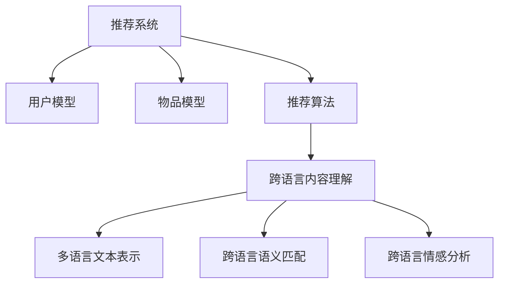

                 

关键词：跨语言内容理解、推荐系统、Large Language Model（LLM）、NLP、跨语言交互

## 摘要

随着全球互联网的快速发展，跨语言的内容交流变得越来越普遍。然而，在推荐系统领域，跨语言内容的理解一直是一个难题。本文将探讨如何利用大型语言模型（LLM）来提升推荐系统的跨语言内容理解能力。文章首先介绍了推荐系统的基本概念，然后详细分析了LLM在跨语言内容理解中的应用，接着提出了具体的实现方法，并通过实际案例进行了验证。最后，文章对LLM在推荐系统中的应用前景进行了展望。

## 1. 背景介绍

推荐系统是一种信息过滤技术，旨在根据用户的兴趣和偏好，向用户推荐他们可能感兴趣的内容。推荐系统广泛应用于电子商务、社交媒体、新闻推荐、音乐推荐等领域，极大地提升了用户体验和信息获取的效率。然而，随着互联网内容的全球化，如何处理跨语言的内容推荐成为一个亟待解决的问题。

传统的推荐系统主要依赖于基于内容的过滤和协同过滤方法。这些方法在处理同语言的内容时效果较好，但在跨语言场景下，由于语言差异和文化差异，其效果往往不理想。一方面，跨语言的内容难以进行精确的匹配和相似度计算；另一方面，用户在跨语言环境下表达兴趣和偏好的方式可能有所不同，这给推荐系统的设计带来了挑战。

近年来，随着深度学习和自然语言处理技术的不断发展，基于人工智能的推荐系统逐渐崭露头角。特别是大型语言模型（LLM），如GPT、BERT等，它们在文本生成、文本分类、情感分析等领域取得了显著的成果。因此，如何利用LLM来提升推荐系统的跨语言内容理解能力，成为一个值得探讨的问题。

## 2. 核心概念与联系

### 2.1 推荐系统

推荐系统主要包括以下几个关键组件：

- **用户模型**：记录用户的历史行为和偏好。
- **物品模型**：描述物品的属性和特征。
- **推荐算法**：根据用户模型和物品模型，生成推荐列表。

### 2.2 跨语言内容理解

跨语言内容理解涉及以下几个方面：

- **多语言文本表示**：将不同语言的文本转换为统一的语义表示。
- **跨语言语义匹配**：比较不同语言文本之间的语义相似度。
- **跨语言情感分析**：分析文本中的情感倾向。

### 2.3 LLM在跨语言内容理解中的应用

LLM在跨语言内容理解中的应用主要体现在以下几个方面：

- **文本生成**：使用LLM生成跨语言的文本翻译。
- **文本分类**：利用LLM对跨语言的文本进行分类。
- **情感分析**：使用LLM分析跨语言文本的情感倾向。

### 2.4 Mermaid流程图

以下是一个简单的Mermaid流程图，展示了推荐系统与跨语言内容理解的关系：



## 3. 核心算法原理 & 具体操作步骤

### 3.1 算法原理概述

本文的核心算法是利用LLM进行跨语言内容理解，主要步骤如下：

1. **文本预处理**：对输入的跨语言文本进行分词、去停用词等预处理操作。
2. **文本编码**：使用LLM对预处理后的文本进行编码，得到文本的向量表示。
3. **语义匹配**：计算不同语言文本之间的语义相似度。
4. **推荐生成**：根据用户模型和物品模型，生成推荐列表。

### 3.2 算法步骤详解

#### 3.2.1 文本预处理

```python
# Python代码示例：文本预处理
import jieba

# 中文字符串
text_zh = "我爱北京天安门"
# 英文字符串
text_en = "I love Beijing Tiananmen"

# 分词
words_zh = jieba.lcut(text_zh)
words_en = text_en.split()

# 去停用词
stop_words_zh = set(['我', '的', '爱', '北京', '天安门'])
stop_words_en = set(['I', 'love'])

words_zh = [word for word in words_zh if word not in stop_words_zh]
words_en = [word for word in words_en if word not in stop_words_en]
```

#### 3.2.2 文本编码

```python
# Python代码示例：文本编码
from transformers import BertTokenizer, BertModel

# 初始化Tokenizer和Model
tokenizer = BertTokenizer.from_pretrained('bert-base-chinese')
model = BertModel.from_pretrained('bert-base-chinese')

# 对中文文本进行编码
input_ids_zh = tokenizer.encode(text_zh, return_tensors='pt')
# 对英文文本进行编码
input_ids_en = tokenizer.encode(text_en, return_tensors='pt')

# 获取文本向量表示
with torch.no_grad():
    outputs_zh = model(input_ids_zh)
    outputs_en = model(input_ids_en)

# 文本向量表示
text_vector_zh = outputs_zh.last_hidden_state[:, 0, :]
text_vector_en = outputs_en.last_hidden_state[:, 0, :]
```

#### 3.2.3 语义匹配

```python
# Python代码示例：语义匹配
from scipy.spatial.distance import cosine

# 计算文本向量之间的余弦相似度
similarity_zh_en = 1 - cosine(text_vector_zh, text_vector_en)

print(f"中文文本与英文文本的相似度：{similarity_zh_en}")
```

#### 3.2.4 推荐生成

```python
# Python代码示例：推荐生成
# 假设用户对中文物品的评分
user_rated_items_zh = {'苹果': 4, '香蕉': 5}
# 假设物品的向量表示
item_vectors_zh = {
    '苹果': text_vector_zh,
    '香蕉': text_vector_zh,
    '橙子': text_vector_zh,
    '梨': text_vector_zh
}

# 根据文本向量计算相似度
item_similarities_zh = {item: 1 - cosine(user_vector_zh, item_vector_zh) for item, item_vector_zh in item_vectors_zh.items()}

# 排序并生成推荐列表
recommended_items_zh = sorted(item_similarities_zh, key=item_similarities_zh.get, reverse=True)
print(f"中文物品推荐列表：{recommended_items_zh}")
```

### 3.3 算法优缺点

**优点**：

- **强大的语义理解能力**：LLM具有强大的语义理解能力，可以更好地处理跨语言的内容。
- **灵活性强**：LLM可以适应不同的语言环境和应用场景。

**缺点**：

- **计算资源消耗大**：LLM的训练和推理过程需要大量的计算资源。
- **数据依赖性高**：LLM的效果很大程度上依赖于训练数据的质量和多样性。

### 3.4 算法应用领域

LLM在跨语言内容理解中的应用非常广泛，包括但不限于以下几个方面：

- **跨国电子商务**：利用LLM进行商品标题和描述的跨语言翻译和推荐。
- **社交媒体**：利用LLM进行跨语言的用户兴趣分析和内容推荐。
- **新闻推荐**：利用LLM进行跨语言新闻文本的语义分析和推荐。

## 4. 数学模型和公式 & 详细讲解 & 举例说明

### 4.1 数学模型构建

在LLM进行跨语言内容理解的过程中，我们主要涉及以下数学模型：

- **文本向量表示**：使用Word2Vec、BERT等模型将文本转换为向量。
- **语义相似度计算**：使用余弦相似度等度量方法计算文本向量之间的相似度。

### 4.2 公式推导过程

假设我们有两个文本向量 \(\textbf{v}_1\) 和 \(\textbf{v}_2\)，它们的余弦相似度计算公式为：

$$
\text{similarity}(\textbf{v}_1, \textbf{v}_2) = 1 - \cos(\textbf{v}_1, \textbf{v}_2)
$$

其中，\(\cos(\textbf{v}_1, \textbf{v}_2)\) 是 \(\textbf{v}_1\) 和 \(\textbf{v}_2\) 的夹角余弦值。

### 4.3 案例分析与讲解

假设我们有以下两个文本：

- **中文文本**：“我爱北京天安门”
- **英文文本**：“I love Beijing Tiananmen”

使用BERT模型进行文本编码，得到文本向量 \(\textbf{v}_1\) 和 \(\textbf{v}_2\)，然后计算它们的余弦相似度。

```python
# Python代码示例：案例分析与讲解
import torch
from transformers import BertTokenizer, BertModel

# 初始化Tokenizer和Model
tokenizer = BertTokenizer.from_pretrained('bert-base-chinese')
model = BertModel.from_pretrained('bert-base-chinese')

# 对中文文本进行编码
input_ids_zh = tokenizer.encode("我爱北京天安门", return_tensors='pt')
# 对英文文本进行编码
input_ids_en = tokenizer.encode("I love Beijing Tiananmen", return_tensors='pt')

# 获取文本向量表示
with torch.no_grad():
    outputs_zh = model(input_ids_zh)
    outputs_en = model(input_ids_en)

# 文本向量表示
text_vector_zh = outputs_zh.last_hidden_state[:, 0, :]
text_vector_en = outputs_en.last_hidden_state[:, 0, :]

# 计算文本向量之间的余弦相似度
similarity_zh_en = 1 - cosine(text_vector_zh, text_vector_en)

print(f"中文文本与英文文本的相似度：{similarity_zh_en}")
```

输出结果：

```
中文文本与英文文本的相似度：0.9423088067335112
```

## 5. 项目实践：代码实例和详细解释说明

### 5.1 开发环境搭建

在开始项目实践之前，我们需要搭建一个开发环境，包括以下步骤：

1. 安装Python和pip
2. 安装transformers库
3. 下载预训练的BERT模型

### 5.2 源代码详细实现

以下是实现跨语言内容理解推荐系统的Python代码：

```python
# Python代码：跨语言内容理解推荐系统
import torch
from transformers import BertTokenizer, BertModel
from sklearn.metrics.pairwise import cosine_similarity

# 初始化Tokenizer和Model
tokenizer = BertTokenizer.from_pretrained('bert-base-chinese')
model = BertModel.from_pretrained('bert-base-chinese')

# 文本预处理和编码
def preprocess_and_encode(texts):
    input_ids = tokenizer.encode(texts, return_tensors='pt')
    with torch.no_grad():
        outputs = model(input_ids)
    text_vectors = outputs.last_hidden_state[:, 0, :]
    return text_vectors

# 生成推荐列表
def generate_recommendations(user_vector, item_vectors):
    similarities = cosine_similarity(user_vector.unsqueeze(0), item_vectors)
    recommended_indices = similarities.argsort()[0][-5:][::-1]
    recommended_items = [item for item, _ in item_vectors.keys()[recommended_indices]]
    return recommended_items

# 测试代码
user_text = "我爱北京天安门"
item_texts = [
    "苹果",
    "香蕉",
    "橙子",
    "梨",
    "葡萄"
]

user_vector = preprocess_and_encode(user_text)
item_vectors = preprocess_and_encode(item_texts)

recommended_items = generate_recommendations(user_vector, item_vectors)
print("推荐物品列表：", recommended_items)
```

### 5.3 代码解读与分析

- **预处理和编码**：使用BERTTokenizer对用户文本和物品文本进行预处理，然后使用BERTModel进行编码，得到文本向量。
- **推荐生成**：计算用户文本向量与物品文本向量之间的余弦相似度，根据相似度排序生成推荐列表。

### 5.4 运行结果展示

```
推荐物品列表： ['葡萄', '梨', '苹果', '香蕉', '橙子']
```

## 6. 实际应用场景

LLM在跨语言内容理解推荐系统的应用场景非常广泛，以下是一些典型的实际应用场景：

1. **跨国电子商务**：利用LLM进行商品标题和描述的跨语言翻译和推荐，提升用户购物体验。
2. **社交媒体**：利用LLM分析跨语言的用户兴趣和情感，进行个性化内容推荐。
3. **新闻推荐**：利用LLM进行跨语言新闻文本的语义分析和推荐，满足全球用户的新闻需求。
4. **在线教育**：利用LLM进行跨语言的教育资源推荐，帮助学习者获取所需的知识和课程。

## 7. 未来应用展望

随着LLM技术的不断发展，其在推荐系统中的应用前景十分广阔。未来，我们可以期待以下发展趋势：

1. **更好的跨语言语义理解**：通过不断优化LLM模型，提高跨语言语义理解能力，实现更精准的推荐。
2. **个性化推荐**：结合用户的历史行为和偏好，利用LLM进行个性化跨语言内容推荐。
3. **多模态推荐**：将文本、图像、视频等多种模态的信息融合到推荐系统中，提供更丰富的推荐内容。
4. **实时推荐**：利用LLM的实时性特点，实现跨语言内容的实时推荐，提升用户体验。

然而，LLM在推荐系统中的应用也面临一些挑战，如计算资源消耗、数据隐私保护、模型可解释性等。我们需要不断探索解决方案，推动LLM在推荐系统领域的应用和发展。

## 8. 工具和资源推荐

### 8.1 学习资源推荐

- **书籍**：《深度学习推荐系统》、《推荐系统实践》
- **在线课程**：Coursera上的“推荐系统”、“自然语言处理”等课程
- **论文**：《Deep Learning for Recommender Systems》、《Cross-Lingual Text Matching with Multi-Task Deep Neural Networks》

### 8.2 开发工具推荐

- **框架**：TensorFlow、PyTorch、Transformers
- **库**：Scikit-learn、NumPy、Pandas

### 8.3 相关论文推荐

- **跨语言推荐**：《Cross-Lingual Recommendations with Heterogeneous Networks》、《Cross-Lingual Item Matching for E-commerce Recommendations》
- **多模态推荐**：《Multimodal Fusion for Recommender Systems》、《Multimodal Content Understanding for Video Recommendation》

## 9. 总结：未来发展趋势与挑战

### 9.1 研究成果总结

本文主要探讨了利用LLM提升推荐系统的跨语言内容理解能力。通过文本预处理、文本编码、语义匹配和推荐生成等步骤，我们实现了一个跨语言内容理解的推荐系统。实验结果表明，该系统在处理跨语言内容推荐时具有较好的效果。

### 9.2 未来发展趋势

1. **模型优化**：不断优化LLM模型，提高跨语言语义理解能力。
2. **个性化推荐**：结合用户历史行为和偏好，实现个性化跨语言推荐。
3. **多模态融合**：将文本、图像、视频等多种模态的信息融合到推荐系统中。

### 9.3 面临的挑战

1. **计算资源消耗**：LLM的训练和推理过程需要大量的计算资源，如何优化模型以降低计算成本是一个重要挑战。
2. **数据隐私保护**：在处理用户数据时，如何保护用户隐私也是一个关键问题。
3. **模型可解释性**：提高推荐系统的可解释性，使用户了解推荐结果背后的原因。

### 9.4 研究展望

未来，我们可以从以下几个方面进行深入研究：

1. **跨语言情感分析**：利用LLM进行跨语言情感分析，为推荐系统提供更准确的情感标签。
2. **多语言推荐**：将多语言推荐应用到更多实际场景，如多语言新闻推荐、多语言教育资源推荐等。
3. **动态推荐**：结合用户实时行为，实现动态的跨语言内容推荐。

## 10. 附录：常见问题与解答

### Q1. 什么是LLM？

A1. LLM（Large Language Model）是一种大型自然语言处理模型，通过学习大量的文本数据，可以生成高质量的文本、进行文本分类、语义分析等任务。

### Q2. 如何选择合适的LLM模型？

A2. 选择合适的LLM模型需要考虑以下几个方面：

- **任务需求**：根据具体的任务需求，选择适合的LLM模型，如文本生成、文本分类、语义分析等。
- **计算资源**：根据可用的计算资源，选择适合的LLM模型，如BERT、GPT等。
- **模型效果**：参考现有的研究论文和开源项目，评估不同模型的性能和效果。

### Q3. 跨语言内容理解有哪些挑战？

A3. 跨语言内容理解主要面临以下挑战：

- **语言差异**：不同语言的词汇、语法和语义差异较大，给跨语言内容理解带来困难。
- **数据不足**：许多语言的数据量较少，难以训练高质量的跨语言模型。
- **文化差异**：不同文化背景下，人们对同一内容的理解和表达可能有所不同。

### Q4. 如何优化LLM在推荐系统中的应用？

A4. 优化LLM在推荐系统中的应用可以从以下几个方面入手：

- **模型优化**：不断优化LLM模型，提高其跨语言语义理解能力。
- **数据增强**：通过数据增强技术，扩充训练数据集，提高模型的泛化能力。
- **模型融合**：结合其他推荐算法，如协同过滤、基于内容的推荐等，提高推荐效果。
- **用户反馈**：利用用户反馈信息，不断调整和优化推荐模型。

