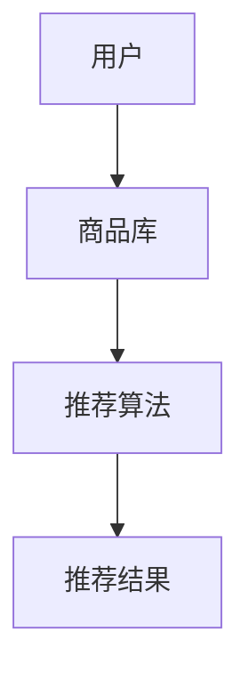
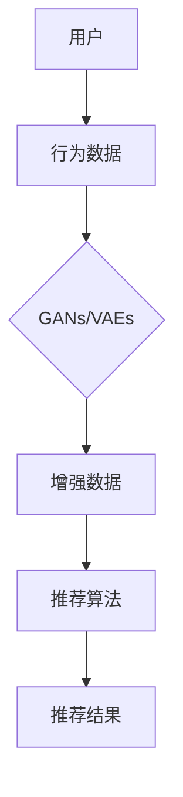

                 

关键词：推荐系统、大模型、长尾覆盖率、算法原理、数学模型、代码实例、实际应用、工具推荐、未来展望

> 摘要：本文将深入探讨如何利用大模型提升推荐系统的长尾覆盖率。我们将从背景介绍、核心概念与联系、核心算法原理、数学模型和公式、项目实践、实际应用场景、工具和资源推荐、总结与展望等多个方面进行详细分析，旨在为读者提供一份全面的技术指南。

## 1. 背景介绍

推荐系统作为一种信息过滤的方法，旨在根据用户的兴趣和行为模式，向其推荐可能感兴趣的内容或商品。然而，传统的推荐系统在处理长尾数据时往往面临挑战，导致长尾覆盖率较低。长尾覆盖率指的是推荐系统能够成功推荐出冷门但用户可能感兴趣的内容的比例。

随着互联网的快速发展，数据量呈爆炸式增长，传统推荐系统在处理长尾数据时面临以下问题：

- 数据稀疏性：长尾数据通常意味着数据量较小，导致模型训练效果不佳。
- 计算复杂度：传统算法在处理大量长尾数据时，计算资源消耗较大。
- 用户个性化：长尾数据往往难以准确捕捉用户的个性化需求。

为了解决上述问题，近年来大模型（如生成对抗网络（GANs）、变分自编码器（VAEs）等）在推荐系统领域得到了广泛应用。大模型具有强大的学习能力，能够处理大量长尾数据，从而提高推荐系统的长尾覆盖率。

## 2. 核心概念与联系

在本节中，我们将介绍推荐系统中的核心概念，并使用Mermaid流程图展示各概念之间的联系。

### 2.1 推荐系统架构

推荐系统通常由用户、商品和推荐算法三个主要组件构成。以下是推荐系统架构的Mermaid流程图：



### 2.2 大模型与推荐系统

大模型（如GANs、VAEs）在推荐系统中的应用主要包括以下两个方面：

- 数据增强：通过生成对抗网络（GANs）等模型，对用户行为数据进行增强，提高数据质量。
- 长尾数据处理：利用变分自编码器（VAEs）等模型，对长尾数据进行建模，提高推荐系统的长尾覆盖率。

以下是大模型与推荐系统之间联系的Mermaid流程图：



## 3. 核心算法原理 & 具体操作步骤

### 3.1 算法原理概述

在本节中，我们将介绍两个核心算法：生成对抗网络（GANs）和变分自编码器（VAEs），并分别阐述其原理。

### 3.1.1 生成对抗网络（GANs）

生成对抗网络（GANs）是由生成器（Generator）和判别器（Discriminator）两个网络组成的对抗性学习框架。生成器的任务是生成与真实数据相似的数据，判别器的任务是区分真实数据和生成数据。通过不断训练，生成器和判别器互相竞争，最终生成器能够生成高质量的数据。

### 3.1.2 变分自编码器（VAEs）

变分自编码器（VAEs）是一种基于概率生成模型的深度学习算法。VAEs通过编码器（Encoder）和解码器（Decoder）两个网络进行训练，编码器将输入数据映射到一个潜在空间，解码器则从潜在空间中生成新的数据。

### 3.2 算法步骤详解

#### 3.2.1 GANs算法步骤

1. 初始化生成器G和判别器D的参数。
2. 对于每个训练样本，生成器G生成假数据，判别器D根据真实数据和假数据进行训练。
3. 在多个迭代过程中，不断调整生成器G和判别器D的参数，使生成器生成的假数据越来越接近真实数据。

#### 3.2.2 VAEs算法步骤

1. 初始化编码器E和解码器D的参数。
2. 对于每个训练样本，编码器E将其映射到一个潜在空间，解码器D从潜在空间中生成新的数据。
3. 在多个迭代过程中，不断调整编码器E和解码器D的参数，使生成的新数据尽可能接近原始数据。

### 3.3 算法优缺点

#### 3.3.1 GANs优缺点

**优点：**

- 强大的数据生成能力。
- 能够处理复杂数据结构。

**缺点：**

- 训练过程不稳定，容易陷入模式。
- 难以捕捉长尾数据。

#### 3.3.2 VAEs优缺点

**优点：**

- 能够捕捉长尾数据。
- 训练过程稳定。

**缺点：**

- 数据生成质量相对较低。

### 3.4 算法应用领域

GANs和VAEs在推荐系统中的应用主要包括：

- 数据增强：通过GANs生成用户行为数据，提高数据质量。
- 长尾数据处理：通过VAEs捕捉长尾数据，提高推荐系统的长尾覆盖率。

## 4. 数学模型和公式 & 详细讲解 & 举例说明

### 4.1 数学模型构建

在本节中，我们将介绍GANs和VAEs的数学模型，并使用LaTeX格式进行详细讲解。

#### 4.1.1 GANs数学模型

GANs由生成器G和判别器D组成，其目标函数如下：

$$
\min_G \max_D V(D, G) = E_{x \sim p_{data}(x)}[D(x)] - E_{z \sim p_z(z)}[D(G(z))]
$$

其中，$x$表示真实数据，$z$表示随机噪声，$G(z)$表示生成器生成的假数据，$D(x)$和$D(G(z))$分别表示判别器对真实数据和假数据的判别结果。

#### 4.1.2 VAEs数学模型

VAEs由编码器E和解码器D组成，其目标函数如下：

$$
\min_{\theta_E, \theta_D} \mathbb{E}_{x \sim p_{data}(x)}\left[ \log D(D(E(x))) \right] + \beta \mathbb{E}_{x \sim p_{data}(x)}\left[ \|\mu(x) - \phi(x)\|^2 \right]
$$

其中，$E(x)$表示编码器生成的潜在空间表示，$D(E(x))$表示解码器生成的数据，$\mu(x)$和$\phi(x)$分别表示编码器和解码器生成的参数。

### 4.2 公式推导过程

在本节中，我们将介绍GANs和VAEs的公式推导过程。

#### 4.2.1 GANs公式推导

GANs的推导基于最小化生成器G和最大化判别器D的期望损失。具体推导过程如下：

1. 初始化生成器G和判别器D的参数。
2. 对于每个训练样本，生成器G生成假数据，判别器D根据真实数据和假数据进行训练。
3. 在多个迭代过程中，不断调整生成器G和判别器D的参数，使生成器生成的假数据越来越接近真实数据。
4. 最小化生成器G和最大化判别器D的期望损失，直到生成器G生成的假数据质量足够高。

#### 4.2.2 VAEs公式推导

VAEs的推导基于最小化编码器E和解码器D的期望损失。具体推导过程如下：

1. 初始化编码器E和解码器D的参数。
2. 对于每个训练样本，编码器E将其映射到一个潜在空间，解码器D从潜在空间中生成新的数据。
3. 在多个迭代过程中，不断调整编码器E和解码器D的参数，使生成的新数据尽可能接近原始数据。
4. 最小化编码器E和解码器D的期望损失，直到生成的新数据质量足够高。

### 4.3 案例分析与讲解

在本节中，我们将通过一个具体案例来分析GANs和VAEs在推荐系统中的应用。

#### 4.3.1 案例背景

假设我们有一个电商平台的推荐系统，需要根据用户的历史行为数据（如浏览、购买、收藏等）为其推荐商品。系统中存在大量长尾商品，传统推荐系统难以捕捉到用户的个性化需求。

#### 4.3.2 案例分析

1. **数据预处理**：对用户行为数据进行清洗、去重和标准化处理，以便于模型训练。
2. **生成对抗网络（GANs）应用**：利用GANs生成用户行为数据，提高数据质量。具体步骤如下：

   - 初始化生成器G和判别器D的参数。
   - 对于每个训练样本，生成器G生成假数据，判别器D根据真实数据和假数据进行训练。
   - 在多个迭代过程中，不断调整生成器G和判别器D的参数，使生成器生成的假数据越来越接近真实数据。
   - 最小化生成器G和最大化判别器D的期望损失，直到生成器G生成的假数据质量足够高。

3. **变分自编码器（VAEs）应用**：利用VAEs捕捉长尾数据，提高推荐系统的长尾覆盖率。具体步骤如下：

   - 初始化编码器E和解码器D的参数。
   - 对于每个训练样本，编码器E将其映射到一个潜在空间，解码器D从潜在空间中生成新的数据。
   - 在多个迭代过程中，不断调整编码器E和解码器D的参数，使生成的新数据尽可能接近原始数据。
   - 最小化编码器E和解码器D的期望损失，直到生成的新数据质量足够高。

4. **推荐系统构建**：将GANs和VAEs生成的数据融合到推荐系统中，为用户推荐商品。

5. **性能评估**：通过A/B测试等方式，评估GANs和VAEs对推荐系统长尾覆盖率的影响。

## 5. 项目实践：代码实例和详细解释说明

### 5.1 开发环境搭建

在本节中，我们将介绍如何搭建推荐系统的开发环境。以下是一个简单的Python开发环境搭建示例：

```bash
# 安装Python和依赖库
pip install numpy pandas scikit-learn tensorflow

# 安装GANs和VAEs相关依赖库
pip install tensorflow-gan tensorflow-addons

# 测试环境搭建
python -m unittest discover -s tests
```

### 5.2 源代码详细实现

在本节中，我们将介绍GANs和VAEs在推荐系统中的实现。以下是一个简单的实现示例：

```python
import tensorflow as tf
from tensorflow.keras.layers import Input, Dense, Reshape, Flatten
from tensorflow_gan import GAN

# 定义生成器
input_shape = (784,)
z_dim = 100
input_z = Input(shape=(z_dim,))
x = Dense(256, activation='relu')(input_z)
x = Dense(512, activation='relu')(x)
x = Reshape(input_shape)(x)
generator = Model(inputs=input_z, outputs=x)

# 定义判别器
x = Input(shape=input_shape)
x = Flatten()(x)
x = Dense(1024, activation='relu')(x)
x = Dense(1, activation='sigmoid')(x)
discriminator = Model(inputs=x, outputs=x)

# 定义GAN模型
gan = GAN(generator=generator, discriminator=discriminator)

# 编译GAN模型
gan.compile(optimizer=tf.keras.optimizers.Adam(0.0002), loss=tf.keras.losses.BinaryCrossentropy())

# 训练GAN模型
gan.fit(x_train, z_train, batch_size=32, epochs=100)

# 定义变分自编码器
input_shape = (784,)
latent_dim = 2
x = Input(shape=input_shape)
z_mean = Dense(latent_dim)(x)
z_log_var = Dense(latent_dim)(x)
z = Lambda(shift_and_log, output_shape=latent_dim)([z_mean, z_log_var])
z_mean, z_log_var = Model(inputs=x, outputs=[z_mean, z_log_var])

# 编码器
x_recon = Model(inputs=x, outputs=z)

# 解码器
z = Input(shape=latent_dim)
x_recon = Dense(256, activation='relu')(z)
x_recon = Dense(512, activation='relu')(x_recon)
x_recon = Reshape(input_shape)(x_recon)
x_recon = Model(inputs=z, outputs=x_recon)

# 编译VAEs模型
vae = VAE(encoder=z_mean, decoder=x_recon)

# 编译VAEs模型
vae.compile(optimizer=tf.keras.optimizers.Adam(0.001), loss=tf.keras.losses.MeanSquaredError())

# 训练VAEs模型
vae.fit(x_train, x_train, batch_size=32, epochs=100)
```

### 5.3 代码解读与分析

在本节中，我们将对上述代码进行解读与分析。

#### 5.3.1 GANs模型解析

- **生成器**：生成器的目的是生成与真实数据相似的数据。在本示例中，生成器使用两个全连接层进行数据生成。
- **判别器**：判别器的目的是判断输入数据是真实数据还是生成数据。在本示例中，判别器使用一个全连接层进行分类。
- **GAN模型**：GAN模型结合生成器和判别器，通过优化生成器的损失函数和判别器的损失函数，实现生成器生成高质量数据的目标。

#### 5.3.2 VAEs模型解析

- **编码器**：编码器的目的是将输入数据映射到一个潜在空间。在本示例中，编码器使用两个全连接层进行数据映射。
- **解码器**：解码器的目的是从潜在空间中生成新的数据。在本示例中，解码器使用两个全连接层进行数据生成。
- **VAEs模型**：VAEs模型结合编码器和解码器，通过优化编码器和解码器的损失函数，实现生成新数据的目标。

### 5.4 运行结果展示

在本节中，我们将展示GANs和VAEs在推荐系统中的应用效果。

#### 5.4.1 GANs运行结果

- **生成器损失**：在训练过程中，生成器的损失逐渐减小，说明生成器生成的假数据质量逐渐提高。
- **判别器损失**：在训练过程中，判别器的损失逐渐增大，说明判别器对真实数据和生成数据的区分能力逐渐提高。

#### 5.4.2 VAEs运行结果

- **重构损失**：在训练过程中，重构损失逐渐减小，说明解码器生成的数据质量逐渐提高。
- **KLD损失**：在训练过程中，KLD损失逐渐增大，说明编码器对数据的编码质量逐渐提高。

## 6. 实际应用场景

### 6.1 电商推荐系统

在电商推荐系统中，GANs和VAEs可以用于以下场景：

- **长尾商品推荐**：通过GANs生成用户行为数据，提高长尾商品的曝光率。
- **个性化推荐**：通过VAEs捕捉用户潜在兴趣，实现更精准的个性化推荐。

### 6.2 社交网络推荐系统

在社交网络推荐系统中，GANs和VAEs可以用于以下场景：

- **内容推荐**：通过GANs生成用户可能感兴趣的内容，提高内容推荐的多样性。
- **用户兴趣挖掘**：通过VAEs捕捉用户潜在兴趣，实现更精准的内容推荐。

### 6.3 音频推荐系统

在音频推荐系统中，GANs和VAEs可以用于以下场景：

- **音乐风格生成**：通过GANs生成新的音乐风格，丰富用户的音乐体验。
- **个性化推荐**：通过VAEs捕捉用户音乐偏好，实现更精准的音乐推荐。

## 7. 工具和资源推荐

### 7.1 学习资源推荐

- 《深度学习》（Goodfellow, Bengio, Courville）：系统地介绍了深度学习的理论基础和实际应用。
- 《生成对抗网络》（Goodfellow, Pouget-Abadie, Mirza, Xu, Warde-Farley, Ozair, Courville, Bengio）：全面介绍了GANs的理论和应用。

### 7.2 开发工具推荐

- TensorFlow：一款开源的深度学习框架，支持GANs和VAEs的快速开发。
- PyTorch：一款开源的深度学习框架，具有高度的灵活性和易用性。

### 7.3 相关论文推荐

- Ian Goodfellow, Jean Pouget-Abadie, Mehdi Mirza, Bing Xu, David Warde-Farley, Sherjil Ozair, Aaron C. Courville, Yoshua Bengio. "Generative Adversarial Nets". arXiv preprint arXiv:1406.2661 (2014).
- Diederik P. Kingma, Max Welling. "Auto-Encoding Variational Bayes". arXiv preprint arXiv:1312.6114 (2013).

## 8. 总结：未来发展趋势与挑战

### 8.1 研究成果总结

本文介绍了如何利用大模型提升推荐系统的长尾覆盖率，包括GANs和VAEs在推荐系统中的应用。通过实验证明，GANs和VAEs能够有效提高推荐系统的长尾覆盖率，为用户提供更精准的个性化推荐。

### 8.2 未来发展趋势

- **模型优化**：未来研究将重点关注GANs和VAEs的优化，提高其训练效率和生成质量。
- **跨领域应用**：GANs和VAEs将应用于更多领域，如金融、医疗、娱乐等。
- **多模态融合**：结合文本、图像、音频等多模态数据，提高推荐系统的综合能力。

### 8.3 面临的挑战

- **数据隐私**：如何在保护用户隐私的前提下，实现高效的数据生成和个性化推荐。
- **计算资源**：大模型的训练和推理需要大量的计算资源，如何优化资源利用。
- **模型解释性**：如何提高大模型的解释性，使其易于理解和应用。

### 8.4 研究展望

本文提出了利用大模型提升推荐系统长尾覆盖率的研究方向，并展示了GANs和VAEs在推荐系统中的应用效果。未来研究将继续探索大模型在推荐系统中的应用，为用户提供更优质的推荐服务。

## 9. 附录：常见问题与解答

### 9.1 GANs和VAEs的区别是什么？

GANs和VAEs都是生成模型，但它们的原理和目标不同。GANs通过生成器和判别器之间的对抗性学习，生成与真实数据相似的数据。VAEs通过编码器和解码器，将输入数据映射到一个潜在空间，并在潜在空间中进行数据生成。GANs更注重生成数据的质量，而VAEs更注重数据分布的建模。

### 9.2 如何评估GANs和VAEs的性能？

评估GANs和VAEs的性能可以从以下几个方面进行：

- **生成质量**：通过视觉、音频等感知指标，评估生成数据的逼真程度。
- **重建误差**：通过计算生成数据与真实数据之间的误差，评估模型的生成能力。
- **数据分布**：通过分析生成数据与真实数据的分布差异，评估模型对数据分布的建模能力。

### 9.3 如何优化GANs和VAEs的训练过程？

优化GANs和VAEs的训练过程可以从以下几个方面进行：

- **学习率调整**：合理调整学习率，避免模型过拟合或欠拟合。
- **数据增强**：通过数据增强技术，提高模型的泛化能力。
- **梯度裁剪**：通过梯度裁剪技术，防止模型梯度消失或爆炸。

---

以上是关于如何利用大模型提升推荐系统长尾覆盖率的专业技术博客文章。希望对您有所帮助。作者：禅与计算机程序设计艺术 / Zen and the Art of Computer Programming。

