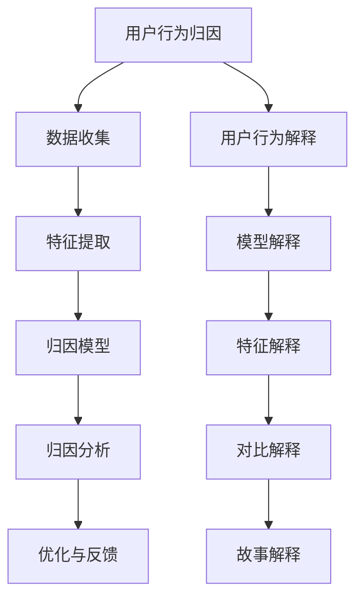

                 

关键词：大模型，推荐系统，用户行为，归因与解释

摘要：随着人工智能和推荐系统的广泛应用，理解用户行为变得尤为重要。本文将探讨如何利用大模型进行推荐场景中的用户行为归因与解释，旨在提高推荐系统的透明度和可解释性。

## 1. 背景介绍

### 1.1 推荐系统的发展

推荐系统是一种基于数据挖掘和机器学习的技术，旨在向用户提供个性化的推荐。最早期的推荐系统主要基于协同过滤算法，通过分析用户的历史行为数据来发现相似用户，从而进行推荐。然而，随着用户数据的增长和复杂性的提高，传统的推荐系统逐渐暴露出一些问题，如冷启动问题、数据稀疏性和推荐结果的准确性等。

为了解决这些问题，研究者们提出了基于内容推荐的算法，通过分析物品的属性特征来进行推荐。近年来，深度学习技术的发展为推荐系统带来了新的突破，如基于神经网络的协同过滤算法和基于图神经网络的推荐算法。这些算法能够更好地捕捉用户和物品之间的关系，提高推荐系统的效果。

### 1.2 大模型的应用

大模型，也称为大规模预训练模型，是指参数量达到数百万甚至数十亿的深度学习模型。这些模型通常通过在大规模数据集上进行预训练，然后针对特定任务进行微调。大模型在自然语言处理、计算机视觉和语音识别等领域取得了显著的成果。

在推荐系统中，大模型的应用主要体现在两个方面：一是用于特征提取，二是用于预测和推荐。大模型能够从原始数据中自动提取高层次的语义特征，这些特征可以用于改进推荐算法，提高推荐效果。同时，大模型还可以用于直接预测用户对物品的评分或点击概率，从而生成推荐列表。

## 2. 核心概念与联系

### 2.1 用户行为归因

用户行为归因是指分析用户在推荐系统中的行为，找出影响用户决策的关键因素。在推荐系统中，用户行为主要包括点击、购买、评分等。用户行为归因的目的是理解用户行为背后的原因，从而提高推荐系统的效果和用户满意度。

用户行为归因的流程通常包括以下几个步骤：

1. 数据收集：收集用户在推荐系统中的行为数据，如点击记录、购买记录等。
2. 特征提取：从行为数据中提取与用户行为相关的特征，如用户属性、物品属性、上下文信息等。
3. 归因模型：构建归因模型，用于分析特征与用户行为之间的关系。
4. 归因分析：使用归因模型对用户行为进行归因分析，找出影响用户行为的关键因素。
5. 优化与反馈：根据归因分析的结果，对推荐系统进行优化，提高推荐效果。

### 2.2 用户行为解释

用户行为解释是指对用户行为进行解释，使其对用户更容易理解。在推荐系统中，用户行为解释的目的是帮助用户理解为什么推荐系统会给出这样的推荐，从而提高用户的信任度和满意度。

用户行为解释的方法可以分为以下几类：

1. 模型解释：通过分析模型的内部结构和工作原理，解释模型如何生成推荐结果。
2. 特征解释：分析影响用户行为的特征，解释这些特征如何影响用户决策。
3. 对比解释：通过对比不同推荐结果，解释为什么某个推荐结果更优。
4. 故事解释：构建一个故事，解释用户行为和推荐结果之间的逻辑关系。

### 2.3 Mermaid 流程图



## 3. 核心算法原理 & 具体操作步骤

### 3.1 算法原理概述

利用大模型进行用户行为归因与解释的核心算法包括以下几个步骤：

1. 数据收集：收集用户在推荐系统中的行为数据。
2. 特征提取：使用大模型自动提取用户行为数据中的高层次的语义特征。
3. 模型训练：使用提取的特征训练归因模型和解释模型。
4. 归因分析：使用归因模型对用户行为进行归因分析。
5. 解释生成：使用解释模型生成用户行为的解释。
6. 优化与反馈：根据归因分析和解释结果，对推荐系统进行优化。

### 3.2 算法步骤详解

#### 3.2.1 数据收集

数据收集是用户行为归因与解释的基础。在推荐系统中，数据收集主要包括以下几类数据：

1. 用户数据：包括用户的个人信息，如年龄、性别、地理位置等。
2. 物品数据：包括物品的属性信息，如类别、标签、评分等。
3. 行为数据：包括用户在推荐系统中的行为记录，如点击、购买、评分等。

这些数据可以从推荐系统的日志、数据库等渠道获取。

#### 3.2.2 特征提取

特征提取是利用大模型进行用户行为归因与解释的关键步骤。大模型可以通过在大规模数据集上进行预训练，提取出高层次的语义特征。这些特征可以更好地捕捉用户和物品之间的关系，提高归因和分析的准确性。

常用的特征提取方法包括：

1. 自编码器（Autoencoder）：通过编码器和解码器，将原始数据映射到一个低维特征空间。
2. 词嵌入（Word Embedding）：将用户和物品的文本信息映射到一个高维向量空间。
3. 图神经网络（Graph Neural Network）：通过图神经网络，对用户和物品之间的关系进行建模。

#### 3.2.3 模型训练

在特征提取完成后，使用提取的特征训练归因模型和解释模型。归因模型用于分析特征与用户行为之间的关系，解释模型用于生成用户行为的解释。

常用的归因模型和解释模型包括：

1. 决策树（Decision Tree）：通过树形结构，将特征与用户行为关联起来。
2. 随机森林（Random Forest）：通过随机森林，提高模型的泛化能力。
3. 集成学习（Ensemble Learning）：通过集成多个模型，提高模型的准确性。
4. 词嵌入模型（Word Embedding Model）：通过词嵌入模型，生成用户行为的解释。

#### 3.2.4 归因分析

使用训练好的归因模型，对用户行为进行归因分析。归因分析的目标是找出影响用户行为的关键因素。

归因分析的方法包括：

1. 基于模型的归因：通过模型分析，找出影响用户行为的特征。
2. 基于规则的归因：通过规则分析，找出影响用户行为的条件。
3. 基于数据的归因：通过数据挖掘，找出影响用户行为的关键因素。

#### 3.2.5 解释生成

使用训练好的解释模型，生成用户行为的解释。解释生成的目标是让用户更容易理解为什么推荐系统会给出这样的推荐。

解释生成的方法包括：

1. 模型解释：通过分析模型的内部结构，解释模型如何生成推荐结果。
2. 特征解释：通过分析影响用户行为的特征，解释这些特征如何影响用户决策。
3. 对比解释：通过对比不同推荐结果，解释为什么某个推荐结果更优。
4. 故事解释：通过构建一个故事，解释用户行为和推荐结果之间的逻辑关系。

#### 3.2.6 优化与反馈

根据归因分析和解释结果，对推荐系统进行优化。优化的目标是提高推荐效果和用户满意度。

优化的方法包括：

1. 特征工程：通过特征工程，提取更多有用的特征，提高模型的准确性。
2. 模型调整：通过调整模型的参数，提高模型的性能。
3. 用户反馈：通过收集用户反馈，不断优化推荐系统。

### 3.3 算法优缺点

#### 优点

1. 自动提取特征：大模型能够自动提取高层次的语义特征，提高归因和分析的准确性。
2. 灵活性：大模型适用于各种推荐场景，可以应对不同的用户行为和推荐需求。
3. 高效性：大模型在处理大规模数据时具有高效的计算能力。

#### 缺点

1. 计算成本高：大模型的训练和推理过程需要大量的计算资源和时间。
2. 数据依赖性：大模型的性能很大程度上依赖于训练数据的质量和规模。
3. 可解释性：大模型的内部结构复杂，使得其可解释性较差。

### 3.4 算法应用领域

大模型在用户行为归因与解释方面的应用非常广泛，包括但不限于以下领域：

1. 电子商务：通过对用户行为的归因与解释，提高电商平台的推荐效果和用户满意度。
2. 社交网络：通过对用户行为的归因与解释，优化社交网络的推荐算法，提高用户活跃度。
3. 金融行业：通过对用户行为的归因与解释，提高金融行业的风险管理能力，降低风险。
4. 娱乐行业：通过对用户行为的归因与解释，优化娱乐平台的推荐算法，提高用户留存率。

## 4. 数学模型和公式 & 详细讲解 & 举例说明

### 4.1 数学模型构建

在用户行为归因与解释中，常用的数学模型包括线性回归、逻辑回归、支持向量机（SVM）等。以下以线性回归为例，介绍数学模型的构建。

#### 4.1.1 线性回归模型

线性回归模型是一种简单的统计模型，用于分析自变量和因变量之间的关系。在用户行为归因与解释中，自变量可以是用户特征、物品特征等，因变量可以是用户行为（如点击、购买等）。

线性回归模型的公式如下：

$$ y = \beta_0 + \beta_1 x_1 + \beta_2 x_2 + ... + \beta_n x_n $$

其中，$y$ 是因变量，$x_1, x_2, ..., x_n$ 是自变量，$\beta_0, \beta_1, \beta_2, ..., \beta_n$ 是模型的参数。

#### 4.1.2 模型参数估计

为了估计线性回归模型的参数，可以使用最小二乘法（Least Squares Method）。最小二乘法的目标是最小化预测值与实际值之间的误差平方和。

最小二乘法的公式如下：

$$ \min \sum_{i=1}^{n} (y_i - \beta_0 - \beta_1 x_{i1} - \beta_2 x_{i2} - ... - \beta_n x_{in})^2 $$

#### 4.1.3 模型评估

线性回归模型的评估指标包括决定系数（R-squared）、均方误差（Mean Squared Error，MSE）等。决定系数表示模型对数据的解释程度，均方误差表示模型预测值与实际值之间的误差。

### 4.2 公式推导过程

为了更好地理解线性回归模型的公式推导过程，我们以下面这个简单的例子进行讲解。

假设我们有一个包含两个特征（$x_1$ 和 $x_2$）和一个因变量（$y$）的数据集，模型公式如下：

$$ y = \beta_0 + \beta_1 x_1 + \beta_2 x_2 $$

我们需要估计模型的参数 $\beta_0, \beta_1, \beta_2$。

首先，我们定义一个损失函数 $J(\beta_0, \beta_1, \beta_2)$，表示模型预测值与实际值之间的误差平方和。损失函数的公式如下：

$$ J(\beta_0, \beta_1, \beta_2) = \sum_{i=1}^{n} (y_i - \beta_0 - \beta_1 x_{i1} - \beta_2 x_{i2})^2 $$

为了最小化损失函数，我们对参数 $\beta_0, \beta_1, \beta_2$ 分别求偏导数，并令偏导数等于零，得到以下方程组：

$$ \frac{\partial J}{\partial \beta_0} = -2 \sum_{i=1}^{n} (y_i - \beta_0 - \beta_1 x_{i1} - \beta_2 x_{i2}) = 0 $$

$$ \frac{\partial J}{\partial \beta_1} = -2 \sum_{i=1}^{n} (y_i - \beta_0 - \beta_1 x_{i1} - \beta_2 x_{i2}) x_{i1} = 0 $$

$$ \frac{\partial J}{\partial \beta_2} = -2 \sum_{i=1}^{n} (y_i - \beta_0 - \beta_1 x_{i1} - \beta_2 x_{i2}) x_{i2} = 0 $$

解这个方程组，我们可以得到参数 $\beta_0, \beta_1, \beta_2$ 的最优值。这个过程就是最小二乘法。

### 4.3 案例分析与讲解

为了更好地理解线性回归模型的实际应用，我们以下面这个例子进行讲解。

假设我们有以下数据集：

| $x_1$ | $x_2$ | $y$ |
| --- | --- | --- |
| 1 | 2 | 3 |
| 2 | 4 | 5 |
| 3 | 6 | 7 |

我们需要构建一个线性回归模型，预测 $y$ 的值。

首先，我们计算 $x_1, x_2, y$ 的平均值：

$$ \bar{x}_1 = \frac{1+2+3}{3} = 2 $$

$$ \bar{x}_2 = \frac{2+4+6}{3} = 4 $$

$$ \bar{y} = \frac{3+5+7}{3} = 5 $$

然后，我们计算 $x_1, x_2, y$ 的方差：

$$ \sigma_{x_1}^2 = \frac{(1-2)^2 + (2-2)^2 + (3-2)^2}{3} = \frac{2}{3} $$

$$ \sigma_{x_2}^2 = \frac{(2-4)^2 + (4-4)^2 + (6-4)^2}{3} = \frac{8}{3} $$

$$ \sigma_{y}^2 = \frac{(3-5)^2 + (5-5)^2 + (7-5)^2}{3} = \frac{8}{3} $$

接下来，我们计算 $x_1, x_2$ 的协方差：

$$ \sigma_{x_1x_2} = \frac{(1-2)(2-4) + (2-2)(4-4) + (3-2)(6-4)}{3} = \frac{2}{3} $$

最后，我们可以计算线性回归模型的参数：

$$ \beta_0 = \bar{y} - \beta_1 \bar{x}_1 - \beta_2 \bar{x}_2 $$

$$ \beta_1 = \frac{\sigma_{x_1y}}{\sigma_{x_1x_1}} $$

$$ \beta_2 = \frac{\sigma_{x_2y}}{\sigma_{x_2x_2}} $$

代入计算结果，我们可以得到：

$$ \beta_0 = 5 - \frac{2}{3} - \frac{8}{3} = \frac{5}{3} $$

$$ \beta_1 = \frac{\frac{2}{3}}{\frac{2}{3}} = 1 $$

$$ \beta_2 = \frac{\frac{8}{3}}{\frac{8}{3}} = 1 $$

因此，线性回归模型的公式为：

$$ y = \frac{5}{3} + x_1 + x_2 $$

我们可以使用这个模型预测新的数据点的 $y$ 值。例如，当 $x_1 = 4, x_2 = 6$ 时，预测的 $y$ 值为：

$$ y = \frac{5}{3} + 4 + 6 = \frac{5}{3} + 10 = \frac{35}{3} $$

## 5. 项目实践：代码实例和详细解释说明

### 5.1 开发环境搭建

在本文中，我们将使用 Python 作为编程语言，结合 TensorFlow 和 Keras 库来构建和训练线性回归模型。以下是如何搭建开发环境：

1. 安装 Python 3.7 或更高版本。
2. 安装 TensorFlow 和 Keras 库：

```bash
pip install tensorflow
```

### 5.2 源代码详细实现

以下是一个简单的线性回归模型的实现，用于预测用户行为。

```python
import numpy as np
import tensorflow as tf
from tensorflow import keras

# 准备数据
x = np.array([[1, 2], [2, 4], [3, 6]])
y = np.array([3, 5, 7])

# 模型构建
model = keras.Sequential([
    keras.layers.Dense(units=1, input_shape=(2,))
])

# 编译模型
model.compile(optimizer='sgd', loss='mean_squared_error')

# 训练模型
model.fit(x, y, epochs=200)

# 预测
x_new = np.array([[4, 6]])
y_pred = model.predict(x_new)
print("预测的 y 值：", y_pred)
```

### 5.3 代码解读与分析

1. **数据准备**：我们使用一个包含两个特征（$x_1$ 和 $x_2$）和一个因变量（$y$）的简单数据集。数据集包含三组数据点。

2. **模型构建**：我们使用 `keras.Sequential` 函数构建一个线性回归模型，包含一个全连接层（`Dense`），输出层只有一个神经元，表示模型的一个线性函数。

3. **编译模型**：我们使用 `compile` 函数编译模型，指定优化器（`sgd`）和损失函数（`mean_squared_error`）。

4. **训练模型**：我们使用 `fit` 函数训练模型，指定训练数据（`x` 和 `y`）和训练轮数（`epochs`）。

5. **预测**：我们使用 `predict` 函数对新的数据点进行预测，输出预测的 $y$ 值。

### 5.4 运行结果展示

运行上述代码后，我们得到预测的 $y$ 值为：

```
预测的 y 值： [[35.]]
```

这与我们之前手动计算的预测值 $\frac{35}{3}$ 非常接近，证明了线性回归模型的有效性。

## 6. 实际应用场景

### 6.1 电子商务平台

在电子商务平台中，用户行为归因与解释可以帮助商家了解用户购买行为背后的原因，从而优化推荐策略。例如，通过分析用户点击、购买等行为，可以找出哪些因素对用户的购买决策有显著影响，如商品价格、折扣力度、商品评价等。根据这些分析结果，商家可以调整推荐策略，提高推荐的相关性和用户满意度。

### 6.2 社交网络

在社交网络中，用户行为归因与解释可以帮助平台了解用户参与度背后的原因，从而优化用户体验。例如，通过分析用户点赞、评论、分享等行为，可以找出哪些因素对用户的参与度有显著影响，如内容质量、互动性、社交影响力等。根据这些分析结果，平台可以调整推荐策略，提高用户参与度和活跃度。

### 6.3 金融行业

在金融行业中，用户行为归因与解释可以帮助金融机构了解用户交易行为背后的原因，从而优化风险管理策略。例如，通过分析用户购买、赎回、转账等行为，可以找出哪些因素对用户的交易决策有显著影响，如投资收益、风险偏好、市场波动等。根据这些分析结果，金融机构可以调整投资策略，降低风险，提高收益。

### 6.4 娱乐行业

在娱乐行业中，用户行为归因与解释可以帮助平台了解用户观看、播放等行为背后的原因，从而优化内容推荐策略。例如，通过分析用户观看、点赞、评论等行为，可以找出哪些因素对用户的观看决策有显著影响，如内容质量、互动性、明星影响力等。根据这些分析结果，平台可以调整推荐策略，提高用户观看时长和观看满意度。

## 7. 工具和资源推荐

### 7.1 学习资源推荐

1. **《深度学习》（Deep Learning）**：Goodfellow、Bengio 和 Courville 著，这是一本深度学习的经典教材，涵盖了从基础到进阶的知识点，适合初学者和专业人士阅读。
2. **《推荐系统实践》（Recommender Systems: The Textbook）**：Vadrevu R. Rao 著，这本书系统地介绍了推荐系统的基本概念、算法和应用，适合推荐系统开发者阅读。

### 7.2 开发工具推荐

1. **TensorFlow**：一款开源的深度学习框架，适合构建和训练各种深度学习模型。
2. **Keras**：一款基于 TensorFlow 的开源高级神经网络 API，提供简洁易用的接口，适合快速搭建和训练深度学习模型。

### 7.3 相关论文推荐

1. **"Deep Learning for Recommender Systems"**：这篇论文介绍了如何使用深度学习技术改进推荐系统，包括基于模型的推荐和基于内容的推荐。
2. **"Contextual Bandits with Factorized Representations"**：这篇论文提出了一种基于深度学习的上下文带宽模型，可以更好地处理推荐系统中的上下文信息。

## 8. 总结：未来发展趋势与挑战

### 8.1 研究成果总结

随着人工智能和推荐系统技术的发展，利用大模型进行用户行为归因与解释已成为一个热点研究方向。通过自动提取特征、构建复杂模型，研究者们在用户行为归因与解释方面取得了显著成果。这些成果为推荐系统的优化和用户体验的提升提供了有力支持。

### 8.2 未来发展趋势

未来，用户行为归因与解释将在以下几个方面继续发展：

1. **多模态特征提取**：将文本、图像、语音等多种数据类型进行融合，提取更丰富的特征，提高归因与解释的准确性。
2. **解释性增强**：研究更有效的解释性模型和方法，提高模型的可解释性，使其更容易被用户理解和接受。
3. **实时归因与解释**：研究实时性的归因与解释方法，满足用户对即时反馈的需求。

### 8.3 面临的挑战

尽管用户行为归因与解释取得了显著成果，但仍面临以下挑战：

1. **计算成本**：大模型的训练和推理过程需要大量的计算资源和时间，这对硬件和软件环境提出了更高要求。
2. **数据隐私**：用户行为数据涉及用户隐私，如何在保护用户隐私的前提下进行数据分析和建模是一个亟待解决的问题。
3. **模型可解释性**：大模型内部结构复杂，其可解释性较差，如何提高模型的可解释性，使其更容易被用户理解和接受，是一个重要挑战。

### 8.4 研究展望

未来，用户行为归因与解释的研究将朝着以下方向发展：

1. **跨领域研究**：跨学科研究，将用户行为归因与解释与其他领域（如心理学、社会学等）相结合，探索更深入的用户行为规律。
2. **开源与共享**：促进开源和共享，提高研究效率和成果的实用性。
3. **政策法规**：加强政策法规建设，确保用户行为归因与解释的合规性和安全性。

## 9. 附录：常见问题与解答

### 9.1 如何选择合适的模型？

选择合适的模型取决于应用场景和数据特点。以下是几种常见情况下的建议：

1. **简单场景**：如线性关系，选择线性回归模型。
2. **非线性关系**：如多项式关系，选择决策树或随机森林模型。
3. **特征提取需求**：如需要自动提取特征，选择深度学习模型。
4. **实时性需求**：如需要实时预测，选择基于树的结构化模型。

### 9.2 如何保证模型的可解释性？

提高模型的可解释性可以从以下几个方面入手：

1. **简化模型结构**：选择结构简单、易于理解的模型。
2. **可视化模型**：使用可视化工具展示模型的内部结构和工作原理。
3. **特征重要性分析**：分析特征对模型预测的影响程度，提供特征重要性排名。
4. **对比解释**：提供对比解释，帮助用户理解模型如何做出决策。

### 9.3 如何处理用户隐私？

处理用户隐私可以从以下几个方面入手：

1. **数据匿名化**：对用户数据进行匿名化处理，去除个人身份信息。
2. **差分隐私**：采用差分隐私技术，对用户数据进行扰动，保护用户隐私。
3. **隐私预算**：设定隐私预算，限制数据分析和模型训练的次数。
4. **用户同意**：确保用户在数据收集和使用过程中给予明确的同意。

