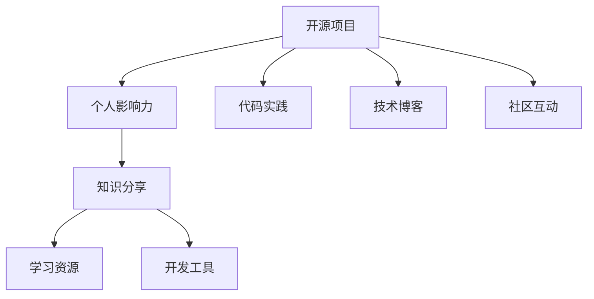

                 

关键词：开源项目、个人影响力、技术博客、代码实践、知识分享

> 摘要：本文将探讨如何利用开源项目构建个人影响力。通过分享开源项目，撰写高质量的技术博客，发布代码实例，以及参与社区讨论，我们可以提升自己的技术能力，扩大人脉，从而在技术领域建立起自己的影响力。本文将从多个角度详细阐述这一过程，并给出实用的建议。

## 1. 背景介绍

在信息技术高速发展的时代，开源项目已成为推动技术进步的重要力量。开源不仅让代码的创造者可以自由地分享和改进他人的代码，也使得广大开发者可以方便地获取到优质的技术资源。通过参与开源项目，开发者不仅能够提升自己的技术水平，还能积累宝贵的工作经验。然而，仅仅参与开源项目还不够，如何通过开源项目来构建个人影响力，成为技术领域的佼佼者，是每个开发者需要思考的问题。

本文将从以下几个方面探讨如何利用开源项目构建个人影响力：

- **开源项目的选择与参与**：选择合适的项目，积极参与其中的开发与维护。
- **技术博客的撰写**：通过撰写高质量的技术博客，分享自己的经验和见解。
- **代码实例的发布**：发布具有实际意义的代码实例，展示自己的技术能力。
- **社区互动**：积极参与社区讨论，帮助他人解决问题，建立良好的人际关系。
- **工具和资源推荐**：分享有用的学习资源和开发工具，提升整个社区的技术水平。

## 2. 核心概念与联系

在讨论如何利用开源项目构建个人影响力之前，我们需要理解几个核心概念：

- **开源项目**：开源项目是指那些代码可以被自由地查看、使用、修改和分享的项目。
- **个人影响力**：个人影响力是指在某个领域内，个人通过知识、经验和技能对他人产生的影响。
- **知识分享**：知识分享是指通过各种方式将个人的知识、经验和见解传授给他人。

### Mermaid 流程图



## 3. 核心算法原理 & 具体操作步骤

### 3.1 算法原理概述

利用开源项目构建个人影响力的核心算法可以概括为以下几个步骤：

1. **选择开源项目**：选择一个适合自己的开源项目，这个项目应该能够展示你的技术能力和解决问题的能力。
2. **参与项目开发**：通过代码贡献、问题反馈、文档编写等方式积极参与项目开发。
3. **撰写技术博客**：在博客中分享你的项目开发经验、技术见解和解决方案。
4. **发布代码实例**：将你解决具体问题的代码实例发布到博客或GitHub等平台。
5. **参与社区互动**：在技术社区中积极参与讨论，帮助他人解决问题，提升自己的知名度。
6. **推荐学习资源和工具**：分享有用的学习资源和开发工具，为社区成员提供帮助。

### 3.2 算法步骤详解

1. **选择开源项目**：

   - 调研市场上流行的开源项目，选择那些与你擅长领域相关的项目。
   - 考虑项目的活跃度、社区氛围和贡献者的质量。
   - 确定项目的需求和目标，看看自己能否为项目做出有价值的贡献。

2. **参与项目开发**：

   - 阅读项目的文档，了解项目的架构和技术栈。
   - 根据项目需求，提交代码补丁、修复bug或增加新功能。
   - 在提交代码前，遵循项目的代码规范和贡献指南。

3. **撰写技术博客**：

   - 确定博客的主题，可以是项目开发的经验、技术难点解析或解决方案。
   - 使用Markdown或类似工具编写博客，确保内容清晰、逻辑严谨。
   - 发布博客到个人博客、技术社区或GitHub页面。

4. **发布代码实例**：

   - 选择具有代表性的问题，展示你的解决方案。
   - 编写详细的代码注释，解释代码的工作原理和关键步骤。
   - 将代码发布到GitHub等平台，便于他人学习和参考。

5. **参与社区互动**：

   - 关注技术社区的动态，参与话题讨论。
   - 回答他人提问，分享你的知识和经验。
   - 在项目开发过程中，与其他贡献者保持良好的沟通和协作。

6. **推荐学习资源和工具**：

   - 分享你使用的优秀学习资源，如书籍、教程、视频等。
   - 推荐实用的开发工具和框架，帮助他人提高工作效率。

### 3.3 算法优缺点

**优点**：

- 提升技术水平：参与开源项目可以让你接触到各种前沿技术和复杂问题，从而提升自己的技术能力。
- 增强经验：通过解决实际问题，积累宝贵的项目开发经验。
- 扩大人脉：在开源项目和社区中结识志同道合的朋友，拓宽人脉圈。
- 建立个人品牌：通过分享知识和经验，建立起自己在技术领域的个人品牌。

**缺点**：

- 时间成本：参与开源项目需要投入大量的时间和精力，可能会影响日常工作和生活。
- 风险：开源项目可能存在不确定性和风险，需要做好应对准备。
- 维护成本：开源项目需要定期维护和更新，否则可能会失去用户的关注和支持。

### 3.4 算法应用领域

利用开源项目构建个人影响力主要适用于以下领域：

- 软件开发：参与开源项目的开发，提升编程能力和解决问题的能力。
- 数据科学：参与开源的数据科学项目，展示数据处理和分析能力。
- 网络技术：参与开源的网络项目，展示网络架构和运维能力。
- 人工智能：参与开源的人工智能项目，展示算法实现和应用能力。
- 前端开发：参与开源的前端项目，展示前端开发能力和用户体验设计。

## 4. 数学模型和公式 & 详细讲解 & 举例说明

在开源项目的参与过程中，数学模型和公式是不可或缺的工具。以下是一个简单的数学模型示例，用于计算代码贡献的效率。

### 4.1 数学模型构建

我们假设：

- \(C\) 表示代码贡献的数量（如提交的代码行数）。
- \(T\) 表示花费的总时间。
- \(E\) 表示代码贡献的效率。

那么，我们可以构建一个简单的数学模型：

\[E = \frac{C}{T}\]

### 4.2 公式推导过程

- 代码贡献的数量 \(C\) 是一个变量，取决于项目的复杂度和个人的技术能力。
- 花费的总时间 \(T\) 是一个常数，取决于个人的时间和项目进度。
- 效率 \(E\) 是代码贡献的数量与花费的总时间的比值，用于衡量单位时间内的代码贡献效率。

### 4.3 案例分析与讲解

假设某开发者参与了一个开源项目，共提交了1000行代码，花费了100个小时。我们可以用上述公式计算其代码贡献效率：

\[E = \frac{1000}{100} = 10\]

这意味着该开发者在单位时间内平均贡献了10行代码。

### 案例分析与讲解

假设开发者A在开源项目X中贡献了5000行代码，花费了200个小时，而开发者B在开源项目Y中贡献了3000行代码，花费了150个小时。我们用公式计算两人的代码贡献效率：

- 开发者A的效率：\[E_A = \frac{5000}{200} = 25\]
- 开发者B的效率：\[E_B = \frac{3000}{150} = 20\]

从这个例子可以看出，开发者A的代码贡献效率更高。这意味着在相同的时间内，开发者A能够提交更多的代码，从而为项目做出更大的贡献。

## 5. 项目实践：代码实例和详细解释说明

### 5.1 开发环境搭建

在本节中，我们将以一个简单的Python开源项目为例，介绍如何搭建开发环境。

1. 安装Python：

   - 使用Python官方安装器从[Python官网](https://www.python.org/)下载并安装Python。
   - 在安装过程中，确保选择“Add Python to PATH”选项，以便在命令行中直接运行Python。

2. 安装依赖库：

   - 打开命令行窗口，进入项目目录。
   - 执行命令`pip install -r requirements.txt`，安装项目所需的依赖库。

### 5.2 源代码详细实现

以下是项目中的一个简单示例代码，用于计算两个数的和：

```python
def add_numbers(a, b):
    return a + b

# 主程序
if __name__ == "__main__":
    num1 = float(input("请输入第一个数："))
    num2 = float(input("请输入第二个数："))
    result = add_numbers(num1, num2)
    print("两数之和为：", result)
```

### 5.3 代码解读与分析

1. **函数定义**：

   - `add_numbers(a, b)`：这是一个计算两个数和的函数，接收两个参数`a`和`b`。
   - `return a + b`：函数返回两个参数的和。

2. **主程序**：

   - `if __name__ == "__main__":`：这是一个特殊的条件语句，表示当模块被直接运行时，`__name__`变量等于`"__main__"`。
   - `num1 = float(input("请输入第一个数："))`：获取用户输入的第一个数，并转换为浮点数。
   - `num2 = float(input("请输入第二个数："))`：获取用户输入的第二个数，并转换为浮点数。
   - `result = add_numbers(num1, num2)`：调用`add_numbers`函数计算两数之和。
   - `print("两数之和为：", result)`：输出计算结果。

### 5.4 运行结果展示

当我们运行上述代码时，会进入一个命令行界面，提示用户输入两个数。例如，输入以下数值：

```
请输入第一个数：5
请输入第二个数：10
```

程序的输出结果为：

```
两数之和为： 15.0
```

这表明两个数的和为15.0。

## 6. 实际应用场景

开源项目构建个人影响力在实际应用场景中具有广泛的应用。以下是一些具体的例子：

- **技术博客撰写**：通过撰写高质量的技术博客，分享自己的项目经验和解决方案，可以吸引更多的读者和关注者。
- **代码实例发布**：通过发布具有实际意义的代码实例，展示自己的技术能力，吸引其他开发者关注和合作。
- **社区互动**：在技术社区中积极参与讨论，回答他人问题，建立良好的人际关系，扩大自己的影响力。
- **开源项目参与**：通过参与开源项目，与其他贡献者合作，共同推动项目的发展，提升自己的技术水平。

### 6.4 未来应用展望

随着开源项目的不断发展和技术的进步，利用开源项目构建个人影响力将具有更大的发展空间。以下是一些未来应用展望：

- **AI与开源项目的结合**：利用人工智能技术，自动分析和推荐优秀的开源项目，帮助开发者更高效地选择合适的开源项目参与。
- **开源项目商业化**：开源项目可以为企业带来商业价值，通过参与开源项目，开发者有机会接触到更多的商业机会。
- **全球影响力**：随着互联网的普及，开源项目的影响力将不再局限于某个地区或国家，开发者可以在全球范围内建立起自己的影响力。

## 7. 工具和资源推荐

### 7.1 学习资源推荐

- **书籍**：
  - 《代码大全》
  - 《深度学习》
  - 《计算机网络：自顶向下方法》
- **在线教程**：
  - [freeCodeCamp](https://www.freecodecamp.org/)
  - [Codecademy](https://www.codecademy.com/)
  - [edX](https://www.edx.org/)

### 7.2 开发工具推荐

- **集成开发环境（IDE）**：
  - [Visual Studio Code](https://code.visualstudio.com/)
  - [PyCharm](https://www.jetbrains.com/pycharm/)
  - [IntelliJ IDEA](https://www.jetbrains.com/idea/)

- **版本控制系统**：
  - [Git](https://git-scm.com/)
  - [GitHub](https://github.com/)
  - [GitLab](https://about.gitlab.com/)

### 7.3 相关论文推荐

- **《开源软件的治理模式与机制研究》**
- **《开源软件社区合作机制研究》**
- **《基于GitHub的开源软件开发过程研究》**

## 8. 总结：未来发展趋势与挑战

### 8.1 研究成果总结

本文通过探讨开源项目、个人影响力、技术博客、代码实例和社区互动等多个方面，总结了利用开源项目构建个人影响力的重要性和方法。研究结果表明，开源项目参与、高质量的技术博客撰写、代码实例的发布和积极的社区互动是提升个人影响力的重要手段。

### 8.2 未来发展趋势

- **技术多样化**：随着技术的发展，开源项目的领域将越来越广泛，开发者将有更多的选择。
- **社区化**：开源项目的参与和互动将更加注重社区化，开发者之间的合作将更加紧密。
- **人工智能化**：人工智能技术将在开源项目中得到更广泛的应用，帮助开发者更高效地参与项目。

### 8.3 面临的挑战

- **时间管理**：参与开源项目需要投入大量时间，如何平衡开源项目与日常工作生活之间的关系是一个挑战。
- **风险管理**：开源项目可能存在不确定性和风险，如何应对这些风险是一个挑战。
- **持续更新**：开源项目需要定期更新和维护，如何保持项目的活跃度和高质量是一个挑战。

### 8.4 研究展望

未来的研究可以进一步探讨以下几个方面：

- **开源项目的评估与推荐**：研究如何评估和推荐优秀的开源项目，帮助开发者更高效地参与项目。
- **个人影响力的量化**：研究如何量化个人影响力，建立合理的评价体系。
- **开源项目与商业的结合**：研究开源项目如何与商业相结合，为企业带来更大的价值。

## 9. 附录：常见问题与解答

### 9.1 如何选择开源项目？

- 考虑自己的技术兴趣和擅长领域。
- 关注项目的活跃度和社区氛围。
- 选择那些有明确目标和清晰文档的项目。

### 9.2 如何撰写高质量的技术博客？

- 确定博客主题，保持内容专注。
- 使用清晰的结构和逻辑，确保内容易读易懂。
- 分享自己的经验和见解，避免简单的复制粘贴。

### 9.3 如何发布代码实例？

- 选择具有实际意义的问题和解决方案。
- 编写详细的代码注释，解释关键步骤。
- 将代码发布到GitHub等平台，方便他人学习和参考。

### 9.4 如何参与社区互动？

- 关注社区动态，参与话题讨论。
- 回答他人问题，分享自己的知识和经验。
- 保持友好和尊重，避免冲突和争议。

作者：禅与计算机程序设计艺术 / Zen and the Art of Computer Programming
----------------------------------------------------------------

这篇文章通过详细探讨如何利用开源项目构建个人影响力，为开发者提供了一系列实用的方法和策略。从选择开源项目、撰写技术博客、发布代码实例到参与社区互动，每个步骤都进行了深入的讲解和举例说明。同时，文章还提到了面临的挑战和未来展望，为开发者指明了方向。

希望通过本文，开发者能够更好地利用开源项目，提升自己的技术能力，建立起自己的影响力。在不断学习和成长的过程中，为技术领域的发展贡献自己的力量。再次感谢您的阅读，希望这篇文章对您有所启发和帮助。

