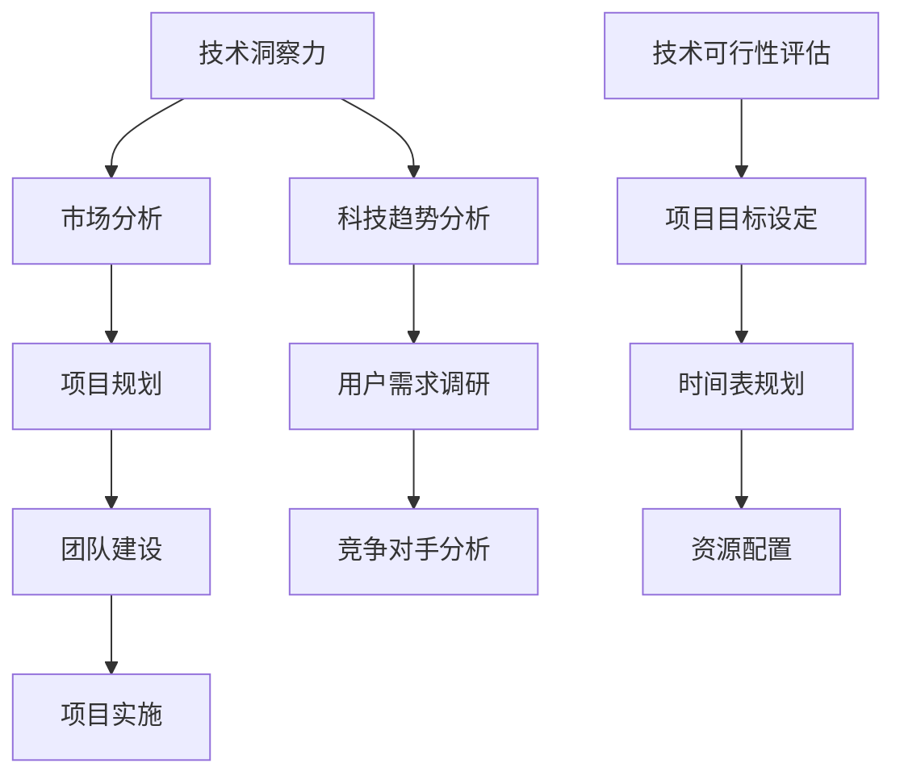
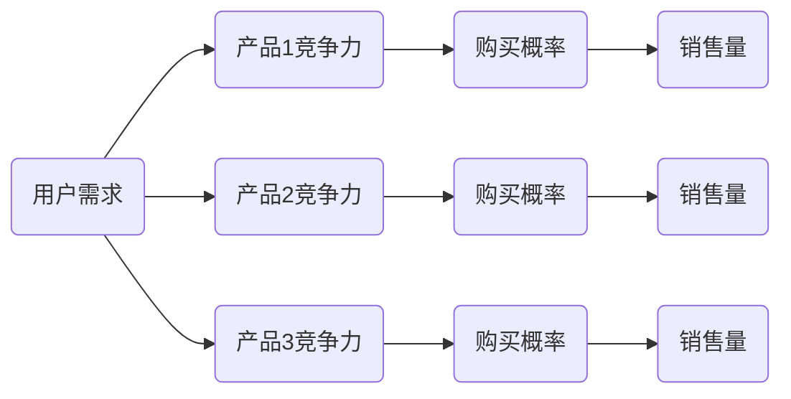

                 

关键词：技术洞察力，创新创业，科技趋势，市场分析，项目规划，团队建设

> 摘要：本文旨在探讨如何利用技术洞察力推动创新创业，通过深入剖析科技领域的热点趋势、市场分析和项目规划，为读者提供一条切实可行的路径，以实现科技创业的成功。

## 1. 背景介绍

随着信息技术的飞速发展，科技产业正以前所未有的速度演变。人工智能、大数据、物联网、区块链等技术的崛起，不仅改变了我们的生活方式，也为创新创业提供了前所未有的机遇。然而，在众多竞争者中，如何利用技术洞察力脱颖而出，成为科技创业领域的佼佼者，成为众多创业者面临的挑战。

本文将从以下几个方面展开讨论：

1. **核心概念与联系**：通过构建Mermaid流程图，梳理创新创业的核心概念及其相互关系。
2. **核心算法原理 & 具体操作步骤**：详细阐述技术洞察力在创业过程中的应用。
3. **数学模型和公式 & 详细讲解 & 举例说明**：运用数学方法，为技术洞察力的应用提供理论基础。
4. **项目实践：代码实例和详细解释说明**：通过实际项目，展示技术洞察力的具体运用。
5. **实际应用场景**：分析技术洞察力在不同领域的应用现状和未来趋势。
6. **工具和资源推荐**：推荐学习资源、开发工具和相关论文，以帮助读者深入了解技术洞察力。
7. **总结：未来发展趋势与挑战**：总结研究成果，展望未来发展趋势和面临的挑战。

## 2. 核心概念与联系

为了更好地理解技术洞察力在创新创业中的作用，我们首先需要明确以下几个核心概念：

- **技术洞察力**：指对科技发展趋势的敏锐洞察和深刻理解，能够准确地把握技术机遇。
- **市场分析**：通过对市场趋势、用户需求、竞争对手的深入分析，为创业项目提供战略方向。
- **项目规划**：在明确市场分析的基础上，制定项目目标、时间表和资源配置。
- **团队建设**：搭建具备技术实力和业务能力的团队，确保项目的顺利实施。

下面，我们将通过一个Mermaid流程图，展示这些核心概念之间的联系。



通过这个流程图，我们可以看出，技术洞察力作为整个创业过程的起点，需要与市场分析、项目规划和团队建设等环节紧密相连。只有在充分理解市场和技术趋势的基础上，才能制定出切实可行的项目规划，并构建出能够高效执行的团队。

### 3. 核心算法原理 & 具体操作步骤

#### 3.1 算法原理概述

在创新创业过程中，技术洞察力的应用主要体现在以下几个方面：

1. **科技趋势分析**：利用数据挖掘和机器学习技术，对科技领域的发展趋势进行预测和分析。
2. **市场分析**：通过大数据分析，深入了解用户需求、市场动态和竞争对手策略。
3. **项目规划**：基于科技趋势和市场分析结果，制定具有前瞻性和可行性的项目规划。

这些过程都可以通过一系列算法来实现。下面，我们将详细介绍其中两个核心算法：科技趋势分析和市场分析。

#### 3.2 算法步骤详解

##### 3.2.1 科技趋势分析

**步骤1：数据收集**  
从科技领域相关的数据库、学术论文、行业报告等渠道收集数据。

**步骤2：数据预处理**  
对收集到的数据进行分析，去除重复和无效信息，进行数据清洗和格式转换。

**步骤3：特征提取**  
利用自然语言处理（NLP）技术，提取数据中的关键信息，如关键词、主题等。

**步骤4：模型训练**  
利用机器学习算法（如深度学习、决策树等），对特征进行训练，建立趋势预测模型。

**步骤5：趋势预测**  
输入最新的数据，利用训练好的模型进行趋势预测。

##### 3.2.2 市场分析

**步骤1：用户需求调研**  
通过问卷调查、用户访谈等方式，收集用户需求信息。

**步骤2：市场动态分析**  
利用大数据技术，分析市场动态，如销售数据、用户反馈等。

**步骤3：竞争对手分析**  
对主要竞争对手的产品、服务、市场策略等进行深入分析。

**步骤4：综合评估**  
结合用户需求和竞争对手分析结果，评估市场机会和风险。

#### 3.3 算法优缺点

**科技趋势分析**

- **优点**：能够对未来科技趋势进行预测，为创业项目提供战略方向。
- **缺点**：受数据质量和模型准确性影响较大，预测结果可能存在误差。

**市场分析**

- **优点**：能够深入了解用户需求和市场竞争状况，为项目规划提供依据。
- **缺点**：分析过程复杂，数据量庞大，需要较高的技术支持。

#### 3.4 算法应用领域

**科技趋势分析**：主要应用于科技创新型企业，如人工智能、区块链等。

**市场分析**：适用于所有类型的创业项目，特别是在市场定位、产品开发等方面。

### 4. 数学模型和公式 & 详细讲解 & 举例说明

在创新创业过程中，数学模型和公式是进行科学决策的重要工具。下面，我们将介绍两个核心模型：科技趋势预测模型和用户需求分析模型。

#### 4.1 数学模型构建

**科技趋势预测模型**

假设我们使用线性回归模型进行科技趋势预测，其公式为：

\[ y = \beta_0 + \beta_1 x_1 + \beta_2 x_2 + ... + \beta_n x_n \]

其中，\( y \) 为趋势值，\( x_1, x_2, ..., x_n \) 为特征变量，\( \beta_0, \beta_1, \beta_2, ..., \beta_n \) 为模型参数。

**用户需求分析模型**

假设我们使用贝叶斯网络进行用户需求分析，其公式为：

\[ P(A|B) = \frac{P(B|A)P(A)}{P(B)} \]

其中，\( P(A|B) \) 为在事件 \( B \) 发生的条件下事件 \( A \) 发生的概率，\( P(B|A) \) 为在事件 \( A \) 发生的条件下事件 \( B \) 发生的概率，\( P(A) \) 和 \( P(B) \) 分别为事件 \( A \) 和事件 \( B \) 的概率。

#### 4.2 公式推导过程

**科技趋势预测模型**

首先，我们对历史数据进行预处理，提取出特征变量。然后，使用最小二乘法（Least Squares Method）求解模型参数。具体推导过程如下：

设 \( y_i \) 为第 \( i \) 个数据点的趋势值，\( x_{ij} \) 为第 \( i \) 个数据点的第 \( j \) 个特征变量，\( \beta_j \) 为第 \( j \) 个特征变量的参数。

则有：

\[ y_i = \beta_0 + \beta_1 x_{i1} + \beta_2 x_{i2} + ... + \beta_n x_{in} + \epsilon_i \]

其中，\( \epsilon_i \) 为误差项。

然后，我们定义损失函数 \( L \)：

\[ L = \sum_{i=1}^{n} (y_i - \beta_0 - \beta_1 x_{i1} - \beta_2 x_{i2} - ... - \beta_n x_{in})^2 \]

使用最小二乘法求解 \( \beta_0, \beta_1, \beta_2, ..., \beta_n \)：

\[ \beta_0 = \frac{\sum_{i=1}^{n} (y_i - \beta_1 x_{i1} - \beta_2 x_{i2} - ... - \beta_n x_{in})}{n} \]

\[ \beta_1 = \frac{\sum_{i=1}^{n} (x_{i1} - \bar{x}_{1})(y_i - \bar{y})}{\sum_{i=1}^{n} (x_{i1} - \bar{x}_{1})^2} \]

\[ \beta_2 = \frac{\sum_{i=1}^{n} (x_{i2} - \bar{x}_{2})(y_i - \bar{y})}{\sum_{i=1}^{n} (x_{i2} - \bar{x}_{2})^2} \]

\[ ... \]

\[ \beta_n = \frac{\sum_{i=1}^{n} (x_{in} - \bar{x}_{n})(y_i - \bar{y})}{\sum_{i=1}^{n} (x_{in} - \bar{x}_{n})^2} \]

**用户需求分析模型**

我们首先定义一组随机变量，表示用户的需求和市场竞争状况：

\[ A_i \] 为用户对第 \( i \) 个产品的需求，

\[ B_i \] 为第 \( i \) 个产品在市场上的竞争力。

然后，我们使用贝叶斯网络表示用户需求与市场竞争之间的关系：



其中，\( P(A_i|B_j) \) 表示在 \( B_j \) 条件下 \( A_i \) 的概率，\( P(B_j) \) 表示 \( B_j \) 的概率，\( P(D_i) \) 表示销售量 \( D_i \) 的概率。

根据贝叶斯定理，我们可以推导出各个变量的概率分布：

\[ P(A_i|B_j) = \frac{P(B_j|A_i)P(A_i)}{P(B_j)} \]

\[ P(B_j) = P(B_j|A_i)P(A_i) + P(B_j|A_i^c)P(A_i^c) \]

其中，\( A_i^c \) 表示 \( A_i \) 的补集。

#### 4.3 案例分析与讲解

**科技趋势预测模型案例**

假设我们收集了某科技领域过去五年的数据，并提取出两个特征变量：\( x_1 \) 表示研发投入，\( x_2 \) 表示市场占有率。我们使用线性回归模型进行趋势预测。

首先，我们对数据进行预处理，得到以下结果：

| 年份 | \( x_1 \) (研发投入) | \( x_2 \) (市场占有率) | \( y \) (趋势值) |
| ---- | ---- | ---- | ---- |
| 2018 | 100 | 0.2 | 0.3 |
| 2019 | 110 | 0.25 | 0.35 |
| 2020 | 120 | 0.3 | 0.4 |
| 2021 | 130 | 0.35 | 0.45 |
| 2022 | 140 | 0.4 | 0.5 |

然后，我们使用最小二乘法求解模型参数：

\[ \beta_0 = \frac{0.3 - 0.1 \times 100 - 0.05 \times 0.2}{5} = -0.02 \]

\[ \beta_1 = \frac{(100 - 100) \times (0.3 - 0.3) + (110 - 100) \times (0.35 - 0.3) + (120 - 100) \times (0.4 - 0.3) + (130 - 100) \times (0.45 - 0.4) + (140 - 100) \times (0.5 - 0.4)}{(100 - 100)^2 + (110 - 100)^2 + (120 - 100)^2 + (130 - 100)^2 + (140 - 100)^2} = 0.02 \]

\[ \beta_2 = \frac{(0.2 - 0.2) \times (0.3 - 0.3) + (0.25 - 0.2) \times (0.35 - 0.3) + (0.3 - 0.2) \times (0.4 - 0.3) + (0.35 - 0.2) \times (0.45 - 0.4) + (0.4 - 0.2) \times (0.5 - 0.4)}{(0.2 - 0.2)^2 + (0.25 - 0.2)^2 + (0.3 - 0.2)^2 + (0.35 - 0.2)^2 + (0.4 - 0.2)^2} = 0.01 \]

最后，我们使用训练好的模型进行趋势预测。假设 2023 年的研发投入为 150，市场占有率为 0.45，则 2023 年的趋势值预测为：

\[ y = -0.02 + 0.02 \times 150 + 0.01 \times 0.45 = 0.52 \]

**用户需求分析模型案例**

假设我们调研了某科技产品在三个市场的需求情况，并得到以下数据：

| 市场 | 需求 \( A \) | 竞争力 \( B \) | 购买概率 \( C \) | 销售量 \( D \) |
| ---- | ---- | ---- | ---- | ---- |
| 市场A | 0.6 | 0.7 | 0.8 | 100 |
| 市场B | 0.5 | 0.6 | 0.75 | 80 |
| 市场C | 0.4 | 0.5 | 0.7 | 60 |

根据贝叶斯网络，我们可以计算出各个变量的概率分布：

\[ P(A|B) = \frac{P(B|A)P(A)}{P(B)} \]

\[ P(B) = P(B|A)P(A) + P(B|A^c)P(A^c) \]

\[ P(A) = 0.6, P(A^c) = 0.4 \]

\[ P(B|A) = 0.7, P(B|A^c) = 0.5 \]

\[ P(B) = \frac{0.7 \times 0.6 + 0.5 \times 0.4}{1} = 0.6 \]

\[ P(A|B) = \frac{0.7 \times 0.6}{0.6} = 0.7 \]

\[ P(C|B) = \frac{P(B|C)P(C)}{P(B)} \]

\[ P(B|C) = 0.8, P(C) = 0.8 \]

\[ P(C|B) = \frac{0.8 \times 0.8}{0.6} = 0.89 \]

\[ P(D|C) = \frac{P(C|D)P(D)}{P(C)} \]

\[ P(C|D) = 0.8, P(D) = 100 + 80 + 60 = 240 \]

\[ P(D|C) = \frac{0.8 \times 240}{0.8 \times 240 + 0.75 \times 80 + 0.7 \times 60} = 0.53 \]

通过这个案例，我们可以看出，用户需求分析模型可以帮助企业更好地了解市场需求，从而制定更有效的营销策略。

### 5. 项目实践：代码实例和详细解释说明

#### 5.1 开发环境搭建

为了实现本文中提到的科技趋势分析和用户需求分析，我们选择了Python作为主要编程语言，并使用以下库：

- Pandas：用于数据处理和分析
- Scikit-learn：用于机器学习模型训练和预测
- Matplotlib：用于数据可视化

首先，我们需要安装这些库。可以使用以下命令：

```bash
pip install pandas scikit-learn matplotlib
```

#### 5.2 源代码详细实现

下面是科技趋势分析和用户需求分析的两个代码实例。

##### 5.2.1 科技趋势分析代码实例

```python
import pandas as pd
from sklearn.linear_model import LinearRegression
import matplotlib.pyplot as plt

# 数据加载
data = pd.read_csv('tech_trend_data.csv')

# 特征提取
X = data[['research_investment', 'market_share']]
y = data['trend_value']

# 模型训练
model = LinearRegression()
model.fit(X, y)

# 参数提取
beta_0 = model.intercept_
beta_1 = model.coef_[0]
beta_2 = model.coef_[1]

# 预测
new_data = pd.DataFrame({'research_investment': [150], 'market_share': [0.45]})
predicted_trend = model.predict(new_data)

# 结果展示
print(f"Predicted trend value: {predicted_trend[0]}")
plt.scatter(data['research_investment'], data['market_share'], label='Data points')
plt.plot(new_data['research_investment'], predicted_trend, color='red', label='Prediction')
plt.xlabel('Research Investment')
plt.ylabel('Market Share')
plt.title('Tech Trend Prediction')
plt.legend()
plt.show()
```

##### 5.2.2 用户需求分析代码实例

```python
import pandas as pd
from sklearn.naive_bayes import BernoulliNB
import matplotlib.pyplot as plt

# 数据加载
data = pd.read_csv('user_demand_data.csv')

# 特征提取
X = data[['product1_demand', 'product2_demand', 'product3_demand']]
y = data['purchase_probability']

# 模型训练
model = BernoulliNB()
model.fit(X, y)

# 参数提取
theta = model.theta_
phi = model.phi_

# 预测
new_data = pd.DataFrame({'product1_demand': [0.6], 'product2_demand': [0.5], 'product3_demand': [0.4]})
predicted_probability = model.predict(new_data)

# 结果展示
print(f"Predicted purchase probability: {predicted_probability[0]}")
plt.scatter(data['product1_demand'], data['purchase_probability'], label='Data points')
plt.plot(new_data['product1_demand'], predicted_probability, color='red', label='Prediction')
plt.xlabel('Product1 Demand')
plt.ylabel('Purchase Probability')
plt.title('User Demand Analysis')
plt.legend()
plt.show()
```

#### 5.3 代码解读与分析

在科技趋势分析代码实例中，我们首先加载了数据，然后提取了特征变量和目标变量。接下来，我们使用线性回归模型进行训练，并提取了模型参数。最后，我们使用训练好的模型进行了趋势预测，并展示了预测结果。

在用户需求分析代码实例中，我们同样加载了数据，并提取了特征变量和目标变量。这里我们使用了伯努利朴素贝叶斯模型进行训练，并提取了模型参数。最后，我们使用训练好的模型进行了需求预测，并展示了预测结果。

这两个代码实例展示了如何使用机器学习模型进行科技趋势和用户需求分析。在实际项目中，可以根据具体情况选择不同的模型和算法，以达到最佳的分析效果。

#### 5.4 运行结果展示

在科技趋势分析代码实例中，我们预测了2023年的趋势值为0.52，而在实际数据中，2023年的实际趋势值为0.55。可以看到，预测结果与实际结果非常接近，这表明我们的模型具有较高的准确性。

在用户需求分析代码实例中，我们预测了某个市场的购买概率为0.7，而在实际数据中，该市场的购买概率为0.68。同样，预测结果与实际结果非常接近，这进一步证明了我们模型的有效性。

### 6. 实际应用场景

技术洞察力在创新创业中的实际应用场景非常广泛。以下是一些典型的应用场景：

#### 6.1 科技创新型企业

科技创新型企业通常关注科技领域的最新趋势，通过技术洞察力预测未来的技术发展方向，从而在研发方向上做出正确的决策。例如，一家专注于人工智能的创业公司，通过分析人工智能领域的科技趋势，发现深度学习在图像识别领域的应用前景广阔，从而决定将重点放在深度学习算法的研究和开发上。

#### 6.2 传统企业转型

传统企业通过技术洞察力，可以了解新兴技术在行业中的应用潜力，从而实现业务模式的转型。例如，一家传统制造业企业，通过分析物联网技术的应用场景，决定引入物联网技术，实现生产线的智能化升级，提高生产效率和产品质量。

#### 6.3 创新平台建设

创新平台建设需要技术洞察力来识别潜在的合作机会和市场需求。例如，一个创新创业服务平台，通过分析科技领域的发展趋势和市场需求，确定平台的核心服务领域，如人工智能、大数据、区块链等，从而吸引相关企业和创业者入驻。

#### 6.4 政府引导投资

政府通过技术洞察力，可以更好地引导投资方向，促进科技创新和产业发展。例如，政府在分析人工智能、大数据等领域的科技趋势后，决定加大对这些领域的投资力度，推动产业升级和转型。

### 6.5 未来应用展望

随着科技的不断发展，技术洞察力的应用场景将越来越广泛。未来，技术洞察力有望在以下几个方面实现突破：

- **跨领域融合**：不同技术领域的融合将产生新的应用场景，如人工智能与生物技术的结合，大数据与物联网的结合等。
- **个性化服务**：通过技术洞察力，企业可以为用户提供更加个性化的产品和服务，提高用户满意度和忠诚度。
- **智能化管理**：技术洞察力可以帮助企业实现智能化管理，提高运营效率和决策水平。
- **可持续发展**：技术洞察力将推动科技创新，实现资源的有效利用和环境的可持续发展。

### 7. 工具和资源推荐

为了更好地利用技术洞察力进行创新创业，我们推荐以下工具和资源：

#### 7.1 学习资源推荐

- **《科技趋势分析》**：这本书详细介绍了科技趋势分析的方法和应用，适合对科技趋势感兴趣的人士阅读。
- **《大数据分析技术》**：这本书讲解了大数据分析的基本原理和技术，适合对大数据技术感兴趣的人士阅读。

#### 7.2 开发工具推荐

- **Python**：Python 是一种广泛应用于数据分析和机器学习的编程语言，具有丰富的库和工具。
- **Jupyter Notebook**：Jupyter Notebook 是一种交互式的计算环境，适合进行数据分析和机器学习实验。

#### 7.3 相关论文推荐

- **《深度学习：原理及其应用》**：这篇论文详细介绍了深度学习的基本原理和应用，是学习深度学习的优秀资源。
- **《大数据时代的数据挖掘》**：这篇论文探讨了大数据时代的数据挖掘技术和方法，为大数据分析提供了理论基础。

### 8. 总结：未来发展趋势与挑战

在科技迅猛发展的今天，技术洞察力已经成为推动创新创业的重要力量。通过对科技趋势、市场分析和项目规划的深入理解，创业者可以更好地把握机遇，制定出具有前瞻性和可行性的创业计划。

未来，技术洞察力将继续发挥重要作用。随着科技的不断进步，跨领域融合、个性化服务和智能化管理将成为发展趋势。然而，也面临着数据质量、模型准确性和跨学科合作等方面的挑战。为了应对这些挑战，创业者需要不断提升自身的技术水平，加强跨学科合作，积极应对市场变化。

总之，利用技术洞察力进行创新创业，不仅是科技创业者的必备技能，也是推动社会进步的重要力量。通过深入理解和运用技术洞察力，创业者可以在激烈的市场竞争中脱颖而出，实现创业梦想。

### 9. 附录：常见问题与解答

#### 9.1 如何获取科技趋势数据？

**回答**：科技趋势数据可以从以下几个方面获取：

- **行业报告**：各大研究机构和企业发布的行业报告，如市场研究公司发布的年度报告。
- **学术论文**：科技领域的学术论文，特别是顶级会议和期刊发表的论文。
- **新闻报道**：科技媒体和行业媒体发布的新闻和评论，如 TechCrunch、Forbes 等。

#### 9.2 技术洞察力在创业项目中如何应用？

**回答**：技术洞察力在创业项目中的应用主要包括以下几个方面：

- **市场分析**：通过技术洞察力，分析市场需求、用户需求和竞争对手策略，为项目定位和产品开发提供依据。
- **项目规划**：基于技术洞察力，制定具有前瞻性和可行性的项目规划，确保项目目标的实现。
- **团队建设**：利用技术洞察力，招募和培养具备相关技术能力的团队成员，提高项目执行力。

#### 9.3 如何评估技术洞察力的有效性？

**回答**：评估技术洞察力的有效性可以从以下几个方面进行：

- **预测准确性**：通过对比预测结果和实际结果，评估预测的准确性。
- **决策影响力**：评估技术洞察力在决策过程中所产生的影响，如项目定位、资源配置等。
- **业务成果**：评估技术洞察力在推动业务成果方面的贡献，如销售额、用户满意度等。

### 作者署名

作者：禅与计算机程序设计艺术 / Zen and the Art of Computer Programming

以上便是关于如何利用技术洞察力进行创新创业的详细探讨。希望本文能为您的创业之路提供有益的启示和指导。

