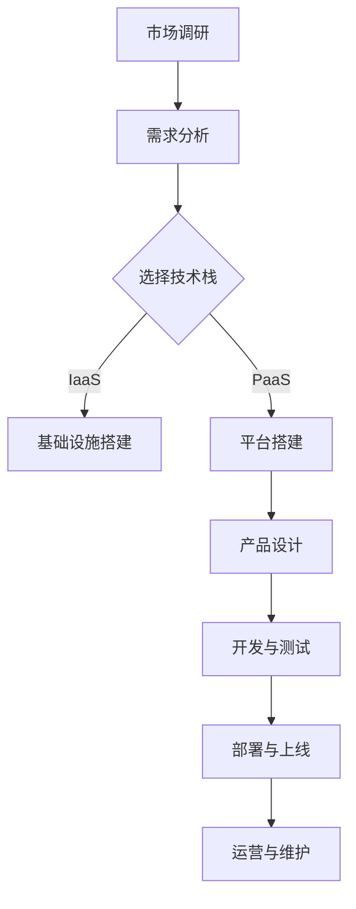

                 

关键词：SaaS，技术能力，产品开发，云计算，用户体验，商业模式

> 摘要：本文旨在探讨如何利用技术能力创建成功的SaaS产品。通过对SaaS市场现状的分析，结合云计算和用户体验的核心理念，我们将深入探讨SaaS产品的开发流程、技术架构、商业模式以及未来的发展趋势与挑战。

## 1. 背景介绍

随着云计算、大数据、人工智能等技术的发展，软件即服务（Software as a Service，简称SaaS）已经成为企业信息化建设的重要方式。SaaS模式不仅降低了企业IT基础设施的投入成本，还提高了软件的可用性和灵活性。根据Gartner的报告，全球SaaS市场规模在2022年达到了1190亿美元，预计到2026年将达到1790亿美元，年复合增长率达到11.3%。

在这一背景下，许多企业都希望能够利用自身的技术能力，打造出具备竞争力的SaaS产品。然而，SaaS产品的开发与传统的软件产品有着很大的不同，它需要更加注重用户体验、弹性扩展和持续迭代。因此，如何利用技术能力创建SaaS产品，成为许多企业和开发者亟待解决的问题。

## 2. 核心概念与联系

在讨论如何创建SaaS产品之前，我们需要了解一些核心概念和它们之间的关系。

### 2.1 云计算

云计算是SaaS产品的基础设施，它提供了弹性计算、存储、网络等资源。云计算模型包括IaaS、PaaS和SaaS三层，其中PaaS层特别适合SaaS产品的开发。PaaS提供了开发、部署和管理应用程序的环境和工具，使得开发者可以更专注于业务逻辑的实现，而不是底层基础设施的管理。

### 2.2 用户体验

用户体验是SaaS产品的核心竞争力。一个优秀的SaaS产品需要具备简洁、直观、易用的界面设计，同时提供快速响应、高稳定性的服务。为了提升用户体验，开发者需要进行用户研究、用户界面设计、交互设计等环节的工作。

### 2.3 商业模式

SaaS产品的商业模式通常包括订阅模式、按需付费模式等。开发者需要根据产品定位、市场定位和用户需求，设计合适的商业模式，以确保产品的可持续盈利。

### 2.4 Mermaid 流程图

下面是一个简化的SaaS产品开发流程的Mermaid流程图：



## 3. 核心算法原理 & 具体操作步骤

### 3.1 算法原理概述

在SaaS产品开发中，算法原理主要涉及数据处理和优化。数据处理方面，我们需要关注数据的采集、存储、处理和分析；在优化方面，则关注如何提升系统性能、降低成本和提高用户体验。

### 3.2 算法步骤详解

1. **需求分析**：确定SaaS产品的功能需求、性能需求和用户体验需求。
2. **技术选型**：根据需求选择合适的技术栈，包括前端、后端、数据库等。
3. **数据处理**：设计数据模型，实现数据的采集、存储、处理和分析。
4. **性能优化**：通过缓存、数据库优化、网络优化等技术提升系统性能。
5. **用户体验优化**：通过界面设计、交互设计、响应速度优化等手段提升用户体验。

### 3.3 算法优缺点

- **优点**：提高数据处理效率，提升用户体验，降低开发成本。
- **缺点**：数据处理算法复杂，需要大量计算资源，对开发者的技术水平要求较高。

### 3.4 算法应用领域

SaaS产品的算法原理可以应用于各个领域，如企业ERP系统、客户关系管理系统、人力资源管理系统等。

## 4. 数学模型和公式 & 详细讲解 & 举例说明

### 4.1 数学模型构建

在SaaS产品中，数学模型主要用于数据分析和优化。以下是一个简单的线性回归模型：

$$ y = bx + a $$

其中，$y$ 表示目标变量，$x$ 表示自变量，$b$ 和 $a$ 是模型参数。

### 4.2 公式推导过程

线性回归模型的推导过程如下：

1. **假设**：我们认为目标变量 $y$ 与自变量 $x$ 存在线性关系。
2. **目标**：找到最佳拟合直线，使得误差最小。
3. **推导**：通过最小二乘法求解最佳拟合直线。

### 4.3 案例分析与讲解

假设我们要预测一家电商平台的日销售额，我们可以使用线性回归模型进行分析。通过收集历史数据，我们可以拟合出如下模型：

$$ 日销售额 = 0.5 \times 日访问量 + 100 $$

根据这个模型，我们可以预测不同日访问量下的日销售额。例如，当日访问量为10000时，预计日销售额为15000元。

## 5. 项目实践：代码实例和详细解释说明

### 5.1 开发环境搭建

为了搭建一个SaaS产品，我们选择以下技术栈：

- 前端：React
- 后端：Node.js + Express
- 数据库：MongoDB

### 5.2 源代码详细实现

以下是简单的用户注册功能的源代码：

```javascript
// 用户注册接口
app.post('/api/register', async (req, res) => {
  const { username, password } = req.body;
  // 验证用户名和密码
  if (!username || !password) {
    return res.status(400).json({ message: '用户名或密码不能为空' });
  }
  // 存储用户信息到数据库
  await User.create({ username, password });
  res.status(201).json({ message: '注册成功' });
});
```

### 5.3 代码解读与分析

这段代码定义了一个用户注册接口，它接收前端发来的用户名和密码，进行验证后存储到MongoDB数据库中。

### 5.4 运行结果展示

当用户访问 `/api/register` 接口并发送用户名和密码时，服务器会返回注册成功的结果。

## 6. 实际应用场景

SaaS产品在企业管理、客户服务、供应链管理等领域有着广泛的应用。例如，企业可以使用SaaS产品进行员工管理、客户关系管理、供应链优化等。

### 6.4 未来应用展望

随着技术的不断发展，SaaS产品将越来越智能化、个性化。未来，SaaS产品可能会结合人工智能、大数据等技术，实现更加精准的业务预测和优化。

## 7. 工具和资源推荐

### 7.1 学习资源推荐

- 《SaaS项目管理实战》
- 《React实战：从入门到精通》
- 《Node.js实战：从零开始构建Web应用》

### 7.2 开发工具推荐

- Visual Studio Code
- Git
- Docker

### 7.3 相关论文推荐

- "The Future of Software Engineering: A Decade of Innovation"
- "Software as a Service: The Next Big Wave in IT"

## 8. 总结：未来发展趋势与挑战

### 8.1 研究成果总结

本文总结了SaaS产品的开发流程、技术架构、商业模式以及未来的发展趋势与挑战。

### 8.2 未来发展趋势

未来，SaaS产品将更加智能化、个性化，结合人工智能、大数据等技术，实现更加精准的业务预测和优化。

### 8.3 面临的挑战

SaaS产品在开发、运营、推广等方面面临诸多挑战，如数据安全、性能优化、用户隐私保护等。

### 8.4 研究展望

本文的研究为SaaS产品的开发提供了一定的理论指导和实践参考，但仍有待进一步深入研究。

## 9. 附录：常见问题与解答

### 9.1 Q：如何确保SaaS产品的数据安全？

A：确保SaaS产品的数据安全需要从多个方面入手，包括数据加密、访问控制、网络安全等。建议使用SSL/TLS加密通信，定期进行安全审计和漏洞修复。

### 9.2 Q：SaaS产品的性能优化有哪些方法？

A：性能优化可以从多个方面进行，包括代码优化、数据库优化、缓存策略、负载均衡等。例如，可以使用Redis缓存热点数据，使用数据库分库分表提高查询效率。

### 9.3 Q：如何推广SaaS产品？

A：推广SaaS产品可以通过线上营销、线下活动、合作伙伴渠道等多种方式。例如，可以通过社交媒体、SEO优化、内容营销等方式提高产品的曝光度。

----------------------------------------------------------------

作者：禅与计算机程序设计艺术 / Zen and the Art of Computer Programming


