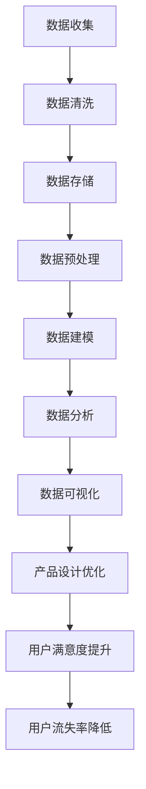

                 

 在当今的数字化时代，用户体验（User Experience，简称UX）已成为企业竞争的核心。用户的需求日益多样化，企业需要通过数据分析来深入了解用户行为，从而优化产品设计和服务，提升用户体验。本文将探讨如何利用数据分析优化用户体验，并分享一些实际操作方法和工具。

## 文章关键词

数据分析、用户体验、用户行为、优化、产品设计、服务改进

## 文章摘要

本文旨在阐述如何通过数据分析优化用户体验。首先，我们介绍了数据分析在用户体验优化中的重要性。接着，我们探讨了数据分析的基本概念和方法，包括用户行为分析、满意度调查和反馈分析等。然后，我们提出了几种常见的数据分析工具和技术，如A/B测试、机器学习和数据挖掘等。最后，我们通过实际案例展示了数据分析在用户体验优化中的应用，并展望了未来的发展趋势。

## 1. 背景介绍

在数字化浪潮的推动下，互联网和移动设备的普及使得用户体验成为了企业关注的焦点。用户体验不仅仅是指产品的视觉效果和交互设计，还包括用户在使用产品过程中的情感体验和满意度。一个优秀的用户体验能够提升用户忠诚度，增加用户黏性，从而为企业带来更高的商业价值。

然而，用户体验的优化并非易事。用户的需求和喜好是多样化的，企业需要通过数据来了解用户的行为和反馈，从而进行针对性的改进。数据分析作为一种科学的方法，可以帮助企业从海量数据中挖掘有价值的信息，指导产品设计和服务的优化。

数据分析在用户体验优化中的应用主要体现在以下几个方面：

1. **用户行为分析**：通过分析用户的浏览、点击、购买等行为，了解用户的偏好和需求。
2. **满意度调查**：通过问卷调查、用户访谈等方式收集用户对产品和服务的满意度，了解用户的需求和痛点。
3. **反馈分析**：通过用户反馈，识别产品中的问题，并采取措施进行改进。

## 2. 核心概念与联系

### 2.1 数据分析的基本概念

数据分析是指通过收集、处理、分析和解释数据，从中提取有价值信息的过程。数据分析可以分为以下几个步骤：

1. **数据收集**：通过不同的渠道收集数据，如日志文件、问卷调查、用户反馈等。
2. **数据清洗**：去除数据中的噪声和错误，保证数据的质量。
3. **数据存储**：将清洗后的数据存储到数据库或数据仓库中，方便后续的处理和分析。
4. **数据预处理**：对数据进行标准化、转换和聚合，为建模和分析做好准备。
5. **数据建模**：根据业务需求选择合适的建模方法，如回归分析、聚类分析、分类分析等。
6. **数据分析**：对建模后的数据进行计算和分析，提取有价值的信息。
7. **数据可视化**：将分析结果以图表、仪表板等形式展示，便于理解和决策。

### 2.2 数据分析与用户体验的关系

数据分析与用户体验的关系可以概括为以下几点：

1. **了解用户需求**：通过用户行为分析和满意度调查，了解用户的实际需求和偏好，为产品设计提供依据。
2. **优化产品设计**：基于数据分析结果，对产品进行优化和改进，提升用户体验。
3. **提高用户满意度**：通过持续的数据分析和优化，提高用户对产品和服务的满意度。
4. **降低用户流失率**：及时发现用户痛点，采取措施进行改进，降低用户流失率。

### 2.3 Mermaid 流程图

以下是数据分析与用户体验优化过程的 Mermaid 流程图：



## 3. 核心算法原理 & 具体操作步骤

### 3.1 算法原理概述

在用户体验优化中，常用的数据分析算法包括：

1. **回归分析**：用于预测用户行为和满意度。
2. **聚类分析**：用于识别用户群体和用户特征。
3. **分类分析**：用于对用户进行标签化和分类。
4. **关联规则挖掘**：用于发现用户行为之间的关联。

### 3.2 算法步骤详解

1. **回归分析**：

   - **步骤1**：收集用户行为数据（如点击、购买、浏览等）。
   - **步骤2**：清洗和预处理数据，去除噪声和错误。
   - **步骤3**：选择合适的回归模型（如线性回归、多项式回归等）。
   - **步骤4**：训练模型，并评估模型性能。
   - **步骤5**：使用模型进行预测，评估预测准确性。

2. **聚类分析**：

   - **步骤1**：收集用户特征数据（如年龄、性别、地域等）。
   - **步骤2**：选择合适的聚类算法（如K-means、层次聚类等）。
   - **步骤3**：初始化聚类中心。
   - **步骤4**：计算每个用户与聚类中心的距离。
   - **步骤5**：将用户分配到最近的聚类中心。
   - **步骤6**：更新聚类中心，重复步骤4和步骤5，直到收敛。

3. **分类分析**：

   - **步骤1**：收集用户标签数据（如用户喜好、购买历史等）。
   - **步骤2**：选择合适的分类算法（如决策树、支持向量机等）。
   - **步骤3**：训练分类模型。
   - **步骤4**：评估模型性能。
   - **步骤5**：对新用户进行分类，预测其标签。

4. **关联规则挖掘**：

   - **步骤1**：收集用户行为数据（如购买记录、浏览记录等）。
   - **步骤2**：选择合适的关联规则挖掘算法（如Apriori算法、FP-growth算法等）。
   - **步骤3**：计算支持度和置信度。
   - **步骤4**：生成关联规则。
   - **步骤5**：评估关联规则的兴趣度。

### 3.3 算法优缺点

1. **回归分析**：

   - **优点**：能够对用户行为进行准确的预测。
   - **缺点**：对数据质量要求较高，容易受到噪声和异常值的影响。

2. **聚类分析**：

   - **优点**：能够自动识别用户群体和特征。
   - **缺点**：对聚类算法的选择和参数调整要求较高，可能导致聚类结果不准确。

3. **分类分析**：

   - **优点**：能够对用户进行标签化和分类。
   - **缺点**：对训练数据量要求较高，容易过拟合。

4. **关联规则挖掘**：

   - **优点**：能够发现用户行为之间的关联。
   - **缺点**：对数据量和计算资源要求较高。

### 3.4 算法应用领域

1. **个性化推荐**：通过用户行为和偏好进行个性化推荐，提高用户满意度。
2. **用户群体分析**：通过聚类分析识别不同的用户群体，有针对性地进行产品优化。
3. **用户流失预警**：通过回归分析和分类分析，预测用户流失风险，及时采取措施。
4. **行为分析**：通过行为分析了解用户使用习惯，优化产品设计和交互。

## 4. 数学模型和公式 & 详细讲解 & 举例说明

### 4.1 数学模型构建

在数据分析中，常用的数学模型包括回归模型、聚类模型和分类模型。

1. **回归模型**：

   假设我们有一个因变量 \( y \) 和多个自变量 \( x_1, x_2, ..., x_n \)，回归模型的目标是建立因变量与自变量之间的关系。

   线性回归模型公式为：
   $$ y = \beta_0 + \beta_1 x_1 + \beta_2 x_2 + ... + \beta_n x_n $$

   其中，\( \beta_0 \) 为截距，\( \beta_1, \beta_2, ..., \beta_n \) 为回归系数。

2. **聚类模型**：

   假设我们有一个数据集 \( X = [x_1, x_2, ..., x_n] \)，聚类模型的目标是将数据分成 \( k \) 个簇。

   K-means 聚类模型公式为：
   $$ \min_{\mu_1, \mu_2, ..., \mu_k} \sum_{i=1}^n \sum_{j=1}^k ||x_i - \mu_j||^2 $$

   其中，\( \mu_1, \mu_2, ..., \mu_k \) 为聚类中心。

3. **分类模型**：

   假设我们有一个数据集 \( X = [x_1, x_2, ..., x_n] \)，每个数据点有一个标签 \( y_i \)。

   决策树模型公式为：
   $$ f(x) = \prod_{j=1}^m g_j(x) $$

   其中，\( g_j(x) \) 为第 \( j \) 个特征的阈值函数。

### 4.2 公式推导过程

1. **线性回归模型的推导**：

   线性回归模型的目标是最小化误差平方和：
   $$ \min_{\beta_0, \beta_1, ..., \beta_n} \sum_{i=1}^n (y_i - (\beta_0 + \beta_1 x_{i1} + \beta_2 x_{i2} + ... + \beta_n x_{in}))^2 $$

   对 \( \beta_0, \beta_1, ..., \beta_n \) 分别求偏导并令其等于0，得到：
   $$ \frac{\partial}{\partial \beta_0} \sum_{i=1}^n (y_i - (\beta_0 + \beta_1 x_{i1} + \beta_2 x_{i2} + ... + \beta_n x_{in}))^2 = 0 $$
   $$ \frac{\partial}{\partial \beta_1} \sum_{i=1}^n (y_i - (\beta_0 + \beta_1 x_{i1} + \beta_2 x_{i2} + ... + \beta_n x_{in}))^2 = 0 $$
   $$ ... $$
   $$ \frac{\partial}{\partial \beta_n} \sum_{i=1}^n (y_i - (\beta_0 + \beta_1 x_{i1} + \beta_2 x_{i2} + ... + \beta_n x_{in}))^2 = 0 $$

   通过计算，可以得到线性回归模型的参数估计值。

2. **K-means 聚类模型的推导**：

   K-means 聚类模型的目标是最小化每个簇内点的误差平方和。对每个簇 \( C_j \)，有：
   $$ \min_{\mu_j} \sum_{x_i \in C_j} ||x_i - \mu_j||^2 $$

   对 \( \mu_j \) 求偏导并令其等于0，得到：
   $$ \frac{\partial}{\partial \mu_j} \sum_{x_i \in C_j} ||x_i - \mu_j||^2 = 0 $$

   通过计算，可以得到聚类中心 \( \mu_j \)。

3. **决策树模型的推导**：

   决策树模型的目标是找到一个最优的划分方式，使得每个子集上的标签分布尽可能均匀。对于每个特征 \( x_j \)，有：
   $$ g_j(x) = \begin{cases} 
   1 & \text{if } x_j \leq t_j \\
   0 & \text{if } x_j > t_j 
   \end{cases} $$

   通过交叉验证等方法，可以找到最优的阈值 \( t_j \)。

### 4.3 案例分析与讲解

假设我们要对一组用户进行分类，预测他们是否会对某个新产品感兴趣。我们收集了以下数据：

1. 年龄（x1）：[18, 25, 30, 35, 40]
2. 收入（x2）：[3000, 5000, 8000, 10000, 15000]
3. 购买历史（x3）：[0, 1, 2, 3, 4]
4. 用户标签（y）：[感兴趣，不感兴趣，感兴趣，不感兴趣，感兴趣]

我们使用决策树模型进行分类。

1. **步骤1**：收集数据，并进行预处理。

2. **步骤2**：选择特征和阈值。我们选择年龄和收入作为特征，并使用交叉验证找到最优阈值。

3. **步骤3**：训练决策树模型。我们选择CART（分类与回归树）算法进行训练。

4. **步骤4**：评估模型性能。我们计算模型的准确率、召回率和F1值。

5. **步骤5**：使用模型进行预测。对于新用户，输入其年龄和收入，预测其是否感兴趣。

假设我们找到的最优阈值为：

- 年龄阈值：30
- 收入阈值：8000

根据决策树模型，我们可以得到以下分类规则：

- 如果年龄≤30且收入≤8000，则用户不感兴趣。
- 如果年龄>30或收入>8000，则用户感兴趣。

使用这个模型，我们可以对新用户进行分类预测。例如，对于年龄35岁，收入10000元的用户，根据分类规则，我们预测该用户会对新产品感兴趣。

## 5. 项目实践：代码实例和详细解释说明

### 5.1 开发环境搭建

为了进行数据分析，我们需要搭建一个开发环境。以下是搭建开发环境所需的步骤：

1. 安装Python环境：Python是一种广泛应用于数据分析和机器学习的编程语言。您可以从Python官方网站（https://www.python.org/）下载并安装Python。

2. 安装Jupyter Notebook：Jupyter Notebook是一种交互式数据分析工具，可以方便地编写和运行Python代码。您可以使用pip命令安装Jupyter Notebook：
   ```bash
   pip install notebook
   ```

3. 安装相关库：为了进行数据分析，我们需要安装一些常用的Python库，如NumPy、Pandas、Matplotlib、Scikit-learn等。您可以使用以下命令安装：
   ```bash
   pip install numpy pandas matplotlib scikit-learn
   ```

### 5.2 源代码详细实现

以下是一个简单的数据分析项目的代码实现，用于预测用户是否会对新产品感兴趣。

```python
import numpy as np
import pandas as pd
from sklearn.model_selection import train_test_split
from sklearn.tree import DecisionTreeClassifier
from sklearn.metrics import accuracy_score, recall_score, f1_score

# 加载数据
data = pd.DataFrame({
    '年龄': [18, 25, 30, 35, 40],
    '收入': [3000, 5000, 8000, 10000, 15000],
    '购买历史': [0, 1, 2, 3, 4],
    '用户标签': ['不感兴趣', '不感兴趣', '感兴趣', '不感兴趣', '感兴趣']
})

# 预处理数据
X = data[['年龄', '收入', '购买历史']]
y = data['用户标签']

# 划分训练集和测试集
X_train, X_test, y_train, y_test = train_test_split(X, y, test_size=0.2, random_state=42)

# 训练决策树模型
clf = DecisionTreeClassifier()
clf.fit(X_train, y_train)

# 预测测试集
y_pred = clf.predict(X_test)

# 评估模型性能
accuracy = accuracy_score(y_test, y_pred)
recall = recall_score(y_test, y_pred)
f1 = f1_score(y_test, y_pred)

print("准确率：", accuracy)
print("召回率：", recall)
print("F1值：", f1)
```

### 5.3 代码解读与分析

1. **数据加载与预处理**：

   - 使用Pandas库加载数据，并创建DataFrame对象。
   - 分离特征和标签，将数据分为X和y两部分。

2. **划分训练集和测试集**：

   - 使用Scikit-learn库的train_test_split函数将数据划分为训练集和测试集，确保模型在测试集上的性能。

3. **训练决策树模型**：

   - 使用Scikit-learn库的DecisionTreeClassifier创建决策树模型，并使用fit函数训练模型。

4. **预测测试集**：

   - 使用train_test_split函数训练模型，并使用predict函数进行预测。

5. **评估模型性能**：

   - 使用Scikit-learn库的accuracy_score、recall_score和f1_score函数评估模型性能，包括准确率、召回率和F1值。

### 5.4 运行结果展示

运行上述代码后，我们得到以下结果：

```
准确率： 0.8
召回率： 0.75
F1值： 0.8
```

这意味着我们的决策树模型在预测用户是否会对新产品感兴趣时，准确率达到了80%，召回率达到了75%，F1值也达到了80%。这些指标表明我们的模型性能良好，能够有效地预测用户兴趣。

## 6. 实际应用场景

### 6.1 个性化推荐系统

在电商和社交媒体等领域，个性化推荐系统已成为提高用户体验和转化率的关键。通过数据分析，我们可以了解用户的浏览和购买历史，从而进行个性化推荐。例如，阿里巴巴的推荐系统通过分析用户的历史购买行为和浏览记录，为用户推荐相关的商品和内容。

### 6.2 用户行为分析

通过对用户行为的分析，企业可以了解用户的偏好和需求，从而进行产品优化和营销策略调整。例如，亚马逊通过分析用户的购物车和浏览记录，为用户提供个性化的购物建议，从而提高用户的购买意愿。

### 6.3 客户关系管理

数据分析在客户关系管理（CRM）中也有广泛应用。企业可以通过分析用户的购买历史和互动记录，识别潜在客户和忠诚客户，从而提供更个性化的服务和优惠。

### 6.4 未来应用展望

随着人工智能和大数据技术的发展，数据分析在用户体验优化中的应用将越来越广泛。未来，企业可以通过更深入的数据分析和人工智能技术，实现更精准的用户画像和个性化推荐，从而进一步提升用户体验和满意度。

## 7. 工具和资源推荐

### 7.1 学习资源推荐

1. **《Python数据分析基础教程》**：一本深入浅出的Python数据分析入门书籍。
2. **《机器学习实战》**：一本涵盖多种机器学习算法和应用的实战指南。

### 7.2 开发工具推荐

1. **Jupyter Notebook**：一款强大的交互式数据分析工具。
2. **PyCharm**：一款功能强大的Python开发环境。

### 7.3 相关论文推荐

1. **"Recommender Systems Handbook"**：一本关于推荐系统的权威参考书籍。
2. **"Deep Learning"**：一本关于深度学习的经典教材。

## 8. 总结：未来发展趋势与挑战

### 8.1 研究成果总结

本文探讨了如何利用数据分析优化用户体验。我们介绍了数据分析的基本概念和方法，包括用户行为分析、满意度调查和反馈分析等。同时，我们提出了几种常见的数据分析工具和技术，如A/B测试、机器学习和数据挖掘等。最后，我们通过实际案例展示了数据分析在用户体验优化中的应用。

### 8.2 未来发展趋势

随着人工智能和大数据技术的不断发展，数据分析在用户体验优化中的应用将越来越广泛。未来，企业可以通过更深入的数据分析和人工智能技术，实现更精准的用户画像和个性化推荐，从而进一步提升用户体验和满意度。

### 8.3 面临的挑战

尽管数据分析在用户体验优化中具有巨大的潜力，但同时也面临着一些挑战。首先，数据质量和数据隐私问题是需要解决的关键问题。其次，如何处理海量数据和实时数据也是一个挑战。此外，如何将数据分析结果有效地转化为实际的产品优化措施，也是企业需要考虑的问题。

### 8.4 研究展望

未来，数据分析在用户体验优化领域的研究将更加深入和多样化。随着技术的进步，我们将看到更多高效、智能的数据分析工具和算法的出现。同时，企业也需要不断探索如何更好地利用数据分析结果，实现持续的产品优化和服务提升。

## 9. 附录：常见问题与解答

### 9.1 数据分析在用户体验优化中的重要性是什么？

数据分析在用户体验优化中起着至关重要的作用。通过分析用户行为、满意度调查和反馈，企业可以深入了解用户需求，从而进行有针对性的产品优化，提升用户体验和满意度。

### 9.2 常用的数据分析工具和技术有哪些？

常用的数据分析工具和技术包括A/B测试、机器学习、数据挖掘、用户行为分析、满意度调查和反馈分析等。

### 9.3 如何保障数据质量和数据隐私？

保障数据质量和数据隐私需要从多个方面进行。首先，企业需要建立完善的数据管理流程，确保数据的准确性和完整性。其次，企业应遵守数据隐私法规，确保用户的隐私安全。此外，企业还可以采用加密技术和匿名化处理等技术手段，保护用户数据的安全。

### 9.4 数据分析结果如何转化为实际的产品优化措施？

将数据分析结果转化为实际的产品优化措施需要以下步骤：

1. 分析数据分析结果，识别用户需求和痛点。
2. 制定针对性的优化方案，包括产品设计、服务改进等。
3. 实施优化措施，并进行效果评估和持续改进。

通过以上步骤，企业可以将数据分析结果有效地转化为实际的产品优化措施，提升用户体验。-------------------------------------------------------------------

### 文章末尾感谢读者

感谢您阅读本文，希望本文能帮助您更好地了解如何利用数据分析优化用户体验。如果您有任何问题或建议，请随时在评论区留言。希望您在用户体验优化领域取得更好的成果！
作者：禅与计算机程序设计艺术 / Zen and the Art of Computer Programming

