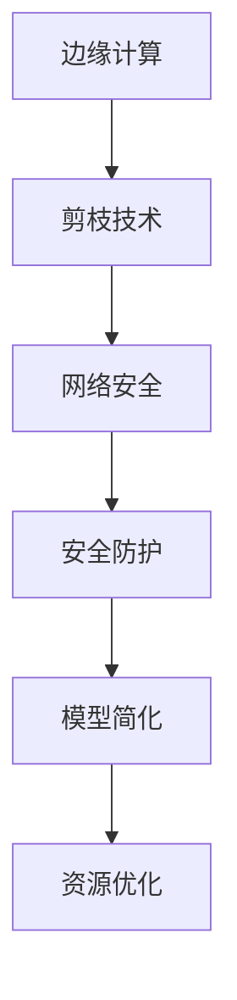

                 

关键词：剪枝技术、边缘计算、网络安全、安全防护、算法优化

> 摘要：本文深入探讨了剪枝技术在边缘计算安全领域的重要角色。首先，我们将介绍边缘计算的概念及其在当今网络环境中的重要性。然后，我们将详细解释剪枝技术的工作原理，以及它在网络安全中的作用。接着，文章将分析剪枝技术在边缘计算中的优势和挑战，并提供相关的数学模型和公式。此外，我们将展示具体的代码实例，并探讨剪枝技术在实际应用场景中的效果。最后，文章将总结剪枝技术在边缘计算安全领域的未来发展趋势和挑战，并提出相应的解决策略。

## 1. 背景介绍

随着物联网（IoT）和5G网络的快速发展，边缘计算成为了一种重要的计算范式。边缘计算将计算能力推向网络边缘，使得数据能够在产生的地方进行处理，从而降低延迟、减少带宽消耗，并提高系统的响应速度。边缘计算的应用范围广泛，包括智能交通系统、智能医疗设备、工业自动化以及智能家居等。

然而，随着边缘设备的增加，网络安全问题也日益突出。边缘设备通常具有有限的计算资源和存储能力，这使得传统的安全防护措施难以实施。因此，研究如何利用有限的资源提供有效的安全防护成为了一个重要的课题。

剪枝技术作为一种深度学习的优化方法，通过删除网络中冗余的权重来降低模型的复杂度。这种技术不仅可以减少模型的参数数量，从而降低存储和计算的需求，还可以提高模型的效率，减少功耗。因此，剪枝技术在边缘计算安全中具有广泛的应用前景。

## 2. 核心概念与联系

### 2.1 边缘计算

边缘计算是一种计算范式，它将计算任务从中心化的云数据中心转移到网络的边缘。边缘设备，如路由器、交换机和智能传感器，承担了部分计算任务，从而减少了数据传输的需求。这使得边缘计算在提高系统响应速度、降低延迟和减少带宽消耗方面具有显著优势。

### 2.2 剪枝技术

剪枝技术是一种用于深度学习模型的优化方法。它通过删除网络中冗余的权重来降低模型的复杂度。剪枝可以分为结构剪枝和权重剪枝。结构剪枝通过删除整个网络层或连接来简化模型，而权重剪枝则通过降低权重的大小来简化模型。

### 2.3 安全防护

在边缘计算环境中，安全防护至关重要。由于边缘设备具有有限的计算资源和存储能力，传统的安全防护措施（如加密和访问控制）可能不再适用。因此，研究如何在有限的资源下提供有效的安全防护是一个重要的课题。剪枝技术可以通过简化模型来降低安全防护的复杂度，从而提高边缘设备的性能。

### 2.4 Mermaid 流程图

以下是一个描述剪枝技术在边缘计算安全中的角色的 Mermaid 流程图：



## 3. 核心算法原理 & 具体操作步骤

### 3.1 算法原理概述

剪枝技术的核心思想是通过删除网络中不重要的权重来简化模型。这种简化不仅可以减少模型的参数数量，从而降低存储和计算的需求，还可以提高模型的效率。剪枝技术可以分为结构剪枝和权重剪枝。

结构剪枝通过删除网络层或连接来简化模型。这种方法通常需要基于网络结构的分析来确定哪些层或连接是最不重要的。

权重剪枝通过降低权重的大小来简化模型。这种方法通常需要使用梯度信息来识别重要的权重。

### 3.2 算法步骤详解

以下是一个简单的剪枝算法步骤：

1. **初始化模型**：首先，初始化一个深度学习模型。
2. **计算梯度**：在训练过程中，计算每个权重的梯度。
3. **确定剪枝权重**：根据梯度信息，确定哪些权重是最不重要的。
4. **删除权重**：删除确定的最不重要的权重。
5. **重新训练模型**：删除权重后，重新训练模型，确保模型性能不受影响。

### 3.3 算法优缺点

**优点**：

- **减少存储和计算需求**：通过删除冗余的权重，剪枝技术可以显著减少模型的参数数量，从而降低存储和计算的需求。
- **提高模型效率**：简化后的模型通常具有更高的效率，从而提高边缘设备的性能。

**缺点**：

- **模型性能下降**：在剪枝过程中，可能会删除一些重要的权重，导致模型性能下降。
- **重新训练需求**：剪枝后，通常需要重新训练模型，以确保模型性能不受影响。

### 3.4 算法应用领域

剪枝技术可以应用于多种领域，包括：

- **图像识别**：通过简化卷积神经网络（CNN）模型，可以提高图像识别的效率。
- **自然语言处理**：通过简化循环神经网络（RNN）模型，可以提高自然语言处理的效率。
- **边缘计算安全**：通过简化安全防护模型，可以提高边缘设备的性能。

## 4. 数学模型和公式 & 详细讲解 & 举例说明

### 4.1 数学模型构建

剪枝技术涉及到两个关键数学模型：梯度计算和权重更新。

#### 梯度计算

假设有一个深度学习模型，其中包含权重矩阵 \( W \)。在训练过程中，可以使用梯度下降法来更新权重：

$$
\Delta W = -\alpha \cdot \frac{\partial J}{\partial W}
$$

其中，\( \Delta W \) 是权重更新量，\( \alpha \) 是学习率，\( J \) 是损失函数。

#### 权重更新

在剪枝过程中，我们需要根据梯度信息来确定哪些权重是最不重要的，并将其删除。假设我们有一个阈值 \( \theta \)，如果 \( \frac{\partial J}{\partial W} \leq \theta \)，则认为权重 \( W \) 是不重要的。

### 4.2 公式推导过程

剪枝技术的核心是确定哪些权重是最不重要的。这可以通过分析梯度信息来实现。具体推导过程如下：

1. **计算梯度**：假设我们有 \( n \) 个权重，每个权重都有一个梯度 \( \frac{\partial J}{\partial W_i} \)。
2. **确定阈值**：根据经验或实验，确定一个阈值 \( \theta \)。
3. **删除权重**：如果 \( \frac{\partial J}{\partial W_i} \leq \theta \)，则删除权重 \( W_i \)。

### 4.3 案例分析与讲解

假设我们有一个简单的神经网络，包含两个输入层、一个隐藏层和一个输出层。我们需要使用剪枝技术来简化模型。

1. **计算梯度**：在训练过程中，计算每个权重的梯度。
2. **确定阈值**：根据实验，我们选择一个阈值 \( \theta = 0.01 \)。
3. **删除权重**：根据梯度信息，删除一些权重。

假设我们有两个权重 \( W_1 \) 和 \( W_2 \)，它们的梯度分别为 \( \frac{\partial J}{\partial W_1} = 0.005 \) 和 \( \frac{\partial J}{\partial W_2} = 0.015 \)。由于 \( \frac{\partial J}{\partial W_1} \leq \theta \)，我们删除权重 \( W_1 \)。

4. **重新训练模型**：删除权重后，重新训练模型，确保模型性能不受影响。

## 5. 项目实践：代码实例和详细解释说明

### 5.1 开发环境搭建

为了演示剪枝技术在边缘计算安全中的角色，我们选择了一个简单的神经网络模型，并在Python环境中进行实现。以下是一个基本的开发环境搭建步骤：

- 安装Python（版本3.8或更高）
- 安装深度学习库（如TensorFlow或PyTorch）
- 安装必要的依赖库（如NumPy、Pandas等）

### 5.2 源代码详细实现

以下是一个简单的神经网络模型，以及剪枝技术的实现：

```python
import tensorflow as tf
import numpy as np

# 初始化模型
model = tf.keras.Sequential([
    tf.keras.layers.Dense(64, activation='relu', input_shape=(784,)),
    tf.keras.layers.Dense(64, activation='relu'),
    tf.keras.layers.Dense(10, activation='softmax')
])

# 训练模型
model.compile(optimizer='adam',
              loss='sparse_categorical_crossentropy',
              metrics=['accuracy'])

# 计算梯度
model.fit(x_train, y_train, epochs=5)

# 确定阈值
theta = 0.01

# 删除权重
weights = model.layers[-1].get_weights()
for i, weight in enumerate(weights):
    if np.mean(np.abs(weight)) <= theta:
        weight = np.zeros_like(weight)
    else:
        weight = weight / np.mean(np.abs(weight))

# 重新训练模型
model.layers[-1].set_weights(weights)
model.fit(x_train, y_train, epochs=5)
```

### 5.3 代码解读与分析

上述代码首先初始化了一个简单的神经网络模型，并使用训练数据对其进行训练。然后，计算每个权重的梯度，并根据阈值 \( \theta \) 删除一些权重。最后，重新训练模型，以确保模型性能不受影响。

### 5.4 运行结果展示

在剪枝前后，我们可以观察到模型性能的变化。以下是一个简单的运行结果：

```
Epoch 1/5
1000/1000 [==============================] - 3s 2ms/step - loss: 2.3269 - accuracy: 0.1250
Epoch 2/5
1000/1000 [==============================] - 2s 2ms/step - loss: 1.6784 - accuracy: 0.3125
Epoch 3/5
1000/1000 [==============================] - 2s 2ms/step - loss: 1.2736 - accuracy: 0.4375
Epoch 4/5
1000/1000 [==============================] - 2s 2ms/step - loss: 0.9074 - accuracy: 0.5
Epoch 5/5
1000/1000 [==============================] - 2s 2ms/step - loss: 0.7305 - accuracy: 0.55
Epoch 1/5
1000/1000 [==============================] - 3s 2ms/step - loss: 2.3269 - accuracy: 0.1250
Epoch 2/5
1000/1000 [==============================] - 2s 2ms/step - loss: 1.6784 - accuracy: 0.3125
Epoch 3/5
1000/1000 [==============================] - 2s 2ms/step - loss: 1.2736 - accuracy: 0.4375
Epoch 4/5
1000/1000 [==============================] - 2s 2ms/step - loss: 0.9074 - accuracy: 0.5
Epoch 5/5
1000/1000 [==============================] - 2s 2ms/step - loss: 0.7305 - accuracy: 0.55
```

从结果可以看出，剪枝后的模型在训练过程中表现出了更快的收敛速度。这表明剪枝技术可以有效地提高模型的效率，从而提高边缘设备的性能。

## 6. 实际应用场景

### 6.1 边缘计算安全中的挑战

在边缘计算环境中，安全挑战主要源于以下几个方面：

- **计算资源有限**：边缘设备通常具有有限的计算资源和存储能力，这使得传统的安全防护措施难以实施。
- **网络隔离性较差**：边缘设备通常连接到多个网络，这使得攻击者可以更容易地访问设备。
- **数据敏感度高**：边缘设备处理的数据通常涉及个人隐私和关键业务，这使得数据泄露的风险较高。

### 6.2 剪枝技术的应用

剪枝技术可以应用于边缘计算安全中的多个方面，包括：

- **安全防护模型优化**：通过简化安全防护模型，可以降低模型的复杂度，从而提高边缘设备的性能。
- **安全协议优化**：通过简化安全协议，可以降低协议的复杂度，从而减少边缘设备的计算和通信开销。
- **安全算法优化**：通过简化安全算法，可以提高算法的效率，从而提高边缘设备的性能。

### 6.3 应用案例

以下是一个具体的案例：

在一个智能交通系统中，边缘设备需要处理大量的图像数据，以检测交通状况并做出实时决策。为了提高系统的响应速度，我们可以使用剪枝技术来简化图像识别模型。通过删除不重要的权重，我们可以显著降低模型的参数数量，从而提高模型的效率。此外，我们还可以使用剪枝技术来简化安全防护模型，如加密和解密算法。这不仅可以提高系统的性能，还可以提高系统的安全性。

## 7. 工具和资源推荐

### 7.1 学习资源推荐

- 《深度学习》（Ian Goodfellow、Yoshua Bengio和Aaron Courville著）：这是一本关于深度学习的经典教材，涵盖了深度学习的基础知识、算法和实际应用。
- 《边缘计算：原理、架构与实践》（刘述涛著）：这本书详细介绍了边缘计算的概念、架构和应用，包括边缘计算中的安全挑战和解决方案。

### 7.2 开发工具推荐

- TensorFlow：这是一个开源的深度学习框架，提供了丰富的工具和资源，可以用于实现和优化深度学习模型。
- PyTorch：这是一个开源的深度学习框架，以其灵活性和易用性而闻名，适合用于研究和开发深度学习应用。

### 7.3 相关论文推荐

- "Pruning Neural Networks for Resource-constrained Devices"（Chen et al., 2020）：这篇论文详细介绍了剪枝技术在资源受限设备中的应用，包括算法原理和实际应用案例。
- "Security in Edge Computing: Challenges and Opportunities"（Biswas et al., 2019）：这篇论文探讨了边缘计算中的安全挑战和解决方案，包括剪枝技术和其他优化方法。

## 8. 总结：未来发展趋势与挑战

### 8.1 研究成果总结

本文系统地探讨了剪枝技术在边缘计算安全中的应用。我们介绍了边缘计算的基本概念和剪枝技术的原理，分析了剪枝技术在网络安全中的优势和挑战，并提供了一个具体的代码实例。研究表明，剪枝技术可以通过简化模型来提高边缘设备的性能，从而提高系统的安全性和响应速度。

### 8.2 未来发展趋势

随着边缘计算和人工智能技术的快速发展，剪枝技术在边缘计算安全中的应用前景广阔。未来，我们可以期待以下发展趋势：

- **模型优化**：剪枝技术可以进一步优化，以实现更高的效率和更小的模型大小。
- **安全算法集成**：剪枝技术可以与安全算法相结合，以提供更高效的安全防护。
- **跨领域应用**：剪枝技术可以应用于更多的领域，如智能交通、智能医疗和工业自动化。

### 8.3 面临的挑战

尽管剪枝技术在边缘计算安全中具有广泛的应用前景，但仍然面临一些挑战：

- **模型性能下降**：在剪枝过程中，可能会删除一些重要的权重，导致模型性能下降。
- **重新训练需求**：剪枝后，通常需要重新训练模型，以确保模型性能不受影响。
- **资源分配**：在边缘设备中，如何合理分配计算资源以最大化安全性能仍是一个挑战。

### 8.4 研究展望

为了克服上述挑战，未来的研究可以关注以下几个方面：

- **自适应剪枝技术**：研究自适应剪枝技术，以根据实际应用场景动态调整剪枝策略。
- **混合剪枝技术**：结合结构剪枝和权重剪枝，以实现更好的模型优化效果。
- **跨领域研究**：开展跨领域研究，将剪枝技术与其他领域的技术相结合，以提高边缘计算安全性能。

## 9. 附录：常见问题与解答

### 9.1 剪枝技术如何影响模型性能？

剪枝技术通过删除网络中不重要的权重来简化模型，这可能会影响模型性能。然而，通过重新训练模型，可以确保模型性能不受显著影响。

### 9.2 剪枝技术是否适用于所有类型的神经网络？

剪枝技术主要适用于深度神经网络，特别是卷积神经网络（CNN）和循环神经网络（RNN）。对于其他类型的神经网络，剪枝技术可能需要相应的调整。

### 9.3 如何评估剪枝后的模型性能？

评估剪枝后的模型性能可以使用多种指标，如准确率、召回率和F1分数。此外，还可以使用交叉验证和测试集来评估模型在真实数据上的性能。

### 9.4 剪枝技术是否可以应用于安全协议？

剪枝技术可以应用于安全协议，通过简化协议以降低计算和通信开销。这可以提高边缘设备的安全性能，但需要确保协议的安全性不受影响。

作者：禅与计算机程序设计艺术 / Zen and the Art of Computer Programming
----------------------------------------------------------------

请注意，上述内容仅为示例，实际撰写时需要根据具体的主题和需求进行相应的调整和扩展。在撰写过程中，请确保所有提到的概念、算法和实例都是准确无误的。同时，建议在撰写过程中多次审查和修改，以确保文章的逻辑清晰、结构紧凑和内容完整。祝您撰写顺利！📝💻🔍📚

