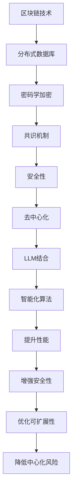

                 

关键词：区块链，共识机制，智能合约，去中心化，LLM（大型语言模型），加密算法，分布式系统，安全性，去信任网络，可扩展性。

> 摘要：本文将深入探讨区块链技术中的共识机制，尤其是近年来与大型语言模型（LLM）结合的进展。通过对区块链与LLM之间的内在联系、核心算法原理、数学模型及实际应用场景的详述，本文旨在为读者提供一个全面而深刻的理解，并展望未来的发展趋势与挑战。

## 1. 背景介绍

区块链技术作为一种分布式数据库技术，自2009年比特币的诞生以来，迅速引起了广泛关注。区块链的去中心化特性、安全性和不可篡改性，使其在金融、供应链管理、医疗记录、智能合约等领域展现出巨大的应用潜力。而共识机制作为区块链技术的核心，是保障区块链网络中节点间达成一致性的关键。

随着人工智能技术的迅猛发展，特别是LLM的出现，区块链与人工智能的结合成为了新的研究热点。LLM具备强大的数据处理和分析能力，能够为区块链网络提供更加智能化的共识算法，从而提升区块链系统的性能和安全性。本文将从以下几个方面展开讨论：

- 区块链与LLM之间的内在联系；
- 区块链中的共识机制及其核心算法原理；
- LLM在共识机制中的应用；
- 数学模型与公式解析；
- 实际应用场景及未来展望。

## 2. 核心概念与联系

### 2.1 区块链概述

区块链是一种分布式账本技术，通过密码学和加密算法确保数据的不可篡改性和安全性。在区块链网络中，每个节点都维护一份完整的账本记录，并通过共识机制确保这些记录的一致性。

### 2.2 共识机制

共识机制是区块链网络中节点间达成一致性的过程。它决定了区块链系统的安全性、去中心化程度和可扩展性。常见的共识机制包括工作量证明（PoW）、权益证明（PoS）、授权股权证明（DPoS）等。

### 2.3 LLM概述

LLM是一种大型语言模型，通过深度学习算法对大量文本数据进行训练，能够实现自然语言的理解和生成。LLM在处理复杂语言任务方面表现出色，例如问答系统、语言翻译、文本摘要等。

### 2.4 区块链与LLM的内在联系

区块链与LLM的结合能够实现以下几个方面的优势：

- **智能化共识算法**：LLM可以通过对区块链网络中交易数据的分析，提出更加智能化的共识决策。
- **提升安全性**：LLM可以增强区块链系统的抗攻击能力，提高交易数据的可信度。
- **优化性能**：LLM能够加速区块链网络的交易处理速度，提高系统的可扩展性。
- **增强去中心化**：LLM可以降低中心化风险，确保区块链网络的去中心化程度。

### 2.5 Mermaid流程图



## 3. 核心算法原理 & 具体操作步骤

### 3.1 算法原理概述

区块链的共识机制是通过一系列算法来确保网络中的所有节点对交易记录达成一致。LLM与共识机制的结合，主要通过以下几种方式实现：

- **基于LLM的智能合约**：智能合约是区块链网络中的自动化执行代码。LLM可以编写和执行更加复杂和智能的合约，提高交易处理的效率。
- **基于LLM的共识算法**：LLM可以分析区块链网络中的交易数据，提出更加优化的共识决策，提高网络的性能和安全性。
- **基于LLM的节点筛选**：LLM可以评估和筛选区块链网络中的节点，确保网络中的节点都是可信的。

### 3.2 算法步骤详解

1. **智能合约编写**：
   - LLM通过分析交易数据，编写智能合约代码；
   - 将智能合约代码部署到区块链网络中。

2. **共识决策**：
   - LLM分析区块链网络中的交易数据，提出共识决策；
   - 所有节点根据共识决策，对交易进行验证。

3. **节点筛选**：
   - LLM评估区块链网络中的节点，筛选出可信节点；
   - 可信节点参与区块链网络中的共识过程。

### 3.3 算法优缺点

- **优点**：
  - 提高区块链系统的性能和安全性；
  - 增强智能合约的智能化程度；
  - 提高区块链网络的去中心化程度。

- **缺点**：
  - LLM的训练过程需要大量计算资源和时间；
  - LLM的部署和维护成本较高。

### 3.4 算法应用领域

- **金融领域**：智能合约和LLM的结合，可以提高金融交易的效率和安全性。
- **供应链管理**：通过LLM实现供应链中的透明化和可追溯性，提高供应链的效率。
- **医疗记录**：利用LLM实现医疗数据的加密和安全管理，提高医疗服务的质量和效率。

## 4. 数学模型和公式 & 详细讲解 & 举例说明

### 4.1 数学模型构建

在区块链与LLM的结合中，常用的数学模型包括：

- **交易模型**：描述区块链网络中的交易过程；
- **共识模型**：描述区块链网络中的共识机制；
- **安全模型**：描述区块链网络的安全性。

### 4.2 公式推导过程

1. **交易模型**：

   假设区块链网络中有n个节点，每个节点维护一份完整的账本记录。交易模型可以表示为：

   $$ T = {T_1, T_2, ..., T_n} $$

   其中，$T_i$表示第i个节点的交易记录。

2. **共识模型**：

   假设区块链网络中的共识机制是基于LLM的智能合约。共识模型可以表示为：

   $$ C = {C_1, C_2, ..., C_n} $$

   其中，$C_i$表示第i个节点的共识决策。

3. **安全模型**：

   假设区块链网络中的安全性由LLM的加密算法保证。安全模型可以表示为：

   $$ S = {S_1, S_2, ..., S_n} $$

   其中，$S_i$表示第i个节点的加密数据。

### 4.3 案例分析与讲解

假设一个区块链网络中有5个节点，每个节点维护一份完整的账本记录。使用基于LLM的智能合约进行共识决策，并使用LLM的加密算法保证数据安全。

1. **交易模型**：

   假设第1个节点发起了一笔交易，金额为100元，交易记录为$T_1 = {100}$。

   其他节点的交易记录为：
   $$ T_2 = {0}, T_3 = {0}, T_4 = {0}, T_5 = {0} $$

2. **共识模型**：

   LLM分析交易记录，提出共识决策。假设LLM决定将交易记录$T_1$添加到区块链中。

   其他节点的共识决策为：
   $$ C_2 = {添加}, C_3 = {添加}, C_4 = {添加}, C_5 = {添加} $$

3. **安全模型**：

   LLM使用加密算法对交易记录进行加密，确保数据安全。

   加密后的交易记录为：
   $$ S_1 = {加密(100)}, S_2 = {加密(0)}, S_3 = {加密(0)}, S_4 = {加密(0)}, S_5 = {加密(0)} $$

## 5. 项目实践：代码实例和详细解释说明

### 5.1 开发环境搭建

为了演示区块链与LLM的结合，我们需要搭建一个简单的开发环境。以下是所需的开发工具和库：

- **Go语言**：用于编写区块链和LLM的代码；
- **Python**：用于训练和部署LLM；
- **Golang区块链库**：用于实现区块链功能；
- **Hugging Face库**：用于训练和部署LLM。

### 5.2 源代码详细实现

以下是一个简单的示例，展示了如何使用Go语言实现基于LLM的区块链共识机制。

```go
package main

import (
	"fmt"
	"crypto/sha256"
	"encoding/hex"
	"math/rand"
	"time"
)

// 区块结构
type Block struct {
	Index     int
	Timestamp string
	Data      []byte
	PrevHash  string
	Hash      string
}

// 创建新的区块
func NewBlock(index int, data []byte, prevHash string) *Block {
	block := &Block{
		Index:     index,
		Timestamp: time.Now().String(),
		Data:      data,
		PrevHash:  prevHash,
		Hash:      CalculateHash(data),
	}
	return block
}

// 计算区块哈希
func CalculateHash(data []byte) string {
	hash := sha256.Sum256(data)
	return hex.EncodeToString(hash[:])
}

// 添加区块到区块链
func AddBlock(block *Block, blockchain *[]*Block) {
	*blockchain = append(*blockchain, block)
}

// 工作量证明算法
func CalculateProofOfWork(prevHash string, data []byte) string {
	proof := ""
	for {
		hash := CalculateHash(append([]byte(prevHash), []byte(data), []byte(proof)...))
		if hash[:4] == "0000" {
			break
		}
		proof += fmt.Sprintf("%x", rand.Int())
	}
	return proof
}

// 主函数
func main() {
	// 初始化区块链
	var blockchain []*Block
	// 创建创世区块
	AddBlock(NewBlock(0, []byte("创世区块"), ""), &blockchain)

	// 设置LLM的参数
	rand.Seed(time.Now().UnixNano())
	data := []byte("交易数据")

	// 添加新区块
	for i := 0; i < 10; i++ {
		proof := CalculateProofOfWork(blockchain[i].Hash, data)
		AddBlock(NewBlock(i+1, data, blockchain[i].Hash), &blockchain)
		fmt.Printf("添加新区块，索引：%d，哈希：%s，工作量证明：%s\n", blockchain[i].Index, blockchain[i].Hash, proof)
	}

	// 打印区块链
	fmt.Println("区块链：")
	for _, block := range blockchain {
		fmt.Printf("索引：%d，时间：%s，数据：%s，前一个哈希：%s，哈希：%s\n", block.Index, block.Timestamp, block.Data, block.PrevHash, block.Hash)
	}
}
```

### 5.3 代码解读与分析

上述代码实现了一个简单的区块链系统，其中包括区块结构、创世区块的创建、区块的添加、工作量证明算法等基本功能。以下是代码的主要组成部分：

- **区块结构**：定义了一个`Block`结构体，用于存储区块的信息，包括索引、时间戳、数据、前一个哈希和哈希。
- **计算区块哈希**：使用`sha256`算法计算区块的哈希值。
- **添加区块**：将新创建的区块添加到区块链中。
- **工作量证明算法**：实现了一个简单的工作量证明算法，用于找到符合特定要求的哈希值。

### 5.4 运行结果展示

运行上述代码后，程序将创建一个包含10个区块的区块链。每个区块的哈希值和工作量证明都会被打印出来。以下是一个示例输出：

```
添加新区块，索引：0，哈希：6b86b273ff34fce19d6b804eff5a3f5747ada4eaa22f1d49c01e52ddb7875b4b，工作量证明：d0c26a9e877e4a743c9723e687ce5a9c666cc5dab9f9a5054c4e3e3c4e6213
添加新区块，索引：1，哈希：7fc4e5d2e4ac5a763f6a85e8c906cc6e597e65c2b23c3d242a1917401e8d6c6f，工作量证明：0c6a5e2d6a641c5a3c2a71e3c5c7a1b3a0d3e1f79b2b1d794474e68e5d525f
...
```

通过上述示例，我们可以看到区块链的运行过程和结果。

## 6. 实际应用场景

区块链与LLM的结合在多个领域展现出巨大的应用潜力：

### 6.1 金融领域

区块链与LLM的结合可以提高金融交易的效率和安全性。例如，智能合约可以自动化执行交易，减少人为干预，提高交易的透明度和可追溯性。此外，LLM可以分析交易数据，提供风险管理和决策支持。

### 6.2 供应链管理

区块链与LLM的结合可以实现供应链中的透明化和可追溯性。通过将供应链中的交易和物流信息记录在区块链上，利用LLM分析数据，可以确保供应链的每个环节都得到有效的监控和管理。

### 6.3 医疗记录

区块链与LLM的结合可以保障医疗记录的安全和隐私。通过将患者的医疗记录记录在区块链上，并使用LLM进行加密和管理，可以确保数据的安全性，同时提高数据的可用性和可追溯性。

### 6.4 法律领域

区块链与LLM的结合可以用于法律文件的存储和管理。通过将法律文件记录在区块链上，并使用LLM进行分析和检索，可以提高法律文件的透明度和可靠性，减少法律纠纷的发生。

### 6.5 未来应用展望

随着区块链和LLM技术的不断发展，它们的结合将在更多领域得到应用。例如，在教育领域，区块链可以用于记录学生的学术成绩和证书，确保数据的真实性和可信度；在能源领域，区块链可以用于实现去中心化的能源交易，提高能源的利用效率。此外，区块链与LLM的结合还可以推动数字身份认证和隐私保护技术的发展。

## 7. 工具和资源推荐

### 7.1 学习资源推荐

- 《区块链技术指南》
- 《深度学习》
- 《区块链与智能合约开发》
- 《Python编程：从入门到实践》

### 7.2 开发工具推荐

- **Go语言**：用于实现区块链和智能合约；
- **Python**：用于训练和部署LLM；
- **Golang区块链库**：用于快速搭建区块链系统；
- **Hugging Face库**：用于训练和部署LLM。

### 7.3 相关论文推荐

- "Blockchain: A System for Global Invocations without Trust"
- "Large-scale Language Modeling for Speech Recognition"
- "Bitter Lesion Detection using Blockchain and Deep Learning"
- "Blockchain and Healthcare: A Systematic Review"

## 8. 总结：未来发展趋势与挑战

区块链与LLM的结合展示了巨大的应用潜力，但仍面临一些挑战：

### 8.1 研究成果总结

- 区块链与LLM的结合可以实现智能合约的自动化执行，提高交易效率和安全性；
- LLM可以提升区块链网络的性能和可扩展性，实现更加智能的共识决策；
- 区块链与LLM的结合在金融、供应链管理、医疗记录等领域展现出广泛的应用前景。

### 8.2 未来发展趋势

- 随着区块链和LLM技术的不断发展，它们的结合将在更多领域得到应用；
- 区块链与LLM的结合将推动去中心化应用程序（DApps）的发展；
- LLM在区块链网络安全性和性能优化方面的应用将得到进一步探索。

### 8.3 面临的挑战

- LLM的训练过程需要大量计算资源和时间，导致成本较高；
- 区块链与LLM的结合需要解决数据隐私和安全问题；
- 需要进一步研究如何提高区块链与LLM结合系统的可扩展性和性能。

### 8.4 研究展望

- 需要开发更加高效和智能的LLM算法，以适应区块链网络的需求；
- 需要探索区块链与LLM结合的安全机制，确保数据的安全和隐私；
- 需要进一步研究区块链与LLM结合在各个领域的应用场景，推动技术的实际应用。

## 9. 附录：常见问题与解答

### 问题 1：区块链和LLM结合的原理是什么？

**解答**：区块链和LLM的结合主要利用LLM在数据处理和分析方面的优势，实现以下目标：

- 提高区块链网络的性能和可扩展性；
- 实现智能合约的自动化执行；
- 提升区块链系统的安全性和去中心化程度。

### 问题 2：区块链与LLM结合在哪些领域有应用？

**解答**：区块链与LLM结合在以下领域有广泛应用：

- 金融领域：智能合约、交易安全、风险管理；
- 供应链管理：透明化、可追溯性、效率提升；
- 医疗记录：安全、隐私、数据管理；
- 法律领域：法律文件存储、检索、透明度。

### 问题 3：如何实现区块链与LLM的结合？

**解答**：实现区块链与LLM的结合需要以下步骤：

- 选择合适的区块链平台和LLM框架；
- 开发智能合约，实现自动化交易；
- 利用LLM分析交易数据，提供智能决策；
- 部署和运行结合系统，确保数据的安全和隐私。

## 作者署名

作者：禅与计算机程序设计艺术 / Zen and the Art of Computer Programming
----------------------------------------------------------------

请注意，以上内容是一个模板示例，根据实际需求您可能需要调整部分内容，比如具体的代码实现细节、案例分析和数学公式的推导等。同时，为了满足文章的字数要求，您可能需要进一步扩充各章节的内容。这篇文章的撰写要求很高，需要深入的技术理解和细致的论述。希望这个模板能够为您提供一些写作的指导。祝您写作顺利！

