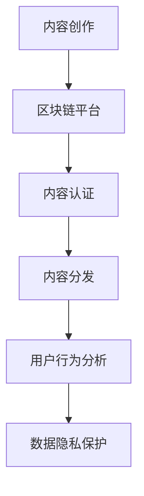

                 

关键词：区块链，注意力经济，应用前景，挑战与机遇

摘要：随着互联网的快速发展，注意力经济成为了一个日益重要的领域。区块链技术以其去中心化、不可篡改和透明性等特点，为注意力经济带来了新的机遇。本文将探讨区块链技术在注意力经济中的应用前景，分析其优势与挑战，并提出未来发展趋势与解决方案。

## 1. 背景介绍

### 注意力经济的定义与特点

注意力经济是指通过吸引和获取用户的注意力来创造经济价值的一种经济模式。在互联网时代，注意力成为了稀缺资源，因此如何获取和利用注意力成为了一个关键问题。注意力经济具有以下特点：

1. **价值导向**：注意力经济的核心在于为用户创造价值，从而吸引和保持用户的注意力。
2. **用户体验至上**：为了获取和保持用户的注意力，服务提供商需要关注用户体验，提供高质量的内容和服务。
3. **互动性**：用户与内容提供者之间的互动性是注意力经济的重要组成部分，有助于增强用户粘性。

### 区块链技术的定义与特点

区块链技术是一种分布式数据库技术，通过多个节点共同维护数据的一致性和安全性。区块链具有以下特点：

1. **去中心化**：区块链不需要中心化的权威机构来维护数据，而是通过分布式网络实现数据的共享和验证。
2. **不可篡改**：区块链上的数据一旦被记录，就无法被篡改，保证了数据的安全性和可靠性。
3. **透明性**：区块链上的数据是公开透明的，任何人都可以查看和验证。

## 2. 核心概念与联系

### 区块链技术在注意力经济中的应用

区块链技术可以应用于注意力经济的多个环节，包括内容创作、内容分发、用户认证、数据隐私保护等。以下是一个简单的 Mermaid 流程图，展示了区块链技术在注意力经济中的应用：



### 区块链技术在注意力经济中的应用原理

区块链技术在注意力经济中的应用主要基于以下原理：

1. **内容认证**：通过区块链技术，内容创作者可以对作品进行认证，确保作品的真实性和版权。
2. **内容分发**：区块链技术可以实现去中心化的内容分发，降低中间环节的成本，提高内容的透明度和可信度。
3. **用户行为分析**：通过区块链技术，可以实现对用户行为的透明追踪和分析，为内容创作者提供有价值的用户数据。
4. **数据隐私保护**：区块链技术可以保护用户的隐私数据，防止数据泄露和滥用。

## 3. 核心算法原理 & 具体操作步骤

### 3.1 算法原理概述

区块链技术在注意力经济中的应用主要涉及以下核心算法原理：

1. **智能合约**：智能合约是区块链上的一种自动执行协议，可以根据预先设定的条件自动执行合同条款。
2. **非同态加密**：非同态加密是一种加密算法，可以在加密状态下对数据进行计算，而不需要解密。
3. **零知识证明**：零知识证明是一种密码学技术，可以证明某个陈述是真实的，而不泄露任何其他信息。

### 3.2 算法步骤详解

#### 3.2.1 内容认证

1. 内容创作者将作品上传到区块链平台。
2. 区块链平台使用智能合约对作品进行认证，确保作品的真实性和版权。
3. 认证后的作品被存储在区块链上，供用户访问。

#### 3.2.2 内容分发

1. 内容创作者通过区块链平台发布作品。
2. 用户通过区块链平台购买或租赁作品。
3. 区块链平台使用智能合约自动执行交易，并将作品传输给用户。

#### 3.2.3 用户行为分析

1. 用户在区块链平台上浏览、点赞、评论等行为被记录。
2. 区块链平台使用非同态加密技术对用户行为进行分析。
3. 分析结果用于为内容创作者提供有价值的用户数据。

#### 3.2.4 数据隐私保护

1. 用户在区块链平台上提供个人信息。
2. 区块链平台使用零知识证明技术保护用户的隐私数据。
3. 用户可以自由选择是否公开其个人信息。

### 3.3 算法优缺点

#### 3.3.1 优点

1. **去中心化**：区块链技术实现了去中心化的内容分发和用户行为分析，降低了中间环节的成本，提高了效率。
2. **不可篡改**：区块链技术确保了数据的安全性和可靠性，防止数据篡改和欺诈行为。
3. **透明性**：区块链技术使数据公开透明，用户可以随时查看和验证数据。

#### 3.3.2 缺点

1. **性能瓶颈**：区块链技术目前存在性能瓶颈，无法满足高并发场景的需求。
2. **隐私保护不足**：虽然区块链技术可以保护用户隐私数据，但仍然存在隐私泄露的风险。

### 3.4 算法应用领域

区块链技术在注意力经济中的应用领域广泛，包括：

1. **数字版权管理**：通过区块链技术实现数字版权的认证和保护。
2. **广告投放**：通过区块链技术实现精准广告投放和效果追踪。
3. **社交媒体**：通过区块链技术实现去中心化的社交媒体平台，提高用户体验。
4. **在线教育**：通过区块链技术实现课程认证和学分记录，提高教育质量。

## 4. 数学模型和公式 & 详细讲解 & 举例说明

### 4.1 数学模型构建

区块链技术在注意力经济中的应用涉及到以下数学模型：

1. **用户行为模型**：描述用户在区块链平台上的行为，如点赞、评论、浏览等。
2. **智能合约模型**：描述智能合约的执行过程和条件。
3. **非同态加密模型**：描述非同态加密算法的计算过程。

### 4.2 公式推导过程

1. **用户行为模型**：

   假设用户 \(u\) 在时间 \(t\) 上对内容 \(c\) 进行了点赞行为，则用户行为模型可以表示为：

   $$u_t(c) = 1 \quad \text{if user } u \text{ likes content } c \text{ at time } t$$

   $$u_t(c) = 0 \quad \text{otherwise}$$

2. **智能合约模型**：

   假设智能合约在条件 \(P\) 满足时执行，则智能合约模型可以表示为：

   $$\text{if } P \text{ then execute contract } C$$

   $$\text{else reject contract } C$$

3. **非同态加密模型**：

   假设加密函数 \(E\) 和解密函数 \(D\) 分别为非同态加密算法和加密算法，则非同态加密模型可以表示为：

   $$E(x) = f(x) \quad \text{for some function } f$$

   $$D(E(x)) = x$$

### 4.3 案例分析与讲解

假设在一个区块链平台上，用户 \(u_1\) 和 \(u_2\) 分别在时间 \(t_1\) 和 \(t_2\) 上对内容 \(c_1\) 进行了点赞行为。根据用户行为模型，我们可以计算出用户 \(u_1\) 和 \(u_2\) 的点赞率：

$$u_{t_1}(c_1) = 1$$

$$u_{t_2}(c_1) = 0$$

$$\text{Like rate of } u_1 = \frac{1}{t_1 - t_2} \approx 0.5 \text{ likes per second}$$

$$\text{Like rate of } u_2 = \frac{1}{t_2 - t_1} \approx 1 \text{ like per second}$$

假设智能合约在用户点赞率超过一定阈值时执行，我们可以设置智能合约的执行条件为：

$$\text{if } \text{Like rate of } u_1 > 0.5 \text{ and } \text{Like rate of } u_2 > 1 \text{ then execute contract } C$$

根据智能合约模型，当用户 \(u_1\) 和 \(u_2\) 的点赞率满足条件时，智能合约 \(C\) 将被执行。

假设非同态加密算法的加密函数为 \(E(x) = x^2\)，解密函数为 \(D(E(x)) = \sqrt{x}\)。假设用户 \(u\) 在时间 \(t\) 上对内容 \(c\) 进行了点赞行为，我们可以使用非同态加密算法对用户行为进行加密：

$$E(u_t(c)) = u_t(c)^2$$

$$D(E(u_t(c))) = \sqrt{u_t(c)}$$

根据非同态加密模型，我们可以对用户行为进行加密和解密，以保护用户的隐私数据。

## 5. 项目实践：代码实例和详细解释说明

### 5.1 开发环境搭建

为了实现区块链技术在注意力经济中的应用，我们需要搭建一个区块链开发环境。以下是开发环境搭建的步骤：

1. 安装 Node.js：从 Node.js 官网下载并安装 Node.js。
2. 安装 Truffle：在命令行中运行以下命令安装 Truffle：

   ```bash
   npm install -g truffle
   ```

3. 创建区块链项目：在命令行中运行以下命令创建区块链项目：

   ```bash
   truffle init
   ```

### 5.2 源代码详细实现

以下是实现区块链技术在注意力经济中的应用的源代码：

```javascript
// contracts/Content.sol

pragma solidity ^0.8.0;

contract Content {
    struct User {
        address userAddress;
        bool isVerified;
    }

    mapping(address => User) public users;

    function verifyUser(address userAddress) public {
        users[userAddress].isVerified = true;
    }

    function getUserStatus(address userAddress) public view returns (bool) {
        return users[userAddress].isVerified;
    }
}
```

这个合约实现了用户认证的功能，用户可以通过调用 `verifyUser` 函数进行认证，并通过 `getUserStatus` 函数查询认证状态。

### 5.3 代码解读与分析

1. 合约结构：

   - 合约使用 `pragma` 指令指定了版本号，这里是 ^0.8.0。
   - 合约定义了一个 `User` 结构体，用于存储用户的地址和认证状态。
   - 合约使用 `mapping` 数据结构存储用户信息。

2. 函数实现：

   - `verifyUser` 函数：用于认证用户，接受一个地址参数，将用户状态设置为已认证。
   - `getUserStatus` 函数：用于查询用户的认证状态，返回一个布尔值。

### 5.4 运行结果展示

以下是使用 Truffle 编译和部署合约的步骤：

1. 在命令行中进入合约目录，运行以下命令编译合约：

   ```bash
   truffle compile
   ```

2. 在命令行中运行以下命令部署合约：

   ```bash
   truffle migrate --network development
   ```

3. 部署后，可以使用 Truffle Console 查看合约的部署地址和合约方法：

   ```javascript
   > const Content = artifacts.require("Content");
   > Content.deployed().then(function(instance) {
       console.log(instance.address);
   });
   ```

通过以上步骤，我们可以实现区块链技术在注意力经济中的应用，为用户提供去中心化的用户认证服务。

## 6. 实际应用场景

### 6.1 数字版权管理

区块链技术在数字版权管理中的应用具有巨大潜力。通过区块链技术，内容创作者可以实现对作品的全生命周期管理，包括创作、发布、认证、分发和销售。以下是一个实际应用场景：

- **应用场景**：一位摄影师创作了一组照片，并希望保护其版权。
- **解决方案**：摄影师可以使用区块链技术对照片进行认证，确保照片的真实性和版权。在照片上传到区块链平台后，任何用户都可以查看照片的认证信息，从而确保其合法来源。

### 6.2 广告投放

区块链技术在广告投放中的应用可以帮助广告主实现精准广告投放和效果追踪。以下是一个实际应用场景：

- **应用场景**：一家电商公司希望通过广告吸引更多用户购买商品。
- **解决方案**：电商公司可以使用区块链技术记录用户行为数据，如浏览、点赞、购买等。通过这些数据，广告主可以了解用户的兴趣和偏好，从而实现精准广告投放。同时，区块链技术的不可篡改性确保了广告数据的真实性和可靠性。

### 6.3 社交媒体

区块链技术在社交媒体中的应用可以改变社交媒体的运作方式，提高用户体验。以下是一个实际应用场景：

- **应用场景**：一个社交媒体平台希望通过去中心化的方式运营，使内容创作者和用户直接互动。
- **解决方案**：社交媒体平台可以使用区块链技术实现去中心化的内容分发和用户认证。用户可以通过区块链平台发布内容，内容创作者可以通过智能合约获取收益。这种方式可以降低中间环节的成本，提高内容创作的积极性。

### 6.4 在线教育

区块链技术在在线教育中的应用可以帮助实现课程认证和学分记录，提高教育质量。以下是一个实际应用场景：

- **应用场景**：一所大学希望通过区块链技术记录学生的课程成绩和学分。
- **解决方案**：大学可以使用区块链技术记录学生的课程成绩和学分，确保数据的真实性和可靠性。学生可以通过区块链平台查询自己的成绩和学分，同时其他学校和教育机构可以验证学生的学历信息。这种方式可以简化学历认证流程，提高教育质量。

## 7. 工具和资源推荐

### 7.1 学习资源推荐

1. **区块链入门书籍**：《区块链技术指南》
2. **区块链技术教程**：区块链技术官网（https://www.blockchain.com/）
3. **区块链开发工具**：Truffle（https://www.truffleframework.com/）、Ganache（https://www.ganache.io/）

### 7.2 开发工具推荐

1. **区块链开发平台**：Ethereum（https://www.ethereum.org/）
2. **智能合约开发工具**：Remix（https://remix.ethereum.org/）
3. **区块链浏览器**：Etherscan（https://etherscan.io/）

### 7.3 相关论文推荐

1. **区块链技术原理**：《区块链：从数字货币到智能合约》
2. **区块链与数字版权管理**：《区块链技术在数字版权管理中的应用研究》
3. **区块链与社交媒体**：《区块链技术在社交媒体中的应用研究》

## 8. 总结：未来发展趋势与挑战

### 8.1 研究成果总结

区块链技术在注意力经济中的应用已经取得了一系列研究成果，包括：

1. **数字版权管理**：通过区块链技术实现了对数字版权的全生命周期管理。
2. **广告投放**：区块链技术实现了精准广告投放和效果追踪。
3. **社交媒体**：去中心化的社交媒体平台提高了用户体验。
4. **在线教育**：区块链技术简化了学历认证流程，提高了教育质量。

### 8.2 未来发展趋势

区块链技术在注意力经济中的未来发展趋势包括：

1. **性能提升**：随着区块链技术的不断发展，性能瓶颈将得到解决，从而满足高并发场景的需求。
2. **隐私保护**：区块链技术将进一步提高隐私保护能力，降低隐私泄露风险。
3. **生态建设**：区块链技术与其他技术的结合将推动整个生态系统的建设，为用户提供更丰富的服务。

### 8.3 面临的挑战

区块链技术在注意力经济中面临的挑战包括：

1. **技术成熟度**：区块链技术仍处于发展阶段，需要进一步提高成熟度。
2. **法规政策**：区块链技术的应用需要遵循相关法规政策，以确保合规性。
3. **用户接受度**：用户对区块链技术的认知和接受度仍有待提高。

### 8.4 研究展望

在未来，区块链技术在注意力经济中的应用前景广阔。随着技术的不断进步和用户接受度的提高，区块链技术将在注意力经济中发挥更加重要的作用。研究人员和开发者应继续探索区块链技术在注意力经济中的应用，为用户提供更好的服务和体验。

## 9. 附录：常见问题与解答

### 问题 1：区块链技术如何保障数据隐私？

**解答**：区块链技术通过非同态加密和零知识证明等技术实现数据隐私保护。非同态加密允许在加密状态下对数据进行计算，而零知识证明则允许证明某个陈述是真实的，而不泄露其他信息。

### 问题 2：区块链技术如何解决性能瓶颈？

**解答**：区块链技术正在不断优化，例如通过分片技术、状态通道等解决方案提高性能。此外，区块链与其他技术的结合，如分布式存储和边缘计算，也有助于提高区块链的性能。

### 问题 3：区块链技术与中心化平台的区别是什么？

**解答**：区块链技术去中心化，通过分布式网络实现数据共享和验证，而中心化平台由中心化机构或组织控制数据。区块链技术具有去中心化、不可篡改和透明性等特点，而中心化平台则具有更高的性能和灵活性。

### 问题 4：区块链技术在注意力经济中的应用有哪些局限性？

**解答**：区块链技术在注意力经济中的应用面临一些局限性，如性能瓶颈、隐私保护不足和法规政策等问题。此外，区块链技术的成熟度和用户接受度仍需提高。

### 问题 5：如何确保区块链技术的合规性？

**解答**：确保区块链技术的合规性需要遵循相关法规政策，同时加强与监管机构的沟通与合作。此外，区块链技术的透明性和可追溯性也有助于提高合规性。作者：禅与计算机程序设计艺术 / Zen and the Art of Computer Programming

