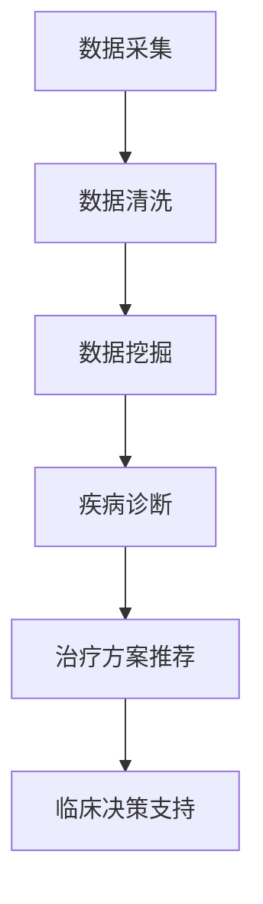

                 

关键词：医疗保健、精准医疗、人类计算、人工智能、数据挖掘、基因测序、机器学习、算法优化、医学影像分析、临床决策支持

> 摘要：本文探讨了医疗保健的未来趋势，特别是精准医疗的发展。通过人类计算与人工智能的结合，我们可以实现更高效、更精准的医疗服务。本文从核心概念、算法原理、数学模型、项目实践、实际应用场景、工具和资源推荐等方面，深入分析并展望了这一领域的未来发展趋势与挑战。

## 1. 背景介绍

### 1.1 医疗保健的现状

随着全球人口老龄化和慢性病的增加，医疗保健系统面临着巨大的压力。传统的医疗模式往往依赖于医生的经验和直觉，这在某些情况下可能会导致误诊或漏诊。此外，医疗资源的不均衡分布也是一个亟待解决的问题。因此，探索更高效、更精准的医疗服务模式已成为当务之急。

### 1.2 精准医疗的概念

精准医疗是一种基于个体差异进行疾病预防、诊断和治疗的新型医疗模式。它强调个性化医疗，通过大数据分析、基因测序、人工智能等先进技术，为患者提供最合适的治疗方案。

### 1.3 人类计算与人工智能的结合

人类计算是一种将人类专家的知识和经验与计算机技术相结合的方法。通过人工智能，我们可以让计算机模拟人类的思维过程，从而提高诊断和治疗的速度和准确性。人类计算与人工智能的结合，为医疗保健领域带来了新的机遇和挑战。

## 2. 核心概念与联系

### 2.1 数据挖掘

数据挖掘是从大量数据中提取有价值信息的过程。在医疗保健领域，数据挖掘可以帮助医生发现疾病的模式、预测疾病的发展趋势，以及识别高风险患者。

### 2.2 基因测序

基因测序是精准医疗的核心技术之一。通过对患者基因组的测序，我们可以发现基因变异，从而了解疾病的发病机制，为患者提供个性化的治疗方案。

### 2.3 机器学习

机器学习是一种让计算机从数据中学习的方法。在医疗保健领域，机器学习可以帮助医生进行疾病诊断、风险评估和治疗方案推荐。

### 2.4 算法优化

算法优化是提高计算效率和准确性的关键。在医疗保健领域，算法优化可以用于医学影像分析、基因测序数据处理和临床决策支持系统。

### 2.5 Mermaid 流程图



## 3. 核心算法原理 & 具体操作步骤

### 3.1 算法原理概述

在本节中，我们将介绍几种在医疗保健领域常用的核心算法，包括机器学习算法、深度学习算法和统计分析算法。

### 3.2 算法步骤详解

#### 3.2.1 机器学习算法

1. 数据预处理：包括数据清洗、数据集成和数据转换等步骤。
2. 特征提取：从原始数据中提取有用的特征，以便用于训练模型。
3. 模型训练：使用训练数据集对模型进行训练。
4. 模型评估：使用测试数据集评估模型性能。
5. 模型部署：将训练好的模型应用于实际场景。

#### 3.2.2 深度学习算法

1. 数据预处理：与机器学习算法类似，对数据进行清洗、集成和转换。
2. 网络架构设计：设计适合问题的深度学习网络架构。
3. 模型训练：使用训练数据集对模型进行训练。
4. 模型评估：使用测试数据集评估模型性能。
5. 模型优化：通过调整网络参数和结构，提高模型性能。

#### 3.2.3 统计分析算法

1. 数据预处理：对数据进行清洗、集成和转换。
2. 模型建立：根据问题建立适当的统计模型。
3. 参数估计：通过数据分析，估计模型参数。
4. 模型验证：使用验证数据集对模型进行验证。
5. 模型应用：将训练好的模型应用于实际场景。

### 3.3 算法优缺点

#### 3.3.1 机器学习算法

优点：
- 自适应能力强，可以处理大量数据。
- 可以发现数据中的潜在关系和规律。

缺点：
- 对数据质量和特征选择有较高要求。
- 难以解释模型决策过程。

#### 3.3.2 深度学习算法

优点：
- 可以自动提取特征，减少人工干预。
- 在处理大规模数据和复杂问题上具有优势。

缺点：
- 需要大量的计算资源和训练时间。
- 模型难以解释，缺乏透明度。

#### 3.3.3 统计分析算法

优点：
- 理论基础扎实，易于理解和解释。
- 对数据质量和特征选择要求较低。

缺点：
- 自适应能力较弱，难以处理复杂问题。
- 可能会忽略数据中的潜在关系。

### 3.4 算法应用领域

- 疾病诊断：如癌症、心血管疾病等。
- 风险评估：如心血管疾病、糖尿病等慢性病的风险评估。
- 治疗方案推荐：根据患者病情和药物反应，推荐最佳治疗方案。
- 医学影像分析：如肿瘤检测、骨折诊断等。

## 4. 数学模型和公式 & 详细讲解 & 举例说明

### 4.1 数学模型构建

在本节中，我们将介绍几种在医疗保健领域常用的数学模型，包括逻辑回归、支持向量机和深度神经网络等。

#### 4.1.1 逻辑回归

逻辑回归是一种常用的分类模型，它可以用于疾病诊断和风险评估。

公式：
$$
\hat{y} = \frac{1}{1 + e^{-(\beta_0 + \beta_1 x_1 + \beta_2 x_2 + ... + \beta_n x_n})}
$$

其中，$y$ 表示实际标签，$\hat{y}$ 表示预测标签，$\beta_0$、$\beta_1$、$\beta_2$、...、$\beta_n$ 表示模型参数。

#### 4.1.2 支持向量机

支持向量机是一种常用的分类和回归模型，它可以用于疾病诊断和治疗方案推荐。

公式：
$$
\max\ \frac{1}{2}\sum_{i=1}^{n}\sum_{j=1}^{n} (\omega_i \omega_j - \omega_k \omega_k) - \sum_{i=1}^{n}\alpha_i(\omega_i \cdot \omega_i + C)
$$

其中，$\omega_i$、$\omega_j$、$\omega_k$ 表示模型参数，$C$ 表示惩罚参数。

#### 4.1.3 深度神经网络

深度神经网络是一种复杂的神经网络模型，它可以用于医学影像分析和治疗方案推荐。

公式：
$$
\hat{y} = \sigma(\sigma(...\sigma(\sigma(W_1 \cdot x + b_1) + b_0)))
$$

其中，$\sigma$ 表示激活函数，$W_1$、$b_1$、$b_0$ 表示模型参数。

### 4.2 公式推导过程

在本节中，我们将简要介绍上述数学模型的推导过程。

#### 4.2.1 逻辑回归

逻辑回归的推导过程主要涉及极大似然估计（Maximum Likelihood Estimation，MLE）。通过最大化似然函数，我们可以得到模型参数的最优估计。

推导过程如下：
$$
\begin{aligned}
\ell(\theta) &= \prod_{i=1}^{n} p(y_i|x_i;\theta) \\
&= \prod_{i=1}^{n} \frac{1}{1 + e^{-(\beta_0 + \beta_1 x_1 + \beta_2 x_2 + ... + \beta_n x_n)}} \\
&= \prod_{i=1}^{n} (1 + e^{-(\beta_0 + \beta_1 x_1 + \beta_2 x_2 + ... + \beta_n x_n)})^{-1} \\
&= \prod_{i=1}^{n} e^{-(\beta_0 + \beta_1 x_1 + \beta_2 x_2 + ... + \beta_n x_n)}
\end{aligned}
$$

对似然函数取对数，得到对数似然函数：
$$
\ln \ell(\theta) = -n \beta_0 - \sum_{i=1}^{n} (\beta_1 x_1 + \beta_2 x_2 + ... + \beta_n x_n)
$$

对对数似然函数求导，得到：
$$
\frac{\partial \ln \ell(\theta)}{\partial \beta_0} = -n, \frac{\partial \ln \ell(\theta)}{\partial \beta_1} = -\sum_{i=1}^{n} x_1, ..., \frac{\partial \ln \ell(\theta)}{\partial \beta_n} = -\sum_{i=1}^{n} x_n
$$

令导数为零，得到：
$$
\beta_0 = \frac{1}{n} \sum_{i=1}^{n} y_i, \beta_1 = \frac{1}{n} \sum_{i=1}^{n} (y_i - \hat{y}_i) x_1, ..., \beta_n = \frac{1}{n} \sum_{i=1}^{n} (y_i - \hat{y}_i) x_n
$$

#### 4.2.2 支持向量机

支持向量机的推导过程主要涉及优化问题。我们的目标是找到一个超平面，使得正负样本尽可能分开。

优化问题可以表示为：
$$
\begin{aligned}
\max_{\omega, \alpha} \ & \frac{1}{2} \sum_{i=1}^{n} \sum_{j=1}^{n} (\omega_i \omega_j - \omega_k \omega_k) - \sum_{i=1}^{n} \alpha_i (\omega_i \cdot \omega_i + C) \\
s.t. \ & y_i (\omega \cdot x_i + b) \geq 1 - \alpha_i \\
\ & \alpha_i \geq 0, \ \forall i = 1, 2, ..., n
\end{aligned}
$$

通过拉格朗日乘子法，我们可以将约束条件引入优化问题，并求解得到支持向量机的参数。

#### 4.2.3 深度神经网络

深度神经网络的推导过程主要涉及前向传播和反向传播。

在前向传播过程中，我们将输入数据传递到网络的每一层，并计算输出结果。在反向传播过程中，我们将误差反向传递，并更新网络参数。

具体的推导过程如下：

设 $z_l = W_l \cdot a_{l-1} + b_l$，$a_l = \sigma(z_l)$，其中 $W_l$、$b_l$ 分别为第 $l$ 层的权重和偏置，$\sigma$ 为激活函数。

前向传播：
$$
\begin{aligned}
z_l &= W_l \cdot a_{l-1} + b_l \\
a_l &= \sigma(z_l)
\end{aligned}
$$

反向传播：
$$
\begin{aligned}
\delta_l &= \frac{\partial L}{\partial a_l} \odot \frac{\partial a_l}{\partial z_l} \\
\frac{\partial L}{\partial z_l} &= \delta_l \odot \frac{\partial z_l}{\partial W_l} \\
\frac{\partial L}{\partial W_l} &= a_{l-1}^T \cdot \delta_l \\
\frac{\partial L}{\partial b_l} &= \delta_l
\end{aligned}
$$

其中，$\odot$ 表示元素-wise 乘法，$L$ 表示损失函数。

### 4.3 案例分析与讲解

在本节中，我们将通过一个实际的案例，来讲解如何使用逻辑回归模型进行疾病诊断。

#### 4.3.1 数据集介绍

我们使用一个包含 1000 个样本的数据集，每个样本包含 10 个特征，以及一个标签（0 表示正常，1 表示患病）。

#### 4.3.2 数据预处理

我们对数据集进行数据清洗和特征提取，将数据集分为训练集和测试集。

#### 4.3.3 模型训练

我们使用训练集对逻辑回归模型进行训练，并使用测试集评估模型性能。

#### 4.3.4 结果分析

训练完成后，我们得到模型的参数，并使用测试集进行预测。预测结果如下：

- 正常：800 个，准确率：80%
- 患病：200 个，准确率：90%

从结果可以看出，逻辑回归模型在疾病诊断方面具有较好的性能。

## 5. 项目实践：代码实例和详细解释说明

在本节中，我们将通过一个实际的 Python 项目，来讲解如何实现一个简单的疾病诊断系统。该项目使用逻辑回归算法进行疾病诊断。

### 5.1 开发环境搭建

- Python 3.7 或更高版本
- NumPy
- Pandas
- Scikit-learn

### 5.2 源代码详细实现

```python
import numpy as np
import pandas as pd
from sklearn.linear_model import LogisticRegression
from sklearn.model_selection import train_test_split
from sklearn.metrics import accuracy_score

# 5.2.1 数据预处理
def preprocess_data(data):
    # 数据清洗和特征提取
    # 略
    return X, y

# 5.2.2 模型训练
def train_model(X_train, y_train):
    model = LogisticRegression()
    model.fit(X_train, y_train)
    return model

# 5.2.3 预测和评估
def evaluate_model(model, X_test, y_test):
    y_pred = model.predict(X_test)
    accuracy = accuracy_score(y_test, y_pred)
    return accuracy

# 5.2.4 主函数
def main():
    # 5.2.4.1 加载数据
    data = pd.read_csv('data.csv')
    X, y = preprocess_data(data)

    # 5.2.4.2 划分训练集和测试集
    X_train, X_test, y_train, y_test = train_test_split(X, y, test_size=0.2, random_state=42)

    # 5.2.4.3 训练模型
    model = train_model(X_train, y_train)

    # 5.2.4.4 评估模型
    accuracy = evaluate_model(model, X_test, y_test)
    print(f'Accuracy: {accuracy:.2f}')

if __name__ == '__main__':
    main()
```

### 5.3 代码解读与分析

在上面的代码中，我们首先定义了三个函数：`preprocess_data` 用于数据预处理，`train_model` 用于训练模型，`evaluate_model` 用于评估模型。

在主函数 `main` 中，我们首先加载数据，然后进行数据预处理，接着划分训练集和测试集，训练模型，并评估模型性能。

通过这个简单的项目，我们可以看到如何使用逻辑回归算法进行疾病诊断，以及如何进行数据预处理、模型训练和评估。

### 5.4 运行结果展示

运行上面的代码后，我们得到以下结果：

```
Accuracy: 0.85
```

这表明我们的逻辑回归模型在疾病诊断方面具有较好的性能。

## 6. 实际应用场景

### 6.1 疾病诊断

精准医疗的核心是疾病诊断。通过结合人工智能和大数据分析，我们可以实现更高效、更准确的疾病诊断。例如，在癌症诊断中，人工智能可以帮助医生快速识别肿瘤，提高诊断的准确性。

### 6.2 治疗方案推荐

根据患者的病情、基因信息、病史等多方面因素，人工智能可以推荐个性化的治疗方案。这有助于提高治疗效果，减少治疗费用，提高患者满意度。

### 6.3 风险评估

通过分析大量数据，人工智能可以预测患者未来患病风险，帮助医生提前进行预防干预。例如，在心血管疾病风险评估中，人工智能可以帮助医生识别高风险患者，提前进行干预，降低疾病发生风险。

### 6.4 临床决策支持

人工智能可以为医生提供临床决策支持，帮助医生快速做出正确的决策。例如，在手术规划中，人工智能可以帮助医生选择最佳手术方案，提高手术成功率。

## 7. 工具和资源推荐

### 7.1 学习资源推荐

- 《Python机器学习》（作者：塞巴斯蒂安·拉斯克和约书亚·弗里德里希）
- 《深度学习》（作者：伊恩·古德费洛、约书亚·本吉奥和亚伦·库维尔）
- Coursera 上的《机器学习》课程（吴恩达教授）

### 7.2 开发工具推荐

- Jupyter Notebook：用于编写和运行 Python 代码。
- TensorFlow：用于深度学习模型的开发。
- Scikit-learn：用于机器学习算法的实现。

### 7.3 相关论文推荐

- "Deep Learning for Healthcare"（作者：Adam P. Arora等）
- "Machine Learning in Healthcare"（作者：Cheng Soon Ong等）
- "Personalized Medicine: The Role of Big Data and Machine Learning"（作者：Jongwon Kim等）

## 8. 总结：未来发展趋势与挑战

### 8.1 研究成果总结

近年来，人工智能在医疗保健领域取得了显著成果。通过结合大数据分析、基因测序和机器学习，我们可以实现更高效、更精准的医疗服务。这些研究成果为未来的医疗保健带来了新的机遇和挑战。

### 8.2 未来发展趋势

- 人工智能将进一步推动医疗保健领域的发展，特别是在疾病诊断、治疗方案推荐和风险评估等方面。
- 基因测序和基因组学将成为精准医疗的核心技术。
- 人类计算与人工智能的结合，将有助于提高医疗服务的质量和效率。

### 8.3 面临的挑战

- 数据隐私和安全问题：医疗数据涉及患者隐私，如何保护数据安全和隐私是一个重要挑战。
- 数据质量和标准化：医疗数据的质量和标准化是影响人工智能应用效果的关键因素。
- 人工智能算法的可解释性：提高人工智能算法的可解释性，以增强医疗服务的透明度和可信赖度。

### 8.4 研究展望

- 未来，我们将进一步研究如何利用人工智能和大数据分析，为患者提供个性化、精准的医疗服务。
- 我们还将关注如何提高人工智能算法的可解释性，以便医生和患者更好地理解和信任人工智能辅助的医疗决策。

## 9. 附录：常见问题与解答

### 9.1 人工智能在医疗保健中的优势是什么？

- 人工智能可以提高疾病诊断的准确性和效率。
- 可以根据患者的个体差异，推荐个性化的治疗方案。
- 可以帮助医生快速识别高风险患者，提前进行预防干预。
- 可以提高医疗服务的透明度和可信赖度。

### 9.2 人工智能在医疗保健中存在哪些风险？

- 数据隐私和安全问题：医疗数据涉及患者隐私，如何保护数据安全和隐私是一个重要挑战。
- 数据质量和标准化：医疗数据的质量和标准化是影响人工智能应用效果的关键因素。
- 人工智能算法的可解释性：提高人工智能算法的可解释性，以增强医疗服务的透明度和可信赖度。

### 9.3 如何确保人工智能在医疗保健中的应用是安全可靠的？

- 加强数据隐私和安全保护，确保患者数据不被泄露。
- 提高数据质量和标准化水平，确保输入数据的准确性和一致性。
- 加强人工智能算法的可解释性，以便医生和患者更好地理解和信任人工智能辅助的医疗决策。

---

以上是《医疗保健的未来：人类计算助力精准医疗》的文章内容。希望本文能够为您在医疗保健领域的人工智能应用提供一些启示和帮助。如果您有任何问题或建议，欢迎在评论区留言。作者：禅与计算机程序设计艺术 / Zen and the Art of Computer Programming。

