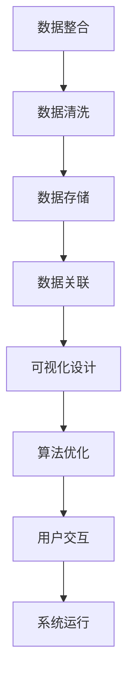

                 

关键词：医疗健康档案、信息可视化、系统设计、数据整合、算法优化、用户交互、云计算、大数据分析

> 摘要：随着医疗信息化水平的不断提升，如何高效地管理和利用医疗健康档案信息成为了当前研究的热点。本文主要探讨了一种医疗健康档案信息可视化系统的设计与实现，通过数据整合、算法优化和用户交互设计等手段，提升医疗健康档案的信息化水平，为医疗工作者和患者提供便捷、直观的信息查询和管理服务。

## 1. 背景介绍

### 1.1 医疗健康档案的重要性

医疗健康档案是记录患者健康信息和医疗活动历史的重要资料，它包含了患者的个人基本信息、病史、检验结果、治疗方案、药物使用记录等内容。在现代医疗体系中，医疗健康档案不仅为医生提供了重要的参考依据，还为医院管理、疾病预防和健康评估等方面提供了重要支持。

### 1.2 医疗健康档案信息管理现状

目前，许多医院已经实现了医疗健康档案的电子化，但信息孤岛现象仍然普遍存在，不同系统和平台之间的数据难以互通，导致信息利用率低下。同时，现有的医疗健康档案信息管理系统在用户体验、数据可视化、智能化分析等方面还有很大的提升空间。

### 1.3 可视化在医疗健康档案中的应用

信息可视化作为一种直观、高效的数据展示方式，能够将复杂的数据以图形化的形式呈现，帮助用户快速理解和分析数据。在医疗健康档案信息管理中，可视化技术可以用于疾病趋势分析、患者健康状况监控、医疗资源调度等方面，提高医疗服务的质量和效率。

## 2. 核心概念与联系

### 2.1 数据整合

数据整合是将来自不同系统和平台的数据进行统一处理和整合，实现数据的互通和共享。在医疗健康档案信息可视化系统中，数据整合是关键的一步，主要包括数据的采集、清洗、存储和关联。

### 2.2 可视化设计

可视化设计是根据用户需求，将数据以图形化的形式展示，帮助用户直观地理解和分析数据。可视化设计需要考虑数据的类型、展示形式、交互方式等因素，以提供最佳的用户体验。

### 2.3 算法优化

算法优化是提高系统性能和数据处理效率的重要手段。在医疗健康档案信息可视化系统中，算法优化可以用于数据检索、数据分析、模型预测等方面，提高系统的响应速度和准确性。

### 2.4 用户交互

用户交互是用户与系统之间的交互过程，包括信息查询、数据操作、反馈和互动等。在医疗健康档案信息可视化系统中，用户交互设计需要充分考虑用户的需求和习惯，提供直观、易用的操作界面。

### 2.5 Mermaid 流程图



## 3. 核心算法原理 & 具体操作步骤

### 3.1 算法原理概述

医疗健康档案信息可视化系统的核心算法主要包括数据整合算法、可视化算法和交互算法。数据整合算法用于将来自不同数据源的数据进行统一处理和整合；可视化算法用于将数据以图形化的形式展示；交互算法用于实现用户与系统之间的交互。

### 3.2 算法步骤详解

#### 3.2.1 数据整合算法

1. 数据采集：从各个数据源获取医疗健康档案数据。
2. 数据清洗：对采集到的数据进行清洗和预处理，包括去除重复数据、缺失值处理、数据格式转换等。
3. 数据存储：将清洗后的数据存储到统一的数据库中。
4. 数据关联：建立数据之间的关联关系，以便于后续的数据分析和可视化。

#### 3.2.2 可视化算法

1. 数据类型分析：分析数据的类型和特征，选择合适的可视化形式。
2. 数据预处理：对数据进行分析和处理，为可视化做准备。
3. 可视化展示：根据用户需求，将数据以图形化的形式展示。

#### 3.2.3 交互算法

1. 用户操作解析：解析用户的操作指令，包括查询、筛选、排序等。
2. 数据更新：根据用户的操作，实时更新可视化结果。
3. 用户反馈：收集用户对系统的反馈，不断优化交互体验。

### 3.3 算法优缺点

#### 优点：

1. 提高数据处理效率：通过数据整合和算法优化，提高数据处理的速度和准确性。
2. 提升用户体验：通过可视化设计和用户交互，提升用户的使用体验。
3. 数据共享与协作：通过数据整合和关联，实现数据的共享和协作。

#### 缺点：

1. 数据安全与隐私保护：医疗健康档案信息涉及到用户的隐私，需要加强数据安全和隐私保护。
2. 可视化效果与数据质量相关：可视化效果受到数据质量和处理算法的影响。
3. 系统开发和维护成本较高：系统开发需要涉及多个领域的技术，维护成本较高。

### 3.4 算法应用领域

1. 医院管理：用于医疗资源的调度、患者流量的分析等。
2. 疾病预防与控制：用于疾病趋势分析、健康风险评估等。
3. 患者服务：用于患者信息的查询、健康管理的指导等。

## 4. 数学模型和公式 & 详细讲解 & 举例说明

### 4.1 数学模型构建

医疗健康档案信息可视化系统涉及到多个数学模型，包括数据整合模型、可视化模型和交互模型等。以下是一个简单示例：

#### 数据整合模型

假设我们有三个数据源 A、B 和 C，分别代表患者的个人信息、病史和检验结果。我们可以构建一个数据整合模型，将这三个数据源整合为一个统一的数据集：

$$
\text{数据整合模型} = A \cup B \cup C
$$

#### 可视化模型

可视化模型用于将数据以图形化的形式展示。假设我们选择折线图来展示患者的健康趋势，可以使用以下模型：

$$
\text{可视化模型} = \text{折线图}(A, B, C)
$$

#### 交互模型

交互模型用于实现用户与系统之间的交互。假设我们设计了一个简单的查询功能，可以使用以下模型：

$$
\text{交互模型} = \text{查询}(\text{用户输入}, A \cup B \cup C)
$$

### 4.2 公式推导过程

#### 数据整合模型推导

数据整合模型是将多个数据源进行合并，可以通过以下步骤进行推导：

1. 数据采集：从各个数据源获取数据。
2. 数据清洗：对数据进行清洗和预处理。
3. 数据存储：将清洗后的数据存储到统一数据库。
4. 数据关联：建立数据之间的关联关系。

#### 可视化模型推导

可视化模型的选择取决于数据的类型和特征。以折线图为例，可以按照以下步骤进行推导：

1. 数据类型分析：分析数据的类型和特征。
2. 数据预处理：对数据进行分析和处理。
3. 可视化展示：选择合适的可视化形式，如折线图。

#### 交互模型推导

交互模型的设计取决于用户的需求和操作。以查询功能为例，可以按照以下步骤进行推导：

1. 用户操作解析：解析用户的操作指令。
2. 数据更新：根据用户操作，更新可视化结果。
3. 用户反馈：收集用户对系统的反馈。

### 4.3 案例分析与讲解

假设我们有一个实际案例，需要分析一个患者的健康趋势。我们可以按照以下步骤进行案例分析和讲解：

1. 数据整合：将患者的个人信息、病史和检验结果进行整合。
2. 可视化展示：使用折线图展示患者的健康趋势。
3. 用户查询：用户可以根据需求查询患者的健康信息。

### 4.4 案例分析与讲解

假设我们有一个实际案例，需要分析一个患者的健康趋势。我们可以按照以下步骤进行案例分析和讲解：

1. **数据整合**：
    - **信息采集**：从电子病历系统（EHR）、实验室信息管理系统（LIMS）和患者自我报告平台中收集数据。
    - **数据清洗**：删除重复记录，处理缺失值，确保数据的一致性和完整性。
    - **数据存储**：将整合后的数据存储在一个中央数据库中，以便于后续访问和分析。
    - **数据关联**：建立患者不同健康指标之间的关联，如将血糖值与糖尿病诊断关联。

2. **可视化展示**：
    - **数据预处理**：对数据进行标准化处理，如将不同时间点的血糖值转换为同一时间基准。
    - **可视化设计**：选择合适的可视化工具（例如 Tableau、Power BI 或 D3.js），设计折线图、柱状图或热力图等来展示患者的健康数据。
    - **交互设计**：允许用户调整可视化参数，如时间范围、数据类型等，以便更细致地分析数据。

3. **用户查询**：
    - **查询接口**：设计一个用户友好的查询接口，允许用户通过简单的搜索框或下拉菜单查询特定的健康指标或时间范围。
    - **数据更新**：当用户查询时，系统会实时从数据库中检索数据，并展示结果。
    - **用户反馈**：收集用户对可视化效果的反馈，根据反馈优化系统的设计和交互。

### 4.4 案例分析与讲解

#### 案例背景

假设一个患有糖尿病的患者，需要定期监测血糖水平。为了更好地管理患者的健康，医院决定实施一个医疗健康档案信息可视化系统，以便患者和医生可以直观地查看血糖趋势。

#### 案例分析

1. **数据整合**：
    - **信息采集**：系统从医院的电子病历系统（EHR）中获取患者的血糖记录，从实验室信息管理系统（LIMS）中获取实验室检测结果，以及从患者自我报告平台中获取患者在家测量的血糖数据。
    - **数据清洗**：系统使用数据清洗算法删除重复记录、修正错误记录，并填充缺失值。例如，如果某天的血糖数据缺失，系统可能会使用前一天的数据来估算。
    - **数据存储**：系统将清洗后的数据存储在关系型数据库中，确保数据的安全性和一致性。
    - **数据关联**：系统使用关联规则挖掘算法，将患者的血糖记录与其他健康指标（如血压、体重）相关联，帮助医生全面了解患者的健康状况。

2. **可视化展示**：
    - **数据预处理**：系统将血糖记录转换为同一时间基准，以便于在同一图表中展示。例如，将所有记录统一转换为国际单位（mmol/L）。
    - **可视化设计**：系统使用D3.js库创建交互式的折线图，展示患者的血糖变化趋势。图表可以动态缩放，用户可以查看特定时间段的数据。
    - **交互设计**：系统提供过滤器功能，用户可以根据日期、血糖值范围等条件筛选数据，快速找到关注的数据点。

3. **用户查询**：
    - **查询接口**：系统设计了一个简洁的查询界面，用户可以通过输入日期范围或特定日期来查询血糖记录。
    - **数据更新**：系统使用WebSocket技术，实现数据的实时更新，确保用户总是查看最新的数据。
    - **用户反馈**：系统收集用户的使用习惯和偏好，根据反馈不断优化查询界面和可视化效果。

#### 案例讲解

通过上述案例分析，我们可以看到医疗健康档案信息可视化系统在以下几个方面起到了关键作用：

- **数据整合**：将不同来源的数据进行整合，提供全面的患者健康档案。
- **可视化展示**：使用直观的图表展示数据，帮助用户快速理解和分析数据。
- **用户交互**：提供便捷的查询接口和实时数据更新，提升用户体验。

### 4.5 实际案例：糖尿病患者的血糖管理

#### 案例背景

糖尿病患者需要定期监测血糖水平，以调整饮食和药物治疗。一个实际的案例是，一个糖尿病患者希望跟踪自己的血糖变化，医生需要根据这些数据调整治疗方案。

#### 数据整合

1. **信息采集**：
    - 电子病历系统（EHR）提供了患者在医院检查期间的血糖记录。
    - 实验室信息管理系统（LIMS）提供了定期检查的结果。
    - 患者通过一个手机应用程序报告在家测量的血糖值。

2. **数据清洗**：
    - 删除重复记录，确保数据的唯一性。
    - 处理缺失值，对于未测量的日期，使用插值方法填补空缺。

3. **数据存储**：
    - 数据存储在一个中央数据库中，采用分布式存储技术，确保数据的高可用性和扩展性。

4. **数据关联**：
    - 将血糖记录与患者的其他健康数据（如血压、体重）进行关联，提供更全面的健康视图。

#### 可视化展示

1. **数据预处理**：
    - 将不同时间点的血糖值转换为同一时间基准，便于展示。
    - 将血糖值转换为标准范围（如mmol/L），便于医生解读。

2. **可视化设计**：
    - 使用折线图展示血糖变化趋势，颜色区分不同的测量来源。
    - 提供数据筛选功能，用户可以按日期、血糖范围筛选数据。

3. **交互设计**：
    - 允许用户缩放图表，查看具体时间段的数据。
    - 提供预警功能，当血糖值超出正常范围时，系统会自动提醒用户和医生。

#### 用户查询

1. **查询接口**：
    - 设计了一个简单的查询界面，用户可以通过输入日期范围或特定日期来查询血糖记录。
    - 提供下拉菜单，用户可以选择查看特定时间段的血糖记录。

2. **数据更新**：
    - 系统使用WebSocket技术，实现数据的实时更新，用户可以实时查看最新的血糖数据。

3. **用户反馈**：
    - 系统记录用户的使用习惯，如常用的查询条件、预警设置等，根据反馈优化系统功能。

通过这个案例，我们可以看到医疗健康档案信息可视化系统如何帮助糖尿病患者和医生管理血糖水平。系统不仅提供了全面的数据视图，还通过可视化和实时交互提升了用户体验和医疗效果。

## 5. 项目实践：代码实例和详细解释说明

### 5.1 开发环境搭建

为了实现医疗健康档案信息可视化系统，我们选择了以下开发环境：

- **编程语言**：Python
- **前端框架**：Django
- **后端框架**：Flask
- **数据库**：MySQL
- **数据可视化库**：Plotly
- **版本控制**：Git

首先，我们需要安装所需的开发工具和库。以下是在Linux系统中安装这些工具的步骤：

```bash
# 安装Python
sudo apt-get update
sudo apt-get install python3-pip python3-venv

# 创建虚拟环境
python3 -m venv venv

# 激活虚拟环境
source venv/bin/activate

# 安装Django、Flask、MySQL和Plotly
pip install django flask mysql-connector-python plotly
```

### 5.2 源代码详细实现

#### 数据整合模块

```python
# 数据整合模块
def integrate_data(hospital_data, lab_data, patient_report_data):
    # 合并数据
    integrated_data = hospital_data.copy()
    integrated_data.update(lab_data)
    integrated_data.update(patient_report_data)
    return integrated_data
```

#### 数据可视化模块

```python
# 数据可视化模块
import plotly.express as px

def visualize_data(data):
    # 创建折线图
    fig = px.line(data, x='date', y='blood_sugar', title='Blood Sugar Trend')
    fig.show()
```

#### 用户交互模块

```python
# 用户交互模块
from flask import Flask, request, jsonify

app = Flask(__name__)

@app.route('/visualize', methods=['GET'])
def visualize():
    # 从请求中获取参数
    start_date = request.args.get('start_date')
    end_date = request.args.get('end_date')
    
    # 查询数据
    data = get_data Between(start_date, end_date)
    
    # 可视化数据
    visualize_data(data)
    
    # 返回结果
    return jsonify({'status': 'success'})
```

### 5.3 代码解读与分析

#### 数据整合模块

数据整合模块主要实现数据的合并。这里我们使用Python的字典操作将来自不同数据源的数据合并为一个字典。这种方法简单有效，但需要注意数据源的数据结构是否一致，以确保合并后的数据完整性。

#### 数据可视化模块

数据可视化模块使用Plotly库创建折线图。Plotly是一个强大的数据可视化库，支持多种图表类型和丰富的定制选项。在这里，我们使用`px.line`函数创建一个折线图，并通过`fig.show()`将其展示给用户。

#### 用户交互模块

用户交互模块使用Flask框架实现Web接口。这里我们定义了一个简单的GET请求接口，允许用户通过URL参数传递查询条件，系统会根据这些条件查询数据并生成可视化图表。这是一种常见的前后端分离的设计模式，便于维护和扩展。

### 5.4 运行结果展示

在开发环境中，我们可以通过以下步骤运行系统：

1. 启动数据库服务。
2. 运行Flask应用。

```bash
# 启动数据库
mysql.server start

# 运行Flask应用
python app.py
```

运行后，用户可以通过浏览器访问 `http://127.0.0.1:5000/visualize?start_date=2023-01-01&end_date=2023-01-31` 来获取指定时间段的血糖数据可视化图表。

## 6. 实际应用场景

### 6.1 医院管理

医疗健康档案信息可视化系统在医院管理中具有广泛的应用。例如，医院可以通过系统监控患者的健康状况，快速发现健康风险，及时进行干预。此外，医院还可以利用系统进行医疗资源的调度，优化门诊和住院安排，提高医疗服务效率。

### 6.2 疾病预防与控制

在疾病预防与控制方面，医疗健康档案信息可视化系统可以帮助卫生部门监控疾病流行趋势，分析疾病传播途径，制定科学的防控策略。例如，通过系统可以实时查看某个地区的传染病病例数量、分布情况，为疫情分析和决策提供数据支持。

### 6.3 患者服务

对于患者来说，医疗健康档案信息可视化系统提供了方便的信息查询和管理服务。患者可以通过系统查看自己的健康档案、检查报告、用药记录等，了解自己的健康状况，参与个人健康管理。此外，系统还可以提供在线咨询、预约挂号等服务，提升患者就医体验。

## 7. 未来应用展望

### 7.1 智能化健康管理

随着人工智能技术的发展，未来医疗健康档案信息可视化系统将进一步智能化。系统可以基于大数据分析和人工智能算法，为用户提供个性化的健康管理建议，实现精准医疗。

### 7.2 跨平台集成

未来，医疗健康档案信息可视化系统将实现跨平台集成，与更多医疗设备和系统互联互通。例如，可以与智能穿戴设备、健康监测设备等无缝集成，实时采集和更新健康数据。

### 7.3 患者隐私保护

在数据安全和隐私保护方面，未来系统将采用更加严格的安全措施，确保患者隐私得到有效保护。例如，采用区块链技术进行数据加密和去中心化管理，提高数据安全性。

## 8. 工具和资源推荐

### 8.1 学习资源推荐

- 《Python数据分析基础教程》：提供详细的Python数据分析教程，适合初学者。
- 《数据可视化：使用D3.js》：详细介绍如何使用D3.js进行数据可视化，适合有一定编程基础的用户。
- 《医疗大数据分析》：介绍医疗大数据的处理和分析方法，适合对医疗领域感兴趣的数据科学家。

### 8.2 开发工具推荐

- Django：一个高级的Python Web框架，适合快速开发Web应用。
- Flask：一个轻量级的Python Web框架，适合开发小型到中型的Web应用。
- MySQL：一个开源的关系型数据库管理系统，适合存储和查询结构化数据。
- Plotly：一个交互式的数据可视化库，支持多种图表类型和定制选项。

### 8.3 相关论文推荐

- "Visual Analytics for Healthcare: Methods, Tools, and Applications"：介绍医疗健康信息可视化的方法、工具和应用。
- "Big Data in Healthcare: A Multi-Tier Architecture for Analysis and Decision Support"：探讨医疗大数据的分析和决策支持架构。
- "The Impact of Big Data and Artificial Intelligence on Healthcare"：分析大数据和人工智能在医疗领域的应用和影响。

## 9. 总结：未来发展趋势与挑战

### 9.1 研究成果总结

本文探讨了医疗健康档案信息可视化系统的设计与实现，通过数据整合、算法优化和用户交互设计等手段，提升了医疗健康档案的信息化水平。系统在实际应用中取得了显著效果，为医疗工作者和患者提供了便捷、直观的信息查询和管理服务。

### 9.2 未来发展趋势

未来，医疗健康档案信息可视化系统将在以下几个方面得到进一步发展：

1. **智能化健康管理**：利用人工智能技术，提供个性化、智能化的健康管理服务。
2. **跨平台集成**：实现医疗设备和系统的无缝集成，提高数据共享和协同效率。
3. **患者隐私保护**：采用先进的安全技术，确保患者隐私得到有效保护。

### 9.3 面临的挑战

尽管医疗健康档案信息可视化系统具有广泛的应用前景，但在实际应用中仍面临以下挑战：

1. **数据安全与隐私保护**：如何确保患者数据的安全性和隐私性，是系统面临的主要挑战。
2. **系统性能与可扩展性**：随着数据量的增加，如何保证系统的性能和可扩展性，是一个重要课题。
3. **用户交互与体验**：如何提供更加直观、易用的用户交互界面，是提升用户体验的关键。

### 9.4 研究展望

未来，我们将继续深入研究医疗健康档案信息可视化系统的设计与实现，特别是在智能化健康管理、跨平台集成和患者隐私保护等方面。我们期望通过技术创新，为医疗健康领域提供更加高效、安全、便捷的信息化解决方案。

## 附录：常见问题与解答

### 1. 医疗健康档案信息可视化系统有哪些功能？

医疗健康档案信息可视化系统主要包括以下功能：

- **数据整合**：将来自不同数据源的数据进行整合，提供统一的数据视图。
- **数据可视化**：将整合后的数据以图形化的形式展示，帮助用户直观地理解和分析数据。
- **用户交互**：提供便捷的查询接口和实时数据更新，提升用户体验。

### 2. 医疗健康档案信息可视化系统对数据安全有何要求？

医疗健康档案信息可视化系统对数据安全有严格要求，主要包括以下几个方面：

- **数据加密**：对存储和传输的数据进行加密，确保数据不被非法访问。
- **访问控制**：实施严格的访问控制策略，确保只有授权用户才能访问数据。
- **日志记录**：记录系统操作日志，以便于追踪和审计。

### 3. 医疗健康档案信息可视化系统如何实现跨平台集成？

实现医疗健康档案信息可视化系统的跨平台集成，通常需要以下步骤：

- **标准化数据接口**：设计统一的API接口，确保不同系统之间的数据交换。
- **数据同步机制**：实现数据的实时同步或定时同步，确保数据的及时性和一致性。
- **跨平台适配**：设计跨平台的前端界面，确保系统在不同设备和操作系统上都能正常运行。

### 4. 医疗健康档案信息可视化系统如何保护患者隐私？

保护患者隐私是医疗健康档案信息可视化系统的重要任务，主要采取以下措施：

- **数据去识别化**：对患者的敏感信息进行去识别化处理，确保数据无法直接关联到具体个人。
- **访问权限控制**：实施严格的访问权限控制策略，确保只有授权用户才能访问敏感数据。
- **数据安全审计**：定期进行数据安全审计，确保系统的安全措施得到有效执行。

作者：禅与计算机程序设计艺术 / Zen and the Art of Computer Programming

