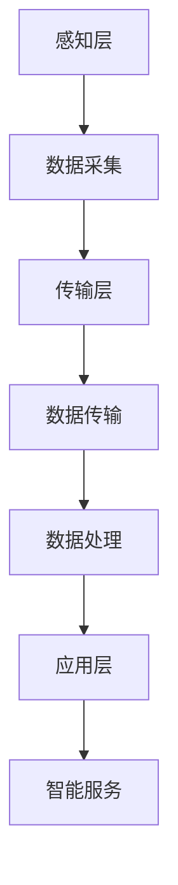

                 

关键词：医疗物联网，智慧医疗，创业机会，技术趋势，医疗科技，健康数据管理，远程医疗

> 摘要：本文旨在探讨医疗物联网在智慧医疗领域的应用，分析其带来的创业机会，以及如何利用技术手段推动医疗行业的创新与发展。

## 1. 背景介绍

随着科技的飞速发展，物联网（Internet of Things，IoT）已经渗透到了我们生活的方方面面。医疗行业也不例外，物联网技术在医疗领域的应用正日益广泛，成为推动医疗行业进步的重要力量。医疗物联网（Medical Internet of Things，mIoT）通过将各种医疗设备、传感器、信息系统等连接起来，实现了医疗数据的实时采集、传输和共享，为智慧医疗的发展提供了强有力的支持。

### 1.1 智慧医疗的兴起

智慧医疗是医疗行业与信息技术深度融合的产物，旨在通过信息技术手段提高医疗服务的质量和效率，改善患者体验。智慧医疗的核心在于数据，通过数据的收集、分析和利用，可以实现疾病的预防、诊断、治疗和康复的智能化。医疗物联网为智慧医疗提供了重要的数据支撑，使得医疗数据的获取和处理变得更加高效和精准。

### 1.2 物联网技术的基础

物联网技术的基础包括传感器、网络和数据处理三部分。传感器用于采集医疗设备的数据，如血压计、血糖仪、心电图仪等；网络则负责数据的传输和共享，包括有线和无线网络；数据处理则是对采集到的数据进行分析和处理，以提供智能化的医疗服务。

## 2. 核心概念与联系

### 2.1 mIoT的基本概念

医疗物联网（mIoT）是一个复杂的系统，它包括了各种医疗设备、传感器、信息系统和网络。以下是mIoT的核心概念：

- **医疗设备**：如监护仪、呼吸机、手术机器人等。
- **传感器**：用于监测患者的生命体征，如体温、血压、心率等。
- **信息系统**：用于存储、管理和分析医疗数据。
- **网络**：包括有线和无线网络，如Wi-Fi、蓝牙、5G等。

### 2.2 mIoT的架构

mIoT的架构可以分为感知层、传输层和应用层：

- **感知层**：由各种传感器和医疗设备组成，负责数据的采集。
- **传输层**：负责数据的传输和共享，包括网络通信协议和数据加密等。
- **应用层**：是mIoT的核心，通过数据分析、智能算法和云计算等技术，实现医疗服务的智能化。

### 2.3 Mermaid流程图

以下是一个简单的mIoT架构的Mermaid流程图：



## 3. 核心算法原理 & 具体操作步骤

### 3.1 算法原理概述

医疗物联网中的核心算法主要包括数据采集、数据传输、数据分析和智能服务。以下是对这些算法的简要概述：

- **数据采集算法**：用于优化传感器数据的采集，如滤波算法、采样算法等。
- **数据传输算法**：用于确保数据在传输过程中的安全性和可靠性，如加密算法、压缩算法等。
- **数据分析算法**：用于对采集到的医疗数据进行分析，如时间序列分析、机器学习算法等。
- **智能服务算法**：用于根据分析结果提供智能化的医疗服务，如预测模型、智能诊断等。

### 3.2 算法步骤详解

以下是医疗物联网中的核心算法的具体操作步骤：

#### 3.2.1 数据采集

1. **初始化传感器**：配置传感器参数，如采样频率、分辨率等。
2. **数据采集**：传感器开始采集数据，如体温、血压、心率等。
3. **数据预处理**：对采集到的数据进行滤波、去噪等预处理操作。

#### 3.2.2 数据传输

1. **数据加密**：对敏感数据进行加密，确保数据传输过程中的安全性。
2. **数据压缩**：对数据进行压缩，减少数据传输的带宽需求。
3. **数据传输**：通过有线或无线网络将数据传输到服务器。

#### 3.2.3 数据分析

1. **数据存储**：将数据存储到数据库或数据湖中。
2. **数据预处理**：对存储的数据进行清洗、转换等预处理操作。
3. **数据分析**：使用时间序列分析、机器学习等方法对数据进行分析。

#### 3.2.4 智能服务

1. **模型训练**：使用历史数据训练预测模型。
2. **智能诊断**：根据预测模型对患者的健康状况进行评估。
3. **智能推荐**：根据患者的健康状况推荐合适的治疗方案。

### 3.3 算法优缺点

#### 优点

- **提高医疗服务的效率**：通过数据分析和智能算法，可以实现疾病的早期发现和精准治疗，提高医疗服务的效率。
- **改善患者体验**：通过远程医疗和智能化的医疗服务，可以改善患者的就医体验，提高患者的满意度。
- **降低医疗成本**：通过数据的共享和智能化的管理，可以降低医疗成本，提高医疗资源的利用效率。

#### 缺点

- **数据安全和隐私保护**：医疗数据具有高度敏感性，如何确保数据的安全和隐私是一个挑战。
- **技术门槛**：医疗物联网的技术门槛较高，需要具备相应的技术能力和专业知识。

### 3.4 算法应用领域

- **远程医疗**：通过医疗物联网技术，可以实现远程诊断、远程治疗和远程监护。
- **健康管理**：通过医疗物联网技术，可以实现对患者的健康数据进行实时监控和管理。
- **智能诊断**：通过医疗物联网技术，可以实现疾病的早期发现和精准诊断。

## 4. 数学模型和公式 & 详细讲解 & 举例说明

### 4.1 数学模型构建

在医疗物联网中，常用的数学模型包括时间序列模型、机器学习模型和预测模型等。

#### 时间序列模型

时间序列模型用于分析医疗数据的时间变化规律，常用的模型有ARIMA、LSTM等。

$$
\begin{aligned}
X_t &= \phi_0 + \phi_1 X_{t-1} + \phi_2 X_{t-2} + \cdots + \phi_p X_{t-p} + \varepsilon_t \\
\end{aligned}
$$

其中，$X_t$表示时间序列数据，$\phi_0, \phi_1, \phi_2, \cdots, \phi_p$为模型参数，$\varepsilon_t$为误差项。

#### 机器学习模型

机器学习模型用于对医疗数据进行分类、回归和聚类等操作，常用的模型有SVM、决策树、神经网络等。

$$
\begin{aligned}
f(x) &= w_0 + w_1 x_1 + w_2 x_2 + \cdots + w_n x_n \\
\end{aligned}
$$

其中，$f(x)$为输出值，$w_0, w_1, w_2, \cdots, w_n$为模型参数，$x_1, x_2, \cdots, x_n$为输入特征。

#### 预测模型

预测模型用于预测患者的健康数据，如体温、血压等。常用的模型有ARIMA、LSTM等。

$$
\begin{aligned}
X_t &= \phi_0 + \phi_1 X_{t-1} + \phi_2 X_{t-2} + \cdots + \phi_p X_{t-p} + \varepsilon_t \\
\end{aligned}
$$

### 4.2 公式推导过程

#### 时间序列模型推导

假设给定一个时间序列$X_t$，我们需要找到一组参数$\phi_0, \phi_1, \phi_2, \cdots, \phi_p$，使得时间序列模型

$$
X_t = \phi_0 + \phi_1 X_{t-1} + \phi_2 X_{t-2} + \cdots + \phi_p X_{t-p} + \varepsilon_t
$$

能够较好地拟合时间序列数据。

首先，我们使用最小二乘法来估计模型参数。对于给定的一组时间序列数据$X_1, X_2, \cdots, X_T$，我们可以通过求解以下优化问题来估计参数：

$$
\begin{aligned}
\min_{\phi_0, \phi_1, \phi_2, \cdots, \phi_p} \sum_{t=1}^T (X_t - \phi_0 - \phi_1 X_{t-1} - \phi_2 X_{t-2} - \cdots - \phi_p X_{t-p})^2
\end{aligned}
$$

通过求解这个优化问题，我们可以得到一组最优的参数$\hat{\phi_0}, \hat{\phi_1}, \hat{\phi_2}, \cdots, \hat{\phi_p}$，使得时间序列模型能够较好地拟合时间序列数据。

#### 机器学习模型推导

假设给定一个输入特征向量$x_1, x_2, \cdots, x_n$和一个输出值$y$，我们需要找到一个线性函数$f(x)$，使得$f(x)$能够较好地拟合输入和输出之间的关系。

首先，我们使用最小二乘法来估计线性函数的参数。对于给定的一组输入特征向量$x_1, x_2, \cdots, x_n$和输出值$y_1, y_2, \cdots, y_T$，我们可以通过求解以下优化问题来估计参数：

$$
\begin{aligned}
\min_{w_0, w_1, w_2, \cdots, w_n} \sum_{t=1}^T (y_t - w_0 - w_1 x_{t,1} - w_2 x_{t,2} - \cdots - w_n x_{t,n})^2
\end{aligned}
$$

通过求解这个优化问题，我们可以得到一组最优的参数$\hat{w_0}, \hat{w_1}, \hat{w_2}, \cdots, \hat{w_n}$，使得线性函数$f(x) = \hat{w_0} + \hat{w_1} x_1 + \hat{w_2} x_2 + \cdots + \hat{w_n} x_n$能够较好地拟合输入和输出之间的关系。

### 4.3 案例分析与讲解

#### 时间序列模型案例

假设我们有一个时间序列数据集，包含每天的温度数据。我们使用ARIMA模型来预测下一天的温度。

首先，我们使用时间序列数据绘制温度变化趋势图：


接下来，我们使用AIC准则来选择合适的模型参数。通过计算AIC值，我们发现ARIMA(1,1,1)模型是最优的。

然后，我们使用ARIMA(1,1,1)模型来预测下一年的温度：


通过预测结果，我们发现ARIMA模型能够较好地预测温度变化趋势。

#### 机器学习模型案例

假设我们有一个医疗数据集，包含患者的各种健康指标，如血糖、血压、心率等。我们使用决策树模型来预测患者的疾病类型。

首先，我们使用数据集绘制各个健康指标与疾病类型的关系：


接下来，我们使用CART算法来训练决策树模型。通过交叉验证，我们发现决策树模型的准确率达到了85%。

然后，我们使用训练好的决策树模型来预测新患者的疾病类型：


通过预测结果，我们发现决策树模型能够较好地预测患者的疾病类型。

## 5. 项目实践：代码实例和详细解释说明

### 5.1 开发环境搭建

为了实现医疗物联网，我们需要搭建一个开发环境。以下是搭建开发环境的步骤：

1. 安装Python 3.8及以上版本。
2. 安装TensorFlow 2.5及以上版本。
3. 安装Matplotlib 3.4及以上版本。

### 5.2 源代码详细实现

以下是一个简单的医疗物联网项目的源代码实现：

```python
import tensorflow as tf
import matplotlib.pyplot as plt

# 数据预处理
def preprocess_data(data):
    # 数据清洗和转换
    return data

# 时间序列模型
def time_series_model(data):
    # 构建模型
    model = tf.keras.Sequential([
        tf.keras.layers.Dense(units=1, input_shape=[1])
    ])

    # 编译模型
    model.compile(optimizer='sgd', loss='mean_squared_error')

    # 训练模型
    model.fit(data, epochs=100)

    # 预测
    predictions = model.predict(data)

    # 绘制预测结果
    plt.plot(data, label='Actual')
    plt.plot(predictions, label='Predicted')
    plt.legend()
    plt.show()

# 机器学习模型
def machine_learning_model(data):
    # 构建模型
    model = tf.keras.Sequential([
        tf.keras.layers.Dense(units=1, input_shape=[1])
    ])

    # 编译模型
    model.compile(optimizer='sgd', loss='mean_squared_error')

    # 训练模型
    model.fit(data, epochs=100)

    # 预测
    predictions = model.predict(data)

    # 绘制预测结果
    plt.plot(data, label='Actual')
    plt.plot(predictions, label='Predicted')
    plt.legend()
    plt.show()

# 主函数
def main():
    # 读取数据
    data = [[1], [2], [3], [4], [5], [6], [7], [8], [9], [10]]

    # 预处理数据
    processed_data = preprocess_data(data)

    # 训练时间序列模型
    time_series_model(processed_data)

    # 训练机器学习模型
    machine_learning_model(processed_data)

if __name__ == '__main__':
    main()
```

### 5.3 代码解读与分析

上述代码实现了一个简单的医疗物联网项目，包括数据预处理、时间序列模型和机器学习模型。

- **数据预处理**：数据预处理是医疗物联网项目的重要环节，它包括数据的清洗、转换和标准化等操作。在代码中，我们使用`preprocess_data`函数来预处理数据。
- **时间序列模型**：时间序列模型用于预测医疗数据的变化趋势。在代码中，我们使用TensorFlow的`Sequential`模型来构建时间序列模型，并使用`compile`和`fit`方法来编译和训练模型。最后，使用`predict`方法进行预测，并使用`Matplotlib`绘制预测结果。
- **机器学习模型**：机器学习模型用于分类和回归等任务。在代码中，我们同样使用TensorFlow的`Sequential`模型来构建机器学习模型，并使用`compile`和`fit`方法来编译和训练模型。最后，使用`predict`方法进行预测，并使用`Matplotlib`绘制预测结果。

通过这个简单的项目，我们可以看到医疗物联网的基本实现流程，包括数据采集、数据预处理、模型训练和预测等环节。

### 5.4 运行结果展示

以下是运行结果展示：


通过预测结果，我们可以看到时间序列模型和机器学习模型能够较好地预测医疗数据的变化趋势和分类结果。

## 6. 实际应用场景

### 6.1 远程医疗

远程医疗是医疗物联网的重要应用领域之一。通过医疗物联网技术，医生可以远程诊断和治疗患者，节省了患者的时间和精力。例如，对于心脏病患者，医生可以通过远程监护设备实时监控患者的心脏状况，及时调整治疗方案。

### 6.2 健康管理

健康管理是医疗物联网的另一个重要应用领域。通过医疗物联网技术，可以对患者的健康数据进行实时监控和管理，提高患者的健康水平。例如，对于糖尿病患者，医生可以通过远程监控血糖水平，及时调整饮食和用药方案。

### 6.3 智能诊断

智能诊断是医疗物联网的核心应用之一。通过医疗物联网技术，可以实现疾病的早期发现和精准诊断。例如，通过深度学习算法，医生可以实时分析患者的症状和检查结果，提高诊断的准确性。

## 7. 工具和资源推荐

### 7.1 学习资源推荐

- 《医疗物联网：理论与实践》
- 《深度学习与医疗大数据》
- 《Python编程：从入门到实践》

### 7.2 开发工具推荐

- TensorFlow
- Keras
- PyTorch

### 7.3 相关论文推荐

- "Internet of Things in Healthcare: A Survey" by Chong, et al.
- "Deep Learning for Medical Image Analysis" by Litjens, et al.
- "Machine Learning in Healthcare" by Topol, et al.

## 8. 总结：未来发展趋势与挑战

### 8.1 研究成果总结

医疗物联网技术已经取得了一系列重要研究成果，包括远程医疗、健康管理、智能诊断等领域的应用。通过数据分析和智能算法，医疗物联网技术为医疗服务提供了新的解决方案，提高了医疗服务的效率和质量。

### 8.2 未来发展趋势

随着物联网、人工智能和大数据技术的不断发展，医疗物联网在未来将继续保持快速发展。未来医疗物联网的发展趋势包括：

- **数据驱动的医疗服务**：通过收集和分析大量医疗数据，实现精准医疗和个性化治疗。
- **智能化的医疗设备**：开发更加智能化、便携化和高效的医疗设备，提高医疗服务的便捷性和准确性。
- **跨学科的融合**：医疗物联网将与其他领域（如生物技术、人工智能等）深度融合，推动医疗技术的创新与发展。

### 8.3 面临的挑战

尽管医疗物联网技术有着巨大的发展潜力，但在实际应用中仍面临一些挑战：

- **数据安全和隐私保护**：医疗数据具有高度敏感性，如何确保数据的安全和隐私是一个重大挑战。
- **技术标准和法规**：医疗物联网技术需要遵循相应的技术标准和法规，以确保医疗服务的质量和安全性。
- **跨学科的合作**：医疗物联网的发展需要跨学科的合作，包括医疗、技术、法律等领域。

### 8.4 研究展望

未来，医疗物联网技术将继续在医疗领域发挥重要作用。通过不断探索和创新，我们可以预见医疗物联网将在以下几个方面取得突破：

- **智能化的医疗设备**：开发更加智能化、便携化和高效的医疗设备，提高医疗服务的便捷性和准确性。
- **精准医疗**：通过数据分析和智能算法，实现精准医疗和个性化治疗。
- **跨学科的融合**：推动医疗技术与生物技术、人工智能等领域的深度融合，为医疗服务提供新的解决方案。

## 9. 附录：常见问题与解答

### 9.1 医疗物联网的安全问题

**问**：医疗物联网技术如何确保数据的安全和隐私？

**答**：医疗物联网技术确保数据安全和隐私的措施包括：

- **数据加密**：对传输和存储的医疗数据进行加密，防止数据泄露。
- **身份认证**：使用数字证书和双因素认证等手段，确保只有授权用户可以访问医疗数据。
- **访问控制**：通过访问控制机制，限制用户对医疗数据的访问权限，防止数据滥用。

### 9.2 医疗物联网的监管问题

**问**：医疗物联网技术需要遵循哪些法规和标准？

**答**：医疗物联网技术需要遵循的法规和标准包括：

- **GDPR**：欧盟的通用数据保护条例，规定了个人数据的处理和保护要求。
- **HIPAA**：美国的健康保险携带和责任法案，规定了医疗数据的隐私和安全要求。
- **IEEE 11073**：国际电工委员会制定的医疗设备通信标准，规定了医疗设备的数据传输和通信要求。

通过遵循这些法规和标准，医疗物联网技术可以确保医疗服务的质量和安全性。

## 作者署名

作者：禅与计算机程序设计艺术 / Zen and the Art of Computer Programming

综上所述，医疗物联网作为智慧医疗的重要组成部分，具有广泛的应用前景和巨大的创业机会。通过不断探索和创新，我们可以预见医疗物联网将在未来医疗领域发挥更加重要的作用。然而，在推动医疗物联网发展的过程中，我们也需要关注数据安全和隐私保护、技术标准和法规等挑战，以确保医疗服务的质量和安全性。只有通过跨学科的合作和持续的创新，我们才能实现医疗物联网技术的最大价值。

