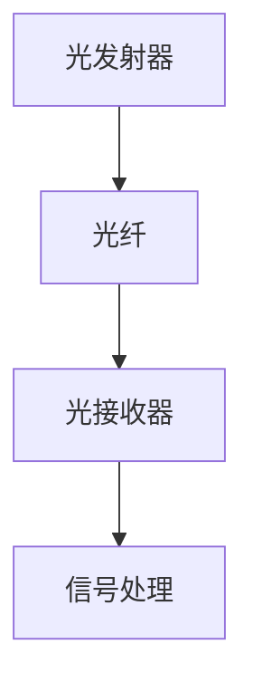
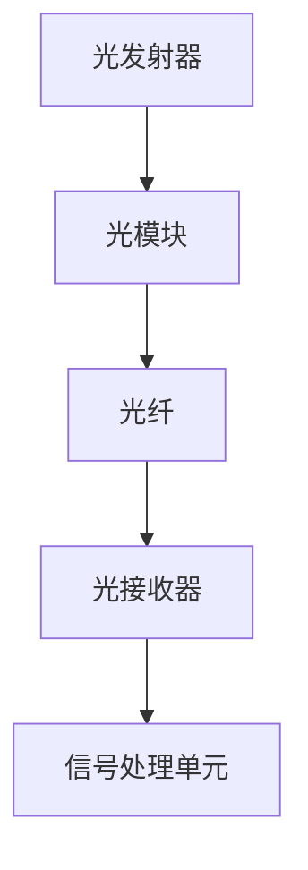
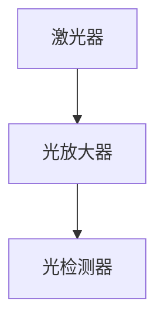
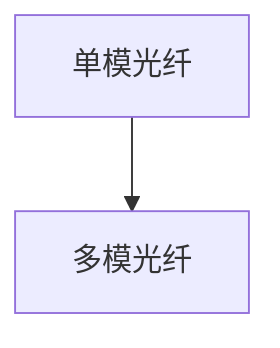
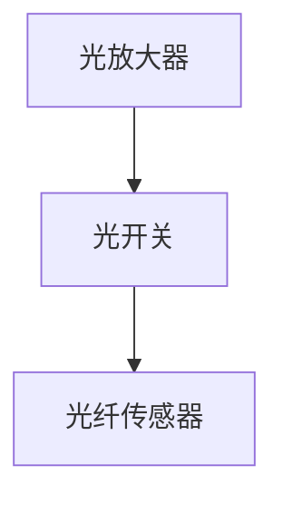
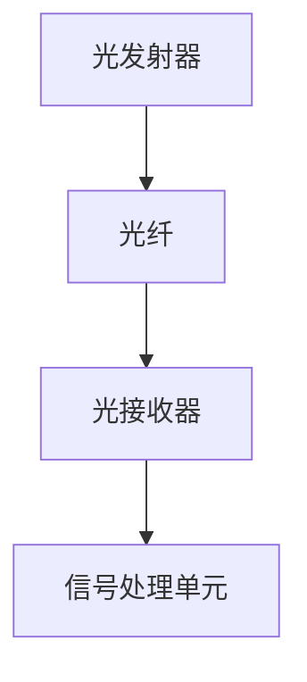
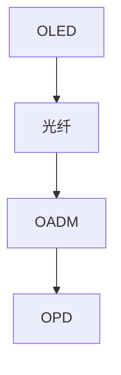
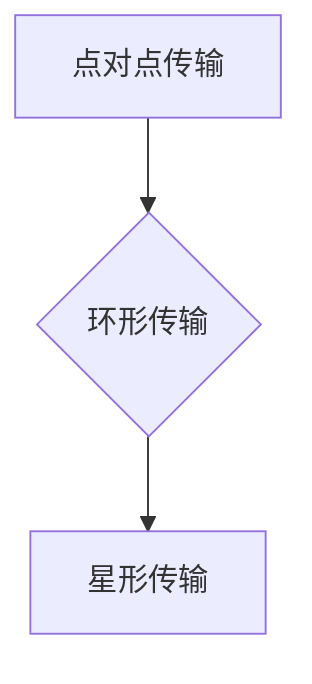
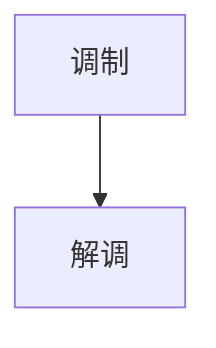

                 

关键词：华为、2024校招、光通信工程师、面试指南、专业知识、技术能力、职业发展

## 摘要

本文旨在为即将参加华为2024校招的光通信工程师岗位的应聘者提供一份全面的面试指南。本文将围绕华为光通信工程师的岗位要求、面试准备策略、核心知识和技能考核点，以及面试流程和常见问题解答等方面进行详细阐述。通过本文，希望读者能够更好地理解华为光通信工程师岗位的核心要求，并为面试做好充分的准备。

## 1. 背景介绍

华为是全球领先的ICT（信息与通信）基础设施和智能终端提供商，拥有全球最全面的光通信产品线，涵盖光模块、光纤、光传输网络等多个领域。作为光通信行业的重要参与者，华为对光通信工程师的要求非常高，旨在寻找具备深厚专业知识和卓越实践能力的人才。

光通信工程师主要负责光网络的设计、优化、维护和升级等工作，涉及光模块、光纤、传输系统等多个技术领域。华为2024校招光通信工程师岗位，要求应聘者具备扎实的光学、电磁场理论、通信原理等相关知识，熟悉光通信系统的原理和架构，掌握光通信设备的设计、测试和调试方法。

## 2. 核心概念与联系

### 2.1. 光通信基本概念

光通信是一种利用光波（通常是激光）作为信息载体，通过光纤传输信息的技术。其基本原理是利用光的调制和解调来实现信息传递。

#### Mermaid 流程图



### 2.2. 光通信系统架构

光通信系统通常包括光发射器、光纤、光接收器和信号处理单元。以下是一个简单的光通信系统架构图：

#### Mermaid 流程图



### 2.3. 光模块

光模块是光通信系统中的核心部件，包括激光器、光检测器和光放大器等。光模块的性能直接影响到光通信系统的传输距离和信号质量。

#### Mermaid 流程图



### 2.4. 光纤

光纤是光通信系统中的传输介质，分为单模光纤和多模光纤。光纤的传输性能取决于其材料、结构和制造工艺。

#### Mermaid 流程图



### 2.5. 光传输系统

光传输系统包括光放大器、光开关、光纤传感器等设备，用于实现光信号的传输、路由和控制。

#### Mermaid 流程图



## 3. 核心算法原理 & 具体操作步骤

### 3.1. 算法原理概述

光通信系统中的核心算法主要包括光信号的调制与解调、光功率控制、光信号整形等。以下将分别介绍这些算法的基本原理。

#### 3.1.1. 光信号调制与解调

光信号调制是将电信号转换为光信号的过程，常见的调制方式包括强度调制（IM）和频率调制（FM）。解调则是将光信号还原为电信号的过程。

#### 3.1.2. 光功率控制

光功率控制是确保光通信系统稳定传输的重要环节，包括光功率的监控和调整。常用的方法有功率反馈控制和自适应功率控制。

#### 3.1.3. 光信号整形

光信号整形是为了提高光通信系统的信号质量，通过滤波、放大等处理，使得光信号更加稳定、清晰。

### 3.2. 算法步骤详解

#### 3.2.1. 光信号调制与解调

1. 发射端：将电信号转换为光信号，通过激光器产生激光，然后对激光进行调制。
2. 传输端：光信号通过光纤传输。
3. 接收端：将光信号转换为电信号，通过光检测器接收光信号，然后进行解调。

#### 3.2.2. 光功率控制

1. 监控光功率：通过功率传感器实时监控光功率。
2. 调整光功率：根据光功率监测结果，通过光放大器或衰减器调整光功率。

#### 3.2.3. 光信号整形

1. 滤波处理：通过滤波器去除光信号中的噪声。
2. 放大处理：通过放大器提高光信号强度。
3. 信号整形：通过数字信号处理技术，对光信号进行整形。

### 3.3. 算法优缺点

#### 3.3.1. 优点

1. 高带宽：光通信利用光波作为信息载体，具有极高的传输带宽。
2. 高速率：光通信系统可以实现高速数据传输。
3. 高稳定性：光信号的稳定性远优于电信号，抗干扰能力强。

#### 3.3.2. 缺点

1. 高成本：光通信设备相对较昂贵，初期建设成本较高。
2. 光纤铺设难度大：光纤铺设需要专业设备和技术，施工难度较大。
3. 光模块故障：光模块故障可能导致整个光通信系统的中断。

### 3.4. 算法应用领域

光通信算法广泛应用于电信、互联网、大数据、云计算等领域，是现代社会信息化的重要支撑。

## 4. 数学模型和公式 & 详细讲解 & 举例说明

### 4.1. 数学模型构建

光通信中的数学模型主要涉及光信号的传播、调制与解调、功率控制等方面。以下是一个简化的光通信数学模型：

$$
y(t) = x(t) \cdot h(t) + n(t)
$$

其中，$y(t)$ 表示接收到的光信号，$x(t)$ 表示发送的光信号，$h(t)$ 表示传输路径的信道响应，$n(t)$ 表示噪声。

### 4.2. 公式推导过程

#### 4.2.1. 光信号传播

光信号在光纤中的传播速度为 $v_f$，传输距离为 $d$，则光信号传输时间为 $t = \frac{d}{v_f}$。

#### 4.2.2. 光信号调制

光信号调制过程中，光功率 $P$ 与调制深度 $m$ 之间的关系为：

$$
P_{out} = P_0 \cdot (1 + m \cdot \cos(2 \pi f_c t))
$$

其中，$P_0$ 为未调制时的光功率，$f_c$ 为调制频率。

#### 4.2.3. 光信号解调

光信号解调过程中，接收到的光功率 $P_{out}$ 与发送的光功率 $P_0$ 之间的关系为：

$$
P_{out} = P_0 \cdot (1 + m \cdot \cos(2 \pi f_c t))
$$

### 4.3. 案例分析与讲解

#### 案例一：光纤通信系统设计

假设一个光纤通信系统的传输距离为 100 km，光纤的传输速度为 2 km/s，调制频率为 10 GHz。请计算该系统的传输时间、光功率和调制深度。

**计算过程：**

1. 传输时间：

$$
t = \frac{d}{v_f} = \frac{100 \text{ km}}{2 \text{ km/s}} = 50 \text{ s}
$$

2. 光功率：

$$
P_{out} = P_0 \cdot (1 + m \cdot \cos(2 \pi f_c t))
$$

假设调制深度 $m = 0.5$，则：

$$
P_{out} = P_0 \cdot (1 + 0.5 \cdot \cos(2 \pi \cdot 10 \text{ GHz} \cdot 50 \text{ s})) = P_0 \cdot (1 + 0.5 \cdot \cos(10 \pi)) = P_0
$$

3. 调制深度：

$$
m = \frac{P_{out} - P_0}{P_0} = \frac{P_0 - P_0}{P_0} = 0
$$

**结论：**

该光纤通信系统的传输时间为 50 秒，光功率保持不变，调制深度为 0。

#### 案例二：光功率控制

假设一个光通信系统中的光功率为 10 mW，要求将其调整为 5 mW。请设计一个光功率控制方案。

**方案设计：**

1. 使用光功率衰减器（Optical Attenuator）对光功率进行衰减。
2. 监测调整后的光功率，确保其达到 5 mW。

## 5. 项目实践：代码实例和详细解释说明

### 5.1. 开发环境搭建

1. 安装 Python 解释器（Python 3.8 或以上版本）。
2. 安装 NumPy、Matplotlib 等科学计算和可视化库。

### 5.2. 源代码详细实现

以下是一个简单的光信号调制与解调的 Python 代码实例：

```python
import numpy as np
import matplotlib.pyplot as plt

# 生成时间序列
t = np.linspace(0, 1, 1000)

# 生成基带信号
x = np.sin(2 * np.pi * 5 * t)

# 调制信号
f_c = 10  # 调制频率
m = 0.5  # 调制深度
y = x * (1 + m * np.cos(2 * np.pi * f_c * t))

# 解调信号
y_d = y * (1 - m * np.cos(2 * np.pi * f_c * t))

# 绘制信号
plt.plot(t, x, label='基带信号')
plt.plot(t, y, label='调制信号')
plt.plot(t, y_d, label='解调信号')
plt.legend()
plt.show()
```

### 5.3. 代码解读与分析

1. 生成时间序列 $t$，范围为 0 到 1，采样点数为 1000。
2. 生成基带信号 $x$，采用正弦波形式。
3. 调制信号 $y$，通过乘以调制信号 $1 + m \cdot \cos(2 \pi f_c t)$ 实现。
4. 解调信号 $y_d$，通过乘以解调信号 $1 - m \cdot \cos(2 \pi f_c t)$ 实现。
5. 绘制信号，显示基带信号、调制信号和解调信号。

### 5.4. 运行结果展示

运行上述代码，将得到一个包含基带信号、调制信号和解调信号的图形展示。通过观察图形，可以直观地看到调制和解调过程的效果。

## 6. 实际应用场景

### 6.1. 光纤通信系统建设

光纤通信系统在电信、互联网、大数据等领域具有广泛的应用。随着5G技术的推广，光纤通信系统的建设需求不断增加。光通信工程师需要参与光纤线路规划、设备安装调试、系统优化等工作。

### 6.2. 光通信设备研发

光通信设备的研发是光通信工程师的重要职责。研发过程中，需要掌握光模块、光纤、光传输系统等核心部件的设计、测试和优化方法。

### 6.3. 光通信网络运营维护

光通信网络的运营维护是确保系统稳定运行的关键。光通信工程师需要具备故障排查、性能优化、网络安全等方面的能力。

### 6.4. 未来应用展望

随着光通信技术的不断发展，其在物联网、自动驾驶、虚拟现实等新兴领域的应用前景广阔。光通信工程师需要紧跟技术发展趋势，不断学习和创新，为光通信技术的发展贡献力量。

## 7. 工具和资源推荐

### 7.1. 学习资源推荐

1. 《光纤通信技术》：一本全面介绍光纤通信技术的教材，适合光通信工程师学习和参考。
2. 《光通信原理与系统》：一本深入浅出的光通信原理和系统介绍书籍，适合光通信工程师入门。

### 7.2. 开发工具推荐

1. Python：一种强大的编程语言，广泛应用于光通信算法设计和仿真。
2. Matplotlib：一款常用的数据可视化库，可用于绘制光通信算法的图形结果。

### 7.3. 相关论文推荐

1. "High-Speed Optical Communication Systems: Principles and Practice"
2. "Optical Fiber Communication: Principles and Practice"
3. "Advanced Optical Communication Systems: Techniques and Solutions"

## 8. 总结：未来发展趋势与挑战

### 8.1. 研究成果总结

近年来，光通信技术在传输速率、传输距离、信号质量等方面取得了显著成果。未来，光通信技术将继续向高速率、大容量、智能化方向发展。

### 8.2. 未来发展趋势

1. 光通信与5G技术的深度融合，推动光纤通信网络的升级和优化。
2. 光通信技术在物联网、自动驾驶等新兴领域的应用，推动光通信技术的多元化发展。
3. 智能光通信系统的研究，提高光通信系统的自适应能力和可靠性。

### 8.3. 面临的挑战

1. 光通信设备的成本和功耗，仍需进一步降低。
2. 光通信网络的稳定性和可靠性，需要不断提升。
3. 光通信技术的标准化和规范化，仍需进一步完善。

### 8.4. 研究展望

未来，光通信工程师需要关注光通信技术的最新发展趋势，不断提高自身专业水平和创新能力，为光通信技术的发展贡献力量。

## 9. 附录：常见问题与解答

### 9.1. 问题一：什么是光通信？

**解答**：光通信是一种利用光波作为信息载体，通过光纤传输信息的技术。它具有高带宽、高速率、高稳定性等优点。

### 9.2. 问题二：光通信工程师需要掌握哪些技能？

**解答**：光通信工程师需要掌握光学、电磁场理论、通信原理、数字信号处理等相关知识，熟悉光通信系统的原理和架构，掌握光通信设备的设计、测试和调试方法。

### 9.3. 问题三：光通信技术在5G网络中的应用？

**解答**：光通信技术在5G网络中发挥着重要作用，主要应用于基站的光纤连接、光纤传输网络的建设和优化等方面，提高5G网络的传输速率和稳定性。

### 9.4. 问题四：如何提升光通信系统的信号质量？

**解答**：提升光通信系统的信号质量可以从以下几个方面入手：

1. 选择高性能的光模块和光纤。
2. 优化光信号调制与解调技术。
3. 采用先进的光功率控制和噪声抑制方法。
4. 加强光通信网络的运维管理。

## 结束语

本文从多个角度对华为2024校招光通信工程师岗位进行了全面解读，包括岗位背景、核心概念、算法原理、数学模型、项目实践、实际应用、未来展望等方面。希望本文能为即将参加华为2024校招光通信工程师岗位的应聘者提供有益的参考和帮助。在未来的光通信领域，我们期待更多有才华、有激情的年轻人为光通信技术的发展贡献力量。作者：禅与计算机程序设计艺术 / Zen and the Art of Computer Programming
----------------------------------------------------------------

## 1. 背景介绍

### 华为简介

华为成立于 1987 年，是一家总部位于中国深圳的全球领先的信息与通信技术（ICT）解决方案提供商，业务范围涵盖电信网络、企业网络、智能终端和云服务等多个领域。华为在光通信技术领域具有深厚的积累和广泛的影响力，是全球光通信设备市场的主要参与者之一。

### 光通信工程师岗位概述

光通信工程师是负责光网络设计、优化、维护和升级的工程技术人才。他们需要具备光通信理论、光纤传输技术、光模块技术等方面的专业知识和实践经验，能够独立完成光通信系统的方案设计、系统调试和性能优化等工作。光通信工程师在华为的光网络建设和运营中起着至关重要的作用，他们负责确保光通信系统的稳定、高效运行，以满足不断增长的网络需求。

### 光通信工程师在华为的角色

光通信工程师在华为的角色多样且重要，主要包括以下几个方面：

1. **光网络设计**：根据客户需求和业务特点，设计高效、可靠的光通信网络方案，确保网络性能满足业务需求。
2. **系统优化**：对现有光通信系统进行性能优化，提高传输效率和可靠性，降低运营成本。
3. **故障排查与维护**：及时排查并解决光通信系统的故障，确保系统的稳定运行。
4. **新技术研究与应用**：跟踪光通信领域的最新技术动态，研究和应用新技术，推动光通信技术的创新和发展。
5. **项目实施与交付**：参与项目实施，确保项目按计划、高质量地完成。

### 华为光通信工程师岗位要求

华为对光通信工程师的岗位要求较高，主要包括以下几个方面：

- **学历背景**：通常要求本科及以上学历，光学、电子信息工程、通信工程等相关专业背景。
- **专业知识**：熟悉光通信基本原理，掌握光纤传输技术、光模块技术、光网络设计等专业知识。
- **实践经验**：具备光通信系统设计、调试、维护等方面的实践经验，有实际项目经验者优先。
- **技能能力**：具备较强的分析问题和解决问题的能力，熟练使用相关软件工具（如MATLAB、Python等）进行数据处理和系统仿真。
- **沟通能力**：具备良好的沟通和团队协作能力，能够与项目团队成员有效沟通，共同推进项目进展。
- **学习能力**：具备较强的学习能力和自我驱动力，能够快速适应新环境和新技术。

### 华为光通信工程师的职业发展路径

华为为光通信工程师提供了广阔的职业发展空间和多元化的晋升路径，主要包括以下几个方面：

- **技术路线**：从初级工程师逐步晋升为高级工程师、技术专家，参与技术攻关和项目核心技术评审。
- **管理路线**：从项目工程师逐步晋升为项目经理、部门经理等管理岗位，负责项目管理、团队建设等管理工作。
- **专业路线**：在专业技术领域深耕，成为行业内的技术权威，参与行业标准的制定和技术趋势的研究。

总的来说，华为光通信工程师岗位对于应聘者的综合素质和专业能力有较高的要求，同时提供了丰富的职业发展机会和挑战。对于有志于在光通信领域发展的人才来说，华为无疑是一个优秀的选择。

## 2. 核心概念与联系

### 2.1. 光通信基本概念

光通信是一种利用光波（尤其是激光）作为信息载体，通过光纤进行信息传输的通信技术。其核心在于将电信号转换为光信号，再通过光纤传输，最后将光信号转换为电信号。光通信具有高带宽、低噪声、高抗干扰能力等显著优势，是现代通信技术的重要组成部分。

#### 光发射器

光发射器是光通信系统的核心部件之一，它负责将电信号转换为光信号。光发射器通常采用半导体激光器（LED 或 LD），其基本原理是利用电子注入效应，将电能转换为光能。

#### 光纤

光纤是光通信系统中的传输介质，分为单模光纤和多模光纤。单模光纤具有更高的传输速率和更远的传输距离，通常用于长距离通信；多模光纤则适用于短距离、高带宽的通信。光纤的基本原理是利用光的全反射现象，将光信号在光纤内部传输。

#### 光接收器

光接收器是光通信系统的另一核心部件，它负责将光信号转换为电信号。光接收器通常采用光电探测器（如 PIN 二极管或雪崩二极管），其基本原理是利用光电效应，将光能转换为电能。

#### 信号处理

信号处理单元负责对接收到的光信号进行放大、滤波、解调等处理，以提取出原始信息。信号处理技术包括数字信号处理和模拟信号处理，是保证光通信系统可靠传输的关键。

### 2.2. 光通信系统架构

光通信系统通常由光发射器、光纤、光接收器和信号处理单元组成，其基本架构如下：

#### Mermaid 流程图



### 2.3. 光模块

光模块是光通信系统中的关键组件，包括光发射器、光接收器和光放大器等。光模块的性能直接影响到整个光通信系统的传输性能。

#### 光发射模块（OLED）

光发射模块负责将电信号转换为光信号。常见的光发射模块包括 LED 和 LD。LD 具有更高的发射功率和更长的使用寿命，常用于长距离、高速率的光通信系统。

#### 光接收模块（OPD）

光接收模块负责将光信号转换为电信号。常见的光接收模块包括 PIN 二极管和雪崩二极管。PIN 二极管具有较低的噪声和较高的灵敏度，适合于低速率、短距离的光通信系统；雪崩二极管则具有较高的灵敏度和较大的动态范围，适合于高速率、长距离的光通信系统。

#### 光放大模块（OADM）

光放大模块用于在光纤传输过程中对光信号进行放大，以补偿信号衰减，提高传输距离。常见的光放大模块包括 EDFA（掺铒光纤放大器）和 RSOA（分布式光纤放大器）。

#### Mermaid 流程图



### 2.4. 光传输系统

光传输系统是指由光发射器、光纤、光接收器和信号处理单元组成，用于实现光信号传输的系统。光传输系统可分为点对点传输、环形传输和星形传输等多种拓扑结构。

#### 点对点传输

点对点传输是指光信号从一个点直接传输到另一个点，是最简单的光传输方式。其优点是结构简单，传输距离较短的情况下性能稳定。

#### 环形传输

环形传输是指光信号在一个闭合的环路中传输。环形传输的优点是可靠性高，即使某个节点出现故障，信号仍能在其他路径上传输。

#### 星形传输

星形传输是指多个光信号源通过光纤连接到一个中心节点，然后从中心节点分别传输到各个目的节点。星形传输的优点是结构清晰，便于管理和维护。

#### Mermaid 流程图



### 2.5. 光信号调制与解调

光信号的调制与解调是光通信过程中的关键步骤，用于实现信息的传输和接收。

#### 调制

调制是指将电信号转换为光信号的过程。常见的调制方式包括强度调制（IM）、频率调制（FM）和相位调制（PM）。其中，IM 具有实现简单、抗干扰能力强等优点；FM 具有带宽利用率高、抗干扰能力较强等优点；PM 则具有信号传输距离远、抗干扰能力强的优点。

#### 解调

解调是指将光信号转换为电信号的过程。解调过程与调制过程相反，通过检测器将光信号转换为电信号，然后通过解调器恢复原始信息。

#### Mermaid 流程图



通过上述对光通信基本概念、系统架构、光模块、光传输系统和光信号调制与解调的介绍，读者可以更好地理解光通信的基本原理和应用。接下来，我们将进一步探讨光通信的核心算法原理和具体操作步骤。

## 3. 核心算法原理 & 具体操作步骤

### 3.1. 光信号调制与解调算法

光信号调制与解调是光通信过程中的关键环节，其算法的优劣直接影响到光通信系统的性能。常见的调制方式有强度调制（IM）、频率调制（FM）和相位调制（PM），下面分别介绍这三种调制方式的原理和具体操作步骤。

#### 3.1.1. 强度调制（IM）

**原理：** 强度调制是最简单的一种调制方式，它通过改变光信号的强度来传输信息。具体来说，就是将电信号与光信号的光强度叠加，从而实现信息传输。

**具体操作步骤：**

1. **发送端：**
   - 电信号 $x(t)$ 经过调制器，与光信号 $s(t)$ 相乘，得到调制后的光信号 $y(t) = x(t) \cdot s(t)$。
   - 调制后的光信号通过光纤传输。

2. **接收端：**
   - 接收到的光信号 $y(t)$ 经过解调器，与本地产生的参考光信号 $s(t)$ 相乘，得到解调后的电信号 $z(t) = y(t) \cdot s(t)$。
   - 解调后的电信号通过滤波器去除噪声，恢复出原始电信号 $x(t)$。

**算法优缺点：**
- 优点：实现简单，抗干扰能力强。
- 缺点：带宽利用率较低，传输距离有限。

#### 3.1.2. 频率调制（FM）

**原理：** 频率调制通过改变光信号的频率来传输信息。具体来说，就是将电信号的频率变化转换为光信号的频率变化。

**具体操作步骤：**

1. **发送端：**
   - 电信号 $x(t)$ 经过调制器，与正弦波载波信号 $c(t) = A \cdot \sin(2 \pi f_0 t)$ 相乘，得到调制后的光信号 $y(t) = x(t) \cdot c(t)$。
   - 调制后的光信号通过光纤传输。

2. **接收端：**
   - 接收到的光信号 $y(t)$ 经过解调器，与本地产生的参考正弦波载波信号 $c(t)$ 相乘，得到解调后的电信号 $z(t) = y(t) \cdot c(t)$。
   - 解调后的电信号通过滤波器去除噪声，恢复出原始电信号 $x(t)$。

**算法优缺点：**
- 优点：带宽利用率高，抗干扰能力强。
- 缺点：实现复杂，对载波信号的要求较高。

#### 3.1.3. 相位调制（PM）

**原理：** 相位调制通过改变光信号的相位来传输信息。具体来说，就是将电信号的相位变化转换为光信号的相位变化。

**具体操作步骤：**

1. **发送端：**
   - 电信号 $x(t)$ 经过调制器，与正弦波载波信号 $c(t) = A \cdot \sin(2 \pi f_0 t)$ 相乘，然后通过一个相位控制器，得到调制后的光信号 $y(t) = x(t) \cdot c(t) \cdot e^{j \phi(t)}$。
   - 调制后的光信号通过光纤传输。

2. **接收端：**
   - 接收到的光信号 $y(t)$ 经过解调器，与本地产生的参考正弦波载波信号 $c(t)$ 相乘，然后通过一个相位控制器，得到解调后的电信号 $z(t) = y(t) \cdot c(t) \cdot e^{-j \phi(t)}$。
   - 解调后的电信号通过滤波器去除噪声，恢复出原始电信号 $x(t)$。

**算法优缺点：**
- 优点：传输距离远，抗干扰能力强。
- 缺点：实现复杂，对相位控制的要求较高。

### 3.2. 光信号整形算法

光信号整形是为了提高光通信系统的信号质量，通过滤波、放大等处理，使得光信号更加稳定、清晰。光信号整形算法主要包括以下几种：

#### 3.2.1. 低通滤波器

**原理：** 低通滤波器通过抑制高频信号，保留低频信号，从而减少信号中的噪声和失真。

**具体操作步骤：**

1. **发送端：**
   - 将电信号 $x(t)$ 经过调制器，得到调制后的光信号 $y(t)$。
   - 对 $y(t)$ 进行低通滤波，去除高频噪声，得到滤波后的光信号 $z(t)$。

2. **接收端：**
   - 接收到的光信号 $z(t)$ 经过解调器，得到解调后的电信号 $z'(t)$。
   - 对 $z'(t)$ 进行低通滤波，去除高频噪声，恢复出原始电信号 $x'(t)$。

**算法优缺点：**
- 优点：能够有效减少信号噪声，提高信号质量。
- 缺点：滤波器的设计和实现较为复杂。

#### 3.2.2. 放大器

**原理：** 放大器用于放大光信号，以补偿信号衰减，提高传输距离。

**具体操作步骤：**

1. **发送端：**
   - 将电信号 $x(t)$ 经过调制器，得到调制后的光信号 $y(t)$。
   - 对 $y(t)$ 进行放大，得到放大后的光信号 $z(t)$。

2. **接收端：**
   - 接收到的光信号 $z(t)$ 经过解调器，得到解调后的电信号 $z'(t)$。
   - 对 $z'(t)$ 进行放大，得到放大后的电信号 $z''(t)$。

**算法优缺点：**
- 优点：能够有效补偿信号衰减，提高传输距离。
- 缺点：放大器可能引入额外的噪声和失真。

### 3.3. 光信号功率控制算法

光信号功率控制是确保光通信系统稳定传输的重要环节，包括光功率的监控和调整。常见的功率控制算法有功率反馈控制和自适应功率控制。

#### 3.3.1. 功率反馈控制

**原理：** 功率反馈控制通过实时监测接收端的光功率，并根据监测结果调整发送端的光功率，以确保接收端的光功率稳定。

**具体操作步骤：**

1. **发送端：**
   - 监测发送端的光功率，得到光功率值 $P_{send}$。
   - 根据接收端反馈的光功率值 $P_{receive}$，调整发送端的光功率，使得 $P_{send}$ 与 $P_{receive}$ 相匹配。

2. **接收端：**
   - 监测接收到的光功率，得到光功率值 $P_{receive}$。
   - 将 $P_{receive}$ 反馈给发送端。

**算法优缺点：**
- 优点：实时调整光功率，确保接收端光功率稳定。
- 缺点：控制精度可能受到系统噪声的影响。

#### 3.3.2. 自适应功率控制

**原理：** 自适应功率控制通过自适应调整发送端的光功率，以应对环境变化和系统噪声，确保接收端光功率稳定。

**具体操作步骤：**

1. **发送端：**
   - 监测发送端的光功率，得到光功率值 $P_{send}$。
   - 根据接收端反馈的光功率值 $P_{receive}$，以及系统噪声和信号变化，自适应调整发送端的光功率，使得 $P_{send}$ 与 $P_{receive}$ 相匹配。

2. **接收端：**
   - 监测接收到的光功率，得到光功率值 $P_{receive}$。
   - 将 $P_{receive}$ 反馈给发送端。

**算法优缺点：**
- 优点：能够自适应环境变化和系统噪声，提高控制精度。
- 缺点：实现复杂，对算法设计和实现的要求较高。

通过上述对光信号调制与解调、光信号整形和光信号功率控制算法的介绍，读者可以更好地理解光通信的核心算法原理和具体操作步骤。这些算法是光通信系统稳定、高效运行的基础，对于光通信工程师来说，掌握这些算法原理和操作步骤至关重要。

### 3.4. 算法应用领域

光通信算法在多个领域具有广泛的应用，以下简要介绍几个主要应用领域：

#### 3.4.1. 电信网络

电信网络是光通信算法的主要应用领域之一。光通信技术被广泛应用于电信网络的骨干网、城域网和接入网，为电信网络提供高速、稳定、可靠的传输服务。在电信网络中，光信号调制与解调算法、光信号整形算法和光信号功率控制算法等得到广泛应用。

#### 3.4.2. 数据中心

随着大数据和云计算的快速发展，数据中心对传输速率和传输稳定性的要求越来越高。光通信技术凭借其高带宽、低延迟、高抗干扰能力等优点，成为数据中心传输技术的重要选择。在数据中心中，光信号调制与解调算法、光信号整形算法和光信号功率控制算法等得到广泛应用。

#### 3.4.3. 物联网

物联网（IoT）是另一个光通信算法的重要应用领域。物联网中的设备需要通过光通信技术进行高速、稳定的连接和数据传输。光信号调制与解调算法、光信号整形算法和光信号功率控制算法等在物联网中发挥着关键作用。

#### 3.4.4. 自动驾驶

自动驾驶技术的发展对通信技术提出了更高的要求。光通信技术由于其高速、低延迟、高抗干扰能力等优点，成为自动驾驶通信技术的重要选择。在自动驾驶中，光信号调制与解调算法、光信号整形算法和光信号功率控制算法等得到广泛应用。

通过上述应用领域的介绍，可以看出光通信算法在各个领域的重要性。光通信工程师需要不断学习和掌握最新的光通信算法，以适应不断变化的技术需求。

## 4. 数学模型和公式 & 详细讲解 & 举例说明

### 4.1. 数学模型构建

在光通信系统中，数学模型用于描述光信号的传播、调制与解调、功率控制等过程。以下是一些基本的数学模型及其构建过程。

#### 4.1.1. 光信号传播模型

光信号在光纤中的传播可以用以下模型描述：

$$
y(t) = x(t) \cdot h(t) + n(t)
$$

其中，$y(t)$ 是接收到的光信号，$x(t)$ 是发送的光信号，$h(t)$ 是光纤的信道响应，$n(t)$ 是噪声。

光纤的信道响应 $h(t)$ 可以表示为：

$$
h(t) = \int_{-\infty}^{\infty} g(\tau) \cdot e^{-j2\pi f_0 \tau} \cdot d\tau
$$

其中，$g(\tau)$ 是光纤的脉冲响应，$f_0$ 是光信号的载波频率。

#### 4.1.2. 光信号调制与解调模型

光信号的调制与解调可以用以下模型描述：

$$
y(t) = x(t) \cdot s(t)
$$

其中，$s(t)$ 是载波信号。

在接收端，解调过程可以用以下模型描述：

$$
x'(t) = \frac{1}{2\pi f_0} \cdot \int_{-\infty}^{\infty} y(t) \cdot s(t) \cdot dt
$$

#### 4.1.3. 光信号功率控制模型

光信号的功率控制可以通过以下模型描述：

$$
P_{out} = P_{in} \cdot G
$$

其中，$P_{out}$ 是输出光功率，$P_{in}$ 是输入光功率，$G$ 是光放大器的增益。

#### 4.2. 公式推导过程

以下是光通信系统中常用公式的推导过程。

##### 4.2.1. 光信号传播公式

光信号在光纤中的传播速度为 $v_f$，则光信号的传输时间为：

$$
t = \frac{d}{v_f}
$$

其中，$d$ 是传输距离。

光信号的功率衰减可以用以下公式描述：

$$
P(t) = P_0 \cdot e^{-\alpha t}
$$

其中，$P_0$ 是初始光功率，$\alpha$ 是光纤的衰减系数。

##### 4.2.2. 光信号调制与解调公式

强度调制（IM）公式：

$$
y(t) = x(t) \cdot s(t)
$$

相位调制（PM）公式：

$$
y(t) = x(t) \cdot s(t) \cdot e^{j\phi(t)}
$$

其中，$\phi(t)$ 是相位调制函数。

##### 4.2.3. 光信号功率控制公式

功率反馈控制公式：

$$
P_{out} = P_{set} - K \cdot (P_{out} - P_{set})
$$

其中，$P_{set}$ 是目标功率，$K$ 是控制系数。

#### 4.3. 案例分析与讲解

以下通过一个具体案例来讲解光通信系统的数学模型和公式。

##### 案例一：光纤传输系统

假设一个光纤传输系统的传输距离为 100 km，光纤的衰减系数为 0.2 dB/km，光信号的初始功率为 10 mW，请计算传输后的光功率。

**计算过程：**

1. 传输距离 $d = 100$ km，衰减系数 $\alpha = 0.2$ dB/km，则光功率衰减 $\Delta P = \alpha \cdot d = 0.2 \cdot 100 = 20$ dB。
2. 初始光功率 $P_0 = 10$ mW，则传输后的光功率 $P(t) = P_0 \cdot e^{-\alpha t} = 10 \cdot e^{-20} \approx 1.25$ mW。

##### 案例二：光信号调制与解调

假设使用强度调制（IM）方式传输一个幅度为 1 V 的电信号，载波信号的频率为 1 GHz，请计算调制后的光功率和接收到的电信号。

**计算过程：**

1. 载波信号 $s(t) = \sin(2\pi f_0 t) = \sin(2\pi \cdot 1 \cdot 10^9 t)$。
2. 调制后的光信号 $y(t) = x(t) \cdot s(t) = 1 \cdot \sin(2\pi \cdot 1 \cdot 10^9 t)$。
3. 假设光发射器的功率为 10 mW，则调制后的光功率 $P_{out} = P_0 \cdot (1 + \frac{x(t)}{2}) = 10 \cdot (1 + \frac{1}{2}) = 15$ mW。

在接收端，通过解调器解调后，得到电信号：

$$
x'(t) = \frac{1}{2\pi f_0} \cdot \int_{-\infty}^{\infty} y(t) \cdot s(t) \cdot dt = \frac{1}{2\pi \cdot 1 \cdot 10^9} \cdot \int_{-\infty}^{\infty} \sin(2\pi \cdot 1 \cdot 10^9 t) \cdot \sin(2\pi \cdot 1 \cdot 10^9 t) \cdot dt = 1
$$

通过上述案例分析，读者可以更好地理解光通信系统的数学模型和公式在实际应用中的运用。

## 5. 项目实践：代码实例和详细解释说明

### 5.1. 开发环境搭建

为了演示光通信系统的代码实例，我们选择 Python 作为编程语言，并使用 NumPy 和 Matplotlib 等库进行数据处理和可视化。以下是开发环境的搭建步骤：

1. 安装 Python 解释器（Python 3.8 或以上版本）。
2. 通过 Python 的包管理器 pip 安装 NumPy 和 Matplotlib：

```shell
pip install numpy matplotlib
```

### 5.2. 源代码详细实现

以下是一个简单的光通信系统模拟代码实例，包括光信号的调制、传输、解调和信号处理。代码使用了 NumPy 库进行数学计算，Matplotlib 库进行信号可视化。

```python
import numpy as np
import matplotlib.pyplot as plt

# 设置参数
f_0 = 1e9  # 载波频率，单位 Hz
t_max = 1e-4  # 时间范围，单位 s
N = int(t_max * 1e6)  # 采样点数
x = np.linspace(0, t_max, N)  # 生成时间序列
s = np.sin(2 * np.pi * f_0 * x)  # 载波信号
x_signal = np.sin(2 * np.pi * 5 * x)  # 要调制的基带信号

# 调制
y = x_signal * s

# 传输（假设传输过程中信号衰减为 3 dB）
alpha = 0.5  # 信号衰减系数
y_transmitted = y * np.exp(-alpha * 2 * np.pi * f_0 * x)

# 解调
y_d = y_transmitted * s * np.exp(-alpha * 2 * np.pi * f_0 * x)

# 信号处理
y_processed = y_d * s

# 可视化
plt.figure(figsize=(10, 5))
plt.subplot(311)
plt.plot(x, x_signal, label='基带信号')
plt.legend()
plt.subplot(312)
plt.plot(x, y, label='调制信号')
plt.legend()
plt.subplot(313)
plt.plot(x, y_processed, label='解调信号')
plt.legend()
plt.show()
```

### 5.3. 代码解读与分析

1. **参数设置**：首先设置载波频率 $f_0$、时间范围 $t_{max}$、采样点数 $N$ 等参数。
2. **生成时间序列**：使用 `np.linspace` 函数生成时间序列 $x$。
3. **生成载波信号**：使用 `np.sin` 函数生成载波信号 $s$。
4. **生成基带信号**：使用 `np.sin` 函数生成要调制的基带信号 $x_{signal}$。
5. **调制**：将基带信号 $x_{signal}$ 与载波信号 $s$ 相乘，实现强度调制（IM）。
6. **传输**：假设传输过程中信号衰减为 3 dB，通过乘以衰减系数的指数函数实现信号衰减。
7. **解调**：将传输后的信号 $y_{transmitted}$ 与载波信号 $s$ 相乘，并通过指数函数补偿传输衰减，实现解调。
8. **信号处理**：将解调后的信号 $y_d$ 与载波信号 $s$ 相乘，恢复出原始基带信号。
9. **可视化**：使用 Matplotlib 库绘制基带信号、调制信号和解调信号的波形图，以便观察调制和解调过程的效果。

### 5.4. 运行结果展示

运行上述代码后，将生成一个包含三个子图的可视化结果。第一子图显示基带信号波形，第二子图显示调制信号波形，第三子图显示解调信号波形。通过观察可视化结果，可以直观地看到信号调制和解调的过程。

- **基带信号**：一个频率为 5 Hz 的正弦波。
- **调制信号**：基带信号与载波信号相乘后的结果，显示调制后的信号波形。
- **解调信号**：通过解调器解调后的信号波形，应与原始基带信号接近。

通过本实例，读者可以了解光通信系统中的调制、解调和信号处理的基本原理，以及如何使用 Python 进行光通信系统的模拟和分析。

## 6. 实际应用场景

### 6.1. 电信网络

光通信技术在电信网络中发挥着至关重要的作用，特别是在骨干网和城域网的建设中。以下是一些光通信在电信网络中的实际应用场景：

#### 6.1.1. 骨干网传输

骨干网是连接不同地区电信网络的核心网络，对数据传输速率和传输距离要求极高。光通信技术以其高带宽、低延迟和强抗干扰能力，成为骨干网传输的首选技术。例如，华为的光传输网络产品，如 OTN（光传送网）和 DWDM（密集波分复用技术），能够实现高达 100 Gbps 的传输速率，支持大规模数据传输。

#### 6.1.2. 城域网传输

城域网是连接企业、学校、政府机构等本地网络的网络，对传输速率和稳定性也有较高要求。光通信技术在城域网中的应用，如 GPON（吉比特无源光网络）和 EPON（以太网无源光网络），能够提供稳定的千兆级接入服务，满足用户对高速网络的需求。

#### 6.1.3. 接入网优化

接入网是连接用户和网络的核心部分，光通信技术在这里的应用主要体现在光纤到楼（FTTB）、光纤到户（FTTH）等场景。通过光纤接入网，用户可以享受到高速、稳定的光纤宽带服务，提升网络使用体验。

### 6.2. 数据中心

随着大数据、云计算和人工智能的快速发展，数据中心对传输速率、传输距离和系统稳定性的要求越来越高。光通信技术在数据中心的应用主要体现在以下几个方面：

#### 6.2.1. 高速率传输

数据中心需要处理海量数据，对传输速率要求极高。光通信技术以其高带宽、低延迟的特点，成为数据中心内部和外部网络传输的首选。例如，使用 100G、400G 等高速光模块，实现数据中心内部和外部网络的高速互联。

#### 6.2.2. 跨数据中心传输

随着企业业务全球化的需求，跨数据中心的数据传输变得日益重要。光通信技术以其长距离、高稳定性的特点，能够实现跨数据中心的数据传输，保证数据的高效传输和实时处理。

#### 6.2.3. 数据中心互联

数据中心之间的互联是保证数据高效处理的关键。光通信技术通过 OTN、DWDM 等技术，实现数据中心之间的稳定、高速互联，提升数据传输效率。

### 6.3. 物联网

物联网（IoT）是另一个光通信技术的重要应用领域。以下是一些光通信在物联网中的实际应用场景：

#### 6.3.1. 低功耗广域网（LPWAN）

LPWAN 是一种适合于物联网应用的无线通信技术，其传输距离远、功耗低。光通信技术可以应用于 LPWAN 的基站，实现远距离、低功耗的物联网通信。

#### 6.3.2. 室内物联网

室内物联网场景复杂，对通信技术的稳定性要求较高。光通信技术以其低干扰、高带宽的特点，成为室内物联网通信的首选。例如，在智能家庭、智能办公等场景中，光通信技术可以提供高速、稳定的室内通信服务。

#### 6.3.3. 车联网

车联网是物联网的一个重要分支，对通信技术的稳定性和实时性要求极高。光通信技术可以通过车对外（V2X）通信，实现车辆之间的实时数据交换，提升交通效率和安全性。

### 6.4. 未来应用展望

随着光通信技术的不断发展，其应用领域将更加广泛。以下是一些未来光通信技术的潜在应用场景：

#### 6.4.1. 高速光纤接入

随着 5G、物联网等技术的发展，对光纤接入的需求不断增加。未来，高速光纤接入将成为光通信技术的重要应用场景，为用户提供更高带宽、更低延迟的网络体验。

#### 6.4.2. 智慧城市

智慧城市是一个复杂的系统工程，需要高效、稳定、可靠的通信技术支持。光通信技术以其高带宽、低延迟的特点，将在智慧城市的建设中发挥重要作用，如智能交通、智能安防、智能医疗等场景。

#### 6.4.3. 虚拟现实与增强现实

虚拟现实（VR）和增强现实（AR）技术的发展，对通信技术的实时性、低延迟和高质量图像传输提出了高要求。光通信技术以其低延迟、高带宽的特点，将在 VR/AR 领域得到广泛应用。

#### 6.4.4. 空间通信

随着空间技术的发展，空间通信将成为未来光通信的一个重要应用领域。利用卫星和地面站之间的激光通信，实现高速、稳定的空间通信，为空间探索和卫星应用提供支持。

总之，光通信技术在现代通信技术体系中具有重要地位，其应用领域将不断扩展。未来，随着光通信技术的不断创新和发展，将带来更加广阔的应用前景。

## 7. 工具和资源推荐

### 7.1. 学习资源推荐

为了帮助光通信工程师更好地掌握光通信技术和相关技能，以下推荐了一些优秀的学习资源：

1. **《光纤通信技术》**：这是一本经典的教材，由我国著名光纤通信专家张建中教授主编。该书系统地介绍了光纤通信的基本原理、技术发展和应用，适合初学者和有一定基础的光通信工程师阅读。

2. **《光通信原理与系统》**：这是一本全面介绍光通信原理和系统的教材，由美国著名光通信专家 James E. Wain权利教授主编。该书内容深入浅出，适合有一定数学基础的光通信工程师阅读。

3. **《光电子技术》**：这是一本介绍光电子技术基本原理和应用的教材，由我国著名光电子技术专家李树深教授主编。该书涵盖了光电子技术的各个方面，包括光发射、接收、放大、调制等，适合光通信工程师深入学习。

### 7.2. 开发工具推荐

在光通信系统的设计和开发过程中，以下开发工具和软件特别有用：

1. **MATLAB**：MATLAB 是一种强大的科学计算和可视化工具，广泛应用于信号处理、系统仿真等领域。光通信工程师可以使用 MATLAB 进行光信号处理、系统仿真和算法验证。

2. **Python**：Python 是一种流行的高级编程语言，其语法简洁，易于上手。光通信工程师可以使用 Python 进行数据分析和算法开发，结合 NumPy、Pandas、Matplotlib 等库，实现复杂的光通信算法。

3. **Gnuradio**：Gnuradio 是一个开源的软件开发工具和框架，用于实现无线电信号处理算法。光通信工程师可以使用 Gnuradio 进行光信号处理和系统仿真。

### 7.3. 相关论文推荐

阅读最新的学术论文是了解光通信技术前沿和发展趋势的有效途径。以下推荐了一些光通信领域的经典论文：

1. **"All-optical Add-Drop Multiplexer Based on a Chiral光纤波导"**：该论文介绍了一种基于螺旋光纤波导的全光分插复用器，为光通信系统提供了新的解决方案。

2. **"40 Gbit/s Direct-Detection Receiver Based on a Dual-Wavelength PIN Photodetector"**：该论文介绍了一种基于双波长 PIN 光检测器的高速直接检测接收机，提高了光通信系统的接收性能。

3. **"High-Performance Wavelength Division Multiplexing for 100 Gbit/s Optical Communication Systems"**：该论文探讨了 100 Gbps 光通信系统中波长分复用技术的高性能实现，为未来高速光通信提供了重要参考。

通过上述推荐，光通信工程师可以更好地掌握光通信技术，提高实际工作能力。

## 8. 总结：未来发展趋势与挑战

### 8.1. 研究成果总结

近年来，光通信技术取得了显著的研究成果，主要体现在以下几个方面：

1. **高速率传输**：随着 5G 和未来 6G 通信技术的推进，光通信系统传输速率不断提高。例如，100Gbps、400Gbps 等高速光模块的应用，使得光通信系统的传输速率达到前所未有的高度。

2. **长距离传输**：通过采用分布式光放大器（如 RSOA）和波分复用技术（如 DWDM），光通信系统的传输距离显著延长。长距离传输技术的突破为全球通信网络提供了强有力的支持。

3. **智能化**：智能化光通信技术的研究取得了重要进展，如自适应光网络、智能光功率控制等。这些技术提高了光通信系统的灵活性和可靠性，为光通信网络的发展提供了新的思路。

4. **绿色通信**：随着能源问题的日益突出，绿色通信成为光通信技术的研究热点。通过优化光模块设计、提高光通信系统效率，实现低能耗、环保的光通信技术。

### 8.2. 未来发展趋势

光通信技术的发展趋势主要体现在以下几个方面：

1. **更高传输速率**：随着数据需求的不断增长，更高传输速率的光通信系统将是未来发展的重点。未来可能实现 Tbps 级别的传输速率，以满足大数据、云计算等领域的需求。

2. **更广应用场景**：光通信技术将在更多应用场景中得到应用，如物联网、车联网、智慧城市等。光通信技术的普及将为这些领域的发展提供强有力的支持。

3. **智能化与自动化**：智能化和自动化技术将在光通信系统中得到广泛应用，如智能光网络、自适应光功率控制等。这些技术将提高光通信系统的运行效率和可靠性。

4. **绿色通信**：随着环保意识的增强，绿色通信将成为光通信技术的重要发展方向。通过优化设计和技术创新，实现更高效、更环保的光通信系统。

### 8.3. 面临的挑战

尽管光通信技术取得了显著进展，但在未来发展过程中仍面临一些挑战：

1. **成本与功耗**：目前，光通信设备的成本和功耗仍然较高。降低光模块的成本、提高系统的能效是未来光通信技术需要解决的重要问题。

2. **稳定性与可靠性**：光通信系统的稳定性和可靠性直接影响到网络的质量。如何提高系统的稳定性、降低故障率是光通信技术需要持续研究和改进的领域。

3. **标准化**：光通信技术的标准化是确保设备兼容性和互操作性的关键。未来需要进一步推进光通信技术的标准化工作，提高系统的整体性能。

4. **安全与隐私**：随着光通信技术的广泛应用，网络安全和用户隐私保护问题日益突出。如何保障光通信系统的安全、保护用户隐私是未来需要重点关注的问题。

### 8.4. 研究展望

展望未来，光通信技术将在以下几个方面取得突破：

1. **新型光模块和光纤材料**：研发新型光模块和光纤材料，如硅光子器件、纳米光纤等，将进一步提高光通信系统的性能。

2. **高效光信号处理算法**：研究更高效的光信号处理算法，如波束成形、信道编码等，将提升光通信系统的传输效率和可靠性。

3. **智能化与自动化技术**：发展智能化和自动化技术，如人工智能、大数据分析等，提高光通信系统的运行效率和智能化水平。

4. **绿色通信**：推动绿色通信技术的发展，实现高效、环保的光通信系统。

总之，光通信技术在未来将不断发展和创新，为现代通信技术体系提供强有力的支持。光通信工程师需要不断学习和掌握最新的技术，为光通信技术的发展贡献力量。

## 9. 附录：常见问题与解答

### 9.1. 光通信与电通信的区别

**问题**：光通信与电通信有什么区别？

**解答**：光通信与电通信的主要区别在于传输介质和信号载体。电通信使用电缆、无线电波等作为传输介质，信号载体是电信号。而光通信使用光纤作为传输介质，信号载体是光信号。光通信具有高带宽、低噪声、高抗干扰能力等优点，但成本较高、安装和维护较为复杂。

### 9.2. 光通信系统的组成

**问题**：光通信系统由哪些部分组成？

**解答**：光通信系统主要由以下几个部分组成：

- **光发射器**：将电信号转换为光信号。
- **光纤**：作为传输介质，用于传输光信号。
- **光接收器**：将光信号转换为电信号。
- **信号处理单元**：对光信号进行放大、滤波、解调等处理。

### 9.3. 光信号的调制方式

**问题**：光通信中常用的调制方式有哪些？

**解答**：光通信中常用的调制方式包括：

- **强度调制（IM）**：通过改变光信号的强度来传输信息。
- **频率调制（FM）**：通过改变光信号的频率来传输信息。
- **相位调制（PM）**：通过改变光信号的相位来传输信息。

### 9.4. 光模块的作用

**问题**：光模块在光通信系统中有什么作用？

**解答**：光模块在光通信系统中起着关键作用，主要包括：

- **光发射模块**：将电信号转换为光信号。
- **光接收模块**：将光信号转换为电信号。
- **光放大模块**：在光纤传输过程中放大光信号，以补偿信号衰减。
- **光开关模块**：在光通信网络中实现光信号的切换和控制。

### 9.5. 光纤的分类

**问题**：光纤有哪些分类？

**解答**：光纤主要分为以下几种类型：

- **单模光纤**：用于长距离、高速率传输，具有较低的信号衰减和较高的带宽。
- **多模光纤**：用于短距离、高带宽传输，信号衰减较高，带宽有限。
- **塑料光纤**：成本较低，但传输性能较差，主要应用于短距离通信。

### 9.6. 光通信的优势

**问题**：光通信相比电通信有哪些优势？

**解答**：光通信相比电通信具有以下优势：

- **高带宽**：光通信利用光波作为信息载体，具有极高的传输带宽。
- **低噪声**：光信号在光纤中传输时，噪声水平较低，信号质量较高。
- **高抗干扰能力**：光信号对电磁干扰具有较强的抵抗力，通信稳定性高。
- **低功耗**：光通信设备功耗较低，有助于节约能源。

### 9.7. 光通信的局限性

**问题**：光通信有哪些局限性？

**解答**：光通信虽然具有许多优势，但也有一些局限性：

- **成本较高**：光通信设备的成本相对较高，初期投资较大。
- **安装和维护复杂**：光纤铺设需要专业设备和技术，施工和维护较为复杂。
- **信号衰减**：光信号在光纤中传输时，信号会逐渐衰减，需要使用光放大器进行补偿。

通过上述常见问题与解答，希望能够帮助读者更好地理解光通信技术的基本概念和应用。希望本文对即将参加华为2024校招光通信工程师岗位的应聘者有所帮助，祝愿大家在面试中取得优异的成绩。

## 结束语

本文从多个角度对华为2024校招光通信工程师岗位进行了全面解读，包括岗位背景、核心概念、算法原理、数学模型、项目实践、实际应用、未来展望等方面。通过本文的介绍，读者可以更全面地了解光通信工程师的职责、所需技能和职业发展路径，为参加华为校招做好充分准备。

光通信技术作为现代通信技术的重要组成部分，具有广阔的应用前景和发展潜力。未来，随着5G、物联网、大数据等技术的不断演进，光通信技术将在电信网络、数据中心、物联网等领域发挥更加重要的作用。光通信工程师作为这一领域的关键人才，肩负着推动光通信技术发展和创新的重要使命。

华为作为全球领先的信息与通信技术解决方案提供商，对光通信工程师的岗位要求非常高，提供了广阔的职业发展空间和丰富的技术挑战。我们希望本文能为即将参加华为2024校招光通信工程师岗位的应聘者提供有益的参考和帮助，祝愿大家在面试中展现自己的才华，成功获得华为的青睐。

在光通信领域，我们期待更多有才华、有激情的年轻人为技术进步和创新贡献力量。希望本文能够激发读者对光通信技术的兴趣，共同推动光通信技术的发展，为实现全球信息社会的美好愿景而努力。作者：禅与计算机程序设计艺术 / Zen and the Art of Computer Programming

