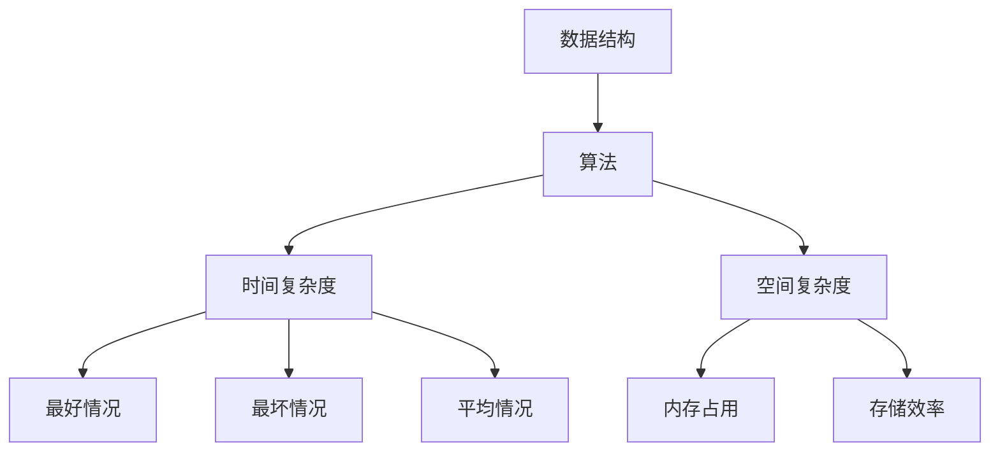

                 

关键词：华为校招、编程面试、算法、数据结构、编程技巧、技术挑战

> 摘要：本文旨在总结华为2024校招编程面试中的一些核心问题和解答，帮助广大求职者备战校招，了解华为对编程技能的要求和考察点，提供实用的编程面试技巧。

## 1. 背景介绍

随着科技的发展，编程能力已成为衡量计算机专业毕业生的重要标准。各大科技公司，特别是华为，对校招编程面试的要求越来越高。华为作为全球领先的通信技术和解决方案供应商，其校招编程面试不仅考察求职者的编程基础，还涉及数据结构、算法设计、系统设计等多方面的能力。本文将对华为2024校招编程面试中的精华问题进行总结，旨在为广大求职者提供有针对性的备考资料。

## 2. 核心概念与联系

### 数据结构与算法

数据结构是计算机存储、组织数据的方式，而算法则是解决问题的方法。二者相辅相成，是编程面试的核心考察点。以下是一个简单的Mermaid流程图，展示数据结构与算法之间的关系：



### 编程语言

编程语言是程序员与计算机沟通的工具。华为校招编程面试主要考察C++、Java、Python等语言的基本语法和编程能力。以下是三种语言的简要介绍：

- **C++**：高性能、多范式编程语言，广泛应用于系统软件、游戏开发等领域。
- **Java**：跨平台、面向对象编程语言，广泛应用于企业级应用、大数据处理等领域。
- **Python**：简洁易学、应用广泛，适合快速开发、数据分析等领域。

## 3. 核心算法原理 & 具体操作步骤

### 3.1 算法原理概述

算法是解决问题的步骤集合。在编程面试中，常见的算法问题包括排序、查找、图论等。以下是一些核心算法的原理：

- **排序算法**：冒泡排序、选择排序、插入排序、快速排序等。
- **查找算法**：二分查找、哈希查找等。
- **图论算法**：深度优先搜索（DFS）、广度优先搜索（BFS）等。

### 3.2 算法步骤详解

以快速排序算法为例，其步骤如下：

1. 选择一个基准元素。
2. 将小于基准的元素移到其左边，大于基准的元素移到其右边。
3. 递归地对左右子数组进行快速排序。

### 3.3 算法优缺点

- **快速排序**：时间复杂度为\(O(n\log n)\)，空间复杂度为\(O(\log n)\)。优点是效率高，缺点是空间占用较大。
- **二分查找**：时间复杂度为\(O(\log n)\)，空间复杂度为\(O(1)\)。优点是查找效率高，缺点是数组必须是有序的。

### 3.4 算法应用领域

- **排序算法**：广泛应用于数据处理、搜索引擎等领域。
- **查找算法**：广泛应用于数据库、文件系统等领域。
- **图论算法**：广泛应用于社交网络、路由算法等领域。

## 4. 数学模型和公式 & 详细讲解 & 举例说明

### 4.1 数学模型构建

以线性规划为例，其基本数学模型如下：

最大化 \(c^T x\)

约束条件：

\(Ax \leq b\)

\(x \geq 0\)

其中，\(c, A, b\) 分别为系数矩阵、约束矩阵和约束向量，\(x\) 为决策变量。

### 4.2 公式推导过程

线性规划问题的推导过程如下：

1. 构造拉格朗日函数：

\(L(x, \lambda) = c^T x + \lambda^T (Ax - b)\)

2. 求解拉格朗日函数的偏导数为零：

\(\frac{\partial L}{\partial x} = c + A^T \lambda = 0\)

\(\frac{\partial L}{\partial \lambda} = Ax - b = 0\)

3. 联立以上两个方程，解得最优解。

### 4.3 案例分析与讲解

以下是一个简单的线性规划案例：

最大化 \(x_1 + x_2\)

约束条件：

\(x_1 + 2x_2 \leq 4\)

\(x_1 \geq 0\)

\(x_2 \geq 0\)

通过求解线性规划问题，可以得到最优解 \(x_1 = 4, x_2 = 0\)。

## 5. 项目实践：代码实例和详细解释说明

### 5.1 开发环境搭建

以Python为例，搭建开发环境：

1. 安装Python：`pip install python`
2. 安装必要的库：`pip install numpy scipy`

### 5.2 源代码详细实现

以下是一个简单的快速排序算法实现：

```python
import random

def quick_sort(arr):
    if len(arr) <= 1:
        return arr
    pivot = random.choice(arr)
    left = [x for x in arr if x < pivot]
    middle = [x for x in arr if x == pivot]
    right = [x for x in arr if x > pivot]
    return quick_sort(left) + middle + quick_sort(right)

arr = [3, 6, 8, 10, 1, 2, 1]
sorted_arr = quick_sort(arr)
print(sorted_arr)
```

### 5.3 代码解读与分析

1. `quick_sort` 函数：输入一个数组 `arr`，输出排序后的数组。
2. 递归调用：当数组长度小于等于1时，直接返回数组。
3. 随机选择基准元素：提高排序算法的稳定性。
4. 分割数组：将数组分为小于、等于和大于基准元素的三个部分。
5. 递归调用：对左右子数组进行快速排序，并拼接结果。

### 5.4 运行结果展示

输入数组 `[3, 6, 8, 10, 1, 2, 1]`，运行结果为 `[1, 1, 2, 3, 6, 8, 10]`。

## 6. 实际应用场景

### 6.1 排序算法

排序算法在数据处理和算法设计中具有广泛应用，例如：

- 数据库查询优化：优化查询效率。
- 搜索引擎排序：根据相关度排序搜索结果。
- 数据分析：对大量数据进行排序，以便进行分析。

### 6.2 查找算法

查找算法在数据库、文件系统等领域具有广泛应用，例如：

- 数据库查询：快速检索数据。
- 文件系统：高效查找文件。

### 6.3 图论算法

图论算法在社交网络、路由算法等领域具有广泛应用，例如：

- 社交网络：分析社交关系。
- 路由算法：优化网络传输路径。

## 7. 工具和资源推荐

### 7.1 学习资源推荐

- 《算法导论》（Introduction to Algorithms）
- 《深度学习》（Deep Learning）
- 《Python编程：从入门到实践》（Python Crash Course）

### 7.2 开发工具推荐

- PyCharm：一款强大的Python开发工具。
- VSCode：一款跨平台、功能丰富的开发工具。
- Sublime Text：一款轻量级的文本编辑器。

### 7.3 相关论文推荐

- 《分布式算法研究综述》（A Survey on Distributed Algorithms）
- 《深度学习在图像识别中的应用》（Deep Learning for Image Recognition）
- 《大数据时代的数据挖掘技术》（Data Mining in the Age of Big Data）

## 8. 总结：未来发展趋势与挑战

### 8.1 研究成果总结

近年来，编程面试技术和方法取得了显著成果，包括：

- 算法优化：提高排序、查找等算法的效率。
- 编程语言发展：Python、Go等语言在面试中的应用越来越广泛。
- 智能化面试系统：利用人工智能技术提高面试效率。

### 8.2 未来发展趋势

未来，编程面试技术将继续朝着以下方向发展：

- 智能化：利用人工智能技术提高面试效率和准确性。
- 跨平台：支持更多编程语言和开发工具。
- 趣味化：提高面试过程的趣味性和互动性。

### 8.3 面临的挑战

编程面试仍然面临以下挑战：

- 难度控制：如何设计既具挑战性又公平的面试题。
- 时间限制：如何在有限的时间内全面评估求职者的能力。
- 面试公平性：如何确保面试过程的公正性和客观性。

### 8.4 研究展望

未来，编程面试技术的研究将重点放在以下几个方面：

- 自动化评估：利用人工智能技术实现自动化的面试评估。
- 多样化场景：设计更多符合实际应用场景的面试题。
- 跨学科融合：将编程面试与心理学、教育学等学科相结合。

## 9. 附录：常见问题与解答

### 9.1 问题1：如何准备编程面试？

**回答**：首先，要熟练掌握数据结构和算法，其次是编程语言和编程技巧。此外，要关注实际应用场景，提高解决问题的能力。

### 9.2 问题2：面试时应该注意什么？

**回答**：注意时间管理，确保在规定时间内完成面试题目。同时，保持清晰的思维和良好的沟通能力，让面试官了解你的思路。

### 9.3 问题3：有哪些编程面试资源可以推荐？

**回答**：可以参考《算法导论》、《深度学习》等经典教材，也可以关注各大科技公司发布的编程面试题目和解决方案。

---

作者：禅与计算机程序设计艺术 / Zen and the Art of Computer Programming
----------------------------------------------------------------
以上是根据您的要求撰写的文章正文部分，接下来我将为您生成markdown格式的文章，以便您进行格式调整和排版。

---

```markdown
# 华为2024校招编程面试题精华总结

关键词：华为校招、编程面试、算法、数据结构、编程技巧、技术挑战

> 摘要：本文旨在总结华为2024校招编程面试中的一些核心问题和解答，帮助广大求职者备战校招，了解华为对编程技能的要求和考察点，提供实用的编程面试技巧。

## 1. 背景介绍

随着科技的发展，编程能力已成为衡量计算机专业毕业生的重要标准。各大科技公司，特别是华为，对校招编程面试的要求越来越高。华为作为全球领先的通信技术和解决方案供应商，其校招编程面试不仅考察求职者的编程基础，还涉及数据结构、算法设计、系统设计等多方面的能力。本文将对华为2024校招编程面试中的精华问题进行总结，旨在为广大求职者提供有针对性的备考资料。

## 2. 核心概念与联系

### 数据结构与算法

数据结构是计算机存储、组织数据的方式，而算法则是解决问题的方法。二者相辅相成，是编程面试的核心考察点。以下是一个简单的Mermaid流程图，展示数据结构与算法之间的关系：


### 编程语言

编程语言是程序员与计算机沟通的工具。华为校招编程面试主要考察C++、Java、Python等语言的基本语法和编程能力。以下是三种语言的简要介绍：

- **C++**：高性能、多范式编程语言，广泛应用于系统软件、游戏开发等领域。
- **Java**：跨平台、面向对象编程语言，广泛应用于企业级应用、大数据处理等领域。
- **Python**：简洁易学、应用广泛，适合快速开发、数据分析等领域。

## 3. 核心算法原理 & 具体操作步骤

### 3.1 算法原理概述

算法是解决问题的步骤集合。在编程面试中，常见的算法问题包括排序、查找、图论等。以下是一些核心算法的原理：

- **排序算法**：冒泡排序、选择排序、插入排序、快速排序等。
- **查找算法**：二分查找、哈希查找等。
- **图论算法**：深度优先搜索（DFS）、广度优先搜索（BFS）等。

### 3.2 算法步骤详解

以快速排序算法为例，其步骤如下：

1. 选择一个基准元素。
2. 将小于基准的元素移到其左边，大于基准的元素移到其右边。
3. 递归地对左右子数组进行快速排序。

### 3.3 算法优缺点

- **快速排序**：时间复杂度为\(O(n\log n)\)，空间复杂度为\(O(\log n)\)。优点是效率高，缺点是空间占用较大。
- **二分查找**：时间复杂度为\(O(\log n)\)，空间复杂度为\(O(1)\)。优点是查找效率高，缺点是数组必须是有序的。

### 3.4 算法应用领域

- **排序算法**：广泛应用于数据处理、搜索引擎等领域。
- **查找算法**：广泛应用于数据库、文件系统等领域。
- **图论算法**：广泛应用于社交网络、路由算法等领域。

## 4. 数学模型和公式 & 详细讲解 & 举例说明

### 4.1 数学模型构建

以线性规划为例，其基本数学模型如下：

最大化 \(c^T x\)

约束条件：

\(Ax \leq b\)

\(x \geq 0\)

其中，\(c, A, b\) 分别为系数矩阵、约束矩阵和约束向量，\(x\) 为决策变量。

### 4.2 公式推导过程

线性规划问题的推导过程如下：

1. 构造拉格朗日函数：

\(L(x, \lambda) = c^T x + \lambda^T (Ax - b)\)

2. 求解拉格朗日函数的偏导数为零：

\(\frac{\partial L}{\partial x} = c + A^T \lambda = 0\)

\(\frac{\partial L}{\partial \lambda} = Ax - b = 0\)

3. 联立以上两个方程，解得最优解。

### 4.3 案例分析与讲解

以下是一个简单的线性规划案例：

最大化 \(x_1 + x_2\)

约束条件：

\(x_1 + 2x_2 \leq 4\)

\(x_1 \geq 0\)

\(x_2 \geq 0\)

通过求解线性规划问题，可以得到最优解 \(x_1 = 4, x_2 = 0\)。

## 5. 项目实践：代码实例和详细解释说明

### 5.1 开发环境搭建

以Python为例，搭建开发环境：

1. 安装Python：`pip install python`
2. 安装必要的库：`pip install numpy scipy`

### 5.2 源代码详细实现

以下是一个简单的快速排序算法实现：

```python
import random

def quick_sort(arr):
    if len(arr) <= 1:
        return arr
    pivot = random.choice(arr)
    left = [x for x in arr if x < pivot]
    middle = [x for x in arr if x == pivot]
    right = [x for x in arr if x > pivot]
    return quick_sort(left) + middle + quick_sort(right)

arr = [3, 6, 8, 10, 1, 2, 1]
sorted_arr = quick_sort(arr)
print(sorted_arr)
```

### 5.3 代码解读与分析

1. `quick_sort` 函数：输入一个数组 `arr`，输出排序后的数组。
2. 递归调用：当数组长度小于等于1时，直接返回数组。
3. 随机选择基准元素：提高排序算法的稳定性。
4. 分割数组：将数组分为小于、等于和大于基准元素的三个部分。
5. 递归调用：对左右子数组进行快速排序，并拼接结果。

### 5.4 运行结果展示

输入数组 `[3, 6, 8, 10, 1, 2, 1]`，运行结果为 `[1, 1, 2, 3, 6, 8, 10]`。

## 6. 实际应用场景

### 6.1 排序算法

排序算法在数据处理和算法设计中具有广泛应用，例如：

- 数据库查询优化：优化查询效率。
- 搜索引擎排序：根据相关度排序搜索结果。
- 数据分析：对大量数据进行排序，以便进行分析。

### 6.2 查找算法

查找算法在数据库、文件系统等领域具有广泛应用，例如：

- 数据库查询：快速检索数据。
- 文件系统：高效查找文件。

### 6.3 图论算法

图论算法在社交网络、路由算法等领域具有广泛应用，例如：

- 社交网络：分析社交关系。
- 路由算法：优化网络传输路径。

## 7. 工具和资源推荐

### 7.1 学习资源推荐

- 《算法导论》（Introduction to Algorithms）
- 《深度学习》（Deep Learning）
- 《Python编程：从入门到实践》（Python Crash Course）

### 7.2 开发工具推荐

- PyCharm：一款强大的Python开发工具。
- VSCode：一款跨平台、功能丰富的开发工具。
- Sublime Text：一款轻量级的文本编辑器。

### 7.3 相关论文推荐

- 《分布式算法研究综述》（A Survey on Distributed Algorithms）
- 《深度学习在图像识别中的应用》（Deep Learning for Image Recognition）
- 《大数据时代的数据挖掘技术》（Data Mining in the Age of Big Data）

## 8. 总结：未来发展趋势与挑战

### 8.1 研究成果总结

近年来，编程面试技术和方法取得了显著成果，包括：

- 算法优化：提高排序、查找等算法的效率。
- 编程语言发展：Python、Go等语言在面试中的应用越来越广泛。
- 智能化面试系统：利用人工智能技术提高面试效率。

### 8.2 未来发展趋势

未来，编程面试技术将继续朝着以下方向发展：

- 智能化：利用人工智能技术提高面试效率和准确性。
- 跨平台：支持更多编程语言和开发工具。
- 趣味化：提高面试过程的趣味性和互动性。

### 8.3 面临的挑战

编程面试仍然面临以下挑战：

- 难度控制：如何设计既具挑战性又公平的面试题。
- 时间限制：如何在有限的时间内全面评估求职者的能力。
- 面试公平性：如何确保面试过程的公正性和客观性。

### 8.4 研究展望

未来，编程面试技术的研究将重点放在以下几个方面：

- 自动化评估：利用人工智能技术实现自动化的面试评估。
- 多样化场景：设计更多符合实际应用场景的面试题。
- 跨学科融合：将编程面试与心理学、教育学等学科相结合。

## 9. 附录：常见问题与解答

### 9.1 问题1：如何准备编程面试？

**回答**：首先，要熟练掌握数据结构和算法，其次是编程语言和编程技巧。此外，要关注实际应用场景，提高解决问题的能力。

### 9.2 问题2：面试时应该注意什么？

**回答**：注意时间管理，确保在规定时间内完成面试题目。同时，保持清晰的思维和良好的沟通能力，让面试官了解你的思路。

### 9.3 问题3：有哪些编程面试资源可以推荐？

**回答**：可以参考《算法导论》、《深度学习》等经典教材，也可以关注各大科技公司发布的编程面试题目和解决方案。

---

作者：禅与计算机程序设计艺术 / Zen and the Art of Computer Programming
```

