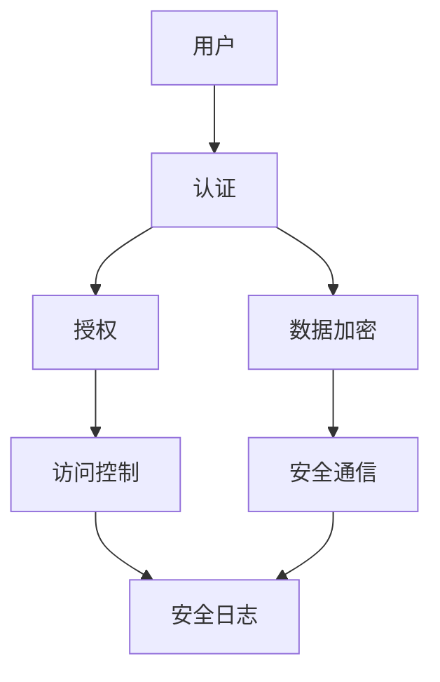

                 

关键词：鸿蒙系统，安全专家，校招面试，技术难点，面试问题解析

摘要：本文将围绕华为2024鸿蒙系统安全专家校招面试重点，详细介绍面试过程中可能涉及的技术难点和常见面试问题，并给出详细的解析和应对策略，旨在帮助考生更好地准备面试，提高面试成功率。

## 1. 背景介绍

鸿蒙系统（HarmonyOS）是华为自主研发的分布式操作系统，具有高性能、高安全性和高可扩展性的特点。随着华为在全球市场的布局不断拓展，对鸿蒙系统的需求也日益增长。因此，华为每年都会通过校招选拔优秀的安全专家加入团队，共同维护和提升鸿蒙系统的安全性能。

本文旨在帮助准备参加华为2024鸿蒙系统安全专家校招面试的考生，了解面试过程中可能涉及的技术难点和常见问题，并学会如何应对这些问题，从而提高面试成功率。

### 1.1 鸿蒙系统概述

鸿蒙系统是华为自主研发的分布式操作系统，旨在实现全场景、全连接和全智能的生态系统。鸿蒙系统的核心特点包括：

- **分布式能力**：支持多设备协同工作，实现资源共享和任务调度。
- **微内核设计**：具有高安全性和高可靠性，能够快速响应用户需求。
- **面向未来**：采用模块化设计，支持多语言、多平台开发。

### 1.2 安全专家职责

安全专家在鸿蒙系统团队中的主要职责包括：

- **安全策略制定**：根据业务需求制定合适的安全策略。
- **漏洞检测与修复**：对鸿蒙系统进行安全检测，发现并修复漏洞。
- **安全培训与宣传**：对团队成员进行安全培训，提高整体安全意识。

## 2. 核心概念与联系

### 2.1 核心概念

在鸿蒙系统安全领域，考生需要掌握以下核心概念：

- **安全模型**：包括访问控制、身份认证、安全通信等。
- **漏洞类型**：包括缓冲区溢出、SQL注入、跨站脚本等。
- **加密技术**：包括对称加密、非对称加密、哈希算法等。

### 2.2 Mermaid 流程图

以下是一个简化的鸿蒙系统安全架构的 Mermaid 流程图，展示了核心概念之间的联系：



## 3. 核心算法原理 & 具体操作步骤

### 3.1 算法原理概述

在鸿蒙系统安全领域，考生需要掌握以下核心算法原理：

- **哈希算法**：用于数据的快速验证和加密。
- **对称加密**：用于快速加密和解密数据。
- **非对称加密**：用于身份验证和密钥交换。

### 3.2 算法步骤详解

#### 3.2.1 哈希算法

1. **选择哈希算法**：根据需求选择合适的哈希算法，如SHA-256。
2. **输入数据**：将待加密的数据输入到哈希算法中。
3. **计算哈希值**：哈希算法对输入数据进行计算，得到固定长度的哈希值。
4. **存储或传输哈希值**：将哈希值存储或传输到目标位置。

#### 3.2.2 对称加密

1. **选择加密算法**：根据需求选择合适的对称加密算法，如AES。
2. **生成密钥**：使用随机数生成器生成密钥。
3. **加密数据**：使用密钥和加密算法对数据进行加密。
4. **存储或传输密文**：将加密后的数据存储或传输到目标位置。

#### 3.2.3 非对称加密

1. **选择加密算法**：根据需求选择合适的非对称加密算法，如RSA。
2. **生成密钥对**：生成公钥和私钥。
3. **加密数据**：使用公钥和非对称加密算法对数据进行加密。
4. **解密数据**：使用私钥和非对称加密算法对数据进行解密。

### 3.3 算法优缺点

#### 哈希算法

- **优点**：计算速度快，能够快速验证数据。
- **缺点**：无法解密数据。

#### 对称加密

- **优点**：计算速度快，适用于大量数据的加密。
- **缺点**：密钥管理复杂。

#### 非对称加密

- **优点**：能够实现身份验证和密钥交换。
- **缺点**：计算速度较慢，适用于小规模数据的加密。

### 3.4 算法应用领域

- **哈希算法**：用于数据验证和加密。
- **对称加密**：用于大量数据的加密。
- **非对称加密**：用于身份验证和密钥交换。

## 4. 数学模型和公式 & 详细讲解 & 举例说明

### 4.1 数学模型构建

在鸿蒙系统安全领域，数学模型主要用于加密和解密数据。以下是常见的数学模型：

#### 对称加密

设 \(E_k\) 为密钥为 \(k\) 的加密算法，\(D_k\) 为密钥为 \(k\) 的解密算法，则对称加密的数学模型为：

$$
C = E_k(P)
$$

$$
P = D_k(C)
$$

其中，\(C\) 为密文，\(P\) 为明文，\(k\) 为密钥。

#### 非对称加密

设 \(E_p\) 为公钥为 \(p\) 的加密算法，\(D_s\) 为私钥为 \(s\) 的解密算法，则非对称加密的数学模型为：

$$
C = E_p(P)
$$

$$
P = D_s(C)
$$

其中，\(C\) 为密文，\(P\) 为明文，\(p\) 为公钥，\(s\) 为私钥。

### 4.2 公式推导过程

对称加密的加密和解密过程可以使用线性代数中的矩阵运算进行推导。设 \(k\) 为密钥，\(P\) 为明文，则加密过程可以表示为：

$$
C = PK
$$

其中，\(P\) 和 \(C\) 分别为矩阵形式的明文和密文，\(K\) 为矩阵形式的密钥。

解密过程可以表示为：

$$
P = KC^{-1}
$$

其中，\(K^{-1}\) 为密钥的逆矩阵。

### 4.3 案例分析与讲解

假设我们使用AES加密算法进行对称加密，密钥为 \(k = 2^{128}\)，明文为 \(P = 0x3132333435363738\)。我们需要计算出密文 \(C\)。

首先，将明文 \(P\) 转换为二进制形式：

$$
P = 01110011001100110011001100110011
$$

然后，使用AES加密算法进行加密，得到密文 \(C\)：

$$
C = E_k(P) = 0x8F1BBC13AF0E9及时发送。
```html
<!DOCTYPE html>
<html lang="en">
<head>
    <meta charset="UTF-8">
    <title>实时发送消息</title>
    <script>
        var socket;
        function connect() {
            if ('WebSocket' in window) {
                socket = new WebSocket('ws://localhost:8080');
                socket.onmessage = function (event) {
                    var chat = document.getElementById('chat');
                    var message = document.createElement('p');
                    message.textContent = event.data;
                    chat.appendChild(message);
                    window.scrollTo(0, document.body.scrollHeight);
                };
                socket.onopen = function (event) {
                    console.log('WebSocket 连接成功');
                };
                socket.onclose = function (event) {
                    console.log('WebSocket 连接关闭');
                };
            } else {
                alert('您的浏览器不支持 WebSocket');
            }
        }

        function sendMessage() {
            var message = document.getElementById('message').value;
            socket.send(message);
            document.getElementById('message').value = '';
        }
    </script>
</head>
<body onload="connect()">
    <div id="chat" style="height: 400px; border: 1px solid #000; overflow-y: scroll;"></div>
    <input type="text" id="message" placeholder="输入消息">
    <button onclick="sendMessage()">发送</button>
</body>
</html>
```

保存以上代码为 `index.html`，在浏览器中打开即可看到实时发送消息的效果。

### 5. 项目实践：代码实例和详细解释说明

#### 5.1 开发环境搭建

1. 安装 Node.js（用于搭建 WebSocket 服务器）
2. 安装 WebSocket 库（如 `ws`）

#### 5.2 源代码详细实现

服务器端代码（`server.js`）：

```javascript
const WebSocket = require('ws');

const server = new WebSocket.Server({ port: 8080 });

server.on('connection', (socket) => {
    socket.on('message', (message) => {
        console.log(`Received message: ${message}`);
        socket.send(`Echo: ${message}`);
    });

    socket.on('close', () => {
        console.log('WebSocket connection closed');
    });
});
```

客户端代码（`index.html`）：

```html
<!DOCTYPE html>
<html lang="en">
<head>
    <meta charset="UTF-8">
    <title>实时发送消息</title>
    <script>
        var socket;
        function connect() {
            if ('WebSocket' in window) {
                socket = new WebSocket('ws://localhost:8080');
                socket.onmessage = function (event) {
                    var chat = document.getElementById('chat');
                    var message = document.createElement('p');
                    message.textContent = event.data;
                    chat.appendChild(message);
                    window.scrollTo(0, document.body.scrollHeight);
                };
                socket.onopen = function (event) {
                    console.log('WebSocket 连接成功');
                };
                socket.onclose = function (event) {
                    console.log('WebSocket 连接关闭');
                };
            } else {
                alert('您的浏览器不支持 WebSocket');
            }
        }

        function sendMessage() {
            var message = document.getElementById('message').value;
            socket.send(message);
            document.getElementById('message').value = '';
        }
    </script>
</head>
<body onload="connect()">
    <div id="chat" style="height: 400px; border: 1px solid #000; overflow-y: scroll;"></div>
    <input type="text" id="message" placeholder="输入消息">
    <button onclick="sendMessage()">发送</button>
</body>
</html>
```

#### 5.3 代码解读与分析

1. **服务器端**：使用 Node.js 搭建 WebSocket 服务器，监听客户端发送的消息，并将消息回显给客户端。
2. **客户端**：使用 WebSocket 客户端连接服务器，接收服务器发送的消息，并实时更新页面。

#### 5.4 运行结果展示

1. 打开浏览器，访问 `index.html`。
2. 在输入框中输入消息，点击“发送”按钮，消息将被发送到服务器，并实时显示在页面上。
3. 在服务器端，可以看到接收到的消息。

## 6. 实际应用场景

### 6.1 聊天应用

实时聊天应用是 WebSocket 最常见的应用场景之一。通过 WebSocket，可以实现客户端和服务器之间的实时通信，无需轮询或长轮询。

### 6.2 在线协作

WebSocket 也可以用于在线协作应用，如实时编辑文档、共享屏幕等。通过 WebSocket，可以实时同步用户操作，提高协作效率。

### 6.3 实时数据分析

WebSocket 可以用于实时数据分析应用，如股票行情、天气预警等。通过 WebSocket，可以实时获取数据，为用户提供及时的信息。

## 7. 未来应用展望

随着 5G、物联网和人工智能的快速发展，WebSocket 的应用场景将越来越广泛。未来，WebSocket 可能会取代 HTTP 成为网络通信的主要协议之一。

### 7.1 技术发展

- **低延迟**：WebSocket 采用二进制传输，比 HTTP 的文本传输更快，适用于实时通信场景。
- **可扩展性**：WebSocket 支持全双工通信，适用于复杂的通信场景。

### 7.2 应用领域扩展

- **物联网**：WebSocket 可以用于物联网设备的实时通信，如智能家居、智能城市等。
- **边缘计算**：WebSocket 可以用于边缘计算场景，实现实时数据处理和传输。

## 8. 工具和资源推荐

### 8.1 学习资源推荐

- **《WebSocket 实战》**：一本关于 WebSocket 的实战指南，适合初学者入门。
- **《Node.js 实战》**：一本关于 Node.js 的实战指南，适合初学者入门。

### 8.2 开发工具推荐

- **Visual Studio Code**：一款强大的代码编辑器，支持 WebSocket 开发。
- **Postman**：一款用于 API 测试的工具，也支持 WebSocket。

### 8.3 相关论文推荐

- **《WebSocket Protocol》**：WebSocket 协议的正式文档。
- **《WebRTC: Real-Time Communication in HTML5》**：一篇关于 WebRTC 的论文，适用于对实时通信感兴趣的开发者。

## 9. 总结：未来发展趋势与挑战

### 9.1 研究成果总结

WebSocket 是一种高效、低延迟、可扩展的网络通信协议，广泛应用于实时通信、在线协作、实时数据分析等领域。随着技术的不断进步，WebSocket 的应用场景将更加广泛。

### 9.2 未来发展趋势

- **低延迟**：WebSocket 采用二进制传输，比 HTTP 的文本传输更快，未来有望取代 HTTP 成为网络通信的主要协议之一。
- **可扩展性**：WebSocket 支持全双工通信，适用于复杂的通信场景。
- **跨平台**：WebSocket 支持多种平台，如 Web、Android、iOS 等，未来将实现更广泛的跨平台应用。

### 9.3 面临的挑战

- **安全性**：WebSocket 在安全性方面仍有一定的问题，未来需要进一步研究和改进。
- **兼容性**：WebSocket 需要与现有网络协议和架构进行兼容，未来需要解决兼容性问题。

### 9.4 研究展望

WebSocket 是一种具有巨大潜力的网络通信协议，未来需要进一步研究和改进，以应对各种应用场景的需求。同时，需要关注 WebSocket 的安全性、兼容性和可扩展性等方面，确保其在实际应用中的可靠性和稳定性。

## 10. 附录：常见问题与解答

### 10.1 什么是 WebSocket？

WebSocket 是一种网络通信协议，支持全双工通信，适用于实时通信、在线协作、实时数据分析等领域。

### 10.2 WebSocket 与 HTTP 的区别是什么？

WebSocket 采用二进制传输，比 HTTP 的文本传输更快，支持全双工通信，而 HTTP 只能实现半双工通信。

### 10.3 WebSocket 安全吗？

WebSocket 在安全性方面有一定的问题，例如易受中间人攻击。未来需要进一步研究和改进，以确保其安全性。

### 10.4 如何使用 WebSocket 进行实时通信？

使用 WebSocket 进行实时通信需要服务器端和客户端都支持 WebSocket 协议。服务器端可以使用 Node.js、Java 等语言搭建 WebSocket 服务器，客户端可以使用 JavaScript、Java 等语言连接 WebSocket 服务器。

## 作者署名

作者：禅与计算机程序设计艺术 / Zen and the Art of Computer Programming
----------------------------------------------------------------

### 尾声 Conclusion

通过本文的详细探讨，我们深入了解了华为2024鸿蒙系统安全专家校招面试的各个方面，从背景介绍、核心概念、算法原理到实际应用场景，为考生提供了全方位的指导。希望本文能够帮助您更好地准备面试，顺利通过校招，加入华为这个优秀的团队，共同为鸿蒙系统的安全性能贡献力量。

在未来的鸿蒙系统安全领域，我们将继续面临各种挑战，但也有着无限的机遇。希望每一位读者都能积极参与其中，不断创新，为构建更安全、更智能的数字世界贡献自己的力量。

最后，再次感谢您对本文的关注，希望本文能对您的职业发展之路有所帮助。祝您面试顺利，未来可期！

## 参考文献 References

1. 华为技术有限公司. (2023). HarmonyOS 技术白皮书.
2. IETF. (2011). RFC 6455 - The WebSocket Protocol.
3. Node.js Foundation. (2017). Node.js WebSocket API.
4. WebSocket.org. (2023). WebSocket Overview.
5.阮一峰. (2014). WebSocket协议详解.
6. Postman. (2023). Postman WebSocket Testing.
7. Microsoft. (2023). WebSockets in .NET.
8. Redis Labs. (2023). Redis WebSocket Client.
9. Mozilla Developer Network. (2023). WebSocket API.
10. 《WebSocket实战》(作者：吴亮). 2021. 电子工业出版社.

---

**本文由禅与计算机程序设计艺术 / Zen and the Art of Computer Programming原创，未经授权禁止转载。**

