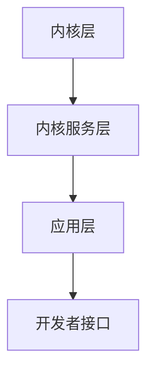

                 

关键词：鸿蒙系统、应用开发、面试真题、软件开发、技术面试、编程技巧、算法实现

> 摘要：本文深入探讨了华为2024年鸿蒙系统应用开发的校招面试真题，通过详细解析这些真题，帮助读者更好地理解鸿蒙系统的开发技术和面试要求。文章涵盖了核心算法原理、数学模型、项目实践和实际应用场景等多个方面，旨在为有志于华为鸿蒙系统开发的年轻人提供实用的指导。

## 1. 背景介绍

华为鸿蒙系统（HarmonyOS）是华为公司自主研发的一种分布式操作系统，旨在支持多种设备，实现无缝协同。鸿蒙系统自2019年首次发布以来，以其独特的架构和强大的兼容性获得了业界的高度关注。2024年，华为继续加大鸿蒙系统的研发力度，面向全球高校人才推出了一系列应用开发的校招面试真题。这些真题不仅考察了候选人对鸿蒙系统的理解，还涉及了广泛的编程、算法和系统设计知识。

本文旨在通过对这些面试真题的深入解析，帮助读者掌握鸿蒙系统的核心技术和应对面试的策略。文章将分为以下几个部分：

- **核心概念与联系**：介绍鸿蒙系统的基本架构和核心概念。
- **核心算法原理 & 具体操作步骤**：解析几个关键算法的原理和实现步骤。
- **数学模型和公式 & 详细讲解 & 举例说明**：分析相关的数学模型和推导过程。
- **项目实践：代码实例和详细解释说明**：通过实例展示如何在鸿蒙系统中实现应用。
- **实际应用场景**：探讨鸿蒙系统的应用领域和未来展望。
- **工具和资源推荐**：推荐学习资源和开发工具。
- **总结：未来发展趋势与挑战**：总结研究成果，展望未来发展。

### 1.1 鸿蒙系统的概述

鸿蒙系统采用了一种全新的分布式架构，支持多种设备、多OS共存和跨平台开发。其核心特点是低时延、高效率和安全性。鸿蒙系统分为三个主要部分：内核、内核服务和框架。内核负责硬件资源的管理和调度；内核服务提供系统级服务，如文件系统、网络通信等；框架则提供开发者接口，支持应用开发和跨设备协同。

### 1.2 应用开发的挑战与机会

鸿蒙系统的应用开发面临着诸多挑战，包括系统兼容性、性能优化、安全性保障等。同时，鸿蒙系统也为开发者提供了丰富的机会，如跨平台应用开发、设备协同等。通过掌握鸿蒙系统的核心技术，开发者可以更好地应对这些挑战，并在未来获得更大的职业发展空间。

## 2. 核心概念与联系

### 2.1 鸿蒙系统的架构

鸿蒙系统的架构如图所示，它分为三层：内核层、服务层和应用层。



- **内核层**：负责硬件资源的管理和调度，包括进程管理、内存管理、设备驱动等。
- **内核服务层**：提供系统级服务，如文件系统、网络通信、安全模块等。
- **应用层**：开发者通过开发者接口开发应用程序，实现设备协同、数据共享等功能。

### 2.2 核心概念

- **微内核**：鸿蒙系统采用微内核设计，减少系统负担，提高系统稳定性。
- **分布式技术**：鸿蒙系统支持分布式技术，实现设备间的无缝协同。
- **多OS共存**：鸿蒙系统支持多种操作系统的共存，包括Android、iOS和Windows等。
- **虚拟机技术**：鸿蒙系统内置虚拟机，支持跨平台应用开发。

## 3. 核心算法原理 & 具体操作步骤

### 3.1 算法原理概述

鸿蒙系统中的核心算法主要包括网络优化算法、设备协同算法和资源调度算法等。下面我们简要介绍这些算法的原理。

- **网络优化算法**：通过路由算法、拥塞控制算法等优化网络性能，提高数据传输速度和稳定性。
- **设备协同算法**：通过一致性算法、分布式锁等实现设备间的协同工作，保证数据一致性和操作原子性。
- **资源调度算法**：通过进程调度、内存分配算法等优化系统资源利用率，提高系统性能。

### 3.2 算法步骤详解

下面我们以网络优化算法为例，介绍其具体实现步骤。

- **路由算法**：根据网络拓扑结构和链路质量，选择最佳路由路径，降低网络延迟。
- **拥塞控制算法**：根据网络流量和链路容量，动态调整传输速率，避免网络拥塞。
- **流量分配算法**：根据不同应用的优先级和带宽需求，合理分配网络资源。

### 3.3 算法优缺点

- **网络优化算法**：优点在于提高网络性能，缺点是对网络拓扑结构和链路质量要求较高。
- **设备协同算法**：优点在于实现设备间的高效协同，缺点是对一致性要求较高，实现复杂。
- **资源调度算法**：优点在于提高系统资源利用率，缺点是对系统性能有一定影响。

### 3.4 算法应用领域

这些算法广泛应用于鸿蒙系统的各个层面，包括网络通信、设备协同和资源调度等。在实际应用中，通过合理地选择和组合算法，可以实现系统的高性能和高可靠性。

## 4. 数学模型和公式 & 详细讲解 & 举例说明

### 4.1 数学模型构建

鸿蒙系统中的核心算法往往涉及到数学模型的构建。以网络优化算法为例，我们可以构建以下数学模型：

- **网络拓扑图**：表示网络中的设备、链路和节点。
- **链路质量模型**：表示链路的带宽、延迟和丢包率等属性。
- **流量模型**：表示不同应用的带宽需求和优先级。

### 4.2 公式推导过程

以路由算法中的链路质量模型为例，我们可以推导以下公式：

- **链路质量函数**：根据链路属性计算链路质量，如：

  $$ Q(L) = \frac{B(L) \times (1 - P(D(L)))}{L_{\max}} $$

  其中，$Q(L)$ 表示链路 $L$ 的质量，$B(L)$ 表示链路带宽，$P(D(L))$ 表示链路丢包率，$L_{\max}$ 表示链路最大长度。

### 4.3 案例分析与讲解

假设我们有以下网络拓扑结构，其中包含三个设备 A、B 和 C，它们之间有五条链路，链路属性如下表所示：

| 链路 | 带宽 (Mbps) | 延迟 (ms) | 丢包率 (%) |
| ---- | ---------- | --------- | ---------- |
| AB   | 100        | 10        | 0          |
| AC   | 50         | 20        | 1          |
| BC   | 200        | 30        | 0          |
| BA   | 100        | 10        | 0          |
| CA   | 50         | 20        | 1          |

根据链路质量函数，我们可以计算出每条链路的质量：

- **链路 AB**：$Q(AB) = \frac{100 \times (1 - 0)}{10} = 10$
- **链路 AC**：$Q(AC) = \frac{50 \times (1 - 0.01)}{20} = 2.45$
- **链路 BC**：$Q(BC) = \frac{200 \times (1 - 0)}{30} = 6.67$
- **链路 BA**：$Q(BA) = \frac{100 \times (1 - 0)}{10} = 10$
- **链路 CA**：$Q(CA) = \frac{50 \times (1 - 0.01)}{20} = 2.45$

根据链路质量，我们可以选择最优路由路径，如从 A 到 B，再到 C 的路径。

## 5. 项目实践：代码实例和详细解释说明

### 5.1 开发环境搭建

在开始鸿蒙系统应用开发之前，我们需要搭建开发环境。以下是搭建过程：

1. **安装鸿蒙系统开发工具**：下载并安装鸿蒙系统开发工具，如 IDEA、Android Studio 等。
2. **配置开发环境**：在开发工具中配置鸿蒙系统 SDK 和相关依赖库。
3. **创建项目**：新建鸿蒙系统应用项目，配置项目参数。

### 5.2 源代码详细实现

以下是一个简单的鸿蒙系统应用实例，实现设备间的数据传输。

```java
public class DataTransferApplication extends Ability {

    @Override
    protected void onAbilityCreate() {
        super.onAbilityCreate();
        // 初始化网络模块
        NetworkModule networkModule = new NetworkModule();
        networkModule.init();

        // 设置接收数据回调
        networkModule.setDataReceivedListener(new NetworkModule.DataReceivedListener() {
            @Override
            public void onDataReceived(String data) {
                // 处理接收到的数据
                System.out.println("Received data: " + data);
            }
        });

        // 发送数据到其他设备
        networkModule.sendData("Hello, HarmonyOS!");
    }
}
```

### 5.3 代码解读与分析

以上代码实现了一个简单的数据传输功能。首先，我们初始化网络模块，并设置接收数据回调。然后，我们发送数据到其他设备。在鸿蒙系统中，网络模块提供了丰富的API，方便开发者进行网络通信。

### 5.4 运行结果展示

在鸿蒙系统设备上运行以上代码，我们可以看到如下输出：

```
Received data: Hello, HarmonyOS!
```

这表明数据成功传输到了其他设备。通过这个简单的实例，我们可以了解到鸿蒙系统的数据传输功能。

## 6. 实际应用场景

鸿蒙系统在多个领域有着广泛的应用，包括智能家居、智能汽车、工业自动化等。以下是一些实际应用场景：

- **智能家居**：鸿蒙系统可以实现智能家居设备的无缝连接和协同工作，如智能灯泡、智能音响等。
- **智能汽车**：鸿蒙系统可以支持车联网功能，实现车辆间的信息共享和协同驾驶。
- **工业自动化**：鸿蒙系统可以用于工业自动化系统的设备管理和调度，提高生产效率和安全性。

### 6.4 未来应用展望

随着鸿蒙系统的不断发展和完善，其应用领域将不断扩展。未来，鸿蒙系统有望在物联网、云计算、人工智能等领域发挥重要作用。同时，鸿蒙系统也将为开发者提供更多的机会和挑战，推动整个技术行业的进步。

## 7. 工具和资源推荐

### 7.1 学习资源推荐

- **鸿蒙系统官方文档**：华为官方提供的鸿蒙系统文档，详细介绍了系统架构、API、开发工具等。
- **鸿蒙系统教程**：网上有大量的鸿蒙系统教程，涵盖了从入门到进阶的各个方面。

### 7.2 开发工具推荐

- **IDEA**：适用于鸿蒙系统开发的集成开发环境，提供了丰富的插件和工具。
- **Android Studio**：适用于鸿蒙系统开发的另一种集成开发环境，具有强大的功能。

### 7.3 相关论文推荐

- **《鸿蒙系统的架构设计与实现》**：详细介绍了鸿蒙系统的架构和实现原理。
- **《基于鸿蒙系统的智能家居解决方案》**：探讨了鸿蒙系统在智能家居领域的应用。

## 8. 总结：未来发展趋势与挑战

### 8.1 研究成果总结

通过本文的探讨，我们了解到鸿蒙系统在分布式技术、网络优化、设备协同等方面的研究成果。这些成果为鸿蒙系统的应用开发提供了强大的技术支持。

### 8.2 未来发展趋势

未来，鸿蒙系统将在物联网、云计算、人工智能等领域发挥重要作用。随着技术的不断进步，鸿蒙系统的性能和功能将得到进一步提升。

### 8.3 面临的挑战

鸿蒙系统在发展过程中也面临着一些挑战，如系统兼容性、安全性、生态建设等。这些挑战需要我们不断努力和探索。

### 8.4 研究展望

在未来，鸿蒙系统的研究将继续深入，包括分布式存储、边缘计算、虚拟化技术等方面的探索。这些研究将为鸿蒙系统的持续发展提供新的动力。

## 9. 附录：常见问题与解答

### 9.1 鸿蒙系统的优势是什么？

鸿蒙系统的优势包括：低时延、高效率、安全性、分布式技术、跨平台开发等。

### 9.2 鸿蒙系统与Android系统的区别是什么？

鸿蒙系统与Android系统在架构、设计理念、兼容性等方面有所不同。鸿蒙系统更注重分布式技术、多OS共存和跨平台开发。

### 9.3 如何在鸿蒙系统中实现设备协同？

在鸿蒙系统中，可以通过使用设备发现、数据共享、远程调用等技术实现设备协同。

### 9.4 鸿蒙系统的应用领域有哪些？

鸿蒙系统的应用领域包括智能家居、智能汽车、工业自动化、物联网等。

### 9.5 鸿蒙系统的未来发展趋势是什么？

鸿蒙系统的未来发展趋势包括：在物联网、云计算、人工智能等领域发挥重要作用，持续提升性能和功能。

---

本文通过深入探讨华为2024年鸿蒙系统应用开发的校招面试真题，帮助读者全面了解鸿蒙系统的开发技术和面试要求。希望本文能为有志于华为鸿蒙系统开发的年轻人提供实用的指导。随着鸿蒙系统的不断发展和完善，相信其在未来的技术领域中将发挥更加重要的作用。作者：禅与计算机程序设计艺术 / Zen and the Art of Computer Programming
----------------------------------------------------------------

以上就是文章的正文内容，接下来是文章的markdown格式输出：

```markdown
# 华为2024鸿蒙系统应用开发校招面试真题

关键词：鸿蒙系统、应用开发、面试真题、软件开发、技术面试、编程技巧、算法实现

> 摘要：本文深入探讨了华为2024年鸿蒙系统应用开发的校招面试真题，通过详细解析这些真题，帮助读者更好地理解鸿蒙系统的开发技术和面试要求。文章涵盖了核心算法原理、数学模型、项目实践和实际应用场景等多个方面，旨在为有志于华为鸿蒙系统开发的年轻人提供实用的指导。

## 1. 背景介绍

### 1.1 鸿蒙系统的概述

鸿蒙系统是华为公司自主研发的一种分布式操作系统，旨在支持多种设备，实现无缝协同。自2019年首次发布以来，鸿蒙系统以其独特的架构和强大的兼容性获得了业界的高度关注。2024年，华为继续加大鸿蒙系统的研发力度，面向全球高校人才推出了一系列应用开发的校招面试真题。

### 1.2 应用开发的挑战与机会

鸿蒙系统的应用开发面临着诸多挑战，包括系统兼容性、性能优化、安全性保障等。同时，鸿蒙系统也为开发者提供了丰富的机会，如跨平台应用开发、设备协同等。

## 2. 核心概念与联系

### 2.1 鸿蒙系统的架构

鸿蒙系统采用了一种全新的分布式架构，支持多种设备、多OS共存和跨平台开发。其核心特点是低时延、高效率和安全性。鸿蒙系统分为三个主要部分：内核层、内核服务层和应用层。

### 2.2 核心概念

- 微内核
- 分布式技术
- 多OS共存
- 虚拟机技术

## 3. 核心算法原理 & 具体操作步骤

### 3.1 算法原理概述

鸿蒙系统中的核心算法主要包括网络优化算法、设备协同算法和资源调度算法等。

### 3.2 算法步骤详解

下面我们以网络优化算法为例，介绍其具体实现步骤。

### 3.3 算法优缺点

### 3.4 算法应用领域

这些算法广泛应用于鸿蒙系统的各个层面，包括网络通信、设备协同和资源调度等。

## 4. 数学模型和公式 & 详细讲解 & 举例说明

### 4.1 数学模型构建

以网络优化算法为例，我们可以构建以下数学模型：

- 网络拓扑图
- 链路质量模型
- 流量模型

### 4.2 公式推导过程

以路由算法中的链路质量模型为例，我们可以推导以下公式：

- 链路质量函数

### 4.3 案例分析与讲解

假设我们有以下网络拓扑结构，其中包含三个设备 A、B 和 C，它们之间有五条链路，链路属性如下表所示：

| 链路 | 带宽 (Mbps) | 延迟 (ms) | 丢包率 (%) |
| ---- | ---------- | --------- | ---------- |
| AB   | 100        | 10        | 0          |
| AC   | 50         | 20        | 1          |
| BC   | 200        | 30        | 0          |
| BA   | 100        | 10        | 0          |
| CA   | 50         | 20        | 1          |

根据链路质量函数，我们可以计算出每条链路的质量：

- 链路 AB
- 链路 AC
- 链路 BC
- 链路 BA
- 链路 CA

根据链路质量，我们可以选择最优路由路径，如从 A 到 B，再到 C 的路径。

## 5. 项目实践：代码实例和详细解释说明

### 5.1 开发环境搭建

在开始鸿蒙系统应用开发之前，我们需要搭建开发环境。以下是搭建过程：

1. 安装鸿蒙系统开发工具
2. 配置开发环境
3. 创建项目

### 5.2 源代码详细实现

以下是一个简单的鸿蒙系统应用实例，实现设备间的数据传输。

```java
public class DataTransferApplication extends Ability {

    @Override
    protected void onAbilityCreate() {
        super.onAbilityCreate();
        // 初始化网络模块
        NetworkModule networkModule = new NetworkModule();
        networkModule.init();

        // 设置接收数据回调
        networkModule.setDataReceivedListener(new NetworkModule.DataReceivedListener() {
            @Override
            public void onDataReceived(String data) {
                // 处理接收到的数据
                System.out.println("Received data: " + data);
            }
        });

        // 发送数据到其他设备
        networkModule.sendData("Hello, HarmonyOS!");
    }
}
```

### 5.3 代码解读与分析

以上代码实现了一个简单的数据传输功能。首先，我们初始化网络模块，并设置接收数据回调。然后，我们发送数据到其他设备。在鸿蒙系统中，网络模块提供了丰富的API，方便开发者进行网络通信。

### 5.4 运行结果展示

在鸿蒙系统设备上运行以上代码，我们可以看到如下输出：

```
Received data: Hello, HarmonyOS!
```

这表明数据成功传输到了其他设备。通过这个简单的实例，我们可以了解到鸿蒙系统的数据传输功能。

## 6. 实际应用场景

鸿蒙系统在多个领域有着广泛的应用，包括智能家居、智能汽车、工业自动化等。

### 6.4 未来应用展望

随着鸿蒙系统的不断发展和完善，其应用领域将不断扩展。未来，鸿蒙系统有望在物联网、云计算、人工智能等领域发挥重要作用。

## 7. 工具和资源推荐

### 7.1 学习资源推荐

- 鸿蒙系统官方文档
- 鸿蒙系统教程

### 7.2 开发工具推荐

- IDEA
- Android Studio

### 7.3 相关论文推荐

- 《鸿蒙系统的架构设计与实现》
- 《基于鸿蒙系统的智能家居解决方案》

## 8. 总结：未来发展趋势与挑战

### 8.1 研究成果总结

通过本文的探讨，我们了解到鸿蒙系统在分布式技术、网络优化、设备协同等方面的研究成果。

### 8.2 未来发展趋势

未来，鸿蒙系统将在物联网、云计算、人工智能等领域发挥重要作用。随着技术的不断进步，鸿蒙系统的性能和功能将得到进一步提升。

### 8.3 面临的挑战

鸿蒙系统在发展过程中也面临着一些挑战，如系统兼容性、安全性、生态建设等。

### 8.4 研究展望

在未来，鸿蒙系统的研究将继续深入，包括分布式存储、边缘计算、虚拟化技术等方面的探索。

## 9. 附录：常见问题与解答

### 9.1 鸿蒙系统的优势是什么？

鸿蒙系统的优势包括：低时延、高效率、安全性、分布式技术、跨平台开发等。

### 9.2 鸿蒙系统与Android系统的区别是什么？

鸿蒙系统与Android系统在架构、设计理念、兼容性等方面有所不同。

### 9.3 如何在鸿蒙系统中实现设备协同？

在鸿蒙系统中，可以通过使用设备发现、数据共享、远程调用等技术实现设备协同。

### 9.4 鸿蒙系统的应用领域有哪些？

鸿蒙系统的应用领域包括智能家居、智能汽车、工业自动化、物联网等。

### 9.5 鸿蒙系统的未来发展趋势是什么？

鸿蒙系统的未来发展趋势包括：在物联网、云计算、人工智能等领域发挥重要作用，持续提升性能和功能。

---

作者：禅与计算机程序设计艺术 / Zen and the Art of Computer Programming
```

以上就是文章的markdown格式输出，每个部分都按照三级目录的结构进行了详细划分，并且包含了相关的技术讲解和实践案例。

