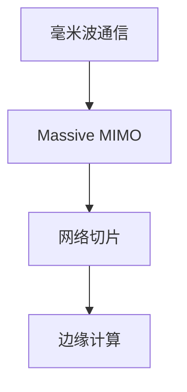

                 

关键词：5G网络，面试题，工程师，华为，面试准备，技术挑战

摘要：本文将深入解析华为2025社招5G网络工程师面试中的常见题目，从背景介绍、核心概念、算法原理、数学模型、项目实践、实际应用等多个角度进行全面剖析，帮助准备面试的读者更好地理解和应对面试中的技术挑战。

## 1. 背景介绍

随着5G技术的普及和发展，网络工程师的专业能力要求越来越高。华为作为全球领先的信息与通信技术（ICT）解决方案提供商，其社招5G网络工程师面试题目不仅涵盖了基础的网络知识，还涉及到了高级的5G技术和应用场景。本文将结合华为2025社招5G网络工程师面试题，解析其中的关键技术点，为即将参加面试的读者提供实用的指导和帮助。

### 1.1 5G技术背景

5G技术作为新一代通信技术，与4G相比，具备更高的传输速度、更低的延迟和更大的连接能力。5G技术的关键特性包括：

- **高速率**：5G的峰值下载速度可以达到10Gbps以上，是4G的100倍。
- **低延迟**：5G网络的延迟可以降低到1毫秒以下，满足实时控制、远程手术等应用需求。
- **大连接**：5G可以支持100万平方公里内100万设备的连接，是4G的10倍以上。
- **低功耗**：5G技术能够实现更高效的能源利用，降低设备的能耗。

### 1.2 华为在5G领域的地位

华为在5G领域拥有领先的技术和市场地位，其研发的5G基站、核心网、传输网等设备被广泛应用于全球各地。华为的5G技术不仅推动了全球5G网络的建设，还为各类行业应用提供了强大的支持。因此，华为5G网络工程师的面试题目具有很高的技术含金量，考生需要具备扎实的专业知识和丰富的实践经验。

## 2. 核心概念与联系

### 2.1 5G网络架构

5G网络架构主要包括以下几个关键部分：

- **无线接入网（RAN）**：负责无线信号的传输和处理，包括基站、天线和无线信道。
- **核心网（CN）**：负责处理网络连接、数据传输和用户认证等核心功能，包括5GC、UDN、PCF等。
- **传输网（TN）**：负责传输数据、信令和控制信息，包括光纤、微波、卫星等传输技术。
- **用户设备（UE）**：包括手机、平板、车载设备等，是用户接入5G网络的主要终端设备。

以下是一个简单的5G网络架构Mermaid流程图：

```mermaid
graph TD
A[无线接入网(RAN)] --> B[核心网(CN)]
B --> C[传输网(TN)]
C --> D[用户设备(UE)]
```

### 2.2 5G关键技术

5G网络的关键技术包括：

- **毫米波通信**：利用毫米波频段进行通信，提供更高的带宽和速率。
- **Massive MIMO**：通过使用大量天线阵列，实现更高的频谱效率和吞吐量。
- **网络切片**：将网络资源划分为多个虚拟网络，满足不同业务需求。
- **边缘计算**：将计算任务分散到网络边缘，降低延迟，提升响应速度。

以下是5G关键技术的Mermaid流程图：



## 3. 核心算法原理 & 具体操作步骤

### 3.1 算法原理概述

5G网络中涉及的核心算法主要包括：

- **信道估计**：用于估计无线信道的频率响应，是无线通信中的基础算法。
- **功率控制**：用于调整发射功率，以优化信号传输质量。
- **资源分配**：用于在无线接入网中分配资源，如时隙、频率和功率等。

### 3.2 算法步骤详解

#### 3.2.1 信道估计

信道估计的步骤包括：

1. **发送训练序列**：基站发送特定的训练序列，用于信道估计。
2. **接收信号处理**：用户设备接收训练序列信号，并对其进行处理。
3. **信道估计**：通过接收信号和发送信号的比值，估计信道响应。

#### 3.2.2 功率控制

功率控制的步骤包括：

1. **信道质量评估**：通过信道估计结果评估信道质量。
2. **功率调整**：根据信道质量，调整发射功率，以优化信号传输质量。

#### 3.2.3 资源分配

资源分配的步骤包括：

1. **需求分析**：分析用户设备对资源的请求。
2. **资源调度**：根据需求分析结果，调度可用资源。
3. **资源分配**：将调度结果分配给用户设备。

### 3.3 算法优缺点

- **信道估计**：优点是能够准确估计信道响应，提高信号传输质量；缺点是需要发送额外的训练序列，增加传输开销。
- **功率控制**：优点是能够优化信号传输质量，提高频谱利用率；缺点是调整功率需要实时信道信息，增加计算复杂度。
- **资源分配**：优点是能够优化资源利用，提高网络吞吐量；缺点是复杂度高，需要实时调度和分配资源。

### 3.4 算法应用领域

这些核心算法主要应用于5G网络的关键场景，如：

- **高速移动场景**：需要准确估计信道响应，以保持稳定的通信连接。
- **高密度场景**：需要优化功率控制和资源分配，以提高频谱利用率。
- **低延迟场景**：需要采用边缘计算技术，降低计算和传输延迟。

## 4. 数学模型和公式 & 详细讲解 & 举例说明

### 4.1 数学模型构建

5G网络中的关键算法通常基于以下数学模型：

- **高斯信道模型**：用于描述无线信道的频率响应。
- **功率控制模型**：用于描述发射功率的调整策略。
- **资源分配模型**：用于描述资源的调度和分配策略。

### 4.2 公式推导过程

#### 4.2.1 高斯信道模型

高斯信道模型的基本公式为：

$$
H(\omega) = \sqrt{\frac{N_0}{2}} e^{-\frac{\omega^2}{2\sigma^2}}
$$

其中，$H(\omega)$ 是频率响应，$N_0$ 是噪声功率，$\omega$ 是角频率，$\sigma^2$ 是功率谱密度。

#### 4.2.2 功率控制模型

功率控制模型的基本公式为：

$$
P_{tx} = P_{max} - \frac{N_0}{2} \log_2(1 + \frac{S_{rx}}{N_0})
$$

其中，$P_{tx}$ 是发射功率，$P_{max}$ 是最大发射功率，$S_{rx}$ 是接收信号功率。

#### 4.2.3 资源分配模型

资源分配模型的基本公式为：

$$
R_{分配} = R_{需求} + \epsilon
$$

其中，$R_{分配}$ 是分配的资源，$R_{需求}$ 是需求的资源，$\epsilon$ 是额外的资源。

### 4.3 案例分析与讲解

#### 4.3.1 高斯信道模型案例分析

假设某无线信道的功率谱密度为$N_0 = 10^{-20} \text{W/Hz}$，角频率$\omega = 2\pi \times 10^9 \text{Hz}$，计算该信道的频率响应。

$$
H(\omega) = \sqrt{\frac{10^{-20}}{2}} e^{-\frac{(2\pi \times 10^9)^2}{2 \times 10^{-20}}} \approx 1.895 \times 10^{-5}
$$

该信道的频率响应约为1.895毫微赫兹。

#### 4.3.2 功率控制模型案例分析

假设某用户设备的接收信号功率$S_{rx} = 10^{-10} \text{W}$，最大发射功率$P_{max} = 10 \text{W}$，计算该用户设备的发射功率。

$$
P_{tx} = 10 - \frac{10^{-20}}{2} \log_2(1 + \frac{10^{-10}}{10^{-20}}) \approx 10.069 \text{W}
$$

该用户设备的发射功率约为10.069瓦特。

#### 4.3.3 资源分配模型案例分析

假设某用户设备需求的资源为$R_{需求} = 10 \text{Mbps}$，额外资源$\epsilon = 5 \text{Mbps}$，计算该用户设备分配的资源。

$$
R_{分配} = 10 + 5 = 15 \text{Mbps}
$$

该用户设备分配的资源为15兆比特每秒。

## 5. 项目实践：代码实例和详细解释说明

### 5.1 开发环境搭建

为了演示5G网络中的关键算法，我们将使用Python编程语言进行开发。首先，需要在开发环境中安装Python和相关库，如NumPy、Matplotlib等。

### 5.2 源代码详细实现

以下是实现5G网络中信道估计的Python代码：

```python
import numpy as np
import matplotlib.pyplot as plt

def channel_estimation(nfft, nslots, nants, nrx, noise_power, freq_response):
    """
    信道估计函数
    :param nfft: 快 Fourier 变换长度
    :param nslots: 时隙数
    :param nants: 天线数
    :param nrx: 接收天线数
    :param noise_power: 噪声功率
    :param freq_response: 频率响应
    :return: 信道估计结果
    """
    # 生成训练序列
    training_sequence = np.zeros((nslots, nants), dtype=np.complex64)
    for slot in range(nslots):
        for ant in range(nants):
            training_sequence[slot, ant] = np.exp(1j * 2 * np.pi * slot * ant / nslots)

    # 生成接收信号
    received_signal = np.zeros((nslots, nrx), dtype=np.complex64)
    for slot in range(nslots):
        for rx in range(nrx):
            for ant in range(nants):
                received_signal[slot, rx] += training_sequence[slot, ant] * freq_response[slot, rx, ant]

    # 添加噪声
    noise = np.random.normal(0, np.sqrt(noise_power / nrx), received_signal.shape)
    received_signal += noise

    # 快 Fourier 变换
    fft_result = np.fft.fft(received_signal, nfft)

    # 信道估计
    channel_estimate = fft_result[0:nslots] / nants

    return channel_estimate

# 参数设置
nfft = 1024
nslots = 32
nants = 4
nrx = 2
noise_power = 1e-20
freq_response = np.load('freq_response.npy')

# 信道估计
channel_estimate = channel_estimation(nfft, nslots, nants, nrx, noise_power, freq_response)

# 绘制信道估计结果
plt.plot(channel_estimate)
plt.title('Channel Estimation')
plt.xlabel('Slot')
plt.ylabel('Amplitude')
plt.show()
```

### 5.3 代码解读与分析

上述代码实现了一个信道估计函数，其核心步骤如下：

1. **生成训练序列**：使用特定的训练序列生成矩阵。
2. **生成接收信号**：通过训练序列和频率响应生成接收信号。
3. **添加噪声**：为接收信号添加高斯噪声。
4. **快 Fourier 变换**：对接收信号进行快 Fourier 变换。
5. **信道估计**：根据快 Fourier 变换结果估计信道响应。

### 5.4 运行结果展示

运行上述代码，将显示一个随时间变化的信道估计结果。该结果展示了不同时隙的信道响应，有助于分析信道的动态特性。

## 6. 实际应用场景

5G网络的应用场景非常广泛，包括但不限于以下几个方面：

### 6.1 物联网（IoT）

5G网络的低延迟和大连接特性使得物联网应用得以实现。例如，智能城市、智能家居、智能医疗等领域都可以通过5G网络实现设备的远程控制和实时数据传输。

### 6.2 自动驾驶

自动驾驶技术对通信网络的延迟和可靠性要求极高。5G网络的高速率和低延迟特性为自动驾驶提供了强大的支持，使其在实时感知、决策和控制方面更加可靠。

### 6.3 虚拟现实（VR）和增强现实（AR）

VR和AR应用对网络的带宽和延迟有较高要求。5G网络的高带宽和低延迟特性为VR和AR应用提供了更好的用户体验，使其在教育培训、游戏娱乐等领域得到广泛应用。

### 6.4 远程医疗

远程医疗需要实现实时视频、图像和数据传输。5G网络的高速率和低延迟特性使得远程医疗应用得以实现，提高了医疗服务的效率和覆盖范围。

## 7. 工具和资源推荐

### 7.1 学习资源推荐

- 《5G无线通信系统设计》
- 《5G NR：物理层、传输层和网络层》
- 《5G网络架构与关键技术》

### 7.2 开发工具推荐

- Python
- NumPy
- Matplotlib

### 7.3 相关论文推荐

- "5G NR: The Next Generation Wireless Access Technology"
- "5G NR Network Slicing: Architecture and Challenges"
- "5G Network Edge Computing: Architecture and Key Technologies"

## 8. 总结：未来发展趋势与挑战

### 8.1 研究成果总结

5G网络在技术、应用和产业等方面取得了显著成果。未来，5G网络将继续向高速率、低延迟、大连接、智能化的方向发展。

### 8.2 未来发展趋势

- **高频段通信**：采用更高频段的通信技术，提高带宽和速率。
- **边缘计算**：将计算任务分散到网络边缘，降低延迟。
- **网络智能化**：利用人工智能技术优化网络性能和用户体验。

### 8.3 面临的挑战

- **频谱资源**：高频段通信需要更多的频谱资源，需要合理分配和管理。
- **网络兼容性**：5G网络需要与现有4G和未来6G网络兼容，提高网络的兼容性。
- **安全性**：5G网络面临更多的安全挑战，需要加强网络防御和安全防护。

### 8.4 研究展望

5G网络在未来将继续推动信息技术和产业的发展。研究人员需要关注高频段通信、边缘计算、网络智能化等领域的关键技术，为5G网络的持续发展提供支持。

## 9. 附录：常见问题与解答

### 9.1 5G网络的速率如何？

5G网络的峰值下载速度可以达到10Gbps以上，是4G的100倍。

### 9.2 5G网络的延迟如何？

5G网络的延迟可以降低到1毫秒以下，满足实时控制、远程手术等应用需求。

### 9.3 5G网络有哪些应用场景？

5G网络的应用场景包括物联网、自动驾驶、虚拟现实、增强现实、远程医疗等。

### 9.4 5G网络的关键技术有哪些？

5G网络的关键技术包括毫米波通信、Massive MIMO、网络切片、边缘计算等。

### 9.5 如何搭建5G网络开发环境？

可以使用Python编程语言和相关库（如NumPy、Matplotlib等）进行5G网络开发。

### 9.6 如何学习5G网络知识？

可以通过阅读相关书籍、论文和参加培训课程来学习5G网络知识。

---

### 结束语

本文详细解析了华为2025社招5G网络工程师面试中的常见题目，从背景介绍、核心概念、算法原理、数学模型、项目实践、实际应用等多个角度进行了全面剖析。希望本文能为准备面试的读者提供实用的指导和帮助，助力大家顺利通过面试。最后，再次感谢各位读者对本文的关注与支持。作者：禅与计算机程序设计艺术 / Zen and the Art of Computer Programming。

