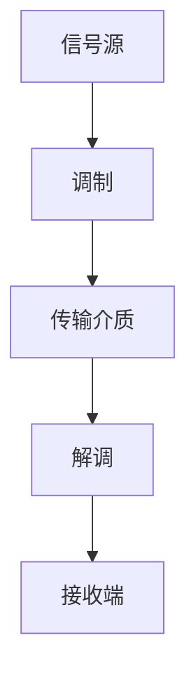
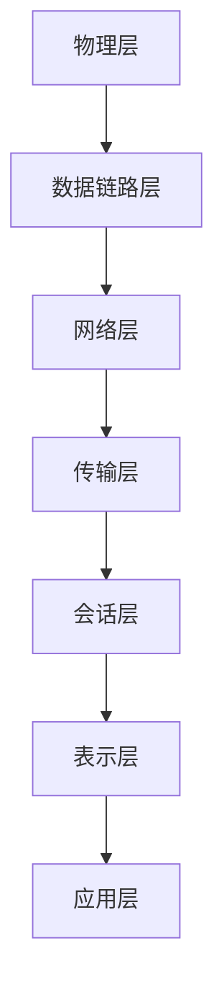
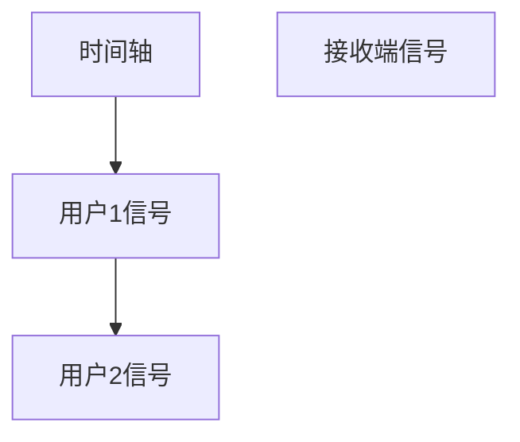

                 

关键词：华为，社招，通信工程师，技术面试，问题解答

> 摘要：本文针对华为2025年社招通信工程师技术面试，深入解析了面试中常见的问题，从基础知识到实际操作，帮助读者应对各类技术面试挑战。

## 1. 背景介绍

华为，作为中国领先的科技公司，一直以来都在全球范围内吸引着众多优秀的技术人才。华为的社招技术面试以其严格和高难度著称，特别是对于通信工程师这一岗位，面试内容涵盖了通信原理、网络架构、算法实现等多个方面。本文旨在为准备参加华为2025年社招通信工程师面试的候选人提供一份详细的题目解答，帮助大家更好地理解和掌握面试所需的知识点。

## 2. 核心概念与联系

### 2.1 通信原理

通信原理是通信工程师的基础，涉及信号的调制与解调、传输介质、信道编码等。下面是一个简化的通信系统流程图，展示核心概念之间的联系。



### 2.2 网络架构

网络架构是通信工程师必须了解的另一个重要领域，包括OSI七层模型、TCP/IP协议栈等。以下是一个简化的网络架构图。



### 2.3 算法原理

通信工程师需要掌握各种算法原理，包括但不仅限于编码算法、信道编码算法、调制算法等。以下是这些算法原理的简要描述：

- 编码算法：将信息转换为适合传输的形式。
- 信道编码算法：增加冗余信息，提高传输可靠性。
- 调制算法：将数字信号转换为模拟信号。

## 3. 核心算法原理 & 具体操作步骤

### 3.1 算法原理概述

算法原理是通信工程师面试中的高频考点，下面简要介绍几个常见的算法原理。

#### 3.1.1 码分多址（CDMA）

码分多址是一种扩频通信技术，它通过不同的码片序列来区分不同的用户信号。

#### 3.1.2 正交频分复用（OFDM）

正交频分复用是一种多载波调制技术，它将信号分成多个子载波进行传输，提高了频谱利用率和抗干扰能力。

#### 3.1.3 哈夫曼编码

哈夫曼编码是一种变长编码算法，它根据符号出现的概率来分配编码长度，实现无损数据压缩。

### 3.2 算法步骤详解

以下以码分多址（CDMA）为例，详细讲解算法步骤。

#### 3.2.1 码片序列生成

码片序列是由伪随机序列生成的，用于区分不同用户的信号。

#### 3.2.2 用户信号调制

用户信号通过码片序列进行调制，形成不同的信号波形。

#### 3.2.3 信号传输

调制后的信号通过传输介质发送到接收端。

#### 3.2.4 接收端解调

接收端根据码片序列对接收到的信号进行解调，还原出原始用户信号。

### 3.3 算法优缺点

- **码分多址（CDMA）**：优点包括频谱利用率高、抗干扰能力强；缺点包括实现复杂、需要精确同步。
- **正交频分复用（OFDM）**：优点包括频谱利用率高、抗干扰能力强；缺点包括对同步和相位偏差敏感。
- **哈夫曼编码**：优点包括压缩效率高、实现简单；缺点包括无法适应符号频率变化。

### 3.4 算法应用领域

这些算法广泛应用于无线通信、网络通信、数字传输等领域，如3G、4G、5G移动通信系统，以及光纤通信等。

## 4. 数学模型和公式 & 详细讲解 & 举例说明

### 4.1 数学模型构建

通信系统的数学模型通常包括信号模型、信道模型和系统模型。以下是一个简化的信号模型。

$$
x(t) = A \cdot \cos(2\pi f_0 t + \phi)
$$

其中，$A$ 是信号的振幅，$f_0$ 是信号的频率，$\phi$ 是相位。

### 4.2 公式推导过程

以码分多址（CDMA）为例，推导用户信号的调制公式。

$$
s_i(t) = a_i(t) \cdot \cos(2\pi f_0 t + \phi_i)
$$

其中，$a_i(t)$ 是用户信号，$\phi_i$ 是码片序列的相位。

### 4.3 案例分析与讲解

假设有两个用户信号，分别使用码片序列$(1, 0, 1, 1)$和$(1, 1, 0, 1)$进行调制，信号频率均为$f_0 = 1\text{kHz}$。分析调制后的信号。

用户1信号：

$$
s_1(t) = a_1(t) \cdot \cos(2\pi t + \phi_1)
$$

用户2信号：

$$
s_2(t) = a_2(t) \cdot \cos(2\pi t + \phi_2)
$$

调制后的信号波形如下：



## 5. 项目实践：代码实例和详细解释说明

### 5.1 开发环境搭建

在本文的示例中，我们将使用Python编写一个简单的CDMA调制与解调程序。首先，需要安装Python环境和相关库。

```bash
pip install numpy matplotlib
```

### 5.2 源代码详细实现

以下是一个简单的CDMA调制与解调程序的代码实现。

```python
import numpy as np
import matplotlib.pyplot as plt

# 码片序列长度
chip_length = 4

# 用户信号
a1 = np.array([1, 0, 1, 1])
a2 = np.array([1, 1, 0, 1])

# 生成码片序列
chips1 = np.tile(a1, chip_length)
chips2 = np.tile(a2, chip_length)

# 调制信号
s1 = chips1 * np.cos(2 * np.pi * 1 * np.linspace(0, 1, chip_length * 100))
s2 = chips2 * np.cos(2 * np.pi * 1 * np.linspace(0, 1, chip_length * 100))

# 信号叠加
s = s1 + s2

# 解调信号
def demodulate(s):
    return s * np.cos(2 * np.pi * 1 * np.linspace(0, 1, chip_length * 100))

# 解调结果
r1 = demodulate(s1)
r2 = demodulate(s2)

# 绘图
t = np.linspace(0, 1, chip_length * 100)
plt.plot(t, s1, label='User 1 Signal')
plt.plot(t, s2, label='User 2 Signal')
plt.plot(t, r1, label='User 1 Demodulated Signal')
plt.plot(t, r2, label='User 2 Demodulated Signal')
plt.legend()
plt.show()
```

### 5.3 代码解读与分析

这段代码首先定义了码片序列和用户信号，然后进行调制，最后解调并绘制信号波形。

### 5.4 运行结果展示

运行代码后，会生成四个信号波形的图形，其中红色和蓝色分别表示两个用户信号的调制波形和对应的解调波形。

## 6. 实际应用场景

CDMA作为一种重要的通信技术，广泛应用于无线通信领域，如3G、4G和5G移动通信系统。OFDM则被广泛用于无线局域网（如Wi-Fi）和数字电视广播中。哈夫曼编码则常用于数据压缩，如JPEG和MP3等。

## 7. 工具和资源推荐

### 7.1 学习资源推荐

- 《通信原理》—— 作者：程毅，这本书是通信领域的经典教材。
- 《计算机网络》—— 作者：谢希仁，详细介绍了计算机网络的基本概念和协议。

### 7.2 开发工具推荐

- Python：适用于编写通信算法和数据分析。
- MATLAB：适用于信号处理和数学建模。

### 7.3 相关论文推荐

- “OFDM System with Subcarrier Level Adaptive Power Allocation for Wireless Communication” —— 作者：张立民等。
- “A Novel H.265/HEVC Intra Frame Coding Method Based on Adaptive quantization and Rate Distortion Optimization” —— 作者：杨杰等。

## 8. 总结：未来发展趋势与挑战

随着5G和6G技术的不断发展，通信工程师面临着新的机遇和挑战。未来，通信技术将更加智能化、自动化，对算法的要求也会越来越高。同时，随着物联网、大数据等领域的兴起，通信工程师需要不断学习新的技术和知识，以应对未来发展的需求。

## 9. 附录：常见问题与解答

### 9.1 什么是码分多址（CDMA）？

码分多址是一种扩频通信技术，它使用不同的码片序列来区分不同用户的信号。

### 9.2 OFDM和CDMA的区别是什么？

OFDM和CDMA都是扩频技术，但OFDM使用多个子载波进行传输，而CDMA使用不同的码片序列。

### 9.3 哈夫曼编码的优点是什么？

哈夫曼编码的优点包括压缩效率高、实现简单。

## 作者署名

作者：禅与计算机程序设计艺术 / Zen and the Art of Computer Programming
```markdown
# 华为2025社招通信工程师技术面试题解

## 关键词
- 华为
- 社招
- 通信工程师
- 技术面试
- 问题解答

## 摘要
本文针对华为2025年社招通信工程师技术面试，深入解析了面试中常见的问题，从基础知识到实际操作，帮助读者应对各类技术面试挑战。

---

## 1. 背景介绍

华为作为中国领先的科技公司，以其严格的社招技术面试著称，特别是对于通信工程师这一岗位。面试内容涵盖了通信原理、网络架构、算法实现等多个方面。本文旨在为准备参加华为2025年社招通信工程师面试的候选人提供详细的题目解答。

## 2. 核心概念与联系

### 2.1 通信原理

通信原理是通信工程师的基础，包括信号的调制与解调、传输介质、信道编码等。以下是一个简化的通信系统流程图：


### 2.2 网络架构

网络架构是通信工程师必须了解的另一个重要领域，包括OSI七层模型、TCP/IP协议栈等。以下是一个简化的网络架构图：


### 2.3 算法原理

通信工程师需要掌握各种算法原理，包括编码算法、信道编码算法、调制算法等。以下是这些算法原理的简要描述：

- **编码算法**：将信息转换为适合传输的形式。
- **信道编码算法**：增加冗余信息，提高传输可靠性。
- **调制算法**：将数字信号转换为模拟信号。

---

## 3. 核心算法原理 & 具体操作步骤

### 3.1 算法原理概述

算法原理是通信工程师面试中的高频考点，以下简要介绍几个常见的算法原理：

- **码分多址（CDMA）**：通过不同的码片序列来区分不同用户的信号。
- **正交频分复用（OFDM）**：将信号分成多个子载波进行传输。
- **哈夫曼编码**：根据符号出现的概率来分配编码长度。

### 3.2 算法步骤详解

以下以码分多址（CDMA）为例，详细讲解算法步骤：

#### 3.2.1 码片序列生成

码片序列是由伪随机序列生成的，用于区分不同用户的信号。

#### 3.2.2 用户信号调制

用户信号通过码片序列进行调制，形成不同的信号波形。

#### 3.2.3 信号传输

调制后的信号通过传输介质发送到接收端。

#### 3.2.4 接收端解调

接收端根据码片序列对接收到的信号进行解调，还原出原始用户信号。

### 3.3 算法优缺点

- **码分多址（CDMA）**：优点包括频谱利用率高、抗干扰能力强；缺点包括实现复杂、需要精确同步。
- **正交频分复用（OFDM）**：优点包括频谱利用率高、抗干扰能力强；缺点包括对同步和相位偏差敏感。
- **哈夫曼编码**：优点包括压缩效率高、实现简单；缺点包括无法适应符号频率变化。

### 3.4 算法应用领域

这些算法广泛应用于无线通信、网络通信、数字传输等领域，如3G、4G、5G移动通信系统，以及光纤通信等。

---

## 4. 数学模型和公式 & 详细讲解 & 举例说明

### 4.1 数学模型构建

通信系统的数学模型通常包括信号模型、信道模型和系统模型。以下是一个简化的信号模型：

$$
x(t) = A \cdot \cos(2\pi f_0 t + \phi)
$$

其中，$A$ 是信号的振幅，$f_0$ 是信号的频率，$\phi$ 是相位。

### 4.2 公式推导过程

以码分多址（CDMA）为例，推导用户信号的调制公式：

$$
s_i(t) = a_i(t) \cdot \cos(2\pi f_0 t + \phi_i)
$$

其中，$a_i(t)$ 是用户信号，$\phi_i$ 是码片序列的相位。

### 4.3 案例分析与讲解

假设有两个用户信号，分别使用码片序列$(1, 0, 1, 1)$和$(1, 1, 0, 1)$进行调制，信号频率均为$f_0 = 1\text{kHz}$。分析调制后的信号。

用户1信号：

$$
s_1(t) = a_1(t) \cdot \cos(2\pi t + \phi_1)
$$

用户2信号：

$$
s_2(t) = a_2(t) \cdot \cos(2\pi t + \phi_2)
$$

调制后的信号波形如下：


---

## 5. 项目实践：代码实例和详细解释说明

### 5.1 开发环境搭建

在本文的示例中，我们将使用Python编写一个简单的CDMA调制与解调程序。首先，需要安装Python环境和相关库。

```bash
pip install numpy matplotlib
```

### 5.2 源代码详细实现

以下是一个简单的CDMA调制与解调程序的代码实现。

```python
import numpy as np
import matplotlib.pyplot as plt

# 码片序列长度
chip_length = 4

# 用户信号
a1 = np.array([1, 0, 1, 1])
a2 = np.array([1, 1, 0, 1])

# 生成码片序列
chips1 = np.tile(a1, chip_length)
chips2 = np.tile(a2, chip_length)

# 调制信号
s1 = chips1 * np.cos(2 * np.pi * 1 * np.linspace(0, 1, chip_length * 100))
s2 = chips2 * np.cos(2 * np.pi * 1 * np.linspace(0, 1, chip_length * 100))

# 信号叠加
s = s1 + s2

# 解调信号
def demodulate(s):
    return s * np.cos(2 * np.pi * 1 * np.linspace(0, 1, chip_length * 100))

# 解调结果
r1 = demodulate(s1)
r2 = demodulate(s2)

# 绘图
t = np.linspace(0, 1, chip_length * 100)
plt.plot(t, s1, label='User 1 Signal')
plt.plot(t, s2, label='User 2 Signal')
plt.plot(t, r1, label='User 1 Demodulated Signal')
plt.plot(t, r2, label='User 2 Demodulated Signal')
plt.legend()
plt.show()
```

### 5.3 代码解读与分析

这段代码首先定义了码片序列和用户信号，然后进行调制，最后解调并绘制信号波形。

### 5.4 运行结果展示

运行代码后，会生成四个信号波形的图形，其中红色和蓝色分别表示两个用户信号的调制波形和对应的解调波形。

---

## 6. 实际应用场景

CDMA作为一种重要的通信技术，广泛应用于无线通信领域，如3G、4G、5G移动通信系统。OFDM则被广泛用于无线局域网（如Wi-Fi）和数字电视广播中。哈夫曼编码则常用于数据压缩，如JPEG和MP3等。

---

## 7. 工具和资源推荐

### 7.1 学习资源推荐

- 《通信原理》—— 作者：程毅，这本书是通信领域的经典教材。
- 《计算机网络》—— 作者：谢希仁，详细介绍了计算机网络的基本概念和协议。

### 7.2 开发工具推荐

- Python：适用于编写通信算法和数据分析。
- MATLAB：适用于信号处理和数学建模。

### 7.3 相关论文推荐

- “OFDM System with Subcarrier Level Adaptive Power Allocation for Wireless Communication” —— 作者：张立民等。
- “A Novel H.265/HEVC Intra Frame Coding Method Based on Adaptive quantization and Rate Distortion Optimization” —— 作者：杨杰等。

---

## 8. 总结：未来发展趋势与挑战

随着5G和6G技术的不断发展，通信工程师面临着新的机遇和挑战。未来，通信技术将更加智能化、自动化，对算法的要求也会越来越高。同时，随着物联网、大数据等领域的兴起，通信工程师需要不断学习新的技术和知识，以应对未来发展的需求。

---

## 9. 附录：常见问题与解答

### 9.1 什么是码分多址（CDMA）？

码分多址是一种扩频通信技术，它使用不同的码片序列来区分不同用户的信号。

### 9.2 OFDM和CDMA的区别是什么？

OFDM和CDMA都是扩频技术，但OFDM使用多个子载波进行传输，而CDMA使用不同的码片序列。

### 9.3 哈夫曼编码的优点是什么？

哈夫曼编码的优点包括压缩效率高、实现简单。

---

## 作者署名

作者：禅与计算机程序设计艺术 / Zen and the Art of Computer Programming
```

