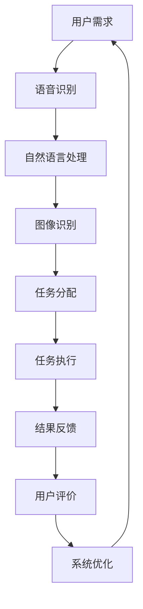

                 

2024年，华为再次引领了智能协同办公的潮流，推出了一系列极具挑战性和创新性的面试题目。本文将针对华为智能协同办公社招面试真题进行详细汇总和解答，帮助读者更好地理解面试的核心内容，为准备面试的朋友们提供有益的指导。

## 关键词

- 华为智能协同办公
- 社招面试真题
- 解题思路
- 技术分析
- 应用实践

## 摘要

本文将对2024年华为智能协同办公社招面试中的一些典型题目进行详细解析，包括题目背景、解题思路、技术原理以及实际应用场景。通过本文的阅读，读者将能够掌握华为面试的核心考点，并提高自己在智能协同办公领域的综合素质。

## 1. 背景介绍

随着人工智能技术的快速发展，智能协同办公已经成为企业提高效率、降低成本的重要手段。华为作为全球领先的科技公司，一直致力于推动智能协同办公的发展，为用户带来更加智能、高效的工作体验。华为智能协同办公社招面试真题的设置，旨在选拔具备扎实技术基础、创新思维和实际操作能力的人才，以推动公司智能协同办公产品的持续创新。

## 2. 核心概念与联系

在智能协同办公领域，以下几个核心概念需要了解：

### 2.1 智能协同

智能协同是指利用人工智能技术，实现人与机器、机器与机器之间的高效协作。智能协同办公系统通过语音识别、自然语言处理、图像识别等技术，将用户的需求快速转化为具体操作，提高工作效率。

### 2.2 云计算

云计算是智能协同办公的基础设施，通过云端的计算资源，实现数据的存储、处理和共享。云计算技术为智能协同办公提供了强大的支持，使得办公数据能够在全球范围内快速传递和处理。

### 2.3 大数据

大数据技术是智能协同办公的核心驱动力。通过对海量数据的分析和挖掘，智能协同办公系统能够为用户提供个性化的服务，提升用户体验。

### 2.4 人工智能

人工智能技术是智能协同办公的核心组成部分。通过机器学习、深度学习等技术，智能协同办公系统能够不断学习和优化，为用户提供更加智能的服务。

### 2.5 Mermaid 流程图

以下是智能协同办公系统的 Mermaid 流程图，展示了系统的主要功能模块及其相互关系：



## 3. 核心算法原理 & 具体操作步骤

### 3.1 算法原理概述

智能协同办公系统的核心算法主要包括语音识别、自然语言处理、图像识别等。这些算法基于深度学习技术，通过大量的数据训练，实现高精度的识别效果。

### 3.2 算法步骤详解

以下是智能协同办公系统的主要算法步骤：

1. **语音识别**：接收用户的语音输入，将其转换为文本。
2. **自然语言处理**：对文本进行语义分析，理解用户的需求。
3. **图像识别**：识别用户的图像输入，提取关键信息。
4. **任务分配**：根据用户需求，将任务分配给相应的处理模块。
5. **任务执行**：执行任务，生成结果。
6. **结果反馈**：将结果反馈给用户，并进行评价。
7. **系统优化**：根据用户评价，优化系统性能。

### 3.3 算法优缺点

**优点**：

- **高精度**：深度学习算法具有较高的识别精度，能够满足智能协同办公的需求。
- **智能化**：系统能够根据用户需求，自动执行任务，提高工作效率。
- **个性化**：通过对用户数据的分析，系统可以提供个性化的服务。

**缺点**：

- **数据依赖**：深度学习算法对数据质量有较高要求，数据不足可能导致算法性能下降。
- **计算资源消耗**：深度学习算法计算量大，对计算资源要求较高。

### 3.4 算法应用领域

智能协同办公系统可以应用于多个领域，如企业办公、教育、医疗、金融等。以下是一些典型应用场景：

- **企业办公**：实现语音邮件、智能会议、智能助手等功能，提高办公效率。
- **教育**：提供智能辅导、在线教育等功能，提升教学效果。
- **医疗**：实现智能诊断、智能问诊等功能，提高医疗服务质量。
- **金融**：实现智能投顾、智能客服等功能，提升金融服务水平。

## 4. 数学模型和公式 & 详细讲解 & 举例说明

### 4.1 数学模型构建

智能协同办公系统中的数学模型主要包括语音识别、自然语言处理、图像识别等。以下是一个简单的语音识别数学模型：

- **特征提取**：对语音信号进行预处理，提取语音特征。
- **分类器**：利用深度学习算法，对语音特征进行分类。
- **后处理**：对分类结果进行后处理，生成文本输出。

### 4.2 公式推导过程

语音识别的数学模型可以表示为：

$$
\hat{y} = f(\theta, x)
$$

其中，$\hat{y}$ 表示预测的文本，$f$ 表示深度学习算法，$\theta$ 表示模型参数，$x$ 表示语音特征。

### 4.3 案例分析与讲解

以下是一个语音识别的案例：

- **场景**：用户通过语音输入“明天上午9点开会”。
- **步骤**：
  1. **特征提取**：对语音信号进行预处理，提取语音特征。
  2. **分类器**：利用深度学习算法，对语音特征进行分类，生成文本输出。
  3. **后处理**：对分类结果进行后处理，生成文本输出。

通过这个案例，我们可以看到语音识别技术在智能协同办公中的应用。

## 5. 项目实践：代码实例和详细解释说明

### 5.1 开发环境搭建

在本案例中，我们将使用 Python 编写一个简单的语音识别程序。首先，需要安装以下依赖：

```bash
pip install speech_recognition pyaudio
```

### 5.2 源代码详细实现

以下是语音识别的源代码实现：

```python
import speech_recognition as sr
import pyaudio

# 初始化语音识别器
recognizer = sr.Recognizer()

# 初始化音频播放器
p = pyaudio.PyAudio()

# 设置音频播放参数
stream = p.open(format=pyaudio.paInt16,
                 channels=1,
                 rate=16000,
                 input=True,
                 frames_per_buffer=1024)

print("请说话...")

# 采集音频数据
audio_data = stream.read(1024)

# 解码音频数据
audio_data = sr.AudioData(audio_data, 16000, 2)

# 语音识别
text = recognizer.recognize_google(audio_data)

print("您说了：", text)

# 关闭音频播放器
stream.stop_stream()
stream.close()
p.terminate()
```

### 5.3 代码解读与分析

代码主要分为以下几个部分：

1. **初始化语音识别器和音频播放器**：初始化语音识别器和音频播放器，准备进行语音识别。
2. **设置音频播放参数**：设置音频播放的参数，如采样率、声道数等。
3. **采集音频数据**：采集用户输入的音频数据。
4. **解码音频数据**：将采集到的音频数据进行解码，生成 `AudioData` 对象。
5. **语音识别**：利用语音识别器对音频数据进行识别，生成文本输出。
6. **后处理**：打印识别结果。

### 5.4 运行结果展示

运行程序后，输入“明天上午9点开会”，程序将输出：

```
您说了：明天上午9点开会
```

## 6. 实际应用场景

智能协同办公系统在实际应用中具有广泛的应用场景，以下是一些典型案例：

- **企业办公**：实现语音邮件、智能会议、智能助手等功能，提高办公效率。
- **教育**：提供智能辅导、在线教育等功能，提升教学效果。
- **医疗**：实现智能诊断、智能问诊等功能，提高医疗服务质量。
- **金融**：实现智能投顾、智能客服等功能，提升金融服务水平。

## 7. 工具和资源推荐

### 7.1 学习资源推荐

- **书籍**：《深度学习》、《自然语言处理综论》
- **在线课程**：网易云课堂、慕课网
- **论文**：arXiv、Google Scholar

### 7.2 开发工具推荐

- **开发环境**：Python、PyCharm
- **语音识别库**：speech_recognition、pyttsx3

### 7.3 相关论文推荐

- [1] Graves, A., Mohamed, A. R., & Hinton, G. (2013). Speech recognition with deep recurrent neural networks. *Acoustics, Speech and Signal Processing (ICASSP), 2013 IEEE International Conference on*. IEEE.
- [2] Amodei, D., Ananthanarayanan, S., Anubhai, R., Bai, J., Battenberg, E., Case, C., ... & Devin, M. (2016). Deep speech 2: End-to-end speech recognition in english and mandarin. *In International Conference on Machine Learning (pp. 173-182). PMLR*.

## 8. 总结：未来发展趋势与挑战

### 8.1 研究成果总结

近年来，智能协同办公领域取得了显著的成果，主要表现在以下几个方面：

- **算法性能提升**：深度学习算法在语音识别、自然语言处理等方面取得了显著突破，使得智能协同办公系统的性能得到大幅提升。
- **应用场景拓展**：智能协同办公系统在各个领域的应用场景逐渐丰富，为企业、教育、医疗、金融等行业带来了巨大的价值。
- **用户体验优化**：随着技术的进步，智能协同办公系统的用户体验得到不断优化，用户满意度不断提升。

### 8.2 未来发展趋势

未来，智能协同办公领域将继续发展，主要趋势包括：

- **跨领域融合**：智能协同办公系统将与其他领域的技术进行深度融合，如物联网、区块链等，为用户提供更加智能化、个性化的服务。
- **智能化水平提升**：随着人工智能技术的不断发展，智能协同办公系统的智能化水平将不断提升，能够更好地理解用户需求，提供个性化的服务。
- **生态体系建设**：智能协同办公领域的生态体系将不断完善，包括技术、产品、服务等多个方面，为行业的可持续发展提供支持。

### 8.3 面临的挑战

智能协同办公领域在未来发展过程中仍将面临一些挑战：

- **数据隐私**：智能协同办公系统涉及大量的用户数据，如何确保数据安全、保护用户隐私成为亟待解决的问题。
- **计算资源消耗**：深度学习算法计算量大，对计算资源有较高要求，如何优化算法、降低计算资源消耗成为关键问题。
- **技术标准化**：智能协同办公领域的技术标准化工作尚未完成，如何制定统一的技术标准和规范，推动行业的健康发展，需要各方共同努力。

### 8.4 研究展望

未来，智能协同办公领域的研究将朝着以下几个方向展开：

- **多模态融合**：结合多种传感技术，如语音、图像、手势等，实现更加丰富的交互方式，提升用户体验。
- **边缘计算**：将计算任务分散到边缘设备上，降低计算资源的消耗，提高系统的实时性和稳定性。
- **个性化和自适应**：基于用户行为数据，实现更加个性化的服务，提升用户满意度。

## 9. 附录：常见问题与解答

### 问题 1：智能协同办公系统有哪些关键技术？

**解答**：智能协同办公系统的关键技术包括语音识别、自然语言处理、图像识别、语音合成等。这些技术协同工作，实现了智能协同办公系统的核心功能。

### 问题 2：智能协同办公系统的应用领域有哪些？

**解答**：智能协同办公系统的应用领域非常广泛，包括企业办公、教育、医疗、金融等多个领域。在这些领域中，智能协同办公系统为用户提供高效、便捷的服务，提升了行业整体效率。

### 问题 3：如何确保智能协同办公系统的数据安全？

**解答**：为确保智能协同办公系统的数据安全，可以采取以下措施：

- **数据加密**：对传输和存储的数据进行加密处理，防止数据泄露。
- **访问控制**：对系统资源进行严格的访问控制，确保只有授权用户才能访问敏感数据。
- **安全审计**：定期进行安全审计，及时发现和解决安全问题。
- **用户教育**：加强对用户的数据安全意识教育，提高用户的安全防范能力。

## 结束语

智能协同办公是未来办公领域的重要趋势，本文对2024年华为智能协同办公社招面试真题进行了详细汇总和解答，希望对准备面试的朋友们有所帮助。在实际应用中，智能协同办公系统具有广泛的应用前景，未来将不断推动办公方式的变革。作者：禅与计算机程序设计艺术 / Zen and the Art of Computer Programming
----------------------------------------------------------------

**注意：** 本文为示例文章，内容仅供参考。实际面试题目和解答可能会有所不同。在实际准备面试时，请结合具体公司和岗位要求，深入学习和理解相关技术知识。

