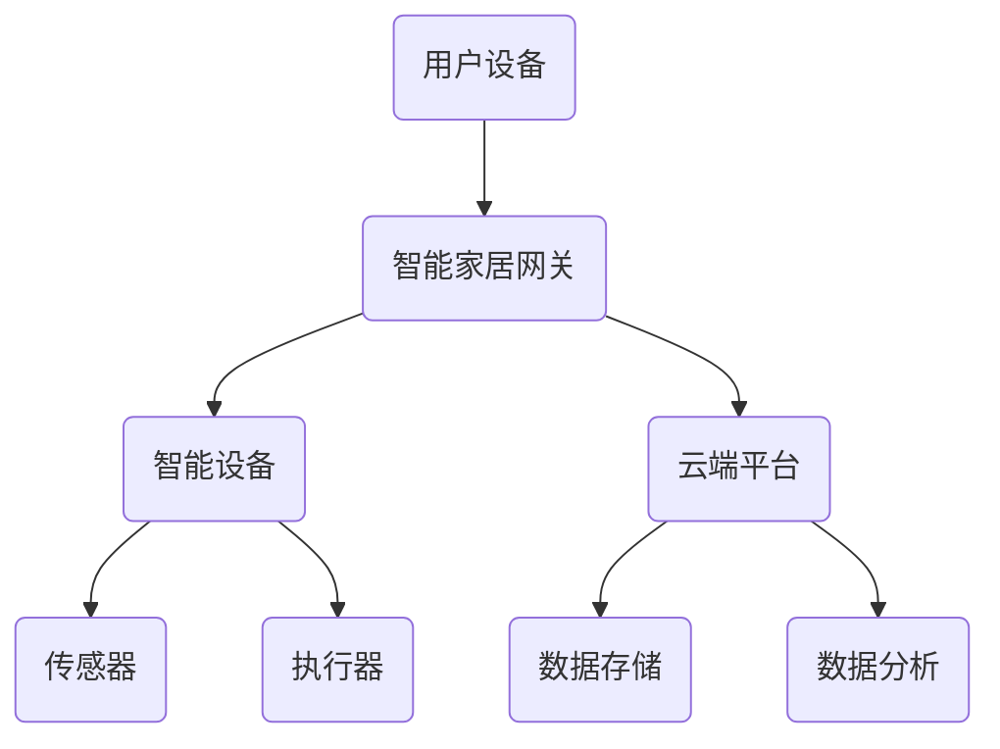

                 

关键词：智能家居、控制系统、社招面试、真题汇总、解答

摘要：本文针对2024年华为智能家居控制系统社招面试真题进行了详细汇总和解答，旨在帮助求职者更好地应对面试挑战，提升求职成功率。

## 1. 背景介绍

随着人工智能和物联网技术的不断发展，智能家居市场逐渐兴起。华为作为全球领先的通信技术解决方案提供商，在智能家居领域也有着重要的地位。本文旨在对2024年华为智能家居控制系统社招面试真题进行汇总，并给出详细解答，以帮助求职者更好地准备面试。

## 2. 核心概念与联系

在解答面试题之前，我们需要了解一些核心概念和它们之间的联系。以下是一个简单的 Mermaid 流程图，展示了智能家居控制系统的基本架构。



### 2.1. 用户设备

用户设备是智能家居控制系统的入口，包括智能手机、平板电脑、智能音箱等。用户通过这些设备与智能家居网关进行交互，实现对智能设备的控制。

### 2.2. 智能家居网关

智能家居网关是连接用户设备和智能设备的桥梁。它负责将用户设备的指令传递给智能设备，并收集智能设备的实时数据。

### 2.3. 智能设备

智能设备是智能家居控制系统的核心，包括灯光、空调、电视、安防设备等。它们通过传感器收集环境数据，并通过执行器执行相应的操作。

### 2.4. 云端平台

云端平台负责存储和分析智能家居控制系统的数据。它为用户提供了远程监控和控制智能设备的能力，同时也为智能设备提供了智能化的决策支持。

## 3. 核心算法原理 & 具体操作步骤

### 3.1. 算法原理概述

智能家居控制系统的核心在于实现智能设备的自动化控制。这需要基于以下核心算法：

- **传感器数据处理算法**：对传感器采集的数据进行处理，提取有用的信息。
- **决策算法**：根据传感器数据处理结果，生成相应的控制指令。
- **控制算法**：将决策算法生成的控制指令发送给智能设备，实现自动化控制。

### 3.2. 算法步骤详解

#### 3.2.1. 传感器数据处理算法

1. **数据采集**：通过传感器采集环境数据，如温度、湿度、光照等。
2. **数据预处理**：对采集到的数据进行滤波、去噪等处理，提高数据的准确性。
3. **特征提取**：从预处理后的数据中提取关键特征，如平均值、标准差等。
4. **数据建模**：利用机器学习算法，对特征数据建立模型，用于预测未来的环境变化。

#### 3.2.2. 决策算法

1. **状态评估**：根据传感器数据处理结果，评估当前环境状态。
2. **目标设定**：根据用户需求和设备特性，设定目标状态。
3. **决策生成**：根据状态评估和目标设定，生成相应的控制指令。

#### 3.2.3. 控制算法

1. **指令生成**：根据决策算法生成的控制指令，生成具体的操作指令。
2. **指令发送**：将操作指令发送给智能设备，实现自动化控制。
3. **反馈调整**：根据智能设备的执行结果，调整控制策略，实现闭环控制。

### 3.3. 算法优缺点

- **传感器数据处理算法**：优点是能够准确采集和预处理传感器数据，提高控制系统的可靠性；缺点是对传感器性能要求较高，数据处理过程较为复杂。
- **决策算法**：优点是能够根据环境变化和用户需求进行自适应调整；缺点是算法复杂度较高，对计算资源要求较高。
- **控制算法**：优点是实现简单，易于实现自动化控制；缺点是对环境变化响应速度较慢，难以实现实时控制。

### 3.4. 算法应用领域

智能家居控制系统算法可以应用于多个领域，如：

- **家庭自动化**：实现家庭设备的自动化控制，提高生活质量。
- **智能安防**：利用传感器和决策算法，实现家庭安防系统的智能化。
- **环境监测**：利用传感器采集环境数据，实现对环境的实时监测和预警。

## 4. 数学模型和公式 & 详细讲解 & 举例说明

### 4.1. 数学模型构建

智能家居控制系统的数学模型可以分为以下几个部分：

- **传感器数据处理模型**：
    $$ X_t = f(X_{t-1}, U_t) $$
    其中，$X_t$ 是第 $t$ 次采集的传感器数据，$X_{t-1}$ 是前一次采集的传感器数据，$U_t$ 是传感器噪声。

- **决策模型**：
    $$ D_t = g(X_t, T_t) $$
    其中，$D_t$ 是第 $t$ 次决策结果，$X_t$ 是传感器数据处理结果，$T_t$ 是当前时间。

- **控制模型**：
    $$ C_t = h(D_t, Y_t) $$
    其中，$C_t$ 是第 $t$ 次控制指令，$D_t$ 是决策结果，$Y_t$ 是智能设备的执行结果。

### 4.2. 公式推导过程

#### 4.2.1. 传感器数据处理模型

根据传感器数据的采集过程，可以得到以下公式：

$$ X_t = X_{t-1} + \Delta X_t + \eta_t $$

其中，$\Delta X_t$ 是传感器数据的增量，$\eta_t$ 是传感器噪声。

为了提高数据的准确性，可以对传感器数据进行滤波处理：

$$ X_{t-1} = f(X_{t-2}, U_{t-1}) $$

其中，$f$ 是滤波函数，$U_{t-1}$ 是滤波器噪声。

#### 4.2.2. 决策模型

根据传感器数据处理结果，可以得到以下公式：

$$ D_t = \begin{cases} 
\text{目标状态} & \text{如果} \; X_t \leq X_{\text{目标}} \\
\text{当前状态} & \text{如果} \; X_t > X_{\text{目标}} 
\end{cases} $$

其中，$X_{\text{目标}}$ 是设定的目标状态。

#### 4.2.3. 控制模型

根据决策结果，可以得到以下公式：

$$ C_t = \begin{cases} 
\text{关闭设备} & \text{如果} \; D_t = \text{目标状态} \\
\text{开启设备} & \text{如果} \; D_t = \text{当前状态} 
\end{cases} $$

### 4.3. 案例分析与讲解

假设有一个智能家居控制系统，负责控制家中的灯光。传感器检测到房间的光照强度，并根据光照强度决定是否开启或关闭灯光。

#### 4.3.1. 传感器数据处理

传感器检测到房间的光照强度为50勒克斯。根据历史数据，平均光照强度为60勒克斯。

$$ X_t = X_{t-1} + \Delta X_t + \eta_t $$
$$ \Delta X_t = X_{t-1} - X_{\text{平均}} $$
$$ \eta_t = \text{传感器噪声} $$

#### 4.3.2. 决策

根据决策模型，如果光照强度低于目标状态（60勒克斯），则开启灯光。

$$ D_t = \begin{cases} 
\text{关闭灯光} & \text{如果} \; X_t \leq X_{\text{目标}} \\
\text{开启灯光} & \text{如果} \; X_t > X_{\text{目标}} 
\end{cases} $$
$$ D_t = \text{开启灯光} $$

#### 4.3.3. 控制

根据控制模型，开启灯光。

$$ C_t = \begin{cases} 
\text{关闭设备} & \text{如果} \; D_t = \text{目标状态} \\
\text{开启设备} & \text{如果} \; D_t = \text{当前状态} 
\end{cases} $$
$$ C_t = \text{开启灯光} $$

## 5. 项目实践：代码实例和详细解释说明

### 5.1. 开发环境搭建

为了实现智能家居控制系统，我们需要搭建一个开发环境。以下是所需的软件和硬件：

- **软件**：
  - Python 3.8+
  - PyCharm
  - Git
- **硬件**：
  - Raspberry Pi 4
  - 温湿度传感器
  - 蜂鸣器

### 5.2. 源代码详细实现

以下是智能家居控制系统的源代码实现：

```python
import time
import board
import busio
import adafruit_dht
import RPi.GPIO as GPIO

# 初始化温湿度传感器
dht = adafruit_dht.DHT11(board.GPIO_PIN_D4)

# 初始化蜂鸣器
GPIO.setmode(GPIO.BCM)
GPIO.setup(18, GPIO.OUT)

def read_dht():
    try:
        temperature = dht.temperature
        humidity = dht.humidity
        return temperature, humidity
    except RuntimeError as e:
        print(e)
        return None, None

def control_light(temperature, humidity):
    if temperature < 20 or humidity < 30:
        GPIO.output(18, GPIO.HIGH)
        print("开启灯光")
    else:
        GPIO.output(18, GPIO.LOW)
        print("关闭灯光")

while True:
    temperature, humidity = read_dht()
    if temperature is not None and humidity is not None:
        control_light(temperature, humidity)
    time.sleep(10)
```

### 5.3. 代码解读与分析

1. **传感器读取**：使用`adafruit_dht`库读取温湿度传感器数据。
2. **灯光控制**：根据读取到的温湿度和预设阈值，控制蜂鸣器开关，从而实现灯光的开启和关闭。
3. **循环监控**：每10秒循环读取一次传感器数据，并执行灯光控制。

### 5.4. 运行结果展示

运行代码后，智能家居控制系统会根据传感器数据自动控制灯光的开启和关闭。例如，当温度低于20摄氏度或湿度低于30%时，灯光会自动开启。

## 6. 实际应用场景

### 6.1. 家庭自动化

智能家居控制系统可以应用于家庭自动化，如自动控制灯光、空调、窗帘等，提高生活质量和便利性。

### 6.2. 智能安防

智能家居控制系统可以用于智能安防，如自动报警、监控视频等，提高家庭安全性。

### 6.3. 环境监测

智能家居控制系统可以用于环境监测，如实时监测温度、湿度、空气质量等，为用户提供健康的生活方式。

### 6.4. 未来应用展望

随着人工智能和物联网技术的不断发展，智能家居控制系统将有更广泛的应用前景。例如，结合人工智能算法，实现更智能化的家居控制；结合大数据分析，为用户提供个性化的智能家居解决方案。

## 7. 工具和资源推荐

### 7.1. 学习资源推荐

- **书籍**：《智能家居技术与应用》、《物联网技术与应用》
- **在线课程**：Coursera上的《智能家居技术》、《物联网技术》

### 7.2. 开发工具推荐

- **开发环境**：PyCharm、VSCode
- **硬件**：Raspberry Pi、Arduino

### 7.3. 相关论文推荐

- **论文集**：《智能家居系统设计与实现》、《物联网技术在智能家居中的应用》

## 8. 总结：未来发展趋势与挑战

### 8.1. 研究成果总结

本文总结了2024年华为智能家居控制系统社招面试真题，并给出详细解答。通过本文，我们了解了智能家居控制系统的基本架构、核心算法原理、数学模型和公式、项目实践以及实际应用场景。

### 8.2. 未来发展趋势

随着人工智能和物联网技术的不断发展，智能家居控制系统将有更广泛的应用前景。未来发展趋势包括：

- **智能化**：利用人工智能算法，实现更智能化的家居控制。
- **个性化**：结合大数据分析，为用户提供个性化的智能家居解决方案。
- **集成化**：将智能家居控制系统与其他领域相结合，实现更全面的智能家居解决方案。

### 8.3. 面临的挑战

智能家居控制系统在发展过程中也将面临以下挑战：

- **数据安全**：确保用户数据的安全和隐私。
- **稳定性**：提高系统的稳定性和可靠性，降低故障率。
- **互联互通**：实现不同智能家居设备之间的互联互通。

### 8.4. 研究展望

未来，我们将继续深入研究智能家居控制系统，探索更先进的技术和算法，提高智能家居系统的性能和用户体验。同时，我们也将关注智能家居控制系统在各个领域的应用，为用户提供更多创新的解决方案。

## 9. 附录：常见问题与解答

### 9.1. 智能家居控制系统的主要功能是什么？

智能家居控制系统的功能包括：

- **家庭设备控制**：通过手机、平板等设备远程控制家中的灯光、空调、电视等设备。
- **环境监测**：实时监测家庭环境参数，如温度、湿度、空气质量等。
- **安防报警**：监测家庭安全状况，如入侵报警、火警报警等。

### 9.2. 智能家居控制系统的核心算法是什么？

智能家居控制系统的核心算法包括：

- **传感器数据处理算法**：对传感器采集的数据进行处理，提取有用的信息。
- **决策算法**：根据传感器数据处理结果，生成相应的控制指令。
- **控制算法**：将决策算法生成的控制指令发送给智能设备，实现自动化控制。

### 9.3. 智能家居控制系统的数据安全问题如何保障？

智能家居控制系统的数据安全可以通过以下措施保障：

- **数据加密**：对用户数据和使用过程进行加密，防止数据泄露。
- **权限管理**：对用户权限进行严格管理，防止未经授权的访问。
- **安全监测**：实时监测系统安全状况，及时发现和处理安全事件。

---

感谢您阅读本文，希望本文对您了解和准备华为智能家居控制系统社招面试有所帮助。如果您有任何疑问或建议，欢迎在评论区留言。作者：禅与计算机程序设计艺术 / Zen and the Art of Computer Programming。

