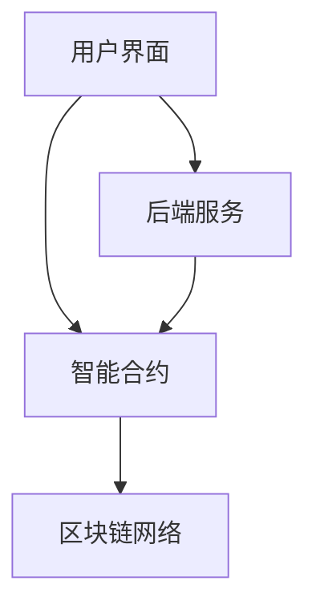

                 

关键词：去中心化众筹平台、区块链、智能合约、创业融资、分布式账本、共识算法、加密技术、项目评估、风险控制、透明性、安全性、参与者激励。

> 摘要：本文深入探讨了去中心化众筹平台作为创业融资创新模式的背景、核心概念、技术架构、算法原理、数学模型以及实际应用，展望了其未来发展趋势和挑战，旨在为创业者、投资者以及技术专家提供有益的参考。

## 1. 背景介绍

随着互联网技术的发展和区块链技术的成熟，去中心化融资模式逐渐受到广泛关注。传统的融资方式往往依赖于中心化的金融机构，存在效率低、成本高、透明度不足等问题。而去中心化众筹平台则通过区块链技术和智能合约实现去中心化的融资过程，为创业项目提供了一种全新的融资模式。

去中心化众筹平台（Decentralized Crowdfunding Platform，简称DCP）是一种基于区块链技术的众筹平台，它利用区块链的不可篡改性和透明性，实现了资金的去中心化管理。与传统众筹平台不同，DCP不再依赖于单一的第三方机构，而是通过智能合约自动执行交易，从而提高了资金流动的效率和透明度。

## 2. 核心概念与联系

### 2.1 去中心化众筹平台的基本概念

去中心化众筹平台的核心概念包括：

- **区块链技术**：DCP基于区块链技术构建，确保了资金流转的透明性和不可篡改性。
- **智能合约**：智能合约自动执行协议条款，确保了资金的正确分配和使用。
- **分布式账本**：分布式账本记录了所有交易记录，保证了交易的透明性和可追溯性。
- **共识算法**：共识算法保证了区块链网络的稳定性和安全性。

### 2.2 去中心化众筹平台的技术架构

去中心化众筹平台的技术架构通常包括以下部分：

- **用户界面**：提供给用户注册、项目浏览、投资、交易等操作的界面。
- **区块链网络**：由多个节点组成，共同维护区块链的完整性。
- **智能合约**：用于自动执行交易和协议条款。
- **后端服务**：包括数据库、API接口、数据处理等。

### 2.3 去中心化众筹平台的 Mermaid 流程图



## 3. 核心算法原理 & 具体操作步骤

### 3.1 算法原理概述

去中心化众筹平台的核心算法主要涉及区块链的共识算法和智能合约的实现。

- **共识算法**：共识算法用于确保区块链网络的稳定性和安全性，常见的共识算法包括工作量证明（PoW）、权益证明（PoS）等。
- **智能合约**：智能合约是基于编程语言编写的，用于自动执行交易和协议条款。

### 3.2 算法步骤详解

#### 3.2.1 用户注册与身份验证

1. 用户在去中心化众筹平台上注册账户。
2. 用户提交身份验证信息，如身份证明、地址证明等。
3. 平台通过智能合约验证用户的身份信息。

#### 3.2.2 项目发起与审核

1. 创业者发起众筹项目，包括项目描述、目标金额、时间限制等。
2. 平台通过智能合约审核项目是否符合规定。
3. 审核通过的项目将在平台上展示。

#### 3.2.3 投资者投资

1. 投资者通过平台浏览项目，选择感兴趣的项目进行投资。
2. 投资者将资金转入智能合约地址，智能合约记录投资信息。

#### 3.2.4 资金分配与管理

1. 项目达到目标金额后，智能合约自动释放资金给创业者。
2. 项目未达到目标金额，智能合约将返还投资者的资金。

### 3.3 算法优缺点

#### 优点

- **去中心化**：去中心化降低了平台的运营成本，提高了资金流动的效率。
- **透明性**：区块链技术保证了交易的透明性和可追溯性。
- **安全性**：共识算法和加密技术确保了系统的安全性。

#### 缺点

- **技术门槛**：对于普通用户来说，使用去中心化众筹平台需要具备一定的技术知识。
- **交易速度**：区块链的交易速度相对较慢，可能影响用户体验。

### 3.4 算法应用领域

去中心化众筹平台在以下领域具有广泛的应用：

- **创业融资**：为初创企业提供了便捷的融资渠道。
- **公益项目**：通过去中心化的方式，提高了公益项目的透明度和公信力。
- **艺术品拍卖**：去中心化众筹平台可以用于艺术品的拍卖，确保交易的公正性和透明性。

## 4. 数学模型和公式

### 4.1 数学模型构建

去中心化众筹平台的数学模型主要包括以下几个部分：

- **资金模型**：描述投资者和创业者的资金流动。
- **风险评估模型**：评估项目的风险。
- **收益模型**：计算投资者的收益。

### 4.2 公式推导过程

- **资金模型**：

  $$ F_t = I_t + R_t - C_t $$

  其中，$F_t$ 表示时间 $t$ 时的总资金，$I_t$ 表示投资者在时间 $t$ 的投资总额，$R_t$ 表示创业者在时间 $t$ 的收益，$C_t$ 表示创业者在时间 $t$ 的成本。

- **风险评估模型**：

  $$ R = \frac{P \times (1 - D)}{L} $$

  其中，$R$ 表示项目的风险，$P$ 表示项目成功的概率，$D$ 表示项目失败的概率，$L$ 表示项目的总成本。

- **收益模型**：

  $$ Y = P \times (1 - R) \times (1 - F) $$

  其中，$Y$ 表示投资者的收益，$P$ 表示项目成功的概率，$R$ 表示项目的风险，$F$ 表示投资者的资金损失概率。

### 4.3 案例分析与讲解

假设一个创业项目，项目成功概率为 80%，失败概率为 20%。项目的总成本为 100 万美元。投资者的投资金额为 10 万美元。

1. **资金模型**：

   $$ F_t = 10 + 0.8 \times 100 - 100 = -10 $$

   在时间 $t$，项目的总资金为负数，表示投资者投入的资金不足以覆盖项目的成本。

2. **风险评估模型**：

   $$ R = \frac{0.8 \times (1 - 0.2)}{100} = 0.064 $$

   项目风险为 6.4%。

3. **收益模型**：

   $$ Y = 0.8 \times (1 - 0.064) \times (1 - 0.1) = 0.544 $$

   投资者的收益为 54.4%。

## 5. 项目实践：代码实例和详细解释说明

### 5.1 开发环境搭建

1. 安装 Ganache：用于创建本地以太坊节点。
2. 安装 Truffle：用于智能合约的编译、部署和测试。
3. 安装 MetaMask：用于以太坊钱包和交易。

### 5.2 源代码详细实现

以下是一个简单的智能合约示例，用于众筹项目的资金管理：

```solidity
pragma solidity ^0.8.0;

contract Crowdfunding {
    address public owner;
    mapping(address => uint256) public contributions;
    uint256 public targetAmount;
    uint256 public deadline;

    event Funded(address investor, uint256 amount);
    event Claimed(address recipient, uint256 amount);

    constructor(uint256 _targetAmount, uint256 _duration) {
        owner = msg.sender;
        targetAmount = _targetAmount;
        deadline = block.timestamp + _duration;
    }

    function contribute() public payable {
        require(block.timestamp < deadline, "Deadline has passed");
        require(msg.value > 0, "Contribution must be greater than 0");
        contributions[msg.sender] += msg.value;
        emit Funded(msg.sender, msg.value);
    }

    function claimFunds() public {
        require(block.timestamp >= deadline, "Deadline has not passed");
        require(contributions[owner] >= targetAmount, "Target amount not reached");
        payable(owner).transfer(address(this).balance);
        emit Claimed(owner, address(this).balance);
    }

    function refund() public {
        require(block.timestamp >= deadline, "Deadline has not passed");
        require(contributions[owner] < targetAmount, "Target amount reached");
        payable(msg.sender).transfer(contributions[msg.sender]);
    }
}
```

### 5.3 代码解读与分析

1. **构造函数**：设置合约的所有者、目标金额和众筹截止时间。
2. **contribute() 函数**：允许投资者向合约地址发送以太币，并将投资金额记录在贡献者映射中。
3. **claimFunds() 函数**：当众筹成功时，所有者可以提取剩余的资金。
4. **refund() 函数**：当众筹失败时，投资者可以提取他们的投资金额。

## 6. 实际应用场景

### 6.1 创业融资

去中心化众筹平台为创业项目提供了低成本、高效的融资渠道。创业者可以在平台上发起项目，直接面向全球投资者进行融资，大大缩短了融资周期。

### 6.2 公益项目

去中心化众筹平台可以提高公益项目的透明度和公信力。捐赠者可以直接追踪资金的流向，确保公益项目的真实性和有效性。

### 6.3 艺术品拍卖

去中心化众筹平台可以用于艺术品的拍卖，确保交易的公正性和透明性。艺术家可以直接面向收藏家进行艺术品拍卖，无需通过传统拍卖行。

## 7. 工具和资源推荐

### 7.1 学习资源推荐

- 《精通区块链》
- 《智能合约开发指南》
- 《区块链技术指南》

### 7.2 开发工具推荐

- Truffle
- MetaMask
- Ganache
- Remix

### 7.3 相关论文推荐

- “Blockchain: A System for Global Inv

