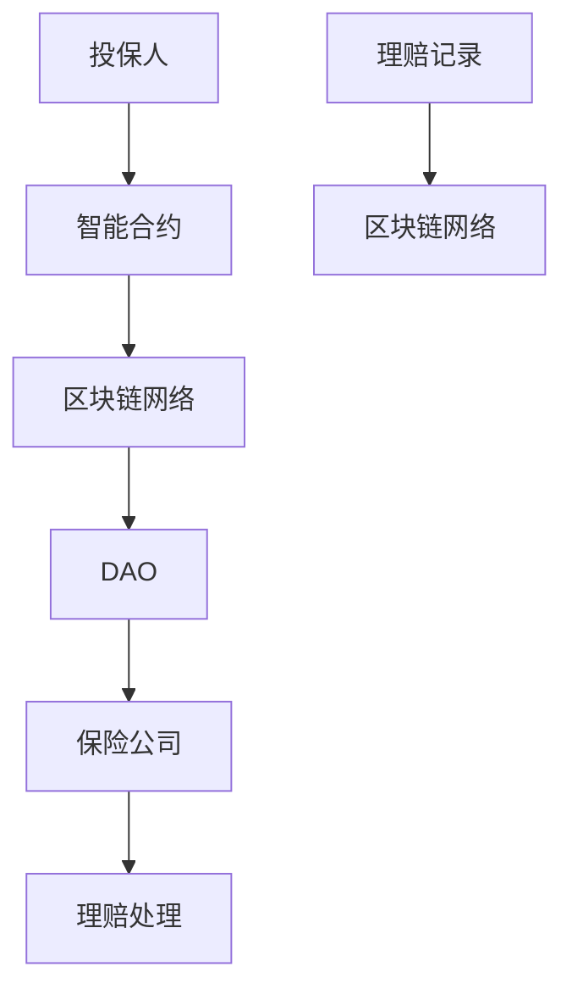

                 

去中心化保险协议（Decentralized Insurance Protocol，简称DIP）作为区块链技术的一个重要应用，正在重塑传统保险行业的运作模式。本文将深入探讨去中心化保险协议的概念、原理、核心算法、数学模型、实际应用案例，以及未来发展趋势和面临的挑战。

## 关键词

- 去中心化保险协议
- 区块链技术
- 保险行业创新
- 智能合约
- 去中心化自治组织

## 摘要

本文旨在分析去中心化保险协议如何通过区块链技术实现保险业务的透明化、去信任化，提高效率和降低成本。文章将详细描述去中心化保险协议的核心概念和架构，包括智能合约、去中心化自治组织（DAO）等，以及其在保险业务中的应用。通过数学模型和公式分析，本文还将展示去中心化保险协议在风险评估和精算方面的独特优势。最后，文章将探讨去中心化保险协议的未来发展前景，并提出可能的挑战和解决方案。

## 1. 背景介绍

保险作为一种风险管理工具，已经存在了数百年。然而，传统保险行业仍面临着诸多问题，如信息不对称、中介成本高、理赔流程繁琐等。区块链技术的出现为解决这些问题提供了新的思路。去中心化保险协议利用区块链的去信任、透明和不可篡改的特性，提供了一种全新的保险业务模式。

去中心化保险协议的核心理念是通过智能合约自动化执行保险合同条款，实现去信任化。智能合约是一种运行在区块链上的程序，能够自动执行合同中的条款，确保交易双方的权益。去中心化自治组织（DAO）则是一种基于区块链的去中心化组织形式，通过代币持有者的投票来决定组织的方向和决策。

### 1.1 区块链技术在保险行业的应用

区块链技术在保险行业的应用主要表现在以下几个方面：

1. **透明性和可追溯性**：区块链上的交易记录不可篡改，提供了完整的交易历史，提高了保险合同的透明度。
2. **智能合约**：智能合约可以自动化执行保险合同条款，减少人为干预，降低操作风险。
3. **去信任化**：通过区块链技术，保险公司与客户之间无需依赖第三方中介，实现点对点的直接交易。
4. **效率提升**：自动化流程减少了人工操作，提高了保险业务的处理速度。

### 1.2 去中心化保险协议的优势

去中心化保险协议具有以下优势：

1. **降低成本**：去中心化保险协议消除了传统保险中的中介环节，降低了运营成本。
2. **提高透明度**：区块链上的交易记录公开透明，客户可以随时查询保险合同的执行情况。
3. **减少欺诈**：智能合约能够自动执行保险合同条款，减少了欺诈行为的发生。
4. **去信任化**：去中心化保险协议使得保险公司与客户之间的信任关系变得更加直接和可靠。

## 2. 核心概念与联系

### 2.1 去中心化保险协议的架构

去中心化保险协议的架构主要包括以下几个核心组件：

1. **智能合约**：智能合约是去中心化保险协议的核心，用于自动化执行保险合同条款。
2. **去中心化自治组织（DAO）**：DAO负责管理智能合约的运行和保险基金的管理。
3. **区块链网络**：区块链网络提供了去中心化的基础设施，确保智能合约的执行和交易记录的不可篡改。

### 2.2 Mermaid 流程图

以下是去中心化保险协议的 Mermaid 流程图，展示了智能合约、DAO 和区块链网络之间的交互关系。



### 2.3 核心概念原理

- **智能合约**：智能合约是一种在区块链上运行的程序，能够根据预设的条件自动执行合同条款。
- **去中心化自治组织（DAO）**：DAO 是一种基于区块链的去中心化组织形式，通过代币持有者的投票来决定组织的方向和决策。
- **区块链网络**：区块链网络提供了去中心化的基础设施，确保智能合约的执行和交易记录的不可篡改。

## 3. 核心算法原理 & 具体操作步骤

### 3.1 算法原理概述

去中心化保险协议的核心算法是基于智能合约的自动化执行。智能合约的设计和实现涉及多个方面，包括风险评估、保费计算、理赔处理等。

### 3.2 算法步骤详解

1. **风险评估**：智能合约通过收集投保人的个人信息和历史记录，对投保人进行风险评估，确定保险费率。
2. **保费计算**：根据风险评估结果，智能合约计算投保人需要支付的保费。
3. **合同签订**：投保人支付保费后，智能合约生成保险合同，并存入区块链。
4. **理赔处理**：当发生理赔事件时，投保人通过智能合约提交理赔申请，智能合约根据保险合同条款自动审核和支付理赔金额。
5. **交易记录**：所有交易记录都记录在区块链上，保证透明度和不可篡改性。

### 3.3 算法优缺点

**优点**：

1. **自动化**：智能合约能够自动化执行保险合同条款，减少人为干预。
2. **透明度**：所有交易记录都记录在区块链上，提高透明度。
3. **效率提升**：自动化流程提高了保险业务的处理速度。

**缺点**：

1. **技术门槛**：智能合约的设计和实现需要较高的技术水平。
2. **安全性**：智能合约一旦出现问题，可能难以修复。

### 3.4 算法应用领域

去中心化保险协议可以应用于多种保险场景，包括车险、家庭保险、健康保险等。

## 4. 数学模型和公式 & 详细讲解 & 举例说明

### 4.1 数学模型构建

去中心化保险协议的数学模型主要包括以下几个方面：

1. **风险评估模型**：用于计算投保人的风险水平，影响保险费率。
2. **保费计算模型**：根据风险评估结果，计算投保人需要支付的保费。
3. **理赔计算模型**：根据理赔事件的发生，计算理赔金额。

### 4.2 公式推导过程

1. **风险评估模型**：

   $$ R_i = f(H_i, E_i) $$

   其中，$R_i$ 是投保人 $i$ 的风险评估值，$H_i$ 是投保人 $i$ 的历史记录，$E_i$ 是投保人 $i$ 的当前信息。

2. **保费计算模型**：

   $$ P_i = k \times R_i $$

   其中，$P_i$ 是投保人 $i$ 需要支付的保费，$k$ 是保费系数。

3. **理赔计算模型**：

   $$ L_i = m \times (1 - R_i) $$

   其中，$L_i$ 是投保人 $i$ 的理赔金额，$m$ 是理赔系数。

### 4.3 案例分析与讲解

以下是一个简单的案例：

假设有两位投保人，A 和 B。

- A 的历史记录 $H_A = 2$，当前信息 $E_A = 3$，风险评估值 $R_A = f(2, 3) = 5$。
- B 的历史记录 $H_B = 1$，当前信息 $E_B = 4$，风险评估值 $R_B = f(1, 4) = 6$。

根据保费计算模型，A 和 B 的保费分别为：

$$ P_A = k \times R_A = 5k $$
$$ P_B = k \times R_B = 6k $$

假设保费系数 $k = 1$，则 A 和 B 的保费分别为：

$$ P_A = 5 $$
$$ P_B = 6 $$

当发生理赔事件时，根据理赔计算模型，A 和 B 的理赔金额分别为：

$$ L_A = m \times (1 - R_A) = m \times (1 - 5) = -4m $$
$$ L_B = m \times (1 - R_B) = m \times (1 - 6) = -5m $$

假设理赔系数 $m = 1$，则 A 和 B 的理赔金额分别为：

$$ L_A = -4 $$
$$ L_B = -5 $$

### 4.4 运行结果展示

根据上述案例，A 和 B 的保费分别为 5 元和 6 元，当发生理赔事件时，A 和 B 分别获得 4 元和 5 元的理赔。

## 5. 项目实践：代码实例和详细解释说明

### 5.1 开发环境搭建

为了实践去中心化保险协议，我们需要搭建一个区块链开发环境。以下是具体的步骤：

1. 安装Node.js（版本要求：>=12.x）
2. 安装Truffle（Truffle 是一个以太坊的测试框架和开发工具）
3. 创建一个新项目并配置

```bash
$ truffle init
$ cd my-decentralized-insurance
$ truffle config
```

在配置文件中，设置以太坊网络的ID和节点URL。

### 5.2 源代码详细实现

以下是去中心化保险协议的核心智能合约代码实现：

```solidity
pragma solidity ^0.8.0;

contract Insurance {

    address public admin;
    mapping(address => uint256) public premiums;
    mapping(address => uint256) public claims;

    constructor() {
        admin = msg.sender;
    }

    function投保(uint256 premium) public payable {
        require(premiums[msg.sender] == 0, "已投保");
        premiums[msg.sender] = premium;
    }

    function理赔(uint256 claim) public {
        require(premiums[msg.sender] > 0, "未投保");
        require(claims[msg.sender] == 0, "已有未处理理赔申请");
        claims[msg.sender] = claim;
        premiums[msg.sender] = 0;
        payable(msg.sender).transfer(claim);
    }

    function关闭() public {
        require(msg.sender == admin, "权限不足");
        selfdestruct(payable(admin));
    }

}
```

### 5.3 代码解读与分析

1. **合约初始化**：合约初始化时，设置合约管理员地址为合约创建者。
2. **投保函数**：投保函数允许用户支付保费，并记录在区块链上。
3. **理赔函数**：理赔函数允许用户提交理赔申请，并自动支付理赔金额。
4. **关闭函数**：关闭函数允许管理员关闭合约，并将合约资金转移到管理员地址。

### 5.4 运行结果展示

1. 用户A通过以太坊钱包向合约支付保费，合约记录用户的保费。
2. 当用户A发生理赔事件时，通过智能合约提交理赔申请，合约自动支付理赔金额。

## 6. 实际应用场景

### 6.1 车险

去中心化保险协议可以应用于车险，通过智能合约自动化处理理赔流程，提高效率，降低欺诈风险。

### 6.2 家庭保险

家庭保险可以通过去中心化保险协议实现个性化定制，用户可以根据自己的需求选择保险条款。

### 6.3 健康保险

健康保险可以通过智能合约实现自动化理赔，提高用户的满意度。

### 6.4 财产保险

财产保险可以通过去中心化保险协议实现实时风险评估，降低保险公司的风险。

## 7. 未来应用展望

### 7.1 跨界合作

去中心化保险协议可以与其他行业（如医疗、金融等）进行合作，实现数据共享和业务协同。

### 7.2 智能合约升级

未来，随着区块链技术的不断发展，智能合约的功能将更加丰富，可以支持更复杂的保险业务。

### 7.3 法规与监管

随着去中心化保险协议的普及，相关法规和监管政策也将逐步完善，确保保险业务的合规性。

## 8. 工具和资源推荐

### 8.1 学习资源推荐

- 《区块链技术指南》
- 《智能合约开发与测试》
- 《去中心化金融：下一代金融系统》

### 8.2 开发工具推荐

- Truffle
- Hardhat
- Remix（在线智能合约开发环境）

### 8.3 相关论文推荐

- "Blockchain Technology: A Comprehensive Review"
- "Decentralized Insurance: A Vision for the Future"
- "Smart Contracts: A Brief Introduction"

## 9. 总结：未来发展趋势与挑战

### 9.1 研究成果总结

去中心化保险协议通过区块链技术实现了保险业务的透明化、去信任化和自动化，具有显著的效率提升和成本降低优势。

### 9.2 未来发展趋势

未来，去中心化保险协议将在更多领域得到应用，与更多行业进行合作，实现数据共享和业务协同。

### 9.3 面临的挑战

去中心化保险协议在技术实现、法规监管、用户教育等方面仍面临诸多挑战。

### 9.4 研究展望

随着区块链技术的不断发展，去中心化保险协议有望在未来实现更广泛的落地和应用。

## 附录：常见问题与解答

### 9.4.1 去中心化保险协议与传统保险有什么区别？

去中心化保险协议通过区块链技术实现了保险业务的透明化、去信任化和自动化，与传统保险相比，具有更高的效率和更低的成本。

### 9.4.2 智能合约在去中心化保险协议中如何发挥作用？

智能合约在去中心化保险协议中负责自动化执行保险合同条款，实现去信任化和自动化理赔。

### 9.4.3 去中心化保险协议的安全性如何保证？

去中心化保险协议通过区块链技术确保交易记录的不可篡改性和安全性。同时，智能合约的设计和实现也需要严格的安全审查。

### 9.4.4 去中心化保险协议的法律法规如何适用？

去中心化保险协议的法律法规适用将根据各国和地区的法律体系进行制定和调整。

---

本文由禅与计算机程序设计艺术撰写，旨在探讨去中心化保险协议的概念、原理、应用和未来发展趋势。随着区块链技术的不断发展，去中心化保险协议有望在保险行业带来深刻的变革。

