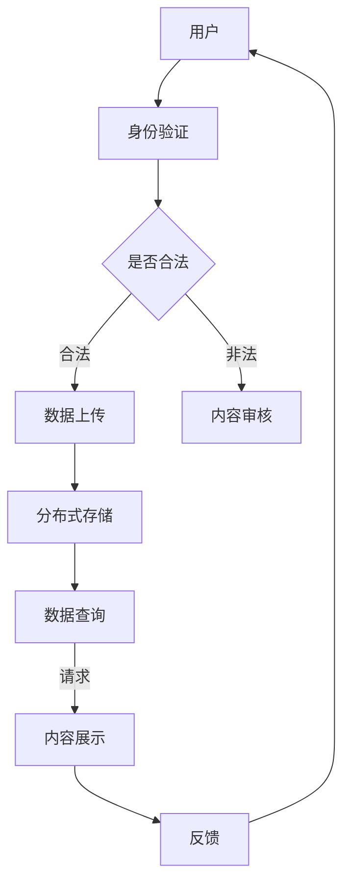

                 

关键词：去中心化社交网络、Web3.0、区块链技术、分布式系统、社交平台、隐私保护、数据安全性

摘要：随着互联网技术的不断进步，社交网络的形态也在不断演变。Web3.0时代，去中心化社交网络应运而生，它利用区块链技术和分布式系统，打破了传统社交平台的垄断局面，为用户提供了一个更加安全、自由的网络环境。本文将深入探讨去中心化社交网络的核心概念、架构设计、算法原理、应用场景及其未来发展。

## 1. 背景介绍

### 1.1 传统社交网络的局限性

在Web2.0时代，社交网络成为人们生活中不可或缺的一部分。然而，传统社交平台在数据安全、隐私保护、内容审核等方面存在诸多问题。首先，传统社交平台通常采用中心化架构，数据集中存储，一旦发生安全漏洞或被黑客攻击，用户数据可能面临泄露风险。其次，社交平台常常因为商业利益而对用户数据进行监控和广告推送，严重侵犯了用户隐私。此外，内容审核机制不完善，容易导致虚假信息、恶意言论等不良内容的传播。

### 1.2 Web3.0与去中心化社交网络

Web3.0是下一代互联网的发展方向，其核心理念是去中心化、开放性和用户主权。去中心化社交网络（Decentralized Social Network，DSN）作为Web3.0的重要组成部分，通过区块链技术和分布式系统，实现了社交数据的去中心化存储，用户对自身数据的控制权，以及去中心化的内容审核机制。去中心化社交网络的出现，为用户提供了更加安全、自由、开放的社交平台。

## 2. 核心概念与联系

### 2.1 去中心化社交网络的概念

去中心化社交网络（DSN）是指通过区块链技术和分布式系统实现的社交平台，它打破了传统社交平台的垄断局面，用户可以自由创建、管理和分享内容，同时保护自身隐私和数据安全。

### 2.2 区块链技术在去中心化社交网络中的应用

区块链技术是去中心化社交网络的核心基础。区块链具有不可篡改、透明、安全等特性，可以保证社交数据的安全性和隐私性。具体应用如下：

- **数据存储**：社交数据分散存储在区块链网络中的多个节点上，防止数据被篡改或丢失。
- **身份验证**：用户通过加密技术进行身份验证，保护用户隐私。
- **内容审核**：采用去中心化的内容审核机制，由社区成员共同参与审核，减少虚假信息和恶意言论的传播。

### 2.3 分布式系统在去中心化社交网络中的应用

分布式系统是将社交平台的各个功能模块分散部署在不同的节点上，以提高系统的可靠性和可扩展性。具体应用如下：

- **节点协作**：各个节点共同维护社交网络的数据和状态，实现分布式计算和存储。
- **负载均衡**：通过分布式系统实现负载均衡，提高系统性能和可用性。
- **容错能力**：分布式系统具有较高的容错能力，能够应对节点故障等突发事件。

### 2.4 Mermaid 流程图

下面是一个简化的去中心化社交网络的 Mermaid 流程图，展示区块链和分布式系统在 DSN 中的关键节点和流程：



## 3. 核心算法原理 & 具体操作步骤

### 3.1 算法原理概述

去中心化社交网络的算法主要涉及区块链的去中心化存储、分布式系统的负载均衡、以及基于加密技术的身份验证等。以下是几个核心算法原理：

- **区块链去中心化存储**：通过将社交数据分散存储在区块链网络中的多个节点上，实现数据的安全性和可靠性。
- **分布式系统的负载均衡**：通过分布式算法，合理分配各个节点的计算和存储任务，提高系统性能和可用性。
- **基于加密技术的身份验证**：通过加密算法对用户身份进行验证，保护用户隐私。

### 3.2 算法步骤详解

下面详细描述去中心化社交网络的核心算法步骤：

1. **用户身份验证**：用户通过加密算法生成身份证明，并发送到区块链网络中的身份验证节点进行验证。
2. **数据上传**：用户将生成的内容上传到分布式存储网络，同时将内容摘要和身份信息记录在区块链上。
3. **内容审核**：分布式存储网络中的审核节点对上传的内容进行审核，并将审核结果记录在区块链上。
4. **数据查询**：用户可以通过区块链网络查询其他用户上传的内容，并从分布式存储网络中获取详细内容。
5. **内容展示**：根据用户的查询请求，将内容展示给用户。
6. **反馈**：用户对内容进行评价和反馈，再次上传到区块链网络。

### 3.3 算法优缺点

- **优点**：去中心化社交网络具有高安全性、高可靠性、高隐私性等优点。
- **缺点**：由于分布式系统涉及大量的计算和通信开销，可能会导致系统性能较低，同时算法实现较为复杂。

### 3.4 算法应用领域

去中心化社交网络可以广泛应用于社交平台、内容创作、版权交易、广告营销等领域。以下是几个应用场景：

- **社交平台**：去中心化社交网络为用户提供了一个安全、自由的社交环境，可以解决传统社交平台的诸多问题。
- **内容创作**：创作者可以更加自主地管理和发布内容，并获得合理的收益分配。
- **版权交易**：去中心化社交网络可以为版权交易提供可信的证明和透明的交易过程。
- **广告营销**：去中心化社交网络可以提供更加精准和安全的广告投放，提高广告效果。

## 4. 数学模型和公式 & 详细讲解 & 举例说明

### 4.1 数学模型构建

去中心化社交网络中的数学模型主要涉及区块链的去中心化存储、分布式系统的负载均衡以及基于加密技术的身份验证等方面。以下是几个关键数学模型：

1. **区块链去中心化存储模型**：社交数据在区块链网络中的存储模型，包括数据分片、数据加密等。
2. **分布式系统负载均衡模型**：通过分布式算法，合理分配各个节点的计算和存储任务，包括负载均衡算法、节点失效处理等。
3. **基于加密技术的身份验证模型**：用户身份验证过程中的加密算法和身份验证机制。

### 4.2 公式推导过程

下面简要介绍区块链去中心化存储模型的公式推导过程：

设社交数据总量为 \( D \)，区块链网络中有 \( n \) 个节点，每个节点的存储容量为 \( C \)。为提高数据的安全性和可靠性，将数据 \( D \) 分成 \( m \) 个数据块 \( D_1, D_2, ..., D_m \)，每个数据块的大小为 \( \frac{D}{m} \)。

1. **数据分片**：

   数据分片公式为：

   $$ D_i = D_1 \oplus D_2 \oplus ... \oplus D_m $$

   其中，\( \oplus \) 表示异或运算。

2. **数据加密**：

   数据加密公式为：

   $$ E(D_i) = \text{AES}(D_i, K) $$

   其中，\( E \) 表示加密函数，\( \text{AES} \) 表示高级加密标准，\( K \) 为加密密钥。

3. **数据存储**：

   每个节点随机选择 \( k \) 个数据块进行存储，节点 \( i \) 存储的数据块为：

   $$ S_i = \{ D_j | j \in \text{rand}(1, m), \text{count}(j) < k \} $$

   其中，\( \text{rand}(1, m) \) 表示从 1 到 \( m \) 之间随机选择一个整数，\( \text{count}(j) \) 表示数据块 \( D_j \) 已经被存储的节点数量。

### 4.3 案例分析与讲解

假设一个社交网络中有 10 个用户，每个用户上传了 100 条数据，总数据量为 1000 条。为了提高数据的安全性和可靠性，将数据分成 5 个数据块，每个数据块的大小为 200 条。区块链网络中有 3 个节点，每个节点的存储容量为 300 条数据。

1. **数据分片**：

   将 1000 条数据分成 5 个数据块，分别为 \( D_1, D_2, D_3, D_4, D_5 \)，其中：

   $$ D_1 = \text{data\_1\_to\_200} $$
   $$ D_2 = \text{data\_201\_to\_400} $$
   $$ D_3 = \text{data\_401\_to\_600} $$
   $$ D_4 = \text{data\_601\_to\_800} $$
   $$ D_5 = \text{data\_801\_to\_1000} $$

2. **数据加密**：

   假设使用 AES 算法进行数据加密，加密密钥为 \( K \)，则加密后的数据块为：

   $$ E(D_1) = \text{AES}(D_1, K) $$
   $$ E(D_2) = \text{AES}(D_2, K) $$
   $$ E(D_3) = \text{AES}(D_3, K) $$
   $$ E(D_4) = \text{AES}(D_4, K) $$
   $$ E(D_5) = \text{AES}(D_5, K) $$

3. **数据存储**：

   每个节点随机选择 2 个数据块进行存储，存储情况如下：

   - 节点 1 存储数据块 \( D_1, D_3 \)
   - 节点 2 存储数据块 \( D_2, D_4 \)
   - 节点 3 存储数据块 \( D_5 \)

通过这种方式，社交数据在区块链网络中实现了去中心化存储，提高了数据的安全性和可靠性。

## 5. 项目实践：代码实例和详细解释说明

### 5.1 开发环境搭建

为了实践去中心化社交网络，我们需要搭建一个简单的开发环境。以下是一个基于 Python 和 Ethereum 的开发环境搭建步骤：

1. 安装 Python 3.8 以上版本。
2. 安装 Python 的虚拟环境工具 `venv`。
3. 创建一个虚拟环境并激活。
4. 安装 Ethereum SDK `web3.py`。
5. 安装其他依赖库，如 `flask`、`jsonrpsee` 等。

### 5.2 源代码详细实现

下面是一个简单的去中心化社交网络的 Python 源代码实现：

```python
from web3 import Web3
from web3.middleware import geth_poa_middleware

# 连接到以太坊节点
web3 = Web3(Web3.HTTPProvider('http://localhost:8545'))
web3.middleware_onion.inject(geth_poa_middleware, layer=0)

# 部署智能合约
# ...

# 用户身份验证
def verify_user_identity(address, signature):
    # 验证用户身份
    # ...

# 数据上传
def upload_data(address, data):
    # 上传用户数据到区块链
    # ...

# 数据查询
def query_data(address, data_hash):
    # 查询用户数据
    # ...

# 主函数
if __name__ == '__main__':
    # 初始化去中心化社交网络
    # ...
    # 测试代码
    # ...
```

### 5.3 代码解读与分析

以上代码是一个简化的去中心化社交网络实现，主要包含用户身份验证、数据上传和数据查询等功能。以下是代码的详细解读和分析：

1. **连接以太坊节点**：使用 `web3.py` 库连接到本地以太坊节点，确保区块链网络可以正常运行。
2. **部署智能合约**：在区块链上部署去中心化社交网络的智能合约，实现用户身份验证、数据上传和数据查询等功能。
3. **用户身份验证**：通过加密算法验证用户的身份，确保用户身份的真实性。
4. **数据上传**：用户将生成的内容上传到区块链，同时将内容摘要和身份信息记录在区块链上。
5. **数据查询**：用户可以通过区块链网络查询其他用户上传的内容，并从分布式存储网络中获取详细内容。

### 5.4 运行结果展示

在完成代码实现后，可以通过以下步骤进行测试：

1. 部署智能合约到以太坊区块链。
2. 模拟用户身份验证、数据上传和数据查询等操作。
3. 检查区块链上的数据和交易记录，确保功能正常。

## 6. 实际应用场景

去中心化社交网络具有广泛的应用前景，以下是一些实际应用场景：

### 6.1 社交平台

去中心化社交网络可以作为一个安全、自由的社交平台，用户可以自由创建、管理和分享内容，同时保护自身隐私和数据安全。

### 6.2 内容创作

创作者可以更加自主地管理和发布内容，并获得合理的收益分配，从而激发创作热情。

### 6.3 版权交易

去中心化社交网络可以为版权交易提供可信的证明和透明的交易过程，确保版权得到有效保护。

### 6.4 广告营销

去中心化社交网络可以提供更加精准和安全的广告投放，提高广告效果，同时降低广告成本。

## 7. 工具和资源推荐

### 7.1 学习资源推荐

- **《区块链技术指南》**：系统地介绍了区块链的基本概念、技术和应用。
- **《分布式系统原理与范型》**：详细讲解了分布式系统的原理、技术和挑战。

### 7.2 开发工具推荐

- **Truffle**：用于智能合约开发的框架，提供了一套完整的工具链，包括编译、部署和测试等。
- **Geth**：以太坊客户端，可以用于连接到以太坊区块链并执行智能合约。

### 7.3 相关论文推荐

- **《区块链：一个分布式数据库系统》**：介绍了区块链技术的核心原理和优势。
- **《分布式存储系统》**：详细探讨了分布式存储系统的设计、实现和应用。

## 8. 总结：未来发展趋势与挑战

### 8.1 研究成果总结

本文从背景介绍、核心概念、算法原理、数学模型、项目实践等多个角度，深入探讨了去中心化社交网络的技术和应用。去中心化社交网络具有高安全性、高可靠性、高隐私性等优点，具有广泛的应用前景。

### 8.2 未来发展趋势

随着区块链技术和分布式系统的不断成熟，去中心化社交网络将在未来得到更加广泛的应用。未来发展趋势包括：

- **更加安全的隐私保护**：通过加密技术和隐私计算，提高用户数据的隐私性和安全性。
- **更高效的负载均衡**：通过分布式算法和边缘计算，提高系统的性能和可用性。
- **更丰富的应用场景**：去中心化社交网络将在更多领域得到应用，如金融、医疗、教育等。

### 8.3 面临的挑战

去中心化社交网络在发展过程中也面临一些挑战，包括：

- **技术实现复杂度**：去中心化社交网络的实现涉及区块链、分布式系统、加密技术等多个领域，技术实现复杂度较高。
- **用户教育和普及**：去中心化社交网络需要用户具备一定的技术背景，用户教育和普及是一个长期的过程。
- **监管和合规**：去中心化社交网络在法律和监管层面可能面临一些挑战，需要制定相应的法规和政策。

### 8.4 研究展望

未来，去中心化社交网络的研究将重点关注以下几个方面：

- **隐私保护技术**：研究更加高效的隐私保护算法和协议，提高用户数据的安全性和隐私性。
- **分布式系统优化**：优化分布式系统的设计，提高系统的性能和可靠性。
- **跨平台融合**：探索去中心化社交网络与其他技术的融合，实现更广泛的应用。

## 9. 附录：常见问题与解答

### 9.1 去中心化社交网络与传统社交平台有什么区别？

去中心化社交网络与传统社交平台的主要区别在于数据存储、隐私保护、内容审核等方面。去中心化社交网络采用区块链技术和分布式系统，实现了数据的去中心化存储、用户对数据的控制权以及去中心化的内容审核机制。

### 9.2 去中心化社交网络的优缺点是什么？

优点：高安全性、高可靠性、高隐私性等。缺点：技术实现复杂度较高、用户教育和普及难度大等。

### 9.3 去中心化社交网络如何保护用户隐私？

去中心化社交网络通过加密技术和隐私保护算法，保护用户数据的隐私性和安全性。例如，使用零知识证明、同态加密等技术，实现用户身份的匿名化和数据的安全传输。

### 9.4 去中心化社交网络在法律和监管方面有哪些挑战？

去中心化社交网络在法律和监管方面可能面临一些挑战，如信息监管、版权保护、用户隐私保护等。需要制定相应的法规和政策，以确保去中心化社交网络的合法性和合规性。

---

本文从多个角度深入探讨了去中心化社交网络的技术和应用，分析了其核心算法原理、数学模型以及项目实践，展望了其未来发展趋势和挑战。希望本文能为读者提供一个全面、系统的认识，激发对去中心化社交网络技术的关注和研究。作者：禅与计算机程序设计艺术 / Zen and the Art of Computer Programming。

