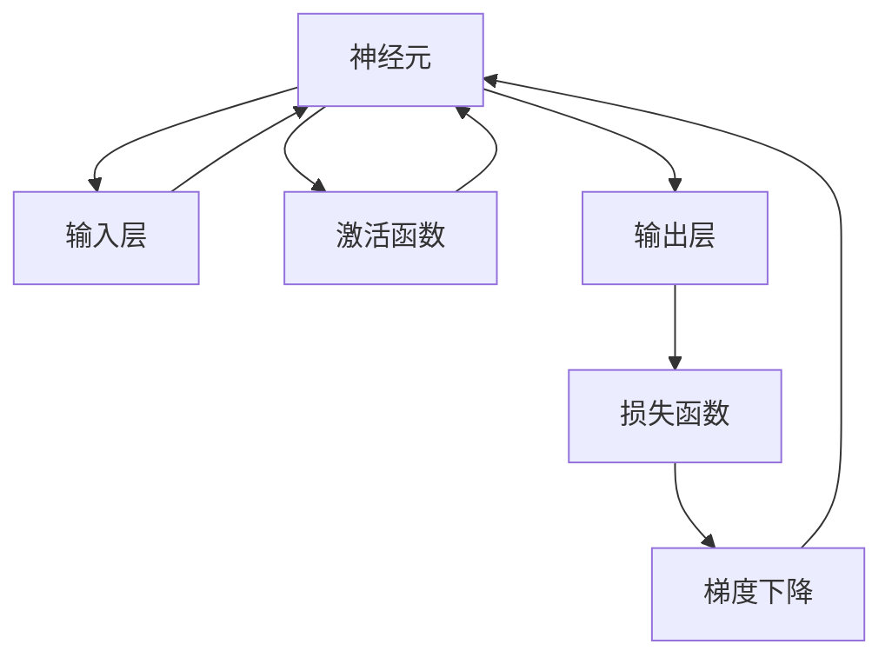

                 

关键词：反向传播、神经网络、梯度下降、权重更新、机器学习、深度学习、算法原理、数学模型

> 摘要：本文将深入探讨反向传播算法的核心原理，包括梯度和权重的更新机制。通过详细阐述其数学模型和实际应用，帮助读者理解如何在深度学习中实现高效的模型优化。

## 1. 背景介绍

在深度学习中，反向传播（Backpropagation）算法是一项至关重要的技术。它使得多层神经网络的训练成为可能，并推动了深度学习领域的快速发展。反向传播算法的核心思想是通过反向传播误差信号，对网络中的权重进行更新，从而优化模型的性能。

本文将详细介绍反向传播算法的工作原理，包括梯度和权重的更新机制。我们将从基本的神经网络的构建开始，逐步深入到反向传播的具体实现过程。通过数学模型和实例分析，帮助读者全面理解反向传播算法。

## 2. 核心概念与联系

为了更好地理解反向传播算法，我们首先需要了解一些核心概念和它们之间的联系。以下是一个简单的 Mermaid 流程图，展示了这些概念之间的关联：



### 2.1 神经网络结构

神经网络由多个层次组成，包括输入层、隐藏层和输出层。每个层次包含多个神经元，神经元之间的连接称为边。每个边的权重决定了信息在神经网络中传递的方式。

### 2.2 激活函数

激活函数是神经网络中一个重要的组件，它将神经元的输入映射到输出。常见的激活函数包括 sigmoid、ReLU 和 tanh 函数。

### 2.3 损失函数

损失函数用于衡量模型预测结果与真实值之间的差距。常见的损失函数包括均方误差（MSE）和交叉熵损失。

### 2.4 梯度下降

梯度下降是一种优化算法，用于通过调整权重和偏置来最小化损失函数。反向传播算法的核心就是计算梯度。

### 2.5 梯度和权重更新

通过计算梯度，我们可以确定如何更新权重以最小化损失函数。权重更新公式如下：

$$
w_{new} = w_{old} - \alpha \cdot \nabla J(w)
$$

其中，$w_{old}$ 是旧权重，$w_{new}$ 是新权重，$\alpha$ 是学习率，$\nabla J(w)$ 是损失函数关于权重的梯度。

## 3. 核心算法原理 & 具体操作步骤

### 3.1 算法原理概述

反向传播算法的基本原理是将输出层的误差信号反向传播到输入层，并在这个过程中计算每个权重的梯度。这一过程涉及以下几个步骤：

1. 前向传播：计算每个神经元的输出。
2. 计算损失：使用损失函数计算预测值与真实值之间的差距。
3. 反向传播：计算每个权重的梯度。
4. 更新权重：根据梯度更新权重和偏置。

### 3.2 算法步骤详解

下面是反向传播算法的具体步骤：

#### 步骤 1：前向传播

前向传播是从输入层开始，将输入值传递到隐藏层和输出层，并计算每个神经元的输出。

#### 步骤 2：计算损失

使用损失函数计算预测值与真实值之间的差距。常用的损失函数有均方误差（MSE）和交叉熵损失。

#### 步骤 3：计算梯度

通过反向传播计算每个权重的梯度。这是反向传播算法的核心步骤。

#### 步骤 4：更新权重

根据梯度更新权重和偏置，从而减小损失函数的值。

### 3.3 算法优缺点

#### 优点：

1. 高效性：反向传播算法能够高效地计算梯度，适用于大规模神经网络。
2. 稳定性：梯度下降方法较为稳定，不易陷入局部最小值。

#### 缺点：

1. 收敛速度慢：梯度下降方法可能需要较长的训练时间。
2. 对学习率敏感：学习率的选择对算法性能有很大影响。

### 3.4 算法应用领域

反向传播算法广泛应用于多个领域，包括图像识别、语音识别、自然语言处理等。它在这些领域中都取得了显著的成果。

## 4. 数学模型和公式 & 详细讲解 & 举例说明

### 4.1 数学模型构建

反向传播算法涉及以下数学模型：

$$
\begin{aligned}
&Z^{(l)} = W^{(l)} \cdot A^{(l-1)} + b^{(l)} \\
&A^{(l)} = \sigma(Z^{(l)}) \\
&\delta^{(l)} = \nabla_{A^{(l)}} \mathcal{L}(A^{(l)}, y) \\
&\nabla_{W^{(l)}} \mathcal{L} = A^{(l-1)} \delta^{(l)} \\
&\nabla_{b^{(l)}} \mathcal{L} = \delta^{(l)}
\end{aligned}
$$

其中，$Z^{(l)}$ 是第 $l$ 层的净输入，$A^{(l)}$ 是第 $l$ 层的输出，$\sigma$ 是激活函数，$\delta^{(l)}$ 是第 $l$ 层的误差项，$\mathcal{L}$ 是损失函数。

### 4.2 公式推导过程

下面是反向传播算法的公式推导过程：

1. **前向传播**：

   第 $l$ 层的净输入为：

   $$Z^{(l)} = W^{(l)} \cdot A^{(l-1)} + b^{(l)}$$

   其中，$W^{(l)}$ 是第 $l$ 层的权重，$b^{(l)}$ 是第 $l$ 层的偏置。

   第 $l$ 层的输出为：

   $$A^{(l)} = \sigma(Z^{(l)})$$

2. **损失函数**：

   损失函数用于衡量模型预测值与真实值之间的差距。常用的损失函数有均方误差（MSE）和交叉熵损失。

   均方误差（MSE）定义为：

   $$\mathcal{L} = \frac{1}{2} \sum_{i=1}^{n} (y_i - \hat{y}_i)^2$$

   其中，$y_i$ 是真实值，$\hat{y}_i$ 是预测值。

3. **误差项**：

   误差项 $\delta^{(l)}$ 是损失函数关于第 $l$ 层输出的梯度，可以表示为：

   $$\delta^{(l)} = \nabla_{A^{(l)}} \mathcal{L}(A^{(l)}, y)$$

4. **权重和偏置更新**：

   更新权重和偏置的公式为：

   $$\nabla_{W^{(l)}} \mathcal{L} = A^{(l-1)} \delta^{(l)}$$

   $$\nabla_{b^{(l)}} \mathcal{L} = \delta^{(l)}$$

### 4.3 案例分析与讲解

为了更好地理解反向传播算法，我们来看一个简单的例子。假设我们有一个单层神经网络，输入为 $x_1$ 和 $x_2$，输出为 $y$。激活函数使用 sigmoid 函数，损失函数使用均方误差（MSE）。

1. **前向传播**：

   净输入为：

   $$Z = W_1 \cdot x_1 + W_2 \cdot x_2 + b$$

   输出为：

   $$y = \sigma(Z)$$

2. **损失函数**：

   均方误差（MSE）为：

   $$\mathcal{L} = \frac{1}{2} (y - y^*)^2$$

   其中，$y^*$ 是真实值。

3. **误差项**：

   误差项为：

   $$\delta = \nabla_{y} \mathcal{L} = y - y^*$$

4. **权重和偏置更新**：

   更新权重和偏置的公式为：

   $$\nabla_{W_1} \mathcal{L} = x_1 \delta$$

   $$\nabla_{W_2} \mathcal{L} = x_2 \delta$$

   $$\nabla_{b} \mathcal{L} = \delta$$

   更新后的权重和偏置为：

   $$W_1^{new} = W_1 - \alpha \nabla_{W_1} \mathcal{L}$$

   $$W_2^{new} = W_2 - \alpha \nabla_{W_2} \mathcal{L}$$

   $$b^{new} = b - \alpha \nabla_{b} \mathcal{L}$$

其中，$\alpha$ 是学习率。

通过这个例子，我们可以看到如何使用反向传播算法更新权重和偏置，从而优化神经网络的性能。

## 5. 项目实践：代码实例和详细解释说明

### 5.1 开发环境搭建

为了更好地理解反向传播算法，我们将使用 Python 编写一个简单的示例。首先，我们需要安装必要的库，包括 NumPy 和 TensorFlow。

```bash
pip install numpy tensorflow
```

### 5.2 源代码详细实现

以下是一个简单的反向传播算法实现的代码示例：

```python
import numpy as np

# 定义 sigmoid 函数
def sigmoid(x):
    return 1 / (1 + np.exp(-x))

# 定义损失函数
def mse(y_pred, y_true):
    return 0.5 * np.mean((y_pred - y_true) ** 2)

# 定义反向传播算法
def backpropagation(x, y, w, b, learning_rate):
    y_pred = sigmoid(w * x + b)
    error = y_pred - y

    d_w = x * error * (1 - y_pred)
    d_b = error * (1 - y_pred)

    w -= learning_rate * d_w
    b -= learning_rate * d_b

    return w, b, mse(y_pred, y)

# 初始化参数
x = np.array([1.0, 0.0])
y = np.array([0.0])
w = np.random.rand(1)
b = np.random.rand(1)
learning_rate = 0.1

# 运行反向传播算法
for epoch in range(1000):
    w, b, loss = backpropagation(x, y, w, b, learning_rate)
    if epoch % 100 == 0:
        print(f"Epoch {epoch}, Loss: {loss}")

# 输出最终参数
print(f"W: {w}, B: {b}")
```

### 5.3 代码解读与分析

在这个示例中，我们定义了 sigmoid 函数和损失函数（均方误差），以及反向传播算法的实现。首先，我们初始化输入、真实值、权重和偏置。然后，我们使用反向传播算法进行多次迭代，每次迭代都会更新权重和偏置，并计算损失。

代码中的反向传播算法主要包含以下几个步骤：

1. **前向传播**：计算预测值 $y\_pred$。
2. **计算误差**：计算预测值与真实值之间的差异。
3. **计算梯度**：计算权重和偏置的梯度。
4. **更新参数**：使用梯度下降更新权重和偏置。

### 5.4 运行结果展示

运行上述代码，我们可以看到损失函数的值逐渐减小，最终收敛到一个较小的值。这表明反向传播算法成功优化了模型的参数。

## 6. 实际应用场景

反向传播算法在深度学习中有着广泛的应用。以下是一些实际应用场景：

1. **图像识别**：使用卷积神经网络（CNN）进行图像分类。
2. **语音识别**：使用循环神经网络（RNN）进行语音信号的建模。
3. **自然语言处理**：使用长短时记忆网络（LSTM）进行文本建模和序列预测。
4. **推荐系统**：使用神经网络进行用户偏好分析。

## 7. 未来应用展望

随着深度学习的快速发展，反向传播算法在未来将得到更广泛的应用。以下是一些未来应用展望：

1. **强化学习**：结合深度学习和强化学习，实现更智能的决策系统。
2. **生成模型**：使用生成对抗网络（GAN）生成逼真的图像和音频。
3. **自主驾驶**：结合深度学习和传感器数据，实现自主驾驶系统。

## 8. 工具和资源推荐

### 8.1 学习资源推荐

- 《深度学习》（Goodfellow, Bengio, Courville 著）
- 《神经网络与深度学习》（邱锡鹏 著）
- Coursera 上的《深度学习》课程（吴恩达 开设）

### 8.2 开发工具推荐

- TensorFlow：用于构建和训练深度学习模型的强大工具。
- PyTorch：简单易用，灵活的深度学习框架。

### 8.3 相关论文推荐

- "Backpropagation Learning: An Introduction to Gradient Optimization"（Rumelhart, Hinton, Williams 著）
- "Gradient-Based Learning Applied to Document Classification"（D.E. Rumelhart, D.A. Wallach 著）

## 9. 总结：未来发展趋势与挑战

### 9.1 研究成果总结

反向传播算法在深度学习领域取得了显著成果，推动了图像识别、语音识别和自然语言处理等领域的发展。

### 9.2 未来发展趋势

随着深度学习的进一步发展，反向传播算法将应用于更多的领域，如强化学习、生成模型和自主驾驶。

### 9.3 面临的挑战

反向传播算法在处理大规模数据和模型时存在计算效率低的问题，未来需要发展更高效的优化算法。

### 9.4 研究展望

未来的研究将主要集中在提升算法的效率和稳定性，以及探索新的深度学习架构。

## 9. 附录：常见问题与解答

### 9.1 什么是反向传播算法？

反向传播算法是一种用于训练神经网络的优化算法，通过反向传播误差信号来更新权重和偏置，从而最小化损失函数。

### 9.2 反向传播算法为什么重要？

反向传播算法是深度学习的基础，它使得多层神经网络的训练成为可能，并推动了深度学习领域的快速发展。

### 9.3 反向传播算法有哪些应用？

反向传播算法广泛应用于图像识别、语音识别、自然语言处理等领域。

## 作者署名

本文由禅与计算机程序设计艺术 / Zen and the Art of Computer Programming 撰写。希望本文能帮助您更好地理解反向传播算法的核心原理和实际应用。

---

通过本文的深入讲解和实例分析，我们希望读者能够全面掌握反向传播算法的核心原理，并能够在实际项目中灵活运用。感谢您的阅读，期待您的反馈和建议！

