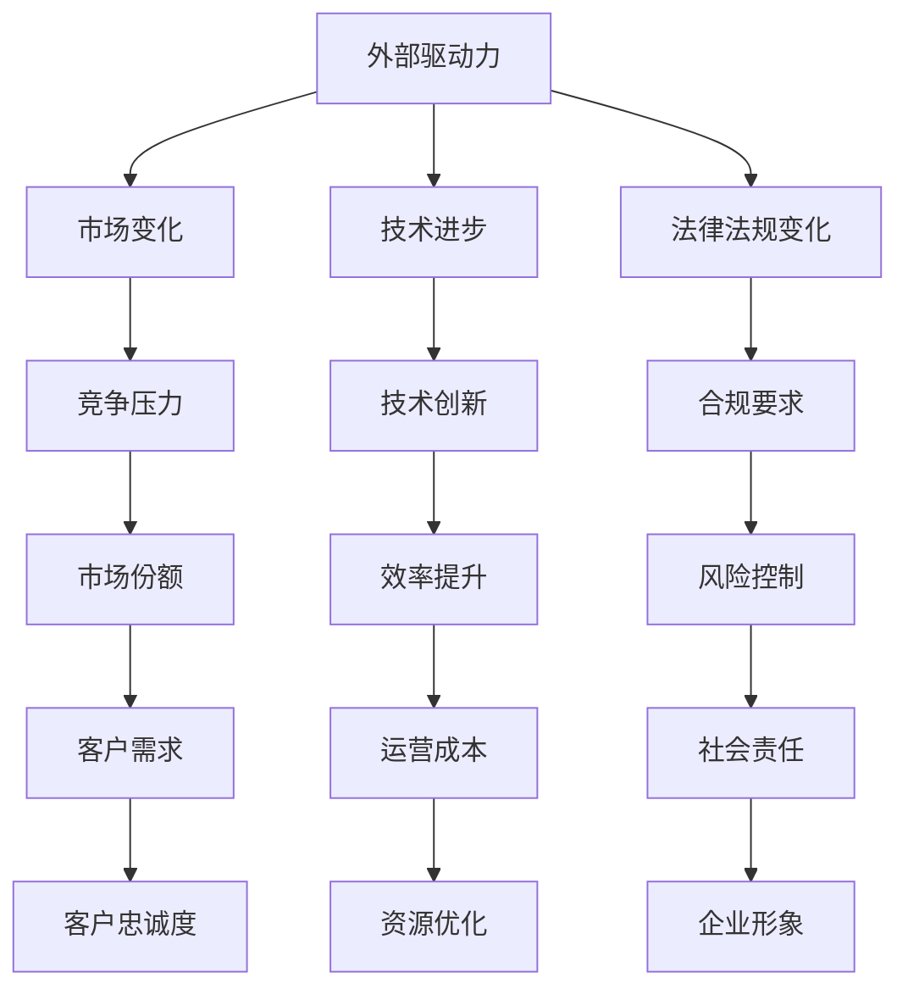
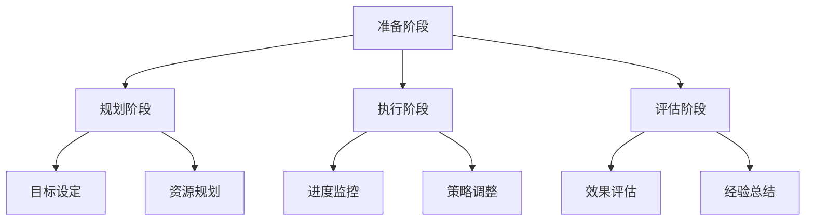

                 

关键词：变革管理、组织转型、策略、实践、方法论、文化

## 摘要

本文旨在探讨变革管理的核心概念、策略和实践，旨在为组织在转型过程中提供一套系统的指导原则。变革管理不仅仅是应对技术变革的工具，更是引领组织在复杂多变的环境中持续发展的艺术。通过分析变革管理的理论框架、实际操作步骤和成功案例，本文将帮助读者理解如何有效地引导组织实现转型，并应对未来可能出现的挑战。

## 1. 背景介绍

在当今全球化的商业环境中，技术创新、市场需求的变化以及政治经济形势的波动，使得组织必须不断地适应和调整。因此，变革管理成为企业生存和发展的关键因素。然而，变革并不是一蹴而就的，它涉及到组织结构、文化、流程等多个方面，需要系统的策略和细致的执行。

变革管理的历史可以追溯到20世纪中叶，当时企业开始意识到变革的重要性。尽管早期的研究和实践主要集中在制造业和制造业的自动化上，但随着时间的推移，变革管理的应用范围逐渐扩大到服务业、金融业等多个领域。现代变革管理理论不仅涵盖了组织层面的变革，还包括个人层面的转变，即如何让员工适应新的工作环境和流程。

## 2. 核心概念与联系

### 2.1 变革的驱动力

变革的驱动力可以归纳为外部和内部因素。外部驱动力包括市场变化、技术进步、法律法规变化等。内部驱动力则来源于组织内部的战略调整、管理需求、员工素质提升等。以下是一个用Mermaid绘制的流程图，展示了变革的驱动力及其相互关系：



### 2.2 变革的类型

变革可以分为以下几种类型：

- **渐进式变革**：逐步调整，减少对组织的冲击。
- **革命性变革**：彻底改变，可能涉及重大组织结构调整。
- **计划性变革**：有明确的计划和目标。
- **突发性变革**：由于外部环境变化而突然发生。

### 2.3 变革管理的过程

变革管理通常包括以下几个阶段：

1. **准备阶段**：评估变革的必要性和可行性，建立变革团队。
2. **规划阶段**：制定详细的变革计划，包括目标、时间表、资源分配等。
3. **执行阶段**：实施变革计划，监控进度，调整策略。
4. **评估阶段**：评估变革的效果，总结经验教训。

以下是一个用Mermaid绘制的流程图，展示了变革管理的各个阶段及其关系：



## 3. 核心算法原理 & 具体操作步骤

### 3.1 算法原理概述

变革管理可以被视为一种系统性方法，它包括以下几个核心算法原理：

1. **SWOT分析**：分析组织的优势、劣势、机会和威胁，为变革提供基础。
2. **KPI设定**：设定关键绩效指标，以衡量变革的效果。
3. **BSC模型**：平衡计分卡，从财务、客户、内部业务、学习与成长四个角度评估变革。
4. **变革曲线**：描述个体和组织在适应变革过程中所经历的阶段，包括抗拒、适应、整合。

### 3.2 算法步骤详解

1. **评估现状**：通过SWOT分析评估组织的现状，识别变革的必要性。
2. **制定战略**：基于评估结果，制定变革的战略和计划。
3. **沟通与宣传**：与员工沟通变革的原因、目标和预期效果，消除顾虑。
4. **培训与支持**：提供必要的培训和资源支持，帮助员工适应新的工作环境。
5. **实施变革**：按照计划执行变革，同时持续监控进度和效果。
6. **评估与反馈**：定期评估变革的效果，收集反馈，进行必要的调整。

### 3.3 算法优缺点

**优点**：

- **系统性强**：提供了一套完整的变革管理流程，有助于组织有序地推进变革。
- **灵活性**：根据实际情况调整策略，适应不同的变革情境。
- **持续改进**：通过评估和反馈，不断优化变革过程。

**缺点**：

- **时间成本**：变革管理过程较长，需要较长时间来完成。
- **执行难度**：变革过程中可能面临员工抗拒、资源不足等挑战。

### 3.4 算法应用领域

变革管理算法广泛应用于以下领域：

- **企业转型**：帮助企业在面对市场和技术变化时实现顺利转型。
- **组织重构**：在组织结构调整过程中提供策略和方法。
- **项目管理**：在项目管理中确保项目按计划顺利进行。
- **人力资源管理**：通过变革管理提高员工的工作效率和满意度。

## 4. 数学模型和公式 & 详细讲解 & 举例说明

### 4.1 数学模型构建

在变革管理中，可以使用以下数学模型来描述变革过程：

- **逻辑斯蒂模型**：描述个体和组织在适应变革过程中所经历的阶段。
- **马尔可夫模型**：描述组织在不同状态之间的转变概率。

### 4.2 公式推导过程

**逻辑斯蒂模型**：

$$
P(t) = \frac{1}{1 + e^{-(\ln(P_0) - \ln(k)) \cdot t}}
$$

其中，$P(t)$ 表示个体在时间 $t$ 时的接受程度，$P_0$ 表示初始接受程度，$k$ 表示接受程度的增长速率。

**马尔可夫模型**：

$$
P_{ij}^{(n)} = P_{ij}^{(n-1)} \cdot p_{ij}
$$

其中，$P_{ij}^{(n)}$ 表示组织在时间 $n$ 时处于状态 $i$ 并转移到状态 $j$ 的概率，$p_{ij}$ 表示转移概率矩阵。

### 4.3 案例分析与讲解

以一家传统制造业企业为例，该企业在面对市场和技术变革时，采用了变革管理策略。首先，通过SWOT分析识别了企业的优势（如历史悠久、品牌影响力）、劣势（如生产效率低、技术落后）、机会（如绿色制造、智能制造）和威胁（如市场竞争激烈、政策法规变化）。

接下来，企业制定了详细的变革计划，包括引入先进制造技术、优化生产流程、提升员工技能等。在实施过程中，企业通过定期的培训和沟通，确保员工理解变革的必要性和目标。同时，企业还设置了关键绩效指标（KPI），如生产效率提升百分比、员工满意度等，以衡量变革的效果。

通过一段时间的努力，企业成功实现了变革，生产效率提高了30%，员工满意度提升了15%。这个案例展示了变革管理在组织转型中的重要作用。

## 5. 项目实践：代码实例和详细解释说明

### 5.1 开发环境搭建

为了更好地展示变革管理的具体操作步骤，我们使用Python编写了一个简单的代码实例。以下是开发环境的搭建步骤：

1. 安装Python（版本3.8以上）。
2. 安装必要的库，如`numpy`、`matplotlib`等。
3. 创建一个名为`change_management.py`的Python文件。

### 5.2 源代码详细实现

```python
import numpy as np
import matplotlib.pyplot as plt

# 逻辑斯蒂模型参数
P0 = 0.5
k = 0.1

# 马尔可夫模型参数
transition_matrix = np.array([[0.5, 0.5], [0.4, 0.6]])

# 计算逻辑斯蒂模型的接受程度
def logistic_model(t):
    return 1 / (1 + np.exp(-((np.log(P0) - np.log(k)) * t)))

# 计算马尔可夫模型的概率
def markov_model(n):
    probability_matrix = np.eye(2)
    for _ in range(n):
        probability_matrix = np.dot(probability_matrix, transition_matrix)
    return probability_matrix

# 绘制逻辑斯蒂模型曲线
t = np.linspace(0, 10, 100)
P_t = logistic_model(t)
plt.plot(t, P_t, label='Logistic Model')
plt.xlabel('Time')
plt.ylabel('Acceptance Rate')
plt.legend()
plt.show()

# 绘制马尔可夫模型概率矩阵
n = 5
P_n = markov_model(n)
print("Markov Model Probability Matrix after {} steps:".format(n))
print(P_n)
```

### 5.3 代码解读与分析

这段代码首先导入了`numpy`和`matplotlib`库，用于数学计算和绘图。然后，我们定义了逻辑斯蒂模型和马尔可夫模型的参数。

`logistic_model`函数用于计算逻辑斯蒂模型在给定时间点的接受程度。`markov_model`函数用于计算马尔可夫模型在给定步数后的概率矩阵。

在代码的最后，我们使用`plt`绘制了逻辑斯蒂模型曲线，并打印了马尔可夫模型在5步后的概率矩阵。

### 5.4 运行结果展示

运行代码后，会生成一个逻辑斯蒂模型曲线的图像，展示了个体在适应变革过程中接受程度的增长。同时，会输出马尔可夫模型在5步后的概率矩阵，展示了组织在不同状态之间的转变概率。

## 6. 实际应用场景

### 6.1 企业数字化转型

随着数字技术的快速发展，企业数字化转型成为变革管理的重要应用场景。通过引入大数据、人工智能、云计算等新技术，企业可以实现业务流程的优化、运营效率的提升、客户体验的改善等。

### 6.2 人力资源管理变革

人力资源管理是企业的核心职能之一，通过变革管理，企业可以优化招聘流程、提升员工培训效果、改善绩效管理等，从而提高整体人力资源管理水平。

### 6.3 产品创新与研发

在产品创新和研发过程中，变革管理可以帮助企业快速响应市场变化，调整研发方向，提高产品竞争力。

## 6.4 未来应用展望

随着技术的不断进步，变革管理在未来将有更广泛的应用场景。例如，在区块链、物联网、人工智能等领域，变革管理可以帮助组织更好地适应新的技术环境和业务模式。同时，随着全球化进程的加快，跨国企业的变革管理也将面临更多的挑战和机遇。

## 7. 工具和资源推荐

### 7.1 学习资源推荐

- 《变革之舞：领导变革的智慧》
- 《变革管理：领导力、组织学习与实践》
- 《组织变革理论：理论与实践指南》

### 7.2 开发工具推荐

- Python：用于数据处理和分析。
- Jupyter Notebook：用于编写和运行Python代码。
- Mermaid：用于绘制流程图。

### 7.3 相关论文推荐

- "Change Management: A Practical Guide for Leaders and Managers"
- "The Role of Leadership in Change Management: A Literature Review"
- "The Impact of Change Management on Organizational Performance: A Meta-Analytic Review"

## 8. 总结：未来发展趋势与挑战

### 8.1 研究成果总结

本文系统性地探讨了变革管理的核心概念、策略和实践，通过案例分析展示了变革管理在组织转型中的重要作用。同时，本文还介绍了数学模型和代码实例，为读者提供了实际操作的方法和工具。

### 8.2 未来发展趋势

随着技术的不断进步和全球化的加速，变革管理将在更广泛的领域得到应用。未来，变革管理将更加注重个体和组织的互动，以及技术变革对组织影响的深入分析。

### 8.3 面临的挑战

变革管理在应用过程中将面临一系列挑战，如员工抗拒、资源不足、时间成本等。因此，未来的研究需要更加关注如何提高变革管理的有效性，减少变革过程中的阻力。

### 8.4 研究展望

未来的研究可以从以下几个方面展开：

- 探索变革管理在不同行业和领域的应用模式。
- 分析技术变革对组织结构和文化的影响。
- 研究变革管理在不同文化和组织环境中的适应性。

## 9. 附录：常见问题与解答

### 9.1 什么是变革管理？

变革管理是一种系统性方法，旨在帮助组织在面临外部和内部变革时，有效地应对和适应，以实现持续发展。

### 9.2 变革管理有哪些核心概念？

变革管理的核心概念包括变革驱动力、变革类型、变革过程等。

### 9.3 变革管理如何应用在人力资源管理中？

变革管理可以帮助企业优化招聘流程、提升员工培训效果、改善绩效管理等，从而提高整体人力资源管理水平。

### 9.4 变革管理中如何处理员工抗拒？

通过有效的沟通、提供必要的培训和支持，以及建立合理的激励机制，可以帮助员工理解变革的必要性和目标，减少抗拒。

### 9.5 变革管理的未来研究方向是什么？

未来的研究可以从以下几个方面展开：探索变革管理在不同行业和领域的应用模式，分析技术变革对组织结构和文化的影响，研究变革管理在不同文化和组织环境中的适应性。作者：禅与计算机程序设计艺术 / Zen and the Art of Computer Programming
----------------------------------------------------------------

以上就是本文的完整内容。通过系统性地探讨变革管理的核心概念、策略和实践，本文旨在为组织在转型过程中提供一套系统的指导原则。希望本文能够为读者在变革管理领域提供有价值的参考和启示。

