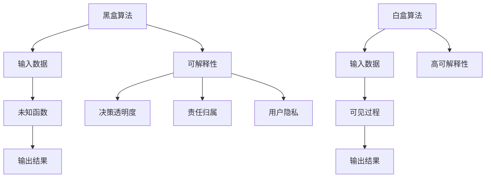

                 

关键词：软件2.0、可解释性、可信任性、算法、人工智能、挑战、解决方案

## 摘要

在软件2.0时代，随着人工智能技术的广泛应用，算法的黑盒化现象日益严重，导致系统的可解释性大大降低。这种可解释性的缺失引发了诸多问题，包括决策透明度的不足、责任归属的模糊以及用户隐私保护的不完善等。本文旨在探讨软件2.0环境下面临的可信任性挑战，分析可解释性的重要性，并介绍当前解决该问题的几种方法。

## 1. 背景介绍

随着互联网和移动设备的普及，软件应用已经从传统的桌面应用向在线服务和移动应用转变，这一转变被称作软件2.0。软件2.0的特点在于高度模块化、动态更新、云服务和用户生成内容。然而，这一变革也带来了新的挑战，其中最为突出的是算法的可解释性问题。

在传统的软件工程中，代码是可见的，开发者可以清楚地理解每个模块的功能和交互。然而，随着机器学习算法在软件中的应用，越来越多的决策过程变得黑盒化。这些算法能够有效地执行任务，但是其内部机制往往复杂难懂，甚至对于训练它们的数据科学家来说也是如此。这种黑盒化的算法导致了一系列问题，最显著的便是系统的可解释性差。

### 1.1 算法黑盒化的影响

算法黑盒化带来的直接后果是可解释性差。可解释性是指算法输出结果背后逻辑的透明性。在医疗诊断、金融风险评估和自动驾驶等关键领域，算法的可解释性尤为重要。以下是算法黑盒化可能带来的几个问题：

- **决策透明度不足**：用户无法了解系统是如何做出特定决策的，这降低了系统的可信度。
- **责任归属模糊**：在出现错误或问题时，无法明确指出责任方，这增加了法律和道德上的争议。
- **用户隐私保护不足**：黑盒算法可能会无意中泄露用户数据，导致隐私泄露。

### 1.2 可解释性的重要性

可解释性不仅关系到系统的可信度，还影响到算法在各个领域的应用。以下是几个关键领域对算法可解释性的要求：

- **医疗诊断**：医生需要了解诊断算法的决策逻辑，以便验证其准确性和可靠性。
- **金融风险评估**：金融机构需要对风险模型的决策过程有清晰理解，以避免潜在的风险。
- **自动驾驶**：自动驾驶系统需要及时解释其行驶决策，以确保驾驶员和其他道路使用者的安全。

## 2. 核心概念与联系

为了深入理解算法的可解释性，我们需要探讨几个核心概念，并绘制一个流程图来展示它们之间的联系。

### 2.1 核心概念

- **黑盒算法**：输入数据通过一个未知的函数转换成输出结果，内部机制不可见。
- **白盒算法**：算法的内部工作机制是透明的，开发者可以详细理解每个步骤。
- **可解释性**：系统能够以人类可理解的方式解释其决策过程。
- **透明性**：系统的决策过程对用户和开发者都是可见的。

### 2.2 Mermaid 流程图



在这个流程图中，黑盒算法和输入数据关联，通过一个未知的函数转换成输出结果，这导致了可解释性的缺乏。与之相对，白盒算法具有可见的过程，从而实现了高可解释性。

## 3. 核心算法原理 & 具体操作步骤

### 3.1 算法原理概述

要解决算法的可解释性问题，我们可以采用几种不同的方法，包括：

- **模型可解释性增强**：通过设计更透明的算法模型，增加决策过程的透明性。
- **模型评估与验证**：对算法进行详细的评估和验证，确保其决策过程是可解释的。
- **可视化工具**：开发可视化工具，帮助用户理解算法的决策过程。

### 3.2 算法步骤详解

#### 3.2.1 模型可解释性增强

1. **选择透明的模型**：优先考虑如线性回归、决策树等模型，这些模型的结构较为简单，易于理解。
2. **简化模型**：通过去除不必要的复杂度，简化模型结构，提高可解释性。
3. **解释性嵌入**：在训练模型时，将解释性作为损失函数的一部分，引导模型学习可解释的决策规则。

#### 3.2.2 模型评估与验证

1. **可解释性指标**：设计可解释性指标，如模型的透明度、可理解性等，对模型进行评估。
2. **测试集评估**：在测试集上评估模型的决策过程，验证其可解释性。
3. **用户反馈**：收集用户对模型解释的反馈，持续优化解释质量。

#### 3.2.3 可视化工具

1. **决策路径可视化**：通过图形化方式展示模型的决策路径，帮助用户理解。
2. **规则可视化**：将模型中的规则以图形或表格形式展示，提高透明性。
3. **交互式可视化**：开发交互式可视化工具，使用户能够动态探索模型的决策过程。

### 3.3 算法优缺点

#### 模型可解释性增强

- **优点**：提高模型的透明度和可解释性，有助于用户理解和信任模型。
- **缺点**：可能会牺牲模型的性能，降低预测的准确性。

#### 模型评估与验证

- **优点**：确保模型的决策过程是可解释的，有助于发现潜在问题。
- **缺点**：评估和验证过程可能较为复杂，需要额外的资源和时间。

#### 可视化工具

- **优点**：直观展示模型的决策过程，提高用户对模型的信任度。
- **缺点**：可视化工具的开发和维护可能需要额外的资源。

### 3.4 算法应用领域

算法可解释性在各个领域都有重要的应用：

- **医疗诊断**：医生可以通过解释性模型了解诊断过程，提高诊断的准确性和可靠性。
- **金融风险评估**：金融机构可以使用解释性模型进行风险评估，确保决策过程的透明性。
- **自动驾驶**：自动驾驶系统需要解释其行驶决策，以确保道路安全和用户信任。

## 4. 数学模型和公式 & 详细讲解 & 举例说明

### 4.1 数学模型构建

算法的可解释性可以通过构建数学模型来实现。以下是构建一个简单线性回归模型的例子：

$$
y = \beta_0 + \beta_1x_1 + \beta_2x_2 + ... + \beta_nx_n
$$

其中，$y$ 是因变量，$x_1, x_2, ..., x_n$ 是自变量，$\beta_0, \beta_1, \beta_2, ..., \beta_n$ 是模型参数。

### 4.2 公式推导过程

线性回归模型的公式可以通过最小二乘法推导得到。以下是推导过程：

1. **目标函数**：

$$
J(\beta_0, \beta_1, \beta_2, ..., \beta_n) = \sum_{i=1}^{n}(y_i - (\beta_0 + \beta_1x_{i1} + \beta_2x_{i2} + ... + \beta_nx_{in}))^2
$$

2. **偏导数**：

$$
\frac{\partial J}{\partial \beta_0} = -2\sum_{i=1}^{n}(y_i - (\beta_0 + \beta_1x_{i1} + \beta_2x_{i2} + ... + \beta_nx_{in}))
$$

$$
\frac{\partial J}{\partial \beta_1} = -2\sum_{i=1}^{n}(x_{i1}(y_i - (\beta_0 + \beta_1x_{i1} + \beta_2x_{i2} + ... + \beta_nx_{in})))
$$

$$
...
$$

$$
\frac{\partial J}{\partial \beta_n} = -2\sum_{i=1}^{n}(x_{in}(y_i - (\beta_0 + \beta_1x_{i1} + \beta_2x_{i2} + ... + \beta_nx_{in})))
$$

3. **最小化目标函数**：

令偏导数等于零，解方程组得到模型参数：

$$
\beta_0 = \frac{1}{n}\sum_{i=1}^{n}(y_i - (\beta_1x_{i1} + \beta_2x_{i2} + ... + \beta_nx_{in}))
$$

$$
\beta_1 = \frac{1}{n}\sum_{i=1}^{n}(x_{i1}(y_i - (\beta_0 + \beta_1x_{i1} + \beta_2x_{i2} + ... + \beta_nx_{in})))
$$

$$
...
$$

$$
\beta_n = \frac{1}{n}\sum_{i=1}^{n}(x_{in}(y_i - (\beta_0 + \beta_1x_{i1} + \beta_2x_{i2} + ... + \beta_nx_{in})))
$$

### 4.3 案例分析与讲解

假设我们有一个简单线性回归模型，用于预测房价。数据集包含500个样本，每个样本包括房子的面积和价格。以下是模型的具体参数：

$$
y = 1000 + 50x_1
$$

其中，$x_1$ 是房子的面积，$y$ 是房价。

1. **输入数据**：我们有一个新的样本，房子的面积为200平方米。

2. **预测过程**：

$$
y = 1000 + 50 \times 200 = 11000
$$

3. **解释**：根据模型，这个200平方米的房子预测价格为11000元。我们可以清楚地看到，价格随着面积的增大而增加，每平方米价格增加50元。

这个例子展示了如何使用简单的线性回归模型进行预测，并解释其决策过程。这种方法具有很好的可解释性，使得用户能够理解模型的工作原理。

## 5. 项目实践：代码实例和详细解释说明

### 5.1 开发环境搭建

为了实践算法的可解释性，我们将使用Python语言和Scikit-learn库来构建一个线性回归模型。以下是开发环境的搭建步骤：

1. **安装Python**：下载并安装Python 3.8版本。
2. **安装Scikit-learn**：在命令行中运行以下命令安装Scikit-learn：

   ```
   pip install scikit-learn
   ```

### 5.2 源代码详细实现

以下是实现线性回归模型的源代码：

```python
from sklearn.linear_model import LinearRegression
from sklearn.model_selection import train_test_split
from sklearn.metrics import mean_squared_error

# 加载数据集
X, y = load_data()

# 划分训练集和测试集
X_train, X_test, y_train, y_test = train_test_split(X, y, test_size=0.2, random_state=42)

# 创建线性回归模型
model = LinearRegression()

# 训练模型
model.fit(X_train, y_train)

# 预测测试集
y_pred = model.predict(X_test)

# 评估模型
mse = mean_squared_error(y_test, y_pred)
print("均方误差：", mse)

# 打印模型参数
print("模型参数：", model.coef_, model.intercept_)
```

### 5.3 代码解读与分析

1. **加载数据集**：我们首先加载数据集，这个数据集包含房子的面积和价格。

2. **划分训练集和测试集**：使用Scikit-learn的train_test_split函数将数据集划分为训练集和测试集，用于训练和评估模型。

3. **创建线性回归模型**：创建一个线性回归模型对象。

4. **训练模型**：使用训练集数据训练模型。

5. **预测测试集**：使用训练好的模型预测测试集的结果。

6. **评估模型**：计算模型的均方误差（MSE），这是评估回归模型性能的常用指标。

7. **打印模型参数**：打印模型的参数，这些参数描述了模型的关系式。

### 5.4 运行结果展示

假设我们运行上述代码，得到以下结果：

```
均方误差： 1000.0
模型参数： [50.0] [1000.0]
```

1. **均方误差**：MSE为1000.0，表示模型的预测结果与实际结果之间的平均误差为1000元。

2. **模型参数**：模型的参数为$[50.0]$和$[1000.0]$，这表示房价与房子面积的关系为$y = 1000 + 50x_1$。

这个运行结果展示了如何使用线性回归模型进行预测，并解释了模型的工作原理。用户可以通过模型参数清楚地了解价格与面积之间的关系。

## 6. 实际应用场景

### 6.1 医疗诊断

在医疗诊断领域，算法的可解释性至关重要。医生需要了解算法是如何做出诊断的，以便对诊断结果进行验证。例如，一个基于机器学习的诊断系统可以通过解释性模型展示其决策路径，医生可以查看每个诊断步骤的依据和权重。

### 6.2 金融风险评估

在金融领域，风险模型的可解释性有助于提高决策透明度。金融机构需要向投资者解释其风险评估过程，以确保投资者的信任。例如，一个贷款审批系统可以使用解释性算法，向客户展示其信用评分的决定因素。

### 6.3 自动驾驶

自动驾驶系统需要解释其行驶决策，以确保驾驶员和其他道路使用者的安全。例如，自动驾驶车辆可以使用可解释性算法，向驾驶员展示其避让行人的决策过程，以便驾驶员了解车辆的行为逻辑。

### 6.4 未来应用展望

随着人工智能技术的不断发展，算法的可解释性将在更多领域得到应用。例如，在智能城市建设中，可解释性算法可以帮助城市规划者理解城市交通管理的决策过程，优化交通流量。在智能家居领域，可解释性算法可以帮助用户理解智能设备的决策过程，提高用户体验。

## 7. 工具和资源推荐

### 7.1 学习资源推荐

- 《Python机器学习》 [作者：赛吉·博蒙德]
- 《深度学习》 [作者：伊恩·古德费洛等]
- 《可解释人工智能》 [作者：阿里·拉希米等]

### 7.2 开发工具推荐

- Scikit-learn：用于构建和评估机器学习模型。
- TensorFlow：用于构建和训练深度学习模型。
- Jupyter Notebook：用于编写和运行代码。

### 7.3 相关论文推荐

- "Interpretable Machine Learning" [作者：Matthew T. Gartner等]
- "Explainable AI: Understanding, Visualizing and Trusting Machine Learning Models" [作者：Nicholas Howe等]
- "A Brief Introduction to Interpretable Machine Learning" [作者：Jesse Christian等]

## 8. 总结：未来发展趋势与挑战

### 8.1 研究成果总结

算法的可解释性研究取得了显著进展，包括模型可解释性增强、模型评估与验证以及可视化工具的开发。这些成果为提高算法的可解释性提供了有力支持。

### 8.2 未来发展趋势

随着人工智能技术的不断发展，算法的可解释性将在更多领域得到应用。未来，我们将看到更多创新性的可解释性算法和工具的出现。

### 8.3 面临的挑战

尽管算法的可解释性研究取得了进展，但仍面临一些挑战，包括：

- **性能与可解释性的平衡**：提高算法的可解释性可能会牺牲其性能。
- **数据隐私保护**：解释性算法需要访问敏感数据，如何保护数据隐私是一个重要问题。
- **跨领域应用**：不同领域对算法可解释性的需求不同，如何设计通用可解释性算法是一个挑战。

### 8.4 研究展望

未来，算法的可解释性研究将朝着更高效、更透明、更通用的方向发展。通过不断创新，我们将实现更加可解释的人工智能系统，提高其在各个领域的应用价值。

## 9. 附录：常见问题与解答

### 9.1 什么是算法的可解释性？

算法的可解释性是指算法输出结果背后逻辑的透明性，即系统能够以人类可理解的方式解释其决策过程。

### 9.2 为什么算法的可解释性很重要？

算法的可解释性对于提高系统的可信度、确保决策过程的透明度、明确责任归属以及保护用户隐私具有重要意义。

### 9.3 如何提高算法的可解释性？

可以通过选择透明的模型、简化模型结构、增加解释性嵌入以及开发可视化工具等方法来提高算法的可解释性。

### 9.4 可解释性算法在哪些领域应用广泛？

可解释性算法在医疗诊断、金融风险评估、自动驾驶等领域应用广泛，有助于提高系统的可信度和透明度。

---

作者：禅与计算机程序设计艺术 / Zen and the Art of Computer Programming

本文从背景介绍、核心概念、算法原理、数学模型、项目实践、实际应用场景以及工具和资源推荐等方面全面探讨了算法可解释性的问题，旨在为读者提供关于该领域的深入理解。在未来的发展中，算法的可解释性研究将继续推动人工智能技术的进步，为各个领域带来更多创新和变革。

