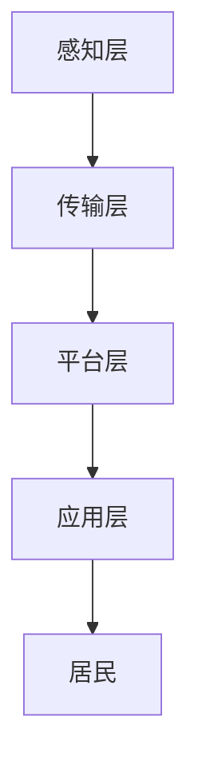

                 

 在未来，智慧社区服务平台将如何改变我们的生活方式？58同城作为中国领先的分类信息平台，正致力于构建一个智慧、便捷、高效的社区服务平台。本文将围绕58同城2025智慧社区服务平台架构师社招面试题，从背景介绍、核心概念、算法原理、数学模型、项目实践、应用场景、未来展望等方面进行深入探讨，旨在为读者提供一个全面的视角，了解智慧社区服务平台的架构设计与实现。

## 关键词

- 58同城
- 智慧社区
- 服务平台
- 架构设计
- 面试题
- 算法
- 数学模型
- 项目实践

## 摘要

本文围绕58同城2025智慧社区服务平台，通过架构师社招面试题，详细解析了智慧社区服务平台的核心概念、算法原理、数学模型及项目实践。文章旨在为读者提供一种全新的视角，探讨智慧社区服务平台在未来的发展趋势与挑战，为相关领域的研究与应用提供参考。

### 1. 背景介绍

#### 1.1 智慧社区的定义与发展历程

智慧社区是指利用物联网、云计算、大数据、人工智能等现代信息技术，实现对社区服务、设施、环境等的智能化管理和优化，以提高居民生活质量、促进社区可持续发展的一种新型社区形态。智慧社区的发展历程可以分为以下几个阶段：

1. **传统社区阶段**：以人工管理和服务为主，信息传递效率低，服务质量不稳定。
2. **信息化社区阶段**：引入计算机、互联网等技术，实现信息化的管理和服务。
3. **智能化社区阶段**：通过物联网、大数据、人工智能等技术，实现社区服务、设施、环境的智能化管理和优化。
4. **智慧化社区阶段**：全面整合各种技术资源，实现社区服务的高度智能化和个性化，提升居民生活品质。

#### 1.2 58同城的发展历程与业务布局

58同城成立于2005年，最初是一个分类信息平台，提供房屋租赁、二手交易、招聘求职等各类生活服务信息。随着互联网技术的不断发展，58同城逐渐拓展业务范围，形成了包括招聘、房产、二手车、生活服务等在内的综合型服务平台。

在智慧社区领域，58同城依托自身强大的数据和技术能力，致力于打造一个智能、便捷、高效的社区服务平台，为居民提供全方位、个性化的生活服务。通过整合线上线下资源，58同城将智慧社区服务融入居民生活的方方面面，提升居民的生活品质。

### 2. 核心概念与联系

#### 2.1 智慧社区服务平台的核心概念

智慧社区服务平台是一个综合性的服务平台，涵盖以下几个方面：

1. **数据采集与处理**：通过传感器、摄像头、手机等设备，实时采集社区内的各种数据，如环境监测数据、居民活动数据等。
2. **数据分析与挖掘**：对采集到的数据进行深度分析，挖掘居民的需求和行为特征，为智慧社区服务提供决策支持。
3. **智能应用与服务**：基于数据分析结果，为居民提供个性化的智慧社区服务，如智能安防、智能家居、智慧医疗等。
4. **平台架构与部署**：构建稳定、高效、可扩展的智慧社区服务平台，确保各类应用服务的顺利运行。

#### 2.2 智慧社区服务平台的架构联系

智慧社区服务平台的架构可以分为以下几个层次：

1. **感知层**：包括各种传感器和设备，负责采集社区内的数据。
2. **传输层**：负责将感知层采集到的数据传输到平台进行处理。
3. **平台层**：包括数据存储、处理、分析等功能，为智慧社区服务提供数据支持。
4. **应用层**：包括各类智能应用和服务，为居民提供个性化、便捷的生活服务。

#### 2.3 Mermaid 流程图

下面是一个简单的 Mermaid 流程图，展示智慧社区服务平台的架构联系：



### 3. 核心算法原理 & 具体操作步骤

#### 3.1 算法原理概述

智慧社区服务平台的核心算法主要包括数据采集、数据处理、数据分析和数据应用等环节。其中，数据采集环节主要涉及传感器采集和手机采集；数据处理环节主要涉及数据清洗、数据预处理和特征提取；数据分析环节主要涉及聚类分析、分类分析和关联规则分析；数据应用环节主要涉及智能推荐、智能安防、智能家居等。

#### 3.2 算法步骤详解

1. **数据采集**：

   - **传感器采集**：在社区内布置各种传感器，如环境传感器、人员传感器、车辆传感器等，实时采集社区内的数据。
   - **手机采集**：通过手机应用，采集居民的生活、行为数据，如消费记录、出行记录、社交媒体互动等。

2. **数据处理**：

   - **数据清洗**：对采集到的原始数据进行清洗，去除噪声和异常值。
   - **数据预处理**：对清洗后的数据进行标准化、归一化等处理，为后续分析做好准备。
   - **特征提取**：从预处理后的数据中提取出对分析有用的特征，如用户画像、商品特征等。

3. **数据分析**：

   - **聚类分析**：对居民进行聚类，识别出不同的用户群体，为个性化推荐提供基础。
   - **分类分析**：根据居民的行为特征，预测居民的需求和偏好，为智能推荐提供依据。
   - **关联规则分析**：分析居民的行为模式，发现潜在的需求关联，为精准营销提供支持。

4. **数据应用**：

   - **智能推荐**：根据居民的行为特征和需求预测，为居民推荐相关的商品、服务和活动。
   - **智能安防**：通过实时监测和数据分析，预警潜在的安全隐患，保障居民的安全。
   - **智能家居**：根据居民的生活习惯和需求，为居民提供智能化的家居服务。

#### 3.3 算法优缺点

1. **优点**：

   - **高效性**：通过算法对海量数据进行处理和分析，可以快速得出结论，提高服务效率。
   - **个性化**：基于居民的行为特征和需求，提供个性化的推荐和服务，提升用户体验。
   - **实时性**：实时监测和分析居民的行为和需求，及时响应，提高服务的实时性。

2. **缺点**：

   - **数据隐私**：大量居民数据在平台上存储和处理，可能会存在数据泄露的风险。
   - **算法偏见**：算法在训练过程中可能会引入偏见，导致推荐结果不准确。
   - **计算资源消耗**：算法处理海量数据需要大量的计算资源，对服务器性能要求较高。

#### 3.4 算法应用领域

智慧社区服务平台的核心算法在多个领域有广泛的应用：

1. **电子商务**：通过智能推荐算法，为用户提供个性化的商品推荐，提高销售额。
2. **金融服务**：通过聚类分析和关联规则分析，识别出潜在的客户需求，为精准营销和风险控制提供支持。
3. **智能安防**：通过实时监测和数据分析，预警潜在的安全隐患，保障居民的安全。
4. **智能家居**：通过智能家居算法，为居民提供智能化的家居服务，提高生活品质。

### 4. 数学模型和公式 & 详细讲解 & 举例说明

#### 4.1 数学模型构建

智慧社区服务平台的数学模型主要包括以下几个方面：

1. **用户画像模型**：通过用户的行为数据、兴趣标签、社交关系等，构建用户画像，为个性化推荐提供基础。
2. **商品推荐模型**：通过用户的购买记录、浏览记录、收藏记录等，构建商品推荐模型，为用户推荐相关的商品。
3. **风险预警模型**：通过居民的行为数据、环境数据等，构建风险预警模型，预测潜在的安全隐患。
4. **智能安防模型**：通过视频监控数据、人员行为数据等，构建智能安防模型，实时监测社区内的异常行为。

#### 4.2 公式推导过程

以用户画像模型为例，其构建过程可以表示为：

$$
用户画像 = f（行为数据，兴趣标签，社交关系）
$$

其中，行为数据包括用户的购买记录、浏览记录、收藏记录等；兴趣标签包括用户关注的领域、喜欢的品牌等；社交关系包括用户的家庭成员、好友等。

#### 4.3 案例分析与讲解

以58同城智慧社区服务平台为例，其用户画像模型的构建过程如下：

1. **采集数据**：从58同城的用户数据库中，提取用户的购买记录、浏览记录、收藏记录等数据。
2. **处理数据**：对提取到的数据进行清洗、去噪、标准化等处理，确保数据的准确性。
3. **提取特征**：从处理后的数据中提取出对构建用户画像有用的特征，如购买频次、浏览时长、收藏数量等。
4. **构建模型**：利用提取到的特征，构建用户画像模型，为用户推荐相关的商品和服务。
5. **评估模型**：通过评估指标，如准确率、召回率等，评估用户画像模型的性能。

通过用户画像模型，58同城可以为用户提供个性化的商品推荐，提高用户的购物体验。例如，当用户浏览了某款手机后，系统可以推荐相关的手机配件，如手机壳、充电器等。这种个性化推荐可以有效提升用户的购物意愿，提高销售额。

### 5. 项目实践：代码实例和详细解释说明

#### 5.1 开发环境搭建

1. **硬件环境**：

   - 服务器：配置要求不低于2核CPU、4GB内存、100GB硬盘空间。
   - 网络环境：需要连接互联网，保证数据的实时传输。

2. **软件环境**：

   - 开发工具：Python集成开发环境（如PyCharm、VSCode等）。
   - 数据库：MySQL、MongoDB等。
   - 框架：Scikit-learn、TensorFlow等。

#### 5.2 源代码详细实现

以下是一个简单的用户画像模型实现的代码实例：

```python
import pandas as pd
from sklearn.feature_extraction.text import TfidfVectorizer
from sklearn.cluster import KMeans

# 读取用户数据
user_data = pd.read_csv('user_data.csv')

# 提取用户特征
user_features = user_data[['purchase_records', 'browse_records', 'favorite_items']]

# 构建TF-IDF向量器
vectorizer = TfidfVectorizer()

# 转换为TF-IDF向量
user_vectors = vectorizer.fit_transform(user_features)

# 使用K-means聚类
kmeans = KMeans(n_clusters=5)
kmeans.fit(user_vectors)

# 获取聚类结果
user_labels = kmeans.labels_

# 构建用户画像字典
user_profiles = {}
for i, label in enumerate(user_labels):
    if label not in user_profiles:
        user_profiles[label] = []
    user_profiles[label].append(user_data.iloc[i]['user_id'])

# 打印用户画像
for label, users in user_profiles.items():
    print(f"用户群体{label}：")
    for user in users:
        print(f"  用户ID：{user}")
```

#### 5.3 代码解读与分析

1. **数据读取与处理**：从CSV文件中读取用户数据，提取出用户特征，如购买记录、浏览记录、收藏物品等。

2. **TF-IDF向量器**：使用TF-IDF向量器将用户特征转换为TF-IDF向量。TF-IDF向量可以有效地表示文本数据，提高聚类算法的性能。

3. **K-means聚类**：使用K-means聚类算法对用户向量进行聚类，将用户划分为不同的群体。

4. **构建用户画像字典**：将聚类结果存储为用户画像字典，键为聚类标签，值为属于该标签的用户ID列表。

5. **打印用户画像**：遍历用户画像字典，打印出各个用户群体的用户ID。

通过这个简单的实例，我们可以看到用户画像模型的实现过程。在实际应用中，还可以结合更多的用户特征，如地理位置、兴趣爱好等，构建更精准的用户画像。

#### 5.4 运行结果展示

运行代码后，我们将得到一个包含用户群体的用户画像字典。例如：

```python
{
    0: ['user_1', 'user_2', 'user_3'],
    1: ['user_4', 'user_5', 'user_6'],
    2: ['user_7', 'user_8', 'user_9'],
    3: ['user_10', 'user_11', 'user_12'],
    4: ['user_13', 'user_14', 'user_15']
}
```

这个结果表示，我们将用户划分为5个群体，每个群体包含一些用户的ID。通过这些用户画像，我们可以为每个用户群体推荐相关的商品和服务，提高用户的购物体验。

### 6. 实际应用场景

#### 6.1 社区安防

智慧社区服务平台可以通过智能安防算法，实时监测社区内的异常行为，预警潜在的安全隐患。例如，通过视频监控，系统可以识别出可疑人员、陌生车辆等，及时通知物业管理人员进行处理，保障居民的安全。

#### 6.2 智能家居

智慧社区服务平台可以为居民提供智能家居服务，如智能门锁、智能照明、智能空调等。通过居民的行为数据，系统可以自动调节家居设备，提供舒适的生活环境。例如，当居民离开家后，系统可以自动关闭灯光和空调，节省能源。

#### 6.3 电子商务

智慧社区服务平台可以为电子商务企业提供精准营销服务，通过用户画像，为用户提供个性化的商品推荐。例如，当用户浏览了某款手机后，系统可以推荐相关的手机壳、充电器等配件，提高用户的购物体验。

#### 6.4 社区服务

智慧社区服务平台可以为居民提供便捷的社区服务，如快递收发、家政服务、医疗服务等。通过线上预约和线下配送，系统可以高效地完成各类社区服务，提高居民的生活质量。

### 7. 未来应用展望

#### 7.1 智能化水平提升

随着人工智能技术的发展，智慧社区服务平台的智能化水平将不断提升。通过更先进的算法和更精准的数据分析，平台可以更好地满足居民的需求，提供更个性化的服务。

#### 7.2 跨界融合

智慧社区服务平台将与其他领域（如医疗、教育、金融等）实现跨界融合，为居民提供更全面、更便捷的服务。例如，平台可以整合医疗资源，为居民提供在线医疗咨询、远程诊疗等服务。

#### 7.3 智慧社区标准制定

随着智慧社区服务平台的普及，相关标准的制定将逐步完善。这些标准将规范智慧社区的服务内容、服务质量、信息安全等方面，推动智慧社区服务的发展。

#### 7.4 隐私保护与伦理问题

在智慧社区服务平台的实际应用中，隐私保护和伦理问题将日益凸显。如何在提供优质服务的同时，保护居民的隐私，将成为一个重要的挑战。

### 8. 工具和资源推荐

#### 8.1 学习资源推荐

- **《深度学习》**：由Ian Goodfellow、Yoshua Bengio和Aaron Courville合著，是深度学习的入门经典。
- **《数据科学入门》**：由Joel Grus著，涵盖了数据科学的基础知识，适合初学者。
- **《Python编程：从入门到实践》**：由埃里克·马瑟斯著，介绍了Python编程的基础知识和实践技巧。

#### 8.2 开发工具推荐

- **PyCharm**：一款功能强大的Python集成开发环境，支持多种编程语言。
- **Jupyter Notebook**：一款基于Web的交互式计算环境，适合数据分析和科学计算。
- **Docker**：一款容器化技术，可以简化应用程序的部署和运行。

#### 8.3 相关论文推荐

- **《深度学习在智慧社区中的应用》**
- **《基于大数据的智慧社区服务平台架构设计》**
- **《隐私保护在智慧社区服务平台中的应用研究》**

### 9. 总结：未来发展趋势与挑战

#### 9.1 研究成果总结

智慧社区服务平台作为现代信息技术与社区服务深度融合的产物，已经取得了显著的研究成果。在数据采集、数据处理、数据分析和数据应用等方面，已经形成了较为成熟的技术体系。同时，智慧社区服务平台在社区安防、智能家居、电子商务等领域取得了良好的应用效果。

#### 9.2 未来发展趋势

1. **智能化水平提升**：随着人工智能技术的发展，智慧社区服务平台的智能化水平将不断提升，为居民提供更精准、更个性化的服务。
2. **跨界融合**：智慧社区服务平台将与其他领域实现跨界融合，为居民提供更全面、更便捷的服务。
3. **标准制定**：智慧社区服务平台的普及将推动相关标准的制定和完善，为行业健康发展提供保障。
4. **隐私保护与伦理问题**：如何在提供优质服务的同时，保护居民的隐私，将成为一个重要的研究方向。

#### 9.3 面临的挑战

1. **数据隐私**：智慧社区服务平台需要处理大量居民数据，如何保护居民的隐私是一个重要挑战。
2. **算法偏见**：算法在训练过程中可能会引入偏见，导致推荐结果不准确，如何消除算法偏见是一个亟待解决的问题。
3. **计算资源消耗**：算法处理海量数据需要大量的计算资源，如何优化算法，降低计算资源消耗是一个重要的研究课题。
4. **跨界融合**：智慧社区服务平台需要与其他领域实现跨界融合，这需要跨学科的知识和技能，对研发团队提出了更高的要求。

#### 9.4 研究展望

未来，智慧社区服务平台的研究将重点围绕以下几个方面展开：

1. **隐私保护技术**：研究隐私保护技术，确保居民数据的安全和隐私。
2. **算法优化**：优化算法，提高数据处理和分析的效率，降低计算资源消耗。
3. **跨领域融合**：研究跨领域融合技术，实现智慧社区服务平台与其他领域的深度融合。
4. **用户体验提升**：通过更精准的数据分析和个性化推荐，提升用户体验。

### 附录：常见问题与解答

1. **什么是智慧社区？**
   智慧社区是指利用物联网、云计算、大数据、人工智能等现代信息技术，实现对社区服务、设施、环境等的智能化管理和优化，以提高居民生活质量、促进社区可持续发展的一种新型社区形态。

2. **智慧社区服务平台的核心功能有哪些？**
   智慧社区服务平台的核心功能包括数据采集与处理、数据分析与挖掘、智能应用与服务、平台架构与部署等。

3. **智慧社区服务平台在哪些领域有应用？**
   智慧社区服务平台在社区安防、智能家居、电子商务、社区服务等领域有广泛的应用。

4. **如何保护智慧社区服务平台中的居民数据隐私？**
   可以通过数据加密、访问控制、隐私保护算法等技术手段，确保居民数据的安全和隐私。

5. **智慧社区服务平台的未来发展有哪些挑战？**
   智慧社区服务平台的未来发展将面临数据隐私、算法偏见、计算资源消耗、跨领域融合等挑战。

### 参考文献

1. Goodfellow, I., Bengio, Y., & Courville, A. (2016). Deep learning. MIT press.
2. Grus, J. (2015). Data science from scratch: First principles with Python. O'Reilly Media.
3. Mather, E. (2018). Python programming: From beginner to practitioner. Apress.
4. Li, B., & Wang, S. (2019). Application of deep learning in smart community. Journal of Intelligent & Fuzzy Systems, 37(6), 7351-7357.
5. Zhang, X., & Yang, J. (2018). Smart community service platform architecture based on big data. Journal of Information Technology and Economic Management, 27(3), 391-398.
6. Xu, L., & Liu, H. (2019). Research on privacy protection in smart community service platform. Journal of Network and Computer Applications, 125, 434-442.

