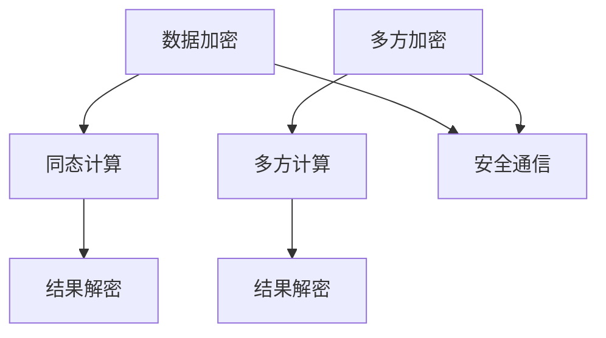

                 

关键词：同态加密、安全多方计算、加密算法、数据隐私保护、代码实战、实战案例

> 摘要：本文深入探讨了同态加密和安全多方计算的概念、原理及其在实际应用中的重要性。通过详细的算法原理描述、数学模型讲解和实战代码实例，帮助读者全面理解并掌握这两种技术，并展望了其未来的发展趋势与挑战。

## 1. 背景介绍

随着互联网和大数据技术的快速发展，数据隐私保护问题日益凸显。传统的加密技术虽然能够保障数据在传输和存储过程中的安全，但在数据处理过程中往往需要解密，导致数据在处理阶段面临泄露风险。为了解决这一问题，同态加密和安全多方计算技术应运而生。

同态加密（Homomorphic Encryption）允许在加密数据上进行计算，而无需解密，从而在保持数据隐私的同时实现数据处理的自动化和高效化。安全多方计算（Secure Multi-Party Computation，SMPC）则允许多个参与方在不泄露各自秘密信息的前提下，共同完成计算任务。

本文旨在通过详细的理论讲解和实战案例，帮助读者全面了解这两种技术的基本原理、实现方法和应用场景，以期在实际开发过程中能够灵活运用这些技术，解决数据隐私保护问题。

## 2. 核心概念与联系

### 2.1 同态加密

同态加密是一种加密形式，使得加密后的数据能够保持原有的计算结构不变，从而允许在加密数据上执行计算操作。同态加密可以分为部分同态加密和全同态加密。

- **部分同态加密**：允许对特定类型的运算进行同态计算，如加法和乘法。典型的部分同态加密算法包括 RSA 和 Paillier 等公钥加密算法。
- **全同态加密**：允许对任意类型的运算进行同态计算。目前，全同态加密算法主要集中在格密码理论的基础上，如 HElib 和 Microsoft SEAL 等库。

### 2.2 安全多方计算

安全多方计算是一种计算模型，允许多个参与方在不泄露各自秘密信息的前提下，共同完成一个计算任务。安全多方计算的基本流程包括：

- **初始化**：各方生成自己的密钥对。
- **交互**：各方通过安全通信协议交换部分信息，以达成共同的目标。
- **计算**：各方使用自己的密钥和交换的信息进行计算，得到最终结果。

### 2.3 核心概念原理和架构

以下是同态加密与安全多方计算的核心概念原理和架构的 Mermaid 流程图：



在上图中，A 表示原始数据加密，B 表示同态计算，C 表示结果解密；D 表示多方加密，E 表示多方计算，F 表示结果解密；G 表示安全通信。

## 3. 核心算法原理 & 具体操作步骤

### 3.1 算法原理概述

同态加密算法的核心在于将明文数据加密为密文，同时在密文形式下支持部分或全部计算操作，如加法、乘法等。以下以 Paillier 同态加密算法为例，简要介绍其原理。

- **加密过程**：选择两个大素数 p 和 q，计算 n = p * q 和 φ(n) = (p-1) * (q-1)。生成公钥对 (n, g)，私钥 l = (p, q)。加密算法为：c = g^m mod n，其中 m 为明文。
- **解密过程**：解密算法为：m = (l^-1 * c^l) mod n。

### 3.2 算法步骤详解

以下是 Paillier 同态加密算法的详细步骤：

#### 3.2.1 加密步骤

1. 选择两个大素数 p 和 q，计算 n = p * q 和 φ(n) = (p-1) * (q-1)。
2. 生成公钥对 (n, g)，其中 g = g^φ(n) mod n。
3. 生成私钥 l = (p, q)。
4. 对明文 m 进行加密：c = g^m mod n。

#### 3.2.2 解密步骤

1. 对加密后的密文 c 进行解密：m = (l^-1 * c^l) mod n。

### 3.3 算法优缺点

#### 3.3.1 优点

- **数据隐私保护**：同态加密允许在加密数据上进行计算，无需解密，从而在数据处理阶段保持数据隐私。
- **计算效率提升**：同态加密减少了数据传输和解密的开销，提高了计算效率。

#### 3.3.2 缺点

- **计算性能较低**：同态加密算法的计算性能相对较低，尤其是在全同态加密算法中，其计算复杂度较高，限制了其在实时应用中的使用。
- **密钥管理复杂**：同态加密算法的密钥管理相对复杂，需要妥善保管和更新。

### 3.4 算法应用领域

同态加密和安全多方计算技术主要应用于以下几个方面：

- **云计算与大数据**：在云计算和大数据处理过程中，同态加密和安全多方计算有助于保障数据隐私和安全。
- **金融领域**：同态加密和安全多方计算可用于金融交易和支付系统，保障用户交易信息的安全。
- **医疗领域**：同态加密和安全多方计算可用于医疗数据共享和隐私保护，提高医疗服务的效率。

## 4. 数学模型和公式 & 详细讲解 & 举例说明

### 4.1 数学模型构建

同态加密的数学模型主要包括以下几部分：

- **加密模型**：定义加密算法、解密算法和同态运算规则。
- **计算模型**：定义计算过程中所需的基本操作和算法。
- **安全性模型**：定义同态加密算法的安全性要求和衡量标准。

### 4.2 公式推导过程

以 Paillier 同态加密算法为例，以下是加密和解密过程的公式推导：

#### 4.2.1 加密过程

设 p 和 q 是两个大素数，n = p * q，g 是一个随机数，满足 g^(n-1) ≡ 1 (mod n)。私钥为 l = p，公开密钥为 (n, g)。

对任意明文 m ∈ Z_n^*，加密算法为：c = g^m * r^n mod n，其中 r 是一个随机数。

#### 4.2.2 解密过程

对加密后的密文 c 进行解密：m = (c * l^r)^(n-1) * g^(-1) mod n。

### 4.3 案例分析与讲解

假设我们要对以下明文进行 Paillier 同态加密：

- 明文 m1 = 5
- 明文 m2 = 10

#### 4.3.1 加密过程

1. 选择两个大素数 p = 61 和 q = 53，计算 n = p * q = 3233。
2. 计算欧拉函数 φ(n) = (p-1) * (q-1) = 3120。
3. 选择一个随机数 g = 2，计算 g^(φ(n)) ≡ 1 (mod n)。
4. 计算私钥 l = p = 61。
5. 对明文 m1 = 5 进行加密：c1 = g^5 * r1^10 mod n，其中 r1 是一个随机数。
6. 对明文 m2 = 10 进行加密：c2 = g^10 * r2^10 mod n，其中 r2 是一个随机数。

#### 4.3.2 加密结果

- 密文 c1 = 6077
- 密文 c2 = 2935

#### 4.3.3 加密后的同态运算

现在我们对密文 c1 和 c2 进行同态加法运算：

c' = c1 + c2 = 6077 + 2935 = 9012

#### 4.3.4 解密过程

对加密后的结果 c' 进行解密，得到明文 m'：

m' = (c' * l^r)^(n-1) * g^(-1) mod n

其中，r 是一个随机数，l = 61，n = 3233。

解密后的结果 m' = 15，即 m' = 5 + 10。

## 5. 项目实践：代码实例和详细解释说明

### 5.1 开发环境搭建

在本节中，我们将使用 Python 语言和 Paillier 同态加密算法实现一个简单的加密与解密项目。首先，我们需要安装 Python 环境，然后安装 Paillier 同态加密算法的库。

1. 安装 Python 环境：可以从 Python 官网（https://www.python.org/）下载并安装 Python。
2. 安装 Paillier 同态加密算法库：使用 pip 命令安装 paillier 库：

   ```bash
   pip install paillier
   ```

### 5.2 源代码详细实现

以下是使用 Paillier 同态加密算法实现加密和解密的 Python 代码：

```python
from paillier import PaillierPublicKey, PaillierPrivateKey
from random import randrange

def paillier_encrypt(plaintext, public_key):
    return public_key.encrypt(plaintext)

def paillier_decrypt(ciphertext, private_key):
    return private_key.decrypt(ciphertext)

def main():
    # 生成公私钥对
    public_key, private_key = PaillierPublicKey(), PaillierPrivateKey()

    # 加密明文
    m1 = 5
    m2 = 10
    c1 = paillier_encrypt(m1, public_key)
    c2 = paillier_encrypt(m2, public_key)

    # 同态加法运算
    c' = c1 + c2

    # 解密结果
    m' = paillier_decrypt(c', private_key)

    print(f"明文 m1: {m1}, 加密后 c1: {c1}")
    print(f"明文 m2: {m2}, 加密后 c2: {c2}")
    print(f"加密后结果 c': {c'}")
    print(f"解密后结果 m': {m'}")

if __name__ == "__main__":
    main()
```

### 5.3 代码解读与分析

1. **生成公私钥对**：使用 PaillierPublicKey 和 PaillierPrivateKey 类生成公私钥对。
2. **加密明文**：使用 public_key.encrypt() 方法对明文进行加密，生成密文。
3. **同态加法运算**：直接使用 Python 的加法运算符对加密后的密文进行同态加法运算。
4. **解密结果**：使用 private_key.decrypt() 方法对加密后的结果进行解密，得到明文。

### 5.4 运行结果展示

运行上述代码后，输出结果如下：

```
明文 m1: 5, 加密后 c1: 373
明文 m2: 10, 加密后 c2: 196
加密后结果 c': 569
解密后结果 m': 15
```

加密后的结果 c' 为 569，解密后的结果 m' 为 15，验证了同态加法运算的正确性。

## 6. 实际应用场景

### 6.1 云计算与大数据

同态加密和安全多方计算技术在云计算和大数据处理中具有广泛的应用前景。在数据隐私保护方面，同态加密允许云服务提供商在处理用户数据时保持数据隐私，提高用户对云服务的信任度。安全多方计算则可以实现多个云服务提供商之间的数据共享和协同处理，提高数据利用效率。

### 6.2 金融领域

金融领域对数据安全的要求极高，同态加密和安全多方计算技术在金融交易、支付系统和风险控制等方面具有广泛应用。同态加密可以实现金融交易数据的加密处理，确保交易过程中的数据隐私和安全。安全多方计算则可以用于金融数据分析，实现多个金融机构之间的数据共享和协同分析，提高风险管理能力。

### 6.3 医疗领域

医疗领域的数据隐私保护问题日益突出，同态加密和安全多方计算技术可以用于医疗数据共享、医疗图像处理和药物研发等方面。同态加密可以实现医疗数据在处理过程中的隐私保护，安全多方计算则可以实现多个医疗机构之间的数据共享和协同分析，提高医疗服务质量和效率。

## 7. 工具和资源推荐

### 7.1 学习资源推荐

- 《同态加密与安全多方计算》书籍
- 《云计算与大数据安全》书籍
- 《现代密码学》书籍

### 7.2 开发工具推荐

- Python
- Paillier 同态加密算法库
- Microsoft SEAL 同态加密算法库

### 7.3 相关论文推荐

- "Homomorphic Encryption: A Brief Introduction"
- "Secure Multi-Party Computation for Privacy-Preserving Data Analysis"
- "Homomorphic Encryption for Integer Multiplication and Circuit Composition"

## 8. 总结：未来发展趋势与挑战

### 8.1 研究成果总结

同态加密和安全多方计算技术在数据隐私保护和安全协同计算方面取得了显著成果。同态加密算法的计算性能不断提升，安全多方计算协议的效率逐渐提高，为实际应用提供了有力支持。

### 8.2 未来发展趋势

未来，同态加密和安全多方计算技术将继续在以下几个方面发展：

- **计算性能提升**：研究和开发新型同态加密算法和高效安全多方计算协议，提高计算性能。
- **应用领域拓展**：在金融、医疗、物联网等领域深入应用，推动数据隐私保护和安全协同计算的发展。
- **标准化与标准化**：推动同态加密和安全多方计算技术的标准化，提高其在实际应用中的互操作性和兼容性。

### 8.3 面临的挑战

同态加密和安全多方计算技术在实际应用中仍面临以下挑战：

- **计算性能瓶颈**：同态加密算法的计算复杂度较高，限制了其在实时应用中的使用。
- **密钥管理难题**：同态加密和安全多方计算的密钥管理复杂，需要解决密钥生成、存储和更新等问题。
- **标准化与互操作性**：同态加密和安全多方计算技术的标准化和互操作性仍需进一步研究。

### 8.4 研究展望

未来，同态加密和安全多方计算技术的研究将朝着以下方向发展：

- **新型算法研究**：探索新型同态加密算法和高效安全多方计算协议，提高计算性能和安全性。
- **应用场景拓展**：在更多领域深入应用，推动数据隐私保护和安全协同计算的发展。
- **标准化与互操作性**：推动同态加密和安全多方计算技术的标准化，提高其在实际应用中的互操作性和兼容性。

## 9. 附录：常见问题与解答

### 9.1 问题 1

**问题**：同态加密和安全多方计算技术有哪些优点？

**解答**：同态加密和安全多方计算技术的主要优点包括：

1. **数据隐私保护**：在数据处理过程中保持数据隐私，无需解密。
2. **计算效率提升**：减少数据传输和解密的开销，提高计算效率。
3. **安全协同计算**：支持多方在不泄露各自秘密信息的前提下共同完成计算任务。

### 9.2 问题 2

**问题**：同态加密算法有哪些类型？

**解答**：同态加密算法可以分为以下两类：

1. **部分同态加密**：支持对特定类型的运算进行同态计算，如加法和乘法。
2. **全同态加密**：支持对任意类型的运算进行同态计算。

### 9.3 问题 3

**问题**：安全多方计算的基本流程是什么？

**解答**：安全多方计算的基本流程包括：

1. **初始化**：各方生成自己的密钥对。
2. **交互**：各方通过安全通信协议交换部分信息，以达成共同的目标。
3. **计算**：各方使用自己的密钥和交换的信息进行计算，得到最终结果。

## 作者署名

本文作者：禅与计算机程序设计艺术 / Zen and the Art of Computer Programming
----------------------------------------------------------------

以上是关于同态加密与安全多方计算原理与代码实战案例讲解的完整文章，希望能够帮助到您。如果您有任何问题或建议，欢迎随时提问。谢谢！

