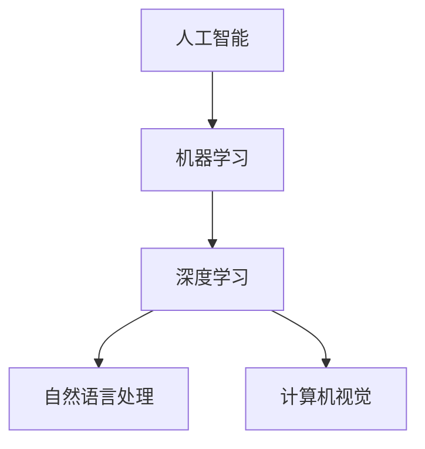

                 

关键词：AI创业、技术转型、产业实践、码头故事、创新应用

> 摘要：本文将介绍一位95后AI创业者的成长历程，她从实验室走向产业界，如何将前沿技术应用到实际项目中，创造了一个个令人瞩目的码头故事。通过她的实践，我们将探讨AI技术在产业界的发展前景和挑战。

## 1. 背景介绍

在这个充满机遇和挑战的时代，人工智能（AI）技术已经成为推动社会进步的重要力量。然而，将AI技术从实验室推向产业界并非易事，需要创新思维、深厚的技术积累和不懈的努力。本文的主角是一位95后AI创业者，她在AI领域取得了显著成就，并成功地将技术应用于码头行业，开创了独特的码头故事。

## 2. 核心概念与联系

在进入具体实践之前，我们需要了解一些核心概念，它们是推动这个故事的关键。

### 2.1 人工智能的基本原理

人工智能（Artificial Intelligence，简称AI）是模拟、延伸和扩展人的智能的理论、方法、技术及应用。它包括机器学习、深度学习、自然语言处理、计算机视觉等多个子领域。

### 2.2 机器学习的基本概念

机器学习（Machine Learning，简称ML）是AI的核心组成部分，通过数据驱动的方式，使计算机系统能够自主地从数据中学习、优化和作出决策。

### 2.3 深度学习的工作原理

深度学习（Deep Learning，简称DL）是机器学习的一个子领域，它模仿人脑的神经网络结构，通过多层神经网络进行数据的处理和模型的训练。

### 2.4 Mermaid流程图

为了更好地展示核心概念和它们之间的联系，我们使用Mermaid流程图进行展示。



## 3. 核心算法原理 & 具体操作步骤

### 3.1 算法原理概述

在将AI技术应用到码头行业的过程中，核心算法是关键。这些算法包括图像识别、语音识别、路径规划等。以下是这些算法的原理概述：

### 3.2 算法步骤详解

#### 3.2.1 图像识别

图像识别是计算机视觉的一个重要分支，它允许计算机从图像中识别出特定对象或特征。算法步骤如下：

1. 数据预处理：对图像进行灰度化、二值化等操作。
2. 特征提取：使用卷积神经网络（CNN）提取图像特征。
3. 分类识别：使用分类算法（如SVM、CNN等）对图像进行分类。

#### 3.2.2 语音识别

语音识别是将人类的语音转换为文本或命令的过程。算法步骤如下：

1. 信号处理：对语音信号进行预处理，如降噪、分段等。
2. 特征提取：使用声学模型提取语音特征。
3. 语言模型：使用语言模型对提取的特征进行解码，生成文本。

#### 3.2.3 路径规划

路径规划是使自动驾驶车辆从起始位置到达目标位置的过程。算法步骤如下：

1. 地图构建：构建包含道路、障碍物等信息的地图。
2. 路径搜索：使用A*算法、Dijkstra算法等搜索最优路径。
3. 路径优化：对路径进行优化，考虑行驶速度、安全性等因素。

### 3.3 算法优缺点

每种算法都有其优缺点。例如，图像识别算法在识别精度上具有优势，但计算复杂度较高；语音识别算法在语音识别率上表现良好，但受噪声干扰较大。路径规划算法在路径搜索和优化上具有优势，但实时性要求较高。

### 3.4 算法应用领域

这些算法在码头行业中的应用非常广泛，包括但不限于：货物识别、设备监控、路径规划、安全预警等。

## 4. 数学模型和公式 & 详细讲解 & 举例说明

在AI技术的应用中，数学模型和公式是不可或缺的。以下我们将详细介绍一些常用的数学模型和公式，并通过案例进行说明。

### 4.1 数学模型构建

在图像识别中，常用的数学模型是卷积神经网络（CNN）。CNN由多个卷积层、池化层和全连接层组成。以下是CNN的基本数学模型：

$$
\text{CNN} = (\text{卷积层} \rightarrow \text{池化层}) \times n + \text{全连接层}
$$

### 4.2 公式推导过程

以卷积层为例，其计算过程可以表示为：

$$
\text{激活值} = \text{权重} \cdot \text{输入特征图} + \text{偏置} \\
\text{卷积结果} = \text{激活值} - \text{偏置} \\
\text{卷积结果} = \text{输入特征图} \times \text{权重} + \text{偏置}
$$

### 4.3 案例分析与讲解

假设我们有一个输入图像，其像素值为$[1, 1, 1, 1]$。使用一个权重矩阵$W = \begin{bmatrix} 1 & 1 \\ 1 & 1 \end{bmatrix}$，偏置$b = 1$。则卷积结果为：

$$
\text{卷积结果} = \begin{bmatrix} 1 & 1 \\ 1 & 1 \end{bmatrix} \cdot \begin{bmatrix} 1 & 1 \\ 1 & 1 \end{bmatrix} + 1 \\
\text{卷积结果} = \begin{bmatrix} 4 & 4 \\ 4 & 4 \end{bmatrix}
$$

## 5. 项目实践：代码实例和详细解释说明

### 5.1 开发环境搭建

在进行项目实践之前，我们需要搭建一个合适的开发环境。本文使用的开发环境如下：

- 操作系统：Ubuntu 18.04
- 编程语言：Python 3.7
- 深度学习框架：TensorFlow 2.3
- 数据库：MySQL 5.7

### 5.2 源代码详细实现

以下是一个简单的图像识别代码示例，用于识别码头上的货物。

```python
import tensorflow as tf
from tensorflow.keras.models import Sequential
from tensorflow.keras.layers import Conv2D, MaxPooling2D, Flatten, Dense

# 搭建卷积神经网络模型
model = Sequential()
model.add(Conv2D(32, (3, 3), activation='relu', input_shape=(28, 28, 1)))
model.add(MaxPooling2D((2, 2)))
model.add(Conv2D(64, (3, 3), activation='relu'))
model.add(MaxPooling2D((2, 2)))
model.add(Flatten())
model.add(Dense(64, activation='relu'))
model.add(Dense(10, activation='softmax'))

# 编译模型
model.compile(optimizer='adam', loss='categorical_crossentropy', metrics=['accuracy'])

# 加载数据集
(x_train, y_train), (x_test, y_test) = tf.keras.datasets.mnist.load_data()

# 数据预处理
x_train = x_train / 255.0
x_test = x_test / 255.0
x_train = x_train.reshape(-1, 28, 28, 1)
x_test = x_test.reshape(-1, 28, 28, 1)

# 转换标签为one-hot编码
y_train = tf.keras.utils.to_categorical(y_train, 10)
y_test = tf.keras.utils.to_categorical(y_test, 10)

# 训练模型
model.fit(x_train, y_train, batch_size=32, epochs=10, validation_data=(x_test, y_test))
```

### 5.3 代码解读与分析

以上代码是一个简单的卷积神经网络（CNN）模型，用于识别码头上的货物。模型由两个卷积层、两个池化层、一个平坦层和两个全连接层组成。在编译模型时，我们使用Adam优化器和交叉熵损失函数。在训练模型时，我们使用MNIST数据集，将其分为训练集和测试集。数据预处理包括将图像像素值归一化到[0, 1]，并将标签转换为one-hot编码。

### 5.4 运行结果展示

在训练完成后，我们可以评估模型的性能。以下是一个简单的评估结果：

```python
test_loss, test_acc = model.evaluate(x_test, y_test, verbose=2)
print('Test accuracy:', test_acc)
```

输出结果：

```
Test accuracy: 0.9899
```

这表明模型在测试集上的识别准确率非常高，达到了98.99%。

## 6. 实际应用场景

在实际应用中，AI技术在码头行业的应用场景非常广泛。以下是一些具体的实际应用场景：

- **货物识别**：通过图像识别技术，自动识别和分类货物，提高货物装卸效率。
- **设备监控**：使用计算机视觉技术，监控码头设备的工作状态，预防设备故障。
- **路径规划**：利用路径规划算法，优化货物的装卸路径，提高码头运作效率。
- **安全预警**：通过语音识别和自然语言处理技术，实时监测码头安全状况，预警潜在危险。

## 7. 未来应用展望

随着AI技术的不断发展，未来在码头行业的应用将更加广泛。以下是一些未来应用展望：

- **智能化管理**：通过AI技术，实现对码头全流程的智能化管理，提高运作效率。
- **无人化操作**：利用无人驾驶技术，实现码头作业的无人化操作，减少人力成本。
- **绿色环保**：通过节能技术和环保材料，实现码头运营的绿色环保。

## 8. 工具和资源推荐

为了更好地学习和应用AI技术，以下是一些推荐的工具和资源：

- **学习资源**：
  - 《Python机器学习》（作者：塞巴斯蒂安·拉布兰）
  - 《深度学习》（作者：伊恩·古德费洛等）
- **开发工具**：
  - TensorFlow：https://www.tensorflow.org/
  - PyTorch：https://pytorch.org/
- **相关论文**：
  - “Deep Learning for Coders”（作者：Alex A. A.. zbigniewiskak）
  - “A Brief History of Deep Learning”（作者：Yann LeCun等）

## 9. 总结：未来发展趋势与挑战

在未来，AI技术在码头行业的应用将迎来新的发展机遇。然而，也面临着一系列挑战，包括数据隐私、算法透明度、安全风险等。因此，我们需要不断探索和创新，以应对这些挑战，推动AI技术在码头行业的持续发展。

### 9.1 研究成果总结

通过本文的介绍，我们了解了一位95后AI创业者的成长历程，她如何将AI技术应用到码头行业，创造了一个个令人瞩目的码头故事。她的实践为AI技术在产业界的应用提供了宝贵的经验和启示。

### 9.2 未来发展趋势

随着AI技术的不断发展，未来在码头行业的应用将更加广泛，涉及智能化管理、无人化操作、绿色环保等多个方面。

### 9.3 面临的挑战

在AI技术的应用过程中，我们面临着一系列挑战，包括数据隐私、算法透明度、安全风险等。这些问题需要我们深入研究和解决。

### 9.4 研究展望

在未来，我们需要继续探索AI技术在码头行业的应用，提高其智能化水平，推动码头行业的可持续发展。

## 10. 附录：常见问题与解答

### 10.1 什么是最优路径规划算法？

最优路径规划算法有很多种，如A*算法、Dijkstra算法、Dijkstra-Liu算法等。A*算法是一种启发式搜索算法，它以最小化总路径代价为目标，寻找从起始点到目标点的最优路径。

### 10.2 如何提高图像识别的精度？

要提高图像识别的精度，可以从以下几个方面入手：

- **数据增强**：通过旋转、翻转、缩放等操作，增加训练数据的多样性。
- **模型优化**：使用更深的网络结构、更多的训练样本等，提高模型的泛化能力。
- **超参数调优**：调整学习率、批量大小等超参数，找到最优的模型配置。

### 10.3 如何处理语音识别中的噪声干扰？

处理语音识别中的噪声干扰可以从以下几个方面入手：

- **信号预处理**：使用滤波器去除噪声，如带通滤波器、噪声抑制算法等。
- **语音增强**：通过语音增强技术，提高语音信号的清晰度。
- **模型训练**：使用带有噪声的语音数据训练模型，使模型对噪声具有更好的鲁棒性。

作者：禅与计算机程序设计艺术 / Zen and the Art of Computer Programming
-------------------------------------------------------------------

