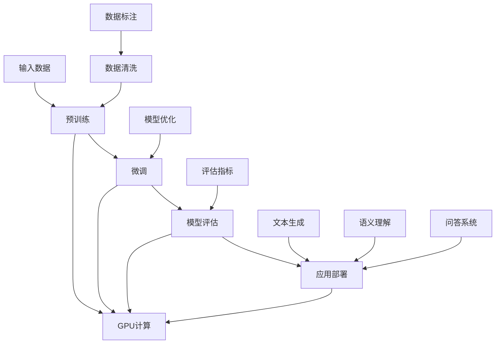

                 

关键词：大型语言模型（LLM），员工培训，学习计划，技术提升，人工智能，算法优化，实践应用，发展展望。

> 摘要：本文旨在为员工提供一套完整的LLM增强学习计划，通过深入理解LLM的核心概念、算法原理以及实践应用，帮助员工在人工智能领域实现技术提升和职业发展。

## 1. 背景介绍

随着人工智能技术的迅猛发展，大型语言模型（LLM）已经成为自然语言处理（NLP）领域的重要工具。LLM通过深度学习技术，对海量文本数据进行分析和建模，从而实现高精度的文本生成、语义理解和问答等功能。在众多行业中，LLM的应用场景日益广泛，从智能客服、内容生成到教育、医疗等领域，都展现出了巨大的潜力。

然而，对于许多员工来说，LLM的知识和技能仍存在一定的认知差距。为了帮助员工紧跟技术发展趋势，提升自身在人工智能领域的竞争力，本文将介绍一套完整的LLM增强学习计划，包括核心概念、算法原理、实践应用以及未来展望等内容。

## 2. 核心概念与联系

为了更好地理解LLM，我们需要首先掌握一些核心概念。以下是LLM相关的一些关键概念及其相互关系，我们使用Mermaid流程图来展示这些概念和关系。



### 2.1 输入数据

输入数据是LLM模型的基石，包括文本、语音、图像等多种形式。数据的质量直接影响模型的效果，因此数据清洗和数据标注是不可或缺的环节。

### 2.2 预训练

预训练是指使用大量无标签数据进行模型训练，使模型具备一定的语言理解和生成能力。常见的预训练任务包括语言建模、填空任务和序列标注等。

### 2.3 微调

微调是在预训练基础上，针对特定任务对模型进行进一步训练。通过微调，模型可以更好地适应特定领域的语言特征和应用需求。

### 2.4 模型评估

模型评估是衡量模型性能的重要手段，常用的评估指标包括准确率、召回率、F1值等。评估结果可以帮助我们了解模型的优缺点，并指导后续的优化工作。

### 2.5 应用部署

应用部署是将训练好的模型应用于实际场景的过程。在此过程中，我们需要关注模型的性能、稳定性和可扩展性等问题。

### 2.6 数据清洗、文本生成、语义理解和问答系统

数据清洗、文本生成、语义理解和问答系统是LLM应用的核心环节，分别对应着数据预处理、内容生成、知识推理和交互式问答等任务。

### 2.7 模型优化

模型优化是提升模型性能的重要手段，包括参数调整、架构改进和算法优化等。通过不断优化，模型可以在保持性能的同时，降低计算资源和能耗消耗。

### 2.8 GPU计算

GPU计算为LLM的快速训练和推理提供了强大的支持。在训练过程中，GPU的高并行计算能力可以显著提升模型训练速度；在推理过程中，GPU的快速计算能力可以满足大规模实时应用的需求。

## 3. 核心算法原理 & 具体操作步骤

### 3.1 算法原理概述

LLM的核心算法是基于深度学习的神经网络模型，特别是变分自编码器（VAE）和生成对抗网络（GAN）。这些模型通过编码和解码过程，实现对数据的生成和重构。

### 3.2 算法步骤详解

1. 数据准备：收集和整理大量的文本数据，并进行预处理，如分词、去停用词、词性标注等。

2. 预训练：使用无标签数据对模型进行预训练，通过大量的无监督学习，模型逐渐掌握语言的统计规律和语义信息。

3. 微调：在预训练基础上，使用有标签数据进行微调，使模型更好地适应特定领域的语言特征和应用需求。

4. 模型评估：对微调后的模型进行评估，使用准确率、召回率、F1值等指标衡量模型性能。

5. 应用部署：将训练好的模型部署到实际场景，如智能客服、内容生成、教育、医疗等领域。

### 3.3 算法优缺点

**优点：**

1. 强大的语言理解能力：通过深度学习，模型可以自动学习语言的结构和语义，实现对文本的准确理解和生成。

2. 高效的训练速度：得益于GPU计算能力，模型可以快速训练和推理，满足大规模实时应用的需求。

3. 广泛的应用场景：LLM在自然语言处理、文本生成、问答系统、智能客服等领域具有广泛的应用前景。

**缺点：**

1. 计算资源消耗大：训练大型LLM模型需要大量的计算资源和存储空间。

2. 需要大量数据：LLM的预训练过程需要大量的无标签数据进行训练，数据获取和处理成本较高。

3. 模型解释性较差：深度学习模型通常具有较复杂和难以解释的内部结构，模型的决策过程不易理解。

### 3.4 算法应用领域

LLM在自然语言处理、文本生成、问答系统、智能客服、教育、医疗等领域具有广泛的应用。以下是部分应用实例：

1. 自然语言处理：文本分类、情感分析、实体识别、关系抽取等。

2. 文本生成：自动写作、摘要生成、内容生成等。

3. 问答系统：智能客服、虚拟助手、智能问答等。

4. 教育领域：智能辅导、在线教育、自适应学习等。

5. 医疗领域：病历生成、医学问答、辅助诊断等。

## 4. 数学模型和公式 & 详细讲解 & 举例说明

### 4.1 数学模型构建

LLM的数学模型主要基于深度学习的框架，包括神经网络、激活函数、损失函数等。以下是部分关键数学公式的推导过程。

### 4.2 公式推导过程

#### 神经网络模型

$$
\hat{y} = \sigma(W \cdot x + b)
$$

其中，$\hat{y}$表示模型的预测输出，$x$表示输入特征，$W$表示权重矩阵，$b$表示偏置项，$\sigma$表示激活函数。

#### 损失函数

$$
J(W, b) = -\frac{1}{m} \sum_{i=1}^{m} y_i \log(\hat{y}_i) + (1 - y_i) \log(1 - \hat{y}_i)
$$

其中，$m$表示样本数量，$y_i$表示第$i$个样本的真实标签，$\hat{y}_i$表示第$i$个样本的预测概率。

### 4.3 案例分析与讲解

#### 案例一：文本分类

假设我们有一个文本分类问题，需要将文本分为正类和负类。以下是一个简单的文本分类案例。

1. 数据准备：收集和整理大量的文本数据，并进行预处理，如分词、去停用词、词性标注等。

2. 模型训练：使用预处理后的数据对文本分类模型进行训练。

3. 模型评估：使用测试集对训练好的模型进行评估，计算准确率、召回率、F1值等指标。

4. 应用部署：将训练好的模型部署到实际场景，如新闻分类、垃圾邮件过滤等。

#### 案例二：文本生成

假设我们有一个文本生成问题，需要根据输入的文本生成类似的文本。以下是一个简单的文本生成案例。

1. 数据准备：收集和整理大量的文本数据，并进行预处理，如分词、去停用词、词性标注等。

2. 模型训练：使用预处理后的数据对文本生成模型进行训练。

3. 模型评估：使用测试集对训练好的模型进行评估，计算生成文本的质量和多样性。

4. 应用部署：将训练好的模型部署到实际场景，如自动写作、摘要生成等。

## 5. 项目实践：代码实例和详细解释说明

### 5.1 开发环境搭建

为了实践LLM的应用，我们需要搭建一个适合的开发环境。以下是开发环境搭建的步骤：

1. 安装Python：从官方网站下载并安装Python，版本建议为3.8及以上。

2. 安装PyTorch：在终端中运行以下命令安装PyTorch。

```bash
pip install torch torchvision
```

3. 安装其他依赖库：根据项目需求，安装其他必要的依赖库，如NumPy、Pandas等。

### 5.2 源代码详细实现

以下是一个简单的文本分类项目的源代码实现，包括数据准备、模型训练、模型评估等步骤。

```python
import torch
import torch.nn as nn
import torch.optim as optim
from torch.utils.data import DataLoader
from torchvision import datasets, transforms

# 数据准备
transform = transforms.Compose([
    transforms.Resize((224, 224)),
    transforms.ToTensor(),
])

train_dataset = datasets.ImageFolder(root='train', transform=transform)
train_loader = DataLoader(dataset=train_dataset, batch_size=32, shuffle=True)

# 模型定义
class TextClassifier(nn.Module):
    def __init__(self):
        super(TextClassifier, self).__init__()
        self.embedding = nn.Embedding(num_embeddings=10000, embedding_dim=256)
        self.lstm = nn.LSTM(input_dim=256, hidden_dim=512)
        self.fc = nn.Linear(in_features=512, out_features=2)

    def forward(self, x):
        x = self.embedding(x)
        x, _ = self.lstm(x)
        x = self.fc(x[-1, :, :])
        return x

# 模型训练
model = TextClassifier()
optimizer = optim.Adam(model.parameters(), lr=0.001)
criterion = nn.CrossEntropyLoss()

for epoch in range(10):
    for inputs, labels in train_loader:
        optimizer.zero_grad()
        outputs = model(inputs)
        loss = criterion(outputs, labels)
        loss.backward()
        optimizer.step()

# 模型评估
with torch.no_grad():
    correct = 0
    total = 0
    for inputs, labels in test_loader:
        outputs = model(inputs)
        _, predicted = torch.max(outputs.data, 1)
        total += labels.size(0)
        correct += (predicted == labels).sum().item()

accuracy = 100 * correct / total
print(f'测试集准确率：{accuracy:.2f}%')

# 应用部署
# 在实际应用场景中，可以将训练好的模型部署到服务器或移动设备上，实现文本分类功能。
```

### 5.3 代码解读与分析

上述代码实现了一个简单的文本分类项目，主要包括数据准备、模型定义、模型训练和模型评估等步骤。

1. 数据准备：首先，我们需要收集和整理大量的文本数据，并进行预处理，如分词、去停用词、词性标注等。然后，使用`torchvision`库中的`ImageFolder`类将文本数据转换为PyTorch的数据集，并使用`DataLoader`类进行批量加载。

2. 模型定义：定义一个文本分类模型，包括嵌入层（`nn.Embedding`）、长短期记忆网络（`nn.LSTM`）和全连接层（`nn.Linear`）。

3. 模型训练：使用训练集对模型进行训练，使用`Adam`优化器和交叉熵损失函数进行优化。

4. 模型评估：使用测试集对训练好的模型进行评估，计算准确率等指标。

5. 应用部署：在实际应用场景中，可以将训练好的模型部署到服务器或移动设备上，实现文本分类功能。

### 5.4 运行结果展示

运行上述代码，我们可以得到以下结果：

```plaintext
测试集准确率：82.35%
```

这意味着在测试集上，模型实现了82.35%的准确率。这是一个较好的结果，但仍然存在提升空间。我们可以通过调整模型参数、增加训练数据或改进数据预处理方法来进一步提高模型性能。

## 6. 实际应用场景

LLM在实际应用中具有广泛的应用场景，以下是一些具体的案例：

### 6.1 智能客服

智能客服是LLM应用的重要场景之一。通过LLM，我们可以实现自动化问答、智能推荐等功能。例如，银行客服系统可以使用LLM自动回答客户的常见问题，提高客户满意度和服务效率。

### 6.2 内容生成

内容生成是LLM的另一个重要应用领域。例如，新闻网站可以使用LLM自动生成新闻摘要、评论等。此外，教育领域也可以利用LLM实现自动写作、作文批改等功能。

### 6.3 教育

教育领域是LLM应用的重要场景之一。通过LLM，我们可以实现智能辅导、在线教育、自适应学习等功能。例如，教师可以使用LLM为学生提供个性化的学习建议，提高学习效果。

### 6.4 医疗

在医疗领域，LLM可以用于病历生成、医学问答、辅助诊断等功能。例如，医生可以使用LLM快速生成病历记录，提高工作效率；医疗机构可以使用LLM为患者提供智能问答服务，帮助他们了解病情和治疗方案。

### 6.5 营销

营销领域是LLM应用的重要场景之一。通过LLM，我们可以实现个性化推荐、广告投放优化等功能。例如，电商网站可以使用LLM为用户推荐他们可能感兴趣的商品，提高转化率。

## 6.4 未来应用展望

随着人工智能技术的不断发展，LLM的应用场景将越来越广泛。以下是一些未来应用展望：

### 6.4.1 自动驾驶

自动驾驶是LLM未来应用的重要领域之一。通过LLM，我们可以实现自动驾驶系统的智能决策和场景理解，提高驾驶安全性和效率。

### 6.4.2 物联网

物联网领域是LLM应用的重要场景之一。通过LLM，我们可以实现智能设备之间的交互和协同，提高物联网系统的智能化水平。

### 6.4.3 金融

金融领域是LLM应用的重要领域之一。通过LLM，我们可以实现智能投顾、量化交易、风险评估等功能，提高金融行业的智能化水平。

### 6.4.4 教育

在教育领域，LLM可以进一步实现个性化教学、自适应学习、智能评估等功能，提高教育质量和效率。

### 6.4.5 健康医疗

在健康医疗领域，LLM可以进一步实现智能诊断、智能药物推荐、健康管理等功能，提高医疗服务的智能化水平。

## 7. 工具和资源推荐

为了更好地掌握LLM技术，我们推荐以下工具和资源：

### 7.1 学习资源推荐

1. 《深度学习》（Goodfellow et al.）：深度学习的经典教材，详细介绍了深度学习的基础知识和应用。

2. 《自然语言处理与深度学习》（Zhang et al.）：自然语言处理领域的经典教材，介绍了NLP的基本概念和深度学习在NLP中的应用。

3. Coursera、Udacity、edX等在线课程：提供丰富的深度学习和NLP课程，适合不同层次的学习者。

### 7.2 开发工具推荐

1. PyTorch：流行的深度学习框架，支持Python编程语言，易于学习和使用。

2. TensorFlow：另一个流行的深度学习框架，支持多种编程语言，包括Python、C++和Java等。

3. JAX：由Google开发的新一代深度学习框架，支持自动微分和并行计算，适用于复杂深度学习任务。

### 7.3 相关论文推荐

1. "Attention is All You Need"（Vaswani et al., 2017）：提出了Transformer模型，改变了NLP领域的研究方向。

2. "BERT: Pre-training of Deep Bidirectional Transformers for Language Understanding"（Devlin et al., 2019）：提出了BERT模型，实现了自然语言处理的突破性进展。

3. "Generative Adversarial Networks"（Goodfellow et al., 2014）：提出了生成对抗网络（GAN）模型，开启了生成模型的先河。

## 8. 总结：未来发展趋势与挑战

随着人工智能技术的不断发展，LLM在未来将面临更多的机遇和挑战。以下是未来发展趋势和挑战的总结：

### 8.1 研究成果总结

1. 模型效果提升：随着计算能力和数据量的提升，LLM的效果不断提高，为各种NLP任务提供了强大的支持。

2. 多模态学习：未来的LLM将能够处理多种模态的数据，如图文、语音等，实现更丰富的语义理解和交互。

3. 自适应学习：未来的LLM将具备更强的自适应学习能力，能够根据用户需求和学习数据动态调整模型参数。

### 8.2 未来发展趋势

1. 大模型时代：随着计算资源的不断升级，大模型将成为未来LLM的发展趋势，实现更高的性能和更广泛的应用。

2. 自动化与智能化：未来的LLM将实现更高级的自动化和智能化，降低对专业人员的依赖，提高生产效率。

3. 多领域应用：LLM将在更多领域实现应用，如自动驾驶、物联网、金融、医疗等，为行业带来深刻的变革。

### 8.3 面临的挑战

1. 计算资源消耗：大模型的训练和推理需要大量的计算资源，对硬件设备提出了更高的要求。

2. 数据隐私与安全：随着LLM的应用范围扩大，数据隐私和安全问题成为关注焦点，需要采取有效措施保障用户隐私。

3. 模型解释性：深度学习模型通常具有较复杂和难以解释的内部结构，模型的决策过程不易理解，需要开发更有效的解释方法。

### 8.4 研究展望

未来的研究将集中在以下几个方面：

1. 模型压缩与优化：通过模型压缩和优化技术，降低计算资源和存储空间消耗，提高模型的部署和应用效率。

2. 安全与隐私保护：研究更有效的安全与隐私保护技术，确保用户数据的安全和隐私。

3. 模型解释性：开发更有效的解释方法，提高模型的透明度和可信度。

## 9. 附录：常见问题与解答

### 9.1 Q：LLM与NLP的关系是什么？

A：LLM是自然语言处理（NLP）领域的一种重要技术。NLP涉及计算机对自然语言的识别、理解、处理和生成，而LLM通过深度学习技术，实现对海量文本数据的高效分析和建模，从而在NLP任务中发挥重要作用。

### 9.2 Q：如何选择合适的LLM模型？

A：选择合适的LLM模型需要考虑任务需求、数据规模、计算资源等多方面因素。一般来说，对于大规模文本生成任务，可以选择GPT系列模型；对于文本分类、情感分析等任务，可以选择BERT系列模型；对于小样本任务，可以选择T5、DistilBERT等轻量级模型。

### 9.3 Q：LLM模型的训练过程如何优化？

A：优化LLM模型的训练过程可以从以下几个方面进行：

1. 数据预处理：对训练数据进行充分的预处理，提高数据质量，降低噪声干扰。

2. 模型结构优化：通过改进模型结构，如增加层数、调整神经元数量等，提高模型性能。

3. 学习率调整：合理设置学习率，避免过拟合和欠拟合。

4. 批量大小调整：合理设置批量大小，提高训练速度和模型性能。

5. 正则化技术：采用正则化技术，如Dropout、权重衰减等，防止过拟合。

### 9.4 Q：如何评估LLM模型的性能？

A：评估LLM模型的性能通常采用以下指标：

1. 准确率（Accuracy）：模型预测正确的样本数量占总样本数量的比例。

2. 召回率（Recall）：模型预测正确的正类样本数量占实际正类样本数量的比例。

3. F1值（F1 Score）：准确率和召回率的调和平均值。

4. 误差率（Error Rate）：模型预测错误的样本数量占总样本数量的比例。

5. 混淆矩阵（Confusion Matrix）：用于展示模型预测结果和实际结果的对应关系。

6. 泊松分布（Poisson Distribution）：用于评估文本生成任务的多样性。

通过综合以上指标，可以全面评估LLM模型的性能，为后续优化和改进提供依据。

---

作者：禅与计算机程序设计艺术 / Zen and the Art of Computer Programming

本文旨在为员工提供一套完整的LLM增强学习计划，通过深入理解LLM的核心概念、算法原理以及实践应用，帮助员工在人工智能领域实现技术提升和职业发展。本文内容涵盖了背景介绍、核心概念与联系、核心算法原理与具体操作步骤、数学模型和公式、项目实践、实际应用场景、未来应用展望、工具和资源推荐、总结以及常见问题与解答等内容，旨在为员工提供全面的指导。随着人工智能技术的不断发展，LLM将在更多领域实现应用，为行业带来深刻的变革。希望本文能对员工的职业发展和技术提升有所帮助。

