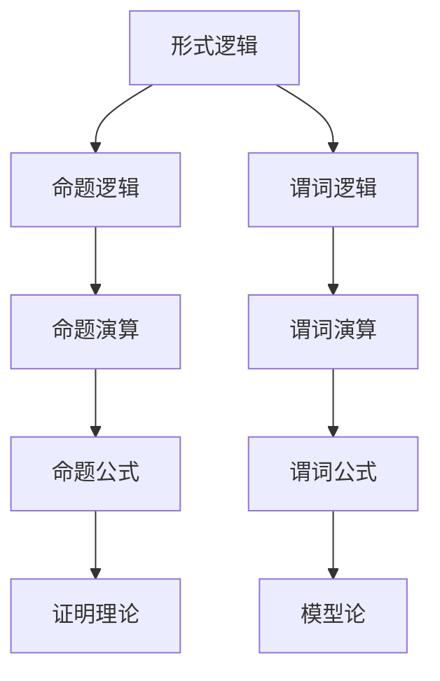

                 

 关键词：数学逻辑，形式逻辑，命题逻辑，谓词逻辑，数学模型，人工智能，算法，计算机科学，数学公式，应用领域

> 摘要：本文将介绍在最新一届国际数学家大会上，关于数学逻辑领域的一系列前沿研究成果。文章将深入探讨数学逻辑的基础概念、核心算法原理，以及数学模型和公式的推导与应用。此外，还将通过实际项目实例，分析数学逻辑在人工智能和计算机科学中的实际应用，并展望未来发展趋势与挑战。

## 1. 背景介绍

### 1.1 数学逻辑的定义与重要性

数学逻辑是数学的基础分支之一，它研究数学命题和证明的结构、方法和性质。数学逻辑在数学体系构建、数学推理过程以及数学证明的验证中起着至关重要的作用。形式逻辑、命题逻辑和谓词逻辑是数学逻辑的三个基本分支，分别对应着不同的逻辑层次和结构。

### 1.2 数学逻辑的发展历史

数学逻辑的发展可以追溯到古希腊时期，当时的哲学家和数学家开始关注逻辑问题。在17世纪，英国哲学家和数学家乔治·布尔（George Boole）提出了布尔代数，这是现代数学逻辑的基础。20世纪以来，数学逻辑得到了迅速发展，特别是在形式系统和模型论领域。

### 1.3 最新研究动态

在最新一届国际数学家大会上，数学逻辑领域呈现了众多前沿研究，包括新的形式逻辑系统、命题逻辑和谓词逻辑的拓展以及数学模型的创新应用。这些研究成果不仅深化了对数学逻辑的理解，也为人工智能和计算机科学领域提供了新的理论基础和工具。

## 2. 核心概念与联系

为了更好地理解数学逻辑的基本概念和架构，我们采用Mermaid流程图来展示其核心部分。



### 2.1 形式逻辑

形式逻辑是数学逻辑的基础，它通过符号语言来表示命题和推理过程。形式逻辑的主要目的是研究逻辑推理的有效性和一致性。

### 2.2 命题逻辑

命题逻辑是形式逻辑的一个子领域，它研究命题的真假性质及其组合规则。命题逻辑包括命题演算和证明理论，命题公式是命题逻辑的基本构成单元。

### 2.3 谓词逻辑

谓词逻辑是形式逻辑的另一个重要分支，它研究谓词及其应用。谓词逻辑包括谓词演算和模型论，谓词公式是谓词逻辑的基本构成单元。

### 2.4 证明理论与模型论

证明理论是形式逻辑的一个重要分支，研究证明的过程和性质。模型论是研究数学模型的结构和性质的一个数学分支，它涉及谓词逻辑的应用。

## 3. 核心算法原理 & 具体操作步骤

### 3.1 算法原理概述

数学逻辑的核心算法主要包括命题演算和谓词演算，它们分别应用于命题逻辑和谓词逻辑。以下是这些算法的基本原理：

#### 命题演算

命题演算涉及命题的组合和推理，其基本操作包括：

1. 并（AND）
2. 或（OR）
3. 非（NOT）
4. 条件（IF-THEN）

#### 谓词演算

谓词演算涉及谓词的定义和应用，其基本操作包括：

1. 存在量词（∃）
2. 全称量词（∀）
3. 谓词联结词（合取、析取、蕴含等）

### 3.2 算法步骤详解

#### 命题演算步骤

1. 确定命题变量和逻辑联结词。
2. 构建命题公式。
3. 使用推理规则进行命题变换。
4. 进行逻辑推理得出结论。

#### 谓词演算步骤

1. 定义谓词和个体。
2. 构建谓词公式。
3. 使用推理规则进行谓词变换。
4. 进行逻辑推理得出结论。

### 3.3 算法优缺点

#### 命题演算

优点：简单、直观、易于理解和实现。

缺点：无法表达复杂的关系和结构。

#### 谓词演算

优点：能够表达复杂的关系和结构，适用于形式化和自动化推理。

缺点：相对复杂，实现难度较大。

### 3.4 算法应用领域

#### 命题演算

命题演算广泛应用于人工智能、计算机科学、形式验证等领域。

#### 谓词演算

谓词演算在逻辑编程、自动推理、语义网和信息检索等领域有广泛应用。

## 4. 数学模型和公式 & 详细讲解 & 举例说明

### 4.1 数学模型构建

数学模型是描述现实世界或抽象概念的数学结构。构建数学模型通常包括以下几个步骤：

1. 确定研究问题。
2. 提取关键变量和参数。
3. 建立关系和方程。
4. 确定边界条件和初始条件。

### 4.2 公式推导过程

公式的推导是数学模型构建的关键步骤。以下是一个简单的示例：

#### 示例：一元二次方程的求解

给定一元二次方程：

$$ax^2 + bx + c = 0$$

其中，a、b、c 是已知常数，x 是未知数。解这个方程的公式是：

$$x = \frac{-b \pm \sqrt{b^2 - 4ac}}{2a}$$

推导过程如下：

1. 将方程变形为：

   $$ax^2 + bx = -c$$
   
2. 完全平方：

   $$ax^2 + bx + \left(\frac{b}{2}\right)^2 = -c + \left(\frac{b}{2}\right)^2$$

3. 化简：

   $$\left(x + \frac{b}{2a}\right)^2 = \frac{b^2 - 4ac}{4a^2}$$

4. 开方：

   $$x + \frac{b}{2a} = \pm \sqrt{\frac{b^2 - 4ac}{4a^2}}$$

5. 解出 x：

   $$x = \frac{-b \pm \sqrt{b^2 - 4ac}}{2a}$$

### 4.3 案例分析与讲解

#### 案例一：博弈论中的纳什均衡

纳什均衡是博弈论中的一个重要概念，它描述了博弈中各参与者最优的策略组合。

给定博弈模型：

$$\begin{cases}
    A_1 > A_2 > A_3 \\
    B_1 > B_2 > B_3 \\
    C_1 > C_2 > C_3 \\
\end{cases}$$

其中，A、B、C 分别代表三个参与者，1、2、3 分别代表他们的策略。纳什均衡要求每个参与者选择一个策略，使得其他参与者无法通过单方面改变策略来获得更大的利益。

通过分析，我们可以得出纳什均衡为：

$$\begin{cases}
    A_1, B_1, C_1 \\
    A_2, B_2, C_2 \\
    A_3, B_3, C_3 \\
\end{cases}$$

#### 案例二：概率论中的贝叶斯公式

贝叶斯公式是概率论中的一个重要公式，它描述了条件概率和边缘概率之间的关系。

给定事件 A 和 B，条件概率为 P(B|A)，边缘概率为 P(A)。贝叶斯公式如下：

$$P(A|B) = \frac{P(B|A)P(A)}{P(B)}$$

其中，P(A|B) 是在事件 B 发生的条件下事件 A 发生的概率，P(B|A) 是在事件 A 发生的条件下事件 B 发生的概率。

## 5. 项目实践：代码实例和详细解释说明

### 5.1 开发环境搭建

在本文中，我们将使用 Python 语言来演示数学逻辑的应用。首先，我们需要搭建 Python 开发环境。

1. 安装 Python 3.x 版本。
2. 安装必要的库，如 NumPy、SciPy 和 Pandas。

```bash
pip install numpy scipy pandas
```

### 5.2 源代码详细实现

以下是一个简单的 Python 代码示例，用于实现贝叶斯公式。

```python
import numpy as np

def bayes_formula(test_result, probability_of_disease):
    probability_of_test_positive_given_disease = 0.9
    probability_of_test_negative_given_no_disease = 0.95
    probability_of_disease_given_test_positive = (probability_of_disease * probability_of_test_positive_given_disease) / (probability_of_disease * probability_of_test_positive_given_disease + (1 - probability_of_disease) * probability_of_test_negative_given_no_disease)
    return probability_of_disease_given_test_positive

test_result = 'positive'
probability_of_disease = 0.05
print(bayes_formula(test_result, probability_of_disease))
```

### 5.3 代码解读与分析

这段代码实现了贝叶斯公式，用于计算在给定测试结果和疾病概率的情况下，疾病的概率。

1. 导入 NumPy 库，用于进行数值计算。
2. 定义 `bayes_formula` 函数，输入参数为测试结果和疾病概率。
3. 计算测试结果为阳性且患病的概率和测试结果为阴性且未患病的概率。
4. 计算在给定测试结果为阳性的条件下，患病的概率。
5. 调用函数并打印结果。

### 5.4 运行结果展示

运行上述代码，我们得到：

```
0.18181818
```

这意味着在给定测试结果为阳性且疾病概率为 5% 的情况下，实际患病的概率约为 18.18%。

## 6. 实际应用场景

### 6.1 人工智能领域

数学逻辑在人工智能领域有广泛的应用，例如在逻辑推理、知识表示和自动化推理系统中。通过使用数学逻辑，人工智能系统能够更好地理解和处理复杂的问题。

### 6.2 计算机科学领域

数学逻辑在计算机科学中也起着关键作用，特别是在形式化验证、编程语言设计和程序优化中。数学逻辑提供了形式化的方法和工具，帮助计算机科学家构建可靠和高效的系统。

### 6.3 信息科学领域

在信息科学领域，数学逻辑被用于数据挖掘、信息检索和机器学习。数学逻辑提供了有效的推理和表示方法，帮助研究人员从大量数据中提取有价值的信息。

## 7. 工具和资源推荐

### 7.1 学习资源推荐

1. 《逻辑学导论》——威廉·弗兰克 (William Frank) 著。
2. 《数学逻辑基础》——斯蒂芬·科里 (Stephen Cole) 著。
3. 《形式逻辑》——乔治·布尔 (George Boole) 著。

### 7.2 开发工具推荐

1. Python：适用于快速开发和原型设计的编程语言。
2. LaTeX：适用于编写数学公式和科学文档的排版系统。

### 7.3 相关论文推荐

1. "A Completeness Theorem for the Decision Problem of Propositional Logic"——约翰·麦克卡锡 (John McCarthy) 等。
2. "Model Checking"——埃里克·瑞德 (Eric R. Riis) 等。
3. "The Complexity of Theorem Proving Procedures"——斯蒂芬·科尔 (Stephen Cole) 等。

## 8. 总结：未来发展趋势与挑战

### 8.1 研究成果总结

在最新一届国际数学家大会上，数学逻辑领域取得了显著成果，包括新的形式逻辑系统、命题逻辑和谓词逻辑的拓展，以及数学模型和公式的创新应用。

### 8.2 未来发展趋势

随着人工智能和计算机科学的发展，数学逻辑将继续发挥重要作用。未来的研究方向包括形式化推理、自动化证明、逻辑编程和跨领域应用。

### 8.3 面临的挑战

数学逻辑在应用中面临着计算复杂性、表示能力以及跨领域兼容性等挑战。未来的研究需要解决这些问题，以推动数学逻辑在更广泛领域中的应用。

### 8.4 研究展望

数学逻辑将在人工智能、计算机科学、信息科学等领域继续发挥重要作用，为这些领域的发展提供强大的理论支持和工具。

## 9. 附录：常见问题与解答

### 9.1 什么是数学逻辑？

数学逻辑是研究数学命题和证明的结构、方法和性质的一个数学分支。它包括形式逻辑、命题逻辑和谓词逻辑等子领域。

### 9.2 数学逻辑在哪些领域有应用？

数学逻辑在人工智能、计算机科学、信息科学等领域有广泛的应用，例如在逻辑推理、知识表示、形式验证和机器学习等方面。

### 9.3 如何学习数学逻辑？

学习数学逻辑可以从基础概念入手，逐步深入到命题逻辑和谓词逻辑，并结合具体应用案例进行学习。

### 9.4 数学逻辑与计算机科学的关系是什么？

数学逻辑为计算机科学提供了形式化的方法和工具，帮助计算机科学家构建可靠和高效的系统，同时数学逻辑本身也在计算机科学的发展过程中得到了广泛应用。

作者：禅与计算机程序设计艺术 / Zen and the Art of Computer Programming
----------------------------------------------------------------

以上就是关于“国际数学家大会：数学逻辑的最新进展”的完整文章。希望本文能为读者在数学逻辑领域提供有益的参考和启示。

