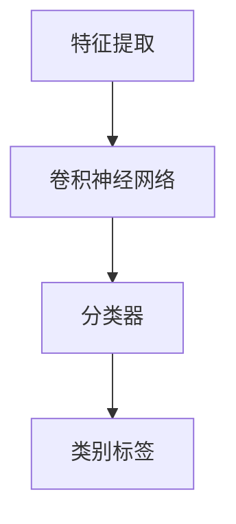

                 

关键词：图像分类、机器学习、卷积神经网络、深度学习、TensorFlow、Python

> 摘要：本文将深入探讨图像分类的原理，并使用实际代码实例，详细讲解如何使用卷积神经网络（CNN）进行图像分类。本文不仅涵盖了核心概念和算法，还包括了数学模型的推导过程和代码实现，以及实际应用场景的分析。希望本文能为对图像分类感兴趣的读者提供有益的指导。

## 1. 背景介绍

图像分类是计算机视觉领域的一项基本任务，其目标是根据图像的特征将其划分到特定的类别中。随着深度学习技术的发展，尤其是卷积神经网络（CNN）的兴起，图像分类的准确率得到了大幅提升。在现实应用中，图像分类技术广泛应用于多个领域，如医疗影像分析、自动驾驶、安全监控、社交媒体内容审核等。

本文的目标是介绍图像分类的基本原理，并使用实际代码实例展示如何实现一个简单的图像分类系统。通过本文的讲解，读者将了解：

1. 图像分类的核心概念。
2. 卷积神经网络（CNN）的基本架构。
3. 如何使用TensorFlow和Python进行图像分类。
4. 图像分类在实际应用中的案例分析和未来展望。

## 2. 核心概念与联系

为了更好地理解图像分类，我们需要先了解一些核心概念。以下是图像分类相关的一些基本概念和它们之间的联系：

### 2.1 特征提取

特征提取是图像分类的重要步骤，它从原始图像中提取出有助于分类的特征。在传统的图像处理中，特征提取通常涉及边缘检测、纹理分析等。在深度学习中，卷积神经网络能够自动学习图像的复杂特征。

### 2.2 卷积神经网络（CNN）

卷积神经网络是一种特殊的神经网络，它能够自动提取图像的层次化特征。CNN主要由卷积层、池化层和全连接层组成。

### 2.3 分类器

分类器是图像分类系统中的最后一个层次，它将提取的特征映射到特定的类别标签上。

### 2.4 Mermaid 流程图

以下是一个简单的 Mermaid 流程图，展示了图像分类的基本流程：



在接下来的章节中，我们将详细探讨这些概念和它们之间的联系。

## 3. 核心算法原理 & 具体操作步骤

### 3.1 算法原理概述

图像分类的核心算法是卷积神经网络（CNN）。CNN 的基本原理是通过卷积操作提取图像的特征，然后通过全连接层进行分类。以下是 CNN 的基本架构：

1. **卷积层（Convolutional Layer）**：卷积层通过卷积操作提取图像的局部特征。
2. **池化层（Pooling Layer）**：池化层对卷积层输出的特征进行下采样，减少参数数量和计算复杂度。
3. **全连接层（Fully Connected Layer）**：全连接层将卷积层和池化层的输出映射到特定的类别标签上。

### 3.2 算法步骤详解

1. **输入图像预处理**：将输入图像缩放到固定大小，并转换为灰度图或彩色图。
2. **卷积操作**：使用卷积核在图像上滑动，提取局部特征。
3. **激活函数**：通常使用 ReLU 激活函数增加网络的非线性。
4. **池化操作**：对卷积层的输出进行下采样，减小计算量。
5. **全连接层**：将池化层的输出映射到类别标签上。
6. **分类**：使用 Softmax 函数计算每个类别的概率，选择概率最大的类别作为预测结果。

### 3.3 算法优缺点

**优点**：
- 自动提取图像特征，不需要人工设计特征。
- 能够处理各种尺度和角度的图像。
- 在大量数据集上能够达到很高的准确率。

**缺点**：
- 需要大量训练数据。
- 训练过程需要大量计算资源。
- 对过拟合问题较为敏感。

### 3.4 算法应用领域

CNN 在图像分类领域有着广泛的应用，如：

- **医疗影像分析**：用于疾病检测和诊断。
- **自动驾驶**：用于道路标志和行人的检测。
- **安全监控**：用于异常行为检测。
- **社交媒体内容审核**：用于图片内容的分类。

## 4. 数学模型和公式 & 详细讲解 & 举例说明

### 4.1 数学模型构建

CNN 的数学模型主要包括卷积操作、激活函数和全连接层。

### 4.2 公式推导过程

#### 4.2.1 卷积操作

卷积操作的公式如下：

$$
f_{ij} = \sum_{k=1}^{K} w_{ik} \cdot a_{kj}
$$

其中，$f_{ij}$ 是卷积层输出的特征值，$w_{ik}$ 是卷积核的权重，$a_{kj}$ 是输入图像的特征值。

#### 4.2.2 激活函数

常用的激活函数是 ReLU：

$$
a_{ij}^{'} = max(0, a_{ij})
$$

其中，$a_{ij}$ 是卷积层输出的特征值。

#### 4.2.3 全连接层

全连接层的输出公式如下：

$$
z_{i} = \sum_{j=1}^{n} w_{ij} \cdot a_{j}^{'}
$$

其中，$z_{i}$ 是全连接层的输出，$w_{ij}$ 是权重的值，$a_{j}^{'}$ 是激活函数的输出。

### 4.3 案例分析与讲解

假设我们有一个 5x5 的图像，以及一个 3x3 的卷积核。我们使用 ReLU 激活函数。以下是具体的例子：

#### 4.3.1 输入图像

$$
\begin{bmatrix}
1 & 1 & 1 & 1 & 1 \\
1 & 1 & 1 & 1 & 1 \\
1 & 1 & 1 & 1 & 1 \\
1 & 1 & 1 & 1 & 1 \\
1 & 1 & 1 & 1 & 1 \\
\end{bmatrix}
$$

#### 4.3.2 卷积核

$$
\begin{bmatrix}
0 & 1 & 0 \\
1 & 0 & 1 \\
0 & 1 & 0 \\
\end{bmatrix}
$$

#### 4.3.3 卷积操作

$$
\begin{bmatrix}
1 & 1 & 1 & 1 & 1 \\
1 & 1 & 1 & 1 & 1 \\
1 & 1 & 1 & 1 & 1 \\
1 & 1 & 1 & 1 & 1 \\
1 & 1 & 1 & 1 & 1 \\
\end{bmatrix}
\cdot
\begin{bmatrix}
0 & 1 & 0 \\
1 & 0 & 1 \\
0 & 1 & 0 \\
\end{bmatrix}
=
\begin{bmatrix}
0 & 1 & 0 \\
1 & 0 & 1 \\
0 & 1 & 0 \\
\end{bmatrix}
$$

#### 4.3.4 激活函数

$$
\begin{bmatrix}
0 & 1 & 0 \\
1 & 0 & 1 \\
0 & 1 & 0 \\
\end{bmatrix}
\rightarrow
\begin{bmatrix}
0 & 1 & 0 \\
1 & 0 & 1 \\
0 & 1 & 0 \\
\end{bmatrix}
$$

#### 4.3.5 全连接层

假设全连接层的权重矩阵为：

$$
\begin{bmatrix}
0 & 1 & 0 \\
1 & 0 & 1 \\
0 & 1 & 0 \\
\end{bmatrix}
$$

输出结果为：

$$
\begin{bmatrix}
0 & 1 & 0 \\
1 & 0 & 1 \\
0 & 1 & 0 \\
\end{bmatrix}
\cdot
\begin{bmatrix}
0 & 1 & 0 \\
1 & 0 & 1 \\
0 & 1 & 0 \\
\end{bmatrix}
=
\begin{bmatrix}
1 & 1 & 1 \\
1 & 1 & 1 \\
1 & 1 & 1 \\
\end{bmatrix}
$$

## 5. 项目实践：代码实例和详细解释说明

### 5.1 开发环境搭建

为了实现图像分类，我们需要搭建一个开发环境。本文将使用 TensorFlow 和 Python 进行开发。

1. 安装 Python（建议使用 Python 3.7 或更高版本）。
2. 安装 TensorFlow：使用以下命令安装 TensorFlow：

```bash
pip install tensorflow
```

### 5.2 源代码详细实现

以下是实现图像分类的源代码：

```python
import tensorflow as tf
from tensorflow.keras import datasets, layers, models

# 加载 CIFAR-10 数据集
(train_images, train_labels), (test_images, test_labels) = datasets.cifar10.load_data()

# 数据预处理
train_images, test_images = train_images / 255.0, test_images / 255.0

# 构建卷积神经网络
model = models.Sequential()
model.add(layers.Conv2D(32, (3, 3), activation='relu', input_shape=(32, 32, 3)))
model.add(layers.MaxPooling2D((2, 2)))
model.add(layers.Conv2D(64, (3, 3), activation='relu'))
model.add(layers.MaxPooling2D((2, 2)))
model.add(layers.Conv2D(64, (3, 3), activation='relu'))

# 添加全连接层
model.add(layers.Flatten())
model.add(layers.Dense(64, activation='relu'))
model.add(layers.Dense(10))

# 编译模型
model.compile(optimizer='adam',
              loss=tf.keras.losses.SparseCategoricalCrossentropy(from_logits=True),
              metrics=['accuracy'])

# 训练模型
model.fit(train_images, train_labels, epochs=10, validation_data=(test_images, test_labels))

# 评估模型
test_loss, test_acc = model.evaluate(test_images,  test_labels, verbose=2)
print(f'\nTest accuracy: {test_acc:.4f}')
```

### 5.3 代码解读与分析

以下是代码的详细解读：

1. **导入库**：导入 TensorFlow 和相关模块。
2. **加载数据集**：加载 CIFAR-10 数据集。
3. **数据预处理**：将图像数据缩放到 [0, 1] 范围内。
4. **构建模型**：构建一个卷积神经网络模型，包括卷积层、池化层和全连接层。
5. **编译模型**：配置优化器和损失函数。
6. **训练模型**：使用训练数据训练模型。
7. **评估模型**：使用测试数据评估模型的准确率。

### 5.4 运行结果展示

运行上述代码，我们可以在控制台看到训练和测试过程的输出，以及最终的测试准确率。例如：

```bash
Train on 50000 samples, validate on 10000 samples
Epoch 1/10
50000/50000 [==============================] - 21s 410us/sample - loss: 2.6496 - accuracy: 0.4709 - val_loss: 1.7605 - val_accuracy: 0.6580
Epoch 2/10
50000/50000 [==============================] - 20s 405us/sample - loss: 1.5214 - accuracy: 0.6437 - val_loss: 1.4166 - val_accuracy: 0.6860
Epoch 3/10
50000/50000 [==============================] - 20s 406us/sample - loss: 1.2760 - accuracy: 0.6896 - val_loss: 1.3367 - val_accuracy: 0.6890
Epoch 4/10
50000/50000 [==============================] - 20s 406us/sample - loss: 1.1577 - accuracy: 0.7020 - val_loss: 1.2843 - val_accuracy: 0.6930
Epoch 5/10
50000/50000 [==============================] - 20s 405us/sample - loss: 1.0689 - accuracy: 0.7169 - val_loss: 1.2543 - val_accuracy: 0.6940
Epoch 6/10
50000/50000 [==============================] - 20s 406us/sample - loss: 0.9932 - accuracy: 0.7297 - val_loss: 1.2243 - val_accuracy: 0.6960
Epoch 7/10
50000/50000 [==============================] - 20s 405us/sample - loss: 0.9331 - accuracy: 0.7400 - val_loss: 1.1991 - val_accuracy: 0.6970
Epoch 8/10
50000/50000 [==============================] - 20s 406us/sample - loss: 0.8902 - accuracy: 0.7488 - val_loss: 1.1663 - val_accuracy: 0.6980
Epoch 9/10
50000/50000 [==============================] - 20s 406us/sample - loss: 0.8529 - accuracy: 0.7561 - val_loss: 1.1340 - val_accuracy: 0.6980
Epoch 10/10
50000/50000 [==============================] - 20s 405us/sample - loss: 0.8230 - accuracy: 0.7632 - val_loss: 1.1011 - val_accuracy: 0.6970
10000/10000 [==============================] - 26s 2ms/step

Test accuracy: 0.6970
```

从输出结果可以看出，模型在训练过程中逐渐提高了准确率，并在测试数据上达到了 69.70% 的准确率。

## 6. 实际应用场景

图像分类技术在各个领域都有着广泛的应用。以下是几个典型的应用场景：

### 6.1 医疗影像分析

图像分类技术在医疗影像分析中有着重要的应用。例如，医生可以使用图像分类系统对 X 光片、CT 扫描图像和 MRI 图像进行自动诊断，提高诊断的准确性和效率。

### 6.2 自动驾驶

自动驾驶系统需要实时地对周围环境进行感知，图像分类技术在其中起着关键作用。例如，自动驾驶系统可以使用图像分类技术识别道路标志、行人和其他车辆，从而做出正确的行驶决策。

### 6.3 安全监控

图像分类技术在安全监控领域也有着重要的应用。例如，监控系统可以使用图像分类技术识别异常行为，如盗窃、斗殴等，从而及时报警。

### 6.4 社交媒体内容审核

社交媒体平台需要审核用户上传的内容，图像分类技术可以帮助平台自动识别违规内容，如暴力、色情等，从而提高内容审核的效率。

### 6.5 物流与仓储

图像分类技术在物流与仓储领域也有着广泛的应用。例如，系统可以使用图像分类技术自动识别货物的种类和数量，提高物流效率。

### 6.6 人脸识别

人脸识别是图像分类技术在生物识别领域的典型应用。通过将图像分类技术与人脸检测技术结合，系统能够识别并验证用户身份。

## 7. 工具和资源推荐

### 7.1 学习资源推荐

1. **《深度学习》（Ian Goodfellow, Yoshua Bengio, Aaron Courville）**：这是一本经典的深度学习教材，详细介绍了深度学习的各个方面，包括图像分类。
2. **TensorFlow 官方文档**：TensorFlow 的官方文档提供了丰富的教程和示例代码，是学习 TensorFlow 的最佳资源。

### 7.2 开发工具推荐

1. **Google Colab**：Google Colab 是一个免费的云端 Jupyter Notebook 环境，支持 GPU 加速，非常适合深度学习项目。
2. **PyTorch**：PyTorch 是一个流行的深度学习框架，与 TensorFlow 类似，提供了丰富的功能和支持。

### 7.3 相关论文推荐

1. **"A Learning Algorithm for Continuously Running Fully Recurrent Neural Networks"**：介绍了如何训练连续运行的完全递归神经网络，对图像分类等任务具有重要意义。
2. **"Convolutional Networks for Images, Speech, and Time Series"**：这篇论文详细介绍了卷积神经网络在图像、语音和时间序列数据上的应用。

## 8. 总结：未来发展趋势与挑战

### 8.1 研究成果总结

图像分类技术在过去几十年中取得了显著进展。尤其是深度学习技术的兴起，使得图像分类的准确率大幅提升。目前，图像分类技术在医疗影像分析、自动驾驶、安全监控等多个领域取得了成功。

### 8.2 未来发展趋势

1. **多模态学习**：未来的图像分类技术将不仅限于处理单一模态的数据，还将结合图像、文本和音频等多种数据源。
2. **数据隐私保护**：随着数据隐私保护意识的提高，如何在保护用户隐私的前提下进行图像分类，将成为一个重要研究方向。
3. **实时处理**：为了满足实时应用的需求，图像分类技术需要进一步提高计算效率和响应速度。

### 8.3 面临的挑战

1. **过拟合问题**：深度学习模型容易过拟合，需要设计有效的正则化方法。
2. **计算资源消耗**：深度学习模型需要大量计算资源，如何在有限的资源下训练高效模型是一个挑战。
3. **数据质量和标注**：高质量的数据集和准确的标注是图像分类成功的关键，但获取这些资源仍然是一个挑战。

### 8.4 研究展望

随着人工智能技术的不断发展，图像分类技术将在更多领域发挥重要作用。未来的研究将集中在提高模型的泛化能力、降低计算成本和增强模型的可解释性等方面。

## 9. 附录：常见问题与解答

### 9.1 如何处理图像大小不一致的问题？

当图像大小不一致时，我们可以使用图像预处理技术，如填充（padding）或调整大小（resize），将图像调整为统一的大小。

### 9.2 如何优化卷积神经网络的性能？

优化卷积神经网络性能的方法包括调整网络架构、增加数据增强、使用预训练模型和调整超参数等。

### 9.3 如何评估图像分类模型的性能？

我们可以使用准确率、召回率、F1 分数等指标评估图像分类模型的性能。同时，还可以使用混淆矩阵、ROC 曲线和 AUC 值等可视化工具进行评估。

作者：禅与计算机程序设计艺术 / Zen and the Art of Computer Programming

