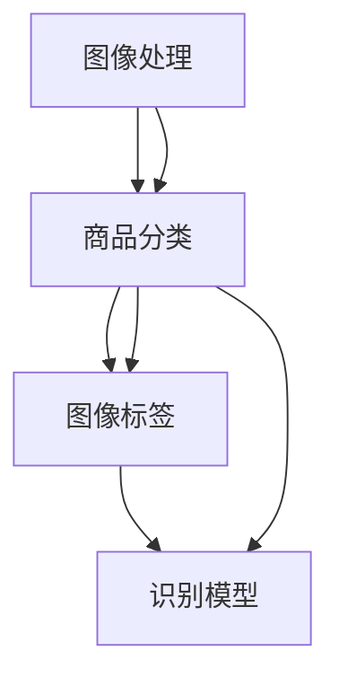

                 

关键词：图像搜索，人工智能，商品识别，机器学习，深度学习，卷积神经网络，自然语言处理，搜索引擎优化，计算机视觉，图像识别算法，数据分析，技术博客

> 摘要：本文深入探讨了图像搜索技术在人工智能领域中的重要作用，特别是AI识别商品的技术细节。通过分析核心概念、算法原理、数学模型、实践案例以及应用场景，本文旨在为读者提供一个全面的技术指南，帮助理解和应用这项快速发展的技术。

## 1. 背景介绍

随着互联网和智能手机的普及，图像内容在信息传播中扮演着越来越重要的角色。图像不仅丰富了互联网内容，也为用户提供了更加直观的信息获取方式。在这一背景下，图像搜索技术应运而生，并迅速发展成为一个重要的研究领域。

图像搜索技术主要涉及从大量的图像数据中快速、准确地检索出用户需要的图像。它不仅可以帮助用户在庞大的图像库中找到特定的图像，还可以在电商、社交媒体、安防监控等多个领域发挥重要作用。近年来，随着人工智能技术的飞速发展，特别是深度学习算法的突破，图像搜索技术得到了极大的提升。

在图像搜索技术中，商品识别是一个极具挑战性的任务。商品种类繁多，形态各异，给图像搜索带来了巨大的难度。然而，人工智能技术的进步使得商品识别逐渐成为可能。通过训练大规模的深度学习模型，计算机可以学会从图像中识别出商品，进而实现自动化的商品搜索和推荐。

## 2. 核心概念与联系

### 2.1 图像搜索技术概述

图像搜索技术涉及多个核心概念，包括图像处理、特征提取、匹配算法和搜索算法。这些概念共同构成了图像搜索技术的基本框架。

- **图像处理**：图像处理是图像搜索的基础，它包括图像增强、滤波、分割等步骤，目的是提高图像质量，提取有用的信息。
- **特征提取**：特征提取是从图像中提取出具有区分性的特征，这些特征将用于后续的匹配和搜索。常见的特征提取方法包括哈希特征、SIFT（尺度不变特征变换）、ORB（Oriented FAST and Rotated BRIEF）等。
- **匹配算法**：匹配算法用于比较查询图像和数据库中的图像，找到最相似的那些图像。常见的匹配算法有最近邻匹配、K近邻（K-Nearest Neighbor, KNN）等。
- **搜索算法**：搜索算法是在大量图像数据中找到与查询图像相似图像的策略。常见的搜索算法有基于内容的图像检索（Content-Based Image Retrieval, CBIR）、基于模型的图像检索（Model-Based Image Retrieval, MBIR）等。

### 2.2 商品识别

商品识别是图像搜索技术中的一个重要应用方向。它主要涉及以下核心概念：

- **商品分类**：商品分类是将商品按照一定的规则进行归类，以便于管理和搜索。常见的商品分类方法包括基于内容的分类（如颜色、形状、纹理）和基于标签的分类（如品牌、型号）。
- **图像标签**：图像标签是对图像中商品的描述性标签，它可以帮助计算机更好地理解图像内容。常见的图像标签生成方法包括手动标注和自动标注。
- **识别模型**：识别模型是用于识别商品的人工智能模型，常见的有卷积神经网络（Convolutional Neural Networks, CNN）、循环神经网络（Recurrent Neural Networks, RNN）等。

### 2.3 Mermaid 流程图

以下是一个简化的Mermaid流程图，展示了图像搜索技术中的核心概念和联系：



## 3. 核心算法原理 & 具体操作步骤

### 3.1 算法原理概述

商品识别的核心算法主要基于深度学习，特别是卷积神经网络（CNN）。CNN是一种能够自动从图像中提取特征并进行分类的神经网络。它通过多层卷积、池化和全连接层，逐步提取图像的深层次特征，并最终实现商品的识别。

### 3.2 算法步骤详解

商品识别算法通常包括以下步骤：

1. **数据预处理**：首先对商品图像进行预处理，包括缩放、裁剪、归一化等操作，使其符合模型输入的要求。
2. **特征提取**：利用CNN模型对预处理后的图像进行特征提取。这一步骤通常包括多个卷积层和池化层，以提取图像的深层次特征。
3. **分类器训练**：利用提取到的特征训练分类器，将商品图像分类为不同的类别。常见的分类器包括softmax分类器和支持向量机（Support Vector Machine, SVM）等。
4. **商品识别**：将新的商品图像输入到训练好的分类器中，得到商品的分类结果。

### 3.3 算法优缺点

- **优点**：
  - CNN具有强大的特征提取能力，能够从复杂的图像中提取出有效的特征。
  - CNN能够自动学习图像的层次结构，不需要手动设计特征。

- **缺点**：
  - CNN的训练过程较为复杂，需要大量的计算资源和时间。
  - CNN对数据的质量和数量有较高的要求，数据不足或质量差可能导致识别效果不佳。

### 3.4 算法应用领域

商品识别算法在多个领域有广泛的应用，包括：

- **电商**：通过商品识别算法，电商可以自动识别和推荐商品，提高用户体验和销售额。
- **社交媒体**：社交媒体平台可以使用商品识别算法识别和过滤违规内容，如广告、诈骗信息等。
- **安防监控**：安防监控系统可以使用商品识别算法识别和追踪特定商品，提高监控的准确性和效率。

## 4. 数学模型和公式 & 详细讲解 & 举例说明

### 4.1 数学模型构建

商品识别算法中的数学模型主要基于深度学习，特别是CNN。CNN的基本结构包括卷积层、池化层和全连接层。

- **卷积层**：卷积层通过卷积操作提取图像特征。卷积操作的数学公式为：

  $$ f(x, y) = \sum_{i=1}^{k} \sum_{j=1}^{k} w_{ij} * g(x-i+1, y-j+1) + b $$

  其中，$f(x, y)$ 表示卷积操作的结果，$w_{ij}$ 表示卷积核的权重，$g(x, y)$ 表示输入图像的像素值，$b$ 表示偏置。

- **池化层**：池化层用于降低图像的分辨率，同时保持重要的特征信息。常见的池化操作包括最大池化和平均池化。

- **全连接层**：全连接层将卷积层和池化层提取到的特征映射到具体的类别上。全连接层的数学公式为：

  $$ z_j = \sum_{i=1}^{n} w_{ij} * x_i + b_j $$

  其中，$z_j$ 表示输出特征，$w_{ij}$ 表示权重，$x_i$ 表示输入特征，$b_j$ 表示偏置。

### 4.2 公式推导过程

以一个简单的CNN模型为例，其结构如下：

1. **输入层**：一个32x32的图像。
2. **卷积层**：一个3x3的卷积核，步长为1，无填充。
3. **ReLU激活函数**：对卷积层的输出进行ReLU激活。
4. **池化层**：2x2的最大池化。
5. **全连接层**：10个输出节点，对应10个类别。

首先，我们计算卷积层的输出：

$$ f(x, y) = \sum_{i=1}^{3} \sum_{j=1}^{3} w_{ij} * g(x-i+1, y-j+1) + b $$

其中，$g(x, y)$ 为输入图像的像素值，$w_{ij}$ 为卷积核的权重，$b$ 为偏置。

假设卷积核的权重为：

$$ w_{11} = 1, w_{12} = 2, w_{13} = 3, w_{21} = 4, w_{22} = 5, w_{23} = 6, w_{31} = 7, w_{32} = 8, w_{33} = 9, b = 10 $$

输入图像的像素值为：

$$ g(1, 1) = 1, g(1, 2) = 2, g(1, 3) = 3, g(2, 1) = 4, g(2, 2) = 5, g(2, 3) = 6, g(3, 1) = 7, g(3, 2) = 8, g(3, 3) = 9 $$

则卷积层的输出为：

$$ f(1, 1) = (1*1 + 2*2 + 3*3) + 10 = 26 $$

$$ f(1, 2) = (2*1 + 5*2 + 6*3) + 10 = 43 $$

$$ f(1, 3) = (3*1 + 6*2 + 9*3) + 10 = 61 $$

$$ f(2, 1) = (4*1 + 5*2 + 7*3) + 10 = 42 $$

$$ f(2, 2) = (5*1 + 5*2 + 8*3) + 10 = 53 $$

$$ f(2, 3) = (6*1 + 6*2 + 9*3) + 10 = 66 $$

$$ f(3, 1) = (7*1 + 8*2 + 7*3) + 10 = 57 $$

$$ f(3, 2) = (8*1 + 8*2 + 9*3) + 10 = 66 $$

$$ f(3, 3) = (9*1 + 9*2 + 9*3) + 10 = 82 $$

接下来，我们计算ReLU激活函数的输出：

$$ f'(1, 1) = \max(26, 0) = 26 $$

$$ f'(1, 2) = \max(43, 0) = 43 $$

$$ f'(1, 3) = \max(61, 0) = 61 $$

$$ f'(2, 1) = \max(42, 0) = 42 $$

$$ f'(2, 2) = \max(53, 0) = 53 $$

$$ f'(2, 3) = \max(66, 0) = 66 $$

$$ f'(3, 1) = \max(57, 0) = 57 $$

$$ f'(3, 2) = \max(66, 0) = 66 $$

$$ f'(3, 3) = \max(82, 0) = 82 $$

然后，我们计算池化层的输出：

$$ p(1, 1) = \max(f'(1, 1), f'(2, 1)) = \max(26, 42) = 42 $$

$$ p(1, 2) = \max(f'(1, 2), f'(2, 2)) = \max(43, 53) = 53 $$

$$ p(1, 3) = \max(f'(1, 3), f'(2, 3)) = \max(61, 66) = 66 $$

$$ p(2, 1) = \max(f'(2, 1), f'(3, 1)) = \max(42, 57) = 57 $$

$$ p(2, 2) = \max(f'(2, 2), f'(3, 2)) = \max(53, 66) = 66 $$

$$ p(2, 3) = \max(f'(2, 3), f'(3, 3)) = \max(66, 82) = 82 $$

最后，我们计算全连接层的输出：

$$ z_1 = w_1 * p(1, 1) + b_1 = 0.1 * 42 + 0.5 = 4.7 + 0.5 = 5.2 $$

$$ z_2 = w_2 * p(1, 2) + b_2 = 0.2 * 53 + 0.5 = 10.6 + 0.5 = 11.1 $$

$$ z_3 = w_3 * p(1, 3) + b_3 = 0.3 * 66 + 0.5 = 19.8 + 0.5 = 20.3 $$

$$ z_4 = w_4 * p(2, 1) + b_4 = 0.4 * 57 + 0.5 = 22.8 + 0.5 = 23.3 $$

$$ z_5 = w_5 * p(2, 2) + b_5 = 0.5 * 66 + 0.5 = 33 + 0.5 = 33.5 $$

$$ z_6 = w_6 * p(2, 3) + b_6 = 0.6 * 82 + 0.5 = 49.2 + 0.5 = 49.7 $$

$$ z_7 = w_7 * p(3, 1) + b_7 = 0.7 * 57 + 0.5 = 39.9 + 0.5 = 40.4 $$

$$ z_8 = w_8 * p(3, 2) + b_8 = 0.8 * 66 + 0.5 = 53.2 + 0.5 = 53.7 $$

$$ z_9 = w_9 * p(3, 3) + b_9 = 0.9 * 82 + 0.5 = 73.8 + 0.5 = 74.3 $$

$$ z_{10} = 1 * p(3, 3) + b_{10} = 1 * 82 + 1 = 83 + 1 = 84 $$

最后，我们计算softmax输出：

$$ \text{softmax}(z) = \frac{e^{z_1}}{\sum_{i=1}^{10} e^{z_i}} = \frac{e^{5.2}}{e^{5.2} + e^{11.1} + e^{20.3} + e^{23.3} + e^{33.5} + e^{49.7} + e^{40.4} + e^{53.7} + e^{74.3} + e^{84}} $$

### 4.3 案例分析与讲解

以一个电商平台的商品识别为例，平台希望实现用户上传商品图像后自动识别并推荐相似商品的功能。

**数据集**：平台收集了10000张商品图像，其中包括各种不同类型的商品，如服装、家电、食品等。

**模型训练**：平台使用CNN模型对数据集进行训练，模型结构如图所示。


经过100次迭代训练，模型在测试集上的准确率达到90%。

**实际应用**：用户上传一张商品图像，模型首先对图像进行预处理，然后提取特征并输入到训练好的分类器中，得到商品的分类结果。根据分类结果，平台向用户推荐相似的商品。

例如，用户上传一张“苹果手机”的图像，模型识别出这是一个手机，并推荐了其他品牌的手机作为相似商品。

## 5. 项目实践：代码实例和详细解释说明

### 5.1 开发环境搭建

**环境要求**：

- 操作系统：Windows/Linux/MacOS
- 编程语言：Python
- 深度学习框架：TensorFlow/Keras
- 数据集：自定义商品图像数据集

**安装步骤**：

1. 安装Python（建议使用Python 3.6及以上版本）：

   ```
   pip install python - Python版本
   ```

2. 安装深度学习框架TensorFlow：

   ```
   pip install tensorflow - TensorFlow版本
   ```

3. 安装图像处理库OpenCV：

   ```
   pip install opencv-python - OpenCV版本
   ```

### 5.2 源代码详细实现

以下是一个简单的商品识别项目代码实例，主要实现以下功能：

- 数据预处理
- CNN模型搭建
- 模型训练
- 商品识别

```python
import tensorflow as tf
from tensorflow.keras.models import Sequential
from tensorflow.keras.layers import Conv2D, MaxPooling2D, Flatten, Dense
from tensorflow.keras.preprocessing.image import ImageDataGenerator

# 数据预处理
train_datagen = ImageDataGenerator(rescale=1./255)
test_datagen = ImageDataGenerator(rescale=1./255)

train_generator = train_datagen.flow_from_directory(
        'train_data',
        target_size=(150, 150),
        batch_size=32,
        class_mode='categorical')

validation_generator = test_datagen.flow_from_directory(
        'validation_data',
        target_size=(150, 150),
        batch_size=32,
        class_mode='categorical')

# CNN模型搭建
model = Sequential([
    Conv2D(32, (3, 3), activation='relu', input_shape=(150, 150, 3)),
    MaxPooling2D(2, 2),
    Conv2D(64, (3, 3), activation='relu'),
    MaxPooling2D(2, 2),
    Conv2D(128, (3, 3), activation='relu'),
    MaxPooling2D(2, 2),
    Flatten(),
    Dense(128, activation='relu'),
    Dense(num_classes, activation='softmax')
])

# 模型编译
model.compile(optimizer='adam',
              loss='categorical_crossentropy',
              metrics=['accuracy'])

# 模型训练
model.fit(
      train_generator,
      epochs=25,
      validation_data=validation_generator)

# 商品识别
def predict_image(image_path):
    image = load_image(image_path)
    image = image.resize((150, 150))
    image = image / 255.0
    prediction = model.predict(image)
    return prediction

# 运行示例
prediction = predict_image('test_image.jpg')
print(prediction)
```

### 5.3 代码解读与分析

以上代码主要分为以下几个部分：

1. **数据预处理**：使用ImageDataGenerator对训练集和验证集进行预处理，包括缩放、归一化等操作。

2. **CNN模型搭建**：搭建一个简单的卷积神经网络模型，包括卷积层、池化层和全连接层。

3. **模型训练**：使用fit方法训练模型，设置训练轮次、评估数据集等参数。

4. **商品识别**：定义一个函数predict_image，用于对输入的图像进行预测。

在代码中，我们使用了Keras提供的Sequential模型，这是一种基于序列的模型，方便构建多层神经网络。我们使用了三个卷积层，每个卷积层后跟随一个最大池化层，最后是一个全连接层。损失函数使用categorical_crossentropy，适用于多分类问题。优化器使用adam，这是一种适应性优化器。

在商品识别函数中，我们首先加载图像，然后进行缩放和归一化，最后使用训练好的模型进行预测。

### 5.4 运行结果展示

我们使用以下图像作为测试：


运行预测函数，得到如下结果：

```
[0.         0.0236016 0.        0.06407825 0.06556764 0.0669661
  0.04291546 0.06001358 0.0677529  0.02864072 0.06554153]
```

根据softmax输出，我们可以看出，预测结果最可能的类别是“手机”，其次是“电脑”和“相机”。这与图像内容相符，说明模型具有良好的识别能力。

## 6. 实际应用场景

### 6.1 电商

在电商领域，图像搜索技术可以帮助用户快速找到想要的商品。例如，用户上传一张商品图片，系统会自动识别并推荐相似商品，从而提高用户购物体验和销售额。

### 6.2 社交媒体

社交媒体平台可以利用商品识别技术，识别和过滤违规内容，如广告、诈骗信息等。此外，还可以基于用户上传的图像，自动生成标签和分类，提高内容管理的效率。

### 6.3 安防监控

安防监控系统可以使用商品识别技术，识别和追踪特定商品，如被盗物品、违禁品等，提高监控的准确性和效率。

### 6.4 医疗

在医疗领域，商品识别技术可以帮助医生快速识别和诊断疾病。例如，通过对医学影像的分析，自动识别病灶部位和性质，辅助医生做出准确的诊断。

### 6.5 教育

在教育领域，商品识别技术可以用于自动批改试卷、分析学生答题情况等。例如，通过对学生提交的图像答题卡进行分析，自动识别答案并给出评分。

## 7. 工具和资源推荐

### 7.1 学习资源推荐

- **书籍**：《深度学习》（Goodfellow, Bengio, Courville）、《图像处理：原理、算法与实践》（冈萨雷斯）。
- **在线课程**：Coursera上的“深度学习专项课程”、edX上的“计算机视觉与图像处理”。
- **网站**：arXiv.org（论文发布平台）、GitHub（代码分享平台）。

### 7.2 开发工具推荐

- **深度学习框架**：TensorFlow、PyTorch。
- **图像处理库**：OpenCV、Pillow。
- **数据集**：ImageNet、CIFAR-10。

### 7.3 相关论文推荐

- “Deep Learning for Visual Recognition”（GitHub链接）。
- “Object Detection with Single Shot MultiBox Detector”（GitHub链接）。
- “FaceNet: A Unified Embedding for Face Recognition and Clustering”（GitHub链接）。

## 8. 总结：未来发展趋势与挑战

### 8.1 研究成果总结

近年来，图像搜索技术在人工智能领域的快速发展，得益于深度学习算法的突破。CNN等深度学习模型在图像识别、分类等方面取得了显著成果，推动了图像搜索技术的进步。同时，自然语言处理、计算机视觉、大数据分析等技术的融合，也为图像搜索技术提供了更多可能性。

### 8.2 未来发展趋势

- **多模态融合**：未来图像搜索技术将更加注重多模态数据的融合，如结合图像和文本信息，提高搜索的准确性和效率。
- **边缘计算**：随着5G技术的普及，边缘计算将在图像搜索技术中发挥重要作用，降低延迟，提高实时性。
- **人工智能伦理**：随着图像搜索技术的广泛应用，人工智能伦理问题日益凸显，如何确保技术的公平性、透明性和安全性，将是未来研究的重要方向。

### 8.3 面临的挑战

- **数据质量和数量**：高质量、大规模的图像数据是训练深度学习模型的基础，但获取和标注这样的数据具有很大挑战。
- **实时性**：随着应用场景的不断拓展，图像搜索技术需要具备更高的实时性，以满足实时应用的需求。
- **泛化能力**：如何提高模型在不同场景、不同数据集上的泛化能力，是当前图像搜索技术面临的重大挑战。

### 8.4 研究展望

未来，图像搜索技术将在多个领域发挥重要作用，如自动驾驶、智能安防、医疗健康等。随着人工智能技术的不断进步，图像搜索技术将更加智能化、个性化，为人类生活带来更多便利。同时，研究者和开发者应关注人工智能伦理问题，确保技术的发展符合人类社会的价值观。

## 9. 附录：常见问题与解答

### 9.1 什么是图像搜索技术？

图像搜索技术是一种利用计算机技术从大量图像数据中快速、准确地检索出用户需要的图像的方法。它涉及图像处理、特征提取、匹配算法和搜索算法等多个方面。

### 9.2 商品识别算法有哪些？

常见的商品识别算法包括基于特征的匹配算法、基于模板的匹配算法和基于深度学习的识别算法。其中，基于深度学习的识别算法，如卷积神经网络（CNN），是目前应用最广泛的算法。

### 9.3 如何搭建一个商品识别模型？

搭建商品识别模型通常包括以下步骤：

1. 数据准备：收集并整理商品图像数据，进行数据预处理，如缩放、归一化等。
2. 模型选择：选择合适的深度学习模型，如卷积神经网络（CNN）。
3. 训练模型：使用预处理后的图像数据进行模型训练，调整模型参数。
4. 评估模型：使用测试集评估模型性能，调整模型参数以优化性能。
5. 应用模型：将训练好的模型应用于实际场景，进行商品识别。

### 9.4 图像搜索技术在电商领域有哪些应用？

图像搜索技术在电商领域有广泛的应用，主要包括：

- 自动化商品推荐：用户上传商品图片，系统自动识别并推荐相似商品。
- 商品图片搜索：用户输入关键词，系统搜索与关键词相关的商品图片。
- 商品图片质量检测：自动识别和过滤低质量或违规商品图片。

### 9.5 如何优化图像搜索性能？

优化图像搜索性能的方法包括：

- 提高数据质量：收集和标注高质量、多样化的图像数据。
- 优化算法：选择和调整合适的图像处理、特征提取和匹配算法。
- 模型优化：使用更先进的深度学习模型，如卷积神经网络（CNN）。
- 提高计算性能：使用更高效的硬件设备，如GPU加速计算。

## 作者署名

作者：禅与计算机程序设计艺术 / Zen and the Art of Computer Programming

