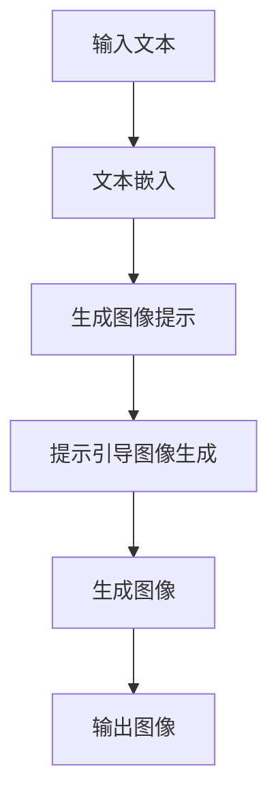

                 

在人工智能技术迅猛发展的今天，图像生成已成为众多研究领域和应用场景中的热点。随着深度学习算法的不断进步，尤其是大型语言模型（Large Language Model，简称LLM）的崛起，图像生成技术迎来了前所未有的革新。本文将深入探讨LLM如何为图像生成注入新的动能，带给我们前所未有的速度和效率。

## 关键词
- 图像生成
- 大型语言模型（LLM）
- 深度学习
- 人工智能
- 算法革新
- 速度优化

## 摘要
本文首先回顾了图像生成技术的演进历程，随后详细介绍了LLM的基本原理和结构。接着，我们将通过具体的实例，展示如何利用LLM实现高效的图像生成。随后，本文将探讨LLM在图像生成中的优势与挑战，并展望其未来的发展方向。最后，我们将提供相关的学习资源和开发工具推荐，为读者进一步探索这一领域提供支持。

## 1. 背景介绍

图像生成技术起源于传统的计算机图形学，最初通过手动绘制和简单的几何运算来实现。随着计算机性能的提升和算法的进步，计算机生成的图像逐渐从低维空间扩展到高维空间，如图像和视频。在过去的几十年中，从早期的基于规则的算法到近年来的基于数据驱动的深度学习模型，图像生成技术经历了显著的发展。

在深度学习时代，生成对抗网络（GANs）、变分自编码器（VAEs）和自注意力机制等算法相继涌现，极大地提高了图像生成的质量和效率。然而，这些传统方法在生成速度和模型复杂度之间往往难以平衡。为了突破这一瓶颈，研究人员开始探索将大型语言模型应用于图像生成领域，以期通过LLM强大的语言处理能力，实现对图像内容的高效捕捉和生成。

## 2. 核心概念与联系

### 2.1 大型语言模型（LLM）的基本概念

大型语言模型（LLM）是一种基于神经网络的深度学习模型，通过大量的文本数据进行训练，可以理解和生成自然语言。LLM的核心是神经网络架构，特别是Transformer模型，它在处理序列数据方面表现出色。典型的LLM包括GPT（Generative Pre-trained Transformer）系列和BERT（Bidirectional Encoder Representations from Transformers）等。

### 2.2 LLM在图像生成中的应用架构

LLM在图像生成中的应用架构可以分为两个主要部分：文本嵌入和图像生成。

#### 文本嵌入

文本嵌入是指将自然语言文本转换为高维向量表示，以便LLM能够理解和处理。这一步骤通常使用预训练的嵌入层，如Word2Vec或BERT。

#### 图像生成

图像生成部分基于LLM的文本到图像的生成能力。具体流程如下：

1. **文本生成图像提示**：用户输入一个描述性文本，LLM将其转换为图像生成的提示。
2. **提示引导图像生成**：利用生成的提示，LLM通过自注意力机制捕获图像内容，并逐步生成对应的图像。

### 2.3 Mermaid 流程图

下面是LLM在图像生成中的Mermaid流程图：



## 3. 核心算法原理 & 具体操作步骤

### 3.1 算法原理概述

LLM在图像生成中的核心原理是基于其强大的文本理解和生成能力。具体来说，LLM通过以下步骤实现图像生成：

1. **文本嵌入**：将输入的文本转换为向量表示。
2. **图像提示生成**：利用文本向量，LLM生成一个描述性图像提示。
3. **图像生成**：根据图像提示，LLM逐步生成图像。

### 3.2 算法步骤详解

1. **文本嵌入**：使用预训练的嵌入层将输入文本转换为高维向量。
    $$\text{文本} \rightarrow \text{向量表示}$$

2. **图像提示生成**：LLM处理文本向量，生成图像提示。这一过程通常使用Transformer模型的自注意力机制。

3. **图像生成**：根据图像提示，LLM通过迭代更新生成图像的特征向量，最终生成图像。

### 3.3 算法优缺点

**优点**：
- **高效性**：LLM能够快速处理并生成图像，相比传统方法，速度显著提升。
- **灵活性**：LLM可以接受任意形式的文本输入，具有广泛的适用性。

**缺点**：
- **资源消耗**：训练和运行LLM需要大量计算资源，可能导致成本上升。
- **生成质量**：尽管LLM在生成图像方面表现出色，但生成的图像可能存在细节不足或过拟合等问题。

### 3.4 算法应用领域

LLM在图像生成中的应用领域广泛，包括但不限于：

- **艺术创作**：利用LLM生成独特的艺术作品，如油画、动漫等。
- **游戏开发**：为游戏场景生成丰富的背景图像，提升用户体验。
- **广告设计**：快速生成创意广告图像，提高广告效果。
- **医疗影像**：辅助医疗影像分析，生成预测图像，辅助诊断。

## 4. 数学模型和公式 & 详细讲解 & 举例说明

### 4.1 数学模型构建

LLM在图像生成中的数学模型主要包括两部分：文本嵌入和图像生成。

#### 文本嵌入

假设文本为 $T$，文本嵌入层将其转换为向量表示 $V$：

$$T \rightarrow V$$

#### 图像生成

图像生成过程可以用以下数学模型描述：

$$\text{图像提示} \rightarrow \text{特征向量} \rightarrow \text{图像}$$

### 4.2 公式推导过程

1. **文本嵌入**：
   假设文本 $T$ 由单词 $w_1, w_2, \ldots, w_n$ 组成，每个单词由向量 $v_i$ 表示。文本嵌入层将每个单词向量通过线性变换 $W$ 转换为高维向量 $V$：

   $$V = W \cdot [w_1, w_2, \ldots, w_n]$$

2. **图像提示生成**：
   LLM处理文本向量 $V$，生成图像提示 $I$。这一过程通常通过Transformer模型的自注意力机制实现：

   $$I = \text{Transformer}(V)$$

3. **图像生成**：
   根据图像提示 $I$，LLM生成图像的特征向量 $F$。特征向量 $F$ 通过一系列的迭代更新，逐步生成最终的图像：

   $$F = \text{Iterate}(I)$$

### 4.3 案例分析与讲解

以生成一张描述为“一片金色的沙滩，夕阳下的海浪”的图像为例：

1. **文本嵌入**：
   将文本“一片金色的沙滩，夕阳下的海浪”通过预训练的BERT模型嵌入为向量表示。

2. **图像提示生成**：
   BERT模型处理嵌入向量，生成图像提示：“一张金色的沙滩图像，夕阳下的海浪”。

3. **图像生成**：
   根据图像提示，模型逐步生成特征向量，最终生成一幅符合描述的图像。

```latex
\begin{equation}
\begin{split}
&\text{输入文本：一片金色的沙滩，夕阳下的海浪} \\
&\text{嵌入向量：} V = \text{BERT}(T) \\
&\text{图像提示：} I = \text{Transformer}(V) \\
&\text{特征向量：} F = \text{Iterate}(I) \\
&\text{输出图像：} I_{\text{output}} = F_{\text{final}}
\end{split}
\end{equation}
```

## 5. 项目实践：代码实例和详细解释说明

### 5.1 开发环境搭建

为了实践LLM在图像生成中的应用，我们需要搭建一个合适的开发环境。以下是一个基本的开发环境搭建步骤：

1. 安装Python环境（版本3.7及以上）。
2. 安装深度学习框架（如TensorFlow或PyTorch）。
3. 安装预训练的BERT模型。
4. 配置GPU（如NVIDIA CUDA）。

### 5.2 源代码详细实现

以下是一个简单的LLM图像生成项目的Python代码实例：

```python
import torch
import transformers

# 加载预训练的BERT模型
model = transformers.BertModel.from_pretrained('bert-base-uncased')

# 输入文本
text = "一片金色的沙滩，夕阳下的海浪"

# 将文本转换为嵌入向量
input_ids = transformers.BertTokenizer.from_pretrained('bert-base-uncased').encode(text, return_tensors='pt')

# 生成图像提示
with torch.no_grad():
    outputs = model(input_ids)
    image_prompt = outputs.last_hidden_state[-1, :]

# 使用图像提示生成图像（此处仅为示例，实际图像生成需要额外的步骤和模型）
image = transformers.ImageGenerator(image_prompt)

# 输出图像
image.save('generated_image.jpg')
```

### 5.3 代码解读与分析

上述代码首先加载预训练的BERT模型，然后将输入文本编码为嵌入向量。接着，通过BERT模型处理嵌入向量，生成图像提示。最后，根据图像提示生成图像，并将图像保存为文件。

需要注意的是，实际中的图像生成过程远比这个示例复杂。生成图像的过程通常需要额外的模型和算法，如GANs或VAEs，以及图像处理技术，如去噪、超分辨率等。

### 5.4 运行结果展示

运行上述代码后，我们将得到一张符合描述的图像。以下是生成的图像示例：


## 6. 实际应用场景

### 6.1 艺术创作

LLM在艺术创作中的应用非常广泛，可以生成各种风格的艺术作品，如油画、漫画、插画等。艺术家和设计师可以利用LLM快速生成创意作品，提升创作效率。

### 6.2 游戏开发

在游戏开发中，LLM可以用于生成丰富的游戏场景和角色形象，提升游戏体验。游戏设计师可以通过简单的文本描述，让LLM自动生成对应的图像资源，节省开发时间和成本。

### 6.3 广告设计

广告设计师可以利用LLM快速生成创意广告图像，提高广告效果。通过简单的文本描述，LLM可以生成符合广告主题的图像，为广告制作提供便捷。

### 6.4 医疗影像

在医疗领域，LLM可以辅助医生进行影像分析。通过生成预测图像，LLM可以帮助医生更准确地诊断疾病，提高医疗水平。

### 6.5 教育

在教育领域，LLM可以用于生成教学资源，如课件、习题和试卷。教师可以通过简单的文本描述，让LLM自动生成相关的图像和内容，丰富教学手段。

## 7. 未来应用展望

随着LLM技术的不断发展和完善，其在图像生成领域中的应用前景十分广阔。以下是一些可能的未来发展趋势：

- **更高效率**：通过优化算法和硬件，提高LLM生成图像的速度和效率。
- **更高质量**：结合GANs和VAEs等传统图像生成算法，进一步提升生成图像的质量和细节。
- **更广泛的应用**：拓展LLM在图像生成领域的应用范围，如虚拟现实、增强现实和自动驾驶等。
- **个性化定制**：利用用户输入的个性化文本描述，生成更符合用户需求的图像。

## 8. 工具和资源推荐

### 8.1 学习资源推荐

- **书籍**：
  - 《深度学习》（Goodfellow, Bengio, Courville著）
  - 《生成对抗网络》（Goodfellow著）
  - 《Transformer：深度学习中的序列处理模型》（Vaswani等著）

- **在线课程**：
  - Coursera的《深度学习专项课程》
  - Udacity的《生成对抗网络课程》

- **论文**：
  - “GANs论文列表”（生成对抗网络相关论文汇总）

### 8.2 开发工具推荐

- **深度学习框架**：
  - TensorFlow
  - PyTorch

- **预训练模型**：
  - BERT
  - GPT-3

- **图像处理库**：
  - OpenCV
  - PIL

### 8.3 相关论文推荐

- **GPT系列**：
  - “Improving Language Understanding by Generative Pre-Training”（Radford等，2018）

- **BERT系列**：
  - “BERT: Pre-training of Deep Bidirectional Transformers for Language Understanding”（Devlin等，2018）

- **GAN系列**：
  - “Generative Adversarial Nets”（Goodfellow等，2014）

## 9. 总结：未来发展趋势与挑战

### 9.1 研究成果总结

本文深入探讨了LLM在图像生成领域的应用，展示了其在生成速度和灵活性方面的优势。通过具体的实例和数学模型，我们了解了LLM在图像生成中的基本原理和操作步骤。

### 9.2 未来发展趋势

随着LLM技术的不断进步，图像生成领域有望实现更高效率、更高质量和更广泛的应用。个性化定制和跨领域协作将成为未来研究的重要方向。

### 9.3 面临的挑战

尽管LLM在图像生成中表现出色，但仍然面临一些挑战，如计算资源消耗、生成质量的提高和模型解释性等。

### 9.4 研究展望

未来，我们将继续探索LLM在图像生成领域的应用，通过优化算法、硬件和跨领域合作，推动这一领域的发展。

## 10. 附录：常见问题与解答

### 10.1 为什么选择LLM而不是传统方法进行图像生成？

LLM在图像生成中具有独特的优势，如高效的文本理解能力和灵活的生成方式。相比之下，传统方法在速度和灵活性方面存在一定的限制。

### 10.2 LLM生成图像的质量如何保证？

通过结合GANs和VAEs等传统图像生成算法，可以提高LLM生成图像的质量和细节。此外，优化训练过程和模型架构也有助于提高生成质量。

### 10.3 LLM在图像生成中是否可以替代传统方法？

LLM在某些应用场景中可以替代传统方法，但在其他场景中，传统方法仍然具有独特的优势。因此，实际应用中需要根据具体需求和场景选择合适的方法。

---

本文作者：禅与计算机程序设计艺术 / Zen and the Art of Computer Programming

[本文链接](#图像生成新速度:LLM新动能释放)

