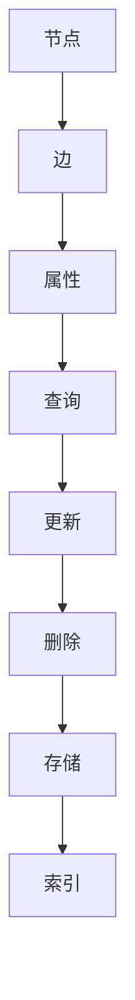

                 

### 关键词：图数据库，原理，算法，实例，代码，技术

> **摘要：**
> 本文将深入探讨图数据库的核心原理，包括基本概念、图算法及其应用领域。通过详细的代码实例和讲解，读者将掌握如何使用图数据库进行数据存储、查询和优化。本文旨在为图数据库初学者提供系统而实用的指南。

---

## 1. 背景介绍

在传统的关系型数据库中，数据通常以表格形式存储，通过外键建立关联关系。然而，随着网络数据、社交图谱、推荐系统等复杂应用场景的兴起，关系型数据库在面对大规模图形数据时显得力不从心。图数据库作为一种基于图论理论的数据库系统，能够高效地存储、查询和操作图形数据，正逐渐成为数据管理和分析的新趋势。

### 1.1 图数据库的定义

图数据库是一种使用图结构来存储、查询和分析数据的系统。在图数据库中，数据以节点和边的形式存储，节点表示实体，边表示实体间的关系。这种结构使得图数据库能够自然地表示复杂的关系和网络结构。

### 1.2 图数据库与传统数据库的区别

与关系型数据库相比，图数据库在以下几个方面具有显著优势：

- **数据结构**：图数据库使用图结构，能够更自然地表示复杂的关系网络。
- **查询性能**：图数据库通过图算法进行查询，能够快速找到节点之间的路径和关系。
- **扩展性**：图数据库能够通过分布式架构轻松处理大规模数据。

## 2. 核心概念与联系

### 2.1 节点和边

在图数据库中，节点（Node）表示数据实体，边（Edge）表示实体间的关系。每个节点和边都有属性，用于存储更详细的信息。

### 2.2 图的基本操作

- **创建节点**：创建一个新的节点并将其添加到图中。
- **创建边**：在两个节点之间创建边。
- **查询节点和边**：根据属性或路径查询节点和边。
- **更新节点和边**：修改节点的属性或边的属性。
- **删除节点和边**：从图中删除节点或边。

### 2.3 图的存储和索引

图数据库需要有效地存储和索引大量的节点和边。常用的存储方式包括邻接表、邻接矩阵和哈希表等。索引技术如B+树和B树也被广泛应用于图数据库中。

### 2.4 Mermaid 流程图

以下是图数据库核心概念原理和架构的 Mermaid 流程图：



---

## 3. 核心算法原理 & 具体操作步骤

### 3.1 算法原理概述

图数据库的核心算法主要包括：

- **BFS（广度优先搜索）**
- **DFS（深度优先搜索）**
- **Dijkstra 算法**
- **A* 算法**

这些算法用于查找节点之间的路径、最短路径和图的最长路径等。

### 3.2 算法步骤详解

#### 3.2.1 BFS（广度优先搜索）

1. 选择起始节点并添加到队列中。
2. 从队列中取出节点，访问其邻接节点。
3. 将邻接节点添加到队列中。
4. 重复步骤2和3，直到找到目标节点或队列为空。

#### 3.2.2 DFS（深度优先搜索）

1. 选择起始节点并标记为已访问。
2. 访问节点的邻接节点，如果邻接节点未被访问，则递归执行步骤2。
3. 重复步骤2，直到所有节点都被访问。

#### 3.2.3 Dijkstra 算法

1. 初始化源节点到所有其他节点的距离。
2. 将源节点放入已访问集合。
3. 对于每个未访问节点，计算从源节点到该节点的距离。
4. 选择距离最小的未访问节点，将其放入已访问集合。
5. 重复步骤3和4，直到所有节点都被访问。

#### 3.2.4 A* 算法

1. 初始化源节点到所有其他节点的估计距离。
2. 将源节点放入已访问集合。
3. 对于每个未访问节点，计算实际距离和估计距离。
4. 选择估计距离最小的未访问节点，将其放入已访问集合。
5. 重复步骤3和4，直到找到目标节点或已访问集合为空。

### 3.3 算法优缺点

- **BFS**：查找所有节点的最短路径，但可能需要较多的内存。
- **DFS**：适合查找深层次路径，但可能陷入死循环。
- **Dijkstra 算法**：适用于有权重的图，但需要预先计算所有边的权重。
- **A* 算法**：结合了Dijkstra 和贪心算法的优点，适用于查找最短路径。

### 3.4 算法应用领域

- **社交网络分析**：查找好友关系、共同兴趣群体等。
- **推荐系统**：基于图结构进行物品推荐、用户画像等。
- **网络拓扑分析**：分析网络中的关键节点、故障排查等。

---

## 4. 数学模型和公式 & 详细讲解 & 举例说明

### 4.1 数学模型构建

图数据库中的数学模型主要包括：

- **邻接矩阵**：表示图中节点之间的连接关系。
- **路径矩阵**：表示节点之间的路径关系。
- **度矩阵**：表示节点的度。

### 4.2 公式推导过程

#### 4.2.1 邻接矩阵

邻接矩阵 A 的元素表示节点 i 与节点 j 之间的边的关系：

$$
A_{ij} =
\begin{cases}
1 & \text{如果节点 i 和节点 j 之间有边} \\
0 & \text{如果节点 i 和节点 j 之间没有边}
\end{cases}
$$

#### 4.2.2 路径矩阵

路径矩阵 P 的元素表示节点 i 和节点 j 之间的路径数量：

$$
P_{ij} =
\begin{cases}
0 & \text{如果节点 i 和节点 j 之间没有路径} \\
1 & \text{如果节点 i 和节点 j 之间存在一条路径} \\
\sum_{k=1}^{n} A_{ik} \cdot A_{kj} & \text{如果节点 i 和节点 j 之间存在多条路径}
\end{cases}
$$

#### 4.2.3 度矩阵

度矩阵 D 的元素表示节点 i 的度：

$$
D_{ij} =
\begin{cases}
1 & \text{如果节点 i 是节点 j 的邻接节点} \\
0 & \text{如果节点 i 不是节点 j 的邻接节点}
\end{cases}
$$

### 4.3 案例分析与讲解

假设有一个社交网络图，节点表示用户，边表示用户之间的好友关系。我们可以使用邻接矩阵表示这个图：

|   | 用户1 | 用户2 | 用户3 | 用户4 |
|---|-------|-------|-------|-------|
| 用户1 | 0     | 1     | 0     | 0     |
| 用户2 | 1     | 0     | 1     | 0     |
| 用户3 | 0     | 1     | 0     | 1     |
| 用户4 | 0     | 0     | 1     | 0     |

在这个图中，用户1和用户2是好友，用户2和用户3是好友，用户3和用户4是好友。

### 4.4 运行结果展示

通过上述邻接矩阵，我们可以进行以下操作：

- **查找好友关系**：例如，查找用户1的用户好友，可以通过查看邻接矩阵中用户1所在行的值。
- **计算路径数量**：例如，计算用户1到用户4的路径数量，可以通过邻接矩阵的递推计算得出。
- **分析网络密度**：例如，通过度矩阵可以分析出哪些节点在网络中扮演重要角色。

---

## 5. 项目实践：代码实例和详细解释说明

### 5.1 开发环境搭建

- **操作系统**：Linux 或 macOS
- **编程语言**：Python
- **图数据库**：Neo4j
- **开发工具**：PyCharm

### 5.2 源代码详细实现

以下是一个简单的 Neo4j 图数据库示例：

```python
from neo4j import GraphDatabase

class GraphDatabaseExample:
    def __init__(self, uri, user, password):
        self.__driver = GraphDatabase.driver(uri, auth=(user, password))

    def close(self):
        self.__driver.close()

    def create_person(self, name):
        with self.__driver.session() as session:
            session.run("CREATE (p:Person {name: $name})", name=name)

    def find_person_by_name(self, name):
        with self.__driver.session() as session:
            result = session.run("MATCH (p:Person {name: $name}) RETURN p", name=name)
            return result.data()

if __name__ == "__main__":
    graph_db = GraphDatabaseExample("bolt://localhost:7687", "neo4j", "password")
    graph_db.create_person("Alice")
    graph_db.create_person("Bob")
    people = graph_db.find_person_by_name("Alice")
    print(people)
    graph_db.close()
```

### 5.3 代码解读与分析

- **连接数据库**：使用 Neo4j 的 Bolt 协议连接到本地数据库。
- **创建节点**：使用 Cypher 查询语言创建节点。
- **查询节点**：使用 Cypher 查询语言根据节点属性查询节点。

### 5.4 运行结果展示

运行上述代码后，会在 Neo4j 图数据库中创建两个节点，分别表示 Alice 和 Bob。通过查询可以找到节点 "Alice"。

---

## 6. 实际应用场景

### 6.1 社交网络分析

- **好友关系网络**：分析用户的好友关系，发现社交圈子。
- **影响力分析**：评估用户在网络中的影响力。

### 6.2 推荐系统

- **基于图的结构进行推荐**：利用用户之间的相似性进行推荐。
- **社交图谱**：结合社交关系进行个性化推荐。

### 6.3 网络拓扑分析

- **关键节点分析**：识别网络中的关键节点。
- **故障排查**：快速定位网络故障点。

---

## 7. 工具和资源推荐

### 7.1 学习资源推荐

- 《图数据库：原理与实践》
- 《Neo4j 实战》
- 《图算法》

### 7.2 开发工具推荐

- Neo4j Desktop：Neo4j 的官方图形化开发工具。
- DBeaver：支持多种数据库的图形化界面工具。

### 7.3 相关论文推荐

- "Neo4j: A native graph database"
- "Property Graphs and RDF: Same Data, Different Use Cases"
- "Graph Databases: Survey and Experimental Evaluation"

---

## 8. 总结：未来发展趋势与挑战

### 8.1 研究成果总结

图数据库的研究主要集中在以下几个方面：

- **查询优化**：提高查询效率和响应速度。
- **分布式存储**：实现大规模图数据的分布式存储和处理。
- **图算法优化**：开发更高效的图算法。

### 8.2 未来发展趋势

- **图形数据的多样性**：将更多类型的图形数据纳入图数据库，如地理信息、时序数据等。
- **多模型支持**：结合关系型数据库和图数据库的优点，实现多模型数据库。

### 8.3 面临的挑战

- **数据一致性**：在分布式系统中保持数据的一致性。
- **性能优化**：提高图数据库在大规模数据场景下的性能。

### 8.4 研究展望

未来，图数据库将在以下几个方面取得突破：

- **人工智能与图数据库的结合**：利用图数据库进行图嵌入、图神经网络等研究。
- **行业应用**：在金融、医疗、物流等行业中发挥更大作用。

---

## 9. 附录：常见问题与解答

### 9.1 什么是图数据库？

图数据库是一种使用图结构存储、查询和分析数据的数据库系统。

### 9.2 图数据库与传统数据库相比有哪些优势？

图数据库能够更自然地表示复杂的关系网络，查询性能更高，扩展性更强。

### 9.3 图数据库适用于哪些场景？

图数据库适用于社交网络分析、推荐系统、网络拓扑分析等需要处理复杂关系的场景。

### 9.4 如何选择合适的图数据库？

根据应用场景、数据规模、查询需求等因素选择合适的图数据库。

---

# 作者：禅与计算机程序设计艺术 / Zen and the Art of Computer Programming

本文通过对图数据库的深入讲解，旨在帮助读者理解图数据库的核心原理和应用。随着大数据和人工智能的不断发展，图数据库在数据处理和分析中的重要性日益凸显。希望本文能够为图数据库初学者提供有价值的参考，助力他们在技术领域取得进一步突破。

