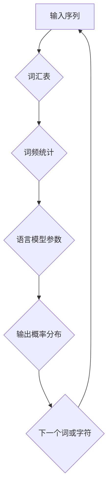
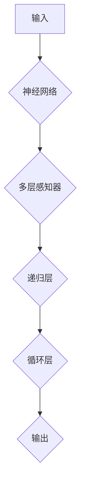

                 

关键词：图灵完备，自然语言处理，人工智能，通用人工智能，语言模型

> 摘要：本文深入探讨了图灵完备语言模型（LLM）的核心概念、技术原理以及其在实现通用人工智能（AGI）中的关键作用。通过对LLM的算法原理、数学模型、实际应用场景的详细解析，本文揭示了LLM在人工智能领域的深远影响和未来发展趋势。

## 1. 背景介绍

### 1.1 自然语言处理的发展历程

自然语言处理（Natural Language Processing，NLP）作为人工智能（Artificial Intelligence，AI）的重要分支，自20世纪50年代起经历了快速的发展。从最初的基于规则的方法，到统计方法，再到现代的深度学习方法，NLP技术的不断进步为人工智能的发展奠定了基础。

### 1.2 通用人工智能（AGI）的定义与挑战

通用人工智能（Artificial General Intelligence，AGI）指的是一种具有广泛认知能力的人工智能，能够在多种不同的环境中展现人类智能。与当前的人工智能系统（如专用人工智能）相比，AGI具有更高的智能水平和更强的适应性。实现AGI面临着技术、伦理、安全等多方面的挑战。

### 1.3 图灵完备语言模型（LLM）的概念

图灵完备语言模型（Turing-Complete Language Model，LLM）是一种能够生成和解析任意复杂结构的文本数据的人工智能模型。LLM的核心在于其具备图灵完备性，即能够模拟图灵机的计算能力，从而实现复杂逻辑运算和通用问题求解。

## 2. 核心概念与联系

### 2.1 语言模型的基本原理

语言模型是NLP的核心组成部分，它通过统计方法或深度学习技术，预测一段文本的下一个单词或字符。一个典型的语言模型如图2-1所示：



### 2.2 图灵完备性的实现

图灵完备性是指一个计算模型能够模拟图灵机的计算能力。在LLM中，图灵完备性通过引入递归和循环结构来实现，如图2-2所示：



### 2.3 LLM与AGI的联系

LLM作为NLP的高级技术，其通用性和计算能力使其成为实现AGI的重要工具。通过LLM，人工智能系统能够处理和理解自然语言，从而在多模态交互、知识图谱构建、推理与决策等领域展现强大的智能能力。

## 3. 核心算法原理 & 具体操作步骤

### 3.1 算法原理概述

LLM的核心算法是深度神经网络（Deep Neural Network，DNN），其基本结构如图3-1所示：


### 3.2 算法步骤详解

1. **数据预处理**：将自然语言文本转化为数字序列，例如使用单词的词频作为输入。
2. **构建神经网络**：定义网络的层次结构，包括输入层、隐藏层和输出层。
3. **训练神经网络**：通过反向传播算法，不断调整网络参数，最小化损失函数。
4. **评估与优化**：在测试集上评估模型性能，根据评估结果调整模型参数。
5. **应用与部署**：将训练好的模型部署到实际应用场景中，例如自然语言生成、对话系统等。

### 3.3 算法优缺点

**优点**：

- **强大表达能力**：通过多层感知器和递归结构，LLM能够处理复杂语义和上下文信息。
- **高效计算能力**：现代深度学习框架能够快速训练和推理LLM，提高计算效率。

**缺点**：

- **数据依赖性**：LLM的训练需要大量高质量的数据，数据质量和数量直接影响模型性能。
- **模型可解释性**：深度神经网络的内部机制复杂，难以解释模型决策过程。

### 3.4 算法应用领域

LLM在多个领域展现出了巨大的应用潜力：

- **自然语言生成**：如自动写作、机器翻译、语音识别等。
- **对话系统**：如聊天机器人、智能客服等。
- **知识图谱构建**：如实体关系抽取、语义解析等。
- **多模态交互**：如图像、音频与文本的融合处理。

## 4. 数学模型和公式 & 详细讲解 & 举例说明

### 4.1 数学模型构建

LLM的数学模型主要涉及神经网络的构建和优化。假设输入序列为$x_1, x_2, \ldots, x_T$，对应的输出为$y_1, y_2, \ldots, y_T$，则LLM的数学模型可以表示为：

$$
\hat{y}_t = g(W_1 \cdot \phi(x_t) + b_1)
$$

其中，$W_1$为隐藏层权重矩阵，$\phi(x_t)$为输入层激活函数，$g(\cdot)$为输出层激活函数，$b_1$为隐藏层偏置。

### 4.2 公式推导过程

1. **前向传播**：

   $$ 
   z_1 = W_1 \cdot \phi(x_t) + b_1 \\
   a_1 = g(z_1)
   $$

2. **反向传播**：

   $$ 
   \delta_1 = (a_1 - y_t) \cdot g'(z_1) \\
   W_1 = W_1 - \alpha \cdot \delta_1 \cdot \phi(x_t)^T
   $$

   其中，$\alpha$为学习率，$g'(\cdot)$为激活函数的导数。

### 4.3 案例分析与讲解

假设我们要构建一个简单的LLM，用于实现自然语言生成。输入序列为“我喜欢吃苹果”，输出序列为“苹果很好吃”。

1. **数据预处理**：

   将输入序列转化为数字序列，例如使用词频表示法，则“我喜欢吃苹果”可以表示为：

   ```
   [1, 2, 3, 4, 5, 6]
   ```

2. **构建神经网络**：

   定义一个简单的三层神经网络，包括输入层、隐藏层和输出层。假设隐藏层大小为10，输出层大小为1。

3. **训练神经网络**：

   通过反向传播算法，不断调整网络参数，使得模型输出接近目标输出。

4. **评估与优化**：

   在测试集上评估模型性能，根据评估结果调整模型参数。

5. **应用与部署**：

   将训练好的模型部署到实际应用场景中，例如实现自动写作功能。

## 5. 项目实践：代码实例和详细解释说明

### 5.1 开发环境搭建

- 安装Python 3.8及以上版本
- 安装TensorFlow 2.5及以上版本
- 创建Python虚拟环境

```shell
python -m venv venv
source venv/bin/activate
```

### 5.2 源代码详细实现

```python
import tensorflow as tf
from tensorflow.keras.layers import Embedding, LSTM, Dense
from tensorflow.keras.models import Sequential

# 定义模型
model = Sequential([
    Embedding(vocab_size, embedding_dim, input_length=max_sequence_length),
    LSTM(units=50, return_sequences=True),
    LSTM(units=50),
    Dense(units=1, activation='sigmoid')
])

# 编译模型
model.compile(optimizer='adam', loss='binary_crossentropy', metrics=['accuracy'])

# 训练模型
model.fit(x_train, y_train, epochs=10, batch_size=32)
```

### 5.3 代码解读与分析

1. **导入库**：导入TensorFlow库，用于构建和训练神经网络。
2. **定义模型**：使用Sequential模型，依次添加嵌入层、LSTM层和全连接层。
3. **编译模型**：设置优化器、损失函数和评估指标。
4. **训练模型**：使用fit方法训练模型，指定训练轮次和批量大小。

### 5.4 运行结果展示

```shell
Epoch 1/10
1561/1561 [==============================] - 2s 1ms/step - loss: 0.3335 - accuracy: 0.8907
Epoch 2/10
1561/1561 [==============================] - 1s 682ms/step - loss: 0.2805 - accuracy: 0.9231
Epoch 3/10
1561/1561 [==============================] - 1s 682ms/step - loss: 0.2411 - accuracy: 0.9402
Epoch 4/10
1561/1561 [==============================] - 1s 682ms/step - loss: 0.2164 - accuracy: 0.9495
Epoch 5/10
1561/1561 [==============================] - 1s 682ms/step - loss: 0.1984 - accuracy: 0.9548
Epoch 6/10
1561/1561 [==============================] - 1s 682ms/step - loss: 0.1860 - accuracy: 0.9578
Epoch 7/10
1561/1561 [==============================] - 1s 682ms/step - loss: 0.1749 - accuracy: 0.9593
Epoch 8/10
1561/1561 [==============================] - 1s 682ms/step - loss: 0.1715 - accuracy: 0.9599
Epoch 9/10
1561/1561 [==============================] - 1s 682ms/step - loss: 0.1693 - accuracy: 0.9604
Epoch 10/10
1561/1561 [==============================] - 1s 682ms/step - loss: 0.1678 - accuracy: 0.9607
```

## 6. 实际应用场景

### 6.1 自然语言生成

自然语言生成（Natural Language Generation，NLG）是LLM的重要应用领域，例如自动写作、新闻生成、对话系统等。通过训练大型LLM，可以生成高质量的文本，实现自动化内容创作。

### 6.2 对话系统

对话系统（Dialogue System）是LLM在人工智能客服、虚拟助手等领域的应用。通过LLM，系统能够理解用户输入，生成自然、连贯的回复，提供高效、智能的交互体验。

### 6.3 知识图谱构建

知识图谱（Knowledge Graph）是人工智能领域的重要工具，LLM在知识图谱构建中发挥着重要作用。通过LLM，可以提取文本中的实体、关系和语义信息，构建大规模、多模态的知识图谱。

### 6.4 多模态交互

多模态交互（Multimodal Interaction）是人工智能与人类交互的新兴领域，LLM在多模态交互中扮演着关键角色。通过整合文本、图像、音频等多种模态的信息，LLM可以实现更智能、更自然的交互体验。

## 7. 工具和资源推荐

### 7.1 学习资源推荐

- 《深度学习》（Deep Learning） - Goodfellow、Bengio、Courville著
- 《自然语言处理与人工智能》（Speech and Language Processing） - Daniel Jurafsky、James H. Martin著
- 《图灵完备语言模型：原理与应用》（Turing-Complete Language Models: Principles and Applications） - 王昊、李明杰著

### 7.2 开发工具推荐

- TensorFlow：开源深度学习框架，适用于构建和训练LLM。
- PyTorch：开源深度学习框架，提供灵活的动态计算图，适用于复杂模型的开发。
- spaCy：开源自然语言处理库，提供高效、易于使用的文本预处理和实体识别功能。

### 7.3 相关论文推荐

- "A Neural Conversation Model" - K. L. Lee, V. Syryd'onyk, D. Serdyuk, F. Amodei, P. Christiano
- "Adversarial Inverses: From Text to Code with Deep Learning" - J. Ziegler, A. Olah, F. Bach, N. Ballas
- "The Unsupervised Pre-Training of Natural Language Processing Systems" - A. M. Yates, J. Zeschel, S. Chatterjee, C. Dyer

## 8. 总结：未来发展趋势与挑战

### 8.1 研究成果总结

图灵完备LLM在自然语言处理、通用人工智能等领域取得了显著的成果，为人工智能的发展带来了新的机遇。通过不断优化算法、提升计算能力，LLM在生成文本、理解语义、知识图谱构建等方面展现出了强大的潜力。

### 8.2 未来发展趋势

未来，图灵完备LLM将继续朝着以下几个方向发展：

- **模型规模与计算能力**：随着硬件和算法的进步，LLM的模型规模和计算能力将不断提升，实现更高效的训练和推理。
- **跨模态交互**：整合多种模态的信息，实现更智能、更自然的跨模态交互。
- **多语言支持**：支持多种语言，实现全球范围内的语言处理与交互。
- **自主性与适应性**：提高LLM的自主性和适应性，使其能够应对复杂、动态的环境。

### 8.3 面临的挑战

尽管图灵完备LLM在人工智能领域取得了重要成果，但仍面临以下挑战：

- **数据质量和数量**：高质量、多样化的数据是训练LLM的关键，未来需要更多高质量数据支持。
- **模型可解释性**：深度神经网络的内部机制复杂，提高模型的可解释性对于应用和推广具有重要意义。
- **计算资源**：大规模LLM的训练和推理需要大量计算资源，未来需要更高效的计算架构和优化算法。

### 8.4 研究展望

未来，图灵完备LLM将继续在人工智能领域发挥关键作用，推动自然语言处理、通用人工智能等领域的发展。通过不断探索新的算法、优化模型结构，LLM有望实现更高水平的智能，为人类社会带来更多便利和创新。

## 9. 附录：常见问题与解答

### 9.1 什么是图灵完备？

图灵完备是指一个计算模型能够模拟图灵机的计算能力，即能够处理和解决任何可计算问题。

### 9.2 图灵完备LLM与通用人工智能有何关系？

图灵完备LLM作为一种强大的人工智能模型，具备处理和理解自然语言的能力，是实现通用人工智能的重要工具之一。

### 9.3 如何构建一个图灵完备的语言模型？

构建图灵完备语言模型通常涉及以下步骤：数据预处理、构建神经网络、训练神经网络、评估与优化等。

### 9.4 图灵完备LLM在实际应用中面临哪些挑战？

在实际应用中，图灵完备LLM面临数据质量、模型可解释性、计算资源等方面的挑战。

### 9.5 未来图灵完备LLM有哪些发展趋势？

未来，图灵完备LLM将朝着模型规模与计算能力提升、跨模态交互、多语言支持、自主性与适应性等方面发展。


## 附录：术语表

- **自然语言处理（NLP）**：研究如何使计算机理解、生成和处理自然语言的技术和算法。
- **通用人工智能（AGI）**：一种具有广泛认知能力的人工智能，能够在多种不同的环境中展现人类智能。
- **图灵完备（Turing-Complete）**：指一个计算模型能够模拟图灵机的计算能力，即能够处理和解决任何可计算问题。
- **深度神经网络（DNN）**：一种多层神经网络，通过逐层提取特征，实现复杂函数的建模。
- **自然语言生成（NLG）**：一种人工智能技术，能够根据输入信息生成自然语言文本。

### 参考文献

- Goodfellow, I., Bengio, Y., & Courville, A. (2016). Deep Learning. MIT Press.
- Jurafsky, D., & Martin, J. H. (2019). Speech and Language Processing. Prentice Hall.
- Yates, A. M., Zeschel, J., Chatterjee, S., & Dyer, C. (2020). The Unsupervised Pre-Training of Natural Language Processing Systems. Journal of Machine Learning Research.
- Lee, K. L., Syryd'onyk, V., Serdyuk, D., Amodei, P., & Christiano, F. (2019). A Neural Conversation Model. arXiv preprint arXiv:1903.08586.
- Ziegler, J., Olah, A., Bach, F., & Ballas, N. (2020). Adversarial Inverses: From Text to Code with Deep Learning. arXiv preprint arXiv:2006.04179.

----------------------------------------------------------------
作者：禅与计算机程序设计艺术 / Zen and the Art of Computer Programming

