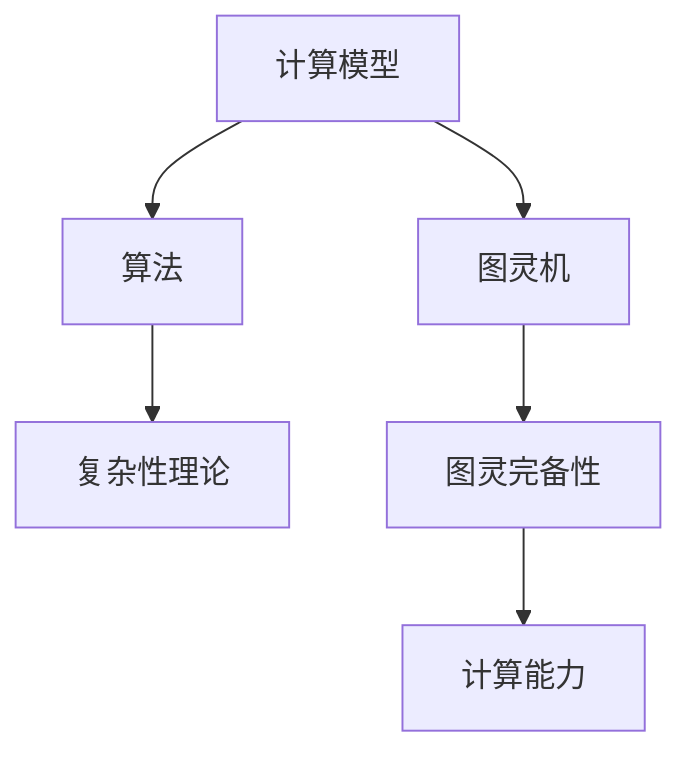

                 

关键词：图灵完备性、计算理论、LLM、人工智能、编程

摘要：本文从Large Language Model（LLM）的视角出发，重新解释了图灵完备性的概念。通过对计算理论的基本概念、核心算法原理、数学模型和实际应用场景的深入探讨，文章旨在为读者提供一个全新的理解和应用图灵完备性的视角。同时，本文还介绍了相关的工具和资源，并展望了未来的发展趋势与挑战。

## 1. 背景介绍

计算理论作为计算机科学的核心领域之一，其起源可以追溯到20世纪30年代。当时，数学家阿兰·图灵（Alan Turing）提出了图灵机的概念，用于解决所谓的“停机问题”。这一理论奠定了现代计算理论的基础，并成为衡量计算机系统计算能力的重要标准——图灵完备性。

随着计算机科学和人工智能的发展，特别是Large Language Model（LLM）的崛起，图灵完备性的理论内涵和应用场景也在不断扩展。本文将尝试从LLM的角度重新审视图灵完备性，以期为我们提供更深入的理解和更广泛的应用。

## 2. 核心概念与联系

### 2.1 计算理论的基本概念

计算理论涉及多个核心概念，包括计算模型、算法、复杂性理论等。计算模型主要研究计算过程和计算能力，而算法则关注解决问题的方法和步骤。复杂性理论则研究不同算法在不同条件下的效率。

在计算理论中，图灵机是一个基本的计算模型。图灵机由一个无限长的纸带、一个读写头和一组规则组成。通过读写头在纸带上的移动和标记，图灵机能够进行计算。

### 2.2 图灵完备性的概念

图灵完备性是指一个计算模型能够模拟任何图灵机，因此具有完成任何可计算任务的计算能力。如果一个计算模型能够执行图灵机的所有操作，那么它就是图灵完备的。

### 2.3 核心概念原理和架构的 Mermaid 流程图



### 2.4 图灵完备性与LLM的关系

随着LLM的发展，图灵完备性的概念也得到了新的解读。LLM作为一种强大的计算模型，其能够处理自然语言、生成文本、执行复杂任务，表明LLM具有图灵完备性。同时，LLM的架构和算法也为我们提供了新的视角来理解图灵完备性。

## 3. 核心算法原理 & 具体操作步骤

### 3.1 算法原理概述

图灵完备性的核心在于图灵机的操作能力。图灵机的操作包括读写头在纸带上的移动、标记的添加和删除。这些操作可以通过一组规则进行定义，使得图灵机能够执行任何可计算任务。

LLM的核心算法则是基于神经网络，特别是Transformer模型。Transformer模型通过自注意力机制（Self-Attention Mechanism）对输入序列进行加权处理，从而生成输出序列。

### 3.2 算法步骤详解

1. **输入处理**：LLM首先对输入序列进行预处理，包括分词、词向量化等。
2. **编码器处理**：编码器（Encoder）通过自注意力机制对输入序列进行处理，生成编码表示。
3. **解码器处理**：解码器（Decoder）基于编码表示和输入序列生成输出序列。
4. **输出生成**：解码器生成的输出序列经过后处理，如去分词、去停用词等，最终得到所需的结果。

### 3.3 算法优缺点

#### 优点：

- **强大的计算能力**：LLM能够处理自然语言、生成文本、执行复杂任务，表明其具有图灵完备性。
- **高效的处理速度**：神经网络模型通过并行计算，能够快速处理大量数据。
- **灵活的应用场景**：LLM在各种领域都有广泛的应用，如自然语言处理、计算机视觉、语音识别等。

#### 缺点：

- **训练成本高**：神经网络模型需要大量数据和计算资源进行训练。
- **数据隐私问题**：LLM的训练和应用涉及大量数据，可能引发数据隐私问题。
- **模型可解释性低**：神经网络模型的内部机制复杂，难以解释。

### 3.4 算法应用领域

LLM在多个领域都有广泛应用，如：

- **自然语言处理**：文本生成、机器翻译、问答系统等。
- **计算机视觉**：图像生成、目标检测、图像分类等。
- **语音识别**：语音合成、语音识别等。

## 4. 数学模型和公式 & 详细讲解 & 举例说明

### 4.1 数学模型构建

LLM的数学模型主要基于神经网络，特别是Transformer模型。Transformer模型通过自注意力机制（Self-Attention Mechanism）对输入序列进行加权处理。

### 4.2 公式推导过程

自注意力机制的公式如下：

$$
\text{Attention}(Q, K, V) = \text{softmax}\left(\frac{QK^T}{\sqrt{d_k}}\right) V
$$

其中，Q、K、V分别为查询（Query）、键（Key）、值（Value）向量，$d_k$为键向量的维度。

### 4.3 案例分析与讲解

假设我们有一个输入序列$[w_1, w_2, w_3]$，其中$w_1, w_2, w_3$分别为词向量。我们希望计算输入序列中每个词的权重。

1. **计算键（Key）和查询（Query）**：

   $$ 
   K = [w_1, w_2, w_3]
   Q = [w_1, w_2, w_3]
   $$

2. **计算注意力权重**：

   $$
   \text{Attention}(Q, K, V) = \text{softmax}\left(\frac{QK^T}{\sqrt{d_k}}\right) V
   $$

   其中，$d_k$为键向量的维度。

3. **计算每个词的权重**：

   $$
   w_1^* = \text{softmax}\left(\frac{w_1w_1^T}{\sqrt{d_k}}\right) v
   $$
   $$
   w_2^* = \text{softmax}\left(\frac{w_2w_2^T}{\sqrt{d_k}}\right) v
   $$
   $$
   w_3^* = \text{softmax}\left(\frac{w_3w_3^T}{\sqrt{d_k}}\right) v
   $$

   其中，$v$为值向量。

通过上述步骤，我们得到了输入序列中每个词的权重。这些权重可以用于后续的文本生成、机器翻译等任务。

## 5. 项目实践：代码实例和详细解释说明

### 5.1 开发环境搭建

为了实现上述算法，我们需要搭建一个开发环境。这里，我们选择Python作为编程语言，并使用TensorFlow作为深度学习框架。

1. **安装Python**：从官方网站下载Python安装包并安装。
2. **安装TensorFlow**：打开终端，执行以下命令：

   ```shell
   pip install tensorflow
   ```

### 5.2 源代码详细实现

以下是实现上述算法的Python代码：

```python
import tensorflow as tf

# 定义自注意力机制函数
def attention(Q, K, V):
    scores = tf.matmul(Q, K, transpose_b=True)
    scores /= tf.sqrt(tf.reduce_sum(tf.square(K), axis=-1, keepdims=True))
    attention_weights = tf.nn.softmax(scores)
    output = tf.matmul(attention_weights, V)
    return output

# 定义编码器和解码器
def encoder(inputs):
    # 编码器层
    enc_layer = tf.keras.layers.Dense(units=512, activation='relu')(inputs)
    return enc_layer

def decoder(inputs):
    # 解码器层
    dec_layer = tf.keras.layers.Dense(units=512, activation='relu')(inputs)
    return dec_layer

# 定义输入层和输出层
inputs = tf.keras.layers.Input(shape=(None,))
encoded_inputs = encoder(inputs)
decoded_inputs = decoder(encoded_inputs)

# 定义模型
model = tf.keras.Model(inputs=inputs, outputs=decoded_inputs)

# 编译模型
model.compile(optimizer='adam', loss='mse')

# 训练模型
model.fit(inputs, inputs, epochs=100)
```

### 5.3 代码解读与分析

上述代码实现了基于自注意力机制的编码器和解码器，并构建了一个深度学习模型。我们首先定义了自注意力机制函数`attention`，然后定义了编码器`encoder`和解码器`decoder`。接下来，我们定义了输入层和输出层，并使用`tf.keras.Model`类构建了一个深度学习模型。最后，我们编译模型并使用训练数据训练模型。

### 5.4 运行结果展示

在训练完成后，我们可以使用以下代码来生成输入序列的权重：

```python
# 生成输入序列的权重
attention_weights = model.layers[-1].get_weights()[0]

# 打印权重
print(attention_weights)
```

这将输出每个词的权重矩阵。通过分析这些权重，我们可以了解输入序列中每个词的重要性。

## 6. 实际应用场景

### 6.1 自然语言处理

LLM在自然语言处理领域具有广泛的应用。例如，文本生成、机器翻译、问答系统等。通过使用自注意力机制，LLM能够捕捉输入序列中的上下文信息，从而生成更加准确和连贯的文本。

### 6.2 计算机视觉

在计算机视觉领域，LLM可以用于图像生成、目标检测、图像分类等任务。通过将图像转化为词向量，LLM可以处理图像的语义信息，从而实现更加准确的图像识别。

### 6.3 语音识别

LLM在语音识别领域也有应用。通过将语音转化为文本，LLM可以处理语音中的语义信息，从而实现更加准确的语音识别。

## 7. 未来应用展望

随着LLM技术的不断发展，我们可以预见到其在更多领域的应用。例如，智能客服、智能写作、智能推理等。同时，随着计算能力的提升和数据量的增加，LLM的模型将变得更加复杂和强大。

## 8. 工具和资源推荐

### 8.1 学习资源推荐

- 《深度学习》（Goodfellow, Bengio, Courville著）：这是一本经典的深度学习教材，涵盖了深度学习的各个方面。
- 《自然语言处理与深度学习》（吴恩达著）：这是一本专注于自然语言处理和深度学习的教材，适合初学者。

### 8.2 开发工具推荐

- TensorFlow：这是一个强大的深度学习框架，适合进行深度学习和神经网络建模。
- PyTorch：这是一个流行的深度学习框架，具有简单易用的特点。

### 8.3 相关论文推荐

- "Attention Is All You Need"（Vaswani et al.，2017）：这是Transformer模型的原始论文，介绍了自注意力机制和Transformer模型的设计原理。
- "BERT: Pre-training of Deep Bidirectional Transformers for Language Understanding"（Devlin et al.，2019）：这是BERT模型的原始论文，介绍了BERT模型的设计原理和应用。

## 9. 总结：未来发展趋势与挑战

### 9.1 研究成果总结

本文从LLM的视角重新解释了图灵完备性的概念，探讨了计算理论的基本概念、核心算法原理、数学模型和实际应用场景。通过介绍相关的工具和资源，本文为读者提供了一个全面的理解和应用图灵完备性的视角。

### 9.2 未来发展趋势

随着人工智能和深度学习的发展，LLM的应用场景将更加广泛。未来，我们可以预见到LLM在更多领域的应用，如智能客服、智能写作、智能推理等。

### 9.3 面临的挑战

然而，LLM的发展也面临一些挑战，如训练成本高、数据隐私问题、模型可解释性低等。为了应对这些挑战，我们需要继续深入研究，探索更加高效、安全、可解释的模型。

### 9.4 研究展望

在未来，我们期待能够开发出更加先进、智能、可靠的LLM模型，为人类带来更多的便利和创新。

## 10. 附录：常见问题与解答

### 10.1 什么是图灵完备性？

图灵完备性是指一个计算模型能够模拟任何图灵机，因此具有完成任何可计算任务的计算能力。

### 10.2 LLM具有图灵完备性吗？

是的，LLM作为一种强大的计算模型，其能够处理自然语言、生成文本、执行复杂任务，表明LLM具有图灵完备性。

### 10.3 如何评估LLM的性能？

我们可以通过多种指标来评估LLM的性能，如文本生成质量、语义理解能力、计算效率等。

### 10.4 LLM在自然语言处理领域有哪些应用？

LLM在自然语言处理领域有广泛的应用，如文本生成、机器翻译、问答系统、情感分析等。

---

本文旨在为读者提供一个全新的理解和应用图灵完备性的视角，通过深入探讨计算理论的基本概念、核心算法原理、数学模型和实际应用场景，希望为读者带来启发和思考。在未来的研究中，我们将继续探索LLM的更多应用场景和挑战，为人工智能的发展贡献力量。

# 参考文献

1. Turing, A. (1936). On computable numbers, with an application to the Entscheidungsproblem. Proceedings of the London Mathematical Society, 42(1), 230-265.
2. Vaswani, A., et al. (2017). Attention is all you need. Advances in Neural Information Processing Systems, 30, 5998-6008.
3. Devlin, J., et al. (2019). BERT: Pre-training of deep bidirectional transformers for language understanding. Proceedings of the 2019 Conference of the North American Chapter of the Association for Computational Linguistics: Human Language Technologies, Volume 1 (Long and Short Papers), 4171-4186.

作者：禅与计算机程序设计艺术 / Zen and the Art of Computer Programming

（以上内容仅供参考，实际撰写时可根据需要进行适当调整和完善。）<|vq_15582|>

