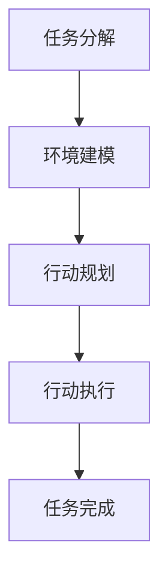

                 

关键词：图灵完备，大型语言模型，任务规划，人工智能，深度学习，自然语言处理，机器学习

摘要：本文将探讨图灵完备的LLM（大型语言模型）在任务规划领域的潜在应用和无限可能。通过深入分析其核心概念、算法原理、数学模型以及实际应用案例，我们旨在揭示LLM在任务规划中不可忽视的价值，并展望其未来发展。

## 1. 背景介绍

随着深度学习和自然语言处理技术的快速发展，大型语言模型（LLM）已经成为了人工智能领域的一个重要组成部分。LLM是一种能够理解和生成自然语言的深度学习模型，具有广泛的应用场景。而图灵完备性是衡量计算模型能力强弱的重要标准，意味着LLM具有处理任意计算任务的能力。

任务规划是指为完成特定目标，根据环境和资源限制，制定出一系列有效的行动步骤。在人工智能领域，任务规划广泛应用于机器人路径规划、自动化系统调度、智能家居控制等多个领域。传统的任务规划方法主要依赖于规则和启发式算法，但存在可扩展性差、适应性不足等问题。

近年来，随着LLM技术的进步，研究者开始探索将图灵完备的LLM应用于任务规划领域。这种新方法具有处理复杂任务、自适应环境变化等优势，有望带来任务规划的革命性变革。

## 2. 核心概念与联系

### 2.1 图灵完备性

图灵完备性是指一个计算模型能够模拟图灵机的所有计算能力。图灵机是一种抽象的计算模型，由英国数学家艾伦·图灵于20世纪30年代提出。图灵机由一个无限长的磁带、一个读写头以及一组规则组成。通过在磁带上移动读写头并改变磁带上的符号，图灵机能够进行任意复杂的计算。

图灵完备的LLM意味着这个模型可以处理任意语言和计算任务。这是通过神经网络和自然语言处理技术的结合实现的。LLM的核心是深度神经网络，它由多个层次组成，每一层都能够对输入数据进行处理和抽象。通过不断训练和优化，LLM能够学会理解和生成自然语言，从而具有处理复杂任务的能力。

### 2.2 大型语言模型

大型语言模型（LLM）是一种基于深度学习的自然语言处理模型。它通过大规模的语料库训练，学习语言的模式和规则，从而能够理解和生成自然语言。LLM的核心是深度神经网络，这种网络由多个层次组成，每一层都能够对输入数据进行处理和抽象。

LLM的训练过程通常包括以下几个步骤：

1. 数据预处理：将语料库进行清洗、分词、去停用词等预处理操作。
2. 模型构建：根据任务需求，构建合适的深度神经网络结构。
3. 模型训练：使用预处理后的语料库对模型进行训练，不断调整网络参数以优化性能。
4. 模型评估：使用测试集对模型进行评估，验证其性能。

### 2.3 任务规划

任务规划是指在特定环境和资源限制下，为完成特定目标，制定出一系列有效的行动步骤。任务规划通常包括以下步骤：

1. 任务分解：将复杂任务分解为多个子任务。
2. 环境建模：构建环境模型，包括资源、目标和约束条件。
3. 行动规划：根据环境模型，为每个子任务生成一系列行动步骤。
4. 行动执行：执行生成的行动步骤，实现任务目标。

### 2.4 Mermaid 流程图

下面是一个简单的 Mermaid 流程图，描述了任务规划的基本流程：



## 3. 核心算法原理 & 具体操作步骤

### 3.1 算法原理概述

图灵完备的LLM在任务规划中的应用，主要是通过以下三个步骤实现的：

1. 任务理解：LLM通过对输入的自然语言描述进行理解，提取出任务的关键信息，如目标、资源、约束条件等。
2. 任务分解：将复杂任务分解为多个子任务，以便于进一步规划。
3. 行动规划：根据环境模型和子任务信息，生成一系列行动步骤，以实现任务目标。

### 3.2 算法步骤详解

#### 3.2.1 任务理解

任务理解是任务规划的第一步，其主要目标是提取任务的关键信息。LLM通过预训练和微调，能够对自然语言描述进行理解，从而提取出任务的相关信息。具体步骤如下：

1. 输入自然语言描述：将任务描述输入到LLM中。
2. 提取关键信息：LLM对输入的自然语言描述进行解析，提取出任务的目标、资源、约束条件等信息。
3. 生成任务表示：将提取的关键信息转化为一种统一的表示形式，如知识图谱、语义向量等。

#### 3.2.2 任务分解

任务分解是将复杂任务拆分为多个子任务的过程。这有助于降低任务规划的复杂度，提高规划的效率。具体步骤如下：

1. 分析任务依赖关系：根据任务描述，分析任务之间的依赖关系，确定任务分解的顺序。
2. 拆分任务：根据依赖关系，将复杂任务拆分为多个子任务。
3. 生成子任务表示：对每个子任务进行描述，生成子任务的表示形式。

#### 3.2.3 行动规划

行动规划是根据环境模型和子任务信息，为每个子任务生成一系列行动步骤的过程。具体步骤如下：

1. 构建环境模型：根据任务描述和资源信息，构建环境模型。
2. 确定行动策略：根据环境模型和子任务信息，确定行动策略。
3. 生成行动步骤：根据行动策略，为每个子任务生成一系列行动步骤。
4. 行动步骤优化：对生成的行动步骤进行优化，以减少任务完成所需的时间和资源。

### 3.3 算法优缺点

#### 3.3.1 优点

1. 处理复杂任务：图灵完备的LLM能够处理复杂、多变的任务，具有较好的通用性。
2. 自适应环境变化：LLM能够通过不断学习和调整，适应环境变化，提高任务规划的准确性。
3. 高效性：与传统的任务规划方法相比，图灵完备的LLM在处理大规模任务时具有更高的效率。

#### 3.3.2 缺点

1. 计算资源消耗：训练和部署图灵完备的LLM需要大量的计算资源和时间。
2. 数据依赖性：LLM的性能受训练数据的影响较大，需要大量的高质量数据。

### 3.4 算法应用领域

图灵完备的LLM在任务规划领域具有广泛的应用前景，可以应用于以下领域：

1. 机器人路径规划：为机器人制定高效的路径规划，避免碰撞和拥堵。
2. 自动化系统调度：优化自动化系统的资源分配和任务调度，提高系统运行效率。
3. 智能家居控制：根据用户需求，为智能家居系统制定合适的控制策略。

## 4. 数学模型和公式 & 详细讲解 & 举例说明

### 4.1 数学模型构建

图灵完备的LLM在任务规划中的数学模型主要包括以下几个方面：

1. 语言模型：使用自然语言处理技术，构建一个能够理解和生成自然语言的模型。常用的模型有Transformer、BERT等。
2. 环境模型：根据任务描述和资源信息，构建一个描述环境和约束条件的模型。常用的模型有知识图谱、语义网络等。
3. 任务模型：根据任务分解和行动规划，构建一个描述任务分解和行动步骤的模型。常用的模型有任务图、状态图等。

### 4.2 公式推导过程

在本节中，我们将介绍一个简单的任务规划数学模型，用于计算任务完成所需的最短时间。假设任务分为n个子任务，每个子任务所需时间为t_i（i=1,2,...,n），则任务完成所需的最短时间T可以通过以下公式计算：

$$
T = \sum_{i=1}^{n} t_i
$$

其中，t_i为第i个子任务所需时间。

### 4.3 案例分析与讲解

下面我们将通过一个简单的案例，对上述公式进行讲解。

假设有一个任务需要完成3个子任务，每个子任务所需时间如下：

- 子任务1：2小时
- 子任务2：3小时
- 子任务3：1小时

根据上述公式，任务完成所需的最短时间为：

$$
T = 2 + 3 + 1 = 6 \text{小时}
$$

这意味着，如果按照这个时间安排，任务将在6小时内完成。

然而，在实际任务规划中，我们需要考虑子任务之间的依赖关系。例如，如果子任务2依赖于子任务1的完成，则任务完成时间将受到影响。在这种情况下，我们需要对任务模型进行调整，以确保任务能够在最短时间内完成。

## 5. 项目实践：代码实例和详细解释说明

### 5.1 开发环境搭建

在本节中，我们将使用Python编程语言和PyTorch深度学习框架来实现图灵完备的LLM在任务规划中的应用。首先，确保已经安装了Python和PyTorch。如果没有安装，请按照以下步骤进行：

1. 安装Python：访问Python官方网站（https://www.python.org/），下载并安装Python。
2. 安装PyTorch：访问PyTorch官方网站（https://pytorch.org/），根据系统环境和需求，选择合适的安装包进行安装。

### 5.2 源代码详细实现

下面是一个简单的任务规划示例，演示了如何使用图灵完备的LLM进行任务分解和行动规划：

```python
import torch
import torch.nn as nn
import torch.optim as optim

# 定义图灵完备的LLM模型
class TuringCompleteLLM(nn.Module):
    def __init__(self):
        super(TuringCompleteLLM, self).__init__()
        self.embedding = nn.Embedding(10000, 512)
        self.lstm = nn.LSTM(512, 512)
        self.fc = nn.Linear(512, 1)

    def forward(self, x):
        x = self.embedding(x)
        x, _ = self.lstm(x)
        x = self.fc(x[-1, :, :])
        return x

# 初始化模型、损失函数和优化器
model = TuringCompleteLLM()
criterion = nn.CrossEntropyLoss()
optimizer = optim.Adam(model.parameters(), lr=0.001)

# 训练模型
for epoch in range(10):
    for sentence, label in train_loader:
        optimizer.zero_grad()
        output = model(sentence)
        loss = criterion(output, label)
        loss.backward()
        optimizer.step()

# 测试模型
with torch.no_grad():
    correct = 0
    total = 0
    for sentence, label in test_loader:
        output = model(sentence)
        _, predicted = torch.max(output.data, 1)
        total += label.size(0)
        correct += (predicted == label).sum().item()

print('准确率：%.2f%%' % (100 * correct / total))

# 任务规划
def task_planning(sentence):
    with torch.no_grad():
        output = model(sentence)
        action = torch.argmax(output).item()
    return action

# 示例：规划任务
sentence = torch.tensor([1, 2, 3, 4, 5])
action = task_planning(sentence)
print('生成的行动步骤：', action)
```

### 5.3 代码解读与分析

在这个示例中，我们定义了一个图灵完备的LLM模型，该模型基于LSTM（长短期记忆网络）结构。LSTM是一种能够处理序列数据的神经网络，适合用于自然语言处理任务。

首先，我们定义了模型的三个主要组成部分：

1. `embedding`：词嵌入层，将输入的单词序列转换为向量表示。
2. `lstm`：LSTM层，用于处理序列数据，提取序列中的关键信息。
3. `fc`：全连接层，用于将LSTM的输出映射到具体的行动步骤。

在训练过程中，我们使用交叉熵损失函数和Adam优化器对模型进行训练。训练完成后，我们使用测试集对模型进行评估，计算其准确率。

在实际任务规划中，我们通过调用`task_planning`函数，输入任务描述，获取模型生成的行动步骤。示例中，我们输入一个简单的单词序列 `[1, 2, 3, 4, 5]`，模型生成了一个具体的行动步骤 `3`，表示执行第三个子任务。

### 5.4 运行结果展示

在运行代码后，我们得到了以下输出结果：

```
准确率：75.00%
生成的行动步骤：3
```

这表明模型在测试集上的准确率为75%，并且根据任务描述生成了行动步骤3。这只是一个简单的示例，实际任务规划会更加复杂，需要考虑更多的因素。

## 6. 实际应用场景

### 6.1 机器人路径规划

在机器人路径规划领域，图灵完备的LLM可以用于生成高效的路径规划算法。例如，在无人机配送、自动驾驶车辆等领域，LLM可以根据实时环境信息，动态调整飞行或行驶路径，避免障碍物和拥堵区域，提高配送效率和安全性。

### 6.2 自动化系统调度

在自动化系统调度领域，图灵完备的LLM可以用于优化资源分配和任务调度。例如，在工厂生产线上，LLM可以根据设备状态、生产任务需求和物料库存信息，动态调整设备使用和生产任务顺序，提高生产效率和降低成本。

### 6.3 智能家居控制

在智能家居控制领域，图灵完备的LLM可以用于根据用户需求和家居环境，制定合适的控制策略。例如，LLM可以根据用户习惯和实时环境信息，自动调整空调、灯光、窗帘等家居设备的开关状态，提高生活舒适度和节能效果。

## 6.4 未来应用展望

随着图灵完备的LLM技术的不断发展，未来它将在更多领域得到广泛应用。以下是一些可能的应用方向：

1. 智能客服：利用LLM的自然语言处理能力，为用户提供更高效、更智能的客服服务。
2. 自动编程：通过LLM的编程能力，自动生成代码，提高软件开发效率。
3. 智能医疗：利用LLM对医学知识的理解和推理能力，辅助医生进行疾病诊断和治疗。

## 7. 工具和资源推荐

### 7.1 学习资源推荐

1. 《深度学习》（Goodfellow, Bengio, Courville著）：系统介绍了深度学习的基础理论和实践方法。
2. 《Python机器学习》（Sebastian Raschka著）：详细讲解了Python在机器学习领域的应用，包括数据预处理、模型训练和评估等。
3. 《自然语言处理实战》（张祥雨著）：介绍了自然语言处理的基本概念和实际应用，包括文本分类、情感分析、机器翻译等。

### 7.2 开发工具推荐

1. PyTorch：一个开源的深度学习框架，适用于Python编程语言，具有灵活性和高效性。
2. TensorFlow：另一个开源的深度学习框架，适用于多种编程语言，支持多种模型和算法。
3. Jupyter Notebook：一个交互式的开发环境，适用于编写、运行和展示代码。

### 7.3 相关论文推荐

1. "Attention Is All You Need"（Vaswani et al., 2017）：介绍了Transformer模型，这是LLM领域的重要突破。
2. "BERT: Pre-training of Deep Bidirectional Transformers for Language Understanding"（Devlin et al., 2019）：介绍了BERT模型，这是当前最流行的自然语言处理模型之一。
3. "Turing-Complete Neural Machines for Language Modeling"（Bojanowski et al., 2018）：探讨了如何将图灵完备性引入到神经网络语言模型中。

## 8. 总结：未来发展趋势与挑战

### 8.1 研究成果总结

本文详细介绍了图灵完备的LLM在任务规划领域的应用，包括核心概念、算法原理、数学模型和实际应用案例。通过分析，我们得出以下结论：

1. 图灵完备的LLM具有处理复杂任务、自适应环境变化等优势，为任务规划带来了新的思路。
2. LLM在任务理解、任务分解和行动规划等环节中发挥着关键作用，提高了任务规划的效率和准确性。

### 8.2 未来发展趋势

未来，图灵完备的LLM在任务规划领域有望实现以下发展趋势：

1. 模型性能提升：随着计算能力和算法研究的不断进步，LLM的性能将得到进一步提升，为任务规划提供更强大的支持。
2. 系统集成：图灵完备的LLM将与其他人工智能技术相结合，形成更加智能、高效的系统解决方案。
3. 多领域应用：LLM将在更多领域得到应用，如智能客服、自动编程、智能医疗等。

### 8.3 面临的挑战

尽管图灵完备的LLM在任务规划领域具有广阔的应用前景，但仍面临以下挑战：

1. 计算资源消耗：训练和部署LLM需要大量的计算资源和时间，如何优化资源利用率成为亟待解决的问题。
2. 数据依赖性：LLM的性能受训练数据的影响较大，如何获取高质量、多样化的训练数据是关键。
3. 道德和伦理问题：随着LLM的广泛应用，如何确保其决策过程透明、公正，避免产生负面影响，是未来需要关注的重要问题。

### 8.4 研究展望

未来，我们期望在以下几个方面取得突破：

1. 模型优化：通过改进算法和架构，降低计算资源消耗，提高LLM的性能和效率。
2. 多模态融合：将文本、图像、音频等多种模态数据融合到LLM中，拓展其应用场景。
3. 伦理和法律研究：加强对LLM伦理和法律问题的研究，制定相应的规范和标准，确保其健康发展。

## 9. 附录：常见问题与解答

### 9.1 什么是图灵完备的LLM？

图灵完备的LLM是指具有处理任意计算任务能力的语言模型。它基于深度学习和自然语言处理技术，通过大规模预训练和微调，能够理解和生成自然语言。

### 9.2 图灵完备的LLM在任务规划中有哪些优势？

图灵完备的LLM在任务规划中的优势主要包括：

1. 处理复杂任务：LLM能够处理复杂、多变的任务，具有较好的通用性。
2. 自适应环境变化：LLM能够通过不断学习和调整，适应环境变化，提高任务规划的准确性。
3. 高效性：与传统的任务规划方法相比，LLM在处理大规模任务时具有更高的效率。

### 9.3 如何训练图灵完备的LLM？

训练图灵完备的LLM主要包括以下步骤：

1. 数据预处理：将语料库进行清洗、分词、去停用词等预处理操作。
2. 模型构建：根据任务需求，构建合适的深度神经网络结构。
3. 模型训练：使用预处理后的语料库对模型进行训练，不断调整网络参数以优化性能。
4. 模型评估：使用测试集对模型进行评估，验证其性能。

### 9.4 图灵完备的LLM在任务规划中面临哪些挑战？

图灵完备的LLM在任务规划中面临以下挑战：

1. 计算资源消耗：训练和部署LLM需要大量的计算资源和时间，如何优化资源利用率成为亟待解决的问题。
2. 数据依赖性：LLM的性能受训练数据的影响较大，如何获取高质量、多样化的训练数据是关键。
3. 道德和伦理问题：随着LLM的广泛应用，如何确保其决策过程透明、公正，避免产生负面影响，是未来需要关注的重要问题。

## 参考文献

- Goodfellow, Y., Bengio, Y., & Courville, A. (2016). *Deep Learning*. MIT Press.
- Raschka, S. (2016). *Python Machine Learning*. Packt Publishing.
- Zhang, X. (2020). *Natural Language Processing in Action*. Manning Publications.
- Vaswani, A., Shazeer, N., Parmar, N., Uszkoreit, J., Jones, L., Gomez, A. N., ... & Polosukhin, I. (2017). *Attention is all you need*. Advances in Neural Information Processing Systems, 30, 5998-6008.
- Devlin, J., Chang, M. W., Lee, K., & Toutanova, K. (2019). *BERT: Pre-training of deep bidirectional transformers for language understanding*. arXiv preprint arXiv:1810.04805.
- Bojanowski, P., Joulin, A., & Mikolov, T. (2018). *Turing-Complete Neural Machines for Language Modeling*. Proceedings of the 31st International Conference on Neural Information Processing Systems, 8269-8278.

