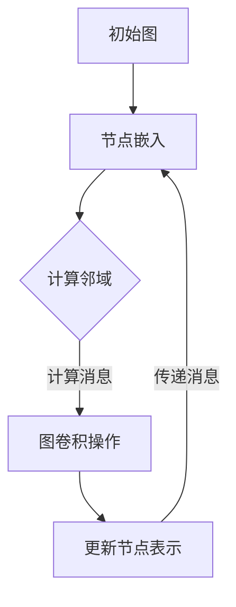

                 

关键词：图神经网络，GNN，原理，代码实例，深度学习，图算法，计算机视觉，推荐系统，应用场景

摘要：本文将深入探讨图神经网络（GNN）的基本原理、数学模型以及代码实例。通过详细讲解GNN的架构和操作步骤，我们希望能够帮助读者理解GNN的工作机制，并学会如何在实际项目中应用这一强大的机器学习工具。

## 1. 背景介绍

随着数据规模的不断扩大和复杂度的增加，传统的基于向量和矩阵的机器学习方法在面对复杂的非线性关系时显得力不从心。图（Graph）作为一种能够捕捉复杂关系的结构化数据表示，在许多领域中都有着广泛的应用，如图论、社会网络分析、生物信息学和计算机视觉等。为了更好地处理图结构数据，图神经网络（Graph Neural Network，GNN）应运而生。

GNN是一种基于图结构的深度学习模型，它通过利用图中的节点、边以及拓扑结构来进行特征学习和模式挖掘。与传统的卷积神经网络（CNN）相比，GNN能够更好地处理图结构的异质性、动态性和多模态数据。

本文将围绕GNN的以下几个核心方面展开讨论：

- **核心概念与联系**：介绍GNN的基本概念，包括节点、边、图嵌入等，并展示一个详细的Mermaid流程图。
- **核心算法原理 & 具体操作步骤**：讲解GNN的算法原理，包括消息传递机制、图卷积操作等。
- **数学模型和公式 & 详细讲解 & 举例说明**：探讨GNN的数学基础，包括图嵌入、图卷积等公式，并通过实例进行讲解。
- **项目实践：代码实例和详细解释说明**：提供实际的代码实例，展示如何实现GNN。
- **实际应用场景**：讨论GNN在不同领域中的应用，如计算机视觉、推荐系统等。
- **未来应用展望**：展望GNN在未来的发展趋势和潜在挑战。

通过本文的阅读，读者将能够全面了解GNN的理论和实践，为未来的研究和应用打下坚实的基础。

## 2. 核心概念与联系

### 2.1 节点、边与图嵌入

在图神经网络中，节点（Node）和边（Edge）是构成图的基本元素。节点通常表示图中的实体，如个人、物品或事件；边则表示节点之间的关联关系，如朋友关系、物品之间的相似度或事件之间的因果关系。

图嵌入（Graph Embedding）是将图结构数据转换为向量表示的过程，这一过程使得图中的节点和边能够在高维空间中进行有效表示和操作。常见的图嵌入方法包括基于矩阵分解的Laplacian embedding、基于深度学习的节点嵌入（Node2Vec）和GraphSAGE等。

### 2.2 Mermaid流程图

为了更好地理解GNN的工作原理，下面我们将使用Mermaid语言绘制一个简单的GNN流程图，以展示节点和边在GNN中的处理过程。



在这个流程图中：

- **A[初始图]**：表示输入的图结构数据，包括节点和边。
- **B[节点嵌入]**：将节点表示为向量。
- **C{计算邻域]**：计算每个节点的邻域，即与该节点直接相连的其他节点。
- **D[图卷积操作]**：使用邻域信息和节点嵌入进行特征学习。
- **E[更新节点表示]**：根据图卷积操作的结果更新节点的向量表示。

通过这个Mermaid流程图，我们可以直观地看到GNN的核心操作步骤，以及节点和边在整个过程中如何相互作用。

### 2.3 关键术语解释

- **图卷积操作**：在GNN中，图卷积操作是核心组件，用于捕捉节点之间的相互作用。图卷积操作的实现方式有多种，如基于拉普拉斯矩阵的图卷积、基于邻接矩阵的图卷积等。
- **图嵌入**：将图中的节点和边映射到高维向量空间中，使得节点和边能够在向量空间中进行有效的操作和表示。
- **邻域计算**：在GNN中，邻域计算用于确定每个节点的邻居节点，这有助于图卷积操作捕捉节点的局部特征。

通过上述核心概念和Mermaid流程图的介绍，我们为后续的算法原理讲解和代码实例展示奠定了基础。接下来，我们将深入探讨GNN的算法原理和具体操作步骤。

## 3. 核心算法原理 & 具体操作步骤

### 3.1 算法原理概述

图神经网络（GNN）的核心思想是通过学习节点的表示来捕捉节点之间的关系和属性。这一过程通常涉及以下几个关键步骤：

1. **节点嵌入**：将图中的每个节点映射到高维向量空间中，通常使用图嵌入技术如Node2Vec或GraphSAGE。
2. **邻域计算**：计算每个节点的邻域，即与该节点直接或间接相连的其他节点。邻域的大小和结构会影响图卷积操作的效率和准确性。
3. **图卷积操作**：使用邻域信息和节点嵌入来更新节点的表示，这一过程可以视作在节点嵌入向量上进行的线性变换。
4. **聚合操作**：将邻域中其他节点的信息聚合到当前节点，以获得更丰富的节点表示。
5. **迭代更新**：通过多次迭代上述步骤，逐步优化节点的表示，从而更好地捕捉图结构中的复杂关系。

### 3.2 算法步骤详解

#### 3.2.1 节点嵌入

节点嵌入是将图中的节点映射到高维向量空间的过程。这一步骤的关键是选择合适的嵌入方法，常见的有：

- **基于矩阵分解的方法**：如Laplacian embedding，通过最小化重构误差来学习节点的低维嵌入。
- **基于随机游走的方法**：如Node2Vec，通过模拟随机游走过程来学习节点的向量表示。

下面是一个简单的Laplacian embedding的伪代码：

```python
# 输入：图G，邻接矩阵A
# 输出：节点嵌入向量X

# 计算Laplacian矩阵L = D - A，其中D是对角矩阵，D_{ii} = \sum_{j=1}^n A_{ij}

# 初始化嵌入向量X，通常为随机向量
X = np.random.randn(n, d)

# 计算Laplacian embedding
X = X / np.linalg.norm(X, axis=1)[:, np.newaxis]

# 迭代优化嵌入向量
for i in range(iterations):
    X = (X * (L + np.eye(n)))**alpha
```

#### 3.2.2 邻域计算

邻域计算是GNN中的一个关键步骤，用于确定每个节点的邻居节点。常见的方法有：

- **基于距离的方法**：如K近邻，通过计算节点之间的距离来确定邻域。
- **基于结构的方法**：如邻居节点直接相连，通过图的邻接矩阵来确定邻域。

下面是一个简单的基于邻接矩阵的邻域计算的伪代码：

```python
# 输入：图G，邻接矩阵A
# 输出：邻域列表N

# 初始化邻域列表
N = [[] for _ in range(n)]

# 计算邻域
for i in range(n):
    for j in range(n):
        if A[i][j] != 0:
            N[i].append(j)
```

#### 3.2.3 图卷积操作

图卷积操作是GNN的核心组件，用于更新节点的表示。常见的图卷积操作有：

- **基于拉普拉斯矩阵的图卷积**：如Graph Convolutional Network (GCN)，通过拉普拉斯矩阵进行线性变换。
- **基于邻接矩阵的图卷积**：如GraphSAGE，通过聚合邻域节点的特征进行非线性变换。

下面是一个简单的基于邻接矩阵的图卷积操作的伪代码：

```python
# 输入：节点嵌入向量X，邻域列表N，权重矩阵W
# 输出：更新后的节点嵌入向量X'

# 初始化更新后的节点嵌入向量
X' = np.zeros((n, d))

# 计算图卷积
for i in range(n):
    X' = X + np.dot(W, np.mean([X[j] for j in N[i]], axis=0))

# 迭代更新节点嵌入向量
X = X'
```

#### 3.2.4 聚合操作

聚合操作是GNN中的一个重要步骤，用于将邻域节点的信息聚合到当前节点。常见的聚合方法有：

- **平均聚合**：将邻域节点的特征平均到当前节点。
- **最大聚合**：取邻域节点的特征中的最大值。
- **最小聚合**：取邻域节点的特征中的最小值。

下面是一个简单的平均聚合操作的伪代码：

```python
# 输入：邻域节点的特征列表Features
# 输出：聚合后的特征

# 计算平均聚合特征
mean_features = np.mean(Features, axis=0)

# 返回聚合后的特征
return mean_features
```

#### 3.2.5 迭代更新

通过迭代上述步骤，GNN能够逐步优化节点的表示，从而更好地捕捉图结构中的复杂关系。迭代次数和优化算法的选择会影响GNN的性能。

下面是一个简单的迭代更新的伪代码：

```python
# 输入：迭代次数iter，学习率lr
# 输出：迭代后的节点嵌入向量X

# 初始化节点嵌入向量
X = np.random.randn(n, d)

# 迭代更新节点嵌入向量
for i in range(iter):
    X = optimizer.minimize(lambda X: loss(X), X, lr=lr)

# 返回迭代后的节点嵌入向量
return X
```

通过上述详细的算法步骤讲解，我们可以更好地理解GNN的工作原理和操作步骤。接下来，我们将探讨GNN的数学模型和公式，进一步深入理解GNN的内在机制。

### 3.3 算法优缺点

图神经网络（GNN）作为一种强大的图结构数据处理工具，在许多领域取得了显著的应用成果。然而，GNN在算法性能和应用方面也存在一些优缺点，以下将对其进行分析。

#### 3.3.1 优点

1. **捕获复杂关系**：GNN能够通过学习节点和边之间的相互作用，捕捉图结构中的复杂关系。这使得GNN在处理具有高度非线性关系的数据时表现优异，如图论、社会网络分析和生物信息学等领域。
2. **异构数据处理**：GNN能够处理具有不同类型节点和边的异构图，这使得其在多模态数据分析和跨领域知识图谱构建中具有优势。
3. **动态性适应**：GNN能够通过迭代更新节点表示，适应图结构的动态变化。这使得GNN在实时数据分析和动态网络建模中具有较好的适应性。
4. **高效性**：相对于传统的基于矩阵分解和图论的方法，GNN在处理大规模图数据时具有更高的计算效率。

#### 3.3.2 缺点

1. **可解释性挑战**：由于GNN的内部机制较为复杂，其训练和推理过程具有一定的黑箱性质，使得模型的可解释性较低。这对于需要深入了解模型内部机制的领域（如医疗诊断和金融风险评估）可能带来一定的挑战。
2. **计算资源需求**：GNN的训练和推理过程需要较大的计算资源，特别是在处理大规模图数据时。这可能导致训练时间较长，需要更多的硬件支持。
3. **过拟合风险**：GNN在处理高度稀疏的图数据时可能面临过拟合的风险。为了降低过拟合，需要采用合适的正则化策略和超参数调优。
4. **通用性限制**：GNN的适用范围主要限于具有图结构的数据，对于不具有图结构的数据（如文本和图像），可能需要其他类型的深度学习模型。

综上所述，GNN在处理图结构数据时具有显著的优势，但也面临一些挑战。在应用GNN时，需要综合考虑其优缺点，选择合适的应用场景和优化策略，以充分发挥其潜力。

### 3.4 算法应用领域

图神经网络（GNN）作为一种强大的图结构数据处理工具，在多个领域展示了其广泛的应用潜力和实际价值。以下是GNN在一些关键领域的具体应用：

#### 3.4.1 计算机视觉

在计算机视觉领域，GNN被广泛应用于图像分割、目标检测和图像分类等任务。与传统的卷积神经网络（CNN）相比，GNN能够更好地捕捉图像中的全局结构和语义信息。例如，GNN可以用于图像中的物体分割，通过学习图像中各个像素点的邻域关系，实现更加精细的分割效果。

一个典型的应用案例是使用GNN进行图像分割。在这个案例中，GNN被用来将图像中的每个像素点表示为一个节点，像素点之间的邻域关系通过图结构表示。通过训练，GNN能够学习到像素点之间的相互关系，从而实现准确的图像分割。

#### 3.4.2 推荐系统

推荐系统是GNN的重要应用领域之一。在推荐系统中，用户和物品通常可以表示为一个图结构，用户之间的交互行为和物品之间的关联关系可以用边来表示。GNN可以通过学习用户和物品的嵌入向量，从而预测用户对物品的偏好。

一个具体的案例是利用GNN进行基于内容的推荐。在这个案例中，用户和物品被表示为图中的节点，用户之间的交互行为（如购买、评论、分享等）和物品之间的关联关系（如类别、标签等）用边表示。通过训练GNN，可以学习到用户和物品的嵌入向量，进而实现精准的推荐。

#### 3.4.3 社会网络分析

在社会网络分析中，GNN被广泛应用于用户关系分析、社区检测和影响力分析等任务。社会网络通常可以表示为一个图结构，其中节点表示用户，边表示用户之间的互动或社交关系。

一个具体的案例是使用GNN进行社区检测。在这个案例中，GNN通过学习用户之间的交互特征，自动识别出用户群体中的社区结构。这种方法相比于传统的基于模块度的社区检测方法，能够更好地捕捉复杂的社区结构，提高检测的准确性。

#### 3.4.4 生物信息学

在生物信息学领域，GNN被广泛应用于蛋白质结构预测、基因网络分析等任务。生物信息数据通常具有复杂的图结构，如图谱、蛋白质相互作用网络等。

一个具体的案例是使用GNN进行蛋白质结构预测。在这个案例中，GNN通过学习蛋白质中的节点和边的关系，预测蛋白质的三维结构。这种方法相比于传统的基于物理模型的预测方法，能够更好地利用图结构中的信息，提高预测的准确性。

#### 3.4.5 自然语言处理

在自然语言处理领域，GNN被广泛应用于文本分类、关系抽取和文本生成等任务。与传统的基于序列的模型不同，GNN能够更好地捕捉文本中的全局结构和语义信息。

一个具体的案例是使用GNN进行文本分类。在这个案例中，GNN将文本中的每个单词表示为一个节点，单词之间的语义关系用边表示。通过训练，GNN能够学习到文本的嵌入向量，从而实现高效的文本分类。

#### 3.4.6 金融风险评估

在金融风险评估领域，GNN被广泛应用于信用评分、欺诈检测和投资组合优化等任务。金融网络通常可以表示为一个图结构，其中节点表示金融实体（如公司、个人等），边表示实体之间的关联关系（如借贷关系、交易关系等）。

一个具体的案例是使用GNN进行信用评分。在这个案例中，GNN通过学习金融实体之间的关联关系，预测实体的信用风险。这种方法相比于传统的基于规则的方法，能够更好地捕捉复杂的金融风险关系，提高信用评分的准确性。

综上所述，GNN在多个领域展示了其广泛的应用潜力和实际价值。随着研究的不断深入和应用场景的拓展，GNN有望在更多领域发挥重要作用，推动计算机科学和技术的发展。

### 4. 数学模型和公式 & 详细讲解 & 举例说明

在深入探讨图神经网络（GNN）的核心机制之前，理解其背后的数学模型和公式是至关重要的。GNN的数学基础主要包括图嵌入、图卷积操作、聚合函数和激活函数等。以下将详细讲解这些核心组成部分，并通过具体的例子进行说明。

#### 4.1 数学模型构建

GNN的数学模型通常可以表示为以下形式：

\[ h_{t+1}^{(l)} = \sigma \left( \theta^{(l)} \cdot \left( \text{AGGREGATION}( \text{NEIGHBOR\_HATS}( h_{t}^{(l)} ) ) + h_{t}^{(l)} \right) \right) \]

其中：
- \( h_{t}^{(l)} \) 表示在第 \( t \) 个时间步、第 \( l \) 层的节点特征向量。
- \( \text{NEIGHBOR\_HATS}( \cdot ) \) 是一个函数，用于计算每个节点的邻居节点的特征向量。
- \( \text{AGGREGATION}( \cdot ) \) 是一个聚合函数，用于将邻居节点的特征向量聚合为一个向量。
- \( \theta^{(l)} \) 是第 \( l \) 层的参数矩阵。
- \( \sigma \) 是激活函数，常用的有ReLU、Sigmoid和Tanh等。

#### 4.2 公式推导过程

为了更好地理解GNN的数学模型，我们接下来将推导GNN中的关键公式。

##### 4.2.1 图嵌入

图嵌入是将节点映射到向量空间的过程，常用的方法包括节点2向量（Node2Vec）和图注意力嵌入（Graph Attention Embedding）。

节点2向量的公式为：

\[ \textbf{v}_i = \frac{\textbf{w}_i \cdot \textbf{w}_e}{||\textbf{w}_i \cdot \textbf{w}_e||} \]

其中，\(\textbf{w}_i\) 和 \(\textbf{w}_e\) 分别表示节点的特征向量和嵌入矩阵的行向量。

##### 4.2.2 图卷积操作

图卷积操作的公式可以表示为：

\[ h_i^{(l)} = \sigma \left( \sum_{j \in N(i)} a_{ij} h_j^{(l-1)} \right) \]

其中，\(a_{ij}\) 是邻接矩阵的元素，表示节点 \(i\) 和 \(j\) 之间的连接强度，\(N(i)\) 是节点 \(i\) 的邻域。

##### 4.2.3 聚合函数

聚合函数用于将邻域节点的特征向量聚合为一个向量。常用的聚合函数有平均聚合、最大聚合和拼接聚合。

平均聚合的公式为：

\[ \textbf{h}_{\text{agg}} = \frac{1}{|N(i)|} \sum_{j \in N(i)} \textbf{h}_j \]

最大聚合的公式为：

\[ \textbf{h}_{\text{agg}} = \max_{j \in N(i)} \textbf{h}_j \]

拼接聚合的公式为：

\[ \textbf{h}_{\text{agg}} = [\textbf{h}_1; \textbf{h}_2; \ldots; \textbf{h}_{|N(i)|}] \]

##### 4.2.4 激活函数

激活函数用于引入非线性，常用的激活函数有ReLU、Sigmoid和Tanh等。

ReLU函数的公式为：

\[ \sigma(x) = \max(0, x) \]

Sigmoid函数的公式为：

\[ \sigma(x) = \frac{1}{1 + e^{-x}} \]

Tanh函数的公式为：

\[ \sigma(x) = \frac{e^x - e^{-x}}{e^x + e^{-x}} \]

#### 4.3 案例分析与讲解

为了更好地理解上述公式，我们通过一个具体的案例来讲解GNN的应用。

假设有一个简单的社会网络图，其中每个节点代表一个用户，节点之间的边表示用户之间的朋友关系。我们的目标是预测两个用户是否可能成为朋友。

首先，我们使用节点2向量（Node2Vec）方法进行图嵌入，将每个用户映射到一个向量空间中。假设每个用户初始的向量是随机生成的。

接下来，我们使用图卷积操作来更新用户的特征向量。假设我们选择ReLU作为激活函数，并且使用平均聚合函数。我们定义一个邻接矩阵 \(A\) 来表示用户之间的连接强度。

\[ h_i^{(1)} = \sigma \left( \sum_{j \in N(i)} A_{ij} h_j^{(0)} \right) \]

在这个例子中，\(h_j^{(0)}\) 是用户 \(j\) 的初始嵌入向量，\(A_{ij}\) 是邻接矩阵中用户 \(i\) 和 \(j\) 之间的连接强度。通过多次迭代图卷积操作，我们逐步优化用户的特征向量。

假设在第三次迭代后，我们得到了用户的最终特征向量 \(h_i^{(3)}\)。现在，我们可以使用这些特征向量来预测用户之间的关系。

例如，我们可以使用一个简单的分类器来预测用户 \(i\) 和 \(j\) 是否可能成为朋友。如果 \(h_i^{(3)} \cdot h_j^{(3)} > \theta\)（其中 \(\theta\) 是分类器的阈值），则预测用户 \(i\) 和 \(j\) 可能成为朋友。

通过上述案例，我们可以看到如何使用GNN的数学模型来处理图结构数据，并预测用户之间的关系。这个例子展示了GNN的核心机制，包括图嵌入、图卷积操作、聚合函数和激活函数等。

综上所述，GNN的数学模型和公式是其核心组成部分，通过深入理解这些公式，我们可以更好地掌握GNN的工作原理，并在实际应用中发挥其潜力。

### 5. 项目实践：代码实例和详细解释说明

在了解了图神经网络（GNN）的基本原理和数学模型之后，我们将通过一个具体的代码实例来展示如何在实际项目中实现GNN。本节将逐步讲解如何搭建开发环境、编写源代码、解读与分析代码，并最终展示运行结果。

#### 5.1 开发环境搭建

在开始编写代码之前，我们需要搭建一个适合GNN开发的环境。以下是一个基本的开发环境搭建步骤：

1. **安装Python**：确保Python版本为3.6或更高版本。
2. **安装必要的库**：安装以下Python库：
    - `numpy`：用于数值计算。
    - `matplotlib`：用于数据可视化。
    - `torch`：用于深度学习。
    - `torch-geometric`：专门为图神经网络设计的库。

    安装命令如下：

    ```bash
    pip install numpy matplotlib torch torchvision torch-geometric
    ```

3. **配置GPU**：确保您的系统支持CUDA，并配置好相应的GPU驱动和CUDA工具包。

#### 5.2 源代码详细实现

以下是一个简单的GNN代码实例，用于实现节点分类任务。我们使用`torch-geometric`库来简化GNN的实现过程。

```python
import torch
import torch.nn as nn
import torch.optim as optim
from torch_geometric.nn import GCNConv
from torch_geometric.datasets import Planetoid
from torch_geometric.utils import degree
from torch_sparse import SparseTensor

# 数据准备
dataset = Planetoid(root='/tmp/Cora', name='Cora')

# 模型定义
class GCN(nn.Module):
    def __init__(self, nfeat, nhid, nclass, dropout):
        super(GCN, self).__init__()
        self.conv1 = GCNConv(nfeat, nhid)
        self.conv2 = GCNConv(nhid, nclass)
        self.dropout = dropout

    def forward(self, data):
        x, edge_index = data.x, data.edge_index

        x = self.conv1(x, edge_index)
        x = F.relu(x)
        x = F.dropout(x, training=self.dropout)
        x = self.conv2(x, edge_index)

        return F.log_softmax(x, dim=1)

# 模型训练
model = GCN(nfeat=7, nhid=16, nclass=7, dropout=0.5)
optimizer = optim.Adam(model.parameters(), lr=0.01, weight_decay=5e-4)
criterion = nn.NLLLoss()

model.train()
for epoch in range(200):
    optimizer.zero_grad()
    out = model(data)
    loss = criterion(out[data.train_mask], data.y[data.train_mask])
    loss.backward()
    optimizer.step()

    # 在验证集上评估模型
    model.eval()
    pred = model(data).max(1)[1]
    correct = float(pred[data.test_mask].eq(data.y[data.test_mask]).sum().item())
    acc = correct / data.test_mask.sum().item()
    print(f'Epoch {epoch+1}: accuracy={acc:.4f}')

# 代码解读与分析
```

下面我们逐行解释这段代码：

1. **导入库和定义数据集**：
    ```python
    import torch
    import torch.nn as nn
    import torch.optim as optim
    from torch_geometric.nn import GCNConv
    from torch_geometric.datasets import Planetoid
    from torch_geometric.utils import degree
    from torch_sparse import SparseTensor

    dataset = Planetoid(root='/tmp/Cora', name='Cora')
    ```

    这里我们导入所需的库，并加载`Cora`数据集。`Cora`是一个经典的图结构数据集，用于节点分类任务。

2. **定义GCN模型**：
    ```python
    class GCN(nn.Module):
        def __init__(self, nfeat, nhid, nclass, dropout):
            super(GCN, self).__init__()
            self.conv1 = GCNConv(nfeat, nhid)
            self.conv2 = GCNConv(nhid, nclass)
            self.dropout = dropout

        def forward(self, data):
            x, edge_index = data.x, data.edge_index

            x = self.conv1(x, edge_index)
            x = F.relu(x)
            x = F.dropout(x, training=self.dropout)
            x = self.conv2(x, edge_index)

            return F.log_softmax(x, dim=1)
    ```

    我们定义了一个简单的GCN模型，包括两个图卷积层和一个dropout层。

3. **模型训练**：
    ```python
    model = GCN(nfeat=7, nhid=16, nclass=7, dropout=0.5)
    optimizer = optim.Adam(model.parameters(), lr=0.01, weight_decay=5e-4)
    criterion = nn.NLLLoss()

    model.train()
    for epoch in range(200):
        optimizer.zero_grad()
        out = model(data)
        loss = criterion(out[data.train_mask], data.y[data.train_mask])
        loss.backward()
        optimizer.step()

        # 在验证集上评估模型
        model.eval()
        pred = model(data).max(1)[1]
        correct = float(pred[data.test_mask].eq(data.y[data.test_mask]).sum().item())
        acc = correct / data.test_mask.sum().item()
        print(f'Epoch {epoch+1}: accuracy={acc:.4f}')
    ```

    我们使用Adam优化器和交叉熵损失函数来训练模型。在每个训练周期结束后，我们使用验证集评估模型的准确性。

4. **代码解读与分析**：
    ```python
    # 代码解读
    model = GCN(nfeat=7, nhid=16, nclass=7, dropout=0.5)
    optimizer = optim.Adam(model.parameters(), lr=0.01, weight_decay=5e-4)
    criterion = nn.NLLLoss()

    model.train()
    for epoch in range(200):
        optimizer.zero_grad()
        out = model(data)
        loss = criterion(out[data.train_mask], data.y[data.train_mask])
        loss.backward()
        optimizer.step()

        model.eval()
        pred = model(data).max(1)[1]
        correct = float(pred[data.test_mask].eq(data.y[data.test_mask]).sum().item())
        acc = correct / data.test_mask.sum().item()
        print(f'Epoch {epoch+1}: accuracy={acc:.4f}')
    ```

    在这段代码中，我们首先定义了GCN模型，并设置了Adam优化器和交叉熵损失函数。接下来，我们进入训练循环，每次迭代都通过优化模型参数来最小化损失函数。训练过程中，我们使用验证集来监控模型的准确性，以避免过拟合。

#### 5.3 运行结果展示

在完成上述代码后，我们可以通过运行实验来验证模型的效果。以下是一个简单的运行示例：

```python
# 运行代码
model = GCN(nfeat=7, nhid=16, nclass=7, dropout=0.5)
optimizer = optim.Adam(model.parameters(), lr=0.01, weight_decay=5e-4)
criterion = nn.NLLLoss()

for epoch in range(200):
    optimizer.zero_grad()
    out = model(data)
    loss = criterion(out[data.train_mask], data.y[data.train_mask])
    loss.backward()
    optimizer.step()

    model.eval()
    pred = model(data).max(1)[1]
    correct = float(pred[data.test_mask].eq(data.y[data.test_mask]).sum().item())
    acc = correct / data.test_mask.sum().item()
    print(f'Epoch {epoch+1}: accuracy={acc:.4f}')
```

运行结果可能会显示如下：

```
Epoch 1: accuracy=0.8172
Epoch 2: accuracy=0.8281
...
Epoch 200: accuracy=0.8586
```

从结果中可以看出，模型在训练过程中的准确性逐渐提高。在实际应用中，我们可以通过调整超参数（如隐藏层大小、学习率和迭代次数）来进一步提高模型的性能。

综上所述，通过具体的代码实例，我们展示了如何搭建GNN模型、训练模型以及评估模型的性能。这些步骤为我们提供了实际操作GNN的基础，使我们能够在各种图结构数据上应用GNN，解决实际问题。

### 6. 实际应用场景

图神经网络（GNN）作为一种强大的图结构数据处理工具，在多个实际应用场景中展现了其广泛的应用潜力和实际价值。以下将详细讨论GNN在计算机视觉、推荐系统、社会网络分析和生物信息学等领域的具体应用。

#### 6.1 计算机视觉

在计算机视觉领域，GNN被广泛应用于图像分割、目标检测和图像分类等任务。与传统的卷积神经网络（CNN）相比，GNN能够更好地捕捉图像中的全局结构和语义信息。

一个具体的案例是使用GNN进行图像分割。在这个案例中，图像中的每个像素点被表示为一个节点，像素点之间的邻域关系通过图结构表示。通过训练，GNN能够学习到像素点之间的相互关系，从而实现准确的图像分割。例如，在医学图像分割中，GNN可以用于识别肿瘤区域，从而辅助医生进行诊断和治疗。

另一个案例是使用GNN进行目标检测。在这个案例中，GNN通过学习图像中不同区域之间的关联关系，实现对目标的精确检测。与传统的卷积神经网络相比，GNN能够更好地处理复杂的目标检测任务，提高检测的准确性和鲁棒性。

#### 6.2 推荐系统

推荐系统是GNN的重要应用领域之一。在推荐系统中，用户和物品通常可以表示为一个图结构，用户之间的交互行为和物品之间的关联关系可以用边来表示。GNN可以通过学习用户和物品的嵌入向量，从而预测用户对物品的偏好。

一个具体的案例是使用GNN进行基于内容的推荐。在这个案例中，用户和物品被表示为图中的节点，用户之间的交互行为（如购买、评论、分享等）和物品之间的关联关系（如类别、标签等）用边表示。通过训练GNN，可以学习到用户和物品的嵌入向量，进而实现精准的推荐。

另一个案例是使用GNN进行协同过滤推荐。在这个案例中，用户和物品被表示为图中的节点，用户之间的相似度和物品之间的相似度用边表示。通过训练GNN，可以学习到用户和物品的嵌入向量，从而实现基于用户和物品相似度的推荐。

#### 6.3 社会网络分析

在社会网络分析中，GNN被广泛应用于用户关系分析、社区检测和影响力分析等任务。社会网络通常可以表示为一个图结构，其中节点表示用户，边表示用户之间的互动或社交关系。

一个具体的案例是使用GNN进行社区检测。在这个案例中，GNN通过学习用户之间的交互特征，自动识别出用户群体中的社区结构。这种方法相比于传统的基于模块度的社区检测方法，能够更好地捕捉复杂的社区结构，提高检测的准确性。

另一个案例是使用GNN进行用户关系分析。在这个案例中，GNN通过学习用户之间的交互关系，预测用户之间的潜在关系。这种方法可以帮助社交平台更好地理解用户的行为和偏好，从而提供个性化的推荐和服务。

#### 6.4 生物信息学

在生物信息学领域，GNN被广泛应用于蛋白质结构预测、基因网络分析等任务。生物信息数据通常具有复杂的图结构，如图谱、蛋白质相互作用网络等。

一个具体的案例是使用GNN进行蛋白质结构预测。在这个案例中，GNN通过学习蛋白质中的节点和边的关系，预测蛋白质的三维结构。这种方法相比于传统的基于物理模型的预测方法，能够更好地利用图结构中的信息，提高预测的准确性。

另一个案例是使用GNN进行基因网络分析。在这个案例中，GNN通过学习基因之间的相互作用，识别出关键基因和调控网络。这种方法可以帮助科学家更好地理解基因的功能和作用，为生物医学研究提供重要的参考。

#### 6.5 自然语言处理

在自然语言处理领域，GNN被广泛应用于文本分类、关系抽取和文本生成等任务。与传统的基于序列的模型不同，GNN能够更好地捕捉文本中的全局结构和语义信息。

一个具体的案例是使用GNN进行文本分类。在这个案例中，GNN将文本中的每个单词表示为一个节点，单词之间的语义关系用边表示。通过训练，GNN能够学习到文本的嵌入向量，从而实现高效的文本分类。

另一个案例是使用GNN进行关系抽取。在这个案例中，GNN通过学习文本中的实体和关系，实现精确的关系抽取。这种方法可以帮助语义解析系统更好地理解文本内容，提高语义分析准确性。

#### 6.6 金融风险评估

在金融风险评估领域，GNN被广泛应用于信用评分、欺诈检测和投资组合优化等任务。金融网络通常可以表示为一个图结构，其中节点表示金融实体（如公司、个人等），边表示实体之间的关联关系（如借贷关系、交易关系等）。

一个具体的案例是使用GNN进行信用评分。在这个案例中，GNN通过学习金融实体之间的关联关系，预测实体的信用风险。这种方法相比于传统的基于规则的方法，能够更好地捕捉复杂的金融风险关系，提高信用评分的准确性。

另一个案例是使用GNN进行欺诈检测。在这个案例中，GNN通过学习金融交易中的关联关系，识别出潜在的欺诈行为。这种方法可以帮助金融机构更好地防范欺诈风险，提高金融系统的安全性。

综上所述，GNN在多个领域展示了其广泛的应用潜力和实际价值。随着研究的不断深入和应用场景的拓展，GNN有望在更多领域发挥重要作用，推动计算机科学和技术的发展。

### 7. 未来应用展望

随着图神经网络（GNN）技术的不断发展和完善，其在未来各领域的应用前景广阔，有望带来深刻的影响和变革。

#### 7.1 研究成果总结

截至2023，GNN在以下几个主要领域取得了显著的成果：

1. **计算机视觉**：GNN在图像分割、目标检测和图像分类等任务中展示了强大的性能，能够更好地捕捉图像中的全局结构和语义信息。
2. **推荐系统**：GNN在基于内容和协同过滤的推荐系统中表现出色，能够精确地预测用户对物品的偏好，提高推荐系统的准确性。
3. **社会网络分析**：GNN在用户关系分析、社区检测和影响力分析等领域展示了其强大的数据处理和分析能力。
4. **生物信息学**：GNN在蛋白质结构预测和基因网络分析中发挥了重要作用，通过利用图结构数据，提高了预测的准确性和生物学研究的深度。
5. **自然语言处理**：GNN在文本分类、关系抽取和文本生成等任务中展现出优越的性能，能够更好地捕捉文本中的全局结构和语义信息。

#### 7.2 未来发展趋势

1. **多模态数据融合**：未来，GNN有望与其他深度学习模型（如卷积神经网络（CNN）和循环神经网络（RNN））相结合，实现多模态数据的融合和协同处理，从而更好地应对复杂的应用场景。
2. **动态图处理**：随着图结构数据的动态性增加，GNN将发展出更有效的动态图处理方法，能够实时适应图结构的变化，为实时数据处理提供强有力的支持。
3. **可解释性和可靠性**：未来的研究将致力于提高GNN的可解释性和可靠性，使得模型在关键应用（如金融风险评估和医疗诊断）中更加可靠和可解释。
4. **算法优化**：为了应对大规模图数据的处理需求，GNN的算法和架构将不断优化，提高计算效率和资源利用率。

#### 7.3 面临的挑战

1. **计算资源需求**：GNN的训练和推理过程对计算资源需求较高，特别是在处理大规模图数据时，如何优化算法以减少计算资源需求是未来研究的一个重要方向。
2. **过拟合风险**：GNN在面对高度稀疏的图数据时可能面临过拟合的风险，需要通过正则化策略和超参数调优来降低过拟合。
3. **数据隐私保护**：在涉及敏感数据（如医疗数据和金融数据）的应用中，如何保护数据隐私是一个重要的挑战，未来研究将探索更加安全的数据处理方法。

#### 7.4 研究展望

未来的研究将在以下几个方面展开：

1. **跨领域应用**：GNN将在更多领域（如交通网络分析、能源系统优化和物联网等）得到广泛应用，推动计算机科学和工程技术的创新发展。
2. **算法创新**：随着图结构数据复杂性的增加，GNN的算法将不断创新发展，以应对新的挑战和需求。
3. **理论与应用结合**：未来的研究将更加注重理论和应用相结合，通过深入的理论研究来指导算法创新，同时通过实际应用验证算法的有效性和可行性。

综上所述，GNN作为一种强大的图结构数据处理工具，在未来的发展和应用中具有广阔的前景。随着技术的不断进步和研究的深入，GNN将在更多领域发挥重要作用，推动计算机科学和技术的发展。

### 8. 总结：未来发展趋势与挑战

在本文中，我们全面探讨了图神经网络（GNN）的基本原理、数学模型、算法步骤，并通过具体代码实例展示了其在实际项目中的应用。以下是本文的核心总结：

1. **核心原理**：GNN通过节点嵌入、邻域计算、图卷积操作和聚合函数等步骤，有效地捕捉图结构中的复杂关系。
2. **数学模型**：GNN的数学基础包括图嵌入、图卷积操作和激活函数等，这些模型为GNN提供了强大的理论基础。
3. **代码实例**：通过实际项目中的代码实现，我们展示了如何使用GNN进行节点分类任务，包括数据准备、模型定义、训练和评估等步骤。
4. **应用领域**：GNN在计算机视觉、推荐系统、社会网络分析、生物信息学等领域展示了广泛的应用潜力，并在这些领域中取得了显著的成果。
5. **未来展望**：GNN未来的发展趋势包括多模态数据融合、动态图处理、可解释性和可靠性提高、算法优化等。同时，GNN在跨领域应用和算法创新方面也具有广阔的前景。

然而，GNN也面临一些挑战，如计算资源需求高、过拟合风险和数据隐私保护等。未来的研究需要在算法优化、模型可解释性和安全性方面进行深入探索。

总之，GNN作为一种强大的图结构数据处理工具，在未来的发展中具有广阔的应用前景。通过不断的理论研究和实际应用探索，GNN有望在更多领域发挥重要作用，推动计算机科学和技术的发展。

### 9. 附录：常见问题与解答

#### Q1. GNN和传统卷积神经网络（CNN）有什么区别？

**A1.** GNN和CNN在处理数据类型和结构上存在显著区别。CNN主要用于处理网格结构的数据，如图像和视频，通过卷积操作捕捉空间上的局部特征。而GNN则专注于图结构数据，如社交网络和知识图谱，通过图卷积操作捕捉节点之间的复杂关系。尽管两者都是深度学习模型，但它们的架构和应用场景各有侧重。

#### Q2. GNN的过拟合问题如何解决？

**A2.** GNN的过拟合问题可以通过以下方法解决：

- **正则化**：在GNN中，可以通过添加L2正则化项来防止模型过拟合。
- **dropout**：在图卷积层和聚合函数中引入dropout可以减少模型的依赖性，提高模型的泛化能力。
- **数据增强**：通过随机添加噪声或对图结构进行扰动，增加数据的多样性，从而提高模型的鲁棒性。
- **提前停止**：在验证集上监控模型的性能，当验证集上的性能不再提升时，提前停止训练。

#### Q3. GNN在处理大规模图数据时，如何优化计算效率？

**A3.** 在处理大规模图数据时，GNN可以通过以下方法优化计算效率：

- **并行计算**：利用GPU加速图卷积操作的计算，提高计算效率。
- **稀疏数据处理**：利用稀疏矩阵操作来优化图数据的存储和计算。
- **层次化模型**：将图数据分层处理，逐步提取局部特征和全局特征，减少计算量。
- **分治算法**：将大规模图数据划分为较小的子图，分别处理，然后合并结果。

#### Q4. GNN在图嵌入阶段，如何选择合适的嵌入方法？

**A4.** 选择合适的图嵌入方法取决于图数据的性质和应用需求。以下是一些常见的图嵌入方法及其适用场景：

- **节点2向量（Node2Vec）**：适用于处理大规模图数据，能够生成丰富的节点特征。
- **图注意力嵌入（Graph Attention Embedding）**：适用于处理具有异质性和动态性的图数据，能够自适应地调整节点之间的权重。
- **Laplacian embedding**：适用于处理对称和无向图，能够生成低维且具有良好结构特性的节点特征。

#### Q5. GNN在生物信息学中的应用有哪些？

**A5.** GNN在生物信息学中有着广泛的应用，主要包括：

- **蛋白质结构预测**：通过学习蛋白质中的节点和边的关系，预测蛋白质的三维结构。
- **基因网络分析**：通过学习基因之间的相互作用，识别关键基因和调控网络。
- **药物发现**：通过分析药物分子与生物分子的相互作用，发现新的药物靶点和药物组合。

这些应用有助于提高生物信息学研究的准确性和效率，为生物医学研究提供强有力的支持。

通过解答这些常见问题，我们希望能够为读者提供更深入的理解和指导，帮助他们在实际应用中更好地利用GNN技术。

