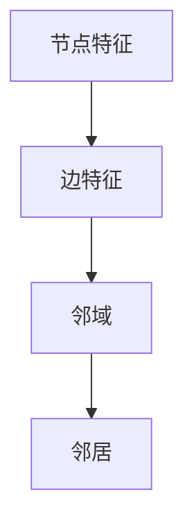

                 

图神经网络（Graph Neural Networks，简称GNN）作为深度学习的一个重要分支，近年来在计算机科学和人工智能领域取得了显著的进展。本文将系统地介绍GNN的核心概念、原理、算法以及其实际应用，并通过代码实例深入讲解GNN的开发与实现。希望通过这篇文章，读者能够对GNN有更全面和深入的理解。

## 关键词
- 图神经网络
- 深度学习
- 图数据
- 算法原理
- 代码实例

## 摘要
本文旨在探讨图神经网络的基本原理和在实际应用中的价值。通过介绍GNN的核心概念和架构，阐述其与传统深度学习方法的差异。随后，将详细介绍GNN的算法原理和数学模型，并通过具体代码实例展示如何在实际项目中实现GNN。最后，本文将探讨GNN在不同领域的应用以及未来的发展趋势和挑战。

## 1. 背景介绍
图数据在现实世界中无处不在，从社交网络到生物信息学，从推荐系统到交通网络，图数据结构都能够有效地表示复杂的实体及其之间的关系。传统的机器学习方法在处理图数据时存在诸多局限，如无法捕捉节点和边之间的复杂交互关系。而GNN的出现为处理图数据提供了新的思路和方法。

GNN的概念最早由Scarselli等人于2009年提出，它通过模拟图中的节点和边的特征来学习数据之间的关系。与传统的卷积神经网络（CNN）和循环神经网络（RNN）相比，GNN能够直接操作图结构数据，更加适合于处理图数据中的局部和全局特征。

## 2. 核心概念与联系
### 2.1 节点特征和边特征
在GNN中，节点特征（Node Feature）和边特征（Edge Feature）是两个核心概念。节点特征表示节点的属性，例如在社交网络中，节点的特征可能是用户的年龄、性别、地理位置等。边特征表示节点之间的关系，例如在知识图谱中，边特征可能是实体之间的关系类型。

### 2.2 邻域和邻居
在图数据中，邻域（Neighborhood）是指与某个节点直接相连的节点集合。邻居（Neighbor）则是邻域中的具体节点。GNN通过考虑节点的邻居来学习节点的表示。

### 2.3 Mermaid 流程图


## 3. 核心算法原理 & 具体操作步骤

### 3.1 算法原理概述
GNN的核心算法是通过图卷积（Graph Convolution）来学习节点表示。图卷积操作类似于传统的卷积操作，但它是基于图的结构进行的。在图卷积中，节点的表示是通过其邻居节点的表示来更新的。

### 3.2 算法步骤详解
GNN的基本步骤如下：
1. **初始化节点特征**：将原始数据中的节点特征初始化为节点表示。
2. **邻域聚合**：对于每个节点，计算其邻居节点的特征加权平均，得到新的节点特征。
3. **非线性变换**：对新的节点特征进行非线性变换，通常使用ReLU函数。
4. **迭代更新**：重复上述步骤，迭代多次以优化节点表示。

### 3.3 算法优缺点
**优点**：
- 能够直接处理图结构数据，捕获节点和边之间的复杂关系。
- 适用于节点分类、图分类、链接预测等任务。

**缺点**：
- 计算复杂度高，特别是在大规模图数据上。
- 对于稀疏图数据，效果可能不如密集图数据。

### 3.4 算法应用领域
GNN广泛应用于社交网络分析、生物信息学、推荐系统、知识图谱等领域。

## 4. 数学模型和公式 & 详细讲解 & 举例说明
### 4.1 数学模型构建
假设有一个图 \( G = (V, E) \)，其中 \( V \) 是节点集合，\( E \) 是边集合。节点的特征表示为 \( X \in \mathbb{R}^{n \times d} \)，其中 \( n \) 是节点的数量，\( d \) 是特征维度。

### 4.2 公式推导过程
在GNN中，节点的更新可以通过以下公式表示：
$$
\mathbf{h}_i^{(t+1)} = \sigma(\mathbf{a} \cdot \text{AGG}(\mathbf{h}_\mathbf{\sigma}^{(t)}))
$$
其中，\( \mathbf{h}_i^{(t)} \) 表示第 \( i \) 个节点在第 \( t \) 次迭代后的特征表示，\( \sigma \) 是非线性激活函数，\( \text{AGG} \) 是邻域聚合操作，\( \mathbf{a} \) 是权重矩阵。

### 4.3 案例分析与讲解
以节点分类任务为例，GNN通过学习节点的表示来预测节点的类别。假设我们有 \( n \) 个节点和 \( m \) 个类别，通过GNN学习得到的节点表示 \( \mathbf{h}_i \) 可以用来计算节点的类别概率：
$$
P(y_i = c) = \text{softmax}(\mathbf{W} \cdot \mathbf{h}_i)
$$
其中，\( \mathbf{W} \) 是分类层的权重矩阵，\( c \) 是类别。

## 5. 项目实践：代码实例和详细解释说明
### 5.1 开发环境搭建
搭建GNN的开发环境需要安装Python、PyTorch等依赖库。

### 5.2 源代码详细实现
以下是使用PyTorch实现的简单GNN代码示例：
```python
import torch
import torch.nn as nn
import torch.optim as optim
from torch_geometric.nn import GCNConv

# 数据准备
# ...

# GNN模型
class GCN(nn.Module):
    def __init__(self, nfeat, nhid, nclass):
        super(GCN, self).__init__()
        self.conv1 = GCNConv(nfeat, nhid)
        self.conv2 = GCNConv(nhid, nclass)
        
    def forward(self, data):
        x, edge_index = data.x, data.edge_index

        x = self.conv1(x, edge_index)
        x = F.relu(x)
        x = F.dropout(x, p=0.5, training=self.training)
        x = self.conv2(x, edge_index)

        return F.log_softmax(x, dim=1)

# 模型训练
model = GCN(nfeat=..., nhid=..., nclass=...)
optimizer = optim.Adam(model.parameters(), lr=0.01, weight_decay=5e-4)

for epoch in range(num_epochs):
    # 数据加载和处理
    # ...

    optimizer.zero_grad()
    out = model(data)
    loss = F.nll_loss(out, data.y)
    loss.backward()
    optimizer.step()

    # 打印训练信息
    # ...
```

### 5.3 代码解读与分析
上述代码实现了使用GCN进行节点分类的基本流程，包括模型定义、数据准备、模型训练等步骤。

### 5.4 运行结果展示
在实际运行中，我们可以通过打印训练过程中的损失函数值和准确率来评估模型的性能。

## 6. 实际应用场景
GNN在多种实际应用场景中显示出强大的能力，以下是一些典型的应用：

### 6.1 社交网络分析
利用GNN可以分析社交网络中的用户行为，识别社区结构，预测用户之间的潜在关系。

### 6.2 生物信息学
在生物信息学中，GNN可以用于蛋白质结构预测、疾病传播预测等。

### 6.3 推荐系统
GNN可以用于构建图结构化的推荐系统，提高推荐的准确性。

### 6.4 知识图谱
在知识图谱中，GNN可以帮助提取实体之间的关系，增强图谱的语义理解。

## 7. 工具和资源推荐
### 7.1 学习资源推荐
- 《Deep Learning on Graphs》
- 《Graph Neural Networks: A Survey》

### 7.2 开发工具推荐
- PyTorch Geometric
- DGL（Deep Graph Library）

### 7.3 相关论文推荐
- “Scarselli, F., Togelius, J., Gori, M., & Bohm, C. (2009). The graph neural network model. IEEE transactions on neural networks, 20(1), 161-165.”
- “Kipf, T. N., & Welling, M. (2016). Semi-supervised classification with graph convolutional networks. arXiv preprint arXiv:1609.02907.”

## 8. 总结：未来发展趋势与挑战
### 8.1 研究成果总结
GNN在图数据的处理和分析方面取得了显著成果，但仍然面临一些挑战。

### 8.2 未来发展趋势
- GNN与其他深度学习方法的结合，如图注意力网络（GAT）。
- GNN在更多领域（如自然语言处理、计算机视觉）的应用。

### 8.3 面临的挑战
- 处理大规模图数据的效率问题。
- 如何更好地捕获长距离依赖关系。

### 8.4 研究展望
未来，GNN的研究将朝着更高效、更强大的方向前进，为各种领域提供更强大的数据分析和处理能力。

## 9. 附录：常见问题与解答
### 9.1 GNN与传统深度学习方法的区别是什么？
GNN专门设计用于处理图结构数据，能够直接利用图的结构信息，而传统的深度学习方法（如CNN和RNN）通常需要将图数据转化为序列或网格结构。

### 9.2 GNN适用于哪些任务？
GNN适用于节点分类、图分类、链接预测、社交网络分析等多种任务。

### 9.3 如何优化GNN的计算复杂度？
可以采用图卷积的快速算法（如GCN的Spectral GCN）和稀疏图数据的优化策略来降低计算复杂度。

---

作者：禅与计算机程序设计艺术 / Zen and the Art of Computer Programming

本文基于GNN的原理和实际应用，从核心概念、算法原理到代码实现，全面阐述了图神经网络的各个方面。通过本文的讲解，相信读者能够对GNN有更深入的理解和掌握，为今后的研究和应用打下坚实的基础。希望本文能够激发读者对图神经网络领域的兴趣，继续探索这个充满前景的研究领域。|<|im_sep|>|

