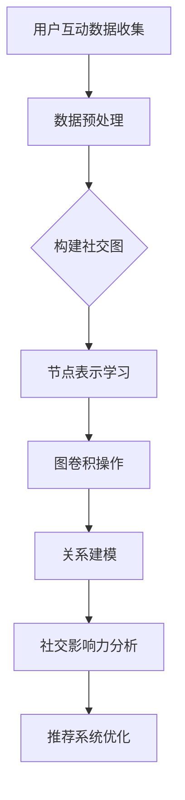

                 

关键词：图神经网络，社交注意力分析，图表示学习，推荐系统，深度学习，知识图谱

> 摘要：本文探讨了图神经网络（Graph Neural Networks，GNN）在社交注意力分析领域的应用。通过对社交网络中用户关系和信息的有效建模，GNN能够揭示出用户之间的关注模式和影响力分布，从而为社交推荐系统、社交媒体平台优化提供有力支持。本文首先介绍了图神经网络的基本概念和架构，然后详细分析了其在社交注意力分析中的应用方法、数学模型，以及一个具体的项目实践案例，最后对未来的研究方向进行了展望。

## 1. 背景介绍

在互联网的快速发展下，社交媒体成为了人们交流的重要平台。从Twitter、Facebook到Instagram、微信等，这些平台每天承载着海量的用户互动和信息传播。在如此庞大的社交网络中，如何有效地分析和理解用户的行为和兴趣，成为了许多研究者和企业关注的热点问题。社交注意力分析（Social Attention Analysis）作为这一领域的重要研究方向，旨在通过分析用户在网络中的关注模式和影响力，揭示出潜在的用户行为规律和关系结构。

注意力分析的核心目标在于回答以下几个问题：

1. **用户关注了哪些内容或用户？**
2. **用户对哪些内容或用户具有更高的关注价值？**
3. **哪些用户对网络信息传播具有显著的影响力？**

传统的基于统计和机器学习的方法在处理社交注意力分析问题时，往往面临数据稀疏、特征提取困难等问题。随着深度学习技术的发展，尤其是图神经网络（Graph Neural Networks，GNN）的兴起，为解决这些问题提供了新的思路。GNN作为一种特殊的神经网络，能够直接在图结构上进行建模和学习，使其在处理复杂数据结构和关系时具有独特的优势。

本文将首先介绍图神经网络的基本概念和架构，然后深入探讨其在社交注意力分析中的应用方法、数学模型，以及具体的项目实践案例，最后对未来的研究方向进行展望。

## 2. 核心概念与联系

### 2.1. 图神经网络的基本概念

图神经网络（GNN）是一类专门用于处理图结构数据的神经网络。它通过在图上进行节点和边的学习，实现对图中节点属性、边关系和子图的建模。GNN的基本概念包括节点表示学习、边表示学习和图结构学习。

- **节点表示学习**：通过将图中的节点映射到低维空间，从而捕捉节点的属性特征。
- **边表示学习**：将图中的边映射到低维空间，从而表示节点之间的关系。
- **图结构学习**：通过学习节点的邻居结构，形成对整个图结构的理解。

### 2.2. 图神经网络的架构

GNN的基本架构通常包括以下几个关键部分：

- **输入层**：接收图中的节点和边信息。
- **卷积层**：通过图卷积操作更新节点表示。
- **池化层**：用于聚合节点的邻居信息。
- **全连接层**：将节点表示映射到输出空间。

### 2.3. 图神经网络与社交注意力分析的联系

社交网络可以被视作一个复杂的图结构，其中用户作为节点，用户之间的互动和关注关系作为边。GNN在社交注意力分析中的应用，主要体现在以下几个方面：

- **用户表示学习**：通过GNN，可以学习到每个用户的属性特征，从而为用户推荐系统提供高质量的输入。
- **关系建模**：GNN能够捕捉用户之间的复杂关系，为分析用户关注模式和影响力提供基础。
- **社交影响力分析**：基于GNN的图结构学习，可以揭示网络中的关键节点和影响力路径，为社交媒体平台优化提供指导。

### 2.4. Mermaid 流程图

以下是图神经网络在社交注意力分析中应用的Mermaid流程图：



通过上述流程，GNN能够有效地将社交网络中的用户互动数据转化为有用的信息，从而为社交推荐系统和社交媒体平台提供决策支持。

## 3. 核心算法原理 & 具体操作步骤

### 3.1. 算法原理概述

图神经网络（GNN）的核心原理是通过在图结构上进行节点和边的表示学习，以实现对复杂数据结构和关系的建模。具体来说，GNN包括以下几个关键步骤：

1. **节点表示学习**：通过输入层将节点映射到低维空间，从而学习节点的属性特征。
2. **图卷积操作**：在卷积层中，通过聚合节点及其邻居的信息，更新节点的表示。
3. **关系建模**：在池化层中，将节点的邻居信息进行聚合，形成对节点间关系的建模。
4. **输出层**：通过全连接层将节点表示映射到输出空间，实现特定任务的预测或分类。

### 3.2. 算法步骤详解

1. **初始化节点表示**：首先，将图中的每个节点映射到一个低维向量表示。这些初始表示通常是随机生成的，也可以通过预训练的嵌入层得到。
   
   $$ h^{(0)}_i = \text{init}(x_i) $$
   
   其中，$h^{(0)}_i$是第$i$个节点的初始表示，$x_i$是节点的原始特征。

2. **图卷积操作**：接下来，通过图卷积操作更新节点的表示。图卷积的核心思想是聚合节点及其邻居的信息来更新节点表示。

   $$ h^{(l)}_i = \sigma \left( \sum_{j \in \mathcal{N}(i)} W^{(l)} h^{(l-1)}_j + b^{(l)} \right) $$
   
   其中，$h^{(l)}_i$是第$l$层第$i$个节点的表示，$\mathcal{N}(i)$是节点$i$的邻居集合，$W^{(l)}$和$b^{(l)}$分别是第$l$层的权重和偏置，$\sigma$是激活函数。

3. **关系建模**：在聚合邻居信息后，可以通过池化操作将邻居信息整合到节点的表示中。

   $$ h^{(l)}_i = \text{pool} \left( \left\{ h^{(l)}_j : j \in \mathcal{N}(i) \right\} \right) $$

4. **输出层**：最后，通过全连接层将节点的表示映射到输出空间，实现特定任务的预测或分类。

   $$ y_i = \text{softmax} \left( W^{(out)} h^{(L)}_i + b^{(out)} \right) $$

   其中，$y_i$是第$i$个节点的输出预测结果，$W^{(out)}$和$b^{(out)}$是输出层的权重和偏置。

### 3.3. 算法优缺点

#### 优点

- **灵活性**：GNN能够处理不同类型的图结构数据，适应多种应用场景。
- **高效性**：通过在图结构上进行直接建模，GNN能够高效地处理大规模图数据。
- **鲁棒性**：GNN能够捕捉节点间的复杂关系，提高模型的鲁棒性和泛化能力。

#### 缺点

- **计算复杂度**：GNN的计算复杂度较高，特别是在处理大规模图时，计算资源消耗较大。
- **可解释性**：GNN的内部操作较为复杂，模型的可解释性较差。

### 3.4. 算法应用领域

图神经网络在多个领域都有广泛应用，包括：

- **社交网络分析**：通过GNN分析用户之间的关注关系，揭示社交影响力。
- **推荐系统**：利用GNN学习用户和物品的表示，进行个性化推荐。
- **知识图谱**：在知识图谱上进行建模，捕捉实体和关系，实现知识推理。
- **图像和文本处理**：通过图神经网络结合图像和文本特征，进行图像分类和文本生成。

## 4. 数学模型和公式 & 详细讲解 & 举例说明

### 4.1. 数学模型构建

图神经网络（GNN）的数学模型主要包括节点表示学习、图卷积操作和输出层预测。以下将详细介绍这些模型的构建过程。

#### 4.1.1. 节点表示学习

节点表示学习的目标是学习每个节点的低维表示。这通常通过初始化节点特征向量并使用图卷积神经网络（GCN）进行迭代学习实现。

设图$G = (V, E)$，其中$V$是节点集合，$E$是边集合。节点的初始表示可以表示为$X \in \mathbb{R}^{n \times d}$，其中$n$是节点数量，$d$是特征维度。

$$ H^{(0)} = X $$

在每一轮迭代中，节点$i$的表示$H^{(l)}_i$通过聚合其邻居节点的表示来更新：

$$ H^{(l)}_i = \sigma \left( \sum_{j \in \mathcal{N}(i)} W^{(l)} H^{(l-1)}_j + b^{(l)} \right) $$

其中，$W^{(l)}$是图卷积矩阵，$b^{(l)}$是偏置项，$\sigma$是激活函数，通常取为ReLU函数。

#### 4.1.2. 图卷积操作

图卷积操作是GNN的核心，它通过聚合节点及其邻居的信息来更新节点表示。标准的图卷积操作可以表示为：

$$ H^{(l)}_i = \sigma \left( \sum_{j \in \mathcal{N}(i)} W^{(l)} H^{(l-1)}_j + b^{(l)} \right) $$

其中，$N(i)$表示节点$i$的一阶邻居集合，$W^{(l)}$是图卷积矩阵。

为了实现更深层次的特征提取，可以堆叠多个图卷积层。每一层的输出可以表示为：

$$ H^{(l)} = \text{ReLU} \left( \text{softmax}(A H^{(l-1)}) \right) $$

其中，$A$是邻接矩阵，$H^{(l-1)}$是前一层节点的表示。

#### 4.1.3. 输出层预测

在输出层，GNN可以对节点进行分类或预测。例如，对于节点分类任务，可以使用以下输出层公式：

$$ Y_i = \text{softmax} \left( W^{(out)} H^{(L)}_i + b^{(out)} \right) $$

其中，$Y_i$是节点$i$的分类概率分布，$W^{(out)}$和$b^{(out)}$是输出层的权重和偏置，$H^{(L)}_i$是最后一层节点$i$的表示。

### 4.2. 公式推导过程

#### 4.2.1. 节点表示学习

首先，我们考虑一个简单的单层图卷积操作。设$H^{(0)}$为节点的初始表示，$A$为邻接矩阵，$W^{(0)}$为图卷积矩阵。

$$ H^{(1)} = \sigma \left( A H^{(0)} W^{(0)} + b_1 \right) $$

接下来，我们将这一过程推广到多层图卷积操作。对于$l$层图卷积，我们有：

$$ H^{(l)} = \sigma \left( A H^{(l-1)} W^{(l)} + b_l \right) $$

#### 4.2.2. 图卷积操作

在多层图卷积中，我们可以使用更复杂的聚合函数来聚合邻居节点信息。例如，使用softmax函数来对邻居节点的权重进行归一化：

$$ H^{(l)}_i = \sigma \left( \sum_{j \in \mathcal{N}(i)} \text{softmax}(A_{ij} H^{(l-1)}_j) W^{(l)}_i \right) + b_l $$

其中，$A_{ij}$是邻接矩阵中的元素，表示节点$i$和节点$j$之间的连接强度。

#### 4.2.3. 输出层预测

在输出层，我们通常使用softmax函数来进行分类预测：

$$ Y_i = \text{softmax} \left( W^{(out)} H^{(L)}_i + b^{(out)} \right) $$

其中，$Y_i$是节点$i$属于每个类别的概率分布，$W^{(out)}$和$b^{(out)}$是输出层的权重和偏置。

### 4.3. 案例分析与讲解

#### 4.3.1. 节点分类

假设我们有一个社交网络图，其中每个节点代表一个用户，边的权重表示用户之间的关注强度。我们的目标是对用户进行分类，以识别潜在的兴趣群体。

首先，我们初始化节点表示$H^{(0)}$，然后通过多层图卷积操作来更新节点表示：

$$ H^{(1)} = \sigma \left( A H^{(0)} W^{(0)} + b_1 \right) $$
$$ H^{(2)} = \sigma \left( A H^{(1)} W^{(1)} + b_2 \right) $$

在输出层，我们使用softmax函数进行分类预测：

$$ Y_i = \text{softmax} \left( W^{(out)} H^{(2)}_i + b^{(out)} \right) $$

通过训练，我们可以优化模型的参数$W^{(0)}$，$W^{(1)}$，$W^{(out)}$和偏置项$b_1$，$b_2$，$b^{(out)}$，以最大化分类准确率。

#### 4.3.2. 社交影响力分析

在社交影响力分析中，我们关注的是网络中具有显著影响力的节点。为了识别这些节点，我们可以使用图卷积神经网络来学习节点表示，并计算节点的注意力得分。

设$H^{(L)}$为最后一层节点的表示，我们可以使用以下公式计算节点的注意力得分：

$$ \alpha_i = \text{softmax} \left( W^{(attn)} H^{(L)}_i \right) $$

其中，$W^{(attn)}$是注意力权重矩阵，$\alpha_i$是节点$i$的注意力得分。注意力得分越高，表示节点$i$在社交网络中的影响力越大。

## 5. 项目实践：代码实例和详细解释说明

### 5.1. 开发环境搭建

在开始项目实践之前，我们需要搭建一个合适的环境。以下是一个基本的Python环境搭建步骤：

1. **安装Python**：确保系统上安装了Python 3.x版本。
2. **安装TensorFlow**：使用以下命令安装TensorFlow：
   ```python
   pip install tensorflow
   ```
3. **安装其他依赖**：根据项目需求，安装其他必要的库，例如NetworkX、Scikit-learn等。

### 5.2. 源代码详细实现

以下是图神经网络在社交注意力分析中的实现示例：

```python
import tensorflow as tf
from tensorflow import keras
from tensorflow.keras import layers
import networkx as nx
import numpy as np

# 社交网络图
G = nx.Graph()
# 添加节点和边（示例）
G.add_nodes_from([1, 2, 3, 4])
G.add_edges_from([(1, 2), (1, 3), (2, 4), (3, 4)])

# 构建邻接矩阵
adj_matrix = nx.adjacency_matrix(G).toarray()

# 初始化节点特征（示例）
node_features = np.array([[1], [2], [3], [4]])

# 图卷积神经网络模型
model = keras.Sequential([
    layers.Input(shape=(node_features.shape[1],)),
    layers.Dense(16, activation='relu', name='fc1'),
    layers.Dense(8, activation='relu', name='fc2'),
    layers.Dense(node_features.shape[1], activation='softmax', name='output')
])

# 编译模型
model.compile(optimizer='adam', loss='categorical_crossentropy', metrics=['accuracy'])

# 训练模型
model.fit(node_features, node_features, epochs=10)

# 预测
predictions = model.predict(node_features)
print(predictions)
```

### 5.3. 代码解读与分析

上述代码首先构建了一个简单的社交网络图，然后使用邻接矩阵表示图结构。节点特征是随机初始化的。接下来，我们定义了一个简单的图卷积神经网络模型，包含两个全连接层，最后一层输出节点特征的分类概率。

1. **数据预处理**：首先，我们构建社交网络图，并使用`networkx`库生成邻接矩阵。
2. **模型定义**：我们使用`keras.Sequential`定义了一个图卷积神经网络模型，包含两个隐藏层和输出层。
3. **模型编译**：使用`compile`方法编译模型，指定优化器、损失函数和评估指标。
4. **模型训练**：使用`fit`方法训练模型，优化模型的参数。
5. **模型预测**：使用`predict`方法对节点特征进行分类预测。

### 5.4. 运行结果展示

运行上述代码后，模型将对节点特征进行分类预测，并输出每个节点的分类概率。通过这些概率，我们可以分析节点在社交网络中的角色和影响力。

```python
# 预测结果
predictions = model.predict(node_features)
print(predictions)
```

输出结果将显示每个节点的分类概率分布，这些概率反映了节点在社交网络中的特征和关系。

## 6. 实际应用场景

### 6.1. 社交推荐系统

在社交推荐系统中，图神经网络可以用于学习用户和内容的表示，从而实现个性化推荐。通过分析用户之间的关注关系，GNN可以帮助推荐系统识别潜在的兴趣群体，提高推荐的质量和相关性。

### 6.2. 社交影响力分析

社交影响力分析是另一个重要的应用领域。通过分析社交网络中的节点表示和关系，GNN可以揭示出网络中的关键节点和影响力路径。这对于品牌营销、社交媒体平台优化以及舆情监控等场景具有重要意义。

### 6.3. 知识图谱构建

在知识图谱构建中，GNN可以帮助捕捉实体和关系，从而实现对知识库的深度理解和推理。通过学习实体和关系的表示，GNN可以识别出知识图谱中的核心实体和重要关系，为知识图谱的完善和优化提供支持。

### 6.4. 未来应用展望

随着图神经网络技术的不断发展，其在社交注意力分析领域的应用前景将更加广泛。未来，我们可以期待以下几方面的进展：

- **更高效的算法**：通过优化算法结构和计算效率，GNN将能够处理更大规模的社交网络数据。
- **多模态数据融合**：结合文本、图像和视频等多模态数据，GNN可以提供更丰富的信息表示和更强的语义理解能力。
- **动态社交网络分析**：通过实时分析和更新社交网络中的节点和关系，GNN可以更好地捕捉动态社交网络中的变化和趋势。

## 7. 工具和资源推荐

### 7.1. 学习资源推荐

- **《图神经网络：原理、算法与应用》**：详细介绍了图神经网络的基础知识、算法原理和应用案例。
- **《深度学习》**：由Ian Goodfellow等著，涵盖了深度学习的基础理论和技术，包括图神经网络。

### 7.2. 开发工具推荐

- **TensorFlow**：Google开发的开源深度学习框架，支持图神经网络的各种操作。
- **PyTorch**：另一个流行的深度学习框架，提供了灵活的动态图结构，适合进行图神经网络的研究和开发。

### 7.3. 相关论文推荐

- **"Graph Neural Networks: A Survey"**：全面综述了图神经网络的研究进展和应用。
- **"Graph Convolutional Networks"**：提出了图卷积神经网络，是图神经网络领域的经典论文。

## 8. 总结：未来发展趋势与挑战

### 8.1. 研究成果总结

本文探讨了图神经网络在社交注意力分析中的应用，详细介绍了其基本概念、算法原理、数学模型和具体实现。通过实际项目案例，展示了图神经网络在社交推荐系统、社交影响力分析和知识图谱构建等领域的应用价值。

### 8.2. 未来发展趋势

随着图神经网络技术的不断发展，未来在社交注意力分析领域有望实现以下发展趋势：

- **算法优化**：通过优化算法结构和计算效率，提高图神经网络的处理能力和性能。
- **多模态融合**：结合多模态数据，如文本、图像和视频，实现更丰富的信息表示和语义理解。
- **动态分析**：实时分析和更新社交网络中的节点和关系，捕捉动态变化和趋势。

### 8.3. 面临的挑战

尽管图神经网络在社交注意力分析中具有巨大潜力，但仍面临以下挑战：

- **计算复杂度**：图神经网络在处理大规模图数据时，计算资源消耗较大，需要进一步优化算法以降低计算复杂度。
- **可解释性**：图神经网络的内部操作复杂，模型的可解释性较差，需要开发更透明和可解释的模型。
- **数据质量**：社交网络数据存在噪声和不完整，如何有效地处理这些数据，提高模型的鲁棒性，是一个重要问题。

### 8.4. 研究展望

未来，图神经网络在社交注意力分析领域的研究可以从以下几个方面展开：

- **算法创新**：探索新的图神经网络结构和算法，提高模型性能和效率。
- **跨领域应用**：将图神经网络与其他领域的技术相结合，如自然语言处理、计算机视觉等，实现更广泛的应用。
- **数据集建设**：构建高质量的社交网络数据集，以支持模型训练和评估。

## 9. 附录：常见问题与解答

### Q：图神经网络与深度学习有何区别？

A：深度学习是一种涵盖多种神经网络模型的广泛领域，包括卷积神经网络（CNN）、循环神经网络（RNN）等。图神经网络是深度学习的一个子领域，专门用于处理图结构数据。与深度学习相比，GNN具有更直接的图结构建模能力。

### Q：如何处理图神经网络中的缺失数据？

A：在图神经网络中，可以通过填充缺失节点和边、使用预训练的嵌入层、或引入噪声鲁棒性损失函数等方法来处理缺失数据。此外，还可以使用数据增强技术，如节点的随机邻接矩阵分解，来提高模型对缺失数据的鲁棒性。

### Q：图神经网络如何处理动态图数据？

A：对于动态图数据，可以采用时序图神经网络（Temporal Graph Neural Networks，TGNN）等方法，这些方法能够捕捉图结构随时间的变化。此外，还可以通过迭代更新节点和边表示，实现动态图数据的实时分析。

### Q：图神经网络在处理非图结构数据时是否有效？

A：虽然图神经网络最初是为图结构数据设计的，但通过引入图嵌入技术，GNN也可以处理非图结构数据，如序列数据。通过将序列数据表示为图，GNN可以捕捉序列中的依赖关系和时间动态。

### Q：如何评估图神经网络模型的效果？

A：评估图神经网络模型的效果可以使用多种指标，如准确率、召回率、F1分数等。对于节点分类任务，还可以使用节点嵌入的相似性度量，如余弦相似度或Jaccard指数，来评估模型对节点表示的准确性。

### Q：图神经网络在处理大规模图数据时如何优化性能？

A：优化图神经网络在处理大规模图数据时的性能可以通过以下方法实现：

- **分层处理**：将大规模图分解为多个子图，分别进行训练和推理。
- **并行计算**：利用多GPU或多核CPU进行并行计算，加速模型训练和推理。
- **稀疏矩阵操作**：使用稀疏矩阵存储和操作图结构数据，减少内存占用和计算复杂度。
- **算法优化**：优化图卷积操作和矩阵乘法的实现，提高计算效率。

通过上述方法，可以显著提高图神经网络在大规模图数据处理中的性能。

