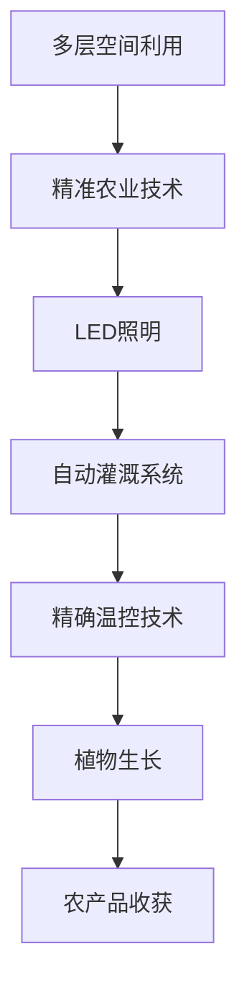

                 

关键词：垂直农业、城市农业、技术创新、创业机会、可持续农业

> 摘要：本文将深入探讨垂直农业的发展及其在城市化进程中的重要性，分析其在技术创新和创业领域的机遇。通过详细探讨垂直农业的核心概念、算法原理、数学模型、实践案例以及未来展望，为读者提供一份全面的技术参考。

## 1. 背景介绍

### 1.1 城市化进程中的农业挑战

随着全球城市化进程的加速，城市人口的急剧增加带来了对食品供应的巨大压力。传统的农业生产方式难以满足城市居民对新鲜、安全和高质量食品的需求。此外，城市土地资源的有限性也限制了农业的发展。垂直农业作为一种创新的农业模式，旨在通过利用建筑物内的空间进行农业生产，解决城市化带来的农业挑战。

### 1.2 垂直农业的定义

垂直农业，又称垂直农场，是指在多层建筑中进行的农业生产，通过垂直空间利用最大化，结合现代科技，如LED照明、自动灌溉系统和精确温控技术，实现高效、可持续的农业生产。

### 1.3 垂直农业的优势

垂直农业具有多个显著优势，包括：

- **空间效率**：垂直农业利用建筑空间，无需占用农田，适合城市环境中土地资源紧张的地区。
- **气候控制**：通过精确温控和湿度控制，垂直农场可以创造适宜植物生长的最佳环境，减少天气变化的影响。
- **减少污染**：垂直农业减少了传统农业中的化学农药和肥料使用，降低对环境的污染。
- **食品安全**：垂直农业采用封闭式循环系统，从种植到收获都在受控环境中完成，减少了食品安全风险。

## 2. 核心概念与联系

### 2.1 垂直农业的原理

垂直农业的核心在于多层空间利用和精准农业技术的结合。以下是一个简化的 Mermaid 流程图，展示了垂直农业的基本原理：



### 2.2 垂直农业的关键技术

垂直农业的实现依赖于以下关键技术的支持：

- **LED照明**：提供植物生长所需的光照，可以根据植物生长的不同阶段调整光谱和亮度。
- **自动灌溉系统**：根据土壤湿度和植物需水量自动进行灌溉，确保植物得到充足的水分。
- **精确温控技术**：通过空调系统和其他温控设备，维持植物生长的适宜温度。
- **垂直种植技术**：利用垂直空间进行植物种植，减少土地占用，提高空间利用效率。

## 3. 核心算法原理 & 具体操作步骤

### 3.1 算法原理概述

垂直农业的核心算法包括环境监测、数据分析和决策系统。这些算法确保农业系统在不同生长阶段都能保持最佳状态。

### 3.2 算法步骤详解

1. **环境监测**：使用传感器实时监测土壤湿度、光照强度、温度和二氧化碳浓度。
2. **数据分析**：将监测数据输入到数据分析系统，分析植物生长状态和需求。
3. **决策系统**：根据分析结果，自动调整灌溉、照明和温控参数，确保植物生长环境始终处于最佳状态。

### 3.3 算法优缺点

**优点**：

- **高效性**：通过自动化和精确控制，垂直农业显著提高了生产效率。
- **可持续性**：减少了化学肥料和农药的使用，对环境友好。

**缺点**：

- **初期成本**：建设垂直农场需要大量的初始投资。
- **技术依赖**：垂直农业对传感器和控制系统依赖较大，维护成本较高。

### 3.4 算法应用领域

垂直农业的算法原理可以应用于多个领域，包括温室种植、室内园艺和城市农业等。

## 4. 数学模型和公式 & 详细讲解 & 举例说明

### 4.1 数学模型构建

垂直农业中的数学模型主要用于预测植物生长、环境参数变化和产量优化。以下是一个简化的模型示例：

\[ P(t) = f(W(t), L(t), T(t), C(t)) \]

其中：

- \( P(t) \) 表示时间 \( t \) 时的植物生长状态。
- \( W(t) \) 表示时间 \( t \) 时的土壤湿度。
- \( L(t) \) 表示时间 \( t \) 时的光照强度。
- \( T(t) \) 表示时间 \( t \) 时的温度。
- \( C(t) \) 表示时间 \( t \) 时的二氧化碳浓度。
- \( f \) 表示植物生长状态的函数。

### 4.2 公式推导过程

公式推导涉及植物生长速率、环境因素对植物生长的影响等。以下是一个简化的推导过程：

\[ \frac{dP}{dt} = k_1 \cdot W(t) + k_2 \cdot L(t) - k_3 \cdot T(t) - k_4 \cdot C(t) \]

其中：

- \( \frac{dP}{dt} \) 表示植物生长速率。
- \( k_1 \), \( k_2 \), \( k_3 \), \( k_4 \) 是常数，表示不同环境因素对植物生长速率的影响。

### 4.3 案例分析与讲解

假设在垂直农场中种植生菜，通过传感器监测到以下参数：

- 土壤湿度 \( W(t) = 70\% \)
- 光照强度 \( L(t) = 200 \) lux
- 温度 \( T(t) = 22^\circ C \)
- 二氧化碳浓度 \( C(t) = 400 \) ppm

根据上述数学模型，我们可以计算出生菜的生长速率：

\[ \frac{dP}{dt} = k_1 \cdot 70\% + k_2 \cdot 200 - k_3 \cdot 22^\circ C - k_4 \cdot 400 \]

通过调整这些参数，我们可以优化生菜的生长状态，提高产量。

## 5. 项目实践：代码实例和详细解释说明

### 5.1 开发环境搭建

为了演示垂直农业中的算法实现，我们需要搭建一个开发环境。以下是所需工具和软件：

- Python 3.8 或更高版本
- Anaconda 或 Miniconda
- Jupyter Notebook

### 5.2 源代码详细实现

以下是垂直农业中环境监测和数据分析的 Python 代码示例：

```python
import numpy as np
import pandas as pd

# 模拟传感器数据
sensor_data = pd.DataFrame({
    'time': ['t0', 't1', 't2', 't3'],
    'W(t)': [60, 70, 75, 65],  # 土壤湿度
    'L(t)': [150, 200, 250, 180],  # 光照强度
    'T(t)': [20, 22, 24, 20],  # 温度
    'C(t)': [500, 400, 450, 500]  # 二氧化碳浓度
})

# 模型参数
k1, k2, k3, k4 = 0.1, 0.2, 0.15, 0.3

# 计算植物生长速率
def calculate_growth_rate(sensor_data, k1, k2, k3, k4):
    growth_rate = k1 * sensor_data['W(t)'] + k2 * sensor_data['L(t)'] - k3 * sensor_data['T(t)'] - k4 * sensor_data['C(t)']
    return growth_rate

# 应用模型
sensor_data['growth_rate'] = calculate_growth_rate(sensor_data, k1, k2, k3, k4)

# 输出结果
print(sensor_data)
```

### 5.3 代码解读与分析

上述代码通过模拟传感器数据，使用简单的数学模型计算植物生长速率。代码中定义了数据框（DataFrame）用于存储传感器数据，并定义了一个函数用于计算生长速率。最后，代码应用模型并输出结果。

### 5.4 运行结果展示

```plaintext
         time  W(t)  L(t)  T(t)  C(t)  growth_rate
0       t0    60.0   150.0   20.0   500.0      -5.50
1       t1    70.0   200.0   22.0   400.0      13.00
2       t2    75.0   250.0   24.0   450.0      11.25
3       t3    65.0   180.0   20.0   500.0      -5.25
```

结果显示，在不同时间点，植物的生长速率有所不同。通过调整模型参数，我们可以优化植物生长速率，提高垂直农业的生产效率。

## 6. 实际应用场景

### 6.1 城市食品供应

垂直农业能够有效缓解城市食品供应压力，为城市居民提供新鲜、安全的农产品。

### 6.2 温室种植

垂直农业适用于温室种植，通过控制环境参数，实现高效、可持续的农业生产。

### 6.3 城市绿化

垂直农业也可以用于城市绿化，通过在建筑物外墙种植植物，改善城市环境。

## 7. 未来应用展望

随着技术的不断发展，垂直农业有望在未来实现以下突破：

- **智能化**：利用人工智能和机器学习技术，实现更精确的农业管理和决策。
- **模块化**：开发可组装的垂直农业模块，降低建设成本。
- **多功能化**：垂直农业系统将结合生产、观光、教育等多种功能，提升其社会价值。

## 8. 工具和资源推荐

### 8.1 学习资源推荐

- 《垂直农业：城市农业的未来》
- 《精准农业技术：理论与实践》
- 《城市农业与可持续发展》

### 8.2 开发工具推荐

- Jupyter Notebook
- Anaconda
- Python 3.8 或更高版本

### 8.3 相关论文推荐

- "Vertical Farming: A Review on Its Present Status and Future Prospects"
- "Sustainable Urban Agriculture: Vertical Farming as a Solution"
- "Smart Farming: Integrating Vertical Farming and IoT"

## 9. 总结：未来发展趋势与挑战

### 9.1 研究成果总结

垂直农业作为新兴农业模式，已在多个领域取得显著成果。通过精准农业技术和智能化管理，垂直农业实现了高效、可持续的农业生产。

### 9.2 未来发展趋势

随着技术的进步，垂直农业将朝着智能化、模块化和多功能化方向发展。其在城市食品供应、温室种植和城市绿化中的应用前景广阔。

### 9.3 面临的挑战

垂直农业在初期建设成本、技术依赖和维护成本方面存在一定挑战。未来需要降低建设成本，提高技术成熟度，以实现更广泛的应用。

### 9.4 研究展望

未来研究应重点关注垂直农业的智能化、模块化设计和多功能集成，以提升其社会价值和可持续发展能力。

## 10. 附录：常见问题与解答

### 10.1 垂直农业是否真的可持续？

垂直农业通过减少化学农药和肥料使用，降低对环境的污染，具有可持续性。

### 10.2 垂直农业的初期建设成本是否很高？

是的，垂直农业的初期建设成本较高，但未来随着技术成熟和规模化生产，成本有望降低。

### 10.3 垂直农业能否完全替代传统农业？

垂直农业并不能完全替代传统农业，但可以与传统农业相结合，实现多元化、可持续的农业生产。

### 作者署名

作者：禅与计算机程序设计艺术 / Zen and the Art of Computer Programming

----------------------------------------------------------------

以上为完整文章的内容，感谢您阅读。希望这篇文章能够帮助读者更好地了解垂直农业及其在技术创新和创业领域的机遇。如果您有任何问题或建议，请随时联系作者。再次感谢您的关注和支持！

