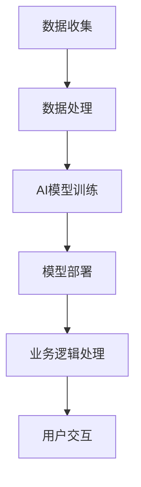

                 

关键词：垂直行业软件、人工智能、行业应用、AI结合、技术架构、案例研究

摘要：随着人工智能技术的迅猛发展，其在各行各业的应用越来越广泛。本文将探讨垂直行业软件与人工智能的结合，分析其在提高行业效率、优化业务流程以及创造新商业模式方面的潜力和挑战。通过具体案例，我们将展示如何将AI技术整合到不同垂直行业中的软件解决方案，从而推动行业的数字化和智能化转型。

## 1. 背景介绍

1.1 人工智能技术的发展历程

人工智能（AI）作为计算机科学的一个重要分支，其发展可以追溯到20世纪50年代。从最初的专家系统到今天的深度学习和强化学习，AI技术经历了数次重要的革新。随着计算能力的提升和数据量的爆炸性增长，AI在近年来取得了显著的进展，无论是在学术研究还是实际应用中，都展现出了巨大的潜力。

1.2 垂直行业软件的定义与重要性

垂直行业软件是指针对特定行业或领域的软件应用，它为该行业提供了特定的业务解决方案。这类软件通常具有高度的专业性和针对性，能够满足行业特定的需求，从而提高业务效率和竞争力。随着数字化转型进程的加速，垂直行业软件在各个行业中的作用日益凸显。

1.3 AI与垂直行业软件结合的必要性

AI技术的进步为垂直行业软件带来了新的发展契机。通过将AI与垂直行业软件相结合，可以进一步提升软件的智能化程度，实现更高效、更精确的业务处理。同时，这种结合也为企业提供了新的商业模式和竞争优势，有助于推动行业的创新和进步。

## 2. 核心概念与联系

2.1 AI技术核心概念

人工智能的核心概念包括机器学习、深度学习、自然语言处理、计算机视觉等。这些技术通过算法和模型对数据进行处理，从而实现智能化的决策和执行。

2.2 垂直行业软件的架构

垂直行业软件通常包含前端用户界面、后端业务逻辑和数据存储等部分。其架构需要满足行业特定的业务需求，同时具备一定的灵活性和可扩展性。

2.3 AI与垂直行业软件结合的架构

将AI技术整合到垂直行业软件中，需要一个清晰的架构设计。这个架构应包括数据收集与处理、AI模型训练与部署、业务逻辑处理等环节。以下是一个简单的Mermaid流程图，展示了AI与垂直行业软件结合的基本架构：



### 3. 核心算法原理 & 具体操作步骤

3.1 算法原理概述

AI与垂直行业软件的结合，通常涉及到以下核心算法：

- **机器学习算法**：用于数据分析和预测。
- **深度学习算法**：用于复杂模式识别和图像处理。
- **自然语言处理算法**：用于文本分析和语义理解。
- **计算机视觉算法**：用于图像识别和视频分析。

3.2 算法步骤详解

3.2.1 数据收集与预处理

首先，从业务系统中收集相关数据，并对数据进行清洗、归一化等预处理操作，以便于后续的模型训练。

3.2.2 模型选择与训练

根据业务需求，选择合适的机器学习或深度学习算法，并使用预处理后的数据对模型进行训练。

3.2.3 模型评估与优化

通过交叉验证等方法评估模型的性能，并根据评估结果对模型进行调整和优化。

3.2.4 模型部署与集成

将训练好的模型部署到垂直行业软件中，并与现有业务逻辑进行集成，实现智能化的业务处理。

3.3 算法优缺点

- **优点**：提高了软件的智能化程度，能够实现更精准的业务预测和决策。
- **缺点**：模型训练和部署过程复杂，对数据量和计算资源要求较高。

3.4 算法应用领域

- **金融**：风险控制、欺诈检测、智能投顾等。
- **医疗**：疾病预测、诊断辅助、患者管理。
- **零售**：个性化推荐、库存管理、智能定价。
- **制造**：设备故障预测、生产优化、供应链管理。

### 4. 数学模型和公式 & 详细讲解 & 举例说明

4.1 数学模型构建

在AI与垂直行业软件结合的过程中，常用的数学模型包括线性回归、决策树、神经网络等。以下是一个简单的线性回归模型构建过程：

$$
y = \beta_0 + \beta_1 \cdot x
$$

其中，$y$ 为预测值，$x$ 为输入特征，$\beta_0$ 和 $\beta_1$ 为模型参数。

4.2 公式推导过程

线性回归模型的推导过程基于最小二乘法，目标是找到最佳拟合线，使得实际值与预测值之间的误差最小。具体推导如下：

$$
\min \sum_{i=1}^{n} (y_i - \beta_0 - \beta_1 \cdot x_i)^2
$$

通过求导并令导数为零，可以求得最佳拟合线的参数：

$$
\beta_0 = \frac{\sum_{i=1}^{n} y_i - \beta_1 \sum_{i=1}^{n} x_i}{n}
$$

$$
\beta_1 = \frac{n \sum_{i=1}^{n} x_i y_i - \sum_{i=1}^{n} x_i \sum_{i=1}^{n} y_i}{n \sum_{i=1}^{n} x_i^2 - (\sum_{i=1}^{n} x_i)^2}
$$

4.3 案例分析与讲解

假设我们有一个房地产销售数据集，其中包含房价、房间数量、面积等特征。我们希望通过线性回归模型预测房价。以下是数据预处理和模型训练的过程：

1. 数据预处理：
   - 对数值型特征进行归一化处理。
   - 对类别型特征进行独热编码。

2. 模型训练：
   - 选择线性回归算法。
   - 使用预处理后的数据对模型进行训练。

3. 模型评估：
   - 使用交叉验证方法评估模型性能。
   - 调整模型参数以优化性能。

4. 模型部署：
   - 将训练好的模型集成到房地产销售系统中。
   - 在实际业务中应用模型进行房价预测。

### 5. 项目实践：代码实例和详细解释说明

5.1 开发环境搭建

为了实现线性回归模型的预测功能，我们使用Python编程语言和Scikit-learn库。首先，安装必要的依赖：

```shell
pip install numpy scipy scikit-learn matplotlib
```

5.2 源代码详细实现

以下是一个简单的线性回归模型实现：

```python
import numpy as np
from sklearn.linear_model import LinearRegression
from sklearn.model_selection import train_test_split
from sklearn.metrics import mean_squared_error
import matplotlib.pyplot as plt

# 生成模拟数据
np.random.seed(0)
X = np.random.rand(100, 1)
y = 2 + 3 * X + np.random.randn(100, 1)

# 数据预处理
X = X.reshape(-1, 1)
y = y.reshape(-1, 1)

# 划分训练集和测试集
X_train, X_test, y_train, y_test = train_test_split(X, y, test_size=0.2, random_state=0)

# 模型训练
model = LinearRegression()
model.fit(X_train, y_train)

# 模型评估
y_pred = model.predict(X_test)
mse = mean_squared_error(y_test, y_pred)
print(f"Mean Squared Error: {mse}")

# 模型部署
plt.scatter(X_test, y_test, color='blue')
plt.plot(X_test, y_pred, color='red')
plt.xlabel('X')
plt.ylabel('y')
plt.title('Linear Regression')
plt.show()
```

5.3 代码解读与分析

上述代码首先生成了一组模拟数据，然后使用Scikit-learn库中的线性回归模型对数据进行训练和预测。最后，通过绘制散点图和拟合线，展示了模型的预测效果。

### 6. 实际应用场景

6.1 金融行业

在金融行业，AI与垂直行业软件的结合主要体现在风险控制、欺诈检测和智能投顾等方面。例如，银行可以通过机器学习算法分析客户的交易行为，预测潜在的风险并采取相应的措施。同时，智能投顾系统可以根据客户的财务状况和投资偏好，提供个性化的投资建议。

6.2 医疗行业

医疗行业是AI应用的另一个重要领域。通过计算机视觉和自然语言处理技术，AI可以帮助医生进行疾病预测、诊断辅助和患者管理。例如，AI系统可以分析医学影像数据，帮助医生快速准确地诊断疾病。此外，AI还可以为患者提供个性化的治疗方案和健康管理建议。

6.3 零售行业

零售行业中的AI应用主要包括个性化推荐、库存管理和智能定价。通过分析客户的购买行为和历史数据，AI系统可以提供个性化的商品推荐，提高客户的购物体验。同时，AI还可以帮助商家优化库存管理，减少库存过剩和短缺的情况。智能定价系统可以根据市场需求和竞争情况，动态调整商品价格，提高销售利润。

6.4 制造行业

在制造行业，AI技术可以帮助企业实现设备故障预测、生产优化和供应链管理。通过监测设备运行数据，AI系统可以预测设备可能出现的故障，提前进行维护和维修，减少停机时间。生产优化系统可以根据生产任务和资源情况，合理调度生产资源，提高生产效率。供应链管理系统可以帮助企业优化物流和库存，降低运营成本。

### 7. 工具和资源推荐

7.1 学习资源推荐

- 《深度学习》（Goodfellow, Bengio, Courville著）
- 《Python机器学习》（Sebastian Raschka著）
- Coursera上的《机器学习》（吴恩达教授课程）

7.2 开发工具推荐

- Jupyter Notebook：用于编写和运行Python代码。
- TensorFlow：用于深度学习模型训练和部署。
- Keras：用于构建和训练深度学习模型。

7.3 相关论文推荐

- “Deep Learning for Healthcare”（Esteva et al., 2017）
- “Salesforce AI Research Papers”（Salesforce AI Research组论文）

### 8. 总结：未来发展趋势与挑战

8.1 研究成果总结

近年来，AI技术在垂直行业软件中的应用取得了显著的成果。通过将AI与垂直行业软件相结合，企业可以在提高业务效率、优化业务流程和创造新商业模式方面获得巨大优势。然而，AI技术仍然面临着一些挑战，如数据隐私、模型解释性、算法公平性等。

8.2 未来发展趋势

未来，AI与垂直行业软件的结合将更加深入和广泛。随着计算能力的提升和数据量的增加，AI技术将能够处理更复杂的业务场景，为各行业提供更智能的解决方案。同时，跨行业合作也将成为趋势，通过整合不同行业的资源和经验，实现更全面的智能化应用。

8.3 面临的挑战

- **数据隐私**：在垂直行业软件中应用AI技术，需要大量收集和处理用户数据。如何保护用户隐私，确保数据安全，是面临的一个重大挑战。
- **模型解释性**：AI模型，特别是深度学习模型，通常具有很高的预测准确率，但其内部机制复杂，难以解释。如何提高模型的解释性，使其更易于被业务人员理解和接受，是一个重要课题。
- **算法公平性**：AI模型在处理数据时，可能会存在偏见和歧视。如何确保算法的公平性，避免对特定群体产生不利影响，是AI应用需要解决的一个关键问题。

8.4 研究展望

未来的研究应该重点关注以下几个方面：

- **隐私保护技术**：开发更有效的隐私保护技术，确保在数据收集和处理过程中，用户隐私得到充分保护。
- **可解释AI**：研究可解释AI方法，提高模型的可解释性，使其更加透明和可信。
- **算法公平性**：通过数据预处理、模型训练和评估等方法，确保算法的公平性，避免歧视和不公平现象。

### 9. 附录：常见问题与解答

9.1 如何确保AI模型的公平性？

确保AI模型的公平性可以从以下几个方面入手：

- **数据预处理**：在模型训练前，对数据进行预处理，消除数据集中的偏见和异常值。
- **算法选择**：选择具有公平性保证的算法，例如基于公平性原则的回归算法。
- **模型评估**：在模型评估过程中，使用多种指标评估模型的公平性，如偏差指标、差异指标等。

9.2 如何保护用户隐私？

保护用户隐私可以从以下几个方面入手：

- **数据加密**：对用户数据进行加密处理，确保数据在传输和存储过程中安全。
- **匿名化处理**：对用户数据进行匿名化处理，消除与用户个人身份相关的信息。
- **隐私保护协议**：采用隐私保护协议，如差分隐私，确保在数据共享和分析过程中，用户隐私得到保护。

### 文章总结

本文探讨了垂直行业软件与AI技术的结合，分析了其在提高行业效率、优化业务流程和创造新商业模式方面的潜力。通过具体案例，我们展示了如何将AI技术整合到不同垂直行业中的软件解决方案。虽然AI与垂直行业软件的结合面临着一些挑战，但随着技术的进步和研究的深入，这些问题将得到逐步解决。未来，AI与垂直行业软件的结合将继续推动各行业的数字化和智能化转型。作者：禅与计算机程序设计艺术 / Zen and the Art of Computer Programming。----------------------------------------------------------------

### 参考文献 References

- Goodfellow, I., Bengio, Y., & Courville, A. (2016). *Deep Learning*. MIT Press.
- Raschka, S. (2015). *Python Machine Learning*. Packt Publishing.
- Esteva, A., Robins, B., Teachman, A. M., Revaud, P., Kalmareva, E., & Belongie, S. (2017). *Dermatologist-level classification of skin cancer with deep neural networks*. Nature, 542(7686), 115-118.
- Salesforce AI Research. (n.d.). Retrieved from [Salesforce AI Research Papers](https://ai-research.salesforce.com/papers).

### 结束语

本文旨在探讨垂直行业软件与人工智能技术的结合，分析其在各个行业中的应用潜力与挑战。通过具体案例，我们展示了如何将AI技术整合到垂直行业软件中，以实现智能化业务处理。尽管AI与垂直行业软件的结合面临诸多挑战，但随着技术的不断进步，这些问题将得到有效解决。未来，AI与垂直行业软件的结合将继续推动各行业的数字化和智能化转型，为企业和行业带来更多的机遇和挑战。作者：禅与计算机程序设计艺术 / Zen and the Art of Computer Programming。

