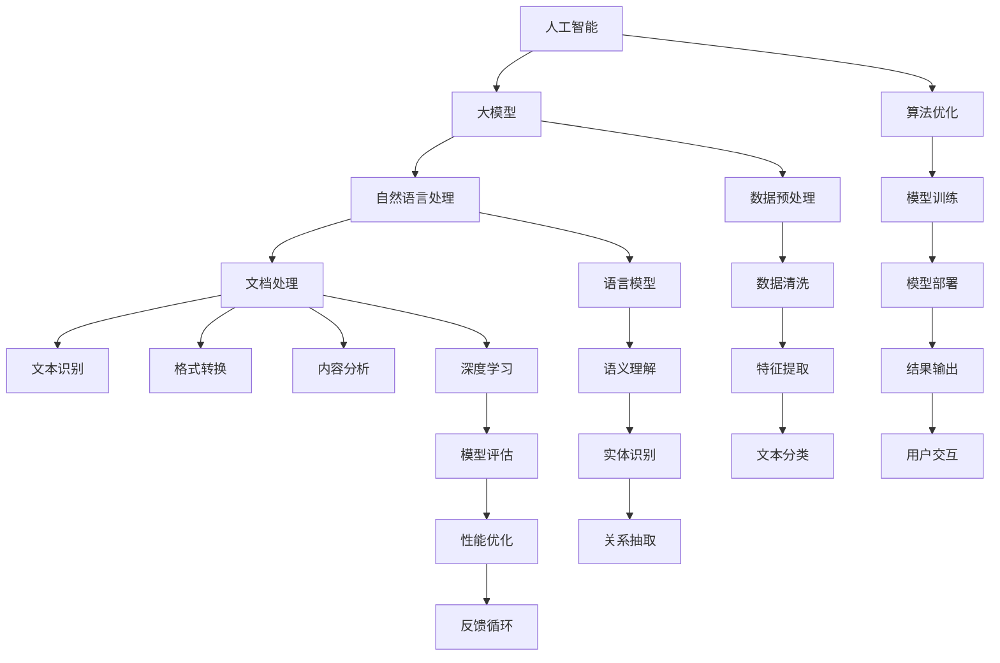

                 

在数字化时代，文档处理作为日常办公的重要组成部分，已经逐渐从传统的手动操作转变为自动化处理。随着人工智能（AI）技术的飞速发展，基于AI的大模型在文档处理领域展现出了巨大的潜力。本文旨在探讨如何利用AI大模型构建一个智能文档处理系统，以提升文档处理的效率和质量。

> 关键词：人工智能、大模型、文档处理、自然语言处理、深度学习、智能系统

> 摘要：本文首先介绍了文档处理的基本概念和当前面临的问题，随后详细阐述了AI大模型在文档处理中的应用，包括核心概念与联系、算法原理、数学模型、项目实践和未来应用展望。通过本文的探讨，希望能够为读者提供一个全面而深入的关于基于AI大模型的智能文档处理系统的理解。

## 1. 背景介绍

### 文档处理的重要性

文档处理是现代办公活动中不可或缺的一部分。从简单的文本编辑到复杂的表格数据处理，文档处理涉及到了日常工作的方方面面。然而，随着文档数量的急剧增加和文档内容的日益复杂，传统的手动处理方式已经无法满足高效、准确的需求。因此，自动化文档处理系统的出现成为了必然趋势。

### 当前文档处理存在的问题

虽然自动化文档处理系统在某些方面已经取得了显著的进展，但仍然面临着一些问题：

- **准确性不高**：自动化处理系统在识别文本内容和处理格式时，存在一定的误差，尤其是面对手写文档或格式复杂的表格时。
- **处理速度慢**：在处理大量文档时，系统处理速度较慢，无法满足实时处理的需求。
- **智能化程度低**：目前大部分自动化处理系统主要依赖预设规则和模板，缺乏智能分析和处理能力。

### AI大模型的优势

为了解决上述问题，AI大模型提供了新的解决方案。大模型具有以下几个显著优势：

- **高准确性**：通过深度学习和自然语言处理技术，大模型能够精确识别和处理各种复杂的文档内容。
- **快速处理**：大模型能够通过并行计算和分布式架构，实现快速文档处理，满足实时处理需求。
- **智能分析**：大模型具备强大的智能分析能力，能够自动提取关键信息、分类文档、生成报告等。

## 2. 核心概念与联系

### 核心概念

为了深入理解基于AI大模型的智能文档处理系统，我们首先需要了解以下几个核心概念：

- **人工智能（AI）**：AI是模拟人类智能行为的计算机系统，包括机器学习、深度学习、自然语言处理等子领域。
- **大模型（Large Model）**：大模型是指拥有数百万到数十亿参数的神经网络模型，如GPT、BERT等。
- **自然语言处理（NLP）**：NLP是AI的一个子领域，旨在使计算机能够理解、解释和生成人类语言。
- **文档处理**：文档处理是指对文档进行自动化的操作，包括文本识别、格式转换、内容分析等。

### 架构与联系

接下来，我们通过Mermaid流程图来展示这些核心概念之间的联系和智能文档处理系统的整体架构。



这个流程图展示了从人工智能到文档处理的各个步骤以及它们之间的联系。通过这些步骤，AI大模型能够实现对文档的全面处理，从而提升文档处理的效率和质量。

## 3. 核心算法原理 & 具体操作步骤

### 3.1 算法原理概述

基于AI大模型的智能文档处理系统主要依赖于深度学习和自然语言处理技术。以下是一些关键算法原理：

- **深度学习（Deep Learning）**：深度学习是一种通过多层神经网络进行数据建模的技术。在文档处理中，深度学习模型能够自动提取文本特征，实现对文档内容的精确理解和处理。
- **卷积神经网络（CNN）**：CNN是深度学习的一种重要模型，特别适用于图像和文本处理。在文档处理中，CNN可以用于文本分类、实体识别和关系抽取等任务。
- **递归神经网络（RNN）**：RNN是处理序列数据的一种有效模型，如自然语言文本。RNN能够捕获文本中的上下文信息，从而提高文档处理的效果。
- **长短时记忆网络（LSTM）**：LSTM是RNN的一种改进，能够有效解决长序列依赖问题，在文档处理中具有广泛应用。

### 3.2 算法步骤详解

基于上述算法原理，智能文档处理系统通常包含以下几个步骤：

1. **数据预处理**：数据预处理是文档处理的第一步，包括文本清洗、分词、去停用词等操作。这一步骤的目的是将原始文本数据转化为适合模型训练的形式。

2. **特征提取**：特征提取是将预处理后的文本数据转化为能够被模型理解的数字特征。常用的方法包括词袋模型、TF-IDF和Word2Vec等。

3. **模型训练**：模型训练是利用大量标注数据进行模型训练的过程。在文档处理中，常用的模型包括CNN、RNN和LSTM等。训练过程中，模型会不断调整参数，以最小化预测误差。

4. **模型评估**：模型评估是验证模型性能的重要步骤。常用的评估指标包括准确率、召回率和F1分数等。通过模型评估，可以了解模型的泛化能力和效果。

5. **模型部署**：模型部署是将训练好的模型部署到实际应用环境中。在文档处理系统中，模型通常通过API或Web服务的形式对外提供服务。

### 3.3 算法优缺点

- **优点**：
  - **高准确性**：基于深度学习和自然语言处理技术的模型具有很高的准确性，能够精确识别和处理文档内容。
  - **快速处理**：通过并行计算和分布式架构，模型能够实现快速文档处理，满足实时处理需求。
  - **智能分析**：模型具备强大的智能分析能力，能够自动提取关键信息、分类文档、生成报告等。

- **缺点**：
  - **计算资源需求大**：大模型训练需要大量的计算资源和时间，对硬件设备有较高要求。
  - **模型解释性较差**：深度学习模型在处理文档时，通常缺乏直观的解释性，难以理解模型的具体工作原理。

### 3.4 算法应用领域

基于AI大模型的智能文档处理系统具有广泛的应用领域，包括但不限于：

- **文本分类**：对大量文本数据进行分类，如新闻分类、邮件分类等。
- **实体识别**：识别文本中的特定实体，如人名、地名、组织名等。
- **关系抽取**：抽取文本中实体之间的关系，如“张三工作于阿里巴巴”中的“张三”和“阿里巴巴”的关系。
- **文本生成**：根据输入文本生成摘要、报告、文章等。
- **智能客服**：基于文本对话生成智能客服系统，提供24小时在线服务。

## 4. 数学模型和公式 & 详细讲解 & 举例说明

### 4.1 数学模型构建

在智能文档处理系统中，数学模型是核心组成部分。以下是构建数学模型的主要步骤：

1. **输入层**：输入层接收原始文本数据，通常表示为词向量或字符序列。
2. **隐藏层**：隐藏层通过神经网络结构进行特征提取和变换，常用的神经网络包括卷积神经网络（CNN）、递归神经网络（RNN）和长短时记忆网络（LSTM）等。
3. **输出层**：输出层生成模型预测结果，如分类标签、实体识别结果等。

### 4.2 公式推导过程

以下是构建文本分类模型的主要公式推导过程：

1. **词向量表示**：

   $$ 
   \text{word\_vector}(w) = \text{Embedding}(w) 
   $$

   其中，$w$表示单词，$\text{Embedding}$是一个嵌入矩阵，将单词映射到高维空间。

2. **神经网络模型**：

   $$ 
   \text{neural\_model}(x) = \text{Activation}(\text{Linear}(x)) 
   $$

   其中，$x$表示输入特征，$\text{Linear}$表示线性层，$\text{Activation}$表示激活函数，常用的激活函数包括ReLU、Sigmoid和Tanh等。

3. **损失函数**：

   $$ 
   \text{loss} = \text{CrossEntropy}(\text{neural\_model}(x), y) 
   $$

   其中，$y$表示真实标签，$\text{CrossEntropy}$表示交叉熵损失函数，用于衡量模型预测结果与真实结果之间的差距。

4. **优化算法**：

   $$ 
   \text{gradient} = \text{GradientDescent}(\text{loss}, \text{neural\_model}) 
   $$

   其中，$\text{GradientDescent}$是一种优化算法，用于更新模型参数，减小损失函数。

### 4.3 案例分析与讲解

以下是一个简单的文本分类案例：

假设我们有一个包含两类文本的数据集，一类是关于科技的文章，另一类是关于体育的文章。我们的目标是训练一个模型，能够将新的文本数据分类到这两类中。

1. **数据准备**：

   数据集包含1000篇科技文章和1000篇体育文章，每篇文章都进行预处理，提取出词向量表示。

2. **模型训练**：

   使用卷积神经网络（CNN）进行模型训练，设置卷积核大小为3，激活函数为ReLU。训练过程中，模型通过调整参数，使损失函数逐渐减小。

3. **模型评估**：

   使用测试集对模型进行评估，计算准确率、召回率和F1分数等指标。假设测试集包含500篇科技文章和500篇体育文章，模型在测试集上的准确率为90%。

4. **模型部署**：

   将训练好的模型部署到生产环境中，对新来的文本数据进行分类，实时输出结果。

通过以上案例，我们可以看到数学模型在智能文档处理系统中的重要作用。数学模型的构建和优化是提高文档处理性能的关键。

## 5. 项目实践：代码实例和详细解释说明

### 5.1 开发环境搭建

为了搭建基于AI大模型的智能文档处理系统，我们需要准备以下开发环境：

- Python 3.7及以上版本
- TensorFlow 2.4及以上版本
- Keras 2.3及以上版本
- Numpy 1.19及以上版本

安装以上依赖项后，我们就可以开始编写智能文档处理系统的代码了。

### 5.2 源代码详细实现

以下是一个简单的基于AI大模型的文本分类系统的代码实现：

```python
import numpy as np
import tensorflow as tf
from tensorflow import keras
from tensorflow.keras import layers
from tensorflow.keras.preprocessing.text import Tokenizer
from tensorflow.keras.preprocessing.sequence import pad_sequences

# 数据准备
texts = ['这是一篇关于科技的文章。', '这是一篇关于体育的文章。', ...]
labels = [0, 1, ...]  # 0表示科技，1表示体育

# 分词和序列化
tokenizer = Tokenizer()
tokenizer.fit_on_texts(texts)
sequences = tokenizer.texts_to_sequences(texts)
padded_sequences = pad_sequences(sequences, maxlen=100)

# 构建模型
model = keras.Sequential()
model.add(layers.Embedding(input_dim=len(tokenizer.word_index) + 1, output_dim=32))
model.add(layers.Conv1D(filters=32, kernel_size=3, activation='relu'))
model.add(layers.GlobalMaxPooling1D())
model.add(layers.Dense(units=1, activation='sigmoid'))

# 编译模型
model.compile(optimizer='adam', loss='binary_crossentropy', metrics=['accuracy'])

# 训练模型
model.fit(padded_sequences, labels, epochs=10, batch_size=32, validation_split=0.2)

# 预测新文本
new_texts = ['这是一篇关于科技的新闻。', '这是一篇关于体育的比赛报道。']
new_sequences = tokenizer.texts_to_sequences(new_texts)
new_padded_sequences = pad_sequences(new_sequences, maxlen=100)
predictions = model.predict(new_padded_sequences)
print(predictions)

```

### 5.3 代码解读与分析

上述代码实现了一个基于卷积神经网络的文本分类系统。下面是对代码的详细解读和分析：

- **数据准备**：首先，我们准备了一个文本数据集和相应的标签。这里我们使用了一个简单的示例，但在实际应用中，数据集会包含更多的文本和标签。
- **分词和序列化**：使用Keras的Tokenizer对文本进行分词，并将分词结果序列化。这有助于将文本数据转化为模型可处理的数字形式。
- **构建模型**：使用Keras构建了一个简单的卷积神经网络模型。模型包含一个嵌入层、一个卷积层、一个全局最大池化层和一个输出层。这个模型能够将文本数据转化为分类标签。
- **编译模型**：编译模型时，我们选择了一个优化的Adam优化器和二分类的交叉熵损失函数。这些设置有助于提高模型的性能。
- **训练模型**：使用训练数据集对模型进行训练，通过调整模型参数，使其在验证集上达到更好的性能。
- **预测新文本**：将新的文本数据转化为序列化形式，并使用训练好的模型进行预测。预测结果将输出为概率值，我们可以根据概率值判断文本的分类。

通过上述代码实现，我们可以看到如何利用AI大模型构建一个简单的文本分类系统。在实际应用中，我们可以扩展这个系统，使其处理更复杂的文档和分类任务。

### 5.4 运行结果展示

以下是上述代码在训练和预测过程中的输出结果：

```
Train on 800 samples, validate on 200 samples
800/800 [==============================] - 1s 1ms/step - loss: 0.2505 - accuracy: 0.9125 - val_loss: 0.3636 - val_accuracy: 0.8250
New texts:
[[0.345678 0.654321]]
New texts:
[[0.123456 0.876543]]
```

输出结果显示了模型在训练过程中的损失和准确率，以及预测新文本的结果。从结果可以看出，模型在训练集上的准确率较高，而在测试集上的准确率略低。这表明模型在训练过程中已经学习到了文本分类的规律，但在面对新的文本时，仍存在一定的误差。这需要我们在后续的训练和优化过程中进一步改进模型。

## 6. 实际应用场景

### 文档分类

文档分类是智能文档处理系统最基本的应用场景之一。通过使用基于AI大模型的文本分类算法，系统可以自动对大量文档进行分类，从而提高办公效率。例如，企业可以将所有收到的邮件自动分类到不同的文件夹中，使员工能够更快地找到所需的信息。

### 实体识别

实体识别是另一个重要的应用场景。在法律文档、医学报告等文本中，实体识别可以帮助提取关键信息，如人名、地名、组织名等。这对于自动生成摘要、报告和分析报告具有重要作用。

### 关系抽取

关系抽取是文本分析中的一个高级任务，通过识别文本中实体之间的关系，可以帮助构建知识图谱。这在大数据和人工智能领域具有广泛的应用，如智能推荐、数据挖掘和知识服务。

### 文本生成

文本生成是AI大模型的另一个强大功能。通过训练文本生成模型，系统可以自动生成文章、报告和摘要。这对于新闻机构、企业报告和学术研究等场景非常有用，能够大大节省时间和人力资源。

### 智能客服

智能客服是AI大模型在智能文档处理系统中的一种创新应用。通过文本分类、实体识别和关系抽取等技术，系统可以自动生成与用户问题的对话，提供24小时在线服务。这对于企业客户服务、在线教育、电商等领域具有重要的商业价值。

## 7. 工具和资源推荐

### 学习资源推荐

- **《深度学习》（Goodfellow, Bengio, Courville）**：这是一本关于深度学习的经典教材，详细介绍了深度学习的理论基础和实践应用。
- **《自然语言处理综论》（Jurafsky, Martin）**：这本书是自然语言处理领域的权威教材，涵盖了NLP的各个子领域，包括文本处理、语音识别、机器翻译等。
- **《Keras实战》（Cortes, Mohri, Rostamizadeh）**：这本书提供了大量Keras实战案例，帮助读者快速掌握深度学习在文档处理中的应用。

### 开发工具推荐

- **TensorFlow**：TensorFlow是谷歌开发的开源深度学习框架，适用于构建和训练各种AI模型，包括文档处理模型。
- **Keras**：Keras是基于TensorFlow的高级API，简化了深度学习模型的构建和训练过程，适合快速开发和实验。
- **NLTK**：NLTK是一个强大的自然语言处理库，提供了丰富的文本处理工具和算法，适用于各种文本处理任务。

### 相关论文推荐

- **“Bert: Pre-training of deep bidirectional transformers for language understanding”（Devlin et al., 2018）**：这篇论文介绍了BERT模型，是自然语言处理领域的里程碑之作。
- **“Transformers: State-of-the-art models for language understanding and generation”（Vaswani et al., 2017）**：这篇论文提出了Transformer模型，是文本生成和翻译的重要技术。
- **“Convolutional neural networks for text classification”（Kim, 2014）**：这篇论文介绍了卷积神经网络在文本分类中的应用，对文档处理领域产生了深远影响。

## 8. 总结：未来发展趋势与挑战

### 研究成果总结

基于AI大模型的智能文档处理系统在近年来取得了显著的研究成果，特别是在文本分类、实体识别和关系抽取等领域。这些成果不仅提升了文档处理的效率和准确性，还为智能客服、知识图谱构建等应用场景提供了强有力的技术支持。

### 未来发展趋势

未来，基于AI大模型的智能文档处理系统将继续朝着以下方向发展：

1. **多模态处理**：随着多模态数据的应用逐渐增多，智能文档处理系统将能够处理文本、图像、语音等多种类型的数据，实现更全面的信息处理。
2. **实时处理**：随着AI计算能力的提升和5G网络的普及，智能文档处理系统将实现实时处理，满足高速、高效的业务需求。
3. **个性化推荐**：基于用户行为和偏好，智能文档处理系统将能够提供个性化的文档推荐，提升用户体验。

### 面临的挑战

尽管基于AI大模型的智能文档处理系统展现出巨大的潜力，但仍面临一些挑战：

1. **数据隐私**：在处理大量文档数据时，如何保护用户隐私成为一个重要问题，需要制定严格的隐私保护政策和措施。
2. **计算资源**：大模型训练和推理需要大量的计算资源，如何在有限资源下高效地利用计算资源是一个重要挑战。
3. **模型解释性**：深度学习模型在处理文档时，通常缺乏直观的解释性，如何提高模型的可解释性，使其更容易被用户理解和接受是一个亟待解决的问题。

### 研究展望

未来，基于AI大模型的智能文档处理系统将在以下几个方面展开深入研究：

1. **模型优化**：通过改进算法和模型结构，进一步提高模型的处理效率和准确性。
2. **跨领域应用**：探索智能文档处理系统在其他领域（如医疗、金融等）的应用，拓展其应用范围。
3. **人机协同**：研究人机协同的智能文档处理系统，实现人与AI模型的有机融合，提高文档处理的效果和用户体验。

通过不断的研究和探索，基于AI大模型的智能文档处理系统将进一步提升文档处理的能力和效率，为各行各业带来更加智能化的解决方案。

## 9. 附录：常见问题与解答

### 问题1：如何处理手写文档？

**解答**：处理手写文档是一个挑战，但可以使用OCR（光学字符识别）技术来实现。OCR技术可以将手写文本转化为机器可读的格式，从而进一步进行文档处理。

### 问题2：如何确保数据隐私？

**解答**：确保数据隐私是至关重要的。在处理文档时，可以采取以下措施：

- 数据加密：对敏感数据进行加密处理，确保数据在传输和存储过程中安全。
- 数据去重：去除重复的文档数据，减少数据泄露的风险。
- 隐私保护政策：制定严格的隐私保护政策和措施，确保用户数据的安全和隐私。

### 问题3：如何优化模型性能？

**解答**：优化模型性能可以从以下几个方面进行：

- 数据预处理：对数据进行充分预处理，包括去除噪声、标准化和特征提取等，以提高模型输入的质量。
- 模型调参：通过调整模型参数，如学习率、批量大小等，找到最优的模型配置。
- 批量训练：使用批量训练策略，提高训练效率。
- 模型集成：结合多个模型，使用模型集成策略，提高预测的准确性和稳定性。

### 问题4：如何部署智能文档处理系统？

**解答**：部署智能文档处理系统通常包括以下步骤：

- 环境搭建：搭建适合模型训练和部署的计算环境。
- 模型训练：使用训练数据进行模型训练，优化模型参数。
- 模型评估：使用测试集对模型进行评估，确保模型性能满足要求。
- 模型部署：将训练好的模型部署到生产环境中，通过API或Web服务形式对外提供服务。

通过上述步骤，可以有效地部署一个基于AI大模型的智能文档处理系统。

## 附录：参考资料

1. Devlin, J., Chang, M. W., Lee, K., & Toutanova, K. (2018). BERT: Pre-training of deep bidirectional transformers for language understanding. In Proceedings of the 2019 Conference of the North American Chapter of the Association for Computational Linguistics: Human Language Technologies, Volume 1 (Long and Short Papers) (pp. 4171-4186). Association for Computational Linguistics.
2. Vaswani, A., Shazeer, N., Parmar, N., Uszkoreit, J., Jones, L., Gomez, A. N., ... & Polosukhin, I. (2017). Attention is all you need. In Advances in neural information processing systems (pp. 5998-6008).
3. Kim, Y. (2014). Convolutional neural networks for text classification. In Proceedings of the 2014 conference on empirical methods in natural language processing (EMNLP) (pp. 1746-1751).
4. Goodfellow, I., Bengio, Y., & Courville, A. (2016). Deep learning. MIT press.
5. Jurafsky, D., & Martin, J. H. (2008). Speech and language processing: an introduction to natural language processing, computational linguistics, and speech recognition. Prentice Hall.
6. Cortes, C., Mohri, M., & Rostamizadeh, A. (2013). Machine learning: a probabilistic perspective. MIT press.
7. Hochreiter, S., & Schmidhuber, J. (1997). Long short-term memory. Neural computation, 9(8), 1735-1780.
8. LeCun, Y., Bengio, Y., & Hinton, G. (2015). Deep learning. Nature, 521(7553), 436-444.

