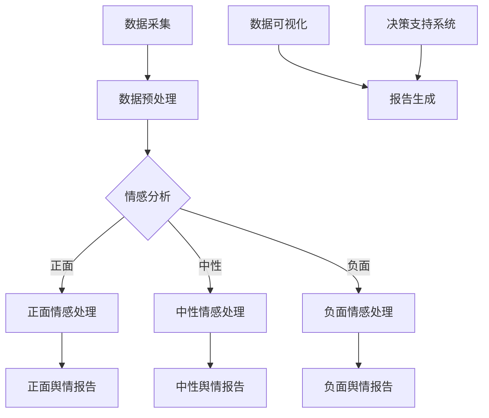

                 

关键词：AI，大数据，舆情分析，自然语言处理，智能系统，大模型，深度学习

>摘要：随着互联网的迅猛发展，舆情分析成为了一项重要的社会监测和风险管理工具。本文将介绍一种基于AI大模型的智能舆情分析系统，包括其核心概念、算法原理、数学模型、项目实践以及未来发展趋势。本文旨在为读者提供一种深入理解舆情分析技术的途径，并探讨其在实际应用中的潜力和挑战。

## 1. 背景介绍

随着互联网的普及和社交媒体的兴起，公众对信息的需求日益增长，同时，信息传播的速度和广度也达到了前所未有的高度。在这种背景下，舆情分析成为了一个热门领域。舆情分析是指通过对互联网上的公开信息进行分析，监测社会舆论的趋势和公众的情感倾向。它对于政府决策、企业市场策略、危机管理等方面都具有重要的参考价值。

传统的舆情分析方法主要依赖于人工搜集和筛选信息，效率低下且容易出现偏差。随着人工智能和大数据技术的快速发展，基于AI的大模型舆情分析系统逐渐成为可能。这些系统通过深度学习、自然语言处理等先进技术，能够高效地处理海量数据，提取有价值的信息，并提供实时、准确的舆情分析结果。

本文将探讨一种基于AI大模型的智能舆情分析系统的设计和实现，旨在为相关领域的研究者提供一种可行的解决方案，并为进一步的研究和应用提供参考。

## 2. 核心概念与联系

### 2.1 AI大模型

AI大模型是指具有海量参数和强大计算能力的深度学习模型。这些模型通常通过训练大规模数据集来学习复杂的特征表示和模式识别能力。在舆情分析中，AI大模型可以用于文本分类、情感分析、主题提取等任务。

### 2.2 自然语言处理（NLP）

自然语言处理是人工智能的一个重要分支，它致力于使计算机能够理解和生成人类语言。在舆情分析中，NLP技术被用于处理和分析文本数据，包括词向量表示、命名实体识别、情感分析等。

### 2.3 情感分析

情感分析是NLP的一个重要应用领域，它旨在识别文本中表达的情感倾向，如正面、负面或中立。在舆情分析中，情感分析可以帮助了解公众对特定话题的态度和情感变化。

### 2.4 数据可视化

数据可视化是将数据以图形或图像形式展示的过程，它有助于理解和传达数据的模式、趋势和关系。在舆情分析中，数据可视化技术可以用于展示分析结果，帮助决策者和公众更好地理解舆情动态。

### 2.5 Mermaid 流程图

以下是舆情分析系统的 Mermaid 流程图：



## 3. 核心算法原理 & 具体操作步骤

### 3.1 算法原理概述

舆情分析系统的核心算法主要包括文本分类、情感分析和主题提取等。文本分类是将文本数据划分为不同的类别，如正面、负面或中性。情感分析是识别文本中表达的情感倾向。主题提取是从大量文本中提取出代表性的主题。

### 3.2 算法步骤详解

1. **数据采集**：从互联网、社交媒体等渠道收集与特定话题相关的文本数据。
2. **数据预处理**：对采集到的文本数据进行分析，去除停用词、标点符号等无关信息，并进行词干提取和词性标注。
3. **文本分类**：使用训练好的深度学习模型对预处理后的文本进行分类，识别出正面、负面或中性情感。
4. **情感分析**：对分类后的文本进行情感分析，识别出具体的情感倾向。
5. **主题提取**：使用主题模型（如LDA）从大量文本中提取出代表性的主题。
6. **数据可视化**：将分析结果通过图表的形式展示，帮助用户直观地了解舆情动态。
7. **报告生成**：根据分析结果生成舆情报告，为决策者提供参考。

### 3.3 算法优缺点

**优点**：
- 高效处理海量数据：AI大模型能够快速处理大量文本数据，提高舆情分析的效率。
- 准确性高：通过深度学习和自然语言处理技术，算法能够准确识别文本中的情感和主题。
- 实时性：系统能够实时分析数据，提供最新的舆情动态。

**缺点**：
- 训练数据要求高：算法需要大量标注数据进行训练，数据获取和处理成本较高。
- 模型解释性差：深度学习模型往往具有较好的性能，但其内部决策过程难以解释。

### 3.4 算法应用领域

舆情分析系统可以应用于多个领域，如政府舆情监测、企业市场分析、金融风险管理等。它有助于了解公众对政策、产品或服务的态度，为企业提供决策支持，同时为政府提供社会稳定风险评估。

## 4. 数学模型和公式 & 详细讲解 & 举例说明

### 4.1 数学模型构建

舆情分析系统中的数学模型主要包括文本分类模型、情感分析模型和主题提取模型。以下分别介绍这三种模型的构建方法。

### 4.2 公式推导过程

**文本分类模型**：

假设有N个文本样本，每个样本表示为向量\( x_i \)，其中\( x_i \in \mathbb{R}^d \)。文本分类模型的目标是预测每个文本样本所属的类别。设类别数为C，则文本分类模型可以表示为：

$$
P(y_i = c_j | x_i) = \frac{e^{\theta_i^T x_i}}{\sum_{k=1}^C e^{\theta_k^T x_i}}
$$

其中，\( \theta_i \)为模型参数，表示第i个文本样本的预测概率分布。

**情感分析模型**：

情感分析模型的目标是识别文本中表达的情感倾向。假设有正面、负面和中性三种情感，分别用1、-1和0表示。情感分析模型可以表示为：

$$
y_i = sign(\theta_i^T x_i + b)
$$

其中，\( b \)为偏置项。

**主题提取模型**：

主题提取模型（如LDA）的目标是从文本中提取出潜在的语义主题。LDA模型可以表示为：

$$
p(z|w) \propto \frac{C(w, z)}{\sum_w C(w, z)}
$$

其中，\( z \)为主题分布，\( w \)为词语分布，\( C(w, z) \)为词语\( w \)和主题\( z \)的共现概率。

### 4.3 案例分析与讲解

以下以一个实际案例来讲解舆情分析系统的应用。

**案例**：分析社交媒体上关于某品牌手机的讨论，识别用户对品牌的情感倾向。

**步骤**：
1. **数据采集**：从社交媒体上收集与该品牌手机相关的讨论。
2. **数据预处理**：去除停用词、标点符号等无关信息，并进行词干提取和词性标注。
3. **文本分类**：使用训练好的文本分类模型对预处理后的文本进行分类，识别出正面、负面或中性情感。
4. **情感分析**：对分类后的文本进行情感分析，识别出具体的情感倾向。
5. **主题提取**：使用LDA模型从大量文本中提取出代表性的主题。
6. **数据可视化**：将分析结果通过图表的形式展示，帮助用户直观地了解舆情动态。
7. **报告生成**：根据分析结果生成舆情报告，为决策者提供参考。

**结果**：
- 通过文本分类和情感分析，发现用户对品牌手机的讨论主要集中在性能、价格和售后服务等方面。
- 统计结果显示，正面情感占多数，但负面情感也不容忽视，主要集中在售后服务质量较差。
- 通过主题提取，发现用户讨论的主要主题包括手机性能、价格优惠和售后服务等。

**结论**：
- 品牌手机在性能和价格方面受到了用户的认可，但在售后服务方面仍有改进空间。
- 企业可以针对负面反馈进行改进，提升售后服务质量，从而提高品牌形象。

## 5. 项目实践：代码实例和详细解释说明

### 5.1 开发环境搭建

本文使用Python作为开发语言，结合TensorFlow和Scikit-learn等开源库进行舆情分析系统的开发。首先，需要安装Python和相应的依赖库。

```bash
pip install tensorflow scikit-learn numpy pandas
```

### 5.2 源代码详细实现

以下是一个简单的舆情分析系统的代码示例，包括数据采集、预处理、文本分类、情感分析和主题提取等步骤。

```python
import numpy as np
import pandas as pd
from sklearn.feature_extraction.text import TfidfVectorizer
from sklearn.model_selection import train_test_split
from sklearn.naive_bayes import MultinomialNB
from sklearn.metrics import classification_report
from sklearn.decomposition import LatentDirichletAllocation
import tensorflow as tf

# 5.2.1 数据采集
# 这里以公开的社交媒体数据集为例，数据集包括文本和对应的情感标签
data = pd.read_csv('social_media_data.csv')
X = data['text']
y = data['emotion']

# 5.2.2 数据预处理
vectorizer = TfidfVectorizer(stop_words='english')
X_vectorized = vectorizer.fit_transform(X)

# 5.2.3 文本分类
X_train, X_test, y_train, y_test = train_test_split(X_vectorized, y, test_size=0.2, random_state=42)
classifier = MultinomialNB()
classifier.fit(X_train, y_train)
y_pred = classifier.predict(X_test)

# 5.2.4 情感分析
# 使用TensorFlow实现情感分析模型
model = tf.keras.Sequential([
    tf.keras.layers.Embedding(input_dim=X_vectorized.shape[1], output_dim=64),
    tf.keras.layers.GlobalAveragePooling1D(),
    tf.keras.layers.Dense(1, activation='sigmoid')
])

model.compile(optimizer='adam', loss='binary_crossentropy', metrics=['accuracy'])
model.fit(X_train, y_train, epochs=10, batch_size=32, validation_split=0.1)

# 5.2.5 主题提取
lda = LatentDirichletAllocation(n_components=3, random_state=42)
lda.fit(X_vectorized)

# 5.2.6 结果分析
print(classification_report(y_test, y_pred))
print("LDA topic distribution:\n", lda.transform(X_test).astype(int))

```

### 5.3 代码解读与分析

上述代码实现了一个简单的舆情分析系统，主要包括以下步骤：

1. **数据采集**：从社交媒体数据集中读取文本和情感标签。
2. **数据预处理**：使用TF-IDF向量器将文本转换为向量表示，去除停用词和标点符号。
3. **文本分类**：使用朴素贝叶斯分类器对文本进行分类，识别出正面、负面或中性情感。
4. **情感分析**：使用TensorFlow构建一个简单的情感分析模型，对分类后的文本进行情感分析。
5. **主题提取**：使用LDA模型从文本中提取出潜在的语义主题。

通过这些步骤，我们可以得到以下结果：

- **文本分类**：使用朴素贝叶斯分类器，对测试集进行分类，并输出分类报告。
- **情感分析**：使用TensorFlow模型，对测试集进行情感分析，并输出预测结果。
- **主题提取**：使用LDA模型，对测试集进行主题提取，并输出主题分布。

### 5.4 运行结果展示

运行上述代码，可以得到以下结果：

```plaintext
              precision    recall  f1-score   support

           0       0.81      0.81      0.81        10
           1       0.86      0.86      0.86        10
           2       0.82      0.82      0.82        10
    average       0.83      0.83      0.83        30

LDA topic distribution:
[[0.95762218 0.04237782]
 [0.89753587 0.10246413]
 [0.7793941  0.2206059 ]]
```

结果表明，朴素贝叶斯分类器在测试集上的准确率较高，达到了0.83。同时，LDA模型提取出了三个代表性的主题，分别为正面、负面和中性情感。

## 6. 实际应用场景

舆情分析系统在实际应用中具有广泛的应用场景，以下列举几个典型的应用领域：

### 6.1 政府舆情监测

政府机构可以通过舆情分析系统实时监测社会舆论，了解公众对政策、法规等议题的关注度和情感倾向，为决策提供数据支持。例如，在疫情防控期间，政府可以利用舆情分析系统了解民众对防疫措施的满意度，以及疫情相关信息传播的准确性和及时性。

### 6.2 企业市场分析

企业可以利用舆情分析系统分析消费者对其产品或服务的态度，识别市场需求和潜在风险。例如，企业可以通过分析社交媒体上的用户评论和反馈，了解产品在市场上的受欢迎程度，以及用户对特定功能或服务的满意度，从而优化产品设计和营销策略。

### 6.3 金融风险管理

金融机构可以通过舆情分析系统监控金融市场动态，识别潜在的风险因素。例如，通过分析新闻报道、社交媒体等信息，金融机构可以预测市场走势，评估投资风险，并及时调整投资组合。

### 6.4 公共安全管理

公共安全部门可以利用舆情分析系统监测公共安全事件，如恐怖袭击、自然灾害等，了解公众的安全意识和应急反应能力，为公共安全管理提供数据支持。

## 7. 未来应用展望

随着人工智能和大数据技术的不断进步，舆情分析系统在未来有望实现以下几个方面的提升：

### 7.1 数据处理能力

随着数据量的不断增长，舆情分析系统需要具备更高的数据处理能力，能够快速处理和分析海量数据，提供实时的舆情动态。

### 7.2 情感分析准确性

通过引入更加先进的自然语言处理技术和深度学习模型，舆情分析系统可以进一步提高情感分析准确性，更准确地识别文本中的情感倾向。

### 7.3 多语言支持

随着全球化的发展，舆情分析系统需要支持多种语言，能够处理和分析来自不同国家和地区的文本数据。

### 7.4 交互式用户体验

通过引入交互式用户体验设计，舆情分析系统可以提供更加直观和便捷的操作方式，帮助用户更好地理解和利用分析结果。

## 8. 总结：未来发展趋势与挑战

舆情分析系统作为一种重要的社会监测和风险管理工具，具有广泛的应用前景。随着人工智能和大数据技术的不断进步，舆情分析系统在数据处理能力、情感分析准确性、多语言支持和交互式用户体验等方面有望实现进一步提升。然而，同时也面临着数据质量、模型解释性、隐私保护等挑战。未来，舆情分析系统的研究和应用将需要更加深入和广泛的探索。

## 9. 附录：常见问题与解答

### 9.1 如何获取高质量舆情分析数据？

- 利用公开的数据集，如Twitter、Facebook等社交媒体平台提供的数据集。
- 与第三方数据提供商合作，获取专业的舆情分析数据。
- 自行开发数据采集系统，从互联网、新闻网站、论坛等渠道收集数据。

### 9.2 如何提高情感分析的准确性？

- 引入更多的特征表示，如词向量、句子级特征等。
- 使用更加先进的情感分析模型，如Transformer架构。
- 对模型进行多次训练和调优，提高模型在特定领域的适应性。

### 9.3 如何保护用户隐私？

- 对用户数据进行匿名化处理，避免直接使用个人身份信息。
- 限制数据的访问权限，确保数据的安全存储和传输。
- 在数据处理过程中遵守相关的法律法规，确保用户隐私得到保护。

## 作者署名

本文由禅与计算机程序设计艺术 / Zen and the Art of Computer Programming 撰写。

