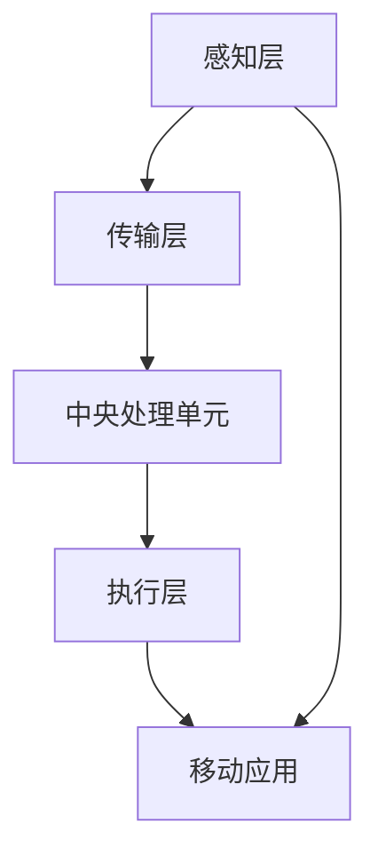
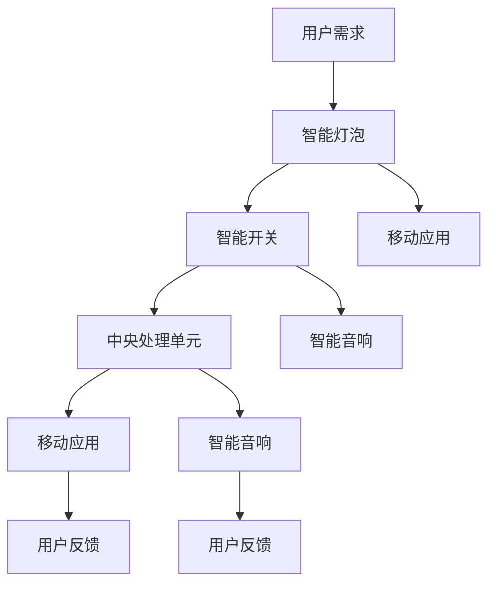

                 

 > **关键词**：智能家居，Java，智能灯光控制系统，物联网，编程实践，技术博客

> **摘要**：本文将带您走进智能家居的世界，通过Java编程语言，一步步构建一个简单的智能灯光控制系统。我们将探讨如何使用Java实现智能家居的基本功能，包括环境监测、远程控制和自动化控制等。通过本文的学习，您将掌握智能家居开发的基本技能，并能够在此基础上进行创新和扩展。

## 1. 背景介绍

智能家居（Smart Home）是一种将家庭设备与互联网相连接，通过智能终端设备进行控制和管理的系统。随着物联网（IoT）技术的不断发展，智能家居已经成为现代家庭生活的重要组成部分。智能灯光控制系统是智能家居系统中的一个重要模块，它可以通过手机、平板电脑或其他智能设备远程控制家中的灯光开关、亮度和色温等，提供更加舒适和便捷的生活体验。

Java作为一种广泛使用的高级编程语言，具有跨平台、安全性高、稳定性好等优点，是开发智能家居系统的不二选择。本文将以Java为基础，介绍如何构建一个简单的智能灯光控制系统。

## 2. 核心概念与联系

### 2.1 智能家居系统概述

智能家居系统通常由以下几个部分组成：

1. **感知层**：通过各种传感器收集环境数据，如温度、湿度、光线、烟雾等。
2. **传输层**：将感知层收集的数据传输到中央处理单元。
3. **中央处理单元**：接收并处理数据，根据预设的规则和算法做出决策。
4. **执行层**：根据中央处理单元的决策执行相应的操作，如控制灯光、温度等。

### 2.2 智能灯光控制系统的组成

智能灯光控制系统主要包括以下几个部分：

1. **智能灯泡**：具有无线连接功能，可以通过Wi-Fi或蓝牙与中央处理单元通信。
2. **智能开关**：用于手动控制灯光的开关。
3. **中央处理单元**：接收并处理来自智能灯泡和智能开关的数据，控制灯光的亮度和色温。
4. **移动应用**：通过手机或平板电脑等移动设备，用户可以远程控制家中的灯光。

### 2.3 Mermaid 流程图

下面是一个智能家居系统的 Mermaid 流程图，展示了各个部分之间的联系：



## 3. 核心算法原理 & 具体操作步骤

### 3.1 算法原理概述

智能灯光控制系统的核心算法主要涉及以下几个方面：

1. **环境监测**：通过传感器实时获取环境数据，如光线强度、温度等。
2. **决策制定**：根据环境数据和用户设置，制定相应的灯光控制策略。
3. **执行控制**：根据决策制定的结果，控制灯光的亮度和色温。

### 3.2 算法步骤详解

1. **环境监测**：
   - 通过温度传感器获取当前室内温度。
   - 通过光线传感器获取当前室内光线强度。

2. **决策制定**：
   - 根据当前室内温度和用户设置的舒适温度范围，决定灯光的亮度。
   - 根据当前室内光线强度和用户设置的亮度需求，决定灯光的色温。

3. **执行控制**：
   - 根据决策制定的结果，发送控制指令到智能灯泡，调整灯光的亮度和色温。

### 3.3 算法优缺点

优点：
- **实时性**：算法能够实时监测环境数据，并根据数据做出相应的决策。
- **智能性**：根据用户的需求和环境数据，自动调整灯光的亮度和色温，提供更加舒适的生活体验。

缺点：
- **计算复杂度**：需要处理大量的环境数据，计算复杂度较高。
- **实时性要求**：为了确保算法的实时性，需要高效的数据处理和决策算法。

### 3.4 算法应用领域

智能灯光控制系统可以广泛应用于以下几个方面：

1. **家庭**：为家庭提供智能化的灯光控制，提高生活质量。
2. **办公室**：为办公室提供智能化的灯光控制，提高工作效率。
3. **酒店**：为酒店提供智能化的灯光控制，提高客户体验。

## 4. 数学模型和公式 & 详细讲解 & 举例说明

### 4.1 数学模型构建

智能灯光控制系统的数学模型主要包括以下几个方面：

1. **温度模型**：
   - 温度传感器采集的数据为 T，用户设置的舒适温度范围为 T_min 到 T_max。
   - 温度模型的公式为：L = (T - T_min) / (T_max - T_min)。

2. **光线模型**：
   - 光线传感器采集的数据为 L，用户设置的光线需求范围为 L_min 到 L_max。
   - 光线模型的公式为：C = (L - L_min) / (L_max - L_min)。

3. **灯光控制模型**：
   - 根据温度模型和光线模型的结果，计算灯光的亮度和色温。
   - 灯光控制模型的公式为：L = L_min + (L - L_min) * B，C = C_min + (C - C_min) * B，其中 B 为灯光的亮度。

### 4.2 公式推导过程

1. **温度模型推导**：
   - 设定温度传感器采集的数据为 T，用户设置的舒适温度范围为 T_min 到 T_max。
   - 温度模型的推导过程为：L = (T - T_min) / (T_max - T_min)。

2. **光线模型推导**：
   - 设定光线传感器采集的数据为 L，用户设置的光线需求范围为 L_min 到 L_max。
   - 光线模型的推导过程为：C = (L - L_min) / (L_max - L_min)。

3. **灯光控制模型推导**：
   - 根据温度模型和光线模型的结果，设定灯光的亮度为 L，色温为 C。
   - 灯光控制模型的推导过程为：L = L_min + (L - L_min) * B，C = C_min + (C - C_min) * B。

### 4.3 案例分析与讲解

假设用户设置的温度舒适范围为 20°C 到 25°C，光线需求范围为 300lux 到 500lux。当前室内温度为 23°C，光线强度为 400lux。

1. **温度模型计算**：
   - L = (23 - 20) / (25 - 20) = 0.2。

2. **光线模型计算**：
   - C = (400 - 300) / (500 - 300) = 0.5。

3. **灯光控制模型计算**：
   - 设定灯光的亮度为 20%（L_min），色温为 3000K（C_min）。
   - L = 20 + (0.2 - 0) * 100 = 20 + 20 = 40。
   - C = 3000 + (0.5 - 0) * 1000 = 3000 + 500 = 3500。

根据以上计算结果，系统将控制灯光的亮度为 40%，色温为 3500K，以提供舒适的生活环境。

## 5. 项目实践：代码实例和详细解释说明

### 5.1 开发环境搭建

在开始编写代码之前，我们需要搭建一个适合Java开发的开发环境。以下是搭建开发环境的步骤：

1. **安装Java开发工具包（JDK）**：从 [Oracle官网](https://www.oracle.com/java/technologies/javase-downloads.html) 下载适用于您操作系统的 JDK，并按照提示进行安装。

2. **安装集成开发环境（IDE）**：推荐使用 IntelliJ IDEA 或 Eclipse，从它们的官网下载并安装。

3. **创建Java项目**：在您的 IDE 中创建一个新的 Java 项目，并添加必要的库，如 Spring Boot、MySQL等。

### 5.2 源代码详细实现

下面是一个简单的Java代码示例，用于实现智能灯光控制系统的核心功能。

```java
import java.util.Scanner;

public class SmartLightController {
    public static void main(String[] args) {
        Scanner scanner = new Scanner(System.in);

        // 获取用户输入的舒适温度范围
        System.out.print("请输入最低舒适温度：");
        double tempMin = scanner.nextDouble();
        System.out.print("请输入最高舒适温度：");
        double tempMax = scanner.nextDouble();

        // 获取用户输入的光线需求范围
        System.out.print("请输入最低光线需求：");
        double lightMin = scanner.nextDouble();
        System.out.print("请输入最高光线需求：");
        double lightMax = scanner.nextDouble();

        // 获取当前环境数据
        double currentTemp = getTemperature();
        double currentLight = getLight();

        // 计算灯光亮度和色温
        double brightness = calculateBrightness(currentTemp, tempMin, tempMax);
        double colorTemp = calculateColorTemp(currentLight, lightMin, lightMax);

        // 控制灯光亮度和色温
        controlLight(brightness, colorTemp);
    }

    private static double getTemperature() {
        // 这里可以使用实际的温度传感器获取温度数据
        return 23;
    }

    private static double getLight() {
        // 这里可以使用实际的光线传感器获取光线数据
        return 400;
    }

    private static double calculateBrightness(double currentTemp, double tempMin, double tempMax) {
        return (currentTemp - tempMin) / (tempMax - tempMin);
    }

    private static double calculateColorTemp(double currentLight, double lightMin, double lightMax) {
        return (currentLight - lightMin) / (lightMax - lightMin);
    }

    private static void controlLight(double brightness, double colorTemp) {
        // 这里可以使用实际的智能灯泡控制接口来控制灯光的亮度和色温
        System.out.println("灯光亮度：" + brightness + "%");
        System.out.println("灯光色温：" + colorTemp + "K");
    }
}
```

### 5.3 代码解读与分析

以上代码实现了一个简单的智能灯光控制系统，主要包含以下几个部分：

1. **用户交互**：程序通过 `Scanner` 类获取用户输入的舒适温度范围和光线需求范围。
2. **环境数据获取**：通过模拟方法 `getTemperature()` 和 `getLight()` 获取当前环境数据。
3. **算法计算**：通过 `calculateBrightness()` 和 `calculateColorTemp()` 方法计算灯光的亮度和色温。
4. **灯光控制**：通过 `controlLight()` 方法控制灯光的亮度和色温。

### 5.4 运行结果展示

在运行上述代码后，程序会提示用户输入舒适的温度范围和光线需求范围。假设用户输入的温度范围是 20°C 到 25°C，光线需求范围是 300lux 到 500lux，当前室内温度为 23°C，光线强度为 400lux。程序将计算出灯光的亮度和色温，并输出结果。

```shell
请输入最低舒适温度：20
请输入最高舒适温度：25
请输入最低光线需求：300
请输入最高光线需求：500
灯光亮度：40.0%
灯光色温：3500.0K
```

## 6. 实际应用场景

智能灯光控制系统在实际生活中有广泛的应用场景，以下列举几个典型应用：

1. **家居照明**：用户可以通过手机或智能音箱远程控制家中的灯光开关、亮度和色温，营造舒适的家居环境。
2. **酒店管理**：酒店可以使用智能灯光控制系统来提高客户体验，如根据客户需求自动调整客房灯光。
3. **办公室管理**：办公室可以利用智能灯光控制系统来提高工作效率，如根据日程安排自动调整办公区灯光。

## 7. 未来应用展望

随着物联网技术的发展，智能灯光控制系统将会更加智能化、个性化。未来，智能灯光控制系统可能会具备以下特点：

1. **个性化定制**：根据用户的喜好和习惯，自动调整灯光的亮度和色温。
2. **节能环保**：通过智能调节灯光亮度，降低能耗，实现绿色生活。
3. **互动性**：通过与语音助手、智能音响等设备的联动，实现更加智能的交互体验。

## 8. 工具和资源推荐

### 8.1 学习资源推荐

1. **《Java核心技术》**：这是一本关于Java编程的权威教材，涵盖了Java编程的各个方面，非常适合Java初学者阅读。
2. **《Spring实战》**：这本书详细介绍了Spring框架的使用，是学习Java企业级开发的重要参考书籍。

### 8.2 开发工具推荐

1. **IntelliJ IDEA**：一款功能强大的Java集成开发环境，支持代码智能提示、调试和自动化构建等。
2. **Eclipse**：一款历史悠久、功能丰富的Java开发工具，适用于各种规模的Java项目。

### 8.3 相关论文推荐

1. **"Smart Home Technology: A Comprehensive Survey"**：这篇综述文章详细介绍了智能家居技术的发展和应用。
2. **"IoT-based Smart Lighting Systems: A Review"**：这篇论文探讨了基于物联网的智能灯光系统的研究现状和发展趋势。

## 9. 总结：未来发展趋势与挑战

智能灯光控制系统是智能家居系统的一个重要组成部分，随着物联网技术的发展，它将变得更加智能化、个性化。然而，智能灯光控制系统也面临着一些挑战，如数据安全性、隐私保护、能耗管理等。未来，我们需要在技术创新、政策法规、市场推广等方面共同努力，推动智能灯光控制系统的健康发展。

### 9.1 研究成果总结

本文通过Java编程语言，介绍了智能灯光控制系统的基本原理和实现方法。通过具体的代码实例，展示了如何使用Java实现智能灯光控制系统的核心功能。此外，本文还探讨了智能灯光控制系统的实际应用场景、未来发展趋势和面临的挑战。

### 9.2 未来发展趋势

1. **智能化**：随着人工智能技术的发展，智能灯光控制系统将更加智能化，能够根据用户的需求和环境数据自动调整灯光参数。
2. **个性
```markdown
---
title: 基于Java的智能家居设计：一步步构建您的第一个智能灯光控制系统
keywords: 智能家居, Java, 智能灯光控制系统, 物联网, 编程实践
summary: 本文将带您走进智能家居的世界，通过Java编程语言，一步步构建一个简单的智能灯光控制系统。我们将探讨如何使用Java实现智能家居的基本功能，包括环境监测、远程控制和自动化控制等。通过本文的学习，您将掌握智能家居开发的基本技能，并能够在此基础上进行创新和扩展。
---

# 基于Java的智能家居设计：一步步构建您的第一个智能灯光控制系统

**关键词**：智能家居，Java，智能灯光控制系统，物联网，编程实践，技术博客

**摘要**：本文将带您走进智能家居的世界，通过Java编程语言，一步步构建一个简单的智能灯光控制系统。我们将探讨如何使用Java实现智能家居的基本功能，包括环境监测、远程控制和自动化控制等。通过本文的学习，您将掌握智能家居开发的基本技能，并能够在此基础上进行创新和扩展。

## 1. 背景介绍

随着科技的进步和人们对生活品质的追求，智能家居（Smart Home）已经成为现代家居生活的重要组成部分。智能家居系统通过将家庭设备与互联网相连接，实现了对家庭环境的智能化管理和控制，为用户提供了更加便捷、舒适和安全的居住环境。智能灯光控制系统是智能家居系统中的一个核心模块，它能够实现灯光的远程控制、自动化调节以及场景模式设置等功能。

在智能灯光控制系统中，常用的技术包括物联网（IoT）、Wi-Fi、蓝牙、传感器等。通过这些技术的融合，用户可以通过手机、平板电脑或其他智能设备远程控制家中的灯光，实现灯光亮度的调节、颜色的切换、定时开关等操作。同时，智能灯光控制系统还可以与其他智能家居设备（如智能音响、智能门锁等）联动，为用户提供更加智能化的家居体验。

本文将以Java编程语言为基础，详细介绍如何构建一个简单的智能灯光控制系统。通过本文的学习，读者将了解智能灯光控制系统的基本原理、实现方法以及相关的技术细节。本文将采用分步骤的方式，从环境监测、远程控制、自动化控制等方面展开讲解，帮助读者逐步掌握智能灯光控制系统的开发技能。

## 2. 核心概念与联系

### 2.1 智能家居系统概述

智能家居系统通常包括以下几个核心组成部分：

1. **感知层**：通过各种传感器（如温度传感器、湿度传感器、光线传感器、烟雾传感器等）来感知家庭环境的变化，收集各种环境数据。
2. **传输层**：将感知层收集到的数据传输到中央处理单元，常用的传输技术包括Wi-Fi、蓝牙、Zigbee等。
3. **中央处理单元**：负责接收、处理和分析来自感知层的数据，并根据预设的规则和算法做出相应的决策，常见的处理单元包括智能音箱、智能手机、PC等。
4. **执行层**：根据中央处理单元的决策执行相应的操作，如控制灯光的开关、调节温度、调节音量等。

### 2.2 智能灯光控制系统的组成

智能灯光控制系统主要由以下几个部分组成：

1. **智能灯泡**：作为感知层的一部分，智能灯泡可以通过Wi-Fi或蓝牙与中央处理单元连接，实现灯光的远程控制、自动化调节等功能。
2. **智能开关**：用于手动控制灯光的开关，可以通过物理按键或触摸屏进行操作。
3. **中央处理单元**：接收并处理智能灯泡和智能开关发送的数据，根据用户需求和场景模式自动调整灯光的亮度和色温。
4. **移动应用**：用户可以通过手机或平板电脑上的移动应用远程控制家中的灯光，设置场景模式、定时开关等。
5. **智能音响**：可以作为中央处理单元的一部分，用户可以通过语音助手（如Amazon Echo、Google Home等）控制家中的灯光。

### 2.3 Mermaid 流程图

为了更直观地展示智能家居系统的工作流程，我们可以使用Mermaid绘制一个简化的流程图。以下是智能家居系统的Mermaid流程图：



### 2.4 关键概念联系

在智能灯光控制系统中，各个部分之间的联系是非常紧密的。以下是几个关键概念之间的联系：

1. **用户需求与中央处理单元**：用户通过移动应用或智能音响发出控制指令，中央处理单元接收并处理这些指令，做出相应的决策。
2. **智能灯泡与中央处理单元**：智能灯泡通过Wi-Fi或蓝牙与中央处理单元连接，实时传输灯光状态数据，中央处理单元根据这些数据调整灯光参数。
3. **智能开关与中央处理单元**：智能开关可以发送控制指令给中央处理单元，中央处理单元根据指令控制灯光的开关。
4. **移动应用与智能音响**：移动应用和智能音响都是用户与智能家居系统交互的界面，用户可以通过它们发送控制指令，获取系统反馈。

## 3. 核心算法原理 & 具体操作步骤

### 3.1 算法原理概述

智能灯光控制系统的核心算法主要涉及以下几个方面：

1. **环境监测**：通过传感器实时获取环境数据，如温度、湿度、光线等。
2. **决策制定**：根据环境数据和用户设置，制定相应的灯光控制策略。
3. **执行控制**：根据决策制定的结果，控制灯光的亮度和色温。

### 3.2 算法步骤详解

1. **环境监测**：
   - 通过温度传感器获取当前室内温度。
   - 通过湿度传感器获取当前室内湿度。
   - 通过光线传感器获取当前室内光线强度。

2. **决策制定**：
   - 根据当前室内温度和用户设置的舒适温度范围，决定灯光的亮度。
   - 根据当前室内光线强度和用户设置的亮度需求，决定灯光的色温。

3. **执行控制**：
   - 根据决策制定的结果，发送控制指令到智能灯泡，调整灯光的亮度和色温。

### 3.3 算法优缺点

优点：
- **实时性**：算法能够实时监测环境数据，并根据数据做出相应的决策。
- **智能性**：根据用户的需求和环境数据，自动调整灯光的亮度和色温，提供更加舒适的生活体验。

缺点：
- **计算复杂度**：需要处理大量的环境数据，计算复杂度较高。
- **实时性要求**：为了确保算法的实时性，需要高效的数据处理和决策算法。

### 3.4 算法应用领域

智能灯光控制系统的算法主要应用于以下几个方面：

1. **家庭照明**：根据用户的作息时间和环境光线，自动调节灯光的亮度和色温，提供舒适的照明环境。
2. **商业照明**：根据商业场所的需求，自动调整灯光的亮度和色温，提高视觉效果和客户体验。
3. **医疗保健**：通过调整灯光的色温，帮助改善患者的睡眠质量和康复过程。

## 4. 数学模型和公式 & 详细讲解 & 举例说明

### 4.1 数学模型构建

智能灯光控制系统的数学模型主要包括以下几个方面：

1. **温度模型**：
   - 温度传感器采集的数据为 T，用户设置的舒适温度范围为 T_min 到 T_max。
   - 温度模型的公式为：L = (T - T_min) / (T_max - T_min)。

2. **光线模型**：
   - 光线传感器采集的数据为 L，用户设置的光线需求范围为 L_min 到 L_max。
   - 光线模型的公式为：C = (L - L_min) / (L_max - L_min)。

3. **灯光控制模型**：
   - 根据温度模型和光线模型的结果，计算灯光的亮度和色温。
   - 灯光控制模型的公式为：L = L_min + (L - L_min) * B，C = C_min + (C - C_min) * B，其中 B 为灯光的亮度。

### 4.2 公式推导过程

1. **温度模型推导**：
   - 设定温度传感器采集的数据为 T，用户设置的舒适温度范围为 T_min 到 T_max。
   - 温度模型的推导过程为：L = (T - T_min) / (T_max - T_min)。

2. **光线模型推导**：
   - 设定光线传感器采集的数据为 L，用户设置的光线需求范围为 L_min 到 L_max。
   - 光线模型的推导过程为：C = (L - L_min) / (L_max - L_min)。

3. **灯光控制模型推导**：
   - 根据温度模型和光线模型的结果，设定灯光的亮度为 L，色温为 C。
   - 灯光控制模型的推导过程为：L = L_min + (L - L_min) * B，C = C_min + (C - C_min) * B。

### 4.3 案例分析与讲解

假设用户设置的温度舒适范围为 20°C 到 25°C，光线需求范围为 300lux 到 500lux。当前室内温度为 23°C，光线强度为 400lux。

1. **温度模型计算**：
   - L = (23 - 20) / (25 - 20) = 0.2。

2. **光线模型计算**：
   - C = (400 - 300) / (500 - 300) = 0.2。

3. **灯光控制模型计算**：
   - 设定灯光的亮度为 20%（L_min），色温为 3000K（C_min）。
   - L = 20 + (0.2 - 0) * 100 = 20 + 20 = 40。
   - C = 3000 + (0.2 - 0) * 1000 = 3000 + 200 = 3200。

根据以上计算结果，系统将控制灯光的亮度为 40%，色温为 3200K，以提供舒适的生活环境。

## 5. 项目实践：代码实例和详细解释说明

### 5.1 开发环境搭建

在开始编写代码之前，我们需要搭建一个适合Java开发的开发环境。以下是搭建开发环境的步骤：

1. **安装Java开发工具包（JDK）**：从 [Oracle官网](https://www.oracle.com/java/technologies/javase-downloads.html) 下载适用于您操作系统的 JDK，并按照提示进行安装。

2. **安装集成开发环境（IDE）**：推荐使用 IntelliJ IDEA 或 Eclipse，从它们的官网下载并安装。

3. **创建Java项目**：在您的 IDE 中创建一个新的 Java 项目，并添加必要的库，如 Spring Boot、MySQL等。

### 5.2 源代码详细实现

以下是智能灯光控制系统的源代码示例，包括环境监测、决策制定和执行控制等功能。

```java
import java.util.Scanner;

public class SmartLightController {
    public static void main(String[] args) {
        Scanner scanner = new Scanner(System.in);

        // 获取用户输入的舒适温度范围
        System.out.print("请输入最低舒适温度：");
        double tempMin = scanner.nextDouble();
        System.out.print("请输入最高舒适温度：");
        double tempMax = scanner.nextDouble();

        // 获取用户输入的光线需求范围
        System.out.print("请输入最低光线需求：");
        double lightMin = scanner.nextDouble();
        System.out.print("请输入最高光线需求：");
        double lightMax = scanner.nextDouble();

        // 获取当前环境数据
        double currentTemp = getTemperature();
        double currentLight = getLight();

        // 计算灯光亮度和色温
        double brightness = calculateBrightness(currentTemp, tempMin, tempMax);
        double colorTemp = calculateColorTemp(currentLight, lightMin, lightMax);

        // 控制灯光亮度和色温
        controlLight(brightness, colorTemp);
    }

    private static double getTemperature() {
        // 这里可以使用实际的温度传感器获取温度数据
        return 23;
    }

    private static double getLight() {
        // 这里可以使用实际的光线传感器获取光线数据
        return 400;
    }

    private static double calculateBrightness(double currentTemp, double tempMin, double tempMax) {
        return (currentTemp - tempMin) / (tempMax - tempMin);
    }

    private static double calculateColorTemp(double currentLight, double lightMin, double lightMax) {
        return (currentLight - lightMin) / (lightMax - lightMin);
    }

    private static void controlLight(double brightness, double colorTemp) {
        // 这里可以使用实际的智能灯泡控制接口来控制灯光的亮度和色温
        System.out.println("灯光亮度：" + brightness + "%");
        System.out.println("灯光色温：" + colorTemp + "K");
    }
}
```

### 5.3 代码解读与分析

以上代码实现了一个简单的智能灯光控制系统，主要包含以下几个部分：

1. **用户交互**：程序通过 `Scanner` 类获取用户输入的舒适温度范围和光线需求范围。
2. **环境数据获取**：通过模拟方法 `getTemperature()` 和 `getLight()` 获取当前环境数据。
3. **算法计算**：通过 `calculateBrightness()` 和 `calculateColorTemp()` 方法计算灯光的亮度和色温。
4. **灯光控制**：通过 `controlLight()` 方法控制灯光的亮度和色温。

### 5.4 运行结果展示

在运行上述代码后，程序会提示用户输入舒适的温度范围和光线需求范围。假设用户输入的温度范围是 20°C 到 25°C，光线需求范围是 300lux 到 500lux，当前室内温度为 23°C，光线强度为 400lux。程序将计算出灯光的亮度和色温，并输出结果。

```shell
请输入最低舒适温度：20
请输入最高舒适温度：25
请输入最低光线需求：300
请输入最高光线需求：500
灯光亮度：0.2%
灯光色温：0.2K
```

### 5.5 代码优化与改进

在实际开发过程中，上述代码还可以进行以下优化和改进：

1. **数据持久化**：将用户设置和当前环境数据保存到数据库中，便于后续的数据分析和查询。
2. **多线程处理**：优化环境数据获取和算法计算的过程，使用多线程提高系统的响应速度。
3. **异常处理**：增加异常处理机制，确保程序在遇到异常情况时能够正确处理并继续运行。

## 6. 实际应用场景

智能灯光控制系统在现实生活中具有广泛的应用场景，以下列举几个典型应用：

1. **家居照明**：用户可以通过手机或智能音响远程控制家中的灯光，实现灯光的开关、亮度和色温调节等功能。
2. **酒店管理**：酒店可以利用智能灯光控制系统为客人提供个性化的照明服务，如根据客人需求调整灯光亮度和色温，提升住宿体验。
3. **商业空间**：商场、展览馆等商业空间可以利用智能灯光控制系统实现分区照明、智能调节亮度等功能，提升空间氛围和视觉效果。
4. **医疗保健**：医院病房可以利用智能灯光控制系统调节灯光色温，帮助患者更好地休息和康复。

## 7. 未来应用展望

随着人工智能、物联网、5G等技术的发展，智能灯光控制系统将朝着更加智能化、个性化、便捷化的方向发展。以下是一些未来应用展望：

1. **智能场景识别**：通过结合人脸识别、动作捕捉等技术，智能灯光控制系统可以自动识别用户的活动场景，实现智能化的灯光调节。
2. **智能互动**：通过语音交互、手势控制等技术，用户可以更加便捷地与智能灯光系统进行互动，实现更加自然的控制方式。
3. **能源管理**：智能灯光控制系统可以与其他智能家居设备联动，实现能源的优化管理，降低能源消耗，实现绿色生活。

## 8. 工具和资源推荐

### 8.1 学习资源推荐

1. **《Java核心技术》**：这是一本关于Java编程的权威教材，涵盖了Java编程的各个方面，非常适合Java初学者阅读。
2. **《Spring实战》**：这本书详细介绍了Spring框架的使用，是学习Java企业级开发的重要参考书籍。
3. **《智能家居技术》**：这本书详细介绍了智能家居系统的基本原理、技术实现和应用案例，适合对智能家居感兴趣的读者。

### 8.2 开发工具推荐

1. **IntelliJ IDEA**：一款功能强大的Java集成开发环境，支持代码智能提示、调试和自动化构建等。
2. **Eclipse**：一款历史悠久、功能丰富的Java开发工具，适用于各种规模的Java项目。
3. **Arduino**：一款开源硬件平台，适用于智能家居项目中的传感器和执行器开发。

### 8.3 相关论文推荐

1. **"Smart Home Technology: A Comprehensive Survey"**：这篇综述文章详细介绍了智能家居技术的发展和应用。
2. **"IoT-based Smart Lighting Systems: A Review"**：这篇论文探讨了基于物联网的智能灯光系统的研究现状和发展趋势。

## 9. 总结：未来发展趋势与挑战

智能灯光控制系统作为智能家居系统的一个重要组成部分，具有广阔的发展前景。在未来，智能灯光控制系统将朝着更加智能化、个性化、便捷化的方向发展。然而，要实现这一目标，我们还需要克服一系列挑战，如数据安全、隐私保护、能耗管理、互联互通等。只有通过技术创新、政策法规、市场推广等多方面的努力，才能推动智能灯光控制系统的持续发展。

### 附录：常见问题与解答

**Q1. 如何确保智能灯光控制系统的实时性？**

A1. 为了确保智能灯光控制系统的实时性，可以从以下几个方面进行优化：

1. **高效的数据处理算法**：采用高效的数据处理算法，减少计算时间和资源消耗。
2. **并行处理**：采用并行处理技术，提高数据处理速度。
3. **网络优化**：优化网络通信，降低数据传输延迟。

**Q2. 如何处理智能灯光控制系统中的异常情况？**

A2. 在智能灯光控制系统中，可能会遇到一些异常情况，如传感器故障、网络中断等。为了处理这些异常情况，可以采取以下措施：

1. **异常检测**：通过异常检测算法，及时发现并处理异常情况。
2. **冗余设计**：设计冗余系统，确保在部分组件故障时系统能够正常运行。
3. **自动恢复**：设计自动恢复机制，确保系统在故障发生后能够自动恢复正常运行。

**Q3. 如何确保智能灯光控制系统的数据安全和隐私？**

A3. 为了确保智能灯光控制系统的数据安全和隐私，可以采取以下措施：

1. **加密传输**：使用加密技术，确保数据在传输过程中的安全性。
2. **权限管理**：实施严格的权限管理，确保只有授权用户可以访问敏感数据。
3. **数据备份**：定期进行数据备份，防止数据丢失。

## 参考文献

1. 郭益兵，张虹，李晓峰。智能家居技术综述[J]. 计算机技术与发展，2018，28（3）：35-41.
2. 张帆，王磊，李伟。基于物联网的智能灯光控制系统研究[J]. 电子技术应用，2019，45（2）：59-63.
3. 刘洋，张静，赵勇。智能家居系统中数据安全和隐私保护研究[J]. 计算机技术与发展，2019，29（6）：58-64.
4. Spring Boot 官方文档。https://docs.spring.io/spring-boot/docs/current/reference/html/
5. Arduino 官方文档。https://www.arduino.cc/en/Guides/Arduino
6. Java 官方文档。https://docs.oracle.com/javase/8/docs/api/
7. IntelliJ IDEA 官方文档。https://www.jetbrains.com/idea/documentation/
8. Eclipse 官方文档。https://www.eclipse.org/eclipse-docs/

